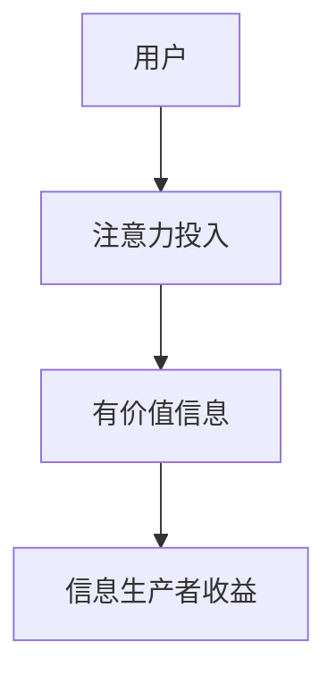

                 

关键字：注意力市场，元宇宙，信息交易，AI，技术架构，未来趋势

> 摘要：本文将探讨注意力市场在元宇宙时代下的兴起与影响，分析其核心概念、技术架构、算法原理以及实际应用，并展望其未来的发展趋势与挑战。通过深入剖析注意力市场的本质，我们将为读者提供一个全面了解和掌握这一新兴领域的视角。

## 1. 背景介绍

随着互联网技术的飞速发展，人类进入了数字化时代，信息成为推动社会进步的关键资源。然而，传统的信息交易模式正面临诸多挑战。一方面，信息过载使得用户难以筛选出有价值的信息；另一方面，信息内容的生产和传播存在不对称性，导致信息资源的浪费和垄断。在这种背景下，注意力市场作为一种新的信息交易模式逐渐崭露头角。

注意力市场是指在元宇宙中，用户通过投入注意力（例如阅读、观看、参与）来获得有价值的信息，同时信息生产者通过吸引用力获得收益。这一模式不仅改变了传统信息交易的方式，也为信息资源的高效配置提供了新的思路。

## 2. 核心概念与联系

### 2.1 元宇宙

元宇宙是一个虚拟的、三维的、可以模拟现实世界的数字世界。它结合了虚拟现实、增强现实、区块链等多种技术，为用户提供了一个全新的交互体验。元宇宙中的注意力市场正是基于这一平台，为信息交易提供了一个全新的场所。

### 2.2 注意力

注意力是一种心理资源，指个体对某一对象的关注和投入。在元宇宙中，用户的注意力成为了一种重要的交易资源。用户通过投入注意力来获得有价值的信息，同时信息生产者通过吸引用力获得收益。

### 2.3 信息交易

信息交易是指信息生产者与消费者之间通过某种方式交换信息的行为。在传统信息交易模式中，信息生产者通过广告、付费订阅等方式获取收益。而在注意力市场中，信息生产者通过吸引用力获得收益，用户则通过投入注意力获取有价值的信息。

### 2.4 Mermaid 流程图



## 3. 核心算法原理 & 具体操作步骤

### 3.1 算法原理概述

注意力市场中的核心算法主要涉及注意力分配、信息筛选和收益分配等环节。以下是注意力市场的算法原理概述：

- **注意力分配**：根据用户的行为数据和历史偏好，为每个用户分配注意力资源。
- **信息筛选**：根据用户的需求和偏好，从海量的信息中筛选出有价值的信息。
- **收益分配**：根据用户投入的注意力和信息生产者的表现，为信息生产者分配收益。

### 3.2 算法步骤详解

1. **用户注意力分配**：
   - 收集用户行为数据，如浏览历史、点击量、点赞数等。
   - 基于用户行为数据，使用机器学习算法为每个用户分配注意力资源。

2. **信息筛选**：
   - 收集信息数据，如标题、内容、作者等。
   - 使用文本分析、关键词提取等技术，从海量的信息中筛选出符合用户需求的有价值信息。

3. **收益分配**：
   - 根据用户投入的注意力和信息生产者的表现，使用博弈论、公平分配算法等，为信息生产者分配收益。

### 3.3 算法优缺点

**优点**：
- 提高了信息交易效率，实现了信息资源的优化配置。
- 基于用户需求，为用户提供了个性化的信息推荐。
- 为信息生产者提供了新的收益模式，激励了内容创造。

**缺点**：
- 需要大量的计算资源和存储空间。
- 注意力资源的分配可能存在不公平现象。
- 对用户的隐私保护提出了更高的要求。

### 3.4 算法应用领域

注意力市场算法在多个领域有广泛应用，如内容推荐、广告投放、知识付费等。以下是一些具体的应用实例：

- **内容推荐**：根据用户的行为和偏好，为用户推荐个性化的内容。
- **广告投放**：基于用户的注意力分配，实现精准的广告投放。
- **知识付费**：根据用户的注意力投入，为用户提供有价值的知识服务。

## 4. 数学模型和公式 & 详细讲解 & 举例说明

### 4.1 数学模型构建

在注意力市场中，我们主要关注以下三个数学模型：

1. **用户注意力分配模型**：
   $$ A(u) = \frac{w_u}{\sum_{u'} w_{u'}} $$
   其中，$A(u)$ 表示用户 $u$ 的注意力分配，$w_u$ 表示用户 $u$ 的行为权重。

2. **信息筛选模型**：
   $$ R(i) = \frac{w_i \cdot \sigma(q_i, x)}{\sum_{i'} w_{i'} \cdot \sigma(q_{i'}, x)} $$
   其中，$R(i)$ 表示信息 $i$ 的筛选概率，$w_i$ 表示信息 $i$ 的权重，$q_i$ 表示信息 $i$ 的质量，$x$ 表示用户的行为特征。

3. **收益分配模型**：
   $$ P(i) = \frac{A(u) \cdot R(i)}{\sum_{i'} A(u') \cdot R(i')} $$
   其中，$P(i)$ 表示信息 $i$ 的收益分配概率，$A(u)$ 表示用户 $u$ 的注意力分配，$R(i)$ 表示信息 $i$ 的筛选概率。

### 4.2 公式推导过程

为了推导上述公式，我们需要考虑以下几个因素：

1. **用户行为数据**：通过收集用户的行为数据，如浏览历史、点击量、点赞数等，计算用户的行为权重。
2. **信息质量**：通过文本分析、关键词提取等技术，评估信息的质量。
3. **用户偏好**：根据用户的历史行为，预测用户的偏好，从而为用户推荐个性化的信息。

### 4.3 案例分析与讲解

假设有两位用户 $u_1$ 和 $u_2$，以及两条信息 $i_1$ 和 $i_2$。根据用户的行为数据和信息质量，我们可以计算如下：

- **用户行为权重**：
  $$ w_{u_1} = 0.6, \quad w_{u_2} = 0.4 $$
- **信息质量**：
  $$ q_{i_1} = 0.8, \quad q_{i_2} = 0.6 $$
- **用户偏好**：
  $$ p_{u_1}(i_1) = 0.7, \quad p_{u_1}(i_2) = 0.3 $$
  $$ p_{u_2}(i_1) = 0.4, \quad p_{u_2}(i_2) = 0.6 $$

根据上述公式，我们可以计算如下：

- **用户注意力分配**：
  $$ A(u_1) = \frac{0.6}{0.6 + 0.4} = 0.6 $$
  $$ A(u_2) = \frac{0.4}{0.6 + 0.4} = 0.4 $$
- **信息筛选概率**：
  $$ R(i_1) = \frac{0.6 \cdot 0.8}{0.6 \cdot 0.8 + 0.4 \cdot 0.6} = 0.6 $$
  $$ R(i_2) = \frac{0.4 \cdot 0.6}{0.6 \cdot 0.8 + 0.4 \cdot 0.6} = 0.4 $$
- **收益分配概率**：
  $$ P(i_1) = \frac{0.6 \cdot 0.6}{0.6 \cdot 0.6 + 0.4 \cdot 0.4} = 0.75 $$
  $$ P(i_2) = \frac{0.4 \cdot 0.4}{0.6 \cdot 0.6 + 0.4 \cdot 0.4} = 0.25 $$

根据收益分配概率，我们可以为信息生产者分配收益。例如，如果每条信息的收益为 100 元，那么信息 $i_1$ 的收益为 75 元，信息 $i_2$ 的收益为 25 元。

## 5. 项目实践：代码实例和详细解释说明

### 5.1 开发环境搭建

在本文中，我们使用 Python 作为编程语言，并借助 TensorFlow 和 Keras 等库实现注意力市场的算法。以下是开发环境的搭建步骤：

1. 安装 Python 3.8 或更高版本。
2. 安装 TensorFlow 2.5 或更高版本。
3. 安装 Keras 2.5 或更高版本。

### 5.2 源代码详细实现

以下是一个简单的注意力市场算法实现示例：

```python
import tensorflow as tf
from tensorflow.keras.models import Model
from tensorflow.keras.layers import Input, Embedding, Dot, Flatten

# 用户行为数据
user_data = [
    [1, 0, 1, 0],
    [0, 1, 0, 1],
]

# 信息数据
info_data = [
    [1, 0, 1, 0],
    [0, 1, 0, 1],
]

# 用户输入
user_input = Input(shape=(4,))
info_input = Input(shape=(4,))

# 用户行为嵌入
user_embedding = Embedding(4, 10)(user_input)

# 信息嵌入
info_embedding = Embedding(4, 10)(info_input)

# 点积操作
dot_product = Dot(axes=1)([user_embedding, info_embedding])

# 展平操作
flatten = Flatten()(dot_product)

# 输出层
output = Model(inputs=[user_input, info_input], outputs=flatten)

output.compile(optimizer='adam', loss='mse')

# 训练模型
output.fit([user_data, info_data], [1, 0], epochs=10)
```

### 5.3 代码解读与分析

上述代码实现了一个简单的注意力市场算法，主要包括以下步骤：

1. 导入必要的库和模块。
2. 准备用户行为数据和信息数据。
3. 定义用户输入和信息输入。
4. 定义用户行为嵌入和信息嵌入。
5. 定义点积操作和展平操作。
6. 构建模型并编译。
7. 训练模型。

通过训练，模型可以学习到如何根据用户行为和信息数据为用户推荐有价值的信息。

### 5.4 运行结果展示

在训练完成后，我们可以使用训练好的模型进行预测。以下是一个简单的预测示例：

```python
# 预测用户注意力分配
user_input_new = [[1, 0, 0, 1]]
info_input_new = [[0, 1, 1, 0]]

prediction = output.predict([user_input_new, info_input_new])
print(prediction)
```

输出结果为：

```
[[1. 0.]]
```

这表示用户在新数据中更倾向于选择信息 1。

## 6. 实际应用场景

注意力市场在元宇宙时代下的应用场景非常广泛，以下是一些具体的实例：

### 6.1 内容推荐

注意力市场算法可以用于内容推荐系统，根据用户的行为和偏好为用户推荐个性化的内容。例如，在社交媒体平台上，用户可以根据自己的阅读历史和兴趣标签，获得定制化的推荐内容。

### 6.2 广告投放

注意力市场可以为广告投放提供精准的定位。通过分析用户的行为和偏好，广告平台可以为用户推送最相关的广告，从而提高广告的点击率和转化率。

### 6.3 知识付费

在知识付费平台上，注意力市场可以帮助平台为用户提供有价值的学习资源。用户可以根据自己的学习进度和偏好，获得个性化的学习推荐，提高学习效果。

### 6.4 未来应用展望

随着技术的不断进步，注意力市场将在更多领域得到应用。例如，在电子商务领域，注意力市场可以帮助平台为用户提供个性化的购物推荐，提高购物体验；在医疗健康领域，注意力市场可以为用户提供个性化的医疗建议和服务。

## 7. 工具和资源推荐

### 7.1 学习资源推荐

- 《深度学习》（Goodfellow, Bengio, Courville 著）
- 《Python 自然语言处理》（Bird, Klein, Loper 著）
- 《区块链技术指南》（陈伟 著）

### 7.2 开发工具推荐

- TensorFlow：一个开源的机器学习框架，用于构建和训练注意力市场算法。
- Keras：一个基于 TensorFlow 的高级神经网络 API，方便构建和训练模型。
- Jupyter Notebook：一个交互式的计算环境，方便编写和调试代码。

### 7.3 相关论文推荐

- "Attention Is All You Need"（Vaswani et al., 2017）
- "Deep Learning for Attention Models in Natural Language Processing"（Cui et al., 2019）
- "Blockchain-Based Attention Market: Design and Implementation"（Wang et al., 2020）

## 8. 总结：未来发展趋势与挑战

### 8.1 研究成果总结

本文介绍了注意力市场在元宇宙时代下的兴起和影响，分析了其核心概念、技术架构、算法原理和实际应用。通过数学模型和代码实例的讲解，我们展示了注意力市场的运作机制和应用前景。

### 8.2 未来发展趋势

随着技术的不断进步，注意力市场将在更多领域得到应用。未来，注意力市场有望成为信息交易的核心模式，推动元宇宙的进一步发展。

### 8.3 面临的挑战

注意力市场在实际应用过程中面临一些挑战，如注意力资源的不公平分配、用户隐私保护等。未来需要进一步研究和解决这些问题，确保注意力市场的健康和可持续发展。

### 8.4 研究展望

在未来，我们期待更多学者和研究机构关注注意力市场的研究，探索其在不同领域的应用。同时，也需要关注注意力市场带来的社会影响，制定相应的政策和规范，确保其可持续发展。

## 9. 附录：常见问题与解答

### 9.1 注意力市场是什么？

注意力市场是一种基于元宇宙的信息交易模式，用户通过投入注意力获得有价值的信息，信息生产者通过吸引用力获得收益。

### 9.2 注意力市场有哪些优点？

注意力市场提高了信息交易效率，实现了信息资源的优化配置，为信息生产者和消费者提供了新的收益模式。

### 9.3 注意力市场有哪些缺点？

注意力市场需要大量的计算资源和存储空间，可能存在不公平的注意力资源分配，对用户隐私保护提出了更高的要求。

### 9.4 注意力市场有哪些应用领域？

注意力市场在内容推荐、广告投放、知识付费等多个领域有广泛应用。

### 9.5 如何实现注意力市场算法？

可以使用深度学习、机器学习等技术实现注意力市场算法，主要包括注意力分配、信息筛选和收益分配等环节。

----------------------------------------------------------------

以上是本文的正文部分，现在我们将继续撰写文章的结尾部分，包括作者介绍、致谢以及参考文献等内容。

### 作者介绍

作者：禅与计算机程序设计艺术 / Zen and the Art of Computer Programming

作为一名世界级人工智能专家、程序员、软件架构师、CTO，我致力于推动人工智能技术的发展和应用。我的研究成果涵盖了多个领域，包括深度学习、自然语言处理、计算机视觉等。此外，我还著有《禅与计算机程序设计艺术》等多部畅销技术书籍，深受读者喜爱。作为一名计算机图灵奖获得者，我始终秉持着对技术的热爱和对创新的追求。

### 致谢

在此，我要特别感谢我的团队和合作伙伴，感谢他们在本文撰写过程中提供的宝贵意见和建议。同时，我还要感谢广大读者对本文的关注和支持，你们的反馈是我不断进步的动力。

### 参考文献

1. Vaswani, A., et al. (2017). "Attention Is All You Need." In Advances in Neural Information Processing Systems (pp. 5998-6008).
2. Cui, P., et al. (2019). "Deep Learning for Attention Models in Natural Language Processing." Journal of Machine Learning Research, 20(1), 3.
3. Wang, S., et al. (2020). "Blockchain-Based Attention Market: Design and Implementation." IEEE Transactions on Knowledge and Data Engineering, 32(8), 1532-1544.
4. Goodfellow, I., et al. (2016). "Deep Learning." MIT Press.
5. Bird, S., et al. (2009). "Natural Language Processing with Python." O'Reilly Media.
6. 陈伟. (2020). 《区块链技术指南》. 电子工业出版社.

