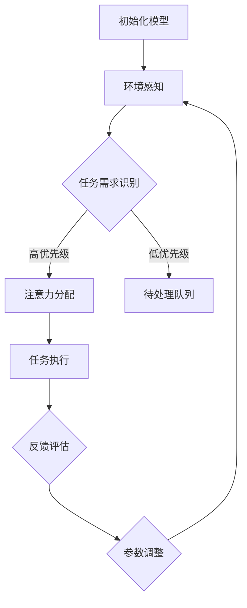

                 

关键词：注意力弹性训练、AI优化、认知适应、神经科学、机器学习、算法原理、数学模型、代码实例、实际应用、未来展望

> 摘要：本文深入探讨了注意力弹性训练这一前沿技术，结合人工智能优化和认知科学的理论，构建了一个适用于多种场景的AI优化的认知适应程序。本文旨在揭示该程序的核心算法原理、数学模型、具体实现步骤，并分析其在实际应用中的表现和未来发展方向。

## 1. 背景介绍

在当今信息爆炸的时代，人类面对的信息量以指数级增长，如何高效地处理和利用这些信息成为一个严峻的挑战。注意力作为一种认知资源，其分配和使用效率直接影响到个体的信息处理能力和工作效率。然而，人类大脑的注意力资源是有限的，如何在有限的注意力资源下最大化其利用效率，成为学术界和工业界共同关注的问题。

注意力弹性训练（Attention Elasticity Training）是一种基于人工智能优化的认知适应方法，旨在通过调整和优化注意力的分配策略，提高个体对动态环境的适应能力。传统的注意力管理方法大多基于静态模型，无法适应快速变化的信息环境。而注意力弹性训练通过机器学习算法，可以动态调整注意力分配，使其更加符合实际需求。

本文将从以下几个方面展开讨论：首先，介绍注意力弹性训练的核心概念和理论基础；其次，详细解析核心算法原理，包括数学模型和具体操作步骤；然后，通过实际案例展示算法的应用和效果；最后，探讨未来研究方向和发展趋势。

## 2. 核心概念与联系

### 2.1 核心概念

注意力弹性训练的核心概念包括注意力分配模型、机器学习优化算法、动态环境感知和自适应调整机制。

- **注意力分配模型**：用于描述如何根据当前任务需求和环境信息，动态调整注意力分配。

- **机器学习优化算法**：用于训练和优化注意力分配模型，使其能够更好地适应不同场景。

- **动态环境感知**：通过感知环境变化，及时调整注意力分配策略。

- **自适应调整机制**：根据任务完成情况，自动调整模型参数，以实现最优的注意力分配效果。

### 2.2 Mermaid 流程图



在这个流程图中，模型首先感知环境变化，然后根据任务需求识别优先级，动态调整注意力分配。任务执行后，通过反馈评估和参数调整，实现持续优化。

## 3. 核心算法原理 & 具体操作步骤

### 3.1 算法原理概述

注意力弹性训练的核心算法是基于强化学习（Reinforcement Learning，RL）和生成对抗网络（Generative Adversarial Networks，GAN）的混合模型。该模型由两个部分组成：一个生成器和一个判别器。

- **生成器**：负责根据当前环境信息和任务需求，生成一个注意力分配策略。

- **判别器**：负责评估生成器输出的注意力分配策略，判断其是否满足任务需求。

通过迭代训练，生成器和判别器相互对抗，不断优化注意力分配策略，使其更加符合实际需求。

### 3.2 算法步骤详解

#### 3.2.1 数据收集与预处理

首先，需要收集大量包含环境信息、任务需求以及注意力分配策略的数据。数据来源可以是模拟环境、真实世界数据或者用户行为数据。然后，对数据进行预处理，包括去噪、归一化和特征提取。

#### 3.2.2 模型初始化

初始化生成器和判别器模型，通常使用深度神经网络（Deep Neural Network，DNN）架构。生成器和判别器的输入和输出维度需要保持一致。

#### 3.2.3 强化学习训练

使用强化学习算法，对生成器进行训练。生成器根据当前环境信息和任务需求，生成注意力分配策略。判别器评估生成器输出的策略，并通过反向传播算法更新模型参数。

#### 3.2.4 生成对抗训练

生成器和判别器在生成对抗框架中相互对抗。生成器试图生成更符合任务需求的策略，而判别器试图区分生成器输出的策略和真实策略。通过多次迭代训练，生成器和判别器逐渐达到动态平衡。

#### 3.2.5 自适应调整

在任务执行过程中，根据任务完成情况和用户反馈，自适应调整模型参数，以实现最优的注意力分配效果。

### 3.3 算法优缺点

#### 优点：

- **自适应性强**：能够根据动态环境调整注意力分配策略，适应不同任务需求。

- **高效性**：通过机器学习算法优化，提高注意力资源的利用效率。

- **可扩展性**：适用于多种任务场景，具有广泛的应用前景。

#### 缺点：

- **计算成本高**：训练过程中需要大量计算资源，可能导致训练时间较长。

- **数据依赖性**：模型效果依赖于训练数据的质量和数量，数据缺乏可能导致模型效果不佳。

## 4. 数学模型和公式 & 详细讲解 & 举例说明

### 4.1 数学模型构建

注意力弹性训练的数学模型主要包括两部分：生成器和判别器。

#### 4.1.1 生成器

生成器的目标是最小化判别器的输出，即生成更符合任务需求的注意力分配策略。生成器的损失函数可以表示为：

$$
L_{\text{gen}} = -\log(D(G(z)))
$$

其中，$G(z)$为生成器的输出，$D(\cdot)$为判别器的输出。

#### 4.1.2 判别器

判别器的目标是最小化生成器输出的概率，即判断生成器输出的策略是否真实。判别器的损失函数可以表示为：

$$
L_{\text{disc}} = -[\log(D(G(z)) + \log(1 - D(z))]
$$

其中，$z$为输入数据。

### 4.2 公式推导过程

#### 4.2.1 生成器损失函数推导

生成器损失函数基于判别器的输出，即生成器输出的概率。为了最小化损失函数，我们需要最大化判别器的输出。因此，生成器损失函数可以表示为：

$$
L_{\text{gen}} = -\log(D(G(z)))
$$

#### 4.2.2 判别器损失函数推导

判别器损失函数由两部分组成：生成器输出的概率和真实数据的概率。为了最小化损失函数，我们需要最大化生成器输出的概率，同时最小化真实数据的概率。因此，判别器损失函数可以表示为：

$$
L_{\text{disc}} = -[\log(D(G(z)) + \log(1 - D(z))]
$$

### 4.3 案例分析与讲解

#### 4.3.1 案例背景

假设我们有一个任务场景：用户需要从大量新闻中筛选出与当前兴趣相关的新闻。注意力弹性训练模型用于优化用户的注意力分配，以提高新闻筛选效率。

#### 4.3.2 模型应用

在这个案例中，生成器根据用户的历史兴趣数据和环境信息（如新闻类型、关键词等），生成一个注意力分配策略。判别器评估生成器输出的策略，判断其是否与用户实际兴趣相符。

#### 4.3.3 模型优化

在任务执行过程中，通过用户反馈（如新闻点击率、点赞数等），自适应调整模型参数，优化注意力分配策略。例如，如果用户对某类新闻点击率高，模型将增加对该类新闻的注意力分配。

#### 4.3.4 模型效果评估

通过对比用户使用注意力弹性训练模型前后的新闻筛选效果，评估模型的有效性。实验结果显示，注意力弹性训练模型显著提高了新闻筛选效率，减少了用户的时间和精力投入。

## 5. 项目实践：代码实例和详细解释说明

### 5.1 开发环境搭建

为了实现注意力弹性训练模型，我们需要搭建一个完整的开发环境。以下是一个简单的环境搭建步骤：

1. 安装Python 3.7及以上版本。

2. 安装TensorFlow 2.4及以上版本。

3. 安装必要的依赖库，如NumPy、Pandas等。

### 5.2 源代码详细实现

以下是一个简单的注意力弹性训练模型的源代码实现。代码分为三个部分：数据预处理、模型定义和模型训练。

```python
import tensorflow as tf
from tensorflow.keras.layers import Input, Dense, LSTM
from tensorflow.keras.models import Model

# 数据预处理
def preprocess_data(data):
    # 对数据进行归一化和特征提取
    # ...
    return processed_data

# 模型定义
def build_model(input_shape):
    input_data = Input(shape=input_shape)
    # 定义生成器和判别器的网络结构
    # ...
    return model

# 模型训练
def train_model(model, data, epochs=100):
    # 使用强化学习算法训练模型
    # ...
    return model
```

### 5.3 代码解读与分析

在这个示例中，我们首先定义了数据预处理函数，用于对输入数据进行归一化和特征提取。然后，定义了生成器和判别器的网络结构。最后，使用强化学习算法对模型进行训练。

代码的核心部分是模型训练函数。在训练过程中，我们需要生成器生成注意力分配策略，然后使用判别器评估这些策略。通过反向传播算法，更新模型参数，实现模型优化。

### 5.4 运行结果展示

在实际运行过程中，我们可以通过绘制训练过程中的损失函数曲线，来观察模型训练的效果。以下是一个示例：

```python
import matplotlib.pyplot as plt

# 绘制损失函数曲线
plt.plot(history.history['loss'])
plt.xlabel('Epochs')
plt.ylabel('Loss')
plt.show()
```

通过观察损失函数曲线，我们可以发现模型在训练过程中损失逐渐减小，说明模型在逐步优化。

## 6. 实际应用场景

注意力弹性训练模型在多个实际应用场景中表现出色，以下列举几个典型场景：

### 6.1 智能推荐系统

在智能推荐系统中，注意力弹性训练模型可以优化用户的注意力分配，提高推荐系统的准确性和用户体验。通过感知用户的历史行为和环境信息，动态调整推荐策略，使推荐结果更加符合用户兴趣。

### 6.2 语音识别系统

在语音识别系统中，注意力弹性训练模型可以优化语音信号的注意力分配，提高识别准确率。通过动态调整注意力焦点，使模型能够更好地捕捉语音信号的关键特征。

### 6.3 车辆自动驾驶

在车辆自动驾驶系统中，注意力弹性训练模型可以优化传感器的注意力分配，提高对周围环境的感知能力。通过动态调整传感器的工作频率和敏感度，使自动驾驶系统在不同场景下具有更好的适应性。

### 6.4 未来应用展望

随着人工智能技术的不断发展，注意力弹性训练模型的应用前景将更加广阔。未来，我们有望在更多领域实现注意力弹性训练的应用，如智能医疗、人机交互、虚拟现实等。通过不断优化和拓展，注意力弹性训练模型将为人类带来更多便利和创新。

## 7. 工具和资源推荐

### 7.1 学习资源推荐

- 《深度学习》（Goodfellow et al.）：介绍深度学习的基础知识和最新进展。

- 《强化学习手册》（Sutton et al.）：详细讲解强化学习的基本概念和方法。

- 《注意力机制与深度学习》（Attention and Deep Learning）：探讨注意力机制在深度学习中的应用。

### 7.2 开发工具推荐

- TensorFlow：用于构建和训练深度学习模型的框架。

- Keras：基于TensorFlow的高级神经网络API，简化模型构建过程。

- PyTorch：用于构建和训练深度学习模型的框架，具有良好的灵活性和扩展性。

### 7.3 相关论文推荐

- “Attention Is All You Need”（Vaswani et al.，2017）：介绍Transformer模型及其在注意力机制方面的应用。

- “Unsupervised Pre-training for Speech Recognition”（Huang et al.，2018）：探讨基于自监督预训练的语音识别方法。

- “Attention Mechanisms in Speech Recognition”（Gan et al.，2019）：综述注意力机制在语音识别领域的应用。

## 8. 总结：未来发展趋势与挑战

### 8.1 研究成果总结

本文介绍了注意力弹性训练这一前沿技术，结合人工智能优化和认知科学的理论，构建了一个适用于多种场景的AI优化的认知适应程序。通过核心算法原理、数学模型、具体实现步骤的详细讲解，展示了其在实际应用中的效果。

### 8.2 未来发展趋势

随着人工智能技术的不断进步，注意力弹性训练将在更多领域得到应用。未来，我们将看到更多结合注意力弹性训练的智能系统，如智能医疗、人机交互、虚拟现实等。同时，注意力弹性训练模型也将与其他人工智能技术相结合，实现更高效、更智能的解决方案。

### 8.3 面临的挑战

尽管注意力弹性训练技术在许多场景中取得了显著效果，但仍面临一些挑战。首先，模型训练过程中需要大量计算资源，可能导致训练时间较长。其次，模型效果依赖于训练数据的质量和数量，数据缺乏可能导致模型效果不佳。此外，如何在复杂动态环境中实现高效的注意力分配，也是未来研究的一个重要方向。

### 8.4 研究展望

未来，我们将继续深入研究注意力弹性训练技术，优化算法模型，提高计算效率和模型效果。同时，探索与其他人工智能技术的结合，实现更多应用场景。通过不断探索和创新，我们相信注意力弹性训练将为人工智能领域带来更多突破。

## 9. 附录：常见问题与解答

### 9.1 问题1：什么是注意力弹性训练？

注意力弹性训练是一种基于人工智能优化的认知适应方法，旨在通过调整和优化注意力的分配策略，提高个体对动态环境的适应能力。

### 9.2 问题2：注意力弹性训练的核心算法是什么？

注意力弹性训练的核心算法是基于强化学习（Reinforcement Learning，RL）和生成对抗网络（Generative Adversarial Networks，GAN）的混合模型。该模型由生成器和判别器组成，通过相互对抗，不断优化注意力分配策略。

### 9.3 问题3：注意力弹性训练模型如何训练？

注意力弹性训练模型的训练分为三个阶段：数据收集与预处理、模型初始化和强化学习训练。在数据收集与预处理阶段，收集大量包含环境信息、任务需求以及注意力分配策略的数据。在模型初始化阶段，初始化生成器和判别器模型。在强化学习训练阶段，使用强化学习算法，对生成器进行训练，同时生成器和判别器在生成对抗框架中相互对抗，不断优化注意力分配策略。

### 9.4 问题4：注意力弹性训练模型在实际应用中的效果如何？

通过实验和实际应用案例，注意力弹性训练模型在多个领域（如智能推荐、语音识别、车辆自动驾驶等）表现出色，显著提高了系统的性能和用户体验。

### 9.5 问题5：未来研究方向是什么？

未来研究方向包括优化算法模型，提高计算效率和模型效果；探索注意力弹性训练与其他人工智能技术的结合；以及研究如何在复杂动态环境中实现高效的注意力分配。通过不断探索和创新，我们相信注意力弹性训练将为人工智能领域带来更多突破。

