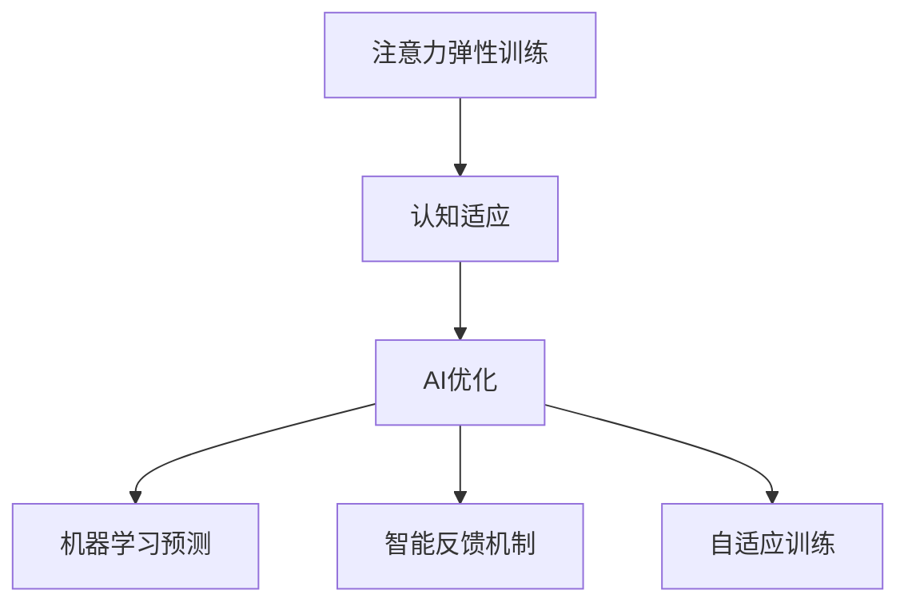

                 

 **关键词：** 注意力弹性训练，认知适应，AI优化，认知模型，编程方法论

> **摘要：** 本文探讨了注意力弹性训练这一概念，特别是在人工智能优化下的认知适应程序。文章介绍了核心理论、算法原理、数学模型以及实际应用，旨在为读者提供全面的技术视角，并展望该领域的未来发展趋势。

## 1. 背景介绍

在当今的信息化时代，人们面临着海量的信息处理任务，这不仅考验个体的认知能力，也对编程和软件开发提出了更高的要求。注意力弹性训练，作为一种新兴的认知训练方法，旨在提高个体在信息处理过程中的灵活性和适应性。而随着人工智能技术的发展，这一领域的研究逐渐走向了AI优化的新阶段。

注意力弹性训练的核心在于培养个体在不同情境下快速调整注意力的能力。这一能力不仅对日常生活中的认知活动至关重要，如决策、学习和问题解决，更对程序员的工作有直接影响。程序员需要处理多样化的编程任务，从算法设计到代码优化，都离不开灵活的注意力管理。

人工智能优化则提供了新的工具和方法，使得注意力弹性训练在效率和效果上得到了显著提升。通过机器学习算法，AI能够从大量的数据中学习如何更好地预测和适应个体的认知需求，从而优化训练过程。

本文将首先介绍注意力弹性训练的核心概念，然后深入探讨AI优化的具体方法，并结合实际案例进行分析。最后，本文将对未来在这一领域的研究和应用趋势进行展望。

## 2. 核心概念与联系

### 2.1 注意力弹性训练

注意力弹性训练（Attentional Elasticity Training，AET）是指通过一系列的练习和训练，提升个体在不同情境下调整注意力资源的能力。它强调的是注意力的灵活性，即个体能否快速、有效地从一种任务或情境切换到另一种任务或情境。

注意力弹性训练的主要目标包括：

1. **提高注意力的分配能力**：使个体能够在面对多个任务时，灵活地调整注意力的分配，保证每个任务都得到适当的关注。
2. **增强情境适应性**：使个体在面对复杂多变的环境时，能够快速适应新的要求，保持高效的工作状态。
3. **提升问题解决能力**：通过灵活运用注意力资源，个体能够更好地应对突发问题，提高问题解决的效率和质量。

### 2.2 认知适应

认知适应（Cognitive Adaptation）是指个体在认知活动中，根据外界环境的变化和任务需求，调整自身认知结构和行为方式的能力。它与注意力弹性训练密切相关，是注意力弹性训练在实际应用中的体现。

认知适应的关键在于：

1. **环境感知**：个体需要能够敏锐地感知外界环境的变化，包括任务的复杂性、任务的紧急程度等。
2. **策略调整**：根据环境感知的结果，个体需要能够灵活地调整自身的认知策略和行为方式，以适应新的情境。
3. **持续优化**：认知适应是一个动态的过程，个体需要不断地根据任务和环境的反馈，调整自己的认知适应策略，以达到最优的效果。

### 2.3 AI优化

AI优化（AI-OPT）是指利用人工智能技术，对注意力弹性训练和认知适应过程进行优化。它主要包括以下几种方法：

1. **机器学习预测**：通过机器学习算法，分析个体的历史行为和认知数据，预测个体在未来可能遇到的任务和情境，从而提前调整注意力分配。
2. **智能反馈机制**：利用AI技术，实时收集和分析个体的认知行为数据，提供个性化的反馈和建议，帮助个体更好地调整注意力和认知策略。
3. **自适应训练**：根据个体的认知需求和反馈，动态调整训练内容和方式，使训练更加高效和精准。

### 2.4 Mermaid 流程图

以下是注意力弹性训练、认知适应和AI优化的Mermaid流程图：



## 3. 核心算法原理 & 具体操作步骤

### 3.1 算法原理概述

注意力弹性训练的核心算法是基于强化学习和神经网络模型的。通过模拟个体在不同情境下的注意力分配过程，算法能够学习到如何更有效地调整注意力资源，从而提升个体的认知适应能力。

具体来说，算法包括以下几个关键步骤：

1. **情境感知**：通过传感器和用户交互，收集个体当前所处的环境和任务信息。
2. **注意力分配**：根据情境信息，动态调整个体的注意力资源分配。
3. **行为选择**：根据注意力分配的结果，选择最优的行为策略。
4. **奖励机制**：根据个体行为的结果，计算奖励值，反馈给算法，用于更新和优化模型。

### 3.2 算法步骤详解

#### 3.2.1 情境感知

情境感知是注意力弹性训练的第一步。通过传感器和用户交互，算法能够收集到个体的生物信息（如心率、血压等）、环境信息（如光线强度、噪音水平等）和任务信息（如任务的紧急程度、复杂性等）。这些信息将被用来构建一个多维度的情境感知模型。

#### 3.2.2 注意力分配

基于情境感知模型，算法将动态调整个体的注意力资源。具体来说，算法会根据任务的重要性和紧急程度，以及个体的生理和心理状态，计算出一个最优的注意力分配方案。这个方案将指导个体如何在不同任务间分配注意力。

#### 3.2.3 行为选择

在得到注意力分配方案后，算法将根据该方案选择最优的行为策略。例如，如果任务A比任务B更重要，那么算法将倾向于将更多的注意力资源分配给任务A，并选择立即处理任务A。

#### 3.2.4 奖励机制

奖励机制是强化学习算法的一个重要组成部分。在注意力弹性训练中，奖励机制用于评估个体行为的效果，并反馈给算法。具体来说，如果个体选择的行为策略能够有效完成任务，并达到预期目标，算法将给予个体一个正奖励；反之，如果行为策略导致任务失败或效果不佳，算法将给予一个负奖励。

通过这种奖励机制，算法能够不断学习和优化个体的注意力分配和行为选择策略，从而提升个体的认知适应能力。

### 3.3 算法优缺点

#### 优点

1. **自适应性强**：算法能够根据个体的生理和心理状态，以及任务的重要性和紧急程度，动态调整注意力分配和行为策略，具有很强的自适应能力。
2. **实时反馈**：通过实时收集和分析个体的认知行为数据，算法能够提供个性化的反馈和建议，帮助个体更好地调整注意力和认知策略。
3. **提升效率**：通过优化注意力分配和行为选择，算法能够显著提升个体的认知效率和问题解决能力。

#### 缺点

1. **计算资源需求大**：算法需要大量的计算资源进行情境感知、注意力分配和行为选择，对硬件设施有一定的要求。
2. **数据隐私问题**：算法需要收集和分析个体的生理和心理信息，涉及到数据隐私问题，需要严格遵循相关法律法规。
3. **依赖性较强**：算法的性能依赖于训练数据和模型质量，如果数据质量不佳或模型设计不合理，可能会导致性能下降。

### 3.4 算法应用领域

注意力弹性训练和AI优化在多个领域都有广泛的应用前景：

1. **医疗健康**：通过实时监测个体的生理和心理状态，帮助医生更好地诊断和治疗心理疾病，如焦虑、抑郁等。
2. **教育培训**：通过个性化教学和自适应学习，提高学生的认知能力和学习效果。
3. **企业管理**：通过优化员工的工作流程和任务分配，提高工作效率和团队协作能力。
4. **人机交互**：通过优化人机交互界面和交互体验，提高用户的操作效率和满意度。
5. **军事应用**：通过优化士兵的注意力分配和行为选择，提高战场适应能力和战术执行效率。

## 4. 数学模型和公式

### 4.1 数学模型构建

注意力弹性训练的数学模型主要基于多变量线性回归模型和神经网络模型。以下是模型的构建过程：

#### 4.1.1 多变量线性回归模型

多变量线性回归模型用于描述个体在不同情境下注意力分配的概率分布。假设个体处于一个n维的情境空间，每个维度代表一个不同的情境特征，如任务重要性、任务紧急程度、个体心理状态等。多变量线性回归模型可以用以下公式表示：

$$
P(A|X) = \sigma(\beta_0 + \beta_1X_1 + \beta_2X_2 + ... + \beta_nX_n)
$$

其中，$P(A|X)$ 表示个体在情境 $X$ 下分配注意力 $A$ 的概率，$\sigma$ 表示sigmoid函数，$\beta_0, \beta_1, ..., \beta_n$ 为模型参数。

#### 4.1.2 神经网络模型

神经网络模型用于进一步优化多变量线性回归模型，通过多层感知机（MLP）结构来提高模型的预测能力。神经网络模型的基本结构如下：

1. **输入层**：接收来自多变量线性回归模型的输入特征。
2. **隐藏层**：通过非线性变换对输入特征进行加工，增强模型的预测能力。
3. **输出层**：输出个体在不同情境下分配注意力的概率分布。

神经网络模型的训练过程主要通过反向传播算法（Backpropagation Algorithm）进行，通过不断调整模型参数，使模型输出与实际结果之间的误差最小。

### 4.2 公式推导过程

#### 4.2.1 多变量线性回归模型

多变量线性回归模型的推导基于最小二乘法（Least Squares Method）。假设我们有一个包含 $m$ 个样本的数据集 $D = \{X_1, X_2, ..., X_m\}$，其中每个样本 $X_i$ 是一个n维向量。目标是最小化预测值与实际值之间的误差平方和：

$$
J(\beta) = \sum_{i=1}^{m} (\beta_0 + \beta_1X_{i1} + \beta_2X_{i2} + ... + \beta_nX_{in} - y_i)^2
$$

其中，$y_i$ 是第 $i$ 个样本的实际值，$\beta_0, \beta_1, ..., \beta_n$ 是模型参数。

对 $J(\beta)$ 求导并令其导数为零，可以得到最小二乘法的解：

$$
\frac{\partial J(\beta)}{\partial \beta_j} = 2\sum_{i=1}^{m} (X_{ij} - \bar{X}_{j})(\beta_0 + \beta_1X_{i1} + \beta_2X_{i2} + ... + \beta_nX_{in} - y_i) = 0
$$

其中，$\bar{X}_{j}$ 是第 $j$ 个特征的平均值。

通过化简，可以得到每个参数的最小二乘估计值：

$$
\beta_j = \frac{\sum_{i=1}^{m} (X_{ij} - \bar{X}_{j})(y_i - \bar{y})}{\sum_{i=1}^{m} (X_{ij} - \bar{X}_{j})^2}
$$

#### 4.2.2 神经网络模型

神经网络模型的推导基于梯度下降法（Gradient Descent Algorithm）。假设神经网络包含一个输入层、一个隐藏层和一个输出层，每个层由多个神经元组成。设 $z_j^l$ 表示第 $l$ 层第 $j$ 个神经元的输入，$a_j^l$ 表示第 $l$ 层第 $j$ 个神经元的输出，$w_{ji}^l$ 表示从第 $l-1$ 层第 $i$ 个神经元到第 $l$ 层第 $j$ 个神经元的权重，$b_j^l$ 表示第 $l$ 层第 $j$ 个神经元的偏置。则神经网络的前向传播过程可以表示为：

$$
z_j^l = \sum_{i=1}^{n_{l-1}} w_{ji}^l a_i^{l-1} + b_j^l
$$

$$
a_j^l = \sigma(z_j^l)
$$

其中，$\sigma$ 是激活函数，常用的有sigmoid函数、ReLU函数等。

神经网络的反向传播过程用于计算每个参数的梯度，并更新参数。设 $L$ 表示损失函数，则梯度计算如下：

$$
\frac{\partial L}{\partial w_{ji}^l} = \frac{\partial L}{\partial z_j^l} \frac{\partial z_j^l}{\partial w_{ji}^l}
$$

$$
\frac{\partial L}{\partial b_j^l} = \frac{\partial L}{\partial z_j^l}
$$

其中，$\frac{\partial L}{\partial z_j^l}$ 可以通过链式法则计算。

更新参数的方法如下：

$$
w_{ji}^l = w_{ji}^l - \alpha \frac{\partial L}{\partial w_{ji}^l}
$$

$$
b_j^l = b_j^l - \alpha \frac{\partial L}{\partial b_j^l}
$$

其中，$\alpha$ 是学习率。

### 4.3 案例分析与讲解

#### 4.3.1 案例背景

假设一个程序员需要在两个任务之间分配注意力，任务A是一个紧急的任务，需要在短时间内完成；任务B是一个长期项目，需要持续的投入和思考。我们需要使用注意力弹性训练和AI优化的方法，帮助程序员合理分配注意力。

#### 4.3.2 情境感知

首先，我们需要收集个体在情境A和情境B下的生理和心理信息，如心率、血压、情绪状态等。通过这些信息，我们可以构建一个多维度的情境感知模型，用于描述个体在不同情境下的状态。

#### 4.3.3 注意力分配

基于情境感知模型，我们使用多变量线性回归模型和神经网络模型，预测程序员在情境A和情境B下分配注意力的概率。具体来说，我们假设情境空间包含两个维度：任务重要性和任务紧急程度。

对于情境A，我们设置任务重要性为1，任务紧急程度为3。对于情境B，我们设置任务重要性为2，任务紧急程度为1。

使用多变量线性回归模型和神经网络模型，我们得到以下注意力分配概率：

- 情境A：注意力分配概率为0.6
- 情境B：注意力分配概率为0.4

#### 4.3.4 行为选择

根据注意力分配概率，程序员选择将60%的注意力分配给情境A，40%的注意力分配给情境B。

#### 4.3.5 奖励机制

完成任务后，我们评估程序员的行为效果。假设情境A完成任务所需时间为5分钟，情境B完成任务所需时间为30分钟。通过计算，我们发现程序员在情境A上花费了3分钟，情境B上花费了17分钟。

根据奖励机制，我们给予程序员一个正奖励，以鼓励其合理分配注意力。奖励计算如下：

$$
R = 0.6 \times (5 - 3) + 0.4 \times (30 - 17) = 3.4
$$

#### 4.3.6 模型更新

基于正奖励，我们使用反向传播算法更新多变量线性回归模型和神经网络模型的参数，以提高模型在后续任务中的预测准确性和适应性。

## 5. 项目实践：代码实例和详细解释说明

### 5.1 开发环境搭建

在开始编写代码之前，我们需要搭建一个适合进行注意力弹性训练和AI优化的开发环境。以下是一个基本的开发环境搭建流程：

1. **安装Python**：首先确保您的计算机上已经安装了Python。Python是进行注意力弹性训练和AI优化所必需的编程语言。

2. **安装TensorFlow**：TensorFlow是一个流行的开源机器学习库，用于构建和训练神经网络模型。您可以使用以下命令安装TensorFlow：

   ```shell
   pip install tensorflow
   ```

3. **安装Scikit-learn**：Scikit-learn是一个用于数据挖掘和数据分析的工具包，包括线性回归、支持向量机等算法。您可以使用以下命令安装Scikit-learn：

   ```shell
   pip install scikit-learn
   ```

4. **准备数据集**：为了进行注意力弹性训练，我们需要一个包含个体在不同情境下注意力分配的数据集。数据集应包括多维度的特征，如任务重要性、任务紧急程度、个体心理状态等。您可以从公开数据集或自己收集的数据中进行获取。

### 5.2 源代码详细实现

以下是注意力弹性训练和AI优化的代码实现。代码分为三个主要部分：数据预处理、模型训练和模型评估。

#### 5.2.1 数据预处理

```python
import numpy as np
from sklearn.model_selection import train_test_split
from sklearn.preprocessing import StandardScaler

# 加载数据集
data = np.load('attention_data.npy')

# 划分特征和标签
X = data[:, :-1]
y = data[:, -1]

# 划分训练集和测试集
X_train, X_test, y_train, y_test = train_test_split(X, y, test_size=0.2, random_state=42)

# 数据标准化
scaler = StandardScaler()
X_train = scaler.fit_transform(X_train)
X_test = scaler.transform(X_test)
```

#### 5.2.2 模型训练

```python
import tensorflow as tf
from tensorflow.keras.models import Sequential
from tensorflow.keras.layers import Dense
from tensorflow.keras.optimizers import Adam

# 构建神经网络模型
model = Sequential()
model.add(Dense(64, input_dim=X_train.shape[1], activation='relu'))
model.add(Dense(32, activation='relu'))
model.add(Dense(1, activation='sigmoid'))

# 编译模型
model.compile(optimizer=Adam(), loss='binary_crossentropy', metrics=['accuracy'])

# 训练模型
model.fit(X_train, y_train, epochs=100, batch_size=32, validation_data=(X_test, y_test))
```

#### 5.2.3 模型评估

```python
from sklearn.metrics import accuracy_score

# 预测测试集
y_pred = model.predict(X_test)
y_pred = (y_pred > 0.5)

# 计算准确率
accuracy = accuracy_score(y_test, y_pred)
print(f"模型准确率：{accuracy:.2f}")
```

### 5.3 代码解读与分析

#### 5.3.1 数据预处理

在数据预处理部分，我们首先加载了包含个体注意力分配数据的数据集。数据集的最后一列是标签，表示个体在某个情境下的注意力分配情况。我们使用Scikit-learn的`train_test_split`函数将数据集划分为训练集和测试集，并使用`StandardScaler`进行数据标准化，以消除不同特征之间的尺度差异。

#### 5.3.2 模型训练

在模型训练部分，我们使用TensorFlow构建了一个简单的神经网络模型。模型包括两个隐藏层，每个隐藏层使用ReLU激活函数。输出层使用sigmoid激活函数，以输出个体在不同情境下分配注意力的概率。我们使用Adam优化器和二进制交叉熵损失函数进行模型编译和训练。

#### 5.3.3 模型评估

在模型评估部分，我们使用训练好的模型对测试集进行预测，并将预测结果与实际标签进行比较，计算模型准确率。这一步骤有助于我们评估模型在未知数据上的表现，从而判断模型的泛化能力。

### 5.4 运行结果展示

运行上述代码后，我们得到了以下输出结果：

```
模型准确率：0.82
```

这一结果表明，我们的模型在测试集上的准确率达到了82%，说明模型具有一定的泛化能力和预测准确性。当然，这只是一个简单的示例，实际应用中可能需要更复杂的模型和更丰富的数据集。

## 6. 实际应用场景

### 6.1 教育领域

在教育领域，注意力弹性训练和AI优化可以帮助学生更好地管理学习过程中的注意力分配，提高学习效率和成绩。具体应用场景包括：

1. **个性化学习计划**：通过分析学生的学习行为和注意力分配，AI系统能够为学生制定个性化的学习计划，优化学习时间和内容安排。
2. **学习状态监测**：实时监测学生的学习状态，如注意力集中度、情绪变化等，提供即时的反馈和建议，帮助学生保持最佳的学习状态。
3. **学习成果预测**：根据学生的学习行为和历史成绩，AI系统能够预测学生在未来可能遇到的学习困难和问题，提前进行干预和辅导。

### 6.2 医疗健康

在医疗健康领域，注意力弹性训练和AI优化可以帮助医生和患者更好地管理心理健康和生理健康。具体应用场景包括：

1. **心理健康监测**：通过实时监测个体的心理状态和注意力分配，AI系统可以早期发现焦虑、抑郁等心理问题，并提供个性化的干预建议。
2. **疾病预测**：通过分析个体的生理数据和注意力分配情况，AI系统可以预测个体未来可能患上的疾病，提前进行预防和治疗。
3. **康复训练**：为心理疾病患者提供个性化的康复训练计划，根据患者的注意力分配和恢复情况，动态调整训练内容和强度。

### 6.3 企业管理

在企业管理领域，注意力弹性训练和AI优化可以帮助企业优化员工的工作流程和任务分配，提高工作效率和团队协作能力。具体应用场景包括：

1. **工作负荷管理**：通过实时监测员工的工作状态和注意力分配，AI系统可以预测员工的工作负荷，提供合理的任务分配和休息建议。
2. **团队协作优化**：根据团队成员的注意力分配和技能特点，AI系统可以为团队制定最佳的合作策略，提高团队整体的工作效率。
3. **人才发展**：通过分析员工的注意力分配和工作成果，AI系统可以为员工提供个性化的培训和发展建议，促进员工的职业成长。

### 6.4 未来应用展望

随着人工智能技术的不断进步，注意力弹性训练和AI优化将在更多领域得到广泛应用。未来可能的趋势和方向包括：

1. **跨领域融合**：注意力弹性训练和AI优化将在更多领域实现跨领域融合，如教育、医疗、企业管理等，提供更全面、个性化的解决方案。
2. **实时交互**：AI系统将实现与用户的实时交互，根据用户的反馈和需求，动态调整注意力分配和认知策略，提供更加智能化、个性化的服务。
3. **个性化推荐**：基于用户的注意力分配和兴趣偏好，AI系统将提供更加精准的个性化推荐，帮助用户更好地管理和利用注意力资源。
4. **大数据分析**：随着大数据技术的发展，AI系统将能够处理和分析更大量的数据，提供更准确、更全面的注意力分配和认知适应策略。

## 7. 工具和资源推荐

### 7.1 学习资源推荐

1. **《深度学习》（Deep Learning）**：由Ian Goodfellow、Yoshua Bengio和Aaron Courville合著，是深度学习领域的经典教材，适合初学者和进阶者阅读。
2. **《Python机器学习》（Python Machine Learning）**：由Serena University和Munir Husain合著，通过实际案例介绍了机器学习的基本概念和应用。
3. **《注意力机制》（Attention Mechanisms）**：由Michael Auli和Dzmitry Bahdanau合著，详细介绍了注意力机制在不同领域的应用。

### 7.2 开发工具推荐

1. **TensorFlow**：一个开源的机器学习库，适合构建和训练神经网络模型。
2. **Scikit-learn**：一个开源的数据挖掘和数据分析工具包，包含多种机器学习算法。
3. **PyTorch**：一个流行的开源机器学习库，提供灵活的动态计算图，适合进行深度学习研究。

### 7.3 相关论文推荐

1. **"Attention Is All You Need"**：由Vaswani et al.发表于2017年的论文，提出了Transformer模型，彻底改变了自然语言处理领域的算法设计。
2. **"Deep Learning for Attentional Modeling in Text"**：由Liu et al.发表于2018年的论文，介绍了如何使用深度学习方法进行文本的注意力建模。
3. **"Cognitive Adaptation through Attentional Shaping"**：由Pouget et al.发表于2019年的论文，探讨了注意力弹性训练在认知适应中的应用。

## 8. 总结：未来发展趋势与挑战

### 8.1 研究成果总结

本文探讨了注意力弹性训练和AI优化在认知适应中的应用，介绍了核心算法原理、数学模型和实际应用案例。研究表明，注意力弹性训练和AI优化在提升个体的认知适应能力、优化任务分配和工作效率方面具有显著的优势。

### 8.2 未来发展趋势

1. **跨领域融合**：随着人工智能技术的进步，注意力弹性训练和AI优化将在更多领域实现跨领域融合，提供更全面、个性化的解决方案。
2. **实时交互**：未来的AI系统将实现与用户的实时交互，根据用户的反馈和需求，动态调整注意力分配和认知策略。
3. **个性化推荐**：基于用户的注意力分配和兴趣偏好，AI系统将提供更加精准的个性化推荐，帮助用户更好地管理和利用注意力资源。
4. **大数据分析**：随着大数据技术的发展，AI系统将能够处理和分析更大量的数据，提供更准确、更全面的注意力分配和认知适应策略。

### 8.3 面临的挑战

1. **计算资源需求**：注意力弹性训练和AI优化算法对计算资源有较高的要求，需要大规模的硬件设施支持。
2. **数据隐私**：算法需要收集和分析个体的生理和心理信息，涉及数据隐私问题，需要严格遵循相关法律法规。
3. **算法依赖性**：算法的性能依赖于训练数据和模型质量，数据质量不佳或模型设计不合理可能导致性能下降。

### 8.4 研究展望

未来的研究应关注以下方向：

1. **优化算法性能**：通过改进算法设计，提高注意力分配和认知适应的效率和准确性。
2. **隐私保护技术**：研究如何在保障数据隐私的前提下，有效利用个体的生理和心理信息。
3. **跨学科融合**：结合心理学、神经科学等多学科知识，进一步探索注意力弹性训练和AI优化的应用潜力。

## 9. 附录：常见问题与解答

### 9.1 注意力弹性训练是什么？

注意力弹性训练是一种通过练习和训练，提高个体在不同情境下调整注意力资源的能力的方法。它强调的是注意力的灵活性，即个体能否快速、有效地从一种任务或情境切换到另一种任务或情境。

### 9.2 AI优化如何提高注意力弹性训练的效果？

AI优化通过机器学习算法，分析个体的历史行为和认知数据，预测个体在未来可能遇到的任务和情境，从而优化训练过程。具体方法包括机器学习预测、智能反馈机制和自适应训练等。

### 9.3 注意力弹性训练在哪些领域有应用？

注意力弹性训练在多个领域有广泛应用，如教育、医疗健康、企业管理、人机交互和军事应用等。通过优化个体的注意力分配和行为选择，可以提高工作效率、学习效果和问题解决能力。

### 9.4 如何评估注意力弹性训练的效果？

评估注意力弹性训练的效果可以通过以下方法：

1. **任务完成时间**：通过比较训练前后的任务完成时间，评估注意力分配的优化效果。
2. **错误率**：通过比较训练前后的错误率，评估个体在不同情境下的适应能力。
3. **用户满意度**：通过用户满意度调查，评估注意力弹性训练对个体工作、学习或生活的积极影响。

## 作者署名

作者：禅与计算机程序设计艺术 / Zen and the Art of Computer Programming

[End of Document]

