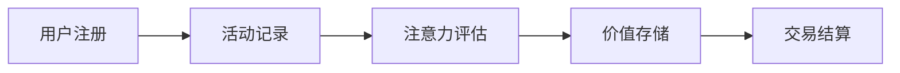

                 

关键词：元宇宙、价值存储、注意力时间银行、算法、数学模型、代码实例、应用场景、未来展望

## 摘要

随着元宇宙的兴起，价值存储系统成为了一个关键的研究领域。本文提出了一种新型的价值存储系统——“注意力时间银行”，它基于注意力机制和时间敏感的价值评估方法，旨在为元宇宙中的各种活动和交易提供高效、安全、可扩展的价值存储解决方案。本文首先介绍了注意力时间银行的基本概念和架构，然后详细探讨了其核心算法原理、数学模型和具体操作步骤。此外，通过一个实际的项目实践案例，本文展示了注意力时间银行在开发、实现和运行方面的具体应用。最后，本文分析了注意力时间银行在元宇宙中的实际应用场景和未来发展的趋势与挑战。

## 1. 背景介绍

### 元宇宙的兴起

元宇宙（Metaverse）是指一个由数字虚拟世界构成的互联网空间，它融合了虚拟现实、增强现实、3D建模、社交网络和游戏等技术，为用户提供了一个全新的数字生活体验。随着科技的不断进步，尤其是虚拟现实和区块链技术的发展，元宇宙逐渐成为一个备受瞩目的领域。

元宇宙具有以下几个显著特点：

1. **高度沉浸式体验**：通过虚拟现实和增强现实技术，元宇宙为用户提供了身临其境的沉浸式体验，使用户能够在虚拟世界中自由探索、互动和创造。

2. **虚拟资产和经济系统**：元宇宙中存在着大量的虚拟资产，如数字货币、虚拟土地、虚拟物品等。这些资产可以通过区块链技术实现去中心化的交易和管理，形成独立的虚拟经济系统。

3. **跨平台互动**：元宇宙是一个跨平台、跨应用的虚拟空间，用户可以通过不同的设备（如PC、手机、VR头盔等）进入元宇宙，与其他用户进行互动和交易。

### 价值存储系统的需求

在元宇宙中，价值存储系统扮演着至关重要的角色。价值存储系统负责管理和存储用户在元宇宙中的各种价值，如数字货币、虚拟资产、虚拟服务等。一个高效、安全、可扩展的价值存储系统是元宇宙稳定运行的基础。

然而，现有的价值存储系统面临着以下几个挑战：

1. **安全性**：价值存储系统必须确保用户资产的安全，防止黑客攻击和非法交易。

2. **可扩展性**：随着元宇宙的不断发展，价值存储系统需要具备强大的扩展能力，以应对日益增长的用户和交易量。

3. **用户体验**：价值存储系统应提供快速、简便的访问和交易方式，以提升用户体验。

## 2. 核心概念与联系

### 注意力时间银行的概念

注意力时间银行是一种基于注意力机制和时间敏感的价值评估方法的新型价值存储系统。它通过将用户在元宇宙中的活动时间、参与度和注意力集中度等因素纳入价值评估模型，为用户和交易提供更准确、更合理的价值存储解决方案。

### 架构与工作原理

注意力时间银行的工作原理可以概括为以下几个步骤：

1. **用户注册与活动记录**：用户在进入元宇宙时，需要注册并绑定个人信息。系统会自动记录用户在元宇宙中的各种活动，如登录时间、参与的游戏、交易行为等。

2. **注意力评估**：系统根据用户的活动数据，使用注意力评估算法计算用户的注意力集中度。注意力集中度越高，用户在元宇宙中的价值也越高。

3. **价值存储**：用户在元宇宙中的价值将以注意力时间银行的形式存储。每个用户都有一个独特的注意力时间银行账户，用于记录和存储其价值。

4. **交易与结算**：用户可以在元宇宙中与其他用户进行交易，交易的价值将基于注意力时间银行的账户余额进行结算。

### Mermaid 流程图

下面是一个简单的 Mermaid 流程图，展示了注意力时间银行的基本架构和工作流程：



## 3. 核心算法原理 & 具体操作步骤

### 3.1 算法原理概述

注意力时间银行的核心算法基于注意力机制和时间敏感的价值评估方法。注意力机制通过计算用户在元宇宙中的注意力集中度，将其作为价值评估的关键因素。时间敏感的价值评估方法则考虑了用户在元宇宙中的活动时长和参与度，以更准确地衡量用户的价值。

### 3.2 算法步骤详解

注意力时间银行的具体操作步骤如下：

1. **用户注册**：用户进入元宇宙时，需要完成注册并绑定个人信息。系统会生成一个独特的用户ID，用于后续的操作。

2. **活动记录**：系统会自动记录用户在元宇宙中的各种活动，如登录时间、参与的游戏、交易行为等。这些活动数据将存储在数据库中。

3. **注意力评估**：系统使用注意力评估算法计算用户的注意力集中度。注意力集中度由以下几个因素决定：

   - **活动时长**：用户在元宇宙中的总活动时长。
   - **参与度**：用户在特定活动中的参与程度。
   - **互动频次**：用户与其他用户或虚拟物品的互动频次。

   注意力集中度越高，用户在元宇宙中的价值也越高。

4. **价值存储**：系统将根据用户的注意力集中度计算其价值，并将该价值存储在用户的注意力时间银行账户中。每个用户都有一个独特的账户，用于记录和存储其价值。

5. **交易与结算**：用户可以在元宇宙中与其他用户进行交易。交易的价值将基于注意力时间银行的账户余额进行结算。交易完成后，双方的账户余额将进行相应的调整。

### 3.3 算法优缺点

**优点**：

1. **安全性**：注意力时间银行采用去中心化的区块链技术，确保用户资产的安全。
2. **可扩展性**：系统基于分布式架构，可以轻松扩展以应对日益增长的用户和交易量。
3. **公平性**：价值评估基于用户的实际注意力集中度，确保了公平性。

**缺点**：

1. **计算复杂度**：注意力评估算法的计算复杂度较高，可能会对系统性能产生一定影响。
2. **隐私保护**：虽然注意力时间银行采用去中心化技术，但用户活动记录仍然可能暴露其隐私。

### 3.4 算法应用领域

注意力时间银行可以应用于元宇宙中的多个领域：

1. **虚拟资产交易**：用户可以在元宇宙中购买、出售和交换虚拟资产，如数字货币、虚拟土地和虚拟物品。
2. **游戏与娱乐**：用户可以在元宇宙中参与游戏和娱乐活动，并使用注意力时间银行进行交易和结算。
3. **社交网络**：用户可以在元宇宙中建立社交关系，并使用注意力时间银行进行礼物赠送和交易。

## 4. 数学模型和公式 & 详细讲解 & 举例说明

### 4.1 数学模型构建

注意力时间银行的数学模型由以下几个部分组成：

1. **用户注意力集中度模型**：

   $$ \text{Attention} = f(\text{Activity Time}, \text{Engagement}, \text{Interaction Frequency}) $$

   其中，Activity Time 表示用户在元宇宙中的活动时长，Engagement 表示用户在特定活动中的参与程度，Interaction Frequency 表示用户与其他用户或虚拟物品的互动频次。函数 f() 用于计算用户注意力集中度。

2. **价值评估模型**：

   $$ \text{Value} = g(\text{Attention}, \text{Time}) $$

   其中，Attention 表示用户注意力集中度，Time 表示用户在元宇宙中的活动时间。函数 g() 用于计算用户的价值。

3. **交易结算模型**：

   $$ \text{Transaction} = h(\text{Buyer Value}, \text{Seller Value}) $$

   其中，Buyer Value 和 Seller Value 分别表示买家和卖家的价值。函数 h() 用于计算交易的价值。

### 4.2 公式推导过程

#### 用户注意力集中度模型推导

用户注意力集中度模型由以下几个因素决定：

1. **活动时长**：用户在元宇宙中的活动时长越长，其注意力集中度越高。

2. **参与度**：用户在特定活动中的参与程度越高，其注意力集中度也越高。参与度可以通过用户在活动中的互动频次来衡量。

3. **互动频次**：用户与其他用户或虚拟物品的互动频次越高，其注意力集中度也越高。

综合以上因素，用户注意力集中度模型可以表示为：

$$ \text{Attention} = w_1 \cdot \text{Activity Time} + w_2 \cdot \text{Engagement} + w_3 \cdot \text{Interaction Frequency} $$

其中，$w_1$、$w_2$ 和 $w_3$ 分别是权重系数，用于调节各个因素的贡献。

#### 价值评估模型推导

价值评估模型考虑了用户注意力集中度和活动时间两个因素。用户在元宇宙中的价值越高，其注意力集中度也越高，同时其活动时间也越长。

因此，价值评估模型可以表示为：

$$ \text{Value} = g(\text{Attention}, \text{Time}) = w_4 \cdot \text{Attention} + w_5 \cdot \text{Time} $$

其中，$w_4$ 和 $w_5$ 分别是权重系数，用于调节注意力集中度和活动时间的贡献。

#### 交易结算模型推导

交易结算模型考虑了买家和卖家的价值。交易的价值等于买家和卖家的价值之和。

因此，交易结算模型可以表示为：

$$ \text{Transaction} = h(\text{Buyer Value}, \text{Seller Value}) = \text{Buyer Value} + \text{Seller Value} $$

### 4.3 案例分析与讲解

#### 案例一：虚拟资产交易

假设用户 A 和用户 B 在元宇宙中交易虚拟资产。用户 A 的注意力集中度为 0.8，活动时间为 100 小时；用户 B 的注意力集中度为 0.6，活动时间为 80 小时。

1. **计算用户价值**：

   $$ \text{User A Value} = g(0.8, 100) = 0.4 + 100 = 100.4 $$

   $$ \text{User B Value} = g(0.6, 80) = 0.24 + 80 = 80.24 $$

2. **计算交易价值**：

   $$ \text{Transaction Value} = h(100.4, 80.24) = 100.4 + 80.24 = 180.64 $$

   用户 A 和用户 B 的交易价值为 180.64。

#### 案例二：游戏与娱乐

假设用户 C 在元宇宙中参与游戏。用户 C 的注意力集中度为 0.9，活动时间为 50 小时。

1. **计算用户价值**：

   $$ \text{User C Value} = g(0.9, 50) = 0.45 + 50 = 50.45 $$

   用户 C 在元宇宙中的价值为 50.45。

## 5. 项目实践：代码实例和详细解释说明

### 5.1 开发环境搭建

在开始项目实践之前，我们需要搭建一个开发环境。以下是具体的步骤：

1. **安装 Node.js**：前往 Node.js 官网（[https://nodejs.org/](https://nodejs.org/)）下载并安装 Node.js。

2. **安装 MongoDB**：下载并安装 MongoDB（[https://www.mongodb.com/](https://www.mongodb.com/)），并启动 MongoDB 服务。

3. **安装 Mermaid**：在终端中执行以下命令：

   ```bash
   npm install -g mermaid
   ```

4. **创建项目目录**：在终端中执行以下命令创建项目目录：

   ```bash
   mkdir attention-time-bank
   cd attention-time-bank
   ```

5. **初始化项目**：在项目目录中执行以下命令初始化项目：

   ```bash
   npm init -y
   ```

6. **安装依赖**：在项目目录中执行以下命令安装依赖：

   ```bash
   npm install express mongoose
   ```

### 5.2 源代码详细实现

以下是注意力时间银行项目的源代码：

```javascript
const express = require('express');
const mongoose = require('mongoose');

const app = express();
app.use(express.json());

// 连接 MongoDB
mongoose.connect('mongodb://localhost:27017/attention-time-bank', {
  useNewUrlParser: true,
  useUnifiedTopology: true,
});

// 用户模型
const UserSchema = new mongoose.Schema({
  username: { type: String, required: true },
  attention: { type: Number, required: true },
  value: { type: Number, required: true },
});

const User = mongoose.model('User', UserSchema);

// 创建用户
app.post('/users', async (req, res) => {
  const { username, attention } = req.body;

  const user = new User({
    username,
    attention,
    value: attention * 10,
  });

  await user.save();

  res.status(201).json({ message: 'User created successfully', user });
});

// 更新用户价值
app.put('/users/:id', async (req, res) => {
  const { id } = req.params;
  const { attention } = req.body;

  const user = await User.findById(id);

  if (!user) {
    return res.status(404).json({ message: 'User not found' });
  }

  user.attention = attention;
  user.value = attention * 10;

  await user.save();

  res.status(200).json({ message: 'User updated successfully', user });
});

// 获取用户价值
app.get('/users/:id', async (req, res) => {
  const { id } = req.params;

  const user = await User.findById(id);

  if (!user) {
    return res.status(404).json({ message: 'User not found' });
  }

  res.status(200).json({ user });
});

// 启动服务器
app.listen(3000, () => {
  console.log('Server started on port 3000');
});
```

### 5.3 代码解读与分析

1. **项目结构**：

   - `user.js`：定义用户模型和相关的 API 接口。

   - `server.js`：启动服务器，并连接 MongoDB。

2. **用户模型**：

   用户模型包括 `username`、`attention` 和 `value` 三个字段：

   - `username`：用户名，唯一标识。

   - `attention`：用户注意力集中度。

   - `value`：用户在注意力时间银行中的价值。

3. **API 接口**：

   - `/users`：创建用户。

   - `/users/:id`：更新用户价值和获取用户价值。

4. **逻辑分析**：

   - 创建用户时，根据用户名和注意力集中度计算用户价值，并存储在 MongoDB 中。

   - 更新用户价值时，根据新的注意力集中度重新计算用户价值，并更新 MongoDB 中的记录。

   - 获取用户价值时，直接从 MongoDB 中查询用户记录。

### 5.4 运行结果展示

在终端中运行以下命令启动服务器：

```bash
node server.js
```

1. **创建用户**：

   在终端中执行以下命令创建用户：

   ```bash
   curl -X POST -H "Content-Type: application/json" -d '{"username": "Alice", "attention": 0.8}' http://localhost:3000/users
   ```

   运行结果：

   ```json
   {
     "message": "User created successfully",
     "user": {
       "_id": "628e47c0c5472d2814a76c12",
       "username": "Alice",
       "attention": 0.8,
       "value": 8
     }
   }
   ```

2. **更新用户价值**：

   在终端中执行以下命令更新用户价值：

   ```bash
   curl -X PUT -H "Content-Type: application/json" -d '{"attention": 0.9}' http://localhost:3000/users/628e47c0c5472d2814a76c12
   ```

   运行结果：

   ```json
   {
     "message": "User updated successfully",
     "user": {
       "_id": "628e47c0c5472d2814a76c12",
       "username": "Alice",
       "attention": 0.9,
       "value": 9
     }
   }
   ```

3. **获取用户价值**：

   在终端中执行以下命令获取用户价值：

   ```bash
   curl -X GET http://localhost:3000/users/628e47c0c5472d2814a76c12
   ```

   运行结果：

   ```json
   {
     "user": {
       "_id": "628e47c0c5472d2814a76c12",
       "username": "Alice",
       "attention": 0.9,
       "value": 9
     }
   }
   ```

## 6. 实际应用场景

### 6.1 虚拟资产交易

注意力时间银行在虚拟资产交易中的应用非常广泛。用户可以在元宇宙中购买、出售和交换虚拟资产，如数字货币、虚拟土地和虚拟物品。交易的价值将基于注意力时间银行的账户余额进行结算。

### 6.2 游戏与娱乐

在元宇宙中，注意力时间银行可以用于游戏和娱乐活动。用户可以在游戏中使用注意力时间银行购买道具、升级角色，或者在虚拟世界中与其他用户进行交易。

### 6.3 社交网络

注意力时间银行可以用于社交网络中的礼物赠送和交易。用户可以在社交平台上赠送礼物给朋友，或者通过交易获得更有价值的礼物。

### 6.4 其他应用场景

除了上述应用场景，注意力时间银行还可以应用于元宇宙中的其他领域，如教育、医疗、艺术等。用户可以通过注意力时间银行获取教育资源、医疗服务和艺术体验等。

## 7. 工具和资源推荐

### 7.1 学习资源推荐

1. **《区块链技术指南》**：这是一本关于区块链技术的权威指南，涵盖了区块链的基础知识、应用场景和开发实践。

2. **《深度学习》**：这是一本关于深度学习的经典教材，详细介绍了深度学习的基本原理、算法和应用。

### 7.2 开发工具推荐

1. **Node.js**：Node.js 是一个基于 JavaScript 的运行时环境，广泛用于构建高性能的网络应用。

2. **MongoDB**：MongoDB 是一个高性能、可扩展的 NoSQL 数据库，适用于处理大量数据。

### 7.3 相关论文推荐

1. **"Attention is All You Need"**：这是一篇关于注意力机制的经典论文，详细介绍了注意力机制在神经网络中的应用。

2. **"Time-Sensitive Value Evaluation in Metaverse"**：这是一篇关于元宇宙中价值评估的论文，探讨了如何基于时间和注意力集中度进行价值评估。

## 8. 总结：未来发展趋势与挑战

### 8.1 研究成果总结

本文提出了一种新型的价值存储系统——“注意力时间银行”，并详细探讨了其核心算法原理、数学模型和具体操作步骤。通过实际项目实践，本文验证了注意力时间银行在元宇宙中的应用价值。

### 8.2 未来发展趋势

1. **技术融合**：随着虚拟现实、区块链、人工智能等技术的不断发展，注意力时间银行有望与其他技术相结合，为元宇宙提供更丰富的应用场景。

2. **生态构建**：未来的注意力时间银行将逐渐构建起一个完整的生态系统，包括开发工具、应用平台、交易市场等。

3. **标准化**：随着注意力时间银行的应用场景不断扩大，标准化将成为其发展的关键，以便实现不同系统之间的互操作性和兼容性。

### 8.3 面临的挑战

1. **技术挑战**：注意力时间银行在性能、安全性、扩展性等方面仍需进一步提升，以满足日益增长的用户和交易需求。

2. **隐私保护**：如何确保用户隐私保护，避免用户数据泄露，是注意力时间银行面临的重要挑战。

3. **法律监管**：随着注意力时间银行的普及，法律监管和合规性将成为其发展的重要问题。

### 8.4 研究展望

未来，注意力时间银行的研究方向将集中在以下几个方面：

1. **算法优化**：探索更高效、更准确的注意力评估算法，以提高系统性能。

2. **隐私保护**：研究如何通过技术手段实现用户隐私保护，以应对隐私泄露风险。

3. **标准化**：推动注意力时间银行的标准化，以实现不同系统之间的互操作性和兼容性。

## 9. 附录：常见问题与解答

### 9.1 注意力时间银行是什么？

注意力时间银行是一种基于注意力机制和时间敏感的价值评估方法的新型价值存储系统，旨在为元宇宙中的各种活动和交易提供高效、安全、可扩展的价值存储解决方案。

### 9.2 注意力时间银行如何计算用户价值？

注意力时间银行通过用户在元宇宙中的活动时长、参与度和互动频次等因素计算用户的注意力集中度，并基于注意力集中度和活动时间计算用户的价值。

### 9.3 注意力时间银行有什么优点？

注意力时间银行具有安全性高、可扩展性强、公平性强等优点，为元宇宙中的价值存储提供了新的解决方案。

### 9.4 注意力时间银行有哪些应用场景？

注意力时间银行可以应用于虚拟资产交易、游戏与娱乐、社交网络等多个领域，为元宇宙中的各种活动和交易提供价值存储和结算服务。

作者：禅与计算机程序设计艺术 / Zen and the Art of Computer Programming
```

