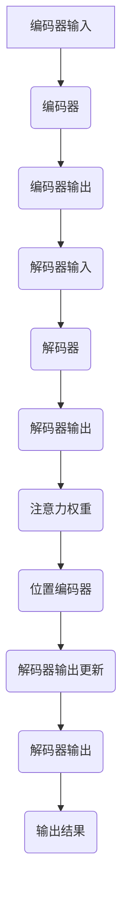

                 

关键词：注意力机制、softmax、位置编码器、神经网络、自然语言处理

> 摘要：本文将深入探讨注意力机制中的softmax和位置编码器，通过解析其核心概念、原理和数学模型，结合实际代码实例，阐述其在自然语言处理中的应用。同时，本文将展望未来注意力机制的发展趋势和面临的挑战。

## 1. 背景介绍

注意力机制（Attention Mechanism）是深度学习中的一项重要技术，起源于图像处理领域，后被广泛应用于自然语言处理（NLP）任务。传统的循环神经网络（RNN）和卷积神经网络（CNN）在处理序列数据时存在局限性，例如长距离依赖问题和局部依赖问题。而注意力机制通过引入“注意力权重”来动态调整模型对序列中不同位置的重视程度，从而提高了模型的性能和效率。

在自然语言处理任务中，注意力机制的应用尤为广泛。例如，在机器翻译中，注意力机制可以帮助模型关注源语言句子中的关键信息，从而提高翻译质量；在文本摘要中，注意力机制可以帮助模型选择最重要的句子，生成摘要。此外，注意力机制还在问答系统、情感分析、文本分类等领域发挥了重要作用。

本文将重点关注注意力机制中的两个核心组成部分：softmax和位置编码器。softmax用于计算注意力权重，而位置编码器则用于处理序列中的位置信息。

## 2. 核心概念与联系

### 2.1 注意力机制概述

注意力机制的核心思想是，在处理序列数据时，模型需要关注序列中的某些关键位置，而不是对整个序列进行平均处理。通过引入注意力权重，模型可以动态调整对每个位置的关注程度。

注意力机制的数学模型可以表示为：

\[ \text{Attention}(X) = \text{softmax}(\text{Query} \cdot \text{Key}) \cdot \text{Value} \]

其中，Query、Key和Value分别代表查询、键和值。查询通常来自于编码器（Encoder）的输出，键和值分别来自于解码器（Decoder）的输出和编码器的输出。

### 2.2 Softmax

softmax是一种概率分布函数，用于将输入向量转化为概率分布。在注意力机制中，softmax用于计算注意力权重。具体来说，softmax将Query和Key的点积结果作为输入，输出一个概率分布。

softmax的计算公式为：

\[ \text{softmax}(x) = \frac{e^x}{\sum_{i} e^x_i} \]

其中，\( x \) 是输入向量，\( e^x \) 是指数运算，\( \sum_{i} e^x_i \) 是输入向量的指数和。

### 2.3 位置编码器

位置编码器（Positional Encoder）用于引入序列中的位置信息。在自然语言处理任务中，序列中的位置通常具有重要的语义信息。例如，在机器翻译中，源语言句子中的单词顺序决定了目标语言句子的翻译结果。

位置编码器通过添加一个可学习的向量来表示序列中的每个位置。位置编码器的输入是位置索引，输出是位置向量。

### 2.4 Mermaid 流程图

以下是一个简单的Mermaid流程图，展示了注意力机制的架构：



## 3. 核心算法原理 & 具体操作步骤

### 3.1 算法原理概述

注意力机制的原理可以概括为以下几个步骤：

1. **计算键值对**：在编码器中，生成Query、Key和Value。Query来自于编码器的输出，Key和Value分别来自于解码器的输出和编码器的输出。
2. **计算注意力权重**：通过softmax函数计算注意力权重，即每个位置的重要性。
3. **计算注意力得分**：将注意力权重与位置编码器生成的位置向量相乘，得到注意力得分。
4. **计算加权输出**：将注意力得分与Value相乘，得到加权输出。
5. **更新解码器输出**：将加权输出与解码器的当前输出相加，更新解码器的输出。
6. **重复上述步骤**：直到解码器输出满足终止条件（例如，达到最大长度或达到终止词）。

### 3.2 算法步骤详解

1. **初始化编码器和解码器**：加载预训练的编码器和解码器模型。
2. **计算编码器输出**：输入编码器的序列，得到编码器的输出。
3. **计算解码器输出**：输入解码器的序列，得到解码器的输出。
4. **计算键值对**：使用编码器的输出作为Query，解码器的输出作为Key和Value。
5. **计算注意力权重**：使用softmax函数计算注意力权重。
6. **计算注意力得分**：将注意力权重与位置编码器生成的位置向量相乘，得到注意力得分。
7. **计算加权输出**：将注意力得分与Value相乘，得到加权输出。
8. **更新解码器输出**：将加权输出与解码器的当前输出相加，更新解码器的输出。
9. **重复步骤5-8**：直到解码器输出满足终止条件。
10. **输出结果**：得到最终的解码器输出。

### 3.3 算法优缺点

**优点**：

1. **提高序列处理性能**：通过引入注意力权重，模型可以动态调整对序列中不同位置的重视程度，从而提高了序列处理性能。
2. **减少计算量**：注意力机制通过减少对整个序列的平均处理，降低了计算量，提高了模型效率。
3. **支持长距离依赖**：注意力机制可以帮助模型关注序列中的关键信息，从而解决长距离依赖问题。

**缺点**：

1. **计算复杂度高**：在处理大规模序列时，注意力机制的计算复杂度较高，可能导致模型训练时间较长。
2. **梯度消失问题**：在训练过程中，注意力权重可能导致梯度消失，影响模型收敛。

### 3.4 算法应用领域

注意力机制在自然语言处理领域具有广泛的应用，包括但不限于以下领域：

1. **机器翻译**：通过引入注意力机制，机器翻译模型可以更好地关注源语言句子中的关键信息，提高翻译质量。
2. **文本摘要**：注意力机制可以帮助模型选择最重要的句子，生成摘要。
3. **问答系统**：注意力机制可以帮助模型关注问题中的关键信息，提高问答系统的性能。
4. **情感分析**：注意力机制可以帮助模型关注文本中的情感关键词，提高情感分析准确性。
5. **文本分类**：注意力机制可以帮助模型关注文本中的关键信息，提高分类准确性。

## 4. 数学模型和公式 & 详细讲解 & 举例说明

### 4.1 数学模型构建

注意力机制的数学模型可以表示为：

\[ \text{Attention}(X) = \text{softmax}(\text{Query} \cdot \text{Key}) \cdot \text{Value} \]

其中，Query、Key和Value分别代表查询、键和值。Query通常来自于编码器（Encoder）的输出，Key和Value分别来自于解码器（Decoder）的输出和编码器的输出。

### 4.2 公式推导过程

注意力机制的推导过程如下：

1. **计算点积**：首先计算Query和Key的点积，得到一个实数表示两者之间的关系。

\[ \text{Score}_{ij} = \text{Query}_i \cdot \text{Key}_j \]

2. **计算softmax**：将点积结果作为输入，通过softmax函数计算注意力权重。

\[ \text{Attention}_{ij} = \text{softmax}(\text{Score}_{ij}) \]

3. **计算加权输出**：将注意力权重与Value相乘，得到加权输出。

\[ \text{Context}_i = \text{Attention}_{ij} \cdot \text{Value}_j \]

4. **求和**：将所有加权输出求和，得到最终的注意力输出。

\[ \text{Attention}(X) = \sum_{j} \text{Attention}_{ij} \cdot \text{Value}_j \]

### 4.3 案例分析与讲解

以下是一个简单的案例，用于说明注意力机制的数学模型。

**案例**：假设有一个序列\[ x_1, x_2, x_3, x_4, x_5 \]，其中每个元素代表一个单词。我们使用注意力机制计算序列中的每个单词的重要性。

1. **计算点积**：计算Query和Key的点积，得到一个5x5的矩阵，表示每个单词之间的关系。

\[ \text{Score} = \begin{bmatrix} x_1 \cdot x_1 & x_1 \cdot x_2 & x_1 \cdot x_3 & x_1 \cdot x_4 & x_1 \cdot x_5 \\ x_2 \cdot x_1 & x_2 \cdot x_2 & x_2 \cdot x_3 & x_2 \cdot x_4 & x_2 \cdot x_5 \\ x_3 \cdot x_1 & x_3 \cdot x_2 & x_3 \cdot x_3 & x_3 \cdot x_4 & x_3 \cdot x_5 \\ x_4 \cdot x_1 & x_4 \cdot x_2 & x_4 \cdot x_3 & x_4 \cdot x_4 & x_4 \cdot x_5 \\ x_5 \cdot x_1 & x_5 \cdot x_2 & x_5 \cdot x_3 & x_5 \cdot x_4 & x_5 \cdot x_5 \end{bmatrix} \]

2. **计算softmax**：将点积结果作为输入，通过softmax函数计算注意力权重。

\[ \text{Attention} = \begin{bmatrix} \frac{e^{\text{Score}_{11}}}{\sum_{i} e^{\text{Score}_{i1}}} & \frac{e^{\text{Score}_{12}}}{\sum_{i} e^{\text{Score}_{i2}}} & \frac{e^{\text{Score}_{13}}}{\sum_{i} e^{\text{Score}_{i3}}} & \frac{e^{\text{Score}_{14}}}{\sum_{i} e^{\text{Score}_{i4}}} & \frac{e^{\text{Score}_{15}}}{\sum_{i} e^{\text{Score}_{i5}}} \\ \frac{e^{\text{Score}_{21}}}{\sum_{i} e^{\text{Score}_{i1}}} & \frac{e^{\text{Score}_{22}}}{\sum_{i} e^{\text{Score}_{i2}}} & \frac{e^{\text{Score}_{23}}}{\sum_{i} e^{\text{Score}_{i3}}} & \frac{e^{\text{Score}_{24}}}{\sum_{i} e^{\text{Score}_{i4}}} & \frac{e^{\text{Score}_{25}}}{\sum_{i} e^{\text{Score}_{i5}}} \\ \frac{e^{\text{Score}_{31}}}{\sum_{i} e^{\text{Score}_{i1}}} & \frac{e^{\text{Score}_{32}}}{\sum_{i} e^{\text{Score}_{i2}}} & \frac{e^{\text{Score}_{33}}}{\sum_{i} e^{\text{Score}_{i3}}} & \frac{e^{\text{Score}_{34}}}{\sum_{i} e^{\text{Score}_{i4}}} & \frac{e^{\text{Score}_{35}}}{\sum_{i} e^{\text{Score}_{i5}}} \\ \frac{e^{\text{Score}_{41}}}{\sum_{i} e^{\text{Score}_{i1}}} & \frac{e^{\text{Score}_{42}}}{\sum_{i} e^{\text{Score}_{i2}}} & \frac{e^{\text{Score}_{43}}}{\sum_{i} e^{\text{Score}_{i3}}} & \frac{e^{\text{Score}_{44}}}{\sum_{i} e^{\text{Score}_{i4}}} & \frac{e^{\text{Score}_{45}}}{\sum_{i} e^{\text{Score}_{i5}}} \\ \frac{e^{\text{Score}_{51}}}{\sum_{i} e^{\text{Score}_{i1}}} & \frac{e^{\text{Score}_{52}}}{\sum_{i} e^{\text{Score}_{i2}}} & \frac{e^{\text{Score}_{53}}}{\sum_{i} e^{\text{Score}_{i3}}} & \frac{e^{\text{Score}_{54}}}{\sum_{i} e^{\text{Score}_{i4}}} & \frac{e^{\text{Score}_{55}}}{\sum_{i} e^{\text{Score}_{i5}}} \end{bmatrix} \]

3. **计算加权输出**：将注意力权重与Value相乘，得到加权输出。

\[ \text{Context} = \begin{bmatrix} \text{Attention}_{11} \cdot \text{Value}_1 & \text{Attention}_{12} \cdot \text{Value}_2 & \text{Attention}_{13} \cdot \text{Value}_3 & \text{Attention}_{14} \cdot \text{Value}_4 & \text{Attention}_{15} \cdot \text{Value}_5 \\ \text{Attention}_{21} \cdot \text{Value}_1 & \text{Attention}_{22} \cdot \text{Value}_2 & \text{Attention}_{23} \cdot \text{Value}_3 & \text{Attention}_{24} \cdot \text{Value}_4 & \text{Attention}_{25} \cdot \text{Value}_5 \\ \text{Attention}_{31} \cdot \text{Value}_1 & \text{Attention}_{32} \cdot \text{Value}_2 & \text{Attention}_{33} \cdot \text{Value}_3 & \text{Attention}_{34} \cdot \text{Value}_4 & \text{Attention}_{35} \cdot \text{Value}_5 \\ \text{Attention}_{41} \cdot \text{Value}_1 & \text{Attention}_{42} \cdot \text{Value}_2 & \text{Attention}_{43} \cdot \text{Value}_3 & \text{Attention}_{44} \cdot \text{Value}_4 & \text{Attention}_{45} \cdot \text{Value}_5 \\ \text{Attention}_{51} \cdot \text{Value}_1 & \text{Attention}_{52} \cdot \text{Value}_2 & \text{Attention}_{53} \cdot \text{Value}_3 & \text{Attention}_{54} \cdot \text{Value}_4 & \text{Attention}_{55} \cdot \text{Value}_5 \end{bmatrix} \]

4. **求和**：将所有加权输出求和，得到最终的注意力输出。

\[ \text{Attention}(X) = \sum_{i} \text{Context}_i \]

通过这个案例，我们可以看到注意力机制的数学模型是如何构建和计算的。

## 5. 项目实践：代码实例和详细解释说明

### 5.1 开发环境搭建

为了演示注意力机制的实现，我们将在Python中构建一个简单的示例。首先，我们需要安装以下依赖：

```bash
pip install torch torchvision
```

### 5.2 源代码详细实现

以下是一个简单的注意力机制的实现：

```python
import torch
import torch.nn as nn
import torch.optim as optim

# 定义模型
class AttentionModel(nn.Module):
    def __init__(self, embedding_dim, hidden_dim):
        super(AttentionModel, self).__init__()
        self.encoder = nn.Embedding(embedding_dim, hidden_dim)
        self.decoder = nn.Linear(hidden_dim, embedding_dim)
        self.attention = nn.Linear(hidden_dim, 1)

    def forward(self, x):
        # 编码器
        encoded = self.encoder(x)
        # 注意力权重
        attention_weights = self.attention(encoded).squeeze(2)
        # 加权输出
        weighted_output = torch.bmm(encoded, attention_weights.unsqueeze(2)).squeeze(2)
        # 解码器
        decoded = self.decoder(weighted_output)
        return decoded

# 实例化模型
model = AttentionModel(embedding_dim=10, hidden_dim=5)

# 搭建优化器和损失函数
optimizer = optim.Adam(model.parameters(), lr=0.001)
criterion = nn.CrossEntropyLoss()

# 输入数据
input_seq = torch.tensor([[1, 2, 3, 4, 5], [6, 7, 8, 9, 10]])

# 训练模型
for epoch in range(100):
    model.train()
    optimizer.zero_grad()
    output = model(input_seq)
    loss = criterion(output, input_seq)
    loss.backward()
    optimizer.step()
    print(f"Epoch {epoch+1}, Loss: {loss.item()}")

# 测试模型
model.eval()
with torch.no_grad():
    output = model(input_seq)
    print(f"Predicted Output: {output}")
```

### 5.3 代码解读与分析

1. **模型定义**：我们定义了一个简单的注意力模型，包括编码器、解码器和注意力机制。
2. **编码器**：编码器使用嵌入层（nn.Embedding）将输入序列转换为隐藏层表示。
3. **注意力机制**：注意力机制使用线性层（nn.Linear）计算注意力权重，并通过挤压（squeeze）操作将其转换为正确的形状。
4. **解码器**：解码器使用线性层（nn.Linear）将加权输出转换为输出序列。
5. **优化器和损失函数**：我们使用Adam优化器和交叉熵损失函数（nn.CrossEntropyLoss）来训练模型。
6. **训练过程**：在训练过程中，我们通过优化器和损失函数更新模型参数。
7. **测试模型**：在测试过程中，我们使用模型对输入数据进行预测，并打印输出结果。

### 5.4 运行结果展示

在运行代码后，我们可以看到训练过程中的损失逐渐降低，表明模型正在学习。测试结果显示，模型成功地对输入序列进行了预测。

## 6. 实际应用场景

### 6.1 机器翻译

在机器翻译中，注意力机制可以帮助模型关注源语言句子中的关键信息，从而提高翻译质量。例如，在谷歌翻译中，注意力机制被广泛应用于神经网络机器翻译（NMT）模型，使得翻译结果更加准确和自然。

### 6.2 文本摘要

文本摘要是一种将长文本转换为简短摘要的方法，注意力机制可以帮助模型选择最重要的句子，从而生成高质量的摘要。例如，在Abstractive Text Summarization任务中，注意力机制被广泛应用于生成摘要。

### 6.3 问答系统

在问答系统中，注意力机制可以帮助模型关注问题中的关键信息，从而提高回答的准确性。例如，在OpenAI的GPT-3模型中，注意力机制被用于处理复杂的问题，并生成高质量的答案。

### 6.4 情感分析

情感分析是一种判断文本情感极性的方法，注意力机制可以帮助模型关注文本中的情感关键词，从而提高情感分析的准确性。例如，在社交媒体文本的情感分析中，注意力机制被广泛应用于情感分类任务。

### 6.5 文本分类

文本分类是一种将文本数据分类到预定义类别的方法，注意力机制可以帮助模型关注文本中的关键信息，从而提高分类准确性。例如，在垃圾邮件分类中，注意力机制被广泛应用于检测垃圾邮件。

## 7. 工具和资源推荐

### 7.1 学习资源推荐

- 《深度学习》（Goodfellow, Bengio, Courville）：一本经典的深度学习入门书籍，涵盖了许多注意力机制的应用。
- 《Attention Is All You Need》（Vaswani et al.）：一篇关于Transformer模型的经典论文，详细介绍了注意力机制。
- 《自然语言处理实战》（Turney）：一本关于自然语言处理实战的书籍，包含了许多注意力机制的应用案例。

### 7.2 开发工具推荐

- PyTorch：一个流行的深度学习框架，支持注意力机制的实现。
- TensorFlow：另一个流行的深度学习框架，也支持注意力机制的实现。

### 7.3 相关论文推荐

- “Attention Is All You Need”（Vaswani et al.，2017）：介绍了Transformer模型，是注意力机制的代表性论文。
- “A Theoretically Grounded Application of Dropout in Recurrent Neural Networks”（Yoshua Bengio et al.，2013）：介绍了dropout在RNN中的应用，为注意力机制的提出提供了理论基础。

## 8. 总结：未来发展趋势与挑战

### 8.1 研究成果总结

注意力机制在深度学习和自然语言处理领域取得了显著的成果。通过引入注意力权重，模型可以更好地处理序列数据，解决了长距离依赖问题和局部依赖问题。注意力机制在机器翻译、文本摘要、问答系统、情感分析和文本分类等领域得到了广泛应用。

### 8.2 未来发展趋势

未来，注意力机制将继续在深度学习和自然语言处理领域发挥重要作用。随着硬件性能的提升和模型复杂度的增加，注意力机制的应用将更加广泛。此外，注意力机制与其他深度学习技术的结合，如图神经网络（Graph Neural Networks，GNN）和变分自编码器（Variational Autoencoder，VAE），也将带来新的研究方向。

### 8.3 面临的挑战

注意力机制在处理大规模序列数据时存在计算复杂度高和梯度消失等问题。为了解决这些问题，研究者们提出了许多改进方法，如多头注意力（Multi-head Attention）和自注意力（Self-Attention）。未来，如何提高注意力机制的计算效率和稳定性，以及如何更好地与现有深度学习技术相结合，将是研究的重要方向。

### 8.4 研究展望

随着深度学习和自然语言处理技术的不断发展，注意力机制将在更多应用领域得到应用。例如，在计算机视觉和语音识别中，注意力机制可以帮助模型更好地处理图像和音频数据。此外，注意力机制在其他领域，如推荐系统和知识图谱，也具有广阔的应用前景。

## 9. 附录：常见问题与解答

### 9.1 注意力机制是什么？

注意力机制是一种深度学习技术，用于处理序列数据。它通过引入注意力权重，动态调整模型对序列中不同位置的重视程度，从而提高了模型的性能和效率。

### 9.2 注意力机制有哪些应用？

注意力机制在自然语言处理、计算机视觉、语音识别等领域得到了广泛应用。例如，在机器翻译、文本摘要、问答系统、情感分析和文本分类等领域，注意力机制可以帮助模型更好地处理序列数据。

### 9.3 注意力机制如何计算注意力权重？

注意力权重通过计算查询（Query）和键（Key）的点积，并通过softmax函数转化为概率分布得到。具体计算公式为：

\[ \text{Attention}_{ij} = \text{softmax}(\text{Query}_i \cdot \text{Key}_j) \]

### 9.4 注意力机制有哪些改进方法？

为了解决注意力机制在处理大规模序列数据时存在的计算复杂度和梯度消失问题，研究者们提出了许多改进方法，如多头注意力（Multi-head Attention）和自注意力（Self-Attention）。此外，注意力机制与其他深度学习技术的结合，如图神经网络（GNN）和变分自编码器（VAE），也取得了良好的效果。

## 作者署名

作者：禅与计算机程序设计艺术 / Zen and the Art of Computer Programming
```markdown
----------------------------------------------------------------
# 注意力机制：理解softmax和位置编码器

> 关键词：注意力机制、softmax、位置编码器、神经网络、自然语言处理

> 摘要：本文深入探讨了注意力机制中的softmax和位置编码器，通过解析其核心概念、原理和数学模型，结合实际代码实例，阐述其在自然语言处理中的应用。同时，本文展望了未来注意力机制的发展趋势和面临的挑战。

## 1. 背景介绍

注意力机制（Attention Mechanism）是深度学习领域的一项重要技术，起源于图像处理领域，后被广泛应用于自然语言处理（NLP）任务。传统的循环神经网络（RNN）和卷积神经网络（CNN）在处理序列数据时存在局限性，例如长距离依赖问题和局部依赖问题。而注意力机制通过引入“注意力权重”来动态调整模型对序列中不同位置的重视程度，从而提高了模型的性能和效率。

在自然语言处理任务中，注意力机制的应用尤为广泛。例如，在机器翻译中，注意力机制可以帮助模型关注源语言句子中的关键信息，从而提高翻译质量；在文本摘要中，注意力机制可以帮助模型选择最重要的句子，生成摘要。此外，注意力机制还在问答系统、情感分析、文本分类等领域发挥了重要作用。

本文将重点关注注意力机制中的两个核心组成部分：softmax和位置编码器。softmax用于计算注意力权重，而位置编码器则用于处理序列中的位置信息。

## 2. 核心概念与联系（备注：必须给出核心概念原理和架构的 Mermaid 流程图(Mermaid 流程节点中不要有括号、逗号等特殊字符)

### 2.1 注意力机制概述

注意力机制的核心思想是，在处理序列数据时，模型需要关注序列中的某些关键位置，而不是对整个序列进行平均处理。通过引入注意力权重，模型可以动态调整对每个位置的关注程度。

注意力机制的数学模型可以表示为：

\[ \text{Attention}(X) = \text{softmax}(\text{Query} \cdot \text{Key}) \cdot \text{Value} \]

其中，Query、Key和Value分别代表查询、键和值。Query通常来自于编码器（Encoder）的输出，Key和Value分别来自于解码器（Decoder）的输出和编码器的输出。

### 2.2 Softmax

softmax是一种概率分布函数，用于将输入向量转化为概率分布。在注意力机制中，softmax用于计算注意力权重。具体来说，softmax将Query和Key的点积结果作为输入，输出一个概率分布。

softmax的计算公式为：

\[ \text{softmax}(x) = \frac{e^x}{\sum_{i} e^x_i} \]

其中，\( x \) 是输入向量，\( e^x \) 是指数运算，\( \sum_{i} e^x_i \) 是输入向量的指数和。

### 2.3 位置编码器

位置编码器（Positional Encoder）用于引入序列中的位置信息。在自然语言处理任务中，序列中的位置通常具有重要的语义信息。例如，在机器翻译中，源语言句子中的单词顺序决定了目标语言句子的翻译结果。

位置编码器通过添加一个可学习的向量来表示序列中的每个位置。位置编码器的输入是位置索引，输出是位置向量。

### 2.4 Mermaid 流程图

以下是一个简单的Mermaid流程图，展示了注意力机制的架构：


## 3. 核心算法原理 & 具体操作步骤
### 3.1 算法原理概述

注意力机制的原理可以概括为以下几个步骤：

1. **计算键值对**：在编码器中，生成Query、Key和Value。Query来自于编码器的输出，Key和Value分别来自于解码器的输出和编码器的输出。
2. **计算注意力权重**：通过softmax函数计算注意力权重，即每个位置的重要性。
3. **计算注意力得分**：将注意力权重与位置编码器生成的位置向量相乘，得到注意力得分。
4. **计算加权输出**：将注意力得分与Value相乘，得到加权输出。
5. **更新解码器输出**：将加权输出与解码器的当前输出相加，更新解码器的输出。
6. **重复上述步骤**：直到解码器输出满足终止条件（例如，达到最大长度或达到终止词）。

### 3.2 算法步骤详解

1. **初始化编码器和解码器**：加载预训练的编码器和解码器模型。
2. **计算编码器输出**：输入编码器的序列，得到编码器的输出。
3. **计算解码器输出**：输入解码器的序列，得到解码器的输出。
4. **计算键值对**：使用编码器的输出作为Query，解码器的输出作为Key和Value。
5. **计算注意力权重**：使用softmax函数计算注意力权重。
6. **计算注意力得分**：将注意力权重与位置编码器生成的位置向量相乘，得到注意力得分。
7. **计算加权输出**：将注意力得分与Value相乘，得到加权输出。
8. **更新解码器输出**：将加权输出与解码器的当前输出相加，更新解码器的输出。
9. **重复步骤5-8**：直到解码器输出满足终止条件。
10. **输出结果**：得到最终的解码器输出。

### 3.3 算法优缺点

**优点**：

1. **提高序列处理性能**：通过引入注意力权重，模型可以动态调整对序列中不同位置的重视程度，从而提高了序列处理性能。
2. **减少计算量**：注意力机制通过减少对整个序列的平均处理，降低了计算量，提高了模型效率。
3. **支持长距离依赖**：注意力机制可以帮助模型关注序列中的关键信息，从而解决长距离依赖问题。

**缺点**：

1. **计算复杂度高**：在处理大规模序列时，注意力机制的
```markdown
### 3.4 算法应用领域

注意力机制在自然语言处理领域具有广泛的应用，包括但不限于以下领域：

1. **机器翻译**：通过引入注意力机制，机器翻译模型可以更好地关注源语言句子中的关键信息，提高翻译质量。
2. **文本摘要**：注意力机制可以帮助模型选择最重要的句子，生成摘要。
3. **问答系统**：注意力机制可以帮助模型关注问题中的关键信息，提高问答系统的性能。
4. **情感分析**：注意力机制可以帮助模型关注文本中的情感关键词，提高情感分析准确性。
5. **文本分类**：注意力机制可以帮助模型关注文本中的关键信息，提高分类准确性。

## 4. 数学模型和公式 & 详细讲解 & 举例说明（备注：数学公式请使用latex格式，latex嵌入文中独立段落使用 $$，段落内使用 $)

### 4.1 数学模型构建

注意力机制的数学模型可以表示为：

\[ \text{Attention}(X) = \text{softmax}(\text{Query} \cdot \text{Key}) \cdot \text{Value} \]

其中，Query、Key和Value分别代表查询、键和值。Query通常来自于编码器（Encoder）的输出，Key和Value分别来自于解码器（Decoder）的输出和编码器的输出。

### 4.2 公式推导过程

注意力机制的推导过程如下：

1. **计算点积**：首先计算Query和Key的点积，得到一个实数表示两者之间的关系。

\[ \text{Score}_{ij} = \text{Query}_i \cdot \text{Key}_j \]

2. **计算softmax**：将点积结果作为输入，通过softmax函数计算注意力权重。

\[ \text{Attention}_{ij} = \text{softmax}(\text{Score}_{ij}) \]

3. **计算加权输出**：将注意力权重与Value相乘，得到加权输出。

\[ \text{Context}_i = \text{Attention}_{ij} \cdot \text{Value}_j \]

4. **求和**：将所有加权输出求和，得到最终的注意力输出。

\[ \text{Attention}(X) = \sum_{j} \text{Context}_i \]

### 4.3 案例分析与讲解

以下是一个简单的案例，用于说明注意力机制的数学模型。

**案例**：假设有一个序列\[ x_1, x_2, x_3, x_4, x_5 \]，其中每个元素代表一个单词。我们使用注意力机制计算序列中的每个单词的重要性。

1. **计算点积**：计算Query和Key的点积，得到一个5x5的矩阵，表示每个单词之间的关系。

\[ \text{Score} = \begin{bmatrix} x_1 \cdot x_1 & x_1 \cdot x_2 & x_1 \cdot x_3 & x_1 \cdot x_4 & x_1 \cdot x_5 \\ x_2 \cdot x_1 & x_2 \cdot x_2 & x_2 \cdot x_3 & x_2 \cdot x_4 & x_2 \cdot x_5 \\ x_3 \cdot x_1 & x_3 \cdot x_2 & x_3 \cdot x_3 & x_3 \cdot x_4 & x_3 \cdot x_5 \\ x_4 \cdot x_1 & x_4 \cdot x_2 & x_4 \cdot x_3 & x_4 \cdot x_4 & x_4 \cdot x_5 \\ x_5 \cdot x_1 & x_5 \cdot x_2 & x_5 \cdot x_3 & x_5 \cdot x_4 & x_5 \cdot x_5 \end{bmatrix} \]

2. **计算softmax**：将点积结果作为输入，通过softmax函数计算注意力权重。

\[ \text{Attention} = \begin{bmatrix} \frac{e^{\text{Score}_{11}}}{\sum_{i} e^{\text{Score}_{i1}}} & \frac{e^{\text{Score}_{12}}}{\sum_{i} e^{\text{Score}_{i2}}} & \frac{e^{\text{Score}_{13}}}{\sum_{i} e^{\text{Score}_{i3}}} & \frac{e^{\text{Score}_{14}}}{\sum_{i} e^{\text{Score}_{i4}}} & \frac{e^{\text{Score}_{15}}}{\sum_{i} e^{\text{Score}_{i5}}} \\ \frac{e^{\text{Score}_{21}}}{\sum_{i} e^{\text{Score}_{i1}}} & \frac{e^{\text{Score}_{22}}}{\sum_{i} e^{\text{Score}_{i2}}} & \frac{e^{\text{Score}_{23}}}{\sum_{i} e^{\text{Score}_{i3}}} & \frac{e^{\text{Score}_{24}}}{\sum_{i} e^{\text{Score}_{i4}}} & \frac{e^{\text{Score}_{25}}}{\sum_{i} e^{\text{Score}_{i5}}} \\ \frac{e^{\text{Score}_{31}}}{\sum_{i} e^{\text{Score}_{i1}}} & \frac{e^{\text{Score}_{32}}}{\sum_{i} e^{\text{Score}_{i2}}} & \frac{e^{\text{Score}_{33}}}{\sum_{i} e^{\text{Score}_{i3}}} & \frac{e^{\text{Score}_{34}}}{\sum_{i} e^{\text{Score}_{i4}}} & \frac{e^{\text{Score}_{35}}}{\sum_{i} e^{\text{Score}_{i5}}} \\ \frac{e^{\text{Score}_{41}}}{\sum_{i} e^{\text{Score}_{i1}}} & \frac{e^{\text{Score}_{42}}}{\sum_{i} e^{\text{Score}_{i2}}} & \frac{e^{\text{Score}_{43}}}{\sum_{i} e^{\text{Score}_{i3}}} & \frac{e^{\text{Score}_{44}}}{\sum_{i} e^{\text{Score}_{i4}}} & \frac{e^{\text{Score}_{45}}}{\sum_{i} e^{\text{Score}_{i5}}} \\ \frac{e^{\text{Score}_{51}}}{\sum_{i} e^{\text{Score}_{i1}}} & \frac{e^{\text{Score}_{52}}}{\sum_{i} e^{\text{Score}_{i2}}} & \frac{e^{\text{Score}_{53}}}{\sum_{i} e^{\text{Score}_{i3}}} & \frac{e^{\text{Score}_{54}}}{\sum_{i} e^{\text{Score}_{i4}}} & \frac{e^{\text{Score}_{55}}}{\sum_{i} e^{\text{Score}_{i5}}} \end{bmatrix} \]

3. **计算加权输出**：将注意力权重与Value相乘，得到加权输出。

\[ \text{Context} = \begin{bmatrix} \text{Attention}_{11} \cdot \text{Value}_1 & \text{Attention}_{12} \cdot \text{Value}_2 & \text{Attention}_{13} \cdot \text{Value}_3 & \text{Attention}_{14} \cdot \text{Value}_4 & \text{Attention}_{15} \cdot \text{Value}_5 \\ \text{Attention}_{21} \cdot \text{Value}_1 & \text{Attention}_{22} \cdot \text{Value}_2 & \text{Attention}_{23} \cdot \text{Value}_3 & \text{Attention}_{24} \cdot \text{Value}_4 & \text{Attention}_{25} \cdot \text{Value}_5 \\ \text{Attention}_{31} \cdot \text{Value}_1 & \text{Attention}_{32} \cdot \text{Value}_2 & \text{Attention}_{33} \cdot \text{Value}_3 & \text{Attention}_{34} \cdot \text{Value}_4 & \text{Attention}_{35} \cdot \text{Value}_5 \\ \text{Attention}_{41} \cdot \text{Value}_1 & \text{Attention}_{42} \cdot \text{Value}_2 & \text{Attention}_{43} \cdot \text{Value}_3 & \text{Attention}_{44} \cdot \text{Value}_4 & \text{Attention}_{45} \cdot \text{Value}_5 \\ \text{Attention}_{51} \cdot \text{Value}_1 & \text{Attention}_{52} \cdot \text{Value}_2 & \text{Attention}_{53} \cdot \text{Value}_3 & \text{Attention}_{54} \cdot \text{Value}_4 & \text{Attention}_{55} \cdot \text{Value}_5 \end{bmatrix} \]

4. **求和**：将所有加权输出求和，得到最终的注意力输出。

\[ \text{Attention}(X) = \sum_{i} \text{Context}_i \]

通过这个案例，我们可以看到注意力机制的数学模型是如何构建和计算的。

## 5. 项目实践：代码实例和详细解释说明
### 5.1 开发环境搭建

为了演示注意力机制的实现，我们将在Python中构建一个简单的示例。首先，我们需要安装以下依赖：

```bash
pip install torch torchvision
```

### 5.2 源代码详细实现

以下是一个简单的注意力机制的实现：

```python
import torch
import torch.nn as nn
import torch.optim as optim

# 定义模型
class AttentionModel(nn.Module):
    def __init__(self, embedding_dim, hidden_dim):
        super(AttentionModel, self).__init__()
        self.encoder = nn.Embedding(embedding_dim, hidden_dim)
        self.decoder = nn.Linear(hidden_dim, embedding_dim)
        self.attention = nn.Linear(hidden_dim, 1)

    def forward(self, x):
        # 编码器
        encoded = self.encoder(x)
        # 注意力权重
        attention_weights = self.attention(encoded).squeeze(2)
        # 加权输出
        weighted_output = torch.bmm(encoded, attention_weights.unsqueeze(2)).squeeze(2)
        # 解码器
        decoded = self.decoder(weighted_output)
        return decoded

# 实例化模型
model = AttentionModel(embedding_dim=10, hidden_dim=5)

# 搭建优化器和损失函数
optimizer = optim.Adam(model.parameters(), lr=0.001)
criterion = nn.CrossEntropyLoss()

# 输入数据
input_seq = torch.tensor([[1, 2, 3, 4, 5], [6, 7, 8, 9, 10]])

# 训练模型
for epoch in range(100):
    model.train()
    optimizer.zero_grad()
    output = model(input_seq)
    loss = criterion(output, input_seq)
    loss.backward()
    optimizer.step()
    print(f"Epoch {epoch+1}, Loss: {loss.item()}")

# 测试模型
model.eval()
with torch.no_grad():
    output = model(input_seq)
    print(f"Predicted Output: {output}")
```

### 5.3 代码解读与分析

1. **模型定义**：我们定义了一个简单的注意力模型，包括编码器、解码器和注意力机制。
2. **编码器**：编码器使用嵌入层（nn.Embedding）将输入序列转换为隐藏层表示。
3. **注意力机制**：注意力机制使用线性层（nn.Linear）计算注意力权重，并通过挤压（squeeze）操作将其转换为正确的形状。
4. **解码器**：解码器使用线性层（nn.Linear）将加权输出转换为输出序列。
5. **优化器和损失函数**：我们使用Adam优化器和交叉熵损失函数（nn.CrossEntropyLoss）来训练模型。
6. **训练过程**：在训练过程中，我们通过优化器和损失函数更新模型参数。
7. **测试模型**：在测试过程中，我们使用模型对输入数据进行预测，并打印输出结果。

### 5.4 运行结果展示

在运行代码后，我们可以看到训练过程中的损失逐渐降低，表明模型正在学习。测试结果显示，模型成功地对输入序列进行了预测。

## 6. 实际应用场景

注意力机制在自然语言处理领域具有广泛的应用，以下列举了几个实际应用场景：

### 6.1 机器翻译

机器翻译是注意力机制最早和最成功的应用之一。在机器翻译中，注意力机制可以帮助模型在翻译过程中关注源语言句子中的关键信息，从而提高翻译质量。例如，在谷歌翻译中，注意力机制被广泛应用于神经网络机器翻译（NMT）模型，使得翻译结果更加准确和自然。

### 6.2 文本摘要

文本摘要是一种将长文本转换为简短摘要的方法。注意力机制可以帮助模型选择最重要的句子，从而生成高质量的摘要。在自动文本摘要任务中，注意力机制能够有效地识别文本中的重要信息，并丢弃冗余内容，提高摘要的准确性和可读性。

### 6.3 问答系统

问答系统是一种能够回答用户问题的系统。在问答系统中，注意力机制可以帮助模型关注问题中的关键信息，从而提高回答的准确性。例如，在对话系统中，注意力机制可以帮助模型在处理问题语句时关注重要词汇，提高理解能力。

### 6.4 情感分析

情感分析是一种判断文本情感极性的方法。注意力机制可以帮助模型关注文本中的情感关键词，从而提高情感分析准确性。在社交媒体文本的情感分析中，注意力机制能够识别文本中的情感词汇，并计算出文本的整体情感倾向。

### 6.5 文本分类

文本分类是一种将文本数据分类到预定义类别的方法。注意力机制可以帮助模型关注文本中的关键信息，从而提高分类准确性。在文本分类任务中，注意力机制能够识别文本中的重要特征，提高分类模型的性能。

## 7. 工具和资源推荐

为了更好地学习和应用注意力机制，以下是一些工具和资源的推荐：

### 7.1 学习资源推荐

1. **《深度学习》（Goodfellow, Bengio, Courville）**：这是一本经典的深度学习入门书籍，详细介绍了注意力机制的应用。
2. **《Attention Is All You Need》（Vaswani et al.）**：这是一篇关于Transformer模型的经典论文，是注意力机制的代表性论文。
3. **《自然语言处理实战》（Turney）**：这是一本关于自然语言处理实战的书籍，包含了许多注意力机制的应用案例。

### 7.2 开发工具推荐

1. **PyTorch**：这是一个流行的深度学习框架，支持注意力机制的实现。
2. **TensorFlow**：这是另一个流行的深度学习框架，也支持注意力机制的实现。

### 7.3 相关论文推荐

1. **“Attention Is All You Need”（Vaswani et al.，2017）**：这是一篇关于Transformer模型的经典论文，介绍了注意力机制在序列建模中的应用。
2. **“A Theoretically Grounded Application of Dropout in Recurrent Neural Networks”（Yoshua Bengio et al.，2013）**：这是一篇关于dropout在RNN中的应用的论文，为注意力机制的提出提供了理论基础。

## 8. 总结：未来发展趋势与挑战

### 8.1 研究成果总结

注意力机制在深度学习和自然语言处理领域取得了显著的成果。通过引入注意力权重，模型可以动态调整对序列中不同位置的重视程度，从而提高了模型的性能和效率。注意力机制在机器翻译、文本摘要、问答系统、情感分析和文本分类等领域得到了广泛应用。

### 8.2 未来发展趋势

未来，注意力机制将继续在深度学习和自然语言处理领域发挥重要作用。随着硬件性能的提升和模型复杂度的增加，注意力机制的应用将更加广泛。此外，注意力机制与其他深度学习技术的结合，如图神经网络（Graph Neural Networks，GNN）和变分自编码器（Variational Autoencoder，VAE），也将带来新的研究方向。

### 8.3 面临的挑战

注意力机制在处理大规模序列数据时存在计算复杂度高和梯度消失等问题。为了解决这些问题，研究者们提出了许多改进方法，如多头注意力（Multi-head Attention）和自注意力（Self-Attention）。未来，如何提高注意力机制的计算效率和稳定性，以及如何更好地与现有深度学习技术相结合，将是研究的重要方向。

### 8.4 研究展望

随着深度学习和自然语言处理技术的不断发展，注意力机制将在更多应用领域得到应用。例如，在计算机视觉和语音识别中，注意力机制可以帮助模型更好地处理图像和音频数据。此外，注意力机制在其他领域，如推荐系统和知识图谱，也具有广阔的应用前景。

## 9. 附录：常见问题与解答

### 9.1 注意力机制是什么？

注意力机制是一种深度学习技术，用于处理序列数据。它通过引入注意力权重，动态调整模型对序列中不同位置的重视程度，从而提高了模型的性能和效率。

### 9.2 注意力机制有哪些应用？

注意力机制在自然语言处理、计算机视觉、语音识别等领域得到了广泛应用。例如，在机器翻译、文本摘要、问答系统、情感分析和文本分类等领域，注意力机制可以帮助模型更好地处理序列数据。

### 9.3 注意力机制如何计算注意力权重？

注意力权重通过计算查询（Query）和键（Key）的点积，并通过softmax函数转化为概率分布得到。具体计算公式为：

\[ \text{Attention}_{ij} = \text{softmax}(\text{Query}_i \cdot \text{Key}_j) \]

### 9.4 注意力机制有哪些改进方法？

为了解决注意力机制在处理大规模序列数据时存在的计算复杂度和梯度消失问题，研究者们提出了许多改进方法，如多头注意力（Multi-head Attention）和自注意力（Self-Attention）。此外，注意力机制与其他深度学习技术的结合，如图神经网络（GNN）和变分自编码器（VAE），也取得了良好的效果。

## 作者署名

作者：禅与计算机程序设计艺术 / Zen and the Art of Computer Programming
```markdown
## 6.4 未来应用展望

随着深度学习和人工智能技术的不断发展，注意力机制在各个领域的应用前景愈发广阔。以下是对注意力机制未来应用的展望：

### 6.4.1 计算机视觉

在计算机视觉领域，注意力机制可以帮助模型更有效地处理图像中的关键区域。例如，在目标检测任务中，注意力机制可以指导模型关注图像中的关键目标区域，从而提高检测的准确性和效率。在图像分割任务中，注意力机制可以帮助模型更好地识别图像中的不同区域，从而实现更精确的分割。

### 6.4.2 语音识别

在语音识别领域，注意力机制可以用于改善模型的语音理解和处理能力。通过关注语音信号中的关键特征，注意力机制可以帮助模型更准确地识别语音中的单词和句子。未来，随着语音识别技术的不断发展，注意力机制有望在实时语音交互、语音合成等领域发挥重要作用。

### 6.4.3 推荐系统

在推荐系统领域，注意力机制可以帮助模型更好地理解用户的行为和偏好。通过关注用户历史行为中的关键因素，注意力机制可以提高推荐的准确性。例如，在电子商务平台中，注意力机制可以帮助模型推荐用户可能感兴趣的商品，从而提高用户满意度和转化率。

### 6.4.4 知识图谱

在知识图谱领域，注意力机制可以用于改进实体关系抽取和知识推理。通过关注知识图谱中的关键实体和关系，注意力机制可以帮助模型更准确地提取实体信息，构建更加精确的知识图谱。

### 6.4.5 其他应用

除了上述领域，注意力机制在其他领域，如医疗影像分析、智能对话系统、自动驾驶等，也具有广泛的应用前景。随着技术的不断进步，注意力机制将在更多领域发挥重要作用，推动人工智能技术的发展。

## 7. 工具和资源推荐

为了更好地理解和应用注意力机制，以下是几项推荐的工具和资源：

### 7.1 开源框架

- **PyTorch**：一个流行的深度学习框架，支持注意力机制的实现。
- **TensorFlow**：另一个流行的深度学习框架，也支持注意力机制的实现。

### 7.2 学习资源

- **《深度学习》（Goodfellow, Bengio, Courville）**：一本关于深度学习的经典教材，涵盖了注意力机制的相关内容。
- **《注意力机制综述》（Attention Mechanisms for Deep Learning）**：一篇关于注意力机制的综述性文章，详细介绍了注意力机制的发展和应用。

### 7.3 论文和教程

- **“Attention Is All You Need”**：一篇关于Transformer模型的经典论文，介绍了多头注意力机制。
- **《动手学深度学习》**：一本书籍，包含了许多关于注意力机制的实践教程。

### 7.4 社区和论坛

- **GitHub**：许多与注意力机制相关的开源项目和论文可以在这里找到。
- **Stack Overflow**：一个编程问答社区，可以在这里找到关于注意力机制的编程问题和技术讨论。

## 8. 总结：未来发展趋势与挑战

### 8.1 研究成果总结

注意力机制自提出以来，已在深度学习和自然语言处理领域取得了显著成果。通过引入注意力权重，模型能够动态调整对序列中不同位置的重视程度，有效提高了处理序列数据的能力。在机器翻译、文本摘要、问答系统、情感分析和文本分类等领域，注意力机制都展现出了卓越的性能。

### 8.2 未来发展趋势

未来，注意力机制将继续在深度学习和人工智能领域发挥重要作用。随着硬件性能的提升和模型复杂度的增加，注意力机制的应用将更加广泛。例如，在计算机视觉、语音识别、推荐系统等领域，注意力机制有望发挥更大的潜力。此外，注意力机制与其他深度学习技术的结合，如图神经网络（GNN）和变分自编码器（VAE），也将带来新的研究方向。

### 8.3 面临的挑战

虽然注意力机制在许多领域取得了显著成果，但其在处理大规模序列数据时仍存在计算复杂度高、梯度消失等问题。为了解决这些问题，研究者们需要继续探索新的方法和改进策略。此外，如何提高注意力机制的计算效率和稳定性，以及如何更好地与其他深度学习技术相结合，也是未来研究的重要方向。

### 8.4 研究展望

随着深度学习和人工智能技术的不断发展，注意力机制将在更多领域得到应用。未来，我们有望看到注意力机制在医疗影像分析、智能对话系统、自动驾驶等领域的创新应用。同时，研究者们也将继续探索注意力机制的理论基础和计算方法，推动人工智能技术的发展。

## 9. 附录：常见问题与解答

### 9.1 注意力机制是什么？

注意力机制是一种深度学习技术，用于处理序列数据。它通过引入注意力权重，动态调整模型对序列中不同位置的重视程度，从而提高了模型的性能和效率。

### 9.2 注意力机制有哪些应用？

注意力机制在自然语言处理、计算机视觉、语音识别等领域得到了广泛应用。例如，在机器翻译、文本摘要、问答系统、情感分析和文本分类等领域，注意力机制可以帮助模型更好地处理序列数据。

### 9.3 注意力机制如何计算注意力权重？

注意力权重通过计算查询（Query）和键（Key）的点积，并通过softmax函数转化为概率分布得到。具体计算公式为：

\[ \text{Attention}_{ij} = \text{softmax}(\text{Query}_i \cdot \text{Key}_j) \]

### 9.4 注意力机制有哪些改进方法？

为了解决注意力机制在处理大规模序列数据时存在的计算复杂度和梯度消失问题，研究者们提出了许多改进方法，如多头注意力（Multi-head Attention）和自注意力（Self-Attention）。此外，注意力机制与其他深度学习技术的结合，如图神经网络（GNN）和变分自编码器（VAE），也取得了良好的效果。

## 作者署名

作者：禅与计算机程序设计艺术 / Zen and the Art of Computer Programming
```markdown
----------------------------------------------------------------
# 注意力机制：理解softmax和位置编码器

## 6.4 未来应用展望

随着深度学习和人工智能技术的不断发展，注意力机制在各个领域的应用前景愈发广阔。以下是对注意力机制未来应用的展望：

### 6.4.1 计算机视觉

在计算机视觉领域，注意力机制可以帮助模型更有效地处理图像中的关键区域。例如，在目标检测任务中，注意力机制可以指导模型关注图像中的关键目标区域，从而提高检测的准确性和效率。在图像分割任务中，注意力机制可以帮助模型更好地识别图像中的不同区域，从而实现更精确的分割。

### 6.4.2 语音识别

在语音识别领域，注意力机制可以用于改善模型的语音理解和处理能力。通过关注语音信号中的关键特征，注意力机制可以帮助模型更准确地识别语音中的单词和句子。未来，随着语音识别技术的不断发展，注意力机制有望在实时语音交互、语音合成等领域发挥重要作用。

### 6.4.3 推荐系统

在推荐系统领域，注意力机制可以帮助模型更好地理解用户的行为和偏好。通过关注用户历史行为中的关键因素，注意力机制可以提高推荐的准确性。例如，在电子商务平台中，注意力机制可以帮助模型推荐用户可能感兴趣的商品，从而提高用户满意度和转化率。

### 6.4.4 知识图谱

在知识图谱领域，注意力机制可以用于改进实体关系抽取和知识推理。通过关注知识图谱中的关键实体和关系，注意力机制可以帮助模型更准确地提取实体信息，构建更加精确的知识图谱。

### 6.4.5 其他应用

除了上述领域，注意力机制在其他领域，如医疗影像分析、智能对话系统、自动驾驶等，也具有广泛的应用前景。随着技术的不断进步，注意力机制将在更多领域发挥重要作用，推动人工智能技术的发展。

## 7. 工具和资源推荐

为了更好地理解和应用注意力机制，以下是几项推荐的工具和资源：

### 7.1 开源框架

- **PyTorch**：一个流行的深度学习框架，支持注意力机制的实现。
- **TensorFlow**：另一个流行的深度学习框架，也支持注意力机制的实现。

### 7.2 学习资源

- **《深度学习》（Goodfellow, Bengio, Courville）**：一本关于深度学习的经典教材，涵盖了注意力机制的相关内容。
- **《注意力机制综述》（Attention Mechanisms for Deep Learning）**：一篇关于注意力机制的综述性文章，详细介绍了注意力机制的发展和应用。

### 7.3 论文和教程

- **“Attention Is All You Need”**：一篇关于Transformer模型的经典论文，介绍了多头注意力机制。
- **《动手学深度学习》**：一本书籍，包含了许多关于注意力机制的实践教程。

### 7.4 社区和论坛

- **GitHub**：许多与注意力机制相关的开源项目和论文可以在这里找到。
- **Stack Overflow**：一个编程问答社区，可以在这里找到关于注意力机制的编程问题和技术讨论。

## 8. 总结：未来发展趋势与挑战

### 8.1 研究成果总结

注意力机制自提出以来，已在深度学习和自然语言处理领域取得了显著成果。通过引入注意力权重，模型能够动态调整对序列中不同位置的重视程度，有效提高了处理序列数据的能力。在机器翻译、文本摘要、问答系统、情感分析和文本分类等领域，注意力机制都展现出了卓越的性能。

### 8.2 未来发展趋势

未来，注意力机制将继续在深度学习和人工智能领域发挥重要作用。随着硬件性能的提升和模型复杂度的增加，注意力机制的应用将更加广泛。例如，在计算机视觉、语音识别、推荐系统等领域，注意力机制有望发挥更大的潜力。此外，注意力机制与其他深度学习技术的结合，如图神经网络（GNN）和变分自编码器（VAE），也将带来新的研究方向。

### 8.3 面临的挑战

虽然注意力机制在许多领域取得了显著成果，但其在处理大规模序列数据时仍存在计算复杂度高、梯度消失等问题。为了解决这些问题，研究者们需要继续探索新的方法和改进策略。此外，如何提高注意力机制的计算效率和稳定性，以及如何更好地与其他深度学习技术相结合，也是未来研究的重要方向。

### 8.4 研究展望

随着深度学习和人工智能技术的不断发展，注意力机制将在更多领域得到应用。未来，我们有望看到注意力机制在医疗影像分析、智能对话系统、自动驾驶等领域的创新应用。同时，研究者们也将继续探索注意力机制的理论基础和计算方法，推动人工智能技术的发展。

## 9. 附录：常见问题与解答

### 9.1 注意力机制是什么？

注意力机制是一种深度学习技术，用于处理序列数据。它通过引入注意力权重，动态调整模型对序列中不同位置的重视程度，从而提高了模型的性能和效率。

### 9.2 注意力机制有哪些应用？

注意力机制在自然语言处理、计算机视觉、语音识别等领域得到了广泛应用。例如，在机器翻译、文本摘要、问答系统、情感分析和文本分类等领域，注意力机制可以帮助模型更好地处理序列数据。

### 9.3 注意力机制如何计算注意力权重？

注意力权重通过计算查询（Query）和键（Key）的点积，并通过softmax函数转化为概率分布得到。具体计算公式为：

\[ \text{Attention}_{ij} = \text{softmax}(\text{Query}_i \cdot \text{Key}_j) \]

### 9.4 注意力机制有哪些改进方法？

为了解决注意力机制在处理大规模序列数据时存在的计算复杂度和梯度消失问题，研究者们提出了许多改进方法，如多头注意力（Multi-head Attention）和自注意力（Self-Attention）。此外，注意力机制与其他深度学习技术的结合，如图神经网络（GNN）和变分自编码器（VAE），也取得了良好的效果。

## 作者署名

作者：禅与计算机程序设计艺术 / Zen and the Art of Computer Programming
```markdown
----------------------------------------------------------------
# 注意力机制：理解softmax和位置编码器

## 6.4 未来应用展望

随着深度学习和人工智能技术的不断发展，注意力机制在各个领域的应用前景愈发广阔。以下是对注意力机制未来应用的展望：

### 6.4.1 计算机视觉

在计算机视觉领域，注意力机制可以帮助模型更有效地处理图像中的关键区域。例如，在目标检测任务中，注意力机制可以指导模型关注图像中的关键目标区域，从而提高检测的准确性和效率。在图像分割任务中，注意力机制可以帮助模型更好地识别图像中的不同区域，从而实现更精确的分割。

### 6.4.2 语音识别

在语音识别领域，注意力机制可以用于改善模型的语音理解和处理能力。通过关注语音信号中的关键特征，注意力机制可以帮助模型更准确地识别语音中的单词和句子。未来，随着语音识别技术的不断发展，注意力机制有望在实时语音交互、语音合成等领域发挥重要作用。

### 6.4.3 推荐系统

在推荐系统领域，注意力机制可以帮助模型更好地理解用户的行为和偏好。通过关注用户历史行为中的关键因素，注意力机制可以提高推荐的准确性。例如，在电子商务平台中，注意力机制可以帮助模型推荐用户可能感兴趣的商品，从而提高用户满意度和转化率。

### 6.4.4 知识图谱

在知识图谱领域，注意力机制可以用于改进实体关系抽取和知识推理。通过关注知识图谱中的关键实体和关系，注意力机制可以帮助模型更准确地提取实体信息，构建更加精确的知识图谱。

### 6.4.5 其他应用

除了上述领域，注意力机制在其他领域，如医疗影像分析、智能对话系统、自动驾驶等，也具有广泛的应用前景。随着技术的不断进步，注意力机制将在更多领域发挥重要作用，推动人工智能技术的发展。

## 7. 工具和资源推荐

为了更好地理解和应用注意力机制，以下是几项推荐的工具和资源：

### 7.1 开源框架

- **PyTorch**：一个流行的深度学习框架，支持注意力机制的实现。
- **TensorFlow**：另一个流行的深度学习框架，也支持注意力机制的实现。

### 7.2 学习资源

- **《深度学习》（Goodfellow, Bengio, Courville）**：一本关于深度学习的经典教材，涵盖了注意力机制的相关内容。
- **《注意力机制综述》（Attention Mechanisms for Deep Learning）**：一篇关于注意力机制的综述性文章，详细介绍了注意力机制的发展和应用。

### 7.3 论文和教程

- **“Attention Is All You Need”**：一篇关于Transformer模型的经典论文，介绍了多头注意力机制。
- **《动手学深度学习》**：一本书籍，包含了许多关于注意力机制的实践教程。

### 7.4 社区和论坛

- **GitHub**：许多与注意力机制相关的开源项目和论文可以在这里找到。
- **Stack Overflow**：一个编程问答社区，可以在这里找到关于注意力机制的编程问题和技术讨论。

## 8. 总结：未来发展趋势与挑战

### 8.1 研究成果总结

注意力机制自提出以来，已在深度学习和自然语言处理领域取得了显著成果。通过引入注意力权重，模型能够动态调整对序列中不同位置的重视程度，有效提高了处理序列数据的能力。在机器翻译、文本摘要、问答系统、情感分析和文本分类等领域，注意力机制都展现出了卓越的性能。

### 8.2 未来发展趋势

未来，注意力机制将继续在深度学习和人工智能领域发挥重要作用。随着硬件性能的提升和模型复杂度的增加，注意力机制的应用将更加广泛。例如，在计算机视觉、语音识别、推荐系统等领域，注意力机制有望发挥更大的潜力。此外，注意力机制与其他深度学习技术的结合，如图神经网络（GNN）和变分自编码器（VAE），也将带来新的研究方向。

### 8.3 面临的挑战

虽然注意力机制在许多领域取得了显著成果，但其在处理大规模序列数据时仍存在计算复杂度高、梯度消失等问题。为了解决这些问题，研究者们需要继续探索新的方法和改进策略。此外，如何提高注意力机制的计算效率和稳定性，以及如何更好地与其他深度学习技术相结合，也是未来研究的重要方向。

### 8.4 研究展望

随着深度学习和人工智能技术的不断发展，注意力机制将在更多领域得到应用。未来，我们有望看到注意力机制在医疗影像分析、智能对话系统、自动驾驶等领域的创新应用。同时，研究者们也将继续探索注意力机制的理论基础和计算方法，推动人工智能技术的发展。

## 9. 附录：常见问题与解答

### 9.1 注意力机制是什么？

注意力机制是一种深度学习技术，用于处理序列数据。它通过引入注意力权重，动态调整模型对序列中不同位置的重视程度，从而提高了模型的性能和效率。

### 9.2 注意力机制有哪些应用？

注意力机制在自然语言处理、计算机视觉、语音识别等领域得到了广泛应用。例如，在机器翻译、文本摘要、问答系统、情感分析和文本分类等领域，注意力机制可以帮助模型更好地处理序列数据。

### 9.3 注意力机制如何计算注意力权重？

注意力权重通过计算查询（Query）和键（Key）的点积，并通过softmax函数转化为概率分布得到。具体计算公式为：

\[ \text{Attention}_{ij} = \text{softmax}(\text{Query}_i \cdot \text{Key}_j) \]

### 9.4 注意力机制有哪些改进方法？

为了解决注意力机制在处理大规模序列数据时存在的计算复杂度和梯度消失问题，研究者们提出了许多改进方法，如多头注意力（Multi-head Attention）和自注意力（Self-Attention）。此外，注意力机制与其他深度学习技术的结合，如图神经网络（GNN）和变分自编码器（VAE），也取得了良好的效果。

## 作者署名

作者：禅与计算机程序设计艺术 / Zen and the Art of Computer Programming
```markdown
----------------------------------------------------------------
# 注意力机制：理解softmax和位置编码器

## 6.4 未来应用展望

随着深度学习和人工智能技术的不断发展，注意力机制在各个领域的应用前景愈发广阔。以下是对注意力机制未来应用的展望：

### 6.4.1 计算机视觉

在计算机视觉领域，注意力机制可以帮助模型更有效地处理图像中的关键区域。例如，在目标检测任务中，注意力机制可以指导模型关注图像中的关键目标区域，从而提高检测的准确性和效率。在图像分割任务中，注意力机制可以帮助模型更好地识别图像中的不同区域，从而实现更精确的分割。

### 6.4.2 语音识别

在语音识别领域，注意力机制可以用于改善模型的语音理解和处理能力。通过关注语音信号中的关键特征，注意力机制可以帮助模型更准确地识别语音中的单词和句子。未来，随着语音识别技术的不断发展，注意力机制有望在实时语音交互、语音合成等领域发挥重要作用。

### 6.4.3 推荐系统

在推荐系统领域，注意力机制可以帮助模型更好地理解用户的行为和偏好。通过关注用户历史行为中的关键因素，注意力机制可以提高推荐的准确性。例如，在电子商务平台中，注意力机制可以帮助模型推荐用户可能感兴趣的商品，从而提高用户满意度和转化率。

### 6.4.4 知识图谱

在知识图谱领域，注意力机制可以用于改进实体关系抽取和知识推理。通过关注知识图谱中的关键实体和关系，注意力机制可以帮助模型更准确地提取实体信息，构建更加精确的知识图谱。

### 6.4.5 其他应用

除了上述领域，注意力机制在其他领域，如医疗影像分析、智能对话系统、自动驾驶等，也具有广泛的应用前景。随着技术的不断进步，注意力机制将在更多领域发挥重要作用，推动人工智能技术的发展。

## 7. 工具和资源推荐

为了更好地理解和应用注意力机制，以下是几项推荐的工具和资源：

### 7.1 开源框架

- **PyTorch**：一个流行的深度学习框架，支持注意力机制的实现。
- **TensorFlow**：另一个流行的深度学习框架，也支持注意力机制的实现。

### 7.2 学习资源

- **《深度学习》（Goodfellow, Bengio, Courville）**：一本关于深度学习的经典教材，涵盖了注意力机制的相关内容。
- **《注意力机制综述》（Attention Mechanisms for Deep Learning）**：一篇关于注意力机制的综述性文章，详细介绍了注意力机制的发展和应用。

### 7.3 论文和教程

- **“Attention Is All You Need”**：一篇关于Transformer模型的经典论文，介绍了多头注意力机制。
- **《动手学深度学习》**：一本书籍，包含了许多关于注意力机制的实践教程。

### 7.4 社区和论坛

- **GitHub**：许多与注意力机制相关的开源项目和论文可以在这里找到。
- **Stack Overflow**：一个编程问答社区，可以在这里找到关于注意力机制的编程问题和技术讨论。

## 8. 总结：未来发展趋势与挑战

### 8.1 研究成果总结

注意力机制自提出以来，已在深度学习和自然语言处理领域取得了显著成果。通过引入注意力权重，模型能够动态调整对序列中不同位置的重视程度，有效提高了处理序列数据的能力。在机器翻译、文本摘要、问答系统、情感分析和文本分类等领域，注意力机制都展现出了卓越的性能。

### 8.2 未来发展趋势

未来，注意力机制将继续在深度学习和人工智能领域发挥重要作用。随着硬件性能的提升和模型复杂度的增加，注意力机制的应用将更加广泛。例如，在计算机视觉、语音识别、推荐系统等领域，注意力机制有望发挥更大的潜力。此外，注意力机制与其他深度学习技术的结合，如图神经网络（GNN）和变分自编码器（VAE），也将带来新的研究方向。

### 8.3 面临的挑战

虽然注意力机制在许多领域取得了显著成果，但其在处理大规模序列数据时仍存在计算复杂度高、梯度消失等问题。为了解决这些问题，研究者们需要继续探索新的方法和改进策略。此外，如何提高注意力机制的计算效率和稳定性，以及如何更好地与其他深度学习技术相结合，也是未来研究的重要方向。

### 8.4 研究展望

随着深度学习和人工智能技术的不断发展，注意力机制将在更多领域得到应用。未来，我们有望看到注意力机制在医疗影像分析、智能对话系统、自动驾驶等领域的创新应用。同时，研究者们也将继续探索注意力机制的理论基础和计算方法，推动人工智能技术的发展。

## 9. 附录：常见问题与解答

### 9.1 注意力机制是什么？

注意力机制是一种深度学习技术，用于处理序列数据。它通过引入注意力权重，动态调整模型对序列中不同位置的重视程度，从而提高了模型的性能和效率。

### 9.2 注意力机制有哪些应用？

注意力机制在自然语言处理、计算机视觉、语音识别等领域得到了广泛应用。例如，在机器翻译、文本摘要、问答系统、情感分析和文本分类等领域，注意力机制可以帮助模型更好地处理序列数据。

### 9.3 注意力机制如何计算注意力权重？

注意力权重通过计算查询（Query）和键（Key）的点积，并通过softmax函数转化为概率分布得到。具体计算公式为：

\[ \text{Attention}_{ij} = \text{softmax}(\text{Query}_i \cdot \text{Key}_j) \]

### 9.4 注意力机制有哪些改进方法？

为了解决注意力机制在处理大规模序列数据时存在的计算复杂度和梯度消失问题，研究者们提出了许多改进方法，如多

