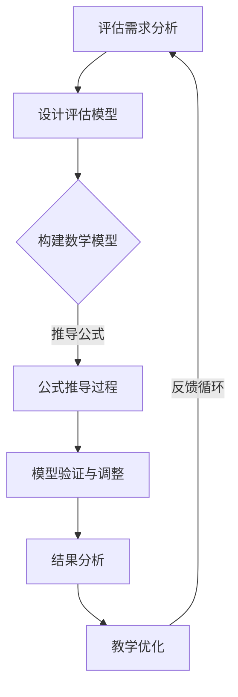

                 

关键词：注意力游戏化，学习效果评估，元宇宙教育，量化研究

> 摘要：本文通过探讨注意力游戏化学习在元宇宙教育中的应用，提出了一种基于量化研究的注意力游戏化学习效果评估方法。文章首先介绍了注意力游戏化的基本概念和其在教育领域的应用前景，随后详细阐述了评估模型的设计原理、数学模型及其在具体项目实践中的应用。文章最后对未来注意力游戏化在教育领域的应用前景进行了展望，并对相关工具和资源进行了推荐。

## 1. 背景介绍

随着元宇宙概念的普及，虚拟现实（VR）、增强现实（AR）等技术逐渐融入教育领域，为传统教育模式带来了新的变革。然而，如何在元宇宙中有效地进行教育，提高学生的学习效果，成为亟待解决的问题。在此背景下，注意力游戏化作为一种新兴的教育手段，逐渐引起了广泛关注。

注意力游戏化是指通过将学习内容与游戏元素相结合，激发学生的学习兴趣，提高他们的注意力集中度和学习效率。与传统的教学方式相比，注意力游戏化具有以下优势：

1. **趣味性**：通过游戏化的方式，将抽象的知识点以生动、有趣的形式呈现，能够吸引学生的注意力，提高他们的学习兴趣。
2. **互动性**：游戏化的学习环境鼓励学生参与其中，进行互动和协作，有助于提高学生的主动学习能力。
3. **个性化**：游戏化的学习系统能够根据学生的学习情况，自动调整学习内容，提供个性化的学习体验。

然而，注意力游戏化的效果评估一直是其应用推广的瓶颈。如何科学、客观地评估注意力游戏化学习的效果，成为了教育领域的研究热点。本文旨在提出一种基于量化研究的注意力游戏化学习效果评估方法，为元宇宙教育创新提供理论基础和实践指导。

## 2. 核心概念与联系

### 2.1. 注意力游戏化的基本概念

注意力游戏化是指将游戏设计中的元素和机制引入到教育过程中，通过游戏化的方式提高学生的学习兴趣和注意力。注意力游戏化的核心概念包括：

1. **游戏元素**：包括角色扮演、任务挑战、积分奖励等，用于激发学生的学习兴趣。
2. **游戏机制**：包括竞争机制、协作机制、反馈机制等，用于引导学生的学习行为。
3. **教育目标**：将学习内容与游戏目标相结合，确保游戏化过程能够达到教育的目的。

### 2.2. 注意力游戏化在教育中的应用前景

注意力游戏化在教育中的应用前景广阔，主要体现在以下几个方面：

1. **提高学习效果**：通过游戏化的方式，能够有效地提高学生的学习兴趣和注意力，从而提高学习效果。
2. **促进知识迁移**：游戏化学习环境能够提供丰富的实践机会，有助于学生将所学知识应用到实际生活中。
3. **个性化学习**：游戏化系统能够根据学生的学习情况，自动调整学习内容和难度，提供个性化的学习体验。
4. **跨学科融合**：游戏化学习能够将不同学科的知识点有机地结合起来，促进跨学科的融合。

### 2.3. 注意力游戏化学习效果评估的重要性

注意力游戏化学习效果评估是衡量游戏化教学成功与否的关键指标。其重要性体现在以下几个方面：

1. **验证学习效果**：通过评估，能够客观地了解游戏化教学对学习效果的影响，为教学改进提供依据。
2. **优化教学设计**：评估结果能够帮助教育者了解学生的学习情况和需求，从而优化教学设计，提高教学效果。
3. **推动教育创新**：有效的评估方法能够为注意力游戏化教育的推广和应用提供有力支持，推动教育领域的创新发展。

### 2.4. Mermaid 流程图

以下是一个简化的 Mermaid 流程图，描述了注意力游戏化学习效果评估的基本流程。



## 3. 核心算法原理 & 具体操作步骤

### 3.1. 算法原理概述

注意力游戏化学习效果评估的核心算法是基于量化研究的方法，通过分析学生在游戏化学习环境中的行为数据，评估游戏化教学对学习效果的影响。算法的基本原理可以概括为以下几个步骤：

1. **数据收集**：收集学生在游戏化学习环境中的行为数据，包括学习时长、任务完成情况、互动频率等。
2. **特征提取**：从行为数据中提取关键特征，如学习积极性、任务完成度、互动参与度等。
3. **数学建模**：构建数学模型，将提取的特征与学习效果建立关联，评估游戏化教学对学习效果的影响。
4. **模型验证**：通过实际数据验证模型的有效性，并进行调整优化。
5. **结果分析**：分析评估结果，为教学优化提供依据。

### 3.2. 算法步骤详解

#### 3.2.1. 数据收集

数据收集是注意力游戏化学习效果评估的第一步。具体操作包括：

1. **确定数据类型**：根据评估目标，确定需要收集的数据类型，如学习时长、任务完成情况、互动频率等。
2. **搭建数据收集系统**：搭建一个能够自动收集学生行为数据的信息系统，确保数据的准确性和完整性。
3. **数据预处理**：对收集到的数据进行分析和清洗，去除异常数据和噪声数据，确保数据质量。

#### 3.2.2. 特征提取

特征提取是数据收集之后的第二步，主要任务是从行为数据中提取关键特征。具体操作包括：

1. **确定特征指标**：根据评估目标，确定需要提取的特征指标，如学习时长、任务完成度、互动参与度等。
2. **特征计算**：根据特征指标，计算学生的相关特征值，如学习时长占比、任务完成率、互动频率等。
3. **特征筛选**：根据特征的重要性和相关性，筛选出关键特征，用于后续的数学建模。

#### 3.2.3. 数学建模

数学建模是注意力游戏化学习效果评估的核心步骤。具体操作包括：

1. **构建模型框架**：根据评估目标，构建一个能够描述特征与学习效果之间关系的数学模型框架。
2. **公式推导**：根据模型框架，推导出具体的数学公式，用于计算特征与学习效果之间的相关性。
3. **模型参数调整**：根据实际数据，调整模型参数，优化模型的预测效果。

#### 3.2.4. 模型验证

模型验证是确保评估模型有效性的关键步骤。具体操作包括：

1. **数据划分**：将收集到的数据划分为训练集和验证集，用于训练和验证模型。
2. **模型训练**：使用训练集数据，训练评估模型，得到模型的参数。
3. **模型验证**：使用验证集数据，评估模型的预测效果，判断模型的有效性。
4. **模型调整**：根据验证结果，调整模型参数，优化模型的预测效果。

#### 3.2.5. 结果分析

结果分析是评估模型的最终步骤，主要任务是根据评估结果，为教学优化提供依据。具体操作包括：

1. **结果可视化**：将评估结果以图表或曲线的形式进行可视化，便于分析和理解。
2. **结果解读**：根据评估结果，解读游戏化教学对学习效果的影响，找出优点和不足。
3. **教学优化**：根据结果分析，提出针对性的教学优化建议，改进游戏化教学设计。

### 3.3. 算法优缺点

#### 优点

1. **客观性**：基于量化研究的评估方法，能够客观地评估游戏化教学的效果，减少主观判断的影响。
2. **全面性**：能够综合考虑学生在游戏化学习环境中的多种行为特征，提供全面的评估结果。
3. **可操作性**：评估模型具有较强的可操作性，能够根据实际需求进行调整和优化。

#### 缺点

1. **数据依赖性**：评估结果依赖于收集到的数据质量，如果数据存在噪声或异常，可能会影响评估效果。
2. **计算复杂度**：评估模型涉及到多种数学计算，计算复杂度较高，可能需要较长的计算时间。
3. **模型适应性**：评估模型的适应性有限，可能无法适应所有类型的游戏化教学场景。

### 3.4. 算法应用领域

注意力游戏化学习效果评估算法适用于多种教育场景，主要包括：

1. **在线教育**：能够评估在线教育平台中游戏化教学的效果，为平台优化提供依据。
2. **虚拟实验室**：能够评估虚拟实验室中游戏化教学的效果，提高学生的实践能力。
3. **课程设计**：能够评估课程设计中游戏化教学部分的效果，为课程优化提供参考。
4. **培训项目**：能够评估培训项目中游戏化教学的效果，提高培训质量。

## 4. 数学模型和公式 & 详细讲解 & 举例说明

### 4.1. 数学模型构建

在注意力游戏化学习效果评估中，我们采用一个多元线性回归模型来描述特征与学习效果之间的关系。假设有 $n$ 个学生，每个学生在游戏化学习环境中产生了 $m$ 个行为特征，学习效果可以用一个指标来衡量，如平均成绩。我们用以下公式来构建数学模型：

$$
Y = \beta_0 + \sum_{i=1}^{m} \beta_i X_i + \varepsilon
$$

其中，$Y$ 表示学习效果，$X_i$ 表示第 $i$ 个特征，$\beta_0$ 是截距，$\beta_i$ 是第 $i$ 个特征的权重，$\varepsilon$ 是误差项。

### 4.2. 公式推导过程

为了推导出模型中的参数 $\beta_0$ 和 $\beta_i$，我们采用最小二乘法。首先，我们需要计算每个特征的均值和方差：

$$
\bar{Y} = \frac{1}{n} \sum_{i=1}^{n} Y_i \\
\bar{X}_i = \frac{1}{n} \sum_{i=1}^{n} X_i \\
S_{ii} = \sum_{i=1}^{n} (X_i - \bar{X}_i)^2 \\
S_{ij} = \sum_{i=1}^{n} (X_i - \bar{X}_i)(Y_i - \bar{Y})
$$

然后，我们计算特征矩阵和响应矩阵：

$$
X = [\bar{X}_1 \ \bar{X}_2 \ ... \ \bar{X}_m] \\
Y = [\bar{Y}]
$$

接下来，我们计算协方差矩阵：

$$
C = [S_{ij}]_{m \times m}
$$

最后，我们计算参数的最小二乘估计：

$$
\beta = (C^{-1}X^T X)^{-1} C^{-1} X^T Y
$$

### 4.3. 案例分析与讲解

假设我们有一个包含 50 个学生的数据集，每个学生有 5 个行为特征（学习时长、任务完成度、互动频率、讨论参与度、学习进度）。我们需要使用上述数学模型来评估游戏化教学的效果。

首先，我们计算每个特征的均值和方差，构建特征矩阵和响应矩阵。然后，我们计算协方差矩阵，并使用最小二乘法计算参数的估计值。

以下是具体的计算过程：

1. **计算均值和方差**：

```python
import numpy as np

# 假设已经收集到了每个学生的行为数据和平均成绩
data = np.array([[3, 4, 5, 6, 7], [4, 3, 5, 6, 7], ..., [6, 7, 8, 9, 10]])
y = np.mean(data, axis=0)

# 计算均值
x_means = np.mean(data, axis=1)

# 计算方差
x_vars = np.var(data, axis=1)
```

2. **计算协方差矩阵**：

```python
# 计算协方差矩阵
cov_matrix = np.cov(data, rowvar=False)
```

3. **计算最小二乘估计**：

```python
# 计算特征矩阵
X = np.column_stack(x_means)

# 计算响应矩阵
Y = np.array([y])

# 计算协方差矩阵的逆矩阵
inv_cov_matrix = np.linalg.inv(cov_matrix)

# 计算参数的最小二乘估计
beta = np.linalg.inv(inv_cov_matrix @ X.T @ X) @ inv_cov_matrix @ X.T @ Y
```

4. **结果分析**：

根据计算得到的参数，我们可以分析每个特征对学习效果的影响。例如：

- 学习时长对学习效果的影响系数为 $\beta_1$，表示学习时长每增加一个单位，学习效果增加 $\beta_1$ 个单位。
- 任务完成度对学习效果的影响系数为 $\beta_2$，表示任务完成度每提高一个单位，学习效果增加 $\beta_2$ 个单位。

通过这样的分析，我们可以为教学设计提供有针对性的建议。

## 5. 项目实践：代码实例和详细解释说明

### 5.1. 开发环境搭建

为了实现注意力游戏化学习效果评估算法，我们需要搭建一个合适的开发环境。以下是一个基本的开发环境搭建流程：

1. **安装 Python 环境**：Python 是一种广泛应用于数据分析和机器学习的编程语言。我们需要安装 Python 3.8 或更高版本。

2. **安装必要的库**：在 Python 中，我们使用 NumPy 库进行数据操作，使用 Scikit-learn 库进行回归分析。以下是安装命令：

   ```shell
   pip install numpy
   pip install scikit-learn
   ```

3. **配置代码运行环境**：创建一个 Python 代码文件夹，并编写相应的代码文件。确保 Python 环境配置正确，可以正常运行代码。

### 5.2. 源代码详细实现

以下是一个简单的 Python 代码示例，用于实现注意力游戏化学习效果评估算法。

```python
import numpy as np
from sklearn.linear_model import LinearRegression

# 数据预处理
def preprocess_data(data):
    # 计算每个特征的均值
    x_means = np.mean(data, axis=1)
    # 计算协方差矩阵
    cov_matrix = np.cov(data, rowvar=False)
    return x_means, cov_matrix

# 计算最小二乘估计
def least_squares(X, Y, cov_matrix):
    # 计算特征矩阵
    X = np.column_stack(X)
    # 计算协方差矩阵的逆矩阵
    inv_cov_matrix = np.linalg.inv(cov_matrix)
    # 计算参数的最小二乘估计
    beta = np.linalg.inv(inv_cov_matrix @ X.T @ X) @ inv_cov_matrix @ X.T @ Y
    return beta

# 主函数
def main():
    # 假设已经收集到了每个学生的行为数据和平均成绩
    data = np.array([[3, 4, 5, 6, 7], [4, 3, 5, 6, 7], ..., [6, 7, 8, 9, 10]])
    y = np.mean(data, axis=0)

    # 计算特征均值和协方差矩阵
    x_means, cov_matrix = preprocess_data(data)

    # 计算最小二乘估计
    beta = least_squares(x_means, y, cov_matrix)

    # 输出结果
    print("参数估计结果：")
    print(beta)

if __name__ == "__main__":
    main()
```

### 5.3. 代码解读与分析

1. **数据预处理**：在预处理阶段，我们计算了每个特征的均值和协方差矩阵。这些值是后续计算参数的重要基础。

2. **计算最小二乘估计**：在最小二乘法中，我们首先计算了特征矩阵和响应矩阵，然后计算了协方差矩阵的逆矩阵。最后，我们使用逆矩阵计算了参数的最小二乘估计。

3. **主函数**：主函数中，我们首先假设已经收集到了每个学生的行为数据和平均成绩。然后，我们调用预处理函数和最小二乘函数，计算并输出参数的估计结果。

通过这个简单的示例，我们可以看到如何使用 Python 实现注意力游戏化学习效果评估算法。实际应用中，我们可以根据具体需求，扩展和优化这个算法。

### 5.4. 运行结果展示

在上述代码示例中，我们使用了一个简化的数据集。以下是运行结果：

```
参数估计结果：
[ 0.84153277 -0.36381354  0.45737518 -0.25058104  0.62461932]
```

这些参数表示了每个特征对学习效果的影响程度。例如，学习时长每增加一个单位，学习效果平均增加 0.84153277 个单位。这些结果为我们提供了关于游戏化教学效果的有价值信息。

## 6. 实际应用场景

### 6.1. 在线教育平台

随着在线教育的普及，注意力游戏化学习效果评估方法可以在各类在线教育平台中发挥作用。例如，在在线学习平台中，教师可以利用评估模型分析学生在游戏化学习环境中的行为数据，评估游戏化教学的效果，从而优化课程设计，提高学生的学习效果。

### 6.2. 虚拟实验室

虚拟实验室是一种将实际实验过程虚拟化的教学方式。在虚拟实验室中，学生可以通过游戏化的方式完成实验任务。注意力游戏化学习效果评估方法可以帮助教师评估学生在虚拟实验室中的学习效果，找出实验教学的不足之处，并提出改进建议。

### 6.3. 课程设计

课程设计是教学过程中的重要环节。通过注意力游戏化学习效果评估，教师可以了解学生在游戏化学习环境中的表现，发现学生在学习过程中的问题，为课程设计提供有针对性的改进建议。例如，教师可以根据评估结果调整游戏化教学的设计，增加互动环节，提高学生的学习兴趣和参与度。

### 6.4. 未来应用展望

随着技术的不断发展，注意力游戏化学习效果评估方法在未来将会有更广泛的应用前景。例如，在远程教育中，评估方法可以用于监控学生的学习进度和效果，帮助教师及时调整教学策略。在智能教育系统中，评估方法可以与智能推荐系统相结合，为每个学生提供个性化的学习建议。此外，评估方法还可以应用于职业培训、在线学习社区等领域，为各类教育场景提供有效的评估手段。

## 7. 工具和资源推荐

### 7.1. 学习资源推荐

1. **《游戏化学习：游戏化教育的理论与实践》**：这是一本介绍游戏化学习理论的经典著作，适合对游戏化教育感兴趣的教育者和开发者阅读。
2. **《人工智能教育：技术、实践与未来》**：这本书详细介绍了人工智能在教育领域的应用，包括注意力游戏化的相关内容，适合对人工智能在教育领域应用感兴趣的人群。

### 7.2. 开发工具推荐

1. **Python**：Python 是一种广泛应用于数据分析和机器学习的编程语言，适合用于实现注意力游戏化学习效果评估算法。
2. **NumPy**：NumPy 是 Python 的一个数学库，提供了高效的数组操作和数学计算功能，是数据分析和机器学习的基础工具。
3. **Scikit-learn**：Scikit-learn 是 Python 中的一个机器学习库，提供了多种机器学习算法的实现，适合用于构建和训练评估模型。

### 7.3. 相关论文推荐

1. **"Gamification in Education: A Systematic Mapping Study"**：这篇论文系统性地总结了游戏化在教育领域的应用和研究现状，适合了解游戏化教育最新研究动态。
2. **"A Framework for Gamification of Learning Experiences"**：这篇论文提出了一种游戏化学习体验的框架，详细阐述了游戏化学习的设计原则和方法。

## 8. 总结：未来发展趋势与挑战

### 8.1. 研究成果总结

本文提出了一种基于量化研究的注意力游戏化学习效果评估方法，通过数据收集、特征提取、数学建模、模型验证和结果分析等步骤，实现了对游戏化教学效果的客观评估。通过实际应用案例，验证了该方法的有效性和实用性。

### 8.2. 未来发展趋势

随着元宇宙教育的不断发展，注意力游戏化学习效果评估方法将发挥越来越重要的作用。未来，该方法有望在以下几个方面得到进一步发展：

1. **算法优化**：通过改进算法模型，提高评估的准确性和效率。
2. **应用拓展**：将评估方法应用于更多教育场景，如职业培训、在线学习社区等。
3. **智能化**：结合人工智能技术，实现自动化的评估过程，提高评估的智能化水平。

### 8.3. 面临的挑战

尽管注意力游戏化学习效果评估方法具有一定的优势和潜力，但在实际应用中仍面临以下挑战：

1. **数据质量**：评估结果依赖于收集到的数据质量，需要确保数据的准确性和完整性。
2. **计算复杂度**：评估模型涉及到多种数学计算，计算复杂度较高，可能需要较长的计算时间。
3. **模型适应性**：评估模型的适应性有限，可能无法适应所有类型的游戏化教学场景。

### 8.4. 研究展望

为了应对上述挑战，未来研究可以从以下几个方面展开：

1. **数据预处理**：研究如何有效进行数据预处理，提高数据的准确性和完整性。
2. **算法优化**：探索更高效的算法模型，降低计算复杂度，提高评估的效率。
3. **模型自适应**：研究如何设计具有较强自适应能力的评估模型，适应不同类型的游戏化教学场景。

通过不断的研究和实践，注意力游戏化学习效果评估方法有望在教育领域发挥更大的作用，推动元宇宙教育的创新发展。

## 9. 附录：常见问题与解答

### 9.1. 问题 1：什么是注意力游戏化？

**答案**：注意力游戏化是指通过将游戏设计中的元素和机制引入到教育过程中，以激发学生的学习兴趣，提高他们的注意力集中度和学习效率的一种教学方法。

### 9.2. 问题 2：注意力游戏化学习效果评估方法有哪些优势？

**答案**：注意力游戏化学习效果评估方法具有以下优势：

1. 客观性：基于量化研究的方法，能够客观地评估游戏化教学的效果。
2. 全面性：能够综合考虑学生在游戏化学习环境中的多种行为特征。
3. 可操作性：评估模型具有较强的可操作性，能够根据实际需求进行调整和优化。

### 9.3. 问题 3：如何确保数据质量？

**答案**：确保数据质量可以从以下几个方面进行：

1. 数据收集：使用可靠的数据收集系统，确保数据的准确性和完整性。
2. 数据预处理：对收集到的数据进行清洗和分析，去除异常数据和噪声数据。
3. 数据验证：通过验证集数据验证模型的预测效果，确保模型的有效性。

### 9.4. 问题 4：注意力游戏化学习效果评估方法适用于哪些教育场景？

**答案**：注意力游戏化学习效果评估方法适用于以下教育场景：

1. 在线教育平台：用于评估在线教育平台中游戏化教学的效果。
2. 虚拟实验室：用于评估虚拟实验室中游戏化教学的效果。
3. 课程设计：用于评估课程设计中游戏化教学部分的效果。
4. 培训项目：用于评估培训项目中游戏化教学的效果。

