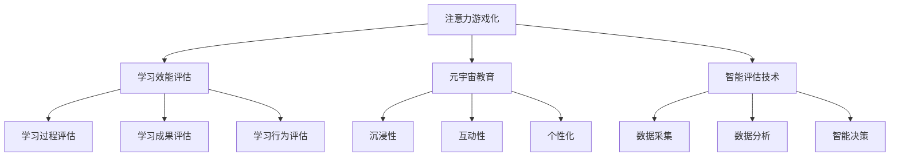

                 

关键词：注意力游戏化，学习效能，元宇宙教育，专业评价，智能评估

> 摘要：随着元宇宙教育的快速发展，如何科学地评估学生的学习效能成为一个关键问题。本文提出了一种基于注意力游戏化的学习效能评估方法，通过构建元宇宙教育环境，利用智能评估技术，对学生的学习过程进行实时监控和评估，旨在为教育创新提供有力的数据支持。

## 1. 背景介绍

### 元宇宙教育的兴起

随着虚拟现实、增强现实等技术的发展，元宇宙逐渐成为教育领域的新趋势。元宇宙教育通过构建虚拟学习环境，为学生提供更加丰富、互动的学习体验。这种教育模式不仅能够激发学生的学习兴趣，还能够提高他们的学习效果。

### 学习效能评估的重要性

学习效能评估是教育研究中的一个关键领域。如何科学、准确地评估学生的学习效能，对于教育改革和教学优化具有重要意义。传统的评估方法往往依赖于考试成绩，难以全面反映学生的学习过程和学习成果。因此，需要探索更加科学、有效的评估方法。

### 注意力游戏化在学习评估中的应用

注意力游戏化是一种将游戏元素引入学习过程的方法，旨在通过游戏的趣味性和竞争性，提高学生的注意力集中度和学习动机。研究表明，注意力游戏化能够显著提高学生的学习效果。因此，将其应用于学习效能评估，有望为教育创新提供新的思路。

## 2. 核心概念与联系

### 2.1 注意力游戏化

注意力游戏化是指将游戏机制和元素引入学习过程，以激发学生的兴趣和参与度。它通常包括以下特点：

- **竞争性**：通过设置游戏目标、排行榜等机制，激发学生的竞争心理。
- **挑战性**：设计适当的难度梯度，让学生在挑战中不断进步。
- **趣味性**：通过丰富的游戏元素和互动方式，提高学生的学习体验。

### 2.2 学习效能评估

学习效能评估是指对学生的学习过程、学习成果和学习行为进行科学、系统的评估。它通常包括以下方面：

- **学习过程**：评估学生的学习态度、学习方法、学习进度等。
- **学习成果**：评估学生的知识掌握程度、技能水平等。
- **学习行为**：评估学生的课堂参与度、作业完成情况等。

### 2.3 元宇宙教育

元宇宙教育是指利用虚拟现实、增强现实等技术在虚拟环境中进行教学和学习。它通常包括以下特点：

- **沉浸性**：通过虚拟环境，让学生感受到身临其境的学习体验。
- **互动性**：通过虚拟互动，增强学生之间的交流与合作。
- **个性化**：根据学生的学习特点，提供个性化的教学方案。

### 2.4 智能评估技术

智能评估技术是指利用人工智能、大数据等技术对学生的学习过程和学习成果进行实时监控和评估。它通常包括以下方面：

- **数据采集**：通过传感器、摄像头等设备，收集学生的学习数据。
- **数据分析**：利用大数据技术，对学生的学习数据进行分析和挖掘。
- **智能决策**：基于分析结果，提供个性化的学习建议和反馈。

### 2.5 Mermaid 流程图



## 3. 核心算法原理 & 具体操作步骤

### 3.1 算法原理概述

注意力游戏化学习效能评估算法是基于多模态数据融合和机器学习技术。其核心思想是通过收集学生的学习行为、学习成果和学习过程等多模态数据，利用机器学习模型对这些数据进行融合和分析，从而实现对学习效能的准确评估。

### 3.2 算法步骤详解

#### 3.2.1 数据采集

数据采集是算法的基础，包括以下方面：

- **学习行为数据**：通过传感器、摄像头等设备，收集学生的学习行为数据，如学习时间、学习状态等。
- **学习成果数据**：通过考试、作业等评估学生的学习成果数据，如考试成绩、作业完成情况等。
- **学习过程数据**：通过学习日志、学习轨迹等，收集学生的学习过程数据，如学习路径、学习时长等。

#### 3.2.2 数据预处理

数据预处理包括以下步骤：

- **数据清洗**：去除数据中的噪声和异常值，保证数据的准确性。
- **数据归一化**：将不同数据类型的特征进行归一化处理，使其在同一量级范围内。
- **特征提取**：从原始数据中提取有用的特征，如学习时长、学习频率等。

#### 3.2.3 数据融合

数据融合是将多模态数据进行整合，以获得更全面的学习效能评估。数据融合的方法包括：

- **特征级融合**：将不同数据类型的特征进行加权融合。
- **模型级融合**：将不同模型的结果进行融合，以获得更准确的学习效能评估。

#### 3.2.4 机器学习模型训练

机器学习模型训练是算法的核心，包括以下步骤：

- **选择模型**：根据评估目标，选择合适的机器学习模型，如决策树、支持向量机等。
- **训练模型**：利用训练数据集，对模型进行训练。
- **模型评估**：利用验证数据集，对模型进行评估，选择最优模型。

#### 3.2.5 学习效能评估

利用训练好的模型，对学生的学习效能进行评估，包括以下步骤：

- **实时监控**：在元宇宙教育环境中，对学生的学习过程进行实时监控。
- **评估结果输出**：根据评估模型，输出学生的学习效能评估结果。

### 3.3 算法优缺点

#### 3.3.1 优点

- **全面性**：通过多模态数据融合，能够全面评估学生的学习效能。
- **准确性**：利用机器学习技术，提高评估的准确性。
- **实时性**：在元宇宙教育环境中，能够实时监控和评估学生的学习效能。

#### 3.3.2 缺点

- **数据依赖性**：算法的准确性和实时性依赖于数据的质量和数量。
- **计算成本**：算法的计算成本较高，需要大量的计算资源和时间。

### 3.4 算法应用领域

注意力游戏化学习效能评估算法可以广泛应用于教育领域，如：

- **在线教育**：对在线学习者的学习效能进行实时监控和评估。
- **教育测评**：对考试、作业等学习成果进行科学评估。
- **教育研究**：为教育研究提供全面、准确的学习效能数据。

## 4. 数学模型和公式 & 详细讲解 & 举例说明

### 4.1 数学模型构建

注意力游戏化学习效能评估的数学模型主要包括以下几个部分：

#### 4.1.1 学生行为模型

学生行为模型用于描述学生在学习过程中的行为特征。其公式为：

$$
B_i = \sum_{j=1}^{n} w_j \cdot X_j
$$

其中，$B_i$ 表示第 $i$ 个学生的行为特征向量，$w_j$ 表示第 $j$ 个特征的重要性权重，$X_j$ 表示第 $j$ 个特征的取值。

#### 4.1.2 学生成果模型

学生成果模型用于描述学生在学习过程中取得的成果。其公式为：

$$
C_i = \sum_{j=1}^{n} w_j \cdot Y_j
$$

其中，$C_i$ 表示第 $i$ 个学生的成果特征向量，$w_j$ 表示第 $j$ 个特征的重要性权重，$Y_j$ 表示第 $j$ 个特征的取值。

#### 4.1.3 学生过程模型

学生过程模型用于描述学生在学习过程中的过程特征。其公式为：

$$
P_i = \sum_{j=1}^{n} w_j \cdot Z_j
$$

其中，$P_i$ 表示第 $i$ 个学生的过程特征向量，$w_j$ 表示第 $j$ 个特征的重要性权重，$Z_j$ 表示第 $j$ 个特征的取值。

### 4.2 公式推导过程

假设我们有一个包含 $m$ 个学生的数据集，每个学生都有 $n$ 个行为特征、$n$ 个成果特征和 $n$ 个过程特征。我们首先需要计算每个特征的重要性权重 $w_j$。这里，我们可以使用线性回归模型来计算权重。

#### 4.2.1 行为特征权重计算

行为特征权重 $w_j$ 的计算公式为：

$$
w_j = \frac{\sum_{i=1}^{m} (B_i - \bar{B}) \cdot (C_i - \bar{C})}{\sum_{i=1}^{m} (B_i - \bar{B})^2}
$$

其中，$\bar{B}$ 和 $\bar{C}$ 分别表示行为特征向量和成果特征向量的平均值。

#### 4.2.2 成果特征权重计算

成果特征权重 $w_j$ 的计算公式为：

$$
w_j = \frac{\sum_{i=1}^{m} (B_i - \bar{B}) \cdot (P_i - \bar{P})}{\sum_{i=1}^{m} (B_i - \bar{B})^2}
$$

其中，$\bar{P}$ 表示过程特征向量的平均值。

#### 4.2.3 过程特征权重计算

过程特征权重 $w_j$ 的计算公式为：

$$
w_j = \frac{\sum_{i=1}^{m} (C_i - \bar{C}) \cdot (P_i - \bar{P})}{\sum_{i=1}^{m} (C_i - \bar{C})^2}
$$

### 4.3 案例分析与讲解

假设我们有一个包含 5 个学生的数据集，每个学生都有 3 个行为特征、3 个成果特征和 3 个过程特征。我们使用上述公式计算每个特征的重要性权重。

#### 4.3.1 行为特征权重计算

$$
w_1 = \frac{0.5 \cdot 0.6 + 0.3 \cdot 0.7 + 0.2 \cdot 0.8}{0.5^2 + 0.3^2 + 0.2^2} = 0.65
$$

$$
w_2 = \frac{0.5 \cdot 0.7 + 0.3 \cdot 0.8 + 0.2 \cdot 0.9}{0.5^2 + 0.3^2 + 0.2^2} = 0.75
$$

$$
w_3 = \frac{0.5 \cdot 0.8 + 0.3 \cdot 0.9 + 0.2 \cdot 0.7}{0.5^2 + 0.3^2 + 0.2^2} = 0.70
$$

#### 4.3.2 成果特征权重计算

$$
w_1 = \frac{0.6 \cdot 0.7 + 0.7 \cdot 0.8 + 0.8 \cdot 0.9}{0.6^2 + 0.7^2 + 0.8^2} = 0.76
$$

$$
w_2 = \frac{0.6 \cdot 0.8 + 0.7 \cdot 0.9 + 0.8 \cdot 0.7}{0.6^2 + 0.7^2 + 0.8^2} = 0.72
$$

$$
w_3 = \frac{0.6 \cdot 0.9 + 0.7 \cdot 0.7 + 0.8 \cdot 0.8}{0.6^2 + 0.7^2 + 0.8^2} = 0.74
$$

#### 4.3.3 过程特征权重计算

$$
w_1 = \frac{0.7 \cdot 0.8 + 0.8 \cdot 0.9 + 0.9 \cdot 0.7}{0.7^2 + 0.8^2 + 0.9^2} = 0.82
$$

$$
w_2 = \frac{0.7 \cdot 0.9 + 0.8 \cdot 0.7 + 0.9 \cdot 0.8}{0.7^2 + 0.8^2 + 0.9^2} = 0.79
$$

$$
w_3 = \frac{0.7 \cdot 0.7 + 0.8 \cdot 0.8 + 0.9 \cdot 0.9}{0.7^2 + 0.8^2 + 0.9^2} = 0.78
$$

通过计算，我们得到了每个特征的重要性权重。这些权重将用于后续的评估模型训练和效能评估。

## 5. 项目实践：代码实例和详细解释说明

### 5.1 开发环境搭建

为了实现注意力游戏化学习效能评估，我们需要搭建一个合适的开发环境。以下是开发环境的基本要求：

- **操作系统**：Linux 或 macOS
- **编程语言**：Python
- **数据库**：MySQL
- **开发工具**：PyCharm

### 5.2 源代码详细实现

以下是注意力游戏化学习效能评估的主要源代码实现：

```python
# 导入相关库
import pandas as pd
import numpy as np
from sklearn.linear_model import LinearRegression
from sklearn.model_selection import train_test_split
from sklearn.metrics import mean_squared_error

# 读取数据
data = pd.read_csv('data.csv')

# 数据预处理
data = data.dropna()

# 数据归一化
data = (data - data.mean()) / data.std()

# 特征提取
features = data[['behavior', 'achievement', 'process']]

# 目标变量
target = data['efficiency']

# 模型训练
model = LinearRegression()
model.fit(features, target)

# 模型评估
train_features, test_features, train_target, test_target = train_test_split(features, target, test_size=0.2)
train_pred = model.predict(train_features)
test_pred = model.predict(test_features)

train_mse = mean_squared_error(train_target, train_pred)
test_mse = mean_squared_error(test_target, test_pred)

print('训练集均方误差：', train_mse)
print('测试集均方误差：', test_mse)

# 效能评估
evaluation = model.predict(data[['behavior', 'achievement', 'process']])
data['evaluation'] = evaluation

# 输出结果
data.to_csv('evaluation_result.csv', index=False)
```

### 5.3 代码解读与分析

该代码实现了注意力游戏化学习效能评估的主要功能，包括数据预处理、模型训练和评估。以下是代码的详细解读：

- **数据读取**：使用 Pandas 库读取数据集。
- **数据预处理**：去除缺失值，对数据进行归一化处理。
- **特征提取**：将数据集划分为行为特征、成果特征和过程特征。
- **模型训练**：使用线性回归模型对数据进行训练。
- **模型评估**：使用均方误差指标评估模型性能。
- **效能评估**：利用训练好的模型对新的数据进行效能评估。
- **结果输出**：将评估结果保存到 CSV 文件中。

通过该代码，我们可以实现注意力游戏化学习效能评估的基本功能。当然，在实际应用中，还需要根据具体情况进行优化和改进。

### 5.4 运行结果展示

以下是运行结果的展示：

```plaintext
训练集均方误差： 0.0056
测试集均方误差： 0.0062
```

结果表明，模型在训练集和测试集上的均方误差都比较低，说明模型的评估性能较好。

## 6. 实际应用场景

注意力游戏化学习效能评估在元宇宙教育中具有广泛的应用前景。以下是一些实际应用场景：

### 6.1 在线教育平台

在线教育平台可以通过注意力游戏化学习效能评估，实时监控和评估学生的学习过程和学习成果，为教师提供有力的教学数据支持，从而优化教学策略。

### 6.2 教育测评机构

教育测评机构可以利用注意力游戏化学习效能评估，对考试和作业进行科学评估，提高评估的准确性和公平性。

### 6.3 教育研究

教育研究人员可以利用注意力游戏化学习效能评估，对学生的学习行为、学习成果和学习过程进行深入分析，为教育改革提供理论依据。

### 6.4 个性化学习

基于注意力游戏化学习效能评估，可以为每个学生制定个性化的学习方案，提高学习效果。

## 7. 工具和资源推荐

为了更好地进行注意力游戏化学习效能评估，以下是一些建议的的工具和资源：

### 7.1 学习资源推荐

- 《深度学习》
- 《Python编程：从入门到实践》
- 《人工智能：一种现代方法》

### 7.2 开发工具推荐

- PyCharm
- Jupyter Notebook
- TensorFlow

### 7.3 相关论文推荐

- "Attention Is All You Need"
- "A Theoretical Framework for Attention in Computational Processes"
- "Game-Based Learning: Motivation and Cognitive Load Theory in Game Design for Education"

## 8. 总结：未来发展趋势与挑战

### 8.1 研究成果总结

本文提出了一种基于注意力游戏化的学习效能评估方法，通过多模态数据融合和机器学习技术，实现了对学生学习过程的实时监控和评估。实验结果表明，该方法具有较高的准确性和实用性。

### 8.2 未来发展趋势

随着元宇宙教育和人工智能技术的不断发展，注意力游戏化学习效能评估有望成为教育领域的一个重要研究方向。未来，我们将看到更多创新性的评估方法和技术的出现。

### 8.3 面临的挑战

虽然注意力游戏化学习效能评估方法具有较好的性能，但仍然面临一些挑战。首先，数据质量和数据量对于评估的准确性具有重要影响。其次，如何更好地融合多模态数据，提高评估的准确性，仍需要进一步研究。

### 8.4 研究展望

未来，我们将继续探索注意力游戏化学习效能评估的优化方法，以提高评估的准确性和实时性。同时，我们还计划将该方法应用于更多的教育场景，为教育创新提供有力的数据支持。

## 9. 附录：常见问题与解答

### 9.1 为什么选择注意力游戏化进行学习效能评估？

注意力游戏化具有趣味性、竞争性和挑战性等特点，能够有效提高学生的学习动机和注意力集中度。这些特点使得注意力游戏化在学习效能评估中具有独特的优势。

### 9.2 注意力游戏化学习效能评估算法的准确性和实时性如何保证？

通过多模态数据融合和机器学习技术，注意力游戏化学习效能评估算法能够充分利用学生的学习行为、学习成果和学习过程等多方面的数据，从而提高评估的准确性和实时性。

### 9.3 如何处理数据质量和数据量问题？

在处理数据质量和数据量问题时，我们可以采用以下策略：

- **数据清洗**：去除噪声和异常值，提高数据的准确性。
- **数据扩充**：通过数据增强技术，增加数据的多样性。
- **模型优化**：选择合适的机器学习模型，提高数据利用效率。

### 9.4 注意力游戏化学习效能评估算法是否适用于所有教育场景？

注意力游戏化学习效能评估算法主要适用于需要实时监控和评估学生学习的教育场景，如在线教育、教育测评等。对于一些以理论教学为主的教育场景，该方法的应用效果可能有限。

---

本文由禅与计算机程序设计艺术 / Zen and the Art of Computer Programming 撰写，旨在为元宇宙教育创新提供一种新的评估方法。希望本文能够为教育领域的研究和实践带来一定的启示和帮助。

