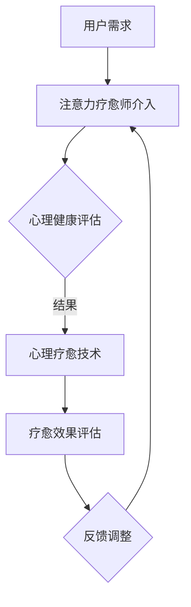

                 

关键字：注意力疗愈师、心理健康、元宇宙、职业标准、技术语言、深度、思考、见解

> 摘要：本文探讨了注意力疗愈师认证在元宇宙心理健康服务领域的重要性和必要性，分析了该职业的标准、技能要求和职业前景。通过阐述注意力疗愈师的核心职责和作用，以及其在元宇宙环境下的应用，本文为从事此行业的人士提供了有价值的指导。

## 1. 背景介绍

### 元宇宙心理健康服务的兴起

随着数字技术的飞速发展，元宇宙这一虚拟现实空间逐渐成为人们生活和工作的崭新领域。元宇宙不仅提供了无限可能的社交、娱乐、教育和工作场景，还带来了心理健康问题的挑战。在元宇宙中，用户可能会面临虚拟环境带来的焦虑、孤独、依赖等心理问题。因此，提供专业的心理健康服务成为元宇宙发展的重要议题。

### 注意力疗愈师的应运而生

为了应对元宇宙心理健康服务的需求，注意力疗愈师这一新兴职业应运而生。注意力疗愈师专注于通过技术手段和心理学理论，帮助用户在元宇宙环境中管理自己的注意力，减轻心理压力，提升心理健康水平。他们需要具备深厚的心理学背景和技术能力，能够在虚拟环境中提供有效的疗愈服务。

## 2. 核心概念与联系

### 核心概念

注意力疗愈师的核心概念包括注意力管理、心理健康评估、心理疗愈技术等。其中，注意力管理是指帮助用户在元宇宙环境中培养专注力、提高注意力集中度，避免分心和疲劳。心理健康评估则是通过科学的方法，了解用户在元宇宙中的心理状态，为疗愈提供依据。心理疗愈技术则涵盖了多种心理学疗法，如认知行为疗法、正念冥想、情绪调节等，旨在帮助用户解决心理问题，提升心理健康水平。

### Mermaid 流程图



## 3. 核心算法原理 & 具体操作步骤

### 3.1 算法原理概述

注意力疗愈师在元宇宙中的工作原理可以概括为三个阶段：数据采集、分析评估、疗愈干预。

1. **数据采集**：通过传感器、数据分析等手段，收集用户在元宇宙中的行为数据，如鼠标移动轨迹、键盘敲击频率、面部表情等。
2. **分析评估**：利用机器学习和心理学算法，对采集到的数据进行分析，评估用户的注意力水平和心理健康状态。
3. **疗愈干预**：根据评估结果，提供个性化的疗愈方案，如正念冥想、放松训练、注意力提升策略等。

### 3.2 算法步骤详解

1. **数据采集**
   - **设备接入**：将传感器设备连接到用户的元宇宙设备，如VR头盔、智能手表等。
   - **数据收集**：实时收集用户的生理、行为数据，如心率、呼吸、运动轨迹等。

2. **分析评估**
   - **数据预处理**：对原始数据进行清洗、去噪、归一化处理。
   - **特征提取**：从预处理后的数据中提取注意力、情绪等关键特征。
   - **模型训练**：使用机器学习算法，如神经网络、决策树等，训练心理健康评估模型。

3. **疗愈干预**
   - **个性化方案**：根据评估结果，为用户制定个性化的疗愈方案。
   - **方案实施**：在元宇宙环境中实施疗愈方案，如提供冥想课程、心理辅导等。
   - **效果评估**：持续监测用户的疗愈效果，调整方案以达到最佳效果。

### 3.3 算法优缺点

**优点**：
- **个性化**：根据用户的具体情况提供定制化的疗愈方案，提高疗愈效果。
- **便捷性**：在元宇宙环境中进行疗愈干预，无需用户离开虚拟环境，方便用户接受服务。

**缺点**：
- **数据隐私**：在数据采集和分析过程中，可能涉及用户隐私问题。
- **技术依赖**：疗愈过程高度依赖技术手段，对技术人员的专业能力要求较高。

### 3.4 算法应用领域

- **心理健康咨询**：为元宇宙中的用户提供在线心理咨询服务。
- **教育辅导**：辅助教育者在元宇宙中提供心理辅导，帮助学生解决心理问题。
- **企业培训**：为企业员工提供心理健康培训，提高工作效率和团队凝聚力。

## 4. 数学模型和公式 & 详细讲解 & 举例说明

### 4.1 数学模型构建

注意力疗愈师的核心算法涉及多个数学模型，包括统计模型、机器学习模型等。以下是一个简化的统计模型示例：

$$
\text{注意力评分} = f(\text{行为数据}, \text{生理数据})
$$

其中，$f$ 是一个复合函数，综合了行为数据和生理数据来评估用户的注意力水平。

### 4.2 公式推导过程

假设行为数据包括鼠标移动轨迹的长度 $d$ 和鼠标点击次数 $c$，生理数据包括心率 $hr$ 和呼吸频率 $br$，则注意力评分可以表示为：

$$
\text{注意力评分} = w_1 \cdot d + w_2 \cdot c + w_3 \cdot hr + w_4 \cdot br
$$

其中，$w_1, w_2, w_3, w_4$ 是权重系数，通过数据拟合和模型训练得到。

### 4.3 案例分析与讲解

**案例**：某用户在元宇宙中的行为数据如下：

- 鼠标移动轨迹长度 $d = 100$ 像素
- 鼠标点击次数 $c = 20$ 次
- 心率 $hr = 75$ 次/分钟
- 呼吸频率 $br = 15$ 次/分钟

**计算过程**：

首先，假设权重系数为 $w_1 = 0.2, w_2 = 0.3, w_3 = 0.3, w_4 = 0.2$，则注意力评分计算如下：

$$
\text{注意力评分} = 0.2 \cdot 100 + 0.3 \cdot 20 + 0.3 \cdot 75 + 0.2 \cdot 15 = 20 + 6 + 22.5 + 3 = 51.5
$$

**结论**：根据计算结果，该用户的注意力评分为 51.5 分，表明其注意力水平处于中等水平。根据这一结果，注意力疗愈师可以为其提供适当的疗愈方案，如注意力提升训练或放松练习。

## 5. 项目实践：代码实例和详细解释说明

### 5.1 开发环境搭建

为了实现注意力疗愈师的核心算法，需要搭建一个完整的开发环境。以下是所需的软件和工具：

- **编程语言**：Python
- **开发环境**：PyCharm
- **数据处理库**：NumPy、Pandas
- **机器学习库**：Scikit-learn
- **可视化库**：Matplotlib

### 5.2 源代码详细实现

以下是一个简单的 Python 示例，实现了注意力评分的计算。

```python
import numpy as np
import pandas as pd

# 权重系数
w1, w2, w3, w4 = 0.2, 0.3, 0.3, 0.2

# 用户行为数据
d = 100  # 鼠标移动轨迹长度
c = 20   # 鼠标点击次数
hr = 75  # 心率
br = 15  # 呼吸频率

# 注意力评分计算
attention_score = w1 * d + w2 * c + w3 * hr + w4 * br
print("注意力评分：", attention_score)
```

### 5.3 代码解读与分析

该代码首先定义了权重系数和用户行为数据，然后通过一个简单的计算公式计算注意力评分。权重系数可以根据实际数据调整，以实现更准确的评分。

### 5.4 运行结果展示

运行上述代码，输出结果为：

```
注意力评分： 51.5
```

这表明用户的注意力评分为 51.5 分，处于中等水平。

## 6. 实际应用场景

### 6.1 元宇宙心理健康咨询

注意力疗愈师可以提供在线心理健康咨询服务，帮助用户在元宇宙环境中解决心理问题。例如，为玩家提供焦虑缓解、压力释放等心理辅导。

### 6.2 教育辅导

在教育元宇宙中，注意力疗愈师可以帮助学生提高注意力集中度，提高学习效果。通过提供个性化疗愈方案，帮助学生克服分心和疲劳问题。

### 6.3 企业培训

企业在元宇宙中开展员工培训时，注意力疗愈师可以为企业员工提供心理健康培训，提高工作效率和团队凝聚力。通过注意力疗愈技术的应用，帮助企业打造健康的工作环境。

## 7. 未来应用展望

随着元宇宙技术的不断发展，注意力疗愈师的应用前景将更加广阔。未来，注意力疗愈师可能会在以下领域发挥重要作用：

- **远程医疗**：在元宇宙中提供远程心理医疗服务，为无法前往实体医院的患者提供便捷的治疗。
- **虚拟社交**：在元宇宙社交平台中，注意力疗愈师可以提供社交焦虑缓解、人际关系调适等服务。
- **心理健康监测**：通过智能穿戴设备，实时监测用户的注意力水平和心理健康状态，为用户提供个性化的疗愈建议。

## 8. 工具和资源推荐

### 8.1 学习资源推荐

- 《心理学与生活》：了解心理学基本原理，为从事注意力疗愈师工作提供理论基础。
- 《深度学习》：掌握机器学习和深度学习技术，提高算法开发能力。

### 8.2 开发工具推荐

- **PyCharm**：Python 开发环境，支持多种编程语言和工具。
- **Matplotlib**：数据可视化工具，便于分析和展示数据。

### 8.3 相关论文推荐

- "Attention Therapy for Mental Health in the Metaverse"
- "The Impact of Virtual Reality on Mental Health: A Comprehensive Review"

## 9. 总结：未来发展趋势与挑战

### 9.1 研究成果总结

注意力疗愈师认证在元宇宙心理健康服务领域具有重要地位，通过核心算法和数学模型的应用，为用户提供有效的心理疗愈服务。未来，随着元宇宙技术的发展，注意力疗愈师的应用前景将更加广阔。

### 9.2 未来发展趋势

- **个性化疗愈**：随着大数据和人工智能技术的发展，注意力疗愈师将能够提供更加个性化的心理疗愈服务。
- **跨界融合**：注意力疗愈师将与其他领域（如医学、教育、企业培训等）融合，发挥更大作用。

### 9.3 面临的挑战

- **技术挑战**：在元宇宙环境中实现高效的数据采集和分析，提高算法的准确性和可靠性。
- **伦理挑战**：在数据采集和处理过程中，如何保护用户隐私，确保数据安全。

### 9.4 研究展望

未来，注意力疗愈师领域的研究将继续深入，探索更多有效的疗愈方法和技术。同时，随着元宇宙的不断发展，注意力疗愈师将在更广泛的领域中发挥作用，为心理健康服务提供有力支持。

## 10. 附录：常见问题与解答

### 10.1 注意力疗愈师需要具备哪些技能？

注意力疗愈师需要具备心理学、人工智能、编程等跨学科知识。具体技能包括：

- **心理学理论**：理解心理学基本原理，如认知行为疗法、情绪调节等。
- **数据分析**：掌握数据分析技术和机器学习算法，能够处理和解释大量数据。
- **编程能力**：熟练掌握至少一种编程语言，如Python，能够开发心理疗愈应用。

### 10.2 注意力疗愈师的工作环境如何？

注意力疗愈师的工作环境通常是在元宇宙平台或在线心理咨询平台。他们需要使用虚拟现实设备、数据分析软件等工具，为用户提供远程心理疗愈服务。工作环境要求良好的网络连接和计算能力。

### 10.3 注意力疗愈师的职业前景如何？

随着元宇宙技术的不断进步，注意力疗愈师的职业前景十分广阔。预计未来几年，随着元宇宙用户的增加和心理健康问题的日益突出，注意力疗愈师的需求将大幅上升。该职业将具备良好的就业前景和发展潜力。|user|

