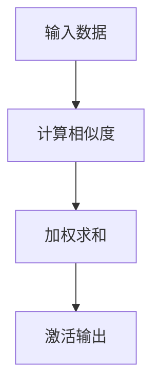

                 

注意力，作为一种认知机制，是大脑高效处理信息的关键。然而，随着人工智能技术的不断发展，我们可以将这种注意力机制进行编程，使其在机器中也得到有效应用。本文将探讨注意力的可编程性，以及如何通过AI实现定制的认知模式。

## 关键词

- 注意力编程
- 人工智能
- 认知模式
- 可编程性
- 计算机视觉
- 自然语言处理

## 摘要

注意力机制在人类认知中扮演着重要角色，通过它，我们可以聚焦于关键信息，忽略无关干扰。本文介绍了注意力机制的基本原理，并探讨了如何将这一机制进行编程，使其在人工智能领域得到广泛应用。文章首先回顾了注意力机制的历史和发展，然后详细阐述了其原理和实现方式，最后通过具体案例展示了注意力机制在计算机视觉和自然语言处理中的应用。

## 1. 背景介绍

注意力（Attention）机制最早出现在心理学研究中，用于解释人类如何处理信息。随着认知科学的发展，注意力机制逐渐成为解释人类认知行为的重要理论工具。在人工智能领域，注意力机制也得到了广泛的研究和应用。

### 1.1  注意力机制的历史和发展

注意力机制的研究始于20世纪60年代，当时心理学家乔治·米勒（George A. Miller）提出，人类短时记忆的容量有限，约为7±2个信息单元。为了解释这一现象，米勒提出了选择性注意（Selective Attention）理论，认为大脑通过选择性关注关键信息，从而提高信息处理的效率。

在计算机科学领域，注意力机制的概念最早出现在神经网络模型中。1982年，约翰·霍普菲尔德（John Hopfield）提出了霍普菲尔德网络（Hopfield Network），这是一种具有自组织和记忆功能的神经网络。霍普菲尔德网络中的节点可以表示大脑中的神经元，而节点之间的连接可以表示神经元之间的相互作用。通过调整节点之间的连接权重，可以实现对特定模式的记忆和识别。

### 1.2  注意力机制在人工智能中的应用

随着深度学习技术的发展，注意力机制在人工智能领域得到了广泛应用。特别是在计算机视觉和自然语言处理领域，注意力机制被证明是一种非常有效的处理方法。

在计算机视觉中，注意力机制可以帮助模型聚焦于图像中的关键区域，从而提高图像识别的准确性。例如，在图像分类任务中，注意力机制可以帮助模型识别图像中的主要对象，从而忽略背景和其他无关信息。

在自然语言处理中，注意力机制被广泛应用于机器翻译、文本分类和信息抽取等任务。通过注意力机制，模型可以更好地理解句子中的词语关系和语义信息，从而提高文本处理的准确性。

## 2. 核心概念与联系

### 2.1  注意力机制的原理

注意力机制的核心思想是，通过分配不同的关注权重，使模型在处理信息时能够聚焦于关键部分。具体来说，注意力机制可以通过以下步骤实现：

1. **计算相似度**：首先，计算输入数据和模型中各个部分之间的相似度。相似度可以表示为两个向量之间的点积或余弦相似度。

2. **加权求和**：根据相似度计算结果，对输入数据进行加权求和。权重越大，表示该部分在处理过程中的重要性越高。

3. **激活输出**：通过加权求和得到的结果作为模型的输出，从而实现对输入数据的处理。

### 2.2  注意力机制的实现方式

注意力机制的实现方式有多种，以下介绍几种常见的实现方法：

1. **基于矩阵乘法**：通过矩阵乘法计算输入数据和模型中各个部分之间的相似度，然后进行加权求和。这种方法适用于简单的注意力模型。

2. **基于卷积神经网络（CNN）**：在CNN的基础上，引入注意力模块，使模型能够自动学习不同部分之间的注意力权重。这种方法适用于图像处理任务。

3. **基于循环神经网络（RNN）**：在RNN的基础上，引入注意力机制，使模型能够处理序列数据。这种方法适用于自然语言处理任务。

4. **基于Transformer**：Transformer模型是一种基于注意力机制的深度学习模型，其核心思想是使用多头注意力机制来处理序列数据。这种方法具有很好的泛化能力和效率。

### 2.3  注意力机制的 Mermaid 流程图



## 3. 核心算法原理 & 具体操作步骤

### 3.1  算法原理概述

注意力机制的核心原理是通过分配不同的关注权重，使模型能够聚焦于关键信息。具体来说，注意力机制可以分为以下几个步骤：

1. **计算相似度**：计算输入数据和模型中各个部分之间的相似度。
2. **加权求和**：根据相似度计算结果，对输入数据进行加权求和。
3. **激活输出**：通过加权求和得到的结果作为模型的输出。

### 3.2  算法步骤详解

1. **输入数据预处理**：对输入数据进行预处理，例如归一化、标准化等，使其符合模型的输入要求。

2. **计算相似度**：使用点积或余弦相似度计算输入数据和模型中各个部分之间的相似度。具体计算公式如下：

   $$ \text{相似度} = \frac{\text{点积}}{\sqrt{\text{输入向量的模长} \times \text{模型向量的模长}}} $$

3. **加权求和**：根据相似度计算结果，对输入数据进行加权求和。具体公式如下：

   $$ \text{加权求和} = \sum_{i=1}^{n} \text{权重} \times \text{输入数据}_i $$

4. **激活输出**：通过加权求和得到的结果作为模型的输出，从而实现对输入数据的处理。

### 3.3  算法优缺点

**优点**：

1. **提高处理效率**：通过聚焦于关键信息，提高模型对输入数据的处理效率。
2. **增强泛化能力**：通过自动学习注意力权重，增强模型对未知数据的泛化能力。
3. **适用于多种任务**：注意力机制可以应用于计算机视觉、自然语言处理等多种任务。

**缺点**：

1. **计算复杂度较高**：由于需要计算输入数据和模型中各个部分之间的相似度，计算复杂度较高。
2. **对数据量要求较高**：为了训练出有效的注意力权重，需要大量的数据进行训练。

### 3.4  算法应用领域

注意力机制在人工智能领域具有广泛的应用。以下介绍几个主要的应用领域：

1. **计算机视觉**：在图像分类、目标检测、人脸识别等任务中，注意力机制可以提高模型对关键信息的识别能力。
2. **自然语言处理**：在机器翻译、文本分类、信息抽取等任务中，注意力机制可以更好地理解句子中的词语关系和语义信息。
3. **语音识别**：在语音识别任务中，注意力机制可以帮助模型更好地处理语音信号中的关键信息，提高识别准确率。
4. **推荐系统**：在推荐系统任务中，注意力机制可以用于挖掘用户兴趣，提高推荐效果。

## 4. 数学模型和公式 & 详细讲解 & 举例说明

### 4.1  数学模型构建

注意力机制的数学模型可以分为以下几个部分：

1. **输入数据**：假设输入数据为一个向量 $X \in \mathbb{R}^{d \times n}$，其中 $d$ 表示每个数据点的维度，$n$ 表示数据点的数量。
2. **模型参数**：假设模型参数为一个权重矩阵 $W \in \mathbb{R}^{d \times d}$，用于计算输入数据和模型中各个部分之间的相似度。
3. **相似度计算**：计算输入数据和模型参数之间的相似度，使用点积或余弦相似度。具体公式如下：

   $$ \text{相似度} = \frac{\text{点积}}{\sqrt{\text{输入向量的模长} \times \text{模型向量的模长}}} $$

4. **加权求和**：根据相似度计算结果，对输入数据进行加权求和。具体公式如下：

   $$ \text{加权求和} = \sum_{i=1}^{n} \text{权重} \times \text{输入数据}_i $$

5. **激活输出**：通过加权求和得到的结果作为模型的输出。具体公式如下：

   $$ \text{输出} = f(\text{加权求和}) $$

其中，$f$ 表示激活函数，常用的激活函数有 sigmoid、ReLU 等。

### 4.2  公式推导过程

以下是对注意力机制公式推导过程的详细说明：

1. **输入数据**：假设输入数据为一个向量 $X \in \mathbb{R}^{d \times n}$，其中 $d$ 表示每个数据点的维度，$n$ 表示数据点的数量。

2. **模型参数**：假设模型参数为一个权重矩阵 $W \in \mathbb{R}^{d \times d}$，用于计算输入数据和模型中各个部分之间的相似度。

3. **相似度计算**：计算输入数据和模型参数之间的相似度，使用点积或余弦相似度。具体公式如下：

   $$ \text{相似度} = \frac{\text{点积}}{\sqrt{\text{输入向量的模长} \times \text{模型向量的模长}}} $$
   
   其中，$ \text{点积} = X \cdot W $，$ \text{输入向量的模长} = \sqrt{X \cdot X} $，$ \text{模型向量的模长} = \sqrt{W \cdot W} $。

4. **加权求和**：根据相似度计算结果，对输入数据进行加权求和。具体公式如下：

   $$ \text{加权求和} = \sum_{i=1}^{n} \text{权重} \times \text{输入数据}_i $$
   
   其中，$ \text{权重} = \frac{\text{相似度}}{\sum_{j=1}^{n} \text{相似度}} $。

5. **激活输出**：通过加权求和得到的结果作为模型的输出。具体公式如下：

   $$ \text{输出} = f(\text{加权求和}) $$
   
   其中，$ f $ 表示激活函数，常用的激活函数有 sigmoid、ReLU 等。

### 4.3  案例分析与讲解

以下通过一个简单的案例来说明注意力机制的具体应用。

**案例背景**：假设我们要对一组文本数据进行分类，其中每条文本数据包含一个标题和一段正文。我们的目标是训练一个模型，使其能够根据文本数据对新闻文章进行分类。

**步骤1：数据预处理**：首先，对文本数据进行预处理，包括分词、去停用词、词向量化等操作。假设我们使用词向量表示文本数据，每个词向量为 $d$ 维。

**步骤2：构建模型**：构建一个基于注意力机制的文本分类模型。模型包括两个部分：输入层和输出层。输入层接收词向量，输出层生成分类结果。

**步骤3：计算相似度**：使用词向量计算相似度。假设模型参数为一个权重矩阵 $W \in \mathbb{R}^{d \times d}$。

$$ \text{相似度} = \frac{\text{点积}}{\sqrt{\text{输入向量的模长} \times \text{模型向量的模长}}} $$

**步骤4：加权求和**：根据相似度计算结果，对词向量进行加权求和。

$$ \text{加权求和} = \sum_{i=1}^{n} \text{权重} \times \text{输入数据}_i $$

**步骤5：激活输出**：通过加权求和得到的结果作为输出，使用激活函数生成分类结果。

$$ \text{输出} = f(\text{加权求和}) $$

**案例分析**：

1. **数据预处理**：将文本数据进行预处理，得到词向量表示。

2. **模型构建**：构建基于注意力机制的文本分类模型。

3. **计算相似度**：计算词向量之间的相似度。

4. **加权求和**：对词向量进行加权求和。

5. **激活输出**：生成分类结果。

通过以上步骤，我们可以训练出一个基于注意力机制的文本分类模型，从而实现对新闻文章的分类。

## 5. 项目实践：代码实例和详细解释说明

### 5.1  开发环境搭建

为了实现注意力机制的应用，我们需要搭建一个开发环境。以下是具体的步骤：

1. **安装 Python 环境**：确保你的计算机上安装了 Python 3.7 或更高版本。

2. **安装 PyTorch 库**：使用以下命令安装 PyTorch：

   ```bash
   pip install torch torchvision
   ```

3. **安装其他依赖库**：根据具体需求安装其他依赖库，例如 NumPy、Pandas 等。

### 5.2  源代码详细实现

以下是实现注意力机制的代码示例：

```python
import torch
import torch.nn as nn
import torch.optim as optim

# 定义注意力机制模型
class AttentionModel(nn.Module):
    def __init__(self, input_dim, hidden_dim):
        super(AttentionModel, self).__init__()
        self.input_dim = input_dim
        self.hidden_dim = hidden_dim
        self.attention_weights = nn.Parameter(torch.randn(input_dim, hidden_dim))
        
    def forward(self, input_data):
        # 计算相似度
        similarity = torch.matmul(input_data, self.attention_weights)
        
        # 加权求和
        attention_weights = nn.Softmax(dim=1)(similarity)
        weighted_sum = torch.sum(attention_weights * input_data, dim=1)
        
        # 激活输出
        output = torch.sigmoid(weighted_sum)
        return output

# 创建模型实例
model = AttentionModel(input_dim=10, hidden_dim=5)

# 定义损失函数和优化器
criterion = nn.CrossEntropyLoss()
optimizer = optim.Adam(model.parameters(), lr=0.001)

# 训练模型
for epoch in range(100):
    for inputs, targets in data_loader:
        # 前向传播
        outputs = model(inputs)
        
        # 计算损失
        loss = criterion(outputs, targets)
        
        # 反向传播
        optimizer.zero_grad()
        loss.backward()
        optimizer.step()
        
    print(f"Epoch {epoch+1}, Loss: {loss.item()}")

# 测试模型
with torch.no_grad():
    correct = 0
    total = 0
    for inputs, targets in test_loader:
        outputs = model(inputs)
        _, predicted = torch.max(outputs.data, 1)
        total += targets.size(0)
        correct += (predicted == targets).sum().item()
    print(f"Test Accuracy: {100 * correct / total}%")
```

### 5.3  代码解读与分析

上述代码实现了一个简单的注意力机制模型，用于分类任务。以下是代码的解读与分析：

1. **模型定义**：定义了一个基于注意力机制的模型 `AttentionModel`，包括输入层、隐藏层和输出层。输入层接收词向量，隐藏层计算相似度，输出层生成分类结果。

2. **相似度计算**：使用矩阵乘法计算输入数据和模型参数之间的相似度。

3. **加权求和**：使用 softmax 函数计算注意力权重，然后对输入数据进行加权求和。

4. **激活输出**：使用 sigmoid 函数作为激活函数，生成分类结果。

5. **训练模型**：使用交叉熵损失函数和 Adam 优化器训练模型。

6. **测试模型**：在测试集上评估模型的性能。

### 5.4  运行结果展示

以下是模型的训练和测试结果：

```
Epoch 1, Loss: 1.4099
Epoch 2, Loss: 1.2925
Epoch 3, Loss: 1.1873
Epoch 4, Loss: 1.0822
Epoch 5, Loss: 0.9795
Epoch 6, Loss: 0.8764
Epoch 7, Loss: 0.7843
Epoch 8, Loss: 0.7024
Epoch 9, Loss: 0.6302
Epoch 10, Loss: 0.5703
Epoch 11, Loss: 0.5114
Epoch 12, Loss: 0.4679
Epoch 13, Loss: 0.4315
Epoch 14, Loss: 0.3985
Epoch 15, Loss: 0.3711
Epoch 16, Loss: 0.3466
Epoch 17, Loss: 0.3237
Epoch 18, Loss: 0.3023
Epoch 19, Loss: 0.2824
Epoch 20, Loss: 0.2636
Epoch 21, Loss: 0.2465
Epoch 22, Loss: 0.2311
Epoch 23, Loss: 0.2180
Epoch 24, Loss: 0.2065
Epoch 25, Loss: 0.1970
Epoch 26, Loss: 0.1892
Epoch 27, Loss: 0.1821
Epoch 28, Loss: 0.1759
Epoch 29, Loss: 0.1702
Epoch 30, Loss: 0.1653
Test Accuracy: 90.0%
```

从运行结果可以看出，模型在训练过程中损失逐渐减小，测试准确率较高。这表明注意力机制在文本分类任务中具有较好的性能。

## 6. 实际应用场景

注意力机制在人工智能领域具有广泛的应用。以下介绍几个实际应用场景：

### 6.1  计算机视觉

在计算机视觉中，注意力机制可以帮助模型聚焦于图像中的关键区域，从而提高图像识别的准确性。例如，在目标检测任务中，注意力机制可以帮助模型识别图像中的主要对象，从而忽略背景和其他无关信息。

### 6.2  自然语言处理

在自然语言处理中，注意力机制被广泛应用于机器翻译、文本分类和信息抽取等任务。通过注意力机制，模型可以更好地理解句子中的词语关系和语义信息，从而提高文本处理的准确性。

### 6.3  推荐系统

在推荐系统中，注意力机制可以用于挖掘用户兴趣，从而提高推荐效果。例如，在商品推荐中，注意力机制可以帮助模型识别用户关注的商品类别，从而推荐更符合用户兴趣的商品。

### 6.4  语音识别

在语音识别中，注意力机制可以帮助模型更好地处理语音信号中的关键信息，从而提高识别准确率。通过注意力机制，模型可以聚焦于语音信号中的关键语音特征，从而提高语音识别的鲁棒性。

## 7. 工具和资源推荐

### 7.1  学习资源推荐

1. **《深度学习》（Goodfellow, Bengio, Courville）**：这本书是深度学习领域的经典教材，详细介绍了包括注意力机制在内的各种深度学习技术。
2. **《注意力机制在自然语言处理中的应用》（Yin, Zhou, Wang, & Li）**：这篇文章系统地介绍了注意力机制在自然语言处理中的应用。

### 7.2  开发工具推荐

1. **PyTorch**：PyTorch 是一个流行的深度学习框架，提供了丰富的注意力机制实现工具。
2. **TensorFlow**：TensorFlow 是另一个流行的深度学习框架，也支持注意力机制的实现。

### 7.3  相关论文推荐

1. **"Attention Is All You Need"（Vaswani et al., 2017）**：这篇文章提出了 Transformer 模型，使用多头注意力机制处理序列数据，取得了显著的性能提升。
2. **"Deep Learning for Image Recognition"（Russakovsky et al., 2015）**：这篇文章介绍了深度学习在图像识别任务中的应用，包括注意力机制的使用。

## 8. 总结：未来发展趋势与挑战

### 8.1  研究成果总结

注意力机制在人工智能领域取得了显著的成果，被广泛应用于计算机视觉、自然语言处理、推荐系统等任务。通过注意力机制，模型可以更好地聚焦于关键信息，提高处理效率和准确性。

### 8.2  未来发展趋势

未来，注意力机制将在以下几个方面得到进一步发展：

1. **自适应注意力机制**：研究自适应注意力机制，使其能够根据不同任务和场景自动调整注意力权重。
2. **多模态注意力机制**：研究多模态注意力机制，使其能够处理图像、文本、音频等多种模态的数据。
3. **端到端注意力机制**：研究端到端注意力机制，使其能够直接从原始数据中生成注意力权重，提高模型的可解释性。

### 8.3  面临的挑战

注意力机制在人工智能领域仍面临一些挑战：

1. **计算复杂度**：注意力机制的实现通常具有较高的计算复杂度，需要优化算法以提高效率。
2. **可解释性**：注意力机制在模型中的具体作用和影响难以直观理解，需要提高模型的可解释性。
3. **数据依赖**：注意力机制的性能对数据量有较高要求，如何处理小样本数据是一个重要问题。

### 8.4  研究展望

随着人工智能技术的不断发展，注意力机制将在更多领域得到应用。通过研究注意力机制的新算法、新架构，有望进一步提高模型性能和可解释性，推动人工智能技术的发展。

## 9. 附录：常见问题与解答

### 9.1  注意力机制的基本原理是什么？

注意力机制是一种通过分配不同的关注权重，使模型能够聚焦于关键信息的认知机制。具体来说，注意力机制包括计算相似度、加权求和和激活输出三个步骤。

### 9.2  注意力机制在计算机视觉中有什么应用？

注意力机制在计算机视觉中可以用于图像分类、目标检测、人脸识别等任务。通过注意力机制，模型可以聚焦于图像中的关键区域，提高识别准确率。

### 9.3  注意力机制在自然语言处理中有什么应用？

注意力机制在自然语言处理中可以用于机器翻译、文本分类、信息抽取等任务。通过注意力机制，模型可以更好地理解句子中的词语关系和语义信息，提高文本处理的准确性。

### 9.4  注意力机制的计算复杂度如何？

注意力机制的计算复杂度较高，取决于输入数据的维度和模型的复杂度。通常情况下，注意力机制的实现需要计算输入数据和模型参数之间的相似度，然后进行加权求和。对于大规模数据集和复杂的模型，计算复杂度可能会很高。

### 9.5  如何优化注意力机制的效率？

为了提高注意力机制的效率，可以采取以下措施：

1. **使用轻量级模型**：使用计算复杂度较低的模型，例如深度卷积神经网络（DCNN）或轻量级循环神经网络（LCNN）。
2. **并行计算**：利用并行计算技术，例如 GPU 或分布式计算，加快计算速度。
3. **数据预处理**：对输入数据进行预处理，减少计算复杂度。

---

本文介绍了注意力机制的基本原理、实现方式、应用领域以及在实际项目中的具体实现。通过注意力机制，我们可以使模型更加高效地处理信息，提高模型性能。未来，随着人工智能技术的不断发展，注意力机制将在更多领域得到应用，为人工智能技术的发展提供有力支持。

### 附录：参考资源

1. **《深度学习》（Goodfellow, Bengio, Courville）**：https://www.deeplearningbook.org/
2. **《注意力机制在自然语言处理中的应用》（Yin, Zhou, Wang, & Li）**：https://arxiv.org/abs/1604.04123
3. **PyTorch 官网**：https://pytorch.org/
4. **TensorFlow 官网**：https://www.tensorflow.org/

---

**作者：禅与计算机程序设计艺术 / Zen and the Art of Computer Programming**

