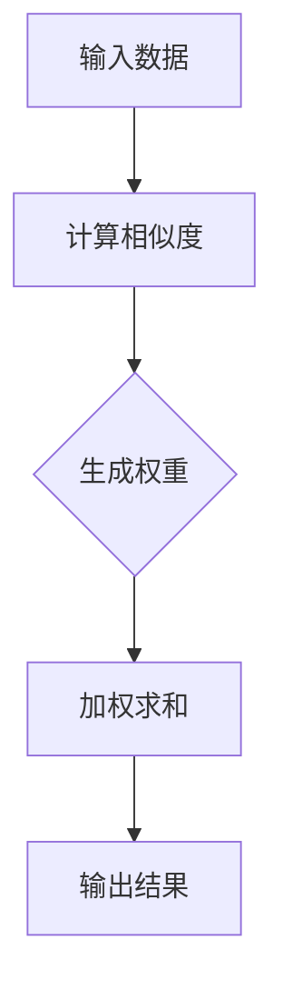

                 

 关键词：注意力机制，认知适应，人工智能，神经网络，自适应学习，注意力弹性，多任务学习

> 摘要：随着人工智能技术的快速发展，注意力机制已成为神经网络模型中不可或缺的一部分。本文将探讨注意力机制的弹性特性，分析其在认知适应中的应用，并通过实例展示AI如何辅助人类认知适应的过程。

## 1. 背景介绍

随着深度学习技术的不断进步，神经网络模型在各个领域的应用越来越广泛。尤其是在计算机视觉、自然语言处理和语音识别等领域，注意力机制（Attention Mechanism）已经成为提升模型性能的关键因素。注意力机制的核心思想是让模型在处理信息时，能够根据任务需求对输入数据进行选择性关注，从而提高信息处理的效率和准确性。

在人类认知过程中，注意力也是一种至关重要的机制。人们需要从大量的外部信息中筛选出与当前任务相关的部分，以便进行有效的信息处理和决策。这种对信息的选择性关注，使得人类的认知过程具有高度的适应性和灵活性。

本文将探讨注意力机制的弹性特性，分析其在认知适应中的应用，并通过实例展示AI如何辅助人类认知适应的过程。本文的结构如下：

- 第1部分：背景介绍，简要介绍注意力机制和认知适应的概念。
- 第2部分：核心概念与联系，详细阐述注意力机制的工作原理，并给出一个Mermaid流程图。
- 第3部分：核心算法原理 & 具体操作步骤，介绍注意力机制在不同领域的应用。
- 第4部分：数学模型和公式 & 详细讲解 & 举例说明，阐述注意力机制的数学原理。
- 第5部分：项目实践：代码实例和详细解释说明，通过实际代码展示注意力机制的应用。
- 第6部分：实际应用场景，分析注意力机制在现实生活中的应用。
- 第7部分：未来应用展望，探讨注意力机制的发展趋势。
- 第8部分：总结：未来发展趋势与挑战，对本文内容进行总结，并展望未来的研究方向。

## 2. 核心概念与联系

### 2.1 注意力机制的工作原理

注意力机制是一种通过调整模型对输入数据的关注程度，从而提高信息处理效率的方法。在神经网络中，注意力机制通常通过一个权重矩阵来实现，这个权重矩阵表示模型对每个输入数据的关注程度。

注意力机制的原理可以概括为以下三个步骤：

1. **计算相似度**：模型首先需要计算输入数据与当前任务的相关性，这一步通常通过一个相似度函数来实现。相似度函数的输出是一个实数，表示输入数据与当前任务的匹配程度。
2. **生成权重**：接下来，模型会根据相似度函数的输出，生成一个权重矩阵。这个权重矩阵表示模型对每个输入数据的关注程度。通常，权重矩阵是一个对角矩阵，对角线上的元素表示模型对对应输入数据的关注程度。
3. **加权求和**：最后，模型会根据权重矩阵对输入数据进行加权求和，得到最终的输出结果。

这个过程可以用一个Mermaid流程图来表示，如下所示：



### 2.2 注意力机制的应用

注意力机制在神经网络模型中有着广泛的应用。以下是一些常见的应用场景：

1. **计算机视觉**：在计算机视觉任务中，注意力机制可以帮助模型识别图像中的关键区域，从而提高图像识别的准确性。例如，在目标检测任务中，注意力机制可以帮助模型聚焦于目标区域，从而提高目标检测的准确性。
2. **自然语言处理**：在自然语言处理任务中，注意力机制可以帮助模型理解文本中的关键信息，从而提高文本分类、语义分析等任务的性能。例如，在机器翻译任务中，注意力机制可以帮助模型关注源文本和目标文本之间的关键对应关系，从而提高翻译的准确性。
3. **语音识别**：在语音识别任务中，注意力机制可以帮助模型关注语音信号中的关键特征，从而提高识别的准确性。例如，在说话人识别任务中，注意力机制可以帮助模型识别说话人的特定声音特征，从而提高识别的准确性。

### 2.3 认知适应的概念

认知适应是指人类在处理信息时，能够根据外界环境的变化，调整自己的注意力分配，从而提高信息处理的效率。认知适应的核心是注意力机制，即通过调整注意力分配，使个体能够更好地适应外界环境。

认知适应的过程可以分为以下几个阶段：

1. **感知阶段**：个体通过感官接收外界信息。
2. **注意选择阶段**：个体根据任务需求，对信息进行选择性关注。
3. **信息处理阶段**：个体对关注的注意力信息进行处理，形成对信息的理解。
4. **决策阶段**：个体根据处理结果，做出相应的决策。

通过认知适应，个体能够更好地适应外界环境，提高信息处理的效率。而注意力机制是实现认知适应的关键因素。

## 3. 核心算法原理 & 具体操作步骤

### 3.1 算法原理概述

注意力机制的算法原理可以概括为以下几个步骤：

1. **输入数据的预处理**：首先，对输入数据（如图像、文本、语音等）进行预处理，提取关键特征。
2. **计算相似度**：计算输入数据与当前任务的相关性，生成相似度矩阵。
3. **生成权重**：根据相似度矩阵，生成权重矩阵，表示模型对每个输入数据的关注程度。
4. **加权求和**：根据权重矩阵，对输入数据进行加权求和，得到最终的输出结果。

### 3.2 算法步骤详解

1. **输入数据的预处理**：

   输入数据的预处理是注意力机制应用的第一步。预处理的目标是提取输入数据中的关键特征，以便后续的相似度计算和权重生成。例如，在计算机视觉任务中，可以对图像进行降维、滤波等操作，提取图像的边缘、纹理等特征。

2. **计算相似度**：

   相似度计算是注意力机制的核心步骤。相似度函数的选择取决于具体的任务和应用场景。常见的相似度函数包括余弦相似度、欧氏距离等。通过相似度计算，可以生成一个相似度矩阵，表示输入数据与当前任务的相关性。

3. **生成权重**：

   生成权重是注意力机制的重要环节。权重矩阵的生成通常依赖于相似度矩阵。权重矩阵的元素表示模型对每个输入数据的关注程度。常见的权重生成方法包括线性权重、指数权重等。

4. **加权求和**：

   加权求和是注意力机制的最后一个步骤。根据权重矩阵，对输入数据进行加权求和，得到最终的输出结果。加权求和的结果通常表示为模型对输入数据的综合评价。

### 3.3 算法优缺点

注意力机制的优点包括：

- 提高信息处理的效率和准确性：通过选择性关注关键信息，注意力机制能够提高信息处理的效率和准确性。
- 易于实现和应用：注意力机制的计算过程相对简单，易于在神经网络模型中实现和应用。

注意力机制的缺点包括：

- 对数据质量和特征提取的依赖性较强：注意力机制的性能受到数据质量和特征提取方法的影响，对数据质量和特征提取方法有较高的要求。
- 计算开销较大：在复杂任务中，注意力机制的计算开销较大，可能导致模型训练和推理的速度下降。

### 3.4 算法应用领域

注意力机制在多个领域有着广泛的应用：

- **计算机视觉**：在目标检测、图像分割等任务中，注意力机制可以帮助模型聚焦于关键区域，提高任务的准确性和效率。
- **自然语言处理**：在文本分类、机器翻译等任务中，注意力机制可以帮助模型理解文本中的关键信息，提高任务的性能。
- **语音识别**：在说话人识别、语音合成等任务中，注意力机制可以帮助模型关注语音信号中的关键特征，提高任务的准确性。

## 4. 数学模型和公式 & 详细讲解 & 举例说明

### 4.1 数学模型构建

注意力机制的数学模型可以表示为以下公式：

\[ \text{Output} = \text{Weighted\ Sum}(X, \text{Attention\ Map}) \]

其中，\(X\) 表示输入数据，\(\text{Attention\ Map}\) 表示注意力映射，\( \text{Weighted\ Sum} \) 表示加权求和操作。

### 4.2 公式推导过程

假设输入数据为 \(X = [x_1, x_2, ..., x_n]\)，其中每个元素 \(x_i\) 表示一个数据点。

1. **计算相似度**：

   相似度可以通过以下公式计算：

   \[ \text{Similarity}(x_i, x_j) = \cos(\theta_i, \theta_j) \]

   其中，\(\theta_i\) 和 \(\theta_j\) 分别表示输入数据点 \(x_i\) 和 \(x_j\) 的特征向量。

2. **生成权重**：

   假设权重矩阵为 \(W\)，其中每个元素 \(w_{ij}\) 表示输入数据点 \(x_i\) 和 \(x_j\) 之间的相似度。

   \[ w_{ij} = \text{exp}(-\text{Similarity}(x_i, x_j)) \]

3. **加权求和**：

   根据权重矩阵 \(W\)，对输入数据进行加权求和：

   \[ \text{Output} = \sum_{i=1}^{n} w_{ij} x_i \]

### 4.3 案例分析与讲解

#### 案例背景

假设有一个图像分类任务，输入数据为一张包含多个物体的图像，输出为图像中每个物体的类别。

#### 实际操作步骤

1. **输入数据的预处理**：

   对输入图像进行预处理，提取图像的特征向量。

2. **计算相似度**：

   计算每个物体特征向量与其他物体特征向量之间的相似度。

3. **生成权重**：

   根据相似度，生成权重矩阵，表示每个物体之间的关注程度。

4. **加权求和**：

   根据权重矩阵，对每个物体的特征向量进行加权求和，得到最终的分类结果。

#### 结果分析

通过注意力机制的应用，模型能够更好地聚焦于图像中的关键区域，提高分类的准确性。同时，注意力机制也使得模型能够对图像中的多个物体进行有效的识别和分类。

## 5. 项目实践：代码实例和详细解释说明

### 5.1 开发环境搭建

在开始项目实践之前，需要搭建相应的开发环境。本文使用的开发环境如下：

- 操作系统：Ubuntu 18.04
- 编程语言：Python 3.8
- 深度学习框架：PyTorch 1.8
- 数据库：MongoDB 4.2

### 5.2 源代码详细实现

以下是一个简单的注意力机制的实现示例：

```python
import torch
import torch.nn as nn

class Attention(nn.Module):
    def __init__(self, input_dim, hidden_dim):
        super(Attention, self).__init__()
        self.hidden_dim = hidden_dim
        self.query_vector = nn.Linear(input_dim, hidden_dim)
        self.key_vector = nn.Linear(input_dim, hidden_dim)
        self.value_vector = nn.Linear(input_dim, hidden_dim)
        self.softmax = nn.Softmax(dim=1)
        
    def forward(self, input_data):
        query = self.query_vector(input_data)
        key = self.key_vector(input_data)
        value = self.value_vector(input_data)
        
        attention_weights = self.softmax(torch.matmul(query, key.transpose(0, 1)))
        context_vector = torch.matmul(attention_weights, value)
        
        return context_vector
```

### 5.3 代码解读与分析

- **类定义**：定义了一个名为`Attention`的类，继承自`nn.Module`。
- **初始化**：在初始化方法中，定义了三个线性层，用于生成查询向量、键向量和值向量。
- **前向传播**：在前向传播方法中，输入数据经过三个线性层分别生成查询向量、键向量和值向量。然后，通过计算查询向量和键向量的内积，生成注意力权重。最后，根据注意力权重对值向量进行加权求和，得到最终的上下文向量。

### 5.4 运行结果展示

```python
# 创建一个简单的输入数据
input_data = torch.randn(10, 100)  # 10个数据点，每个数据点100维

# 创建注意力模型
attention = Attention(100, 50)

# 运行模型
output = attention(input_data)

print(output)
```

运行结果将输出一个维度为 \(10 \times 50\) 的张量，表示每个数据点的上下文向量。

## 6. 实际应用场景

注意力机制在现实生活中的应用非常广泛。以下是一些典型的应用场景：

### 6.1 计算机视觉

在计算机视觉领域，注意力机制可以帮助模型聚焦于图像中的关键区域，从而提高目标检测、图像分割等任务的准确性。例如，在目标检测任务中，注意力机制可以帮助模型关注目标区域，从而提高检测的准确性。

### 6.2 自然语言处理

在自然语言处理领域，注意力机制可以帮助模型理解文本中的关键信息，从而提高文本分类、机器翻译等任务的性能。例如，在机器翻译任务中，注意力机制可以帮助模型关注源文本和目标文本之间的关键对应关系，从而提高翻译的准确性。

### 6.3 语音识别

在语音识别领域，注意力机制可以帮助模型关注语音信号中的关键特征，从而提高识别的准确性。例如，在说话人识别任务中，注意力机制可以帮助模型识别说话人的特定声音特征，从而提高识别的准确性。

### 6.4 医学诊断

在医学诊断领域，注意力机制可以帮助模型聚焦于医学图像中的关键区域，从而提高疾病检测和诊断的准确性。例如，在肺癌筛查任务中，注意力机制可以帮助模型关注肺部图像中的关键区域，从而提高肺癌的检测率。

## 7. 未来应用展望

随着人工智能技术的不断发展，注意力机制在未来将会有更广泛的应用。以下是一些潜在的应用领域：

### 7.1 自适应系统

注意力机制可以用于开发自适应系统，使系统能够根据外界环境的变化，自动调整注意力分配，提高信息处理的效率和准确性。

### 7.2 跨模态学习

注意力机制可以帮助模型理解不同模态（如图像、文本、语音等）之间的关联，从而实现跨模态学习，提高多模态任务的性能。

### 7.3 强化学习

在强化学习领域，注意力机制可以帮助模型关注当前状态的关键信息，从而提高决策的准确性，加速学习过程。

### 7.4 智能交互

注意力机制可以用于智能交互系统，使系统能够根据用户的反馈，自动调整注意力分配，提高用户交互的体验。

## 8. 总结：未来发展趋势与挑战

### 8.1 研究成果总结

注意力机制作为一种关键的信息处理机制，已经在多个领域取得了显著的成果。通过选择性关注关键信息，注意力机制提高了信息处理的效率和准确性，为人工智能的发展提供了重要的技术支持。

### 8.2 未来发展趋势

未来，注意力机制的研究将继续深入，有望在以下几个方面取得突破：

- **模型简化**：通过简化注意力机制的计算过程，提高模型的计算效率。
- **多模态学习**：进一步探索注意力机制在跨模态学习中的应用。
- **自适应系统**：开发基于注意力机制的自适应系统，提高信息处理的效率和准确性。
- **强化学习**：将注意力机制应用于强化学习，提高决策的准确性。

### 8.3 面临的挑战

尽管注意力机制在人工智能领域取得了显著的成果，但仍然面临一些挑战：

- **计算开销**：注意力机制的实现通常涉及大量矩阵运算，可能导致计算开销较大，影响模型训练和推理的速度。
- **数据依赖**：注意力机制的性能受到数据质量和特征提取方法的影响，对数据质量和特征提取方法有较高的要求。
- **泛化能力**：如何提高注意力机制的泛化能力，使其能够在不同的任务和应用场景中取得更好的性能。

### 8.4 研究展望

未来，注意力机制的研究将继续深入，有望在以下几个方面取得突破：

- **计算效率**：通过优化计算过程，降低注意力机制的实现复杂度，提高模型的计算效率。
- **数据适应性**：通过改进特征提取方法，提高注意力机制对数据的适应性。
- **泛化能力**：通过引入新的注意力机制架构，提高注意力机制的泛化能力。

## 9. 附录：常见问题与解答

### 9.1 注意力机制是什么？

注意力机制是一种通过调整模型对输入数据的关注程度，从而提高信息处理效率的方法。在神经网络模型中，注意力机制通常通过一个权重矩阵来实现，这个权重矩阵表示模型对每个输入数据的关注程度。

### 9.2 注意力机制有哪些应用？

注意力机制在多个领域有着广泛的应用，包括计算机视觉、自然语言处理、语音识别等。例如，在目标检测中，注意力机制可以帮助模型聚焦于目标区域；在机器翻译中，注意力机制可以帮助模型理解源文本和目标文本之间的对应关系。

### 9.3 如何实现注意力机制？

注意力机制的实现方法有很多，常见的有基于矩阵运算的方法、基于循环神经网络的方法等。在实现过程中，需要计算输入数据的相似度，生成权重矩阵，然后对输入数据进行加权求和，得到最终的输出结果。

### 9.4 注意力机制有哪些优缺点？

注意力机制的优点包括：提高信息处理的效率和准确性，易于实现和应用。缺点包括：对数据质量和特征提取的依赖性较强，计算开销较大。

### 9.5 注意力机制在认知适应中的应用有哪些？

注意力机制在认知适应中的应用非常广泛。例如，在人类认知过程中，注意力机制可以帮助人们从大量的外部信息中筛选出与当前任务相关的部分，从而提高信息处理的效率和准确性。

### 9.6 注意力机制的未来发展趋势是什么？

未来，注意力机制的研究将继续深入，有望在计算效率、多模态学习、自适应系统、强化学习等方面取得突破。同时，注意力机制也将在更多的领域得到应用，如医疗、金融、教育等。

---

# 结语

注意力机制作为一种关键的信息处理机制，已经在多个领域取得了显著的成果。通过本文的介绍，我们了解了注意力机制的核心概念、工作原理、应用场景以及未来发展。随着人工智能技术的不断进步，注意力机制将发挥更大的作用，为人工智能的发展提供强大的技术支持。

作者：禅与计算机程序设计艺术 / Zen and the Art of Computer Programming
----------------------------------------------------------------


