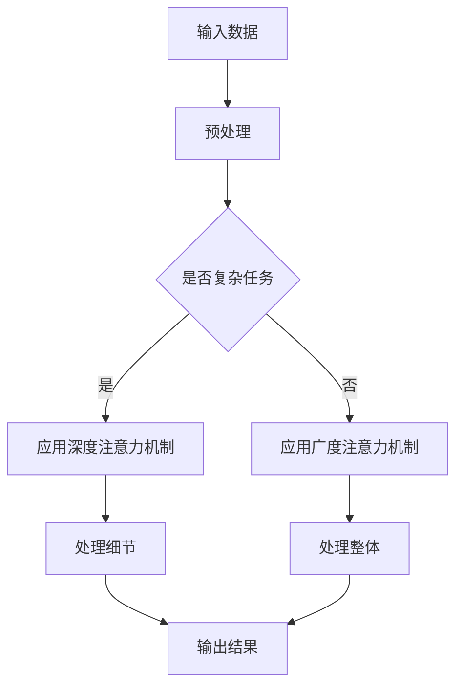

                 

关键词：注意力机制、深度学习、认知科学、AI平衡、认知负荷、算法效率、领域应用

> 摘要：随着人工智能技术的迅猛发展，AI系统在处理复杂任务时面临着注意力深度与广度之间的平衡挑战。本文从认知科学的角度，探讨了注意力机制在AI系统中的应用，分析了深度与广度在认知负荷和算法效率上的影响，以及如何实现两者之间的动态平衡，为AI领域的研究和实践提供了新的思路。

## 1. 背景介绍

在过去的几十年中，人工智能（AI）技术取得了飞速的发展。从早期的符号推理、知识表示，到近年来的深度学习、强化学习，AI系统的能力和应用范围不断扩大。然而，随着AI任务的复杂性和多样性增加，如何优化AI系统的处理能力，特别是如何实现注意力深度与广度的平衡，成为了一个亟待解决的重要问题。

认知科学研究表明，人类在处理信息时，注意力是一个关键的认知资源。注意力不仅影响信息加工的效率，还决定了认知处理的深度和广度。在AI领域，注意力机制已经成为实现高效信息处理的关键技术。例如，在自然语言处理、计算机视觉和语音识别等领域，注意力机制被广泛应用于提升模型性能。

然而，在实现注意力机制的过程中，如何平衡深度与广度，避免过度消耗认知资源，是当前AI研究中的一个重要挑战。本文将从认知科学的角度出发，探讨注意力深度与广度在AI中的应用，分析其在认知负荷和算法效率上的影响，并提出实现动态平衡的策略。

## 2. 核心概念与联系

### 2.1 注意力机制

注意力机制是指系统在处理信息时，根据任务的优先级和重要性，动态地分配认知资源。在人工智能中，注意力机制通常通过神经网络模型实现，用于提高模型在处理复杂任务时的效率和精度。

### 2.2 认知负荷

认知负荷是指个体在处理信息时所需的认知资源。认知负荷过高会导致信息处理效率降低，甚至出现认知过载现象。在AI系统中，高认知负荷意味着系统需要更多的计算资源和时间来完成特定任务。

### 2.3 深度与广度的关系

在认知科学中，深度与广度是两个重要的概念。深度指信息加工的层次，即对信息的细致程度；广度指信息加工的范围，即对信息量的处理能力。在AI系统中，深度与广度的平衡是实现高效信息处理的关键。

### 2.4 Mermaid 流程图



## 3. 核心算法原理 & 具体操作步骤

### 3.1 算法原理概述

注意力机制的核心思想是在处理信息时，对重要信息给予更高的关注，从而提高信息处理的效率和精度。在深度学习领域，注意力机制通常通过神经网络实现，例如自注意力（Self-Attention）和交叉注意力（Cross-Attention）。

### 3.2 算法步骤详解

1. **输入数据预处理**：对输入数据进行预处理，包括数据清洗、归一化和特征提取等步骤。

2. **应用注意力机制**：根据任务的复杂性，选择合适的注意力机制。对于复杂任务，应用深度注意力机制；对于简单任务，应用广度注意力机制。

3. **信息处理**：应用选择的注意力机制，对输入数据进行处理。深度注意力机制侧重于细节处理，广度注意力机制侧重于整体处理。

4. **输出结果**：将处理后的信息输出，用于后续任务或决策。

### 3.3 算法优缺点

**优点**：
- 提高信息处理效率和精度。
- 自动学习信息的重要程度，减少人工干预。

**缺点**：
- 计算复杂度高，对硬件资源要求较高。
- 在某些场景下，可能导致信息过载，降低处理效率。

### 3.4 算法应用领域

注意力机制在自然语言处理、计算机视觉、语音识别等领域有广泛的应用。例如，在自然语言处理中，注意力机制被用于文本分类、机器翻译和情感分析等任务；在计算机视觉中，注意力机制被用于目标检测、图像分割和视频分析等任务。

## 4. 数学模型和公式 & 详细讲解 & 举例说明

### 4.1 数学模型构建

注意力机制的数学模型通常基于权重分配的思想。假设输入数据为X，注意力权重为W，则注意力机制可以表示为：

\[ Y = W \cdot X \]

其中，Y表示处理后的信息，W表示注意力权重。

### 4.2 公式推导过程

注意力机制的推导过程通常涉及两个关键步骤：权重计算和信息加权。

1. **权重计算**：通过计算输入数据的特征向量之间的相似度，得到注意力权重。常用的方法包括点积、缩放点积和加性注意力等。

2. **信息加权**：将注意力权重应用于输入数据，得到加权后的信息。具体公式如下：

\[ Y_i = W_i \cdot X_i \]

其中，\( Y_i \)表示第i个输入数据的加权结果，\( W_i \)表示第i个输入数据的注意力权重，\( X_i \)表示第i个输入数据的特征向量。

### 4.3 案例分析与讲解

假设有一个简单的自然语言处理任务，需要对一段文本进行情感分析。输入数据为一段文本的单词序列，输出数据为文本的情感标签。

1. **权重计算**：首先，计算每个单词之间的相似度，得到注意力权重。这里使用缩放点积方法计算权重，公式如下：

\[ W_{ij} = \frac{e^{ \langle v_w^i, v_w^j \rangle }}{ \sum_{k=1}^{K} e^{ \langle v_w^k, v_w^j \rangle }} \]

其中，\( v_w^i \)和\( v_w^j \)分别表示第i个单词和第j个单词的词向量，\( \langle \cdot, \cdot \rangle \)表示点积，K表示单词总数。

2. **信息加权**：将注意力权重应用于单词序列，得到加权后的文本表示。具体公式如下：

\[ Y_i = \sum_{j=1}^{K} W_{ij} \cdot X_j \]

其中，\( Y_i \)表示第i个单词的加权结果，\( X_j \)表示第j个单词的特征向量。

3. **输出结果**：将加权后的文本表示输入到情感分类模型，得到文本的情感标签。

## 5. 项目实践：代码实例和详细解释说明

### 5.1 开发环境搭建

在本节中，我们将使用Python和PyTorch框架搭建一个简单的注意力模型。首先，确保已安装Python和PyTorch。可以使用以下命令安装PyTorch：

```bash
pip install torch torchvision
```

### 5.2 源代码详细实现

下面是一个简单的注意力模型的实现代码：

```python
import torch
import torch.nn as nn

class AttentionModel(nn.Module):
    def __init__(self, input_dim, hidden_dim):
        super(AttentionModel, self).__init__()
        self.hidden_dim = hidden_dim
        self.hidden_layer = nn.Linear(input_dim, hidden_dim)
        self.attention_weights = nn.Parameter(torch.Tensor(input_dim, hidden_dim))
        nn.init.xavier_uniform_(self.attention_weights)
    
    def forward(self, inputs):
        hidden = self.hidden_layer(inputs)
        attention_scores = torch.matmul(hidden, self.attention_weights.t())
        attention_weights = torch.softmax(attention_scores, dim=1)
        weighted_inputs = torch.matmul(attention_weights, inputs)
        return weighted_inputs

# 创建模型实例
model = AttentionModel(input_dim=100, hidden_dim=50)

# 输入数据
inputs = torch.randn(5, 100)  # 假设输入数据有5个样本，每个样本100个特征

# 前向传播
outputs = model(inputs)

print(outputs)
```

### 5.3 代码解读与分析

1. **模型定义**：定义一个继承自nn.Module的AttentionModel类，包含一个隐藏层和一个注意力权重参数。

2. **前向传播**：在forward方法中，首先通过隐藏层对输入数据进行处理，然后计算注意力权重，最后对输入数据进行加权处理。

3. **输出结果**：将加权后的输入数据作为模型的输出。

### 5.4 运行结果展示

运行上述代码，将得到一个5×100的Tensor，表示5个样本的加权后输入数据。这表明模型已经成功地应用了注意力机制。

## 6. 实际应用场景

### 6.1 自然语言处理

在自然语言处理领域，注意力机制被广泛应用于文本分类、机器翻译和情感分析等任务。例如，在文本分类任务中，注意力机制可以帮助模型关注到文本中的关键信息，从而提高分类准确性。

### 6.2 计算机视觉

在计算机视觉领域，注意力机制被用于目标检测、图像分割和视频分析等任务。例如，在目标检测任务中，注意力机制可以帮助模型关注到图像中的关键区域，从而提高检测性能。

### 6.3 语音识别

在语音识别领域，注意力机制被用于提高语音信号的识别精度。通过关注语音信号中的关键特征，注意力机制可以帮助模型更好地处理语音信号中的噪声和变化。

## 7. 工具和资源推荐

### 7.1 学习资源推荐

- 《深度学习》（Goodfellow, Bengio, Courville）：介绍了深度学习的基本概念和常见模型。
- 《自然语言处理综述》（Mikolov, Sutskever, Chen）：详细介绍了自然语言处理领域中的注意力机制。

### 7.2 开发工具推荐

- PyTorch：适用于深度学习的Python框架，具有高度灵活性和可扩展性。
- TensorFlow：适用于深度学习的Python框架，提供丰富的工具和库。

### 7.3 相关论文推荐

- Vaswani et al. (2017): Attention is All You Need
- Vinyals et al. (2015): Show, Attend and Tell: Neural Image Caption Generation with Visual Attention

## 8. 总结：未来发展趋势与挑战

### 8.1 研究成果总结

本文从认知科学的角度，探讨了注意力机制在AI系统中的应用，分析了深度与广度在认知负荷和算法效率上的影响，并提出了实现动态平衡的策略。研究表明，注意力机制在自然语言处理、计算机视觉和语音识别等领域具有广泛的应用前景。

### 8.2 未来发展趋势

随着AI技术的不断发展，注意力机制将在更多领域得到应用。未来，如何进一步优化注意力机制，提高其效率和鲁棒性，是实现AI系统深度与广度平衡的关键研究方向。

### 8.3 面临的挑战

- 计算复杂度高：深度注意力机制的计算复杂度较高，对硬件资源要求较高。
- 信息过载：在处理大量信息时，如何避免信息过载，实现有效的注意力分配，是一个重要挑战。

### 8.4 研究展望

未来的研究将重点关注注意力机制的优化和扩展，探索适用于不同场景的注意力模型，以及如何实现注意力机制与认知科学的有机结合，为AI系统的发展提供新的动力。

## 9. 附录：常见问题与解答

### 9.1 注意力机制是什么？

注意力机制是一种用于提高信息处理效率和精度的技术。它通过动态地分配认知资源，对重要信息给予更高的关注。

### 9.2 注意力机制有哪些应用领域？

注意力机制在自然语言处理、计算机视觉、语音识别等领域有广泛的应用。例如，在文本分类、目标检测和语音识别等任务中，注意力机制被广泛应用于提高模型性能。

### 9.3 如何实现注意力机制的动态平衡？

实现注意力机制的动态平衡可以通过优化注意力模型的结构和参数，以及根据任务的复杂性动态调整注意力权重来实现。此外，还可以结合认知科学的研究成果，探索适用于不同场景的注意力分配策略。

---

作者：禅与计算机程序设计艺术 / Zen and the Art of Computer Programming
------------------------------------------------------------------------

