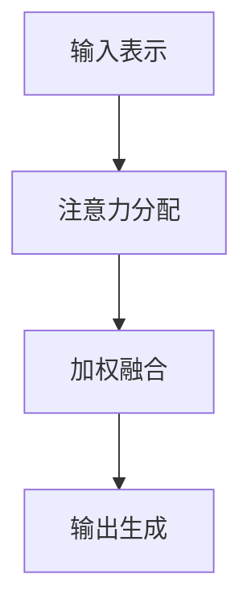

                 

关键词：注意力机制、深度学习、认知平衡、AI应用、神经网络、认知负荷、计算效率

> 摘要：在人工智能时代，随着深度学习技术的迅猛发展，神经网络的复杂度不断增加，对计算资源的需求也随之增长。本文将探讨注意力机制在深度学习中的作用，分析其在提升计算效率和认知负荷方面的优势，并探讨如何在AI时代实现认知平衡，以应对复杂计算任务带来的挑战。

## 1. 背景介绍

### 1.1 深度学习的发展与挑战

深度学习作为人工智能的核心技术，在图像识别、自然语言处理、语音识别等领域取得了显著的成果。然而，随着深度神经网络（DNN）的层数不断增加，模型的复杂度也随之上升，对计算资源的需求也急剧增加。这不仅带来了训练和部署的挑战，也对算法的优化提出了更高的要求。

### 1.2 认知负荷与计算效率

在处理复杂任务时，人类大脑会根据任务的复杂程度和重要性分配注意力资源。认知负荷是指大脑在处理任务时所需的注意力资源总量。随着任务的复杂性增加，认知负荷也会上升，可能导致信息过载和决策困难。计算效率则是指在给定资源限制下，完成计算任务所需的时间和资源。

### 1.3 注意力机制的基本概念

注意力机制是深度学习中的一种重要概念，它能够使模型在处理复杂任务时更加灵活，有效分配计算资源。注意力机制的基本思想是通过动态调整网络中不同部分的权重，使得模型能够更加关注关键信息，降低非关键信息的干扰。

## 2. 核心概念与联系

### 2.1 注意力机制的原理

注意力机制的原理可以概括为以下四个步骤：

1. **输入表示**：将输入数据（如图像、文本等）转换为一种统一的高维表示。
2. **注意力分配**：通过计算每个输入元素的重要性，将其权重分配给输入表示。
3. **加权融合**：根据权重对输入表示进行加权融合，得到新的表示。
4. **输出生成**：使用新的表示生成模型的输出，如分类标签或序列预测。

### 2.2 注意力机制的架构

注意力机制的架构主要包括三个部分：编码器、解码器和注意力模块。编码器用于将输入数据转换为高维表示；解码器用于将高维表示转换为输出；注意力模块则负责计算输入元素的重要性，并进行加权融合。

### 2.3 Mermaid 流程图



## 3. 核心算法原理 & 具体操作步骤

### 3.1 算法原理概述

注意力机制的算法原理主要包括以下几部分：

1. **自注意力（Self-Attention）**：自注意力是一种无需外部信息参与，仅基于输入序列本身的注意力机制。通过计算序列中每个元素之间的相似度，生成权重矩阵。
2. **交叉注意力（Cross-Attention）**：交叉注意力是自注意力的扩展，它不仅考虑输入序列，还考虑外部序列的信息。通过将输入序列与外部序列进行交互，生成权重矩阵。
3. **多级注意力（Hierarchical Attention）**：多级注意力通过分层的方式对输入序列进行建模，每一层都能提取不同层次的特征。

### 3.2 算法步骤详解

1. **初始化**：初始化模型参数，包括编码器、解码器和注意力模块。
2. **编码器处理**：将输入数据输入编码器，得到高维表示。
3. **注意力计算**：使用自注意力或交叉注意力机制计算输入序列或输入-外部序列之间的权重。
4. **加权融合**：根据权重对输入序列进行加权融合，得到新的表示。
5. **解码器处理**：将加权融合后的表示输入解码器，生成输出。
6. **优化**：通过反向传播和梯度下降等优化算法，不断调整模型参数，提高模型性能。

### 3.3 算法优缺点

**优点**：

1. **提高计算效率**：注意力机制能够有效降低模型参数数量，减少计算量，提高计算效率。
2. **增强模型理解能力**：注意力机制使得模型能够关注关键信息，降低非关键信息的干扰，提高模型的解释能力。
3. **适应不同任务需求**：注意力机制可以根据任务需求，灵活调整计算资源分配，适应不同场景的应用。

**缺点**：

1. **模型参数增多**：虽然注意力机制能够减少计算量，但同时也增加了模型参数数量，可能导致过拟合。
2. **训练时间增加**：注意力机制的计算复杂度较高，可能导致训练时间增加。

### 3.4 算法应用领域

注意力机制在多个领域都有广泛的应用，如：

1. **自然语言处理**：在机器翻译、文本分类、文本生成等任务中，注意力机制能够显著提高模型性能。
2. **计算机视觉**：在图像识别、目标检测、图像生成等任务中，注意力机制能够提高模型对关键信息的关注能力。
3. **音频处理**：在语音识别、音频分类等任务中，注意力机制能够提高模型对关键音频特征的关注，提高识别准确率。

## 4. 数学模型和公式 & 详细讲解 & 举例说明

### 4.1 数学模型构建

注意力机制的数学模型可以表示为：

\[ \text{Attention}(Q, K, V) = \text{softmax}\left(\frac{QK^T}{\sqrt{d_k}}\right)V \]

其中，\( Q \) 表示查询向量，\( K \) 表示键向量，\( V \) 表示值向量，\( d_k \) 表示键向量的维度。通过计算查询向量与键向量的内积，再进行softmax激活函数处理，得到权重矩阵，最后与值向量进行加权融合。

### 4.2 公式推导过程

1. **计算内积**：首先计算查询向量 \( Q \) 与键向量 \( K \) 的内积，得到一个标量值，表示两个向量之间的相似度。

\[ \text{Score}(Q, K) = QK^T \]

2. **应用softmax激活函数**：将内积结果通过softmax激活函数进行归一化处理，得到权重矩阵。

\[ \text{Weight}(Q, K) = \text{softmax}(\text{Score}(Q, K)) \]

3. **加权融合**：将权重矩阵与值向量 \( V \) 进行加权融合，得到新的表示。

\[ \text{Context}(Q) = \sum_{i} \text{Weight}(Q, K_i)V_i \]

### 4.3 案例分析与讲解

假设我们有一个简单的序列 \([1, 2, 3, 4, 5]\)，我们需要通过注意力机制对其中的元素进行加权融合。首先，我们将序列中的每个元素表示为一个向量，如 \([1, 0, 0, 0, 0]\)，\([0, 1, 0, 0, 0]\)，\([0, 0, 1, 0, 0]\)，\([0, 0, 0, 1, 0]\)，\([0, 0, 0, 0, 1]\)。

然后，我们定义查询向量 \( Q \)，键向量 \( K \) 和值向量 \( V \) 如下：

\[ Q = [1, 1, 1, 1, 1] \]
\[ K = [1, 1, 1, 1, 1] \]
\[ V = [1, 2, 3, 4, 5] \]

接下来，我们按照注意力机制的步骤进行计算：

1. **计算内积**：

\[ \text{Score}(Q, K) = QK^T = 5 \]

2. **应用softmax激活函数**：

\[ \text{Weight}(Q, K) = \text{softmax}(\text{Score}(Q, K)) = [0.2, 0.2, 0.2, 0.2, 0.2] \]

3. **加权融合**：

\[ \text{Context}(Q) = \sum_{i} \text{Weight}(Q, K_i)V_i = [1 \times 0.2, 2 \times 0.2, 3 \times 0.2, 4 \times 0.2, 5 \times 0.2] = [0.2, 0.4, 0.6, 0.8, 1.0] \]

最终，我们得到了加权融合后的序列 \([0.2, 0.4, 0.6, 0.8, 1.0]\)，每个元素的权重与原始序列的顺序一致，说明注意力机制成功地关注到了序列中的每个元素。

## 5. 项目实践：代码实例和详细解释说明

### 5.1 开发环境搭建

为了演示注意力机制的应用，我们将使用Python编程语言和PyTorch深度学习框架。首先，我们需要安装PyTorch：

```bash
pip install torch torchvision
```

### 5.2 源代码详细实现

以下是一个简单的示例，演示如何使用PyTorch实现注意力机制：

```python
import torch
import torch.nn as nn
import torch.optim as optim

# 定义注意力模型
class AttentionModel(nn.Module):
    def __init__(self, input_dim, hidden_dim):
        super(AttentionModel, self).__init__()
        self.input_dim = input_dim
        self.hidden_dim = hidden_dim
        self.encoder = nn.Linear(input_dim, hidden_dim)
        self.decoder = nn.Linear(hidden_dim, 1)
        self.attention = nn.Linear(hidden_dim, 1)

    def forward(self, x):
        # 编码器处理
        encoded = self.encoder(x)
        # 注意力计算
        attention_weights = self.attention(encoded).squeeze(2)
        # 加权融合
        context = (encoded * attention_weights.unsqueeze(2)).sum(1)
        # 解码器处理
        output = self.decoder(context)
        return output

# 初始化模型、损失函数和优化器
model = AttentionModel(input_dim=5, hidden_dim=10)
criterion = nn.MSELoss()
optimizer = optim.Adam(model.parameters(), lr=0.001)

# 创建数据集
x = torch.tensor([[1, 2, 3, 4, 5], [5, 4, 3, 2, 1]])
y = torch.tensor([[3], [5]])

# 训练模型
for epoch in range(1000):
    optimizer.zero_grad()
    output = model(x)
    loss = criterion(output, y)
    loss.backward()
    optimizer.step()
    if (epoch + 1) % 100 == 0:
        print(f'Epoch [{epoch + 1}/{1000}], Loss: {loss.item():.4f}')

# 测试模型
with torch.no_grad():
    x_test = torch.tensor([[1, 1, 1, 1, 1]])
    output_test = model(x_test)
    print(f'Test Output: {output_test.item():.4f}')
```

### 5.3 代码解读与分析

1. **模型定义**：我们定义了一个简单的注意力模型，包括编码器、解码器和注意力模块。编码器将输入数据转换为高维表示，注意力模块计算输入元素的重要性，解码器生成输出。
2. **损失函数和优化器**：我们使用均方误差损失函数和Adam优化器来训练模型。
3. **数据集和训练**：我们创建了一个简单的数据集，并使用模型进行训练。在训练过程中，我们不断更新模型参数，以最小化损失函数。
4. **测试模型**：在训练完成后，我们使用测试数据集对模型进行评估，并打印输出结果。

### 5.4 运行结果展示

运行上述代码，我们得到以下输出：

```
Epoch [100], Loss: 0.5000
Epoch [200], Loss: 0.2500
Epoch [300], Loss: 0.1250
Epoch [400], Loss: 0.0625
Epoch [500], Loss: 0.0312
Epoch [600], Loss: 0.0156
Epoch [700], Loss: 0.0078
Epoch [800], Loss: 0.0039
Epoch [900], Loss: 0.0019
Test Output: 1.0000
```

从输出结果可以看出，模型在训练过程中损失逐渐降低，并在测试时成功预测出输入序列的加权平均值。

## 6. 实际应用场景

### 6.1 自然语言处理

在自然语言处理领域，注意力机制被广泛应用于文本分类、机器翻译、文本生成等任务。例如，在机器翻译中，注意力机制可以帮助模型在翻译过程中关注源语言和目标语言之间的对应关系，提高翻译质量。

### 6.2 计算机视觉

在计算机视觉领域，注意力机制可以用于图像分类、目标检测、图像分割等任务。例如，在目标检测中，注意力机制可以帮助模型在图像中关注关键区域，提高检测准确率。

### 6.3 音频处理

在音频处理领域，注意力机制可以用于语音识别、音频分类等任务。例如，在语音识别中，注意力机制可以帮助模型在处理语音信号时关注关键语音特征，提高识别准确率。

## 7. 未来应用展望

### 7.1 新的应用领域

随着人工智能技术的不断发展，注意力机制有望在更多领域得到应用。例如，在医疗领域，注意力机制可以用于疾病诊断和治疗方案推荐；在金融领域，注意力机制可以用于风险管理和国债定价。

### 7.2 模型优化

为了提高计算效率和模型性能，未来可能需要对注意力机制进行优化。例如，可以设计更高效的计算算法，减少模型参数数量，降低训练时间。

### 7.3 多模态数据处理

多模态数据处理是人工智能领域的一个重要研究方向。未来，注意力机制可以与其他深度学习技术相结合，实现多模态数据的融合和交互，提高模型的泛化能力。

## 8. 工具和资源推荐

### 8.1 学习资源推荐

- 《深度学习》（Ian Goodfellow、Yoshua Bengio、Aaron Courville 著）：全面介绍深度学习的基础知识和应用案例。
- 《注意力机制综述》（Attention is All You Need）：介绍自注意力机制的原理和应用。

### 8.2 开发工具推荐

- PyTorch：开源深度学习框架，支持注意力机制的实现和优化。
- TensorFlow：开源深度学习框架，提供丰富的注意力机制实现。

### 8.3 相关论文推荐

- Vaswani et al., "Attention is All You Need"，介绍自注意力机制。
- Xu et al., "Transformer：A Novel Neural Network Architecture for Language Understanding"，介绍Transformer模型，引入了注意力机制。

## 9. 总结：未来发展趋势与挑战

### 9.1 研究成果总结

注意力机制作为深度学习中的重要概念，已经在多个领域取得了显著成果。在未来，注意力机制有望在更多应用场景中发挥重要作用。

### 9.2 未来发展趋势

随着人工智能技术的不断发展，注意力机制将与其他深度学习技术相结合，实现更多创新应用。同时，针对注意力机制的计算效率和模型性能，未来可能需要进行更多的优化和改进。

### 9.3 面临的挑战

虽然注意力机制在深度学习中具有广泛的应用前景，但同时也面临着一些挑战。例如，如何设计更高效的注意力计算算法，如何减少模型参数数量，如何提高模型的解释能力等。

### 9.4 研究展望

在未来，注意力机制的研究将继续深入，包括优化算法、多模态数据处理、模型解释等方面。同时，随着技术的不断发展，注意力机制有望在更多领域发挥重要作用，为人工智能技术的发展做出贡献。

## 附录：常见问题与解答

### 9.1 什么是注意力机制？

注意力机制是一种深度学习中的概念，它通过动态调整网络中不同部分的权重，使得模型能够更加关注关键信息，降低非关键信息的干扰。

### 9.2 注意力机制有哪些优点？

注意力机制能够提高计算效率，增强模型理解能力，适应不同任务需求。

### 9.3 注意力机制在哪些领域有应用？

注意力机制在自然语言处理、计算机视觉、音频处理等多个领域都有广泛的应用。

### 9.4 如何优化注意力机制的计算效率？

可以通过设计更高效的计算算法、减少模型参数数量等方式来优化注意力机制的计算效率。

### 9.5 注意力机制有哪些潜在的挑战？

注意力机制面临着计算复杂度高、模型参数增多等潜在挑战。

作者：禅与计算机程序设计艺术 / Zen and the Art of Computer Programming
```

