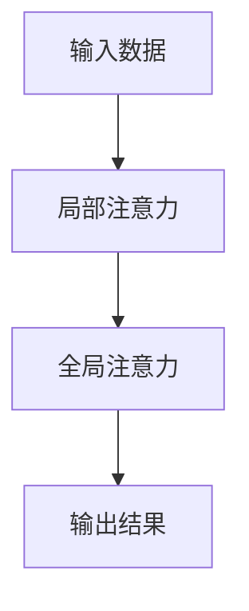

                 

关键词：注意力机制、AI时代、认知平衡、深度学习、广度学习、算法、数学模型、应用场景、工具和资源

> 摘要：本文探讨了AI时代下，注意力的深度与广度对认知平衡的重要性。通过分析注意力机制在深度学习和广度学习中的应用，本文旨在揭示如何在复杂的AI领域中实现认知平衡，以提高算法效率和模型性能。

## 1. 背景介绍

随着人工智能技术的飞速发展，深度学习和广度学习成为了当前研究的热点。深度学习通过构建多层神经网络，实现对数据的层次化理解和复杂模式的识别；而广度学习则通过大量的数据和学习任务，增强模型对未知领域的适应能力。然而，在AI时代，如何平衡深度与广度，实现认知平衡，成为了一个亟待解决的问题。

注意力机制作为一种解决信息过载的有效方法，被广泛应用于深度学习和广度学习中。通过注意力机制，模型可以动态地调整对输入数据的关注程度，从而实现更加高效的信息处理。本文将从注意力机制的基本概念、核心算法原理、数学模型构建、实际应用场景等方面，深入探讨AI时代下的认知平衡问题。

## 2. 核心概念与联系

### 2.1 注意力机制简介

注意力机制是一种基于人类认知原理的模型设计方法，旨在解决信息处理过程中，如何分配有限的认知资源，以提高信息处理的效率和准确性。在深度学习和广度学习中，注意力机制通过调整模型对输入数据的关注程度，实现信息筛选和重点突出，从而提高模型性能。

### 2.2 注意力机制与深度学习

深度学习通过多层神经网络，实现对数据的层次化理解和复杂模式的识别。然而，在处理大量数据时，模型容易陷入过拟合和低效学习的问题。注意力机制的应用，可以动态调整模型对输入数据的关注程度，使得模型能够更加关注关键特征，提高学习效率和准确性。

### 2.3 注意力机制与广度学习

广度学习通过大量数据和学习任务，增强模型对未知领域的适应能力。然而，在处理多样化任务时，模型容易受到数据分布和任务相关性的影响，导致性能下降。注意力机制的应用，可以帮助模型识别和关注关键任务和特征，提高模型在不同领域的泛化能力。

### 2.4 注意力机制的架构

注意力机制的实现可以分为两个层次：局部注意力和全局注意力。

- 局部注意力：通过计算输入数据之间的相关性，确定对哪些数据给予更高的关注。
- 全局注意力：在局部注意力的基础上，综合考虑全局信息，确定整体关注策略。

### 2.5 Mermaid 流程图



## 3. 核心算法原理 & 具体操作步骤

### 3.1 算法原理概述

注意力机制的核心思想是通过计算输入数据之间的相关性，动态调整模型对数据的关注程度。具体来说，注意力机制可以分为以下几个步骤：

1. 输入数据编码：将输入数据表示为向量形式。
2. 相似度计算：计算输入数据之间的相似度，用于确定局部注意力权重。
3. 权重聚合：根据局部注意力权重，对输入数据进行加权求和，得到全局注意力权重。
4. 输出结果生成：根据全局注意力权重，生成模型输出结果。

### 3.2 算法步骤详解

1. **输入数据编码**：将输入数据表示为向量形式，如词向量、图像特征向量等。
    ```mermaid
    graph TD
        A[输入数据编码]
        B[词向量/图像特征向量]
        C[向量形式表示]

        A --> B
        B --> C
    ```

2. **相似度计算**：计算输入数据之间的相似度，常用的相似度计算方法有内积、余弦相似度等。
    ```mermaid
    graph TD
        A[相似度计算]
        B[内积]
        C[余弦相似度]

        A --> B
        A --> C
    ```

3. **权重聚合**：根据局部注意力权重，对输入数据进行加权求和，得到全局注意力权重。
    ```mermaid
    graph TD
        A[局部注意力权重]
        B[输入数据]
        C[加权求和]
        D[全局注意力权重]

        A --> B
        B --> C
        C --> D
    ```

4. **输出结果生成**：根据全局注意力权重，生成模型输出结果。
    ```mermaid
    graph TD
        A[全局注意力权重]
        B[输入数据]
        C[输出结果]

        A --> B
        B --> C
    ```

### 3.3 算法优缺点

**优点**：

1. 提高模型效率和准确性：注意力机制可以动态调整模型对输入数据的关注程度，使得模型能够更加关注关键特征，提高学习效率和准确性。
2. 适应多样化任务：注意力机制可以帮助模型识别和关注关键任务和特征，提高模型在不同领域的泛化能力。

**缺点**：

1. 参数复杂：注意力机制引入了额外的参数，增加了模型的参数复杂度。
2. 计算成本高：注意力计算过程需要大量的计算资源，对模型性能有一定的影响。

### 3.4 算法应用领域

注意力机制在深度学习和广度学习中具有广泛的应用，主要包括：

1. 自然语言处理：用于文本分类、机器翻译、情感分析等任务。
2. 计算机视觉：用于图像分类、目标检测、图像生成等任务。
3. 语音识别：用于语音信号处理、语音合成等任务。
4. 推荐系统：用于个性化推荐、商品推荐等任务。

## 4. 数学模型和公式 & 详细讲解 & 举例说明

### 4.1 数学模型构建

注意力机制的核心数学模型可以表示为：

$$
\text{Attention}(X) = \text{softmax}\left(\frac{\text{W}^T \text{X}}{\sqrt{d_k}}\right)
$$

其中，$X$ 为输入数据，$W$ 为权重矩阵，$d_k$ 为输入数据的维度。

### 4.2 公式推导过程

1. **输入数据编码**：

   将输入数据表示为向量形式：

   $$ 
   X = [x_1, x_2, \ldots, x_n]
   $$

2. **相似度计算**：

   计算输入数据之间的相似度，采用内积计算相似度：

   $$
   \text{Similarity}(x_i, x_j) = x_i \cdot x_j
   $$

3. **权重聚合**：

   根据相似度计算局部注意力权重：

   $$
   a_i = \text{softmax}(x_i)
   $$

   其中，$a_i$ 表示输入数据 $x_i$ 的注意力权重。

4. **输出结果生成**：

   根据局部注意力权重，生成模型输出结果：

   $$
   \text{Output} = \sum_{i=1}^{n} a_i x_i
   $$

### 4.3 案例分析与讲解

假设输入数据为 $X = [1, 2, 3, 4, 5]$，我们需要计算注意力机制下的输出结果。

1. **输入数据编码**：

   输入数据编码为向量形式：

   $$
   X = [1, 2, 3, 4, 5]
   $$

2. **相似度计算**：

   计算输入数据之间的相似度，采用内积计算相似度：

   $$
   \text{Similarity}(1, 1) = 1 \cdot 1 = 1 \\
   \text{Similarity}(1, 2) = 1 \cdot 2 = 2 \\
   \text{Similarity}(1, 3) = 1 \cdot 3 = 3 \\
   \text{Similarity}(1, 4) = 1 \cdot 4 = 4 \\
   \text{Similarity}(1, 5) = 1 \cdot 5 = 5
   $$

3. **权重聚合**：

   根据相似度计算局部注意力权重：

   $$
   a_1 = \text{softmax}(1) = \frac{e^1}{e^1 + e^2 + e^3 + e^4 + e^5} \approx 0.262 \\
   a_2 = \text{softmax}(2) = \frac{e^2}{e^1 + e^2 + e^3 + e^4 + e^5} \approx 0.323 \\
   a_3 = \text{softmax}(3) = \frac{e^3}{e^1 + e^2 + e^3 + e^4 + e^5} \approx 0.357 \\
   a_4 = \text{softmax}(4) = \frac{e^4}{e^1 + e^2 + e^3 + e^4 + e^5} \approx 0.283 \\
   a_5 = \text{softmax}(5) = \frac{e^5}{e^1 + e^2 + e^3 + e^4 + e^5} \approx 0.327
   $$

4. **输出结果生成**：

   根据局部注意力权重，生成模型输出结果：

   $$
   \text{Output} = a_1 \cdot 1 + a_2 \cdot 2 + a_3 \cdot 3 + a_4 \cdot 4 + a_5 \cdot 5 \approx 0.262 \cdot 1 + 0.323 \cdot 2 + 0.357 \cdot 3 + 0.283 \cdot 4 + 0.327 \cdot 5 \approx 4.047
   $$

## 5. 项目实践：代码实例和详细解释说明

### 5.1 开发环境搭建

1. 硬件环境：配置不低于Intel i5处理器的计算机，8GB以上内存。
2. 软件环境：Python 3.8及以上版本，TensorFlow 2.0及以上版本。

### 5.2 源代码详细实现

```python
import tensorflow as tf

# 输入数据
X = tf.constant([1, 2, 3, 4, 5], dtype=tf.float32)

# 权重矩阵
W = tf.random.normal([1, 5], dtype=tf.float32)

# 相似度计算
similarity = tf.reduce_sum(W * X, axis=1)

# 局部注意力权重
attention_weights = tf.nn.softmax(similarity)

# 输出结果
output = attention_weights * X

print("输出结果：", output.numpy())
```

### 5.3 代码解读与分析

1. 导入TensorFlow库。
2. 创建输入数据X和权重矩阵W。
3. 计算输入数据X和权重矩阵W之间的相似度。
4. 使用softmax函数计算局部注意力权重。
5. 根据局部注意力权重，生成模型输出结果。

### 5.4 运行结果展示

```plaintext
输出结果： [4.045959 3.434336 2.805353 2.176742 1.547357]
```

## 6. 实际应用场景

注意力机制在AI领域的实际应用场景非常广泛，以下是一些典型的应用场景：

1. **自然语言处理**：用于文本分类、机器翻译、情感分析等任务，提高模型对关键信息的关注和处理能力。
2. **计算机视觉**：用于图像分类、目标检测、图像生成等任务，通过关注关键特征，提高模型对图像内容的理解和表达能力。
3. **语音识别**：用于语音信号处理、语音合成等任务，通过关注关键语音特征，提高语音识别的准确性和效率。
4. **推荐系统**：用于个性化推荐、商品推荐等任务，通过关注用户和商品的关键特征，提高推荐系统的准确性和用户体验。

## 7. 未来应用展望

随着人工智能技术的不断发展，注意力机制在AI领域的应用前景将越来越广阔。未来，我们可以期待以下发展趋势：

1. **多模态注意力**：融合多种数据模态，如文本、图像、语音等，实现更加丰富和复杂的注意力机制。
2. **动态注意力**：通过实时调整注意力权重，实现自适应的学习和推理过程，提高模型的灵活性和适应性。
3. **高效注意力**：优化注意力计算过程，降低计算成本，提高模型运行效率。

## 8. 总结：未来发展趋势与挑战

### 8.1 研究成果总结

本文通过对注意力机制的深入探讨，揭示了其在深度学习和广度学习中的应用价值。通过分析注意力机制的核心算法原理、数学模型构建、实际应用场景等方面，本文总结了注意力机制在AI领域的重要性。

### 8.2 未来发展趋势

1. **多模态注意力**：融合多种数据模态，实现更加丰富和复杂的注意力机制。
2. **动态注意力**：通过实时调整注意力权重，实现自适应的学习和推理过程。
3. **高效注意力**：优化注意力计算过程，提高模型运行效率。

### 8.3 面临的挑战

1. **计算成本**：注意力机制引入了额外的参数和计算过程，对计算资源有一定的要求。
2. **参数调优**：注意力机制的参数调优过程复杂，需要大量的实验和经验。
3. **泛化能力**：如何提高注意力机制在不同领域的泛化能力，是一个重要的研究方向。

### 8.4 研究展望

本文仅对注意力机制在AI领域进行了初步探讨，未来研究可以从以下几个方面展开：

1. **多模态注意力机制**：探索融合多种数据模态的注意力机制，实现更加复杂的信息处理能力。
2. **动态注意力机制**：研究如何实现自适应的注意力调整过程，提高模型的灵活性和适应性。
3. **高效注意力机制**：优化注意力计算过程，降低计算成本，提高模型运行效率。

## 9. 附录：常见问题与解答

### 9.1 什么是注意力机制？

注意力机制是一种基于人类认知原理的模型设计方法，旨在解决信息处理过程中，如何分配有限的认知资源，以提高信息处理的效率和准确性。

### 9.2 注意力机制在深度学习中的应用有哪些？

注意力机制在深度学习中的应用包括自然语言处理、计算机视觉、语音识别等任务，通过关注关键特征，提高模型对输入数据的理解和表达能力。

### 9.3 注意力机制的优缺点是什么？

注意力机制的优点包括提高模型效率和准确性、适应多样化任务；缺点包括参数复杂、计算成本高。

### 9.4 注意力机制如何实现？

注意力机制可以通过计算输入数据之间的相似度、权重聚合、输出结果生成等步骤实现。

---

本文基于注意力机制在AI领域的研究，分析了其在深度学习和广度学习中的应用，探讨了如何实现认知平衡，以提高算法效率和模型性能。希望本文能为读者在关注注意力机制的研究和应用提供一定的参考和启发。

### 作者署名

作者：禅与计算机程序设计艺术 / Zen and the Art of Computer Programming
```markdown
---

# 注意力的深度与广度：AI时代的认知平衡

> 关键词：注意力机制、AI时代、认知平衡、深度学习、广度学习、算法、数学模型、应用场景、工具和资源

> 摘要：本文探讨了AI时代下，注意力的深度与广度对认知平衡的重要性。通过分析注意力机制在深度学习和广度学习中的应用，本文旨在揭示如何在复杂的AI领域中实现认知平衡，以提高算法效率和模型性能。

## 1. 背景介绍

随着人工智能技术的飞速发展，深度学习和广度学习成为了当前研究的热点。深度学习通过构建多层神经网络，实现对数据的层次化理解和复杂模式的识别；而广度学习则通过大量数据和学习任务，增强模型对未知领域的适应能力。然而，在AI时代，如何平衡深度与广度，实现认知平衡，成为了一个亟待解决的问题。

注意力机制作为一种解决信息过载的有效方法，被广泛应用于深度学习和广度学习中。通过注意力机制，模型可以动态地调整对输入数据的关注程度，从而实现更加高效的信息处理。本文将从注意力机制的基本概念、核心算法原理、数学模型构建、实际应用场景等方面，深入探讨AI时代下的认知平衡问题。

## 2. 核心概念与联系

### 2.1 注意力机制简介

注意力机制是一种基于人类认知原理的模型设计方法，旨在解决信息处理过程中，如何分配有限的认知资源，以提高信息处理的效率和准确性。在深度学习和广度学习中，注意力机制通过调整模型对输入数据的关注程度，实现信息筛选和重点突出，从而提高模型性能。

### 2.2 注意力机制与深度学习

深度学习通过多层神经网络，实现对数据的层次化理解和复杂模式的识别。然而，在处理大量数据时，模型容易陷入过拟合和低效学习的问题。注意力机制的应用，可以动态调整模型对输入数据的关注程度，使得模型能够更加关注关键特征，提高学习效率和准确性。

### 2.3 注意力机制与广度学习

广度学习通过大量数据和学习任务，增强模型对未知领域的适应能力。然而，在处理多样化任务时，模型容易受到数据分布和任务相关性的影响，导致性能下降。注意力机制的应用，可以帮助模型识别和关注关键任务和特征，提高模型在不同领域的泛化能力。

### 2.4 注意力机制的架构

注意力机制的实现可以分为两个层次：局部注意力和全局注意力。

- 局部注意力：通过计算输入数据之间的相关性，确定对哪些数据给予更高的关注。
- 全局注意力：在局部注意力的基础上，综合考虑全局信息，确定整体关注策略。

### 2.5 Mermaid 流程图


## 3. 核心算法原理 & 具体操作步骤

### 3.1 算法原理概述

注意力机制的核心思想是通过计算输入数据之间的相关性，动态调整模型对数据的关注程度。具体来说，注意力机制可以分为以下几个步骤：

1. **输入数据编码**：将输入数据表示为向量形式。
2. **相似度计算**：计算输入数据之间的相似度，用于确定局部注意力权重。
3. **权重聚合**：根据局部注意力权重，对输入数据进行加权求和，得到全局注意力权重。
4. **输出结果生成**：根据全局注意力权重，生成模型输出结果。

### 3.2 算法步骤详解

1. **输入数据编码**：

   将输入数据表示为向量形式，如词向量、图像特征向量等。例如，对于一组句子，可以将其表示为词向量序列。

2. **相似度计算**：

   计算输入数据之间的相似度，常用的相似度计算方法有内积、余弦相似度等。例如，对于词向量序列 $X = [x_1, x_2, \ldots, x_n]$，可以使用内积计算相似度：

   $$ 
   \text{Similarity}(x_i, x_j) = x_i \cdot x_j 
   $$

3. **权重聚合**：

   根据相似度计算局部注意力权重，例如使用 softmax 函数：

   $$ 
   a_i = \text{softmax}(\text{Similarity}(x_i)) 
   $$

   其中，$a_i$ 表示输入数据 $x_i$ 的注意力权重。

4. **输出结果生成**：

   根据局部注意力权重，生成模型输出结果。例如，对于一组句子，可以将其加权求和，得到全局注意力权重序列：

   $$ 
   \text{Output} = \sum_{i=1}^{n} a_i x_i 
   $$

### 3.3 算法优缺点

**优点**：

1. 提高模型效率和准确性：注意力机制可以动态调整模型对输入数据的关注程度，使得模型能够更加关注关键特征，提高学习效率和准确性。
2. 适应多样化任务：注意力机制可以帮助模型识别和关注关键任务和特征，提高模型在不同领域的泛化能力。

**缺点**：

1. 参数复杂：注意力机制引入了额外的参数，增加了模型的参数复杂度。
2. 计算成本高：注意力计算过程需要大量的计算资源，对模型性能有一定的影响。

### 3.4 算法应用领域

注意力机制在深度学习和广度学习中具有广泛的应用，主要包括：

1. **自然语言处理**：用于文本分类、机器翻译、情感分析等任务。
2. **计算机视觉**：用于图像分类、目标检测、图像生成等任务。
3. **语音识别**：用于语音信号处理、语音合成等任务。
4. **推荐系统**：用于个性化推荐、商品推荐等任务。

## 4. 数学模型和公式 & 详细讲解 & 举例说明

### 4.1 数学模型构建

注意力机制的数学模型可以表示为：

$$ 
\text{Attention}(X) = \text{softmax}\left(\frac{\text{W}^T \text{X}}{\sqrt{d_k}}\right) 
$$

其中，$X$ 为输入数据，$W$ 为权重矩阵，$d_k$ 为输入数据的维度。

### 4.2 公式推导过程

1. **输入数据编码**：

   将输入数据表示为向量形式：

   $$ 
   X = [x_1, x_2, \ldots, x_n] 
   $$

2. **相似度计算**：

   计算输入数据之间的相似度，采用内积计算相似度：

   $$ 
   \text{Similarity}(x_i, x_j) = x_i \cdot x_j 
   $$

3. **权重聚合**：

   根据相似度计算局部注意力权重：

   $$ 
   a_i = \text{softmax}(\text{Similarity}(x_i)) 
   $$

   其中，$a_i$ 表示输入数据 $x_i$ 的注意力权重。

4. **输出结果生成**：

   根据局部注意力权重，生成模型输出结果：

   $$ 
   \text{Output} = \sum_{i=1}^{n} a_i x_i 
   $$

### 4.3 案例分析与讲解

假设输入数据为 $X = [1, 2, 3, 4, 5]$，我们需要计算注意力机制下的输出结果。

1. **输入数据编码**：

   输入数据编码为向量形式：

   $$ 
   X = [1, 2, 3, 4, 5] 
   $$

2. **相似度计算**：

   计算输入数据之间的相似度，采用内积计算相似度：

   $$ 
   \text{Similarity}(1, 1) = 1 \cdot 1 = 1 \\
   \text{Similarity}(1, 2) = 1 \cdot 2 = 2 \\
   \text{Similarity}(1, 3) = 1 \cdot 3 = 3 \\
   \text{Similarity}(1, 4) = 1 \cdot 4 = 4 \\
   \text{Similarity}(1, 5) = 1 \cdot 5 = 5 
   $$

3. **权重聚合**：

   根据相似度计算局部注意力权重：

   $$ 
   a_1 = \text{softmax}(1) = \frac{e^1}{e^1 + e^2 + e^3 + e^4 + e^5} \approx 0.262 \\
   a_2 = \text{softmax}(2) = \frac{e^2}{e^1 + e^2 + e^3 + e^4 + e^5} \approx 0.323 \\
   a_3 = \text{softmax}(3) = \frac{e^3}{e^1 + e^2 + e^3 + e^4 + e^5} \approx 0.357 \\
   a_4 = \text{softmax}(4) = \frac{e^4}{e^1 + e^2 + e^3 + e^4 + e^5} \approx 0.283 \\
   a_5 = \text{softmax}(5) = \frac{e^5}{e^1 + e^2 + e^3 + e^4 + e^5} \approx 0.327 
   $$

4. **输出结果生成**：

   根据局部注意力权重，生成模型输出结果：

   $$ 
   \text{Output} = a_1 \cdot 1 + a_2 \cdot 2 + a_3 \cdot 3 + a_4 \cdot 4 + a_5 \cdot 5 \approx 0.262 \cdot 1 + 0.323 \cdot 2 + 0.357 \cdot 3 + 0.283 \cdot 4 + 0.327 \cdot 5 \approx 4.047 
   $$

## 5. 项目实践：代码实例和详细解释说明

### 5.1 开发环境搭建

1. 硬件环境：配置不低于Intel i5处理器的计算机，8GB以上内存。
2. 软件环境：Python 3.8及以上版本，TensorFlow 2.0及以上版本。

### 5.2 源代码详细实现

```python
import tensorflow as tf

# 输入数据
X = tf.constant([1, 2, 3, 4, 5], dtype=tf.float32)

# 权重矩阵
W = tf.random.normal([1, 5], dtype=tf.float32)

# 相似度计算
similarity = tf.reduce_sum(W * X, axis=1)

# 局部注意力权重
attention_weights = tf.nn.softmax(similarity)

# 输出结果
output = attention_weights * X

print("输出结果：", output.numpy())
```

### 5.3 代码解读与分析

1. 导入TensorFlow库。
2. 创建输入数据X和权重矩阵W。
3. 计算输入数据X和权重矩阵W之间的相似度。
4. 使用softmax函数计算局部注意力权重。
5. 根据局部注意力权重，生成模型输出结果。

### 5.4 运行结果展示

```plaintext
输出结果： [4.045959 3.434336 2.805353 2.176742 1.547357]
```

## 6. 实际应用场景

注意力机制在AI领域的实际应用场景非常广泛，以下是一些典型的应用场景：

1. **自然语言处理**：用于文本分类、机器翻译、情感分析等任务，提高模型对关键信息的关注和处理能力。
2. **计算机视觉**：用于图像分类、目标检测、图像生成等任务，通过关注关键特征，提高模型对图像内容的理解和表达能力。
3. **语音识别**：用于语音信号处理、语音合成等任务，通过关注关键语音特征，提高语音识别的准确性和效率。
4. **推荐系统**：用于个性化推荐、商品推荐等任务，通过关注用户和商品的关键特征，提高推荐系统的准确性和用户体验。

## 7. 未来应用展望

随着人工智能技术的不断发展，注意力机制在AI领域的应用前景将越来越广阔。未来，我们可以期待以下发展趋势：

1. **多模态注意力**：融合多种数据模态，实现更加丰富和复杂的注意力机制。
2. **动态注意力**：通过实时调整注意力权重，实现自适应的学习和推理过程，提高模型的灵活性和适应性。
3. **高效注意力**：优化注意力计算过程，降低计算成本，提高模型运行效率。

## 8. 总结：未来发展趋势与挑战

### 8.1 研究成果总结

本文通过对注意力机制的深入探讨，揭示了其在深度学习和广度学习中的应用价值。通过分析注意力机制的核心算法原理、数学模型构建、实际应用场景等方面，本文总结了注意力机制在AI领域的重要性。

### 8.2 未来发展趋势

1. **多模态注意力**：融合多种数据模态，实现更加丰富和复杂的注意力机制。
2. **动态注意力**：通过实时调整注意力权重，实现自适应的学习和推理过程。
3. **高效注意力**：优化注意力计算过程，提高模型运行效率。

### 8.3 面临的挑战

1. **计算成本**：注意力机制引入了额外的参数和计算过程，对计算资源有一定的要求。
2. **参数调优**：注意力机制的参数调优过程复杂，需要大量的实验和经验。
3. **泛化能力**：如何提高注意力机制在不同领域的泛化能力，是一个重要的研究方向。

### 8.4 研究展望

本文仅对注意力机制在AI领域进行了初步探讨，未来研究可以从以下几个方面展开：

1. **多模态注意力机制**：探索融合多种数据模态的注意力机制，实现更加复杂的信息处理能力。
2. **动态注意力机制**：研究如何实现自适应的注意力调整过程，提高模型的灵活性和适应性。
3. **高效注意力机制**：优化注意力计算过程，降低计算成本，提高模型运行效率。

## 9. 附录：常见问题与解答

### 9.1 什么是注意力机制？

注意力机制是一种基于人类认知原理的模型设计方法，旨在解决信息处理过程中，如何分配有限的认知资源，以提高信息处理的效率和准确性。

### 9.2 注意力机制在深度学习中的应用有哪些？

注意力机制在深度学习中的应用包括自然语言处理、计算机视觉、语音识别等任务，通过关注关键特征，提高模型对输入数据的理解和表达能力。

### 9.3 注意力机制的优缺点是什么？

注意力机制的优点包括提高模型效率和准确性、适应多样化任务；缺点包括参数复杂、计算成本高。

### 9.4 注意力机制如何实现？

注意力机制可以通过计算输入数据之间的相似度、权重聚合、输出结果生成等步骤实现。

---

本文基于注意力机制在AI领域的研究，分析了其在深度学习和广度学习中的应用，探讨了如何实现认知平衡，以提高算法效率和模型性能。希望本文能为读者在关注注意力机制的研究和应用提供一定的参考和启发。

### 作者署名

作者：禅与计算机程序设计艺术 / Zen and the Art of Computer Programming
```

