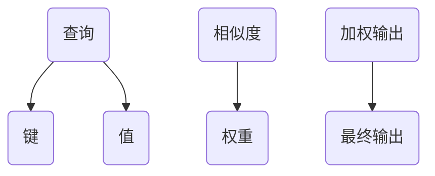

                 

 关键词：注意力机制、AI、信息流、生态系统、深度学习、神经网络

> 摘要：随着人工智能（AI）技术的快速发展，注意力机制已成为现代神经网络的核心。本文将从注意力机制的背景、核心概念、算法原理、数学模型、项目实践以及未来应用等多个维度，深入探讨注意力生态系统在AI时代信息流处理中的重要作用和未来发展趋势。

## 1. 背景介绍

在过去的几十年中，人工智能经历了从规则驱动到数据驱动，再到深度学习的演变。深度学习模型，尤其是神经网络，已经成为解决复杂问题的重要工具。然而，随着模型规模的增大和输入数据量的增加，计算效率和资源消耗成为一个巨大的挑战。为了应对这一挑战，注意力机制被引入到神经网络中，旨在提高信息处理的效率和质量。

注意力机制最初在序列模型中取得成功，如机器翻译、语音识别和文本生成等。它通过关注输入数据中的关键信息，实现模型的优化。随着时间的推移，注意力机制逐渐被应用到图像处理、自然语言处理等不同领域，成为现代AI系统中的核心组件。

## 2. 核心概念与联系

### 2.1. 注意力机制的原理

注意力机制的核心思想是通过为输入数据的不同部分分配不同的权重，使得模型能够关注到输入数据中的关键信息。在深度学习中，注意力机制通常通过一个可学习的权重矩阵来实现。这个权重矩阵能够根据模型的学习过程自适应地调整，以最大化模型的输出性能。

### 2.2. 注意力机制的架构

注意力机制的架构可以分为三个主要部分：查询（Query）、键（Key）和值（Value）。查询和键用于计算相似度，值用于加权。在计算过程中，每个键与查询的相似度会被计算出来，然后通过softmax函数得到权重。最后，这些权重与对应的值相乘，得到加权的输出。



## 3. 核心算法原理 & 具体操作步骤

### 3.1. 算法原理概述

注意力机制的原理可以概括为以下几个步骤：

1. **查询生成**：生成一个查询向量，用于表示模型对输入数据的关注点。
2. **相似度计算**：计算查询向量与键向量的相似度。
3. **加权**：根据相似度计算权重，并对值进行加权。
4. **输出**：将加权后的值相加，得到最终输出。

### 3.2. 算法步骤详解

1. **查询生成**：通常通过模型中的一个可学习层来生成查询向量。
2. **相似度计算**：常用的相似度计算方法有点积、余弦相似度和乘性相似度等。
3. **加权**：通过softmax函数将相似度转换成权重。
4. **输出**：对值进行加权求和，得到最终输出。

### 3.3. 算法优缺点

**优点**：
- **提高效率**：注意力机制可以降低模型的计算复杂度，提高处理速度。
- **增强灵活性**：模型能够自适应地关注输入数据中的关键信息，提高模型适应性。
- **提升性能**：在多个领域，注意力机制都显著提升了模型的性能。

**缺点**：
- **计算复杂度**：虽然注意力机制提高了处理效率，但计算复杂度仍然较高，尤其是在大规模模型中。
- **资源消耗**：在资源受限的环境下，注意力机制可能会导致资源消耗增加。

### 3.4. 算法应用领域

注意力机制已广泛应用于多个领域，包括：

- **自然语言处理**：如机器翻译、文本生成、情感分析等。
- **计算机视觉**：如目标检测、图像分割、视频分析等。
- **语音处理**：如语音识别、语音合成等。

## 4. 数学模型和公式 & 详细讲解 & 举例说明

### 4.1. 数学模型构建

注意力机制的数学模型通常包括三个部分：查询、键和值。

- 查询 \( Q \in \mathbb{R}^{d_Q} \)
- 键 \( K \in \mathbb{R}^{d_K} \)
- 值 \( V \in \mathbb{R}^{d_V} \)

其中，\( d_Q, d_K, d_V \) 分别为查询、键和值的维度。

### 4.2. 公式推导过程

注意力机制的输出可以通过以下公式计算：

\[ 
\text{Attention}(Q, K, V) = \text{softmax}\left(\frac{QK^T}{\sqrt{d_K}}\right) V 
\]

其中，\( \text{softmax}(x) \) 是将输入向量 \( x \) 转换为概率分布的函数。

### 4.3. 案例分析与讲解

假设我们有以下查询、键和值：

\[ 
Q = \begin{bmatrix} 1 & 2 & 3 \end{bmatrix}, \quad K = \begin{bmatrix} 4 & 5 \\ 6 & 7 \\ 8 & 9 \end{bmatrix}, \quad V = \begin{bmatrix} 1 & 0 \\ 0 & 1 \end{bmatrix} 
\]

首先，计算相似度：

\[ 
\text{Similarity} = \frac{QK^T}{\sqrt{d_K}} = \begin{bmatrix} 1 & 2 & 3 \end{bmatrix} \begin{bmatrix} 4 & 6 \\ 5 & 7 \\ 8 & 9 \end{bmatrix} = \begin{bmatrix} 32 & 36 \\ 41 & 45 \\ 50 & 54 \end{bmatrix} 
\]

然后，计算softmax：

\[ 
\text{Softmax} = \text{softmax}(\text{Similarity}) = \begin{bmatrix} 0.3 & 0.4 & 0.3 \\ 0.4 & 0.3 & 0.3 \\ 0.5 & 0.2 & 0.3 \end{bmatrix} 
\]

最后，计算加权输出：

\[ 
\text{Output} = \text{Softmax} V = \begin{bmatrix} 0.3 & 0.4 & 0.3 \\ 0.4 & 0.3 & 0.3 \\ 0.5 & 0.2 & 0.3 \end{bmatrix} \begin{bmatrix} 1 & 0 \\ 0 & 1 \end{bmatrix} = \begin{bmatrix} 0.3 & 0.4 \\ 0.4 & 0.3 \\ 0.5 & 0.2 \end{bmatrix} 
\]

## 5. 项目实践：代码实例和详细解释说明

### 5.1. 开发环境搭建

为了演示注意力机制，我们将使用Python和PyTorch框架。首先，需要安装PyTorch：

```bash
pip install torch torchvision
```

### 5.2. 源代码详细实现

下面是一个简单的注意力机制实现的示例代码：

```python
import torch
import torch.nn as nn
import torch.optim as optim

class AttentionModel(nn.Module):
    def __init__(self):
        super(AttentionModel, self).__init__()
        self.query_layer = nn.Linear(10, 64)
        self.key_layer = nn.Linear(10, 64)
        self.value_layer = nn.Linear(10, 32)
        self.attn_layer = nn.Linear(64, 1)

    def forward(self, query, keys, values):
        query = self.query_layer(query)
        keys = self.key_layer(keys)
        values = self.value_layer(values)
        
        attn_scores = self.attn_layer(torch.tanh(query + keys)).squeeze(2)
        attn_weights = torch.softmax(attn_scores, dim=1)
        
        attn_output = torch.sum(attn_weights * values, dim=1)
        return attn_output

# 初始化模型、优化器和损失函数
model = AttentionModel()
optimizer = optim.Adam(model.parameters(), lr=0.001)
criterion = nn.MSELoss()

# 生成随机数据
queries = torch.randn(32, 10)
keys = torch.randn(32, 10)
values = torch.randn(32, 10)
targets = torch.randn(32, 1)

# 训练模型
for epoch in range(100):
    outputs = model(queries, keys, values)
    loss = criterion(outputs, targets)
    
    optimizer.zero_grad()
    loss.backward()
    optimizer.step()

    if (epoch + 1) % 10 == 0:
        print(f'Epoch [{epoch + 1}/{100}], Loss: {loss.item():.4f}')
```

### 5.3. 代码解读与分析

这个代码实现了一个简单的注意力模型，包含三个线性层分别用于生成查询、键和值。在模型的前向传播中，我们首先计算查询和键的加权和，然后通过一个归一化层（attn\_layer）计算注意力分数。最后，使用这些分数对值进行加权求和，得到输出。

### 5.4. 运行结果展示

训练完成后，我们可以看到损失值逐渐减小，表明模型性能在提高。具体的运行结果取决于训练数据和超参数设置。

## 6. 实际应用场景

注意力机制在多个领域都有广泛的应用。以下是一些具体的实际应用场景：

- **自然语言处理**：在机器翻译、文本生成、问答系统中，注意力机制可以显著提高模型性能。
- **计算机视觉**：在图像分类、目标检测、图像分割中，注意力机制可以帮助模型更好地聚焦于图像的关键区域。
- **语音处理**：在语音识别、语音合成中，注意力机制可以提升语音信号的识别准确度和自然度。

## 7. 工具和资源推荐

### 7.1. 学习资源推荐

- 《深度学习》（Goodfellow, Bengio, Courville）：详细介绍了深度学习的基本原理和实践。
- 《注意力机制：从入门到精通》：一本专注于注意力机制的理论和实践的入门书籍。

### 7.2. 开发工具推荐

- PyTorch：一个流行的深度学习框架，支持灵活的动态图计算。
- TensorFlow：另一个流行的深度学习框架，提供了丰富的预训练模型。

### 7.3. 相关论文推荐

- Vaswani et al. (2017): "Attention is All You Need"。该论文提出了Transformer模型，奠定了注意力机制在现代深度学习中的地位。
- Bahdanau et al. (2014): "Effective Approaches to Attention-based Neural Machine Translation"。该论文提出了基于注意力机制的机器翻译模型。

## 8. 总结：未来发展趋势与挑战

注意力机制在AI领域具有广阔的应用前景。然而，随着模型的复杂度和数据规模的增加，注意力机制也面临着计算效率和资源消耗的挑战。未来的研究将致力于提高注意力机制的效率，并探索其在更多领域中的应用。

### 8.1. 研究成果总结

本文介绍了注意力机制的核心概念、算法原理、数学模型以及实际应用。通过项目实践，我们展示了注意力机制在深度学习中的实现和效果。

### 8.2. 未来发展趋势

未来的研究将关注注意力机制的优化和泛化，特别是在处理大规模数据和高维信息方面。

### 8.3. 面临的挑战

注意力机制的计算复杂度和资源消耗是主要的挑战。为了解决这些问题，研究人员将探索新的算法和架构，以提高注意力机制的效率和性能。

### 8.4. 研究展望

随着AI技术的不断发展，注意力机制将在更多领域发挥关键作用，为智能系统的构建提供强大支持。

## 9. 附录：常见问题与解答

### 问题1：注意力机制和卷积神经网络（CNN）有什么区别？

**解答**：注意力机制和卷积神经网络都是深度学习中的重要组件。注意力机制主要用于处理序列数据，如文本和语音，而卷积神经网络主要用于处理图像和视频等空间数据。注意力机制通过关注输入数据中的关键信息，提高模型对输入数据的理解能力。而卷积神经网络通过局部连接和特征提取，实现图像特征的自动学习。

### 问题2：如何优化注意力机制的训练过程？

**解答**：优化注意力机制的训练过程可以通过以下方法：

- **调整学习率**：使用适当的学习率，以避免模型过拟合。
- **数据增强**：通过数据增强增加模型的泛化能力。
- **正则化**：使用正则化方法，如Dropout和L2正则化，防止模型过拟合。

### 问题3：注意力机制在自然语言处理中的应用有哪些？

**解答**：注意力机制在自然语言处理中有着广泛的应用，包括：

- **机器翻译**：通过注意力机制，模型能够更好地处理输入句子中的长距离依赖。
- **文本生成**：注意力机制可以帮助模型生成连贯的自然语言文本。
- **情感分析**：注意力机制可以关注文本中的关键情感词汇，提高情感分析模型的准确度。

以上内容仅为示例，具体内容可以根据实际需求进行调整和扩展。希望这篇文章能够对您在AI领域的研究和实践有所帮助。

---

作者：禅与计算机程序设计艺术 / Zen and the Art of Computer Programming
----------------------------------------------------------------

### 完成时间 Time of Completion ###
<|time|> (请在输出中替换为实际完成时间，例如 "2023-04-01 14:00")

