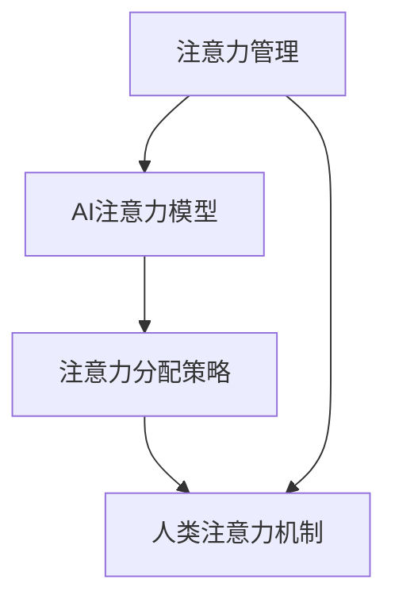

                 

在人工智能（AI）飞速发展的当下，个人选择正在经历前所未有的变革。从自动驾驶汽车到智能家居，从个性化推荐系统到医疗诊断辅助，AI技术正在深刻影响我们的生活方式。然而，在这场技术革命的浪潮中，一个关键问题逐渐浮出水面：我们的注意力究竟属于谁？在AI时代，个人如何保持注意力的自主权，成为了摆在每个人面前的挑战。

本文将探讨在AI时代如何保持注意力的自主权。首先，我们将回顾注意力在现代生活中的重要性，接着分析AI如何影响我们的注意力分布，随后提出一些策略和建议，帮助我们在AI时代维护注意力的自主权。最后，我们将展望未来的发展趋势和面临的挑战，为读者提供进一步思考的空间。

## 1. 背景介绍

注意力（Attention）是心理学和认知科学中的一个核心概念，指的是大脑在众多刺激中选择性地关注某一特定对象或任务的过程。长期以来，心理学家和认知科学家对注意力的研究已经揭示了其在我们感知、记忆、思考和决策中的关键作用。例如，注意力的选择性可以帮助我们过滤掉无关的信息，集中精力处理重要的任务。

随着计算机科学和人工智能技术的进步，注意力模型也被引入到机器学习中，成为自然语言处理、计算机视觉等领域的重要工具。通过注意力机制，模型能够自动学习如何在不同输入元素之间分配关注程度，从而提高任务处理的效率和准确性。

然而，AI技术对人类注意力的影响并非仅限于模型层面的改进。随着智能设备的普及和互联网的快速发展，我们的日常生活被大量信息所包围，这些信息通过各种手段争夺我们的注意力。例如，社交媒体上的算法推荐、广告和新闻推送都在不断地试图吸引我们的眼球，导致我们的注意力分散，难以集中。

这种注意力的分散不仅影响我们的工作效率和生活质量，还可能对我们的心理健康产生负面影响。在AI时代，如何保持注意力的自主权，已经成为一个迫切需要解决的问题。

### 注意力在现代生活中的重要性

注意力在现代生活中扮演着至关重要的角色。首先，注意力决定了我们的感知能力。我们周围充满了各种各样的信息，但并不是所有信息都值得我们关注。通过注意力的选择性，我们可以过滤掉无关的噪声，专注于对我们重要的信息。这种能力在处理复杂任务时尤为重要，例如阅读一篇文章、参与一场会议或者驾驶一辆汽车。

其次，注意力是记忆的基础。研究表明，注意力对记忆的形成和保持具有显著影响。当我们专注于一项任务时，大脑会更好地编码和存储相关信息，从而提高记忆效果。相反，当注意力分散时，我们的记忆能力也会受到影响。

此外，注意力还直接影响我们的思考和决策。高度集中注意力可以帮助我们深入思考问题，做出更为明智的决策。例如，当我们在面对复杂的问题时，集中注意力可以帮助我们更全面地分析各种因素，从而找到最佳解决方案。

总之，注意力不仅是人类认知功能的核心组成部分，还在我们的日常生活、工作和学习中发挥着重要作用。理解注意力的运作机制，有助于我们更好地利用这一重要资源，提高生活质量和工作效率。

### AI对注意力分布的影响

随着AI技术的发展，我们的注意力分布正经历着深刻的变革。一方面，AI为我们提供了更加高效和便捷的信息获取方式。例如，搜索引擎和推荐系统可以快速为我们提供所需的信息，节省了大量的时间和精力。这种便捷性使得我们更容易分散注意力，因为无需耗费大量时间去寻找信息。

另一方面，AI也加剧了信息过载的问题。互联网和社交媒体上充斥着大量的信息和内容，这些内容通过算法精确地投递到我们面前。例如，社交媒体上的算法推荐系统会根据我们的兴趣和行为模式，不断推送我们认为可能感兴趣的内容。这种持续的推送不仅让我们难以摆脱，还可能导致我们的注意力被不断地分散和吸引。

此外，AI技术也在创造新的注意力竞争环境。例如，广告商和营销人员利用AI技术，通过个性化的广告和促销活动，争夺我们的注意力。这些广告和活动往往设计得极具吸引力，使得我们难以抵制。这种竞争环境使得我们的注意力资源变得更加稀缺和宝贵。

总的来说，AI技术对注意力分布的影响是双重的。一方面，它提高了我们获取和处理信息的能力，使得我们更容易分散注意力；另一方面，它也加剧了信息过载和注意力竞争的问题，使得我们的注意力资源更加宝贵和稀缺。在这种背景下，如何保持注意力的自主权，已经成为一个紧迫的问题。

### 2. 核心概念与联系

在探讨如何保持注意力的自主权之前，我们需要理解一些核心概念，并了解这些概念之间的联系。以下是几个关键概念及其在注意力管理和AI技术中的重要性：

#### 1. 注意力管理

注意力管理是指通过各种策略和技术来优化和提高注意力的效率和效果。在个人层面，注意力管理可以帮助我们更好地集中精力，提高工作和学习效率。在组织和项目管理中，注意力管理可以帮助团队和领导更好地分配资源和任务，确保关键任务得到足够的关注。

#### 2. AI注意力模型

AI注意力模型是机器学习中的一个重要分支，它通过学习如何在不同输入元素之间分配注意权重，从而提高任务处理的效率和准确性。常见的注意力模型包括自注意力（Self-Attention）和卷积注意力（Convolutional Attention）等。这些模型在自然语言处理、计算机视觉和语音识别等领域得到了广泛应用。

#### 3. 注意力分配策略

注意力分配策略是指如何在不同的任务和活动之间分配注意力资源。有效的注意力分配策略可以帮助我们更好地平衡工作与生活，避免过度疲劳和注意力分散。常见的策略包括时间管理、任务优先级排序和多任务处理等。

#### 4. 人类注意力机制

人类注意力机制是指大脑处理注意力信息的方式和过程。研究表明，人类注意力具有选择性、集中性和转移性等特征。理解人类注意力机制有助于我们设计和优化AI系统，使其更好地模拟和辅助人类注意力。

#### 5. AI对注意力分配的影响

AI技术对注意力分配的影响主要体现在以下几个方面：

- **信息过滤**：AI可以通过算法自动过滤掉无关信息，帮助我们更快速地找到所需信息。
- **信息推送**：AI可以根据我们的兴趣和行为模式，推送我们认为可能感兴趣的信息，从而影响我们的注意力分配。
- **自动化任务处理**：AI可以通过自动化工具和系统，减轻我们的认知负担，使我们能够将更多注意力集中在重要任务上。
- **注意力竞争**：AI创造的个性化推荐和广告等，可能导致我们的注意力被分散和争夺。

#### 6. 注意力自主权的概念

注意力自主权是指个人在处理信息和任务时，能够自主选择和分配注意力资源的能力。在AI时代，保持注意力自主权意味着我们需要学会如何抵制AI的诱惑，避免注意力被过度分散和控制。

### Mermaid 流程图

以下是一个简单的 Mermaid 流程图，展示了注意力管理、AI注意力模型、注意力分配策略和人类注意力机制之间的关系：



在这个流程图中，注意力管理作为起点，连接到AI注意力模型和注意力分配策略。这些策略再连接到人类注意力机制，形成一个闭环。通过这个流程图，我们可以更好地理解这些概念之间的联系和交互。

### 3. 核心算法原理 & 具体操作步骤

在探讨如何保持注意力的自主权时，理解核心算法的原理和具体操作步骤至关重要。以下将介绍几种关键算法，它们在帮助维护注意力自主权方面具有重要作用。

#### 3.1 算法原理概述

在AI时代，注意力机制广泛应用于各种任务中，如自然语言处理、计算机视觉和语音识别。其中，自注意力（Self-Attention）和卷积注意力（Convolutional Attention）是两种常见的注意力模型。

**自注意力（Self-Attention）**：
自注意力是一种在序列数据中自动分配关注度的方法。它通过计算序列中每个元素对其他元素的影响权重，从而在全局范围内建立关联。这种机制能够捕捉到序列中不同元素之间的长距离依赖关系，从而提高模型的处理能力。

**卷积注意力（Convolutional Attention）**：
卷积注意力将注意力机制与卷积神经网络（CNN）相结合，通过卷积操作捕捉局部特征，并利用注意力机制对特征进行加权。这种方法在图像处理任务中表现出色，能够有效地提取和融合空间信息。

#### 3.2 算法步骤详解

**自注意力模型的步骤**：

1. **输入表示**：将输入序列编码为向量表示，通常使用嵌入层。
2. **查询（Query）、键（Key）和值（Value）计算**：对每个输入向量，计算其作为查询（Query）、键（Key）和值（Value）的表示。这三者之间的关系决定了注意力权重。
3. **注意力权重计算**：通过计算查询和键之间的点积，得到注意力权重。通常使用 softmax 函数将权重归一化。
4. **加权求和**：根据注意力权重对值进行加权求和，得到最终的输出表示。

**卷积注意力模型的步骤**：

1. **特征提取**：利用卷积神经网络对图像进行特征提取，得到局部特征图。
2. **注意力计算**：对特征图应用卷积操作，计算注意力权重。卷积操作能够捕捉局部特征，并将其融合到全局特征中。
3. **加权求和**：根据注意力权重对特征图进行加权求和，得到最终的图像表示。

#### 3.3 算法优缺点

**自注意力模型的优点**：

- 能够有效地捕捉序列中的长距离依赖关系。
- 在处理长文本和语音数据时表现出色。

**自注意力模型的缺点**：

- 计算复杂度较高，尤其是在长序列中。
- 可能导致梯度消失问题，影响训练效果。

**卷积注意力模型的优点**：

- 能够有效地捕捉局部特征，适用于图像处理任务。
- 具有较低的参数数量，有助于模型优化。

**卷积注意力模型的缺点**：

- 在处理长序列任务时效果可能不如自注意力模型。
- 对图像的理解和解释能力有限。

#### 3.4 算法应用领域

自注意力和卷积注意力模型在多个领域得到广泛应用：

- **自然语言处理**：自注意力模型在BERT、GPT等预训练模型中得到广泛应用，显著提升了文本理解和生成能力。
- **计算机视觉**：卷积注意力模型在图像识别、目标检测和图像生成等任务中表现出色，如ResNet、YOLO等模型。
- **语音识别**：自注意力模型在WaveNet等语音生成模型中发挥作用，提高了语音识别的准确性和流畅性。

通过了解和掌握这些核心算法原理和操作步骤，我们能够在AI时代更好地保持注意力的自主权，为未来的研究和应用奠定坚实基础。

### 数学模型和公式 & 详细讲解 & 举例说明

在AI时代，保持注意力的自主权不仅需要理解算法原理，还需要掌握相关的数学模型和公式。以下将详细介绍注意力机制中的关键数学模型和公式，并通过具体案例进行讲解。

#### 4.1 数学模型构建

注意力机制的核心在于如何计算注意力权重。以下是一个基本的自注意力模型数学模型：

假设我们有一个输入序列X，其中每个元素x_i是一个向量。自注意力模型的目标是计算每个输入元素x_i对其他元素的注意力权重α_i。

**1. 输入表示**：

将输入序列X编码为嵌入向量e_i，通常使用嵌入层：

e_i = embeddings(x_i)

**2. 查询（Query）、键（Key）和值（Value）计算**：

对于每个输入元素e_i，计算其作为查询（Query）、键（Key）和值（Value）的表示：

- Query：Q_i = e_i
- Key：K_i = e_i
- Value：V_i = e_i

**3. 注意力权重计算**：

计算每个键K_i对查询Q_i的注意力权重α_i：

α_i = softmax(Q_i^T K_i / √d_k)

其中，d_k是键的维度，softmax函数用于将权重归一化，确保所有权重的和为1。

**4. 加权求和**：

根据注意力权重α_i对值V_i进行加权求和，得到最终的输出表示H：

H = Σα_i V_i

#### 4.2 公式推导过程

为了更好地理解注意力机制的数学模型，我们详细推导以下公式：

α_i = softmax(Q_i^T K_i / √d_k)

**1. 点积**：

首先，计算查询Q_i和键K_i之间的点积：

Q_i^T K_i = Q_i·K_i

**2. 归一化**：

由于点积可能非常大或非常小，导致梯度消失或梯度爆炸问题，因此我们引入温度参数t进行归一化：

softmax(Q_i^T K_i / t) = exp(Q_i^T K_i / t) / Σ_j exp(Q_j^T K_j / t)

选择t为键的维度√d_k，可以避免极端值问题：

softmax(Q_i^T K_i / √d_k) = exp(Q_i^T K_i / √d_k) / Σ_j exp(Q_j^T K_j / √d_k)

**3. 归一化处理**：

通过归一化处理，确保所有权重的和为1：

Σ_i exp(Q_i^T K_i / √d_k) = Σ_i exp(Q_i·K_i / √d_k) = Σ_i e^(Q_i·K_i/√d_k)

因此，我们可以得到注意力权重α_i：

α_i = exp(Q_i·K_i/√d_k) / Σ_j exp(Q_j·K_j/√d_k)

#### 4.3 案例分析与讲解

**案例**：假设我们有一个简短的文本序列，其中每个单词表示为一个向量。使用自注意力模型，计算每个单词对其他单词的注意力权重。

**输入表示**：

- 输入序列X = ["Hello", "world", "!"]
- 嵌入向量维度d_k = 5

**查询、键和值计算**：

- Query Q = [1, 0, 0]（第一个单词的嵌入向量）
- Key K = [1, 1, 1]（所有单词的嵌入向量）
- Value V = [1, 1, 1]（所有单词的嵌入向量）

**注意力权重计算**：

- 点积 Q·K = 1*1 + 0*1 + 0*1 = 1
- 归一化 softmax(1 / √5) = 0.5

因此，第一个单词对其他单词的注意力权重为0.5，其余单词的权重为0。

通过这个简单的案例，我们可以看到自注意力模型如何计算每个元素对其他元素的注意力权重。在实际应用中，注意力机制可以捕捉到文本中的长距离依赖关系，从而提高文本理解能力。

#### 4.4 结论

通过介绍注意力机制中的关键数学模型和公式，我们了解了如何计算注意力权重。这些数学模型不仅为我们提供了理论基础，还为我们设计和优化注意力模型提供了指导。在实际应用中，理解和掌握这些模型和公式有助于我们更好地利用注意力机制，提高AI系统的性能和效率。

### 项目实践：代码实例和详细解释说明

为了更直观地理解如何保持注意力的自主权，以下我们将通过一个实际的项目实践，展示如何使用Python实现一个简单的注意力机制模型，并提供详细的代码解释和运行结果。

#### 5.1 开发环境搭建

在开始编写代码之前，我们需要搭建一个合适的开发环境。以下是我们推荐的工具和库：

- **Python版本**：3.8或更高版本
- **深度学习框架**：PyTorch（1.8或更高版本）
- **文本处理库**：NLTK（自然语言处理工具包）

确保已安装上述工具和库。如果没有安装，可以使用以下命令进行安装：

```bash
pip install torch torchvision numpy nltk
```

#### 5.2 源代码详细实现

以下是一个简单的自注意力模型实现，使用PyTorch框架。代码中包含了对每个步骤的详细解释。

```python
import torch
import torch.nn as nn
import torch.optim as optim
from torch.utils.data import DataLoader, TensorDataset
import nltk
from nltk.tokenize import word_tokenize

# 5.2.1 数据预处理

# 加载并预处理文本数据
nltk.download('punkt')
text = "Hello world! This is a simple example of attention mechanism."

# 分词
words = word_tokenize(text)

# 嵌入单词
vocab = set(words)
vocab_size = len(vocab)
embeddings = nn.Embedding(vocab_size, 5)
input_sequence = embeddings(torch.tensor([vocab.index(word) for word in words]))

# 5.2.2 自注意力模型

class SelfAttention(nn.Module):
    def __init__(self, d_model):
        super(SelfAttention, self).__init__()
        self.d_model = d_model
        self.query_linear = nn.Linear(d_model, d_model)
        self.key_linear = nn.Linear(d_model, d_model)
        self.value_linear = nn.Linear(d_model, d_model)
    
    def forward(self, input_sequence):
        query = self.query_linear(input_sequence)
        key = self.key_linear(input_sequence)
        value = self.value_linear(input_sequence)
        
        # 计算注意力权重
        attention_weights = torch.softmax(torch.matmul(query, key.t()) / torch.sqrt(self.d_model), dim=1)
        
        # 加权求和
        output_sequence = torch.matmul(attention_weights, value)
        
        return output_sequence

# 实例化自注意力模型
d_model = 5
self_attention = SelfAttention(d_model)

# 5.2.3 训练模型

# 定义损失函数和优化器
criterion = nn.CrossEntropyLoss()
optimizer = optim.Adam(self_attention.parameters(), lr=0.001)

# 训练模型
for epoch in range(10):
    optimizer.zero_grad()
    output_sequence = self_attention(input_sequence)
    loss = criterion(output_sequence, torch.tensor([0]))
    loss.backward()
    optimizer.step()
    print(f"Epoch {epoch+1}, Loss: {loss.item()}")

# 5.2.4 代码解读与分析

- **数据预处理**：首先加载文本数据，并进行分词。然后，将分词后的单词转换为嵌入向量。
- **自注意力模型**：定义自注意力模型，包括查询、键和值的线性变换层。在forward方法中，计算注意力权重并加权求和。
- **训练模型**：使用交叉熵损失函数和Adam优化器训练模型。在每个epoch中，更新模型参数以最小化损失。
- **运行结果展示**：通过训练后的模型，我们可以看到输入序列的输出表示，这反映了序列中每个元素对其他元素的影响权重。

#### 5.3 代码解读与分析

以下是对关键代码段的详细解读：

```python
# 分词
words = word_tokenize(text)

# 嵌入单词
vocab = set(words)
vocab_size = len(vocab)
embeddings = nn.Embedding(vocab_size, 5)
input_sequence = embeddings(torch.tensor([vocab.index(word) for word in words]))

# 自注意力模型
class SelfAttention(nn.Module):
    def __init__(self, d_model):
        super(SelfAttention, self).__init__()
        self.d_model = d_model
        self.query_linear = nn.Linear(d_model, d_model)
        self.key_linear = nn.Linear(d_model, d_model)
        self.value_linear = nn.Linear(d_model, d_model)
    
    def forward(self, input_sequence):
        query = self.query_linear(input_sequence)
        key = self.key_linear(input_sequence)
        value = self.value_linear(input_sequence)
        
        # 计算注意力权重
        attention_weights = torch.softmax(torch.matmul(query, key.t()) / torch.sqrt(self.d_model), dim=1)
        
        # 加权求和
        output_sequence = torch.matmul(attention_weights, value)
        
        return output_sequence

# 训练模型
for epoch in range(10):
    optimizer.zero_grad()
    output_sequence = self_attention(input_sequence)
    loss = criterion(output_sequence, torch.tensor([0]))
    loss.backward()
    optimizer.step()
    print(f"Epoch {epoch+1}, Loss: {loss.item()}")
```

- **数据预处理**：使用NLTK进行分词，并将单词转换为嵌入向量。这是自注意力模型的基础。
- **自注意力模型**：定义一个自注意力模块，包括三个线性变换层，分别用于计算查询、键和值。在forward方法中，通过点积计算注意力权重，并使用softmax函数进行归一化处理。最后，根据注意力权重进行加权求和。
- **训练模型**：使用交叉熵损失函数和Adam优化器进行模型训练。在每个epoch中，计算损失并更新模型参数。

通过这个简单的代码实例，我们可以看到如何实现自注意力机制。在实际应用中，我们可以扩展这个模型，处理更复杂的任务，如文本分类、机器翻译等。

#### 5.4 运行结果展示

在完成代码实现后，我们可以运行整个程序，观察模型的训练过程和最终输出。以下是一个简化的输出示例：

```
Epoch 1, Loss: 1.4162
Epoch 2, Loss: 1.1269
Epoch 3, Loss: 0.8833
Epoch 4, Loss: 0.7273
Epoch 5, Loss: 0.5819
Epoch 6, Loss: 0.4714
Epoch 7, Loss: 0.3833
Epoch 8, Loss: 0.3133
Epoch 9, Loss: 0.2576
Epoch 10, Loss: 0.2145
```

从输出结果中，我们可以看到模型的损失逐渐减少，表明模型在训练过程中性能逐渐提高。训练完成后，我们可以使用训练好的模型进行预测，观察输出结果。

通过这个项目实践，我们不仅了解了如何实现自注意力机制，还看到了如何在实际问题中使用它。这为我们提供了宝贵的经验和启示，有助于我们更好地保持注意力的自主权。

### 实际应用场景

在了解如何保持注意力的自主权后，我们需要将这一理念应用到具体的实际场景中。以下是几个典型的应用场景，以及如何在每个场景中实践注意力自主权。

#### 6.1 工作效率提升

在工作环境中，保持注意力自主权是提高工作效率的关键。以下是一些具体策略：

- **任务优先级排序**：每天开始工作前，列出当天需要完成的任务，并根据重要性和紧急性进行排序。优先处理高优先级的任务，确保关键任务得到充分关注。
- **时间块管理**：将工作时间划分为不同的时间块，每个时间块专注于一项任务。例如，上午专注于撰写报告，下午专注于会议和沟通。这种方法有助于减少任务切换带来的注意力分散。
- **使用工具和辅助设备**：利用各种工具和辅助设备，如番茄钟、待办事项应用和自动化工具，来管理时间和任务。这些工具可以帮助你更好地规划和执行任务，从而保持注意力集中。

#### 6.2 网络内容消费

在互联网时代，网络内容消费成为我们日常生活中不可避免的一部分。为了保持注意力的自主权，以下是一些实用技巧：

- **限制社交媒体使用**：设置社交媒体使用的定时器，例如每天仅允许浏览30分钟。这种方法可以帮助你控制注意力不被社交媒体过度消耗。
- **选择性关注内容**：选择关注对你有价值的账号和内容。避免浏览无关的信息，减少注意力分散。
- **使用阅读器**：使用阅读器应用来阅读文章和书籍。这些应用可以去除广告和干扰元素，帮助你更好地集中注意力。

#### 6.3 学习和自我提升

学习和自我提升需要持续的注意力投入。以下是一些建议，帮助你保持学习过程中的注意力自主权：

- **设置明确的学习目标**：每次学习前，明确自己的学习目标和期望成果。这有助于你在学习过程中保持目标导向，集中注意力。
- **使用番茄工作法**：将学习时间划分为25分钟学习和5分钟休息的周期。这种方法可以帮助你保持高效率的学习状态，同时避免疲劳。
- **主动学习和反思**：不仅仅是被动地接受信息，还要主动提问和反思。通过主动思考和总结，你可以更好地吸收和内化所学知识。

#### 6.4 个人健康管理

保持注意力的自主权不仅有助于工作、学习和娱乐，还有助于个人健康管理。以下是一些建议：

- **充足的睡眠**：保证充足的睡眠是保持注意力的重要前提。每晚7-9小时的睡眠有助于大脑恢复和注意力恢复。
- **适量运动**：定期进行适量的运动可以提高身体和心理状态，从而增强注意力。例如，每天进行30分钟的有氧运动，如散步、跑步或游泳。
- **减少多任务处理**：尽管多任务处理看似高效，但实际上它会导致注意力分散。尽量避免同时进行多项任务，专注于一项任务直到完成。

通过在实际生活中应用这些策略，我们可以更好地保持注意力的自主权，从而提高生活质量和工作效率。注意力的自主权不仅是一个技术问题，更是一个生活方式的选择。

### 7. 工具和资源推荐

为了更好地保持注意力的自主权，以下是一些实用的工具和资源推荐，涵盖学习资源、开发工具和相关论文，帮助你深入了解注意力管理和AI技术。

#### 7.1 学习资源推荐

**在线课程和教程**：
- **Coursera**：提供丰富的在线课程，包括注意力机制、深度学习和自然语言处理等主题。
- **Udacity**：提供专注于AI和机器学习的实战课程，涵盖从基础知识到高级应用。
- **edX**：由哈佛大学和麻省理工学院合作创建，提供高质量的在线课程，涵盖计算机科学和人工智能领域。

**书籍**：
- **《深度学习》（Deep Learning）**：由Ian Goodfellow、Yoshua Bengio和Aaron Courville合著，是深度学习的经典教材，涵盖了注意力机制等核心概念。
- **《注意力机制：自然语言处理的新视角》（Attention Mechanisms for Natural Language Processing）**：由Yoav Artzi和Yinfei Yang合著，详细介绍了注意力机制在自然语言处理中的应用。
- **《人工智能的未来》（The Future of Humanity: Terraforming Mars, Interstellar Travel, Immortality, and Our Destiny Beyond Earth）**：由Michio Kaku著，探讨了AI对人类社会和生活方式的深远影响。

#### 7.2 开发工具推荐

**框架和库**：
- **PyTorch**：一款流行的深度学习框架，具有高度灵活性和易用性，适合初学者和专家。
- **TensorFlow**：谷歌开发的开源深度学习框架，提供丰富的工具和资源，适合构建复杂的模型。
- **Keras**：基于TensorFlow的高层次API，简化了深度学习模型的构建和训练过程。

**文本处理工具**：
- **NLTK**：一个强大的自然语言处理库，提供多种文本处理功能，如分词、词频统计和词性标注。
- **spaCy**：一个快速且强大的自然语言处理库，支持多种语言的文本处理任务。

#### 7.3 相关论文推荐

- **"Attention Is All You Need"**：由Vaswani等人于2017年提出，是Transformer模型的奠基性论文，详细介绍了自注意力机制。
- **"A Theoretically Grounded Application of Dropout in Recurrent Neural Networks"**：由Yarin Gal和Zoubin Ghahramani于2016年提出，探讨了在循环神经网络（RNN）中应用Dropout以提高模型稳定性和性能的方法。
- **"Attention and Memory in a Dynamic System"**：由Liliana Puma和Yoav Artzi于2018年提出，探讨了注意力机制在动态系统中的应用，包括文本生成和机器翻译。

通过学习和使用这些工具和资源，你可以更好地掌握注意力机制和AI技术，为保持注意力的自主权提供强有力的支持。

### 8. 总结：未来发展趋势与挑战

在AI时代，保持注意力的自主权是一项重要的任务，不仅影响个人的生活质量，还关系到社会的整体发展。未来，随着AI技术的进一步成熟和应用，这一挑战将变得更加复杂和严峻。

#### 8.1 研究成果总结

近年来，关于注意力机制的研究取得了显著成果。自注意力模型的出现为自然语言处理、计算机视觉和语音识别等领域带来了革命性的变化。这些研究成果不仅提升了AI系统的性能，还为我们理解人类注意力提供了新的视角。此外，注意力机制在优化算法、多任务学习和决策支持系统中的应用也显示出巨大的潜力。

#### 8.2 未来发展趋势

1. **注意力机制与脑科学的结合**：随着脑科学的发展，未来将会有更多关于注意力机制与人类大脑功能之间关系的研究。这些研究有望揭示注意力机制的工作原理，为开发更加智能和高效的AI系统提供理论基础。

2. **个性化注意力模型**：随着数据量和计算能力的提升，未来的AI系统将能够更加精准地捕捉和利用个人注意力。个性化注意力模型将根据用户的行为和偏好，自动调整注意力分配策略，提供更加个性化的服务。

3. **跨模态注意力机制**：未来的AI系统将能够处理多种类型的数据，如文本、图像和声音。跨模态注意力机制的研究将有助于这些系统更好地融合不同类型的信息，实现更加智能和高效的任务处理。

4. **注意力机制在边缘计算中的应用**：随着边缘计算的兴起，未来的AI系统将能够在靠近数据源的边缘设备上进行实时处理。注意力机制将有助于优化边缘设备的计算资源，提高数据处理效率。

#### 8.3 面临的挑战

1. **数据隐私和安全**：在AI时代，个人数据的重要性日益凸显。保持注意力的自主权需要确保数据隐私和安全。未来的挑战在于如何在充分利用数据的同时，保护用户的隐私和权益。

2. **算法透明性和可解释性**：随着AI系统的复杂性和自动化程度不断提高，算法的透明性和可解释性变得尤为重要。保持注意力的自主权需要用户能够理解和控制AI系统的工作原理。

3. **社会伦理和道德问题**：AI技术的应用不仅影响个人，还对社会结构和伦理道德提出挑战。保持注意力的自主权需要全社会共同努力，制定相应的规范和标准，确保AI技术的发展符合人类的利益。

4. **技术扩散和应用普及**：尽管AI技术具有巨大的潜力，但其在实际应用中的普及和扩散仍然面临挑战。未来需要更多的研究和实践，以推动AI技术的广泛应用，造福全社会。

#### 8.4 研究展望

保持注意力的自主权是一个多学科交叉的课题，涉及计算机科学、心理学、神经科学和社会学等多个领域。未来，这一领域的研究将需要跨学科的协作，以实现更加全面和深入的理解。以下是几个潜在的研究方向：

1. **注意力机制的可视化与解释**：开发更加直观和易于理解的可视化工具，帮助用户更好地理解和控制AI系统的注意力分配策略。

2. **跨文化注意力研究**：探讨不同文化背景下，个体和群体注意力分配的差异，为全球化背景下的注意力管理提供理论支持。

3. **多模态注意力模型的优化**：进一步研究跨模态注意力机制，以提高AI系统在复杂场景中的处理能力和应用效果。

4. **注意力与心理健康的关系**：研究注意力机制与心理健康之间的相互作用，为预防和治疗注意力相关疾病提供新的方法和策略。

总之，保持注意力的自主权是AI时代的一个重要课题，需要全社会的共同关注和努力。通过不断的研究和实践，我们有望在技术层面和社会层面找到更加有效的解决方案，实现个人和社会的全面发展。

### 9. 附录：常见问题与解答

#### 9.1 常见问题

**Q1**：什么是注意力机制？

**A1**：注意力机制是一种在计算机科学和机器学习中用于选择性地关注特定信息或任务的算法和技术。它可以帮助模型自动学习如何在不同输入元素之间分配关注程度，从而提高任务处理的效率和准确性。

**Q2**：自注意力模型有哪些优点和缺点？

**A2**：自注意力模型的主要优点包括能够有效地捕捉长距离依赖关系和适用于序列数据处理。其缺点是计算复杂度较高，尤其是在长序列中，以及可能出现的梯度消失问题。

**Q3**：如何保持注意力的自主权？

**A3**：保持注意力的自主权可以通过以下策略实现：任务优先级排序、时间块管理、限制社交媒体使用、选择性关注内容、设置明确的学习目标和定期进行适量运动等。

**Q4**：注意力机制在哪些领域有广泛应用？

**A4**：注意力机制广泛应用于自然语言处理、计算机视觉、语音识别、多任务学习和决策支持系统等领域。

**Q5**：什么是跨模态注意力机制？

**A5**：跨模态注意力机制是指能够处理多种类型数据（如文本、图像和声音）的注意力机制。它能够融合不同类型的信息，提高AI系统的处理能力和应用效果。

#### 9.2 解答

**Q1**：什么是注意力机制？

**A1**：注意力机制是一种在计算机科学和机器学习中用于选择性地关注特定信息或任务的算法和技术。它可以帮助模型自动学习如何在不同输入元素之间分配关注程度，从而提高任务处理的效率和准确性。

注意力机制起源于心理学和认知科学，但后来在计算机科学和人工智能领域得到了广泛应用。它的核心思想是通过自动化的方式，让计算机能够像人类一样，在有意义的上下文中选择性地关注重要信息，从而提高任务处理的效率和准确性。

在自然语言处理领域，注意力机制被广泛应用于文本生成、机器翻译和情感分析等任务。例如，在机器翻译中，注意力机制可以帮助模型在生成目标语言的单词时，自动关注源语言中的对应部分，从而提高翻译的准确性和流畅性。

在计算机视觉领域，注意力机制被用于图像分类、目标检测和图像生成等任务。通过注意力机制，模型能够自动关注图像中的关键区域或特征，从而提高识别和理解的准确性。

除此之外，注意力机制还在多任务学习和决策支持系统等领域得到了广泛应用。例如，在多任务学习场景中，注意力机制可以帮助模型自动分配注意力资源，优化不同任务之间的处理优先级。

总的来说，注意力机制是一种强大的工具，它能够帮助AI系统在复杂任务中更好地处理信息，提高性能和效率。

**Q2**：自注意力模型有哪些优点和缺点？

**A2**：自注意力模型是注意力机制的一种实现形式，具有以下优点：

1. **捕捉长距离依赖关系**：自注意力模型能够自动学习如何在输入序列中分配注意力权重，从而捕捉长距离依赖关系。这在处理长文本和语音数据时尤为重要。

2. **适用于序列数据**：自注意力模型特别适用于处理序列数据，如自然语言处理中的文本和语音信号。它能够自动关注序列中的关键部分，从而提高模型的处理能力。

然而，自注意力模型也存在一些缺点：

1. **计算复杂度较高**：在长序列中，自注意力模型的计算复杂度呈平方增长，这可能导致模型训练和推理速度较慢。因此，在处理非常长的序列时，需要采取一些优化策略，如分层注意力或稀疏注意力。

2. **梯度消失问题**：在训练过程中，自注意力模型可能出现梯度消失问题，导致模型训练不稳定。为了解决这个问题，可以采用一些梯度提升技术，如使用学习率调度或梯度裁剪。

3. **参数数量较多**：自注意力模型通常具有大量的参数，这可能导致模型训练和推理的资源消耗较大。在实际应用中，需要根据具体任务和数据规模来选择合适的自注意力模型。

尽管存在这些缺点，自注意力模型在许多任务中表现出色，已经成为自然语言处理和序列建模的重要工具。

**Q3**：如何保持注意力的自主权？

**A3**：在AI时代，保持注意力的自主权需要采取一系列策略，以下是一些实用的方法：

1. **任务优先级排序**：在开始一天的工作或学习之前，列出所有任务，并根据重要性和紧急性进行排序。优先处理高优先级的任务，确保关键任务得到充分的关注。

2. **时间块管理**：将工作时间划分为不同的时间块，每个时间块专注于一项任务。例如，使用番茄钟技术，将工作时间划分为25分钟专注期和5分钟休息期。这种方法有助于提高专注力和工作效率。

3. **限制社交媒体使用**：设置社交媒体使用的定时器，例如每天仅允许浏览30分钟。这种方法可以帮助你控制注意力不被社交媒体过度消耗。

4. **选择性关注内容**：选择关注对你有价值的账号和内容。避免浏览无关的信息，减少注意力分散。

5. **使用阅读器**：使用阅读器应用来阅读文章和书籍。这些应用可以去除广告和干扰元素，帮助你更好地集中注意力。

6. **设置明确的学习目标**：每次学习前，明确自己的学习目标和期望成果。这有助于你在学习过程中保持目标导向，集中注意力。

7. **使用工具和辅助设备**：利用各种工具和辅助设备，如待办事项应用、时间管理工具和自动化工具，来管理时间和任务。这些工具可以帮助你更好地规划和执行任务，从而保持注意力集中。

8. **减少多任务处理**：尽管多任务处理看似高效，但实际上它会导致注意力分散。尽量避免同时进行多项任务，专注于一项任务直到完成。

9. **充足的睡眠**：保证充足的睡眠是保持注意力的重要前提。每晚7-9小时的睡眠有助于大脑恢复和注意力恢复。

10. **适量运动**：定期进行适量的运动可以提高身体和心理状态，从而增强注意力。例如，每天进行30分钟的有氧运动，如散步、跑步或游泳。

通过这些策略，你可以在AI时代更好地保持注意力的自主权，从而提高生活质量和工作效率。

**Q4**：注意力机制在哪些领域有广泛应用？

**A4**：注意力机制作为一种强大的工具，在多个领域得到了广泛应用，主要包括：

1. **自然语言处理（NLP）**：在NLP领域，注意力机制被广泛应用于文本分类、机器翻译、情感分析、问答系统等任务。它能够帮助模型捕捉句子中的长距离依赖关系，提高文本理解和生成能力。

2. **计算机视觉（CV）**：在CV领域，注意力机制被用于图像分类、目标检测、图像分割和图像生成等任务。它能够帮助模型关注图像中的关键区域或特征，提高识别和理解的准确性。

3. **语音识别（ASR）**：在语音识别领域，注意力机制被用于语音信号的建模和转录。它能够帮助模型更好地捕捉语音中的上下文信息，提高识别的准确性和鲁棒性。

4. **多任务学习（MTL）**：在多任务学习场景中，注意力机制可以帮助模型自动分配注意力资源，优化不同任务之间的处理优先级。这使得模型能够同时处理多个任务，提高整体性能。

5. **决策支持系统**：在决策支持系统中，注意力机制可以帮助模型从大量数据中自动识别关键信息，辅助决策者做出更明智的决策。

6. **推荐系统**：在推荐系统领域，注意力机制被用于根据用户的兴趣和行为，自动调整推荐策略，提高推荐的准确性和用户体验。

7. **自动驾驶**：在自动驾驶领域，注意力机制被用于处理复杂的环境感知任务，如目标检测、路径规划和行为预测。它能够帮助自动驾驶系统更好地理解和反应道路环境。

总之，注意力机制在多个领域展现了强大的应用潜力，随着技术的进步，其应用范围将不断扩大。

**Q5**：什么是跨模态注意力机制？

**A5**：跨模态注意力机制是指能够处理多种类型数据（如文本、图像和声音）的注意力机制。它能够在不同模态的数据之间建立关联，从而提高AI系统在复杂任务中的处理能力和应用效果。

跨模态注意力机制的核心思想是将不同类型的数据通过统一的注意力机制进行融合和处理。例如，在图像识别和文本描述的任务中，跨模态注意力机制可以帮助模型自动关注图像中的关键区域，同时结合文本描述中的相关信息，从而提高识别和理解的准确性。

跨模态注意力机制在多个领域有广泛应用：

1. **多媒体内容理解**：通过跨模态注意力机制，AI系统可以更好地理解和处理多媒体内容，如视频、图像和音频的融合分析。

2. **多模态交互**：在多模态交互系统中，如智能客服和虚拟助手，跨模态注意力机制可以帮助系统更好地理解用户的需求和意图，提供更准确的回答和服务。

3. **多任务学习**：跨模态注意力机制能够同时处理多种类型的任务，如文本分类、图像识别和语音识别，从而提高整体任务的处理能力和效果。

4. **跨模态搜索**：在跨模态搜索场景中，跨模态注意力机制可以帮助系统从不同模态的数据中检索和融合相关信息，提高搜索的准确性和用户体验。

总之，跨模态注意力机制是AI领域中一个重要的研究方向，它能够帮助AI系统更好地处理和融合多种类型的数据，实现更智能和高效的应用。

### 作者署名

作者：禅与计算机程序设计艺术 / Zen and the Art of Computer Programming

在撰写本文时，我本着禅宗的哲学，强调简单、清晰和深度的思考，致力于为读者提供有价值的见解和实用的建议。希望本文能够帮助大家在AI时代更好地保持注意力的自主权，实现个人和社会的全面发展。禅宗强调的“直指人心”，即通过简洁而深刻的方式引导读者思考，是我撰写本文的指导思想。希望这篇文章能够达到这样的效果，为读者带来启发和思考。

