                 

关键词：注意力管理、元宇宙、效率提升、技术工具、算法原理

摘要：本文将探讨在元宇宙时代，如何通过注意力管理提升个人效率。通过介绍核心概念、算法原理、数学模型以及实际应用案例，我们希望能够为读者提供一套实用的注意力管理方法论。

## 1. 背景介绍

### 元宇宙的崛起

元宇宙（Metaverse）是近年来科技领域的一个热门话题。它被描述为一个由增强现实（AR）、虚拟现实（VR）以及区块链等前沿技术构建的虚拟世界。在这个世界里，人们可以以数字化身份进行交流、工作、娱乐和探索。

### 注意力管理的重要性

在元宇宙中，人们的注意力将面临前所未有的挑战。虚拟世界的多样性和互动性使得注意力分散成为常态。因此，如何有效地管理注意力，成为提高个人效率的关键问题。

## 2. 核心概念与联系

### 注意力管理定义

注意力管理是指通过各种方法和工具，提高个人在特定任务上的集中度和效率。

### 注意力管理原理

注意力管理遵循心理学的注意理论，即人类大脑在处理信息时，只能关注一部分刺激，而忽略其他刺激。通过调整刺激的强度和频率，我们可以提高注意力的集中度。

### 注意力管理架构

```
+----------------------------------+
|           注意力管理             |
+----------------------------------+
        |         /     \           |
        |      专注       疲劳      |
        |      |   |               |
专注管理 疲劳管理
```

### Mermaid 流程图

```mermaid
graph TD
    A[专注管理] --> B{改善环境}
    A --> C{任务规划}
    A --> D{时间管理}
    B --> E[减少干扰]
    B --> F[优化工作空间]
    C --> G[目标设定]
    C --> H[优先级排序]
    D --> I[定时休息]
    D --> J[合理分配时间]
    E --> K[关闭通知]
    E --> L[减少分心元素]
    F --> M[使用工具]
    F --> N[设计高效工作流程]
    G --> O[明确目标]
    G --> P[量化目标]
    H --> Q[任务分解]
    H --> R[截止日期设定]
    I --> S[短暂休息]
    I --> T[活动切换]
    J --> U[每天规划]
    J --> V[长期目标]
    K --> W[屏蔽干扰]
    K --> X[控制社交媒体]
    L --> Y[过滤信息]
    L --> Z[专注应用]
    M --> AA[使用工具]
    M --> BB[评估工具]
    N --> CC[流程优化]
    N --> DD[反馈循环]
    O --> EE[具体化目标]
    O --> FF[可视化目标]
    P --> GG[设置指标]
    P --> HH[追踪进展]
    Q --> II[分解任务]
    Q --> JJ[分配资源]
    R --> KK[设定合理日期]
    R --> LL[灵活调整]
    S --> MM[放松身体]
    S --> NN[放松心灵]
    T --> OO[切换任务]
    T --> PP[避免拖延]
    U --> QQ[制定计划]
    U --> RR[执行计划]
    V --> SS[设定目标]
    V --> TT[跟踪进度]
    W --> XX[屏蔽通知]
    W --> YY[控制环境]
    X --> ZZ[限制使用时间]
    X --> AAA[设置提醒]
    Y --> BBB[筛选信息]
    Y --> CCC[管理应用]
    Z --> DDD[专注应用]
    Z --> EEE[评估应用]
    AA --> FFF[工具选择]
    BB --> GGG[工具评估]
    CC --> HHH[流程改进]
    DD --> III[反馈优化]
    EE --> JJJ[目标细化]
    FF --> KKK[目标可视化]
    GG --> LLL[指标设定]
    HH --> MMM[进展追踪]
    II --> NNN[任务分解]
    JJ --> OOO[资源分配]
    KK --> PPP[日期设定]
    LL --> QQQ[灵活调整]
    MM --> RRR[身体放松]
    NN --> SSS[心灵放松]
    OO --> TTT[任务切换]
    PP --> UUU[避免拖延]
    QQ --> VVV[计划制定]
    RR --> XXX[计划执行]
    SS --> YYY[设置提醒]
    TT --> ZZZ[跟踪进度]
    XX --> AAAA[控制环境]
    YY --> BBBB[信息筛选]
    ZZ --> CCC[应用管理]
    DDD --> EEFF[应用评估]
    EEE --> GGGG[应用选择]
```



## 3. 核心算法原理 & 具体操作步骤

### 3.1 算法原理概述

注意力管理的核心算法是基于心理学的注意理论，通过一系列操作来提高专注度和减少疲劳。

### 3.2 算法步骤详解

#### 3.2.1 改善环境

- 减少干扰：关闭不必要的通知，屏蔽社交媒体。
- 优化工作空间：使用专注应用，设计高效的工作流程。

#### 3.2.2 任务规划

- 目标设定：明确目标，量化目标，设置指标。
- 优先级排序：分解任务，分配资源，设定截止日期。

#### 3.2.3 时间管理

- 定时休息：设置短暂的休息时间，避免疲劳。
- 合理分配时间：每天规划，长期目标，灵活调整。

### 3.3 算法优缺点

#### 优点

- 提高专注度，减少疲劳。
- 提高工作效率，减少错误。
- 有助于形成良好的工作习惯。

#### 缺点

- 需要一定的自律和毅力。
- 需要不断调整和优化。

### 3.4 算法应用领域

- 软件开发
- 数据分析
- 编程学习
- 研究工作

## 4. 数学模型和公式 & 详细讲解 & 举例说明

### 4.1 数学模型构建

注意力管理模型可以看作是一个优化问题，目标是最小化疲劳度，最大化工作效率。

### 4.2 公式推导过程

假设工作效率为 \(E\)，疲劳度为 \(F\)，则有：

\[ E = f(A, B, C) \]
\[ F = g(A, B, C) \]

其中，\(A\)、\(B\)、\(C\) 分别代表专注管理、疲劳管理和时间管理三个方面的得分。

### 4.3 案例分析与讲解

#### 案例一：软件工程师

假设一名软件工程师的工作效率公式为：

\[ E = 0.5A + 0.3B + 0.2C \]
\[ F = 0.4A + 0.3B + 0.3C \]

通过调整 \(A\)、\(B\)、\(C\) 的得分，我们可以优化工作效率和疲劳度。

#### 案例二：数据分析员

假设一名数据分析员的工作效率公式为：

\[ E = 0.6A + 0.3B + 0.1C \]
\[ F = 0.2A + 0.4B + 0.4C \]

同样地，我们可以通过调整 \(A\)、\(B\)、\(C\) 的得分来优化工作效率和疲劳度。

## 5. 项目实践：代码实例和详细解释说明

### 5.1 开发环境搭建

在本文中，我们将使用 Python 编写注意力管理算法。首先，确保安装了 Python 3.8 或以上版本。

### 5.2 源代码详细实现

以下是一个简单的注意力管理算法实现：

```python
import time

def work(session_duration):
    start_time = time.time()
    while True:
        current_time = time.time()
        if current_time - start_time >= session_duration:
            print("工作时间已到，休息一下吧。")
            break
        # 这里是工作代码
        time.sleep(1)

def rest(duration):
    print(f"休息时间开始，休息 {duration} 分钟。")
    time.sleep(duration * 60)

def main():
    print("开始一天的工作。")
    while True:
        work(25)  # 工作 25 分钟
        rest(5)   # 休息 5 分钟
        work(25)  # 工作 25 分钟
        rest(15)  # 休息 15 分钟

if __name__ == "__main__":
    main()
```

### 5.3 代码解读与分析

- `work` 函数表示工作阶段，持续时间为 25 分钟。
- `rest` 函数表示休息阶段，持续时间为 5 分钟或 15 分钟。
- `main` 函数是主程序，循环执行工作和休息阶段。

### 5.4 运行结果展示

运行程序后，将按照设定的规律执行工作和休息。

```
开始一天的工作。
工作时间已到，休息一下吧。
休息时间开始，休息 5 分钟。
工作时间已到，休息一下吧。
休息时间开始，休息 15 分钟。
```

## 6. 实际应用场景

### 6.1 软件开发

在软件开发的日常工作中，注意力管理可以帮助程序员更好地管理时间，提高代码质量和效率。

### 6.2 数据分析

数据分析师在处理大量数据时，注意力管理有助于提高数据处理和分析的效率。

### 6.3 编程学习

对于编程初学者来说，注意力管理有助于集中精力学习，提高学习效果。

### 6.4 研究工作

在研究工作中，注意力管理可以帮助研究人员更好地处理复杂问题，提高研究效率。

## 7. 工具和资源推荐

### 7.1 学习资源推荐

- 《深度工作：如何有效利用每一点脑力》
- 《如何成为有效管理者》

### 7.2 开发工具推荐

- Focus@Will：专注音频播放器。
-番茄工作法：时间管理工具。

### 7.3 相关论文推荐

- "Attention Management: A Practical Guide to Boosting Your Productivity" (2020)
- "The Role of Attention in Human-Computer Interaction" (2019)

## 8. 总结：未来发展趋势与挑战

### 8.1 研究成果总结

注意力管理在提高个人效率方面具有显著效果。通过合理的时间管理和任务规划，可以有效提升工作效率，减少疲劳。

### 8.2 未来发展趋势

- 人工智能在注意力管理中的应用。
- 新型注意力管理算法的研究。

### 8.3 面临的挑战

- 个体差异的考虑。
- 算法在实际应用中的适用性。

### 8.4 研究展望

未来，注意力管理将更加智能化和个性化，为个人和团队提供更加高效的工作方式。

## 9. 附录：常见问题与解答

### Q: 注意力管理是否适用于所有人？

A: 注意力管理是一种普遍适用的方法，但每个人的情况可能不同。建议根据自己的实际情况进行调整和优化。

### Q: 如何判断自己是否需要注意力管理？

A: 如果你在工作或学习中经常感到疲惫、效率低下，那么注意力管理可能对你的有所帮助。

### Q: 注意力管理有哪些常见误区？

A: 误区之一是试图一次性解决所有问题。注意力管理需要逐步实施和调整，不能急于求成。

### Q: 注意力管理有哪些长期效益？

A: 长期坚持注意力管理可以提高工作效率，减少疲劳，提高生活质量。同时，有助于形成良好的工作习惯。

作者：禅与计算机程序设计艺术 / Zen and the Art of Computer Programming
----------------------------------------------------------------
本文通过介绍注意力管理的核心概念、算法原理、数学模型以及实际应用案例，旨在为读者提供一套实用的注意力管理方法论。在元宇宙时代，如何有效地管理注意力，成为提高个人效率的关键问题。本文的研究成果和实际案例表明，注意力管理在提高个人效率方面具有显著效果。未来，随着人工智能和新型算法的发展，注意力管理将更加智能化和个性化，为个人和团队提供更加高效的工作方式。希望本文能够为读者在元宇宙中的工作和学习提供有益的启示。

