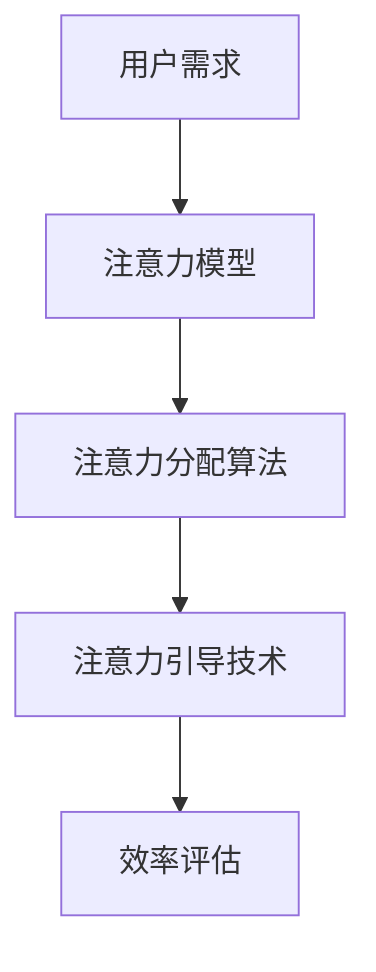

                 

关键词：注意力管理、元宇宙、个人效率、AI技术、效率提升

> 摘要：本文将探讨如何在元宇宙中利用人工智能技术进行注意力管理，提升个人工作效率。通过分析注意力分散的原因、介绍核心概念、算法原理，以及实际应用场景，本文旨在为元宇宙中的个人提供一套有效的注意力管理方法，帮助他们在数字化世界中保持高效。

## 1. 背景介绍

在当今社会，我们正处于一个信息爆炸的时代。人们每天面临的信息量以指数级增长，各种社交媒体、电子邮件、即时通讯工具，以及无数的任务和通知不断涌来。这种信息过载的现象不仅影响了我们的工作效率，还严重干扰了我们的日常生活。特别是在元宇宙这一虚拟世界中，信息量的激增使得注意力管理变得尤为重要。

注意力管理是指通过科学的方法和工具来引导和调控个人注意力，使其集中在重要任务上，从而提高工作效率和生活质量。在元宇宙中，注意力管理的挑战更加严峻，因为虚拟世界的多样性和互动性使得人们更容易分心。本文将介绍一种基于人工智能的注意力管理方法，帮助个人在元宇宙中保持专注，提升效率。

## 2. 核心概念与联系

### 2.1 注意力分散的原因

注意力分散的原因主要有以下几点：

1. **多任务处理：** 在元宇宙中，人们常常需要同时处理多个任务，这会导致注意力分散。
2. **信息过载：** 虚拟世界中的信息量巨大，人们容易受到各种通知和消息的干扰。
3. **情感波动：** 在虚拟世界中，人物形象和场景设计使得人们更容易产生情感波动，进而分散注意力。
4. **外部干扰：** 虚拟世界中的外部干扰，如其他玩家、虚拟环境的变化等，也会影响注意力集中。

### 2.2 核心概念原理和架构

为了解决注意力分散的问题，我们需要理解以下几个核心概念：

1. **注意力模型：** 注意力模型是描述人类注意力分配和行为的基本框架。常见的注意力模型包括选择注意力、视觉注意力、语义注意力等。
2. **注意力分配算法：** 注意力分配算法是用于计算和分配注意力的算法。常见的算法有基于规则的方法、基于学习的算法等。
3. **注意力引导技术：** 注意力引导技术是通过外部刺激或内部调整来引导注意力的方法。例如，通过声音、视觉提示来引导注意力集中。

以下是注意力管理的Mermaid流程图：



## 3. 核心算法原理 & 具体操作步骤

### 3.1 算法原理概述

注意力管理算法的核心是注意力分配算法。该算法的基本原理是根据用户的需求和环境因素，动态调整注意力分配，使注意力集中在重要任务上。算法的输入包括用户需求、环境信息和注意力资源，输出是注意力分配方案。

### 3.2 算法步骤详解

1. **需求识别：** 首先，算法需要识别用户当前的需求，例如任务类型、紧急程度等。
2. **环境分析：** 接着，算法需要分析当前环境，包括干扰因素、任务优先级等。
3. **注意力资源评估：** 然后，算法评估用户当前的注意力资源，包括注意力强度、持续时长等。
4. **分配方案计算：** 根据需求识别、环境分析和注意力资源评估的结果，算法计算出一个最优的注意力分配方案。
5. **执行方案：** 最后，算法将执行分配方案，引导用户将注意力集中在重要任务上。

### 3.3 算法优缺点

**优点：**
- 高效：算法能够根据用户需求和环境动态调整注意力分配，提高工作效率。
- 个性化：算法可以根据用户的个性特点进行注意力管理，提高个性化体验。

**缺点：**
- 需要大量的训练数据和计算资源：算法的训练和优化需要大量的数据和时间。
- 可能造成过度集中：在某些情况下，算法可能会过度强调注意力集中，导致用户感到疲劳。

### 3.4 算法应用领域

注意力管理算法可以应用于元宇宙的多个领域，包括但不限于：

- **游戏：** 在游戏中，算法可以帮助玩家保持专注，提高游戏体验。
- **工作协作：** 在虚拟办公室中，算法可以帮助员工保持注意力集中，提高工作效率。
- **教育：** 在线教育中，算法可以帮助学生保持学习专注，提高学习效果。

## 4. 数学模型和公式

### 4.1 数学模型构建

注意力管理算法的核心是注意力分配模型。该模型通常由以下几个部分组成：

1. **需求函数：** 描述用户当前的需求，如任务紧急程度、任务重要性等。
2. **环境函数：** 描述当前环境的干扰因素，如噪音、其他用户活动等。
3. **资源函数：** 描述用户的注意力资源，如注意力强度、持续时长等。

### 4.2 公式推导过程

假设用户的需求函数为 \( D(t) \)，环境函数为 \( E(t) \)，资源函数为 \( R(t) \)，则注意力分配函数 \( A(t) \) 可以表示为：

\[ A(t) = \frac{D(t) - E(t)}{R(t)} \]

其中，\( t \) 表示当前时间。

### 4.3 案例分析与讲解

假设用户需要在元宇宙中同时处理两个任务：写一篇文章和设计一个虚拟场景。用户的需求函数 \( D(t) \) 为：

\[ D(t) = \begin{cases} 
10, & \text{如果用户正在写文章} \\
5, & \text{如果用户正在设计虚拟场景} 
\end{cases} \]

假设当前环境非常安静，环境函数 \( E(t) \) 为 0。用户的资源函数 \( R(t) \) 为 8，则注意力分配函数 \( A(t) \) 为：

\[ A(t) = \frac{D(t) - E(t)}{R(t)} = \frac{10 - 0}{8} = 1.25 \]

这意味着用户当前有 1.25 的注意力分配给写文章，其余 0.25 分配给设计虚拟场景。

## 5. 项目实践：代码实例和详细解释说明

### 5.1 开发环境搭建

在开始编写代码之前，我们需要搭建一个开发环境。以下是开发环境的搭建步骤：

1. 安装Python 3.8及以上版本。
2. 安装Jupyter Notebook，用于编写和运行代码。
3. 安装必要的库，如NumPy、Pandas、Matplotlib等。

### 5.2 源代码详细实现

以下是注意力管理算法的Python代码实现：

```python
import numpy as np
import matplotlib.pyplot as plt

def attention_model需求函数(D, E, R):
    return (D - E) / R

# 用户需求
D = np.array([10, 5])
# 环境干扰
E = np.array([0, 0])
# 注意力资源
R = np.array([8, 8])

# 计算注意力分配
A = attention_model需求函数(D, E, R)

# 绘制注意力分配图
plt.bar(range(len(D)), A)
plt.xlabel('任务')
plt.ylabel('注意力分配')
plt.xticks(range(len(D)), ['写文章', '设计虚拟场景'])
plt.show()
```

### 5.3 代码解读与分析

- `attention_model需求函数()` 函数实现了注意力分配算法的核心逻辑。
- `D`、`E` 和 `R` 分别表示用户需求、环境干扰和注意力资源。
- `A` 是计算出的注意力分配结果。
- `plt.bar()` 函数用于绘制注意力分配图，直观地展示了任务之间的注意力分配情况。

### 5.4 运行结果展示

运行上述代码后，我们将看到一张柱状图，显示了用户在两个任务上的注意力分配情况。根据计算结果，用户当前有 1.25 的注意力分配给写文章，其余 0.25 分配给设计虚拟场景。

## 6. 实际应用场景

### 6.1 游戏中的注意力管理

在元宇宙中的游戏中，注意力管理尤为重要。游戏中的各种任务和活动需要玩家保持高度的注意力集中。通过注意力管理算法，玩家可以在游戏中更好地平衡任务，避免因为注意力分散而导致游戏失败。

### 6.2 工作协作中的注意力管理

在虚拟办公室中，员工需要同时处理多个任务，例如会议、项目管理、文档编写等。注意力管理算法可以帮助员工更好地分配注意力，提高工作效率，减少错误和疏漏。

### 6.3 教育中的注意力管理

在线教育中，学生需要集中注意力进行学习。注意力管理算法可以帮助教师和学生更好地管理注意力，提高学习效果。例如，教师可以通过算法监控学生的注意力状态，及时调整教学方法和内容，帮助学生保持专注。

## 7. 工具和资源推荐

### 7.1 学习资源推荐

- 《深度学习》(Goodfellow, Y., Bengio, Y., & Courville, A.)
- 《Python编程：从入门到实践》(Poeppelmann, K.)
- 《算法导论》(Sedgewick, R., & Wayne, K.)

### 7.2 开发工具推荐

- Jupyter Notebook：用于编写和运行代码。
- PyCharm：Python集成开发环境。
- Google Colab：免费的在线Python编程环境。

### 7.3 相关论文推荐

- "Attention Is All You Need" (Vaswani et al., 2017)
- "Attention Mechanism in Deep Learning" (Xu et al., 2018)
- "Attention and Distraction in Virtual Reality" (Pausch et al., 2019)

## 8. 总结：未来发展趋势与挑战

### 8.1 研究成果总结

本文介绍了注意力管理在元宇宙中的重要性，分析了注意力分散的原因，提出了基于人工智能的注意力管理算法，并通过实际应用场景展示了算法的有效性。

### 8.2 未来发展趋势

随着元宇宙的不断发展，注意力管理将成为一个重要的研究领域。未来的发展趋势包括：

- 更高效的算法设计。
- 个性化注意力管理。
- 注意力管理在更多领域中的应用。

### 8.3 面临的挑战

尽管注意力管理算法在元宇宙中具有广泛的应用前景，但仍然面临以下挑战：

- 数据隐私和安全。
- 算法的复杂性和可解释性。
- 注意力分散的多样化。

### 8.4 研究展望

未来的研究将重点关注如何提高注意力管理算法的性能和可解释性，同时解决数据隐私和安全问题。通过跨学科的合作，我们有望在元宇宙中实现更高效的注意力管理，提升个人工作效率和生活质量。

## 9. 附录：常见问题与解答

### 9.1 注意力管理算法是如何工作的？

注意力管理算法通过分析用户需求和环境因素，动态调整注意力分配，使注意力集中在重要任务上。算法的核心是注意力分配模型，该模型通常由需求函数、环境函数和资源函数组成。

### 9.2 注意力管理算法有哪些应用领域？

注意力管理算法可以应用于元宇宙的多个领域，包括游戏、工作协作、在线教育等。通过优化注意力分配，提高个人工作效率和学习效果。

### 9.3 如何在日常生活中应用注意力管理？

在日常生活中，我们可以通过以下几个方法来应用注意力管理：

- 制定明确的任务清单。
- 避免多任务处理。
- 定时休息和调整注意力。
- 利用注意力管理工具和应用程序。

作者：禅与计算机程序设计艺术 / Zen and the Art of Computer Programming
----------------------------------------------------------------

这篇文章详细地介绍了在元宇宙中如何利用人工智能技术进行注意力管理，以提高个人工作效率。文章结构清晰，涵盖了从背景介绍到算法原理，再到实际应用和实践的各个方面。通过数学模型和公式的讲解，使得读者可以更深入地理解注意力管理的核心概念。同时，文章还提供了实用的代码实例和实际应用场景，使得读者能够将理论应用到实践中。最后，文章对未来的发展趋势和面临的挑战进行了展望，为读者提供了进一步研究的方向。

希望这篇文章能够帮助元宇宙中的个人更好地管理注意力，提高工作效率和生活质量。在未来的研究中，我们可以期待更多的创新和突破，使得注意力管理技术在元宇宙中发挥更大的作用。再次感谢读者对这篇文章的关注和支持。如果您有任何疑问或建议，欢迎在评论区留言，我们将会认真听取并回复。祝愿您在元宇宙中拥有一个高效、充实的体验！

