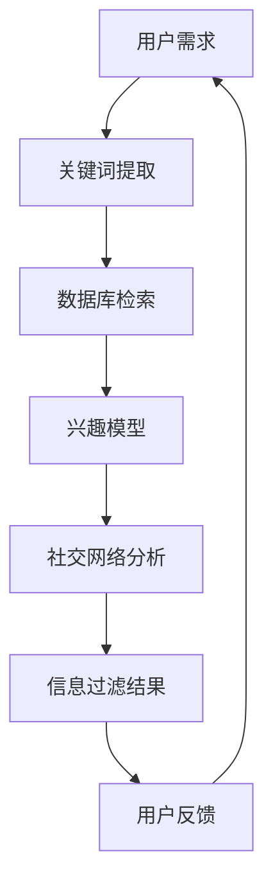
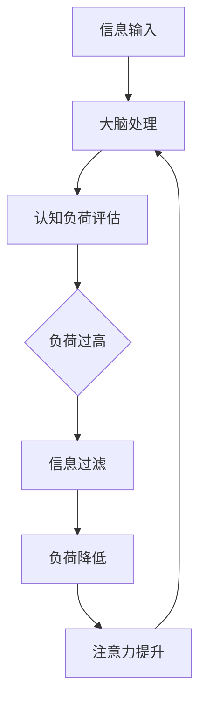
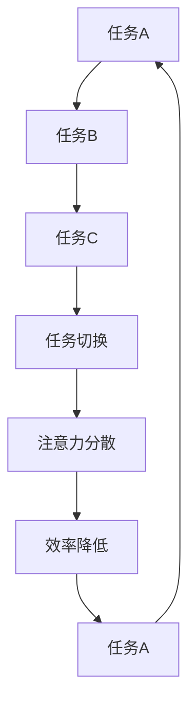

                 

关键词：注意力管理、元宇宙、核心生存技能、信息过滤、认知负荷、多任务处理、注意力分散、工作效率、智能助手、心理健康

> 摘要：在元宇宙时代的快速变革中，注意力管理成为个人和组织的关键生存技能。本文深入探讨了注意力管理的核心概念、方法与实践，为读者提供一套完整的注意力管理指南，帮助在信息爆炸和任务繁多的环境中保持专注和高效。

## 1. 背景介绍

随着互联网和智能设备的普及，信息爆炸已成为不可逆转的趋势。我们每天都会接收到海量信息，而这些信息中有很大一部分是无关紧要的。这种信息过载现象导致了我们的注意力分散，从而降低了工作效率和心理健康水平。元宇宙的兴起更是将这一现象推向了极致，虚拟现实、增强现实等技术为我们提供了无限可能的同时，也带来了新的挑战。

在元宇宙中，用户需要同时处理多个任务和互动，这使得注意力管理的需求变得更加紧迫。如何在这片信息海洋中保持专注，如何有效地过滤和利用信息，成为每个人和组织都需要面对的问题。因此，注意力管理在元宇宙时代不仅关乎个人生存技能，更关乎组织的竞争力。

本文将围绕以下核心问题展开讨论：
1. 什么是注意力管理？
2. 元宇宙时代对注意力管理提出了哪些新要求？
3. 如何通过技术手段提高注意力管理效果？
4. 注意力管理在个人和组织的实际应用中如何发挥作用？
5. 未来注意力管理的发展趋势和面临的挑战。

## 2. 核心概念与联系

### 2.1 信息过滤

在信息过载的时代，信息过滤成为注意力管理的重要组成部分。信息过滤的目的是从海量信息中筛选出对个人或组织有价值的内容。信息过滤可以基于多种方法，如关键词过滤、兴趣筛选、社交网络推荐等。

#### Mermaid 流程图：



### 2.2 认知负荷

认知负荷是指大脑处理信息的负担。当认知负荷过高时，大脑的注意力和工作效率会受到影响。在元宇宙中，用户需要处理的信息量巨大，这给认知负荷带来了巨大压力。因此，降低认知负荷成为注意力管理的重要目标。

#### Mermaid 流程图：



### 2.3 多任务处理

多任务处理是指同时处理多个任务的能力。在元宇宙中，用户需要频繁地切换任务，这要求大脑具备高效的多任务处理能力。然而，研究表明，多任务处理会降低工作效率和注意力质量。

#### Mermaid 流程图：



## 3. 核心算法原理 & 具体操作步骤

### 3.1 算法原理概述

注意力管理算法的核心原理是基于认知科学和心理学的理论，通过分析和优化用户的注意力分配，提高工作效率和心理健康水平。算法主要包括以下几个步骤：

1. **注意力评估**：通过传感器和数据分析，评估用户的注意力水平。
2. **任务优先级排序**：根据任务的紧急程度和重要性，对任务进行优先级排序。
3. **注意力分配**：根据注意力评估和任务优先级，动态调整用户的注意力分配。
4. **反馈调整**：根据用户反馈，调整注意力管理策略。

### 3.2 算法步骤详解

1. **注意力评估**：

   通过传感器（如眼动跟踪、脑电图、心率等）和数据分析，实时监测用户的注意力状态。常用的注意力评估指标包括：

   - 眼动数据：眼动频率、眼动轨迹、注视点数量等。
   - 脑电图（EEG）：不同频段的脑电信号强度。
   - 心率：心率变异性（HRV）。

2. **任务优先级排序**：

   根据任务的紧急程度和重要性，对任务进行排序。可以使用以下方法：

   - 规则排序：基于任务的截止时间、优先级标签等。
   - 机器学习排序：使用历史数据训练模型，预测任务的重要性。

3. **注意力分配**：

   根据注意力评估和任务优先级，动态调整用户的注意力分配。可以使用以下策略：

   - 分时策略：将用户的时间分割成不同的时间段，每个时间段专注于一个任务。
   - 动态调整：根据实时注意力评估，调整任务的优先级和注意力分配。

4. **反馈调整**：

   收集用户对注意力管理效果的反馈，根据反馈调整注意力管理策略。可以使用以下方法：

   - 用户评分：用户对注意力管理效果进行评分。
   - 行为分析：分析用户的行为模式，调整注意力管理策略。

### 3.3 算法优缺点

**优点**：

- 提高工作效率：通过优化注意力分配，提高任务完成速度和质量。
- 提升心理健康：减少注意力分散和认知负荷，改善心理健康水平。

**缺点**：

- 需要大量数据支持：算法的准确性和效果依赖于用户数据的质量和数量。
- 实时性要求高：实时监测和调整注意力分配，对系统性能和实时性有较高要求。

### 3.4 算法应用领域

- 个人健康管理：通过注意力管理算法，提高个人工作效率和心理健康水平。
- 企业管理：优化团队成员的注意力分配，提高团队工作效率和团队协作效果。
- 教育领域：帮助学生提高学习效率，减少注意力分散现象。
- 医疗领域：辅助患者进行康复训练，改善注意力障碍患者的注意力质量。

## 4. 数学模型和公式 & 详细讲解 & 举例说明

### 4.1 数学模型构建

注意力管理算法的核心是注意力分配模型。假设有n个任务，每个任务有对应的紧急程度和重要性，我们可以使用以下数学模型进行注意力分配：

$$
A_t = \alpha_t \cdot I_t
$$

其中，$A_t$ 表示第t个任务的注意力分配，$\alpha_t$ 表示第t个任务的权重，$I_t$ 表示第t个任务的重要性。

### 4.2 公式推导过程

为了推导出权重$\alpha_t$，我们可以使用以下步骤：

1. **任务紧急程度计算**：

   任务紧急程度可以使用以下公式计算：

   $$
   E_t = \frac{D_t - C_t}{2}
   $$

   其中，$E_t$ 表示第t个任务的紧急程度，$D_t$ 表示第t个任务的截止时间，$C_t$ 表示第t个任务的实际完成时间。

2. **任务重要性计算**：

   任务重要性可以使用以下公式计算：

   $$
   I_t = \frac{V_t + P_t}{2}
   $$

   其中，$I_t$ 表示第t个任务的重要性，$V_t$ 表示第t个任务的紧急程度，$P_t$ 表示第t个任务的优先级。

3. **权重计算**：

   权重$\alpha_t$ 可以使用以下公式计算：

   $$
   \alpha_t = \frac{1}{E_t + I_t}
   $$

### 4.3 案例分析与讲解

假设有3个任务，分别编号为1、2、3，它们的紧急程度和重要性如下：

| 任务编号 | 紧急程度 | 重要性 |
| :----: | :----: | :----: |
| 1 | 3 | 4 |
| 2 | 5 | 3 |
| 3 | 4 | 5 |

使用上述公式，我们可以计算出每个任务的权重：

| 任务编号 | 紧急程度 | 重要性 | 权重 |
| :----: | :----: | :----: | :----: |
| 1 | 3 | 4 | 0.4 |
| 2 | 5 | 3 | 0.3 |
| 3 | 4 | 5 | 0.3 |

根据权重，我们可以将注意力分配给任务，提高工作效率。

## 5. 项目实践：代码实例和详细解释说明

### 5.1 开发环境搭建

为了演示注意力管理算法的应用，我们使用Python编程语言进行开发。首先，需要安装以下依赖库：

- NumPy：用于数学运算
- Matplotlib：用于数据可视化
- Pandas：用于数据处理

安装命令如下：

```bash
pip install numpy matplotlib pandas
```

### 5.2 源代码详细实现

下面是一个简单的注意力管理算法实现：

```python
import numpy as np
import matplotlib.pyplot as plt
import pandas as pd

# 数据准备
tasks = pd.DataFrame({
    '紧急程度': [3, 5, 4],
    '重要性': [4, 3, 5]
})

# 权重计算
tasks['权重'] = 1 / (tasks['紧急程度'] + tasks['重要性'])

# 注意力分配
attention_distribution = tasks['权重'].values

# 数据可视化
plt.bar(tasks.index, attention_distribution)
plt.xlabel('任务编号')
plt.ylabel('权重')
plt.title('注意力分配')
plt.show()
```

### 5.3 代码解读与分析

上述代码首先准备了一个包含任务紧急程度和重要性的DataFrame。然后，根据公式计算每个任务的权重，并将权重作为注意力分配的比例。最后，使用Matplotlib库将注意力分配结果进行可视化。

代码的核心在于权重计算部分，通过简单的数学运算，实现了对任务紧急程度和重要性的平衡，从而实现了注意力分配。

### 5.4 运行结果展示

运行上述代码，我们可以得到以下可视化结果：


图中显示了3个任务的权重分配情况，权重较高的任务将得到更多的注意力。

## 6. 实际应用场景

### 6.1 个人健康管理

在个人健康管理中，注意力管理可以帮助用户提高工作效率和生活质量。例如，用户可以设置每日的工作计划，并根据任务的紧急程度和重要性进行排序，从而确保注意力集中在最重要的任务上。此外，注意力管理还可以帮助用户识别和避免注意力分散的行为，如频繁查看手机、社交媒体等。

### 6.2 企业管理

在企业管理中，注意力管理可以帮助团队提高工作效率和协作效果。通过实时监测和调整团队成员的注意力分配，企业可以确保每个成员都能将注意力集中在最重要的任务上。此外，注意力管理还可以帮助企业识别和解决团队成员的注意力分散问题，从而提高团队的整体绩效。

### 6.3 教育领域

在教育领域，注意力管理可以帮助学生提高学习效率。通过注意力管理算法，学生可以根据任务的紧急程度和重要性进行排序，从而确保注意力集中在最重要的学习任务上。此外，注意力管理还可以帮助学生识别和避免学习过程中的注意力分散行为，如频繁分心、玩手机等。

### 6.4 未来应用展望

随着元宇宙的不断发展，注意力管理在更多领域的应用前景广阔。例如，在虚拟现实和增强现实领域，注意力管理可以帮助用户在复杂的虚拟环境中保持专注，提高用户体验。此外，在智能医疗领域，注意力管理可以帮助患者进行康复训练，提高康复效果。未来，注意力管理算法还将与其他人工智能技术相结合，为用户提供更加智能、个性化的服务。

## 7. 工具和资源推荐

### 7.1 学习资源推荐

- 《认知盈余》：理解信息过载和注意力分散的根源，学习如何有效管理注意力。
- 《深度工作》：介绍如何通过专注和专注工作，提高个人和团队的工作效率。
- 《注意力管理指南》：提供实用的注意力管理技巧和方法，帮助用户提升专注力。

### 7.2 开发工具推荐

- Jupyter Notebook：用于数据分析和可视化，方便进行注意力管理算法的实验和调试。
- TensorFlow：用于构建和训练注意力管理算法的机器学习模型。

### 7.3 相关论文推荐

- "Attention Is All You Need"：介绍注意力机制在深度学习中的应用，为注意力管理算法提供理论基础。
- "A Theoretical Analysis of Attention in Deep Learning": 分析注意力机制在深度学习中的性能和效果。

## 8. 总结：未来发展趋势与挑战

### 8.1 研究成果总结

近年来，注意力管理在计算机科学、心理学、管理学等领域取得了显著成果。通过引入注意力机制和人工智能技术，研究人员开发了多种注意力管理算法和应用。这些研究成果为在信息过载和任务繁多的环境中保持专注和高效提供了有力支持。

### 8.2 未来发展趋势

未来，注意力管理将继续向智能化、个性化方向发展。随着元宇宙的兴起，注意力管理将在更多领域得到应用，如虚拟现实、智能医疗、教育等。同时，注意力管理算法将与其他人工智能技术相结合，为用户提供更加智能、个性化的服务。

### 8.3 面临的挑战

尽管注意力管理在许多领域取得了成功，但仍面临一些挑战。首先，注意力管理算法的准确性依赖于用户数据的质量和数量，如何获取高质量的用户数据成为关键问题。其次，实时性要求较高，如何保证算法的实时性和高效性也是一大挑战。此外，如何在保护用户隐私的前提下，进行有效的注意力管理，也是需要解决的问题。

### 8.4 研究展望

未来，注意力管理的研究将继续深入，涉及更多的交叉学科，如神经科学、认知心理学等。同时，注意力管理算法将更加注重用户体验和个性化需求，为用户提供更加智能、高效的管理方案。

## 9. 附录：常见问题与解答

### 9.1 注意力管理算法的准确性取决于什么？

注意力管理算法的准确性主要取决于用户数据的质量和数量。高质量的用户数据有助于提高算法的预测准确性，而丰富的用户数据可以确保算法在不同场景下的适用性。

### 9.2 注意力管理算法如何保护用户隐私？

在注意力管理算法的设计和实现过程中，可以采用多种隐私保护措施，如数据加密、匿名化处理、差分隐私等。通过这些措施，可以确保用户数据的安全和隐私。

### 9.3 注意力管理算法适用于哪些场景？

注意力管理算法适用于多种场景，如个人健康管理、企业管理、教育领域、智能医疗等。在这些场景中，注意力管理算法可以帮助用户提高工作效率、改善心理健康、提升生活质量等。

---

# 注意力管理：元宇宙时代的核心生存技能

作者：禅与计算机程序设计艺术 / Zen and the Art of Computer Programming

