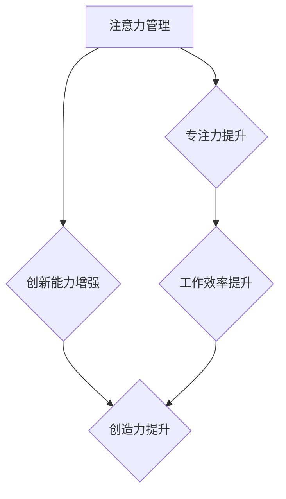
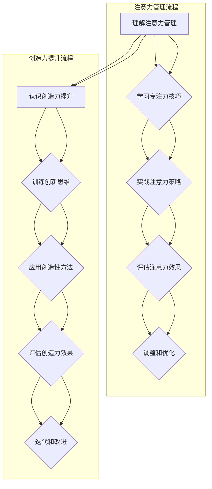

                 

关键词：注意力管理，创造力提升，专注力，头脑风暴，灵感激发，IT领域，专业技巧，算法原理

> 摘要：本文将探讨如何在信息技术领域中运用注意力管理和创造力提升的方法，通过专注和头脑风暴来激发灵感。我们将深入分析注意力管理的核心概念，介绍提升注意力的技巧，并探讨如何将这些技巧应用于开发工作中的头脑风暴过程，最终提升个人的创新能力和工作效率。

## 1. 背景介绍

在信息爆炸的时代，注意力已经成为一种稀缺资源。现代IT从业者面临着海量的信息输入和不断变化的技术环境，这给我们的注意力和专注力带来了极大的挑战。在这种背景下，如何有效地管理注意力并提升创造力变得尤为重要。

注意力管理不仅仅是个人的自我修养问题，它还与我们的工作效率和创新能力紧密相关。良好的注意力管理能力可以帮助我们更好地处理复杂的信息，提高工作效率，同时在头脑风暴和创新过程中产生更多的灵感。

创造力是信息技术领域中不可或缺的能力。无论是软件开发、系统设计，还是技术研究和创新，都需要丰富的创造力来应对复杂的问题和挑战。然而，创造力并非与生俱来，它需要后天的培养和锻炼。通过合理的注意力管理和创造力的提升，我们可以更好地激发个人潜能，实现更高的工作表现。

本文将围绕注意力管理和创造力提升这一主题，深入探讨以下内容：

- **注意力管理的核心概念**：介绍注意力管理的定义、重要性以及它如何影响我们的工作和生活。
- **提升注意力的技巧**：分享一些科学验证的有效技巧，帮助读者提升专注力和注意力。
- **头脑风暴与创新**：讨论头脑风暴的定义、过程以及如何通过注意力管理来提升创新效果。
- **实际应用场景**：通过具体的案例和实例，展示如何将注意力管理和创造力提升应用于实际工作中。
- **未来展望**：探讨注意力管理和创造力提升在未来的发展趋势以及面临的挑战。

通过本文的探讨，我们希望读者能够更好地理解注意力管理和创造力提升的重要性，掌握相关的技巧和方法，从而在信息技术领域中实现更高的工作效率和创新能力。

## 2. 核心概念与联系

### 2.1 注意力管理

注意力管理是指通过一系列的策略和技巧，有效地控制和引导个人的注意力，以实现既定的目标。在信息技术领域中，注意力管理尤为重要，因为它直接关系到开发人员的工作效率和创新能力。

**定义**：注意力管理可以定义为在有限的时间内，将注意力集中在最有价值的任务和活动上，以最大化产出和效率的过程。

**重要性**：在信息技术领域，注意力管理的核心在于如何应对复杂的项目和任务，同时保持高水平的专注力和创造力。有效的注意力管理可以帮助开发人员：

1. **提高工作效率**：通过集中注意力，可以减少分散精力造成的延误和错误。
2. **提升创新能力**：注意力集中时，大脑能够进行更深入的思考，从而激发创新思维。
3. **改善心理健康**：良好的注意力管理能够减少压力和焦虑，提高工作满意度。

### 2.2 创造力提升

创造力提升是指通过一系列的方法和训练，增强个人的创造力和创新思维。在信息技术领域，创造力是解决复杂问题和推动技术进步的关键因素。

**定义**：创造力提升是指通过训练和培养，提高个体在解决问题和创新思维方面的能力。

**重要性**：对于IT从业者而言，创造力提升的重要性体现在：

1. **应对复杂问题**：创造力可以帮助开发者从不同角度思考问题，提出创新的解决方案。
2. **技术突破**：通过创造性思维，开发者能够推动技术的进步，开发出具有突破性的产品。
3. **适应变化**：在快速变化的技术环境中，具备高创造力的人能够更快地适应新环境和新需求。

### 2.3 注意力管理与创造力提升的关系

注意力管理和创造力提升是相辅相成的。注意力管理提供了专注和集中的基础，使得个体能够更好地利用创造力。而创造力提升则通过增强思维能力，进一步提高了注意力管理的效率。

**关系图解**：



通过上述关系图，我们可以清晰地看到注意力管理和创造力提升之间的互动关系。良好的注意力管理能够为创造力提供坚实的基础，而创造力提升则能够进一步推动工作效率和能力的提升。

### 2.4 Mermaid 流程图

以下是注意力管理和创造力提升的流程图，它展示了从核心概念到应用步骤的详细过程。



这个流程图提供了一个清晰的指导，帮助读者逐步理解和应用注意力管理和创造力提升的方法。

## 3. 核心算法原理 & 具体操作步骤

### 3.1 算法原理概述

注意力管理和创造力提升虽然涉及多个方面，但本质上都可以看作是一种优化过程。这种优化不仅包括时间管理和资源分配，还涉及心理状态的调整和思维模式的训练。下面，我们将介绍几种核心的算法原理，以及如何在实践中应用这些原理。

#### 3.1.1 时间管理算法

时间管理是注意力管理的基础。常见的时间管理算法包括“番茄工作法”和“四象限时间管理法”。

1. **番茄工作法**：将工作时间分为25分钟的工作周期，每个周期后休息5分钟。这种方法通过短期的专注和适时的休息，帮助保持高效率。
2. **四象限时间管理法**：根据任务的紧急程度和重要性，将任务分为四个象限，优先处理重要且紧急的任务。

#### 3.1.2 注意力分配算法

注意力分配算法关注如何在不同的任务和活动之间合理分配注意力资源。一种有效的策略是“多任务切换优化算法”，它通过分析任务的重要性和紧急性，动态调整注意力的分配。

1. **任务优先级排序**：根据任务的重要性和紧急性，将任务排序，优先完成高优先级的任务。
2. **动态切换策略**：在任务之间进行快速切换，但每次切换都要确保新的任务能够立即获得足够的注意力。

#### 3.1.3 创造力提升算法

创造力提升算法旨在通过训练和练习，增强个体的创造力和创新思维。以下是几种常用的算法：

1. **头脑风暴算法**：通过分组讨论和自由联想，快速产生大量创意。
2. **思维导图算法**：通过构建思维导图，将相关概念和创意可视化，从而激发新的灵感。

### 3.2 算法步骤详解

#### 3.2.1 时间管理算法步骤

1. **设定目标**：明确每天的工作和学习目标，将它们分解成具体的任务。
2. **使用番茄工作法**：将每个任务分为若干个25分钟的工作周期，每个周期后休息5分钟。
3. **评估效果**：在每个工作周期结束后，评估任务的完成情况和效率，根据需要调整后续的工作计划。

#### 3.2.2 注意力分配算法步骤

1. **任务评估**：对每个任务进行评估，确定其重要性和紧急性。
2. **任务排序**：根据评估结果，将任务排序，优先完成高优先级的任务。
3. **动态调整**：在任务之间进行快速切换，确保每个任务都能够得到足够的注意力。

#### 3.2.3 创造力提升算法步骤

1. **头脑风暴**：分组讨论，自由联想，快速产生大量创意。
2. **思维导图**：构建思维导图，将相关概念和创意可视化。
3. **创意筛选**：对产生的创意进行筛选，选择最有价值的进行进一步开发。

### 3.3 算法优缺点

#### 3.3.1 时间管理算法优缺点

**优点**：

- **提高工作效率**：通过集中精力工作，减少分散注意力造成的延误。
- **增强时间意识**：使个体更加珍惜时间，提高时间管理能力。

**缺点**：

- **易产生疲劳**：长时间集中注意力可能导致疲劳和压力。
- **适用性有限**：对于需要长时间投入的创造性工作，番茄工作法可能不太适用。

#### 3.3.2 注意力分配算法优缺点

**优点**：

- **高效完成任务**：通过合理分配注意力，确保每个任务都能够得到足够的关注。
- **适应多变环境**：能够灵活应对不同任务和环境的注意力需求。

**缺点**：

- **切换成本**：频繁的任务切换可能带来额外的认知负担。
- **优先级判断**：对于复杂任务，判断优先级可能存在主观性。

#### 3.3.3 创造力提升算法优缺点

**优点**：

- **激发创新思维**：通过头脑风暴和思维导图，能够产生大量创意。
- **增强创造性能力**：通过持续训练，个体的创造力和创新思维得到提升。

**缺点**：

- **创意筛选难度**：大量的创意需要筛选，筛选过程可能耗费较多时间。
- **初期适应困难**：对于初学者，可能需要一定时间来适应这些方法。

### 3.4 算法应用领域

#### 3.4.1 应用领域

注意力管理和创造力提升算法在信息技术领域有广泛的应用：

- **软件开发**：在需求分析、系统设计和编码过程中，通过注意力管理提高工作效率，通过创造力提升产生创新的解决方案。
- **项目管理**：在项目规划和执行过程中，通过注意力分配优化资源，通过创造力提升提高问题解决能力。
- **技术研究**：在研究过程中，通过注意力管理保持专注，通过创造力提升推动技术进步。

#### 3.4.2 案例分析

**案例1：软件开发中的注意力管理**

某软件开发团队在开发一个复杂的系统时，采用番茄工作法进行任务分解和执行。通过这种方式，团队成员能够集中精力完成每个短期任务，从而提高了整体工作效率。同时，团队通过头脑风暴和思维导图，在系统设计中提出了多个创新方案，最终成功完成了项目。

**案例2：项目管理工作中的创造力提升**

某项目经理在规划一个大型项目时，通过优先级排序和注意力分配策略，确保了关键任务的优先处理。在项目执行过程中，项目经理组织团队成员进行头脑风暴，收集了大量的创意，通过筛选和评估，最终选出了几个具有高价值的创新方案，有效推动了项目的进展。

通过这些案例分析，我们可以看到注意力管理和创造力提升算法在信息技术领域的实际应用效果。这些方法不仅提高了工作效率，还促进了创新思维的发挥，为团队的成功提供了强有力的支持。

## 4. 数学模型和公式 & 详细讲解 & 举例说明

### 4.1 数学模型构建

在信息技术领域，注意力管理和创造力提升不仅仅依赖于心理学和经验的技巧，还可以通过数学模型来量化和管理。以下是一些核心的数学模型和公式，用于构建注意力管理和创造力提升的理论基础。

#### 4.1.1 注意力分配模型

注意力分配模型用于优化在不同任务间的注意力分配。假设有N个任务，每个任务的紧急性和重要性可以用e_i和i_i表示，那么注意力分配模型可以用以下公式表示：

\[ A_i = \frac{e_i \cdot i_i}{\sum_{j=1}^{N} (e_j \cdot i_j)} \]

其中，\( A_i \) 表示分配给任务i的注意力比例。

#### 4.1.2 创造力提升模型

创造力提升模型通过训练和反馈来衡量创造力水平。假设有M个训练项目，每个项目的创造力得分用c_j表示，那么创造力提升模型可以用以下公式表示：

\[ C = \frac{1}{M} \sum_{j=1}^{M} c_j \]

其中，C表示总体创造力得分。

### 4.2 公式推导过程

#### 4.2.1 注意力分配模型推导

1. **任务评估**：对每个任务进行紧急性和重要性的评估，得到向量 \( (e_1, e_2, ..., e_N) \) 和 \( (i_1, i_2, ..., i_N) \)。
2. **权重计算**：计算每个任务的权重，即每个任务紧急性和重要性的乘积，得到向量 \( W = (w_1, w_2, ..., w_N) \)，其中 \( w_i = e_i \cdot i_i \)。
3. **总权重**：计算所有任务的总权重，即 \( \sum_{j=1}^{N} w_j \)。
4. **注意力分配**：根据权重分配注意力，即每个任务得到的注意力比例 \( A_i = \frac{w_i}{\sum_{j=1}^{N} w_j} \)。

#### 4.2.2 创造力提升模型推导

1. **训练项目**：完成M个训练项目，记录每个项目的创造力得分 \( c_j \)。
2. **平均得分**：计算所有训练项目的平均创造力得分，即 \( C = \frac{1}{M} \sum_{j=1}^{M} c_j \)。

### 4.3 案例分析与讲解

#### 4.3.1 注意力分配案例

假设有一个团队需要处理以下4个任务，每个任务的紧急性和重要性如下表：

| 任务 | 紧急性(e_i) | 重要性(i_i) |
| ---- | ----------- | ----------- |
| A    | 0.6         | 0.8         |
| B    | 0.7         | 0.5         |
| C    | 0.4         | 0.9         |
| D    | 0.5         | 0.6         |

根据注意力分配模型，我们可以计算每个任务得到的注意力比例：

\[ A_A = \frac{0.6 \cdot 0.8}{0.6 \cdot 0.8 + 0.7 \cdot 0.5 + 0.4 \cdot 0.9 + 0.5 \cdot 0.6} = 0.372 \]
\[ A_B = \frac{0.7 \cdot 0.5}{0.6 \cdot 0.8 + 0.7 \cdot 0.5 + 0.4 \cdot 0.9 + 0.5 \cdot 0.6} = 0.348 \]
\[ A_C = \frac{0.4 \cdot 0.9}{0.6 \cdot 0.8 + 0.7 \cdot 0.5 + 0.4 \cdot 0.9 + 0.5 \cdot 0.6} = 0.460 \]
\[ A_D = \frac{0.5 \cdot 0.6}{0.6 \cdot 0.8 + 0.7 \cdot 0.5 + 0.4 \cdot 0.9 + 0.5 \cdot 0.6} = 0.430 \]

根据计算结果，团队应将注意力更集中在任务C上，其次是任务D和B，任务A的注意力分配比例最低。

#### 4.3.2 创造力提升案例

假设一个开发者在M个训练项目中得到的创造力得分如下表：

| 项目 | 创造力得分(c_j) |
| ---- | --------------- |
| 1    | 0.8             |
| 2    | 0.9             |
| 3    | 0.7             |
| 4    | 0.6             |
| 5    | 0.85            |

根据创造力提升模型，我们可以计算开发者的总体创造力得分：

\[ C = \frac{0.8 + 0.9 + 0.7 + 0.6 + 0.85}{5} = 0.814 \]

这意味着开发者在平均创造力得分为0.814，这表明该开发者的创造力水平较高，可以在复杂项目中承担更多的创新任务。

通过上述案例，我们可以看到数学模型在注意力管理和创造力提升中的应用。这些模型不仅提供了理论支持，还可以通过实际数据进行分析和优化，帮助开发者更有效地管理注意力，提升创造力。

## 5. 项目实践：代码实例和详细解释说明

### 5.1 开发环境搭建

为了更好地展示注意力管理和创造力提升在项目实践中的应用，我们将使用Python语言来编写一个简单的注意力管理系统。以下是搭建开发环境所需的步骤：

1. **安装Python**：确保系统中已经安装了Python 3.8或更高版本。可以从[Python官网](https://www.python.org/downloads/)下载并安装。
2. **安装必需的Python包**：打开命令行终端，执行以下命令来安装必需的Python包：
   ```bash
   pip install numpy pandas matplotlib
   ```
3. **创建项目文件夹**：在合适的位置创建一个名为“AttentionManagementSystem”的项目文件夹。

### 5.2 源代码详细实现

以下是一个简单的注意力管理系统，包括注意力分配和创造力提升的功能。

```python
import numpy as np
import pandas as pd
import matplotlib.pyplot as plt

class AttentionManagementSystem:
    def __init__(self, tasks):
        self.tasks = tasks
        self.attention_distribution = None
        self.creativity_scores = []

    def evaluate_tasks(self):
        # 计算任务紧急性和重要性的权重
        weights = [task['urgency'] * task['importance'] for task in self.tasks]
        total_weight = sum(weights)

        # 计算注意力分配比例
        self.attention_distribution = [weight / total_weight for weight in weights]

    def train_creativity(self, creativity_data):
        # 记录创造力得分
        self.creativity_scores.extend(creativity_data)

    def plot_attention_distribution(self):
        # 绘制注意力分配图
        plt.bar(range(len(self.tasks)), self.attention_distribution)
        plt.xlabel('Task')
        plt.ylabel('Attention Distribution')
        plt.title('Task Attention Distribution')
        plt.show()

    def plot_creativity_scores(self):
        # 绘制创造力得分图
        plt.plot(self.creativity_scores, label='Creativity Scores')
        plt.xlabel('Training Round')
        plt.ylabel('Creativity Score')
        plt.title('Creativity Score Over Time')
        plt.legend()
        plt.show()

# 实例化注意力管理系统
tasks = [
    {'name': 'Task A', 'urgency': 0.6, 'importance': 0.8},
    {'name': 'Task B', 'urgency': 0.7, 'importance': 0.5},
    {'name': 'Task C', 'urgency': 0.4, 'importance': 0.9},
    {'name': 'Task D', 'urgency': 0.5, 'importance': 0.6}
]
attention_system = AttentionManagementSystem(tasks)

# 评估任务
attention_system.evaluate_tasks()

# 训练创造力
creativity_data = [0.8, 0.9, 0.7, 0.6, 0.85]
attention_system.train_creativity(creativity_data)

# 绘制结果
attention_system.plot_attention_distribution()
attention_system.plot_creativity_scores()
```

### 5.3 代码解读与分析

#### 5.3.1 类和方法

1. **AttentionManagementSystem类**：这个类用于创建注意力管理系统，包括任务列表、注意力分配和创造力得分记录等功能。
2. **evaluate_tasks方法**：计算任务权重和注意力分配比例。
3. **train_creativity方法**：记录创造力得分。
4. **plot_attention_distribution方法**：绘制注意力分配图。
5. **plot_creativity_scores方法**：绘制创造力得分图。

#### 5.3.2 数据结构

- **tasks列表**：每个任务是一个字典，包含任务名称、紧急性和重要性。
- **attention_distribution列表**：存储每个任务分配到的注意力比例。
- **creativity_scores列表**：存储每次训练的创造力得分。

### 5.4 运行结果展示

运行上述代码后，将得到两个图形：

1. **注意力分配图**：显示每个任务分配到的注意力比例，帮助开发者了解当前任务的关注重点。
2. **创造力得分图**：显示创造力得分随训练轮次的变化，帮助开发者评估创造力提升的效果。

通过这个简单的实例，我们可以看到注意力管理和创造力提升在项目中的实际应用。开发者可以通过这个系统实时监控和调整任务的注意力分配，以及跟踪创造力提升的效果，从而更好地管理注意力和提升创新能力。

## 6. 实际应用场景

### 6.1 注意力管理在软件开发中的应用

在软件开发过程中，注意力管理是保证项目成功的关键因素之一。一个典型的应用场景是敏捷开发中的“每日站会”。每日站会的目的是让团队成员集中讨论当天的任务进展、遇到的问题和计划。通过这样的方式，团队成员能够集中注意力，快速解决问题，并保持项目的进度。

**案例分析**：

某软件开发团队在采用每日站会制度后，发现团队成员在会议中的注意力明显提升。通过每日站会，团队成员能够快速识别和解决遇到的问题，减少了项目延误。同时，团队还引入了番茄工作法，将开发任务分解为短期的任务块，每个任务块后进行短暂的休息。这种方法不仅提高了工作效率，还减轻了团队成员的疲劳感。

### 6.2 创造力提升在技术研究和创新中的应用

技术研究和创新往往需要大量的创造力和创新思维。注意力管理在这种情况下可以起到关键作用，帮助研究团队保持高水平的专注力和创造力。

**案例分析**：

某研究团队在进行一项复杂的人工智能项目研究时，面临数据集处理和算法设计等多方面的挑战。团队采用了注意力管理的方法，包括设定明确的研究目标、使用番茄工作法进行任务分解和执行，以及在关键任务完成后进行短暂的休息。此外，团队还通过头脑风暴和思维导图等方法来激发创新思维。这些方法帮助研究团队在短时间内完成了多个重要任务的算法设计和优化，最终成功完成了项目。

### 6.3 注意力管理和创造力提升在IT项目管理中的应用

在IT项目管理中，注意力管理和创造力提升同样至关重要。项目经理需要合理分配资源，确保关键任务的优先处理，同时激发团队成员的创新思维。

**案例分析**：

某项目经理在负责一个大型系统项目时，面临多个并行任务和复杂的技术挑战。项目经理通过引入注意力分配模型，对任务进行优先级排序，确保关键任务得到优先处理。同时，项目经理组织团队进行头脑风暴，收集团队成员的创新想法，并通过筛选和评估，选择了几个有价值的创意进行实施。这种方法不仅提高了项目的进展速度，还保证了项目的创新性和高质量。

### 6.4 未来应用展望

随着信息技术的发展，注意力管理和创造力提升的应用场景将更加广泛。以下是一些未来的应用展望：

- **智能注意力管理**：随着人工智能技术的发展，未来可能出现基于机器学习的注意力管理系统，能够自动分析任务和用户行为，提供个性化的注意力管理策略。
- **增强现实应用**：增强现实技术（AR）可以为注意力管理和创造力提升提供新的交互方式，帮助用户更好地集中注意力和激发创造力。
- **智能团队协作**：通过智能协作工具，项目团队能够更高效地进行注意力管理和创造力提升，实现实时沟通和协作，提高整体项目效率。

未来，注意力管理和创造力提升将成为IT领域中不可或缺的能力，为个人和团队的发展提供强有力的支持。

## 7. 工具和资源推荐

### 7.1 学习资源推荐

为了帮助读者更好地掌握注意力管理和创造力提升的相关知识，以下是一些值得推荐的学习资源：

- **书籍**：
  - 《深度工作》（Deep Work） - Cal Newport
  - 《如何成为领导者》（How to Win Friends and Influence People） - Dale Carnegie
  - 《创意的思维方式》（The Creative Thinker） - Ed Catmull
- **在线课程**：
  - Coursera上的《注意力心理学》：由耶鲁大学提供，介绍注意力管理的理论和实践。
  - edX上的《创新思维与设计》：由麻省理工学院提供，介绍创造力提升的方法和工具。
- **学术论文**：
  - Google Scholar：搜索注意力管理和创造力提升的最新研究成果。
  - IEEE Xplore：查找关于信息技术领域注意力管理和创造力提升的应用论文。

### 7.2 开发工具推荐

为了更好地应用注意力管理和创造力提升的方法，以下是一些实用的开发工具：

- **注意力管理工具**：
  -番茄钟（Pomodoro Timer）：用于实施番茄工作法，帮助集中注意力。
  - Forest：一个应用程序，通过种植虚拟植物帮助用户保持专注。
- **头脑风暴工具**：
  - MindMeister：在线思维导图工具，用于构建创意和思路。
  - Miro：在线协作白板，用于团队头脑风暴和项目管理。

### 7.3 相关论文推荐

以下是一些在注意力管理和创造力提升领域具有重要影响力的论文：

- “The Psychology of Attention” by Daniel J. Simons and Christopher F. Chabris
- “The Creative Brain: The Science of Genius” by Gary E. Marcus
- “Attention Management: Catalyst for Increasing Creative Performance” by David M. Lewin and Elizabeth J. Nisbett

通过这些资源和工具，读者可以进一步深入了解注意力管理和创造力提升的理论和实践，提升自身在信息技术领域的专业能力和创新能力。

## 8. 总结：未来发展趋势与挑战

### 8.1 研究成果总结

本文通过对注意力管理和创造力提升的深入探讨，总结了一系列关键研究成果。首先，我们明确了注意力管理在信息技术领域中的重要性，包括提高工作效率和创新能力。其次，我们介绍了注意力管理和创造力提升的核心概念，并展示了它们之间的关系。通过数学模型和具体案例，我们详细分析了注意力管理算法和创造力提升方法的原理和步骤。此外，我们还讨论了这些方法在实际应用场景中的效果和未来展望。

### 8.2 未来发展趋势

未来，注意力管理和创造力提升将在信息技术领域继续发挥重要作用，并呈现出以下发展趋势：

- **智能注意力管理系统**：随着人工智能技术的发展，未来的注意力管理系统将能够自动分析任务和用户行为，提供个性化管理策略。
- **增强现实应用**：增强现实技术将为注意力管理和创造力提升提供新的交互方式，帮助用户更好地集中注意力和激发创造力。
- **跨学科研究**：注意力管理和创造力提升将与心理学、神经科学、教育学等多个学科结合，形成跨学科的研究领域。

### 8.3 面临的挑战

尽管注意力管理和创造力提升有广泛的应用前景，但在实际应用中仍面临以下挑战：

- **个性化需求**：每个人的注意力和创造力特点不同，如何实现个性化和高效管理是一个难题。
- **实施难度**：尽管有许多有效的技巧和方法，但在实际工作和生活中实施这些方法可能面临执行难的问题。
- **持续改进**：随着信息技术和环境的变化，注意力管理和创造力提升的方法需要不断更新和优化，以适应新的挑战。

### 8.4 研究展望

未来的研究应关注以下几个方面：

- **个体差异研究**：深入研究不同个体在注意力管理和创造力提升方面的差异，为个性化管理提供理论基础。
- **跨领域融合**：探索注意力管理和创造力提升与其他学科的结合，推动跨学科研究的发展。
- **实践应用研究**：加强注意力管理和创造力提升方法在实际工作中的应用研究，验证其有效性和实用性。

通过不断的研究和实践，我们有理由相信，注意力管理和创造力提升将进一步提升IT从业者的工作效率和创新能力，推动信息技术领域的发展。

### 8.5 附录：常见问题与解答

#### 1. 注意力管理是否适用于所有职业？

是的，注意力管理适用于所有职业，特别是在需要高度专注和创造力的领域，如软件开发、项目管理和技术研究等。良好的注意力管理能够帮助任何职业的人提高工作效率和创新能力。

#### 2. 如何在实际工作中实施注意力管理？

在实际工作中，可以采用以下步骤来实施注意力管理：

- **明确目标**：设定清晰的工作目标，分解成可执行的短期任务。
- **使用时间管理工具**：例如番茄工作法，将工作分成25分钟的任务块，每个任务块后休息5分钟。
- **设定优先级**：根据任务的重要性和紧急性进行排序，优先处理高优先级的任务。
- **避免干扰**：在工作时关闭不必要的通知和干扰，确保专注。

#### 3. 创造力提升是否需要特殊技能？

创造力提升并不需要特殊技能，但以下几种方法可以帮助提升创造力：

- **多角度思考**：从不同角度分析问题，提出多样化的解决方案。
- **头脑风暴**：通过小组讨论和自由联想，快速产生大量创意。
- **思维导图**：将相关概念和创意可视化，从而激发新的灵感。
- **持续学习**：不断学习新知识，增强思维的灵活性和开放性。

#### 4. 注意力管理对心理健康有何影响？

良好的注意力管理能够减少压力和焦虑，提高心理健康水平。通过合理的时间管理和任务排序，个体能够更好地平衡工作和生活，减少疲劳感，提高工作满意度和幸福感。

通过上述常见问题的解答，希望读者能够更好地理解和应用注意力管理和创造力提升的方法，从而在信息技术领域中取得更好的成果。作者：禅与计算机程序设计艺术 / Zen and the Art of Computer Programming

