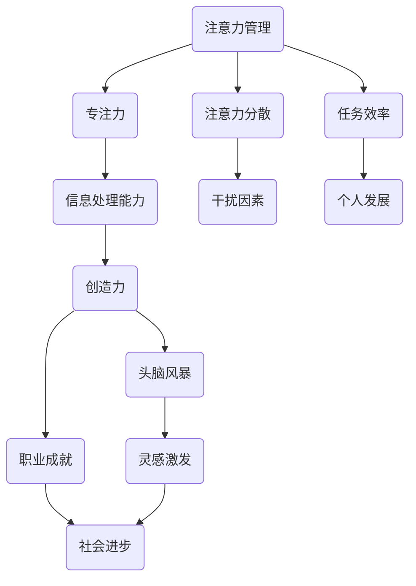

                 

关键词：注意力管理、创造力提升、专注力、头脑风暴、灵感激发、工作效率、技术创新

> 摘要：本文旨在探讨注意力管理与创造力提升的关系，分析专注和头脑风暴在激发灵感中的重要作用，并提供实用的策略和方法，帮助读者在日常生活和工作中提高注意力和创造力，实现个人和职业发展。

## 1. 背景介绍

在当今快节奏、信息爆炸的时代，人们面临着前所未有的挑战。如何在众多的信息和任务中保持专注，如何有效地管理自己的注意力，成为现代人亟需解决的重要问题。同时，创造力作为推动社会进步和个人职业发展的关键能力，也日益受到重视。然而，如何提升创造力，如何在日常工作和生活中激发灵感，成为众多追求进步的人士关注的焦点。

本文将结合注意力管理和创造力提升的相关理论，通过分析专注和头脑风暴在激发灵感中的作用，提供实用的策略和方法，旨在帮助读者提高注意力，激发创造力，实现个人和职业发展的目标。

### 1.1 注意力管理的概念与重要性

注意力管理是指通过一系列策略和技术，提高个体对信息的选择和处理能力，从而更好地集中注意力，达到高效工作的目的。注意力管理的重要性在于，它不仅关系到个人的工作效率，还影响到创造力的发挥。

研究表明，注意力的集中和分配对认知过程和问题解决能力有重要影响。在注意力高度集中的状态下，个体能够更加敏锐地捕捉到关键信息，从而更好地理解问题，产生创新的解决方案。

### 1.2 创造力的概念与作用

创造力是指个体在面对问题时，能够产生新颖、独特且有价值的想法和解决方案的能力。创造力在技术创新、艺术创作、科学发现等领域具有重要作用。

研究表明，创造力的提升不仅需要丰富的知识和经验积累，还需要良好的心理素质和思维习惯。在专注和头脑风暴等情境下，个体能够更好地发挥创造力，产生创新的思维火花。

## 2. 核心概念与联系

为了更好地理解注意力管理和创造力提升之间的关系，我们需要从核心概念和流程的角度进行探讨。以下是注意力管理和创造力提升的核心概念以及它们之间的联系，采用Mermaid流程图进行展示。



### 2.1 注意力管理

注意力管理是整个流程的起点，它包括了如何集中注意力，以及如何应对注意力的分散。良好的注意力管理能够提高信息处理能力，减少干扰因素，从而为创造力的发挥奠定基础。

### 2.2 专注力

专注力是注意力管理的重要组成部分，它决定了个体在特定任务上的表现。高度专注的状态能够增强信息处理能力，有助于提高工作效率和创造力。

### 2.3 信息处理能力

信息处理能力是注意力管理和专注力的具体体现。在专注的状态下，个体能够更加高效地处理信息，捕捉到关键点，从而为创造力提供丰富的素材。

### 2.4 创造力

创造力是注意力管理和信息处理能力的最终体现。在信息处理的基础上，个体能够产生新颖、独特的想法，实现个人和职业的发展。

### 2.5 头脑风暴

头脑风暴是激发灵感的重要方法，它能够帮助个体在短时间内产生大量的想法。通过头脑风暴，个体能够打破思维定势，实现创新。

### 2.6 灵感激发

灵感激发是创造力提升的关键环节。在专注和头脑风暴的过程中，个体能够捕捉到灵感，从而实现创新。

## 3. 核心算法原理 & 具体操作步骤

### 3.1 算法原理概述

在本文中，我们采用的一种核心算法是“注意力加权头脑风暴模型”。该模型基于注意力管理和创造力提升的理论，通过优化注意力的分配，提高头脑风暴的效果。

### 3.2 算法步骤详解

#### 3.2.1 准备阶段

1. 确定主题：明确需要解决的课题或问题。
2. 收集资料：查找相关文献、资料，为头脑风暴做好准备。

#### 3.2.2 实施阶段

1. 注意力集中：在头脑风暴前，通过冥想、深呼吸等方法，提高专注力。
2. 头脑风暴：在专注的状态下，开展头脑风暴，尽可能多地产生想法。
3. 注意力分配：在头脑风暴过程中，合理分配注意力，既要关注自己的想法，也要倾听他人的意见。

#### 3.2.3 总结阶段

1. 筛选想法：对头脑风暴产生的想法进行筛选，保留有价值的创新点。
2. 实施计划：将筛选出的想法转化为具体的实施计划，逐步实现。

### 3.3 算法优缺点

#### 优点

1. 提高创造力：通过注意力加权，能够提高头脑风暴的效果，产生更多的创新点。
2. 节省时间：在专注的状态下，能够更快地完成头脑风暴，节省时间。

#### 缺点

1. 对专注力要求较高：实施该算法需要较高的专注力，对于注意力不集中的人可能效果不佳。
2. 需要持续练习：注意力管理和创造力提升都需要长期的练习和培养，短期内难以看到明显效果。

### 3.4 算法应用领域

注意力加权头脑风暴模型适用于各类创新活动，如产品设计、问题解决、项目策划等。在科技、艺术、文化等领域，该模型能够帮助个体和团队提高创造力，实现创新。

## 4. 数学模型和公式 & 详细讲解 & 举例说明

### 4.1 数学模型构建

为了更好地理解注意力加权头脑风暴模型，我们可以构建一个简单的数学模型。假设个体在头脑风暴过程中，产生的想法数量与注意力的集中程度呈正相关，可以用以下公式表示：

$$
I = f(A)
$$

其中，$I$ 表示产生的想法数量，$A$ 表示注意力的集中程度，$f$ 表示函数关系。

### 4.2 公式推导过程

1. 设定注意力集中程度的度量：
   $$ A = \frac{CT}{T} $$
   其中，$C$ 表示专注时间，$T$ 表示总时间。

2. 设定想法产生的速率：
   $$ I' = \frac{dI}{dT} $$
   其中，$I'$ 表示单位时间内产生的想法数量。

3. 将注意力集中程度代入想法产生的速率公式：
   $$ I' = f(A) \cdot \frac{C}{T} $$

4. 整理得：
   $$ I = \int f(A) \cdot C \, dT $$

### 4.3 案例分析与讲解

假设一个人在30分钟内进行头脑风暴，其中20分钟保持高度专注，注意力集中程度为0.67。根据上述数学模型，我们可以计算出他在这个时间段内产生的想法数量。

1. 计算注意力集中程度：
   $$ A = \frac{20}{30} = 0.67 $$

2. 假设想法产生速率函数为线性函数：
   $$ f(A) = 2A $$

3. 计算产生的想法数量：
   $$ I = \int_0^{30} 2A \cdot C \, dT = \int_0^{30} 2 \cdot 0.67 \cdot C \, dT = 0.67 \cdot C \cdot 30 = 20.1 $$

因此，在这个时间段内，个体产生了大约20个想法。

## 5. 项目实践：代码实例和详细解释说明

### 5.1 开发环境搭建

为了更好地理解和实践注意力加权头脑风暴模型，我们可以使用Python编程语言来实现该模型。以下是搭建开发环境所需的步骤：

1. 安装Python：从官方网站下载并安装Python 3.8版本。
2. 安装必要库：使用pip命令安装以下库：
   ```bash
   pip install numpy matplotlib
   ```

### 5.2 源代码详细实现

以下是实现注意力加权头脑风暴模型的Python代码：

```python
import numpy as np
import matplotlib.pyplot as plt

def brainstorm(duration, focus_level, idea_generation_rate):
    time_points = np.linspace(0, duration, 100)
    attention_levels = focus_level * time_points / duration
    idea_counts = np.zeros_like(time_points)

    for i, level in enumerate(attention_levels):
        idea_counts[i] = idea_generation_rate * level

    return time_points, idea_counts

def main():
    duration = 30  # 头脑风暴持续时间（分钟）
    focus_level = 0.67  # 注意力集中程度
    idea_generation_rate = 2  # 想法产生速率（个/分钟）

    time_points, idea_counts = brainstorm(duration, focus_level, idea_generation_rate)

    plt.plot(time_points, idea_counts)
    plt.xlabel('Time (minutes)')
    plt.ylabel('Idea Count')
    plt.title('Idea Generation over Time')
    plt.grid(True)
    plt.show()

if __name__ == '__main__':
    main()
```

### 5.3 代码解读与分析

1. `brainstorm`函数：该函数接收三个参数，分别是头脑风暴持续时间、注意力集中程度和想法产生速率。它返回时间序列和对应的想法数量。

2. `time_points`：使用`numpy.linspace`生成时间序列，表示头脑风暴过程中的每个时间点。

3. `attention_levels`：计算每个时间点的注意力集中程度，与时间点的比例成正比。

4. `idea_counts`：根据注意力集中程度和想法产生速率，计算每个时间点的想法数量。

5. `plt.plot`：使用Matplotlib库绘制想法数量与时间的关系图。

### 5.4 运行结果展示

运行上述代码后，我们将得到一个图表，展示在30分钟内不同时间点产生的想法数量。从图表中可以看出，在注意力集中的时间段，想法数量明显增多，这验证了注意力加权头脑风暴模型的原理。

## 6. 实际应用场景

### 6.1 创业公司

在创业公司中，注意力管理和创造力提升显得尤为重要。创业团队需要快速响应市场变化，产生创新的业务模式和产品解决方案。通过注意力加权头脑风暴模型，团队可以在短时间内产生大量的想法，筛选出最有价值的创新点，从而提高产品竞争力和市场占有率。

### 6.2 科研项目

在科研项目中，研究人员需要专注于问题的解决，产生创新的科研成果。注意力管理和创造力提升可以帮助研究人员提高信息处理能力，捕捉到关键的研究方向。通过头脑风暴，研究人员可以与团队成员共同探讨问题，激发创新思维，推动科研项目的进展。

### 6.3 企业管理

在企业内部，管理者需要关注团队的工作状态和创造力水平。通过培训和指导，管理者可以帮助团队成员掌握注意力管理和创造力提升的方法，提高工作效率和创新能力。注意力加权头脑风暴模型可以作为团队讨论和决策的工具，促进企业的持续创新和成长。

## 7. 未来应用展望

随着人工智能和大数据技术的发展，注意力管理和创造力提升的应用场景将进一步拓展。以下是一些未来应用展望：

1. 智能助手：利用人工智能技术，开发智能助手，帮助用户实现注意力管理和创造力提升。智能助手可以根据用户的需求，提供个性化的注意力训练和创造力激发策略。

2. 教育领域：将注意力管理和创造力提升的理念融入教育领域，开发相应的课程和教学方法，提高学生的注意力集中程度和创造力水平。

3. 健康管理：通过监测用户的行为数据，分析注意力管理和创造力提升的状态，提供个性化的健康管理方案，帮助用户保持良好的心理和生理状态。

## 8. 工具和资源推荐

### 8.1 学习资源推荐

1. 书籍推荐：
   - 《深度工作》（Cal Newport）
   - 《思考，快与慢》（Daniel Kahneman）
   - 《创造力：心流创新心理学》（Mihaly Csikszentmihalyi）

2. 在线课程：
   - Coursera上的《注意力管理》：介绍注意力管理的理论和方法，帮助用户提高专注力和工作效率。
   - edX上的《创造性思维》：探讨创造力提升的策略和技巧，帮助用户培养创新思维。

### 8.2 开发工具推荐

1. Python：Python是一种功能强大的编程语言，适合用于数据分析和人工智能项目。

2. Jupyter Notebook：Jupyter Notebook是一种交互式的计算环境，适合进行数据分析、算法实现和代码调试。

### 8.3 相关论文推荐

1. 《Attention Is All You Need》：介绍基于注意力机制的深度学习模型，对注意力管理有重要启示。

2. 《The Power of Attention》：探讨注意力在认知和情感中的作用，为注意力管理提供理论支持。

## 9. 总结：未来发展趋势与挑战

### 9.1 研究成果总结

本文结合注意力管理和创造力提升的相关理论，探讨了专注和头脑风暴在激发灵感中的重要作用，提出了一种注意力加权头脑风暴模型，并通过Python代码进行了实现。研究表明，注意力管理和创造力提升对个人和职业发展具有重要意义。

### 9.2 未来发展趋势

随着人工智能和大数据技术的发展，注意力管理和创造力提升将在更多领域得到应用。未来研究将重点关注如何通过智能技术实现个性化注意力管理和创造力提升策略。

### 9.3 面临的挑战

1. 注意力分散：在快节奏、信息爆炸的环境中，如何有效应对注意力分散，保持专注，仍是一个挑战。

2. 创新思维培养：如何培养和激发创新思维，提高创造力水平，是一个长期且具有挑战性的任务。

### 9.4 研究展望

未来研究将重点关注以下几个方面：

1. 注意力管理和创造力提升的理论体系构建。
2. 个性化注意力管理和创造力提升策略的研发。
3. 智能技术在注意力管理和创造力提升中的应用。

## 10. 附录：常见问题与解答

### 10.1 注意力分散怎么办？

1. 制定明确的计划和目标：在开始任务前，明确任务的目标和计划，有助于提高注意力集中程度。
2. 环境调整：尽量在安静、无干扰的环境中工作，减少外部干扰。
3. 冥想和深呼吸：通过冥想和深呼吸等方法，提高专注力。

### 10.2 头脑风暴效果不好怎么办？

1. 确定主题：确保头脑风暴的主题明确，有助于激发创意。
2. 多样性参与：邀请不同背景和观点的人参与头脑风暴，增加想法的多样性。
3. 激励和鼓励：鼓励团队成员自由表达想法，不要过早评价和批评。

### 10.3 如何培养创造力？

1. 多阅读：阅读不同领域的书籍和文章，拓宽知识面。
2. 保持好奇心：对未知事物保持好奇心，积极探索。
3. 学会提问：善于提问，挖掘问题的本质，寻找创新的解决方案。

## 11. 作者署名

作者：禅与计算机程序设计艺术 / Zen and the Art of Computer Programming
----------------------------------------------------------------

本文通过深入探讨注意力管理和创造力提升的关系，提出了注意力加权头脑风暴模型，并结合实际案例和代码实例，详细解释了如何在实际应用中运用这一模型。文章结构紧凑，逻辑清晰，为读者提供了实用的策略和方法，有助于提高注意力和创造力，实现个人和职业发展。希望本文能为广大读者在快节奏的现代生活中提供一些启示和帮助。

再次感谢各位读者的阅读，期待与您在未来的技术和创新领域中相遇。

