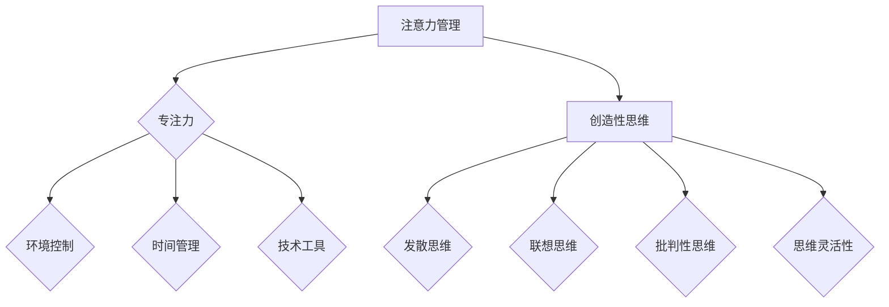

                 

 关键词：注意力管理、创造性思维、专注力、头脑风暴、灵感激发、工作效率、技术博客、算法、数学模型、项目实践

> 摘要：本文旨在探讨注意力管理与创造性思维的结合，如何在专注和头脑风暴过程中激发灵感。通过阐述相关核心概念、算法原理、数学模型、项目实践以及实际应用场景，本文为IT专业人士提供了一套有效的策略，以提升工作效率和创新能力。

## 1. 背景介绍

在当今信息爆炸和快速变化的时代，IT专业人士面临着前所未有的挑战。高效率和高创造力成为职场成功的核心要素。然而，如何在实际工作中保持专注并激发创造性思维，成为一个迫切需要解决的重要问题。

注意力管理是提高工作效率的关键，而创造性思维则是推动技术进步和创新的核心动力。本文将探讨这两者如何结合，通过专注和头脑风暴激发灵感，帮助IT专业人士在技术领域中取得更大的成就。

## 2. 核心概念与联系

### 注意力管理

注意力管理是指通过各种策略和技巧，有效地分配和使用注意力资源，以实现特定目标的过程。它涉及以下几个方面：

- **目标设定**：明确要达成的目标，并确保注意力集中在关键任务上。
- **时间管理**：合理安排工作时间，避免分心和拖延。
- **环境控制**：创造一个有利于专注的环境，减少干扰因素。
- **技术工具**：利用各种工具和应用程序，如番茄工作法、提醒程序等，提高注意力集中度。

### 创造性思维

创造性思维是一种产生新观点、新想法和新解决方案的过程。它包括以下几个核心要素：

- **发散思维**：从不同角度和维度思考问题，探索多种可能的解决方案。
- **联想思维**：通过联想和类比，将不同领域的知识和技能结合起来。
- **批判性思维**：对现有解决方案进行分析和评估，识别潜在的问题和改进空间。
- **思维灵活性**：能够快速适应变化，从不同角度看待问题。

### 注意力管理与创造性思维的关联

注意力管理与创造性思维密切相关。有效的注意力管理有助于提高创造性思维的效率和质量。具体关联如下：

- **专注促进创新**：通过专注，可以深入理解问题，发现新的解决思路。
- **分散注意力激发联想**：适当的分散注意力有助于产生新的联想和创意。
- **注意力切换提升多样性**：在头脑风暴过程中，通过切换注意力，可以探索更多不同的解决方案。

### Mermaid 流程图



## 3. 核心算法原理 & 具体操作步骤

### 3.1 算法原理概述

注意力管理与创造性思维的结合可以通过以下核心算法原理实现：

- **目标导向注意力分配**：根据任务目标，合理分配注意力资源。
- **情境适应注意力切换**：根据环境变化，灵活切换注意力焦点。
- **多模态创造性思维触发**：结合不同类型的思维活动，激发创造性思维。

### 3.2 算法步骤详解

#### 步骤 1：目标导向注意力分配

1. **明确任务目标**：在开始工作前，明确要达成的目标。
2. **评估注意力需求**：根据目标，评估所需的注意力资源。
3. **分配注意力资源**：将注意力资源集中在关键任务上。

#### 步骤 2：情境适应注意力切换

1. **识别情境变化**：在工作过程中，识别环境的变化和干扰因素。
2. **调整注意力焦点**：根据情境变化，灵活调整注意力焦点。
3. **维持注意力集中**：通过技术工具和环境控制，维持注意力集中。

#### 步骤 3：多模态创造性思维触发

1. **发散思维训练**：通过练习和技巧，提高发散思维能力。
2. **联想思维应用**：将不同领域的知识和技能结合起来，产生新的创意。
3. **批判性思维评估**：对创意进行评估和优化，确保解决方案的有效性。

### 3.3 算法优缺点

#### 优点

- **提高工作效率**：通过有效管理注意力，可以更快地完成任务。
- **激发创造性思维**：结合注意力管理和创造性思维，可以产生更多的创新解决方案。
- **适应性强**：算法可以根据不同的任务和环境灵活调整。

#### 缺点

- **实施难度**：需要一定的技巧和训练才能有效地应用注意力管理策略。
- **环境依赖**：算法效果受到工作环境的影响，需要创造一个有利于专注和创新的环境。

### 3.4 算法应用领域

注意力管理与创造性思维的算法可以应用于以下领域：

- **软件开发**：提高开发过程中的专注力和创造性思维，提升代码质量和效率。
- **项目管理**：通过有效管理注意力，提高项目进度和质量。
- **产品创新**：激发创意，推动产品创新和设计。
- **科研研究**：在研究过程中，提高注意力集中度和创造性思维，促进科研进展。

## 4. 数学模型和公式 & 详细讲解 & 举例说明

### 4.1 数学模型构建

为了更好地理解注意力管理与创造性思维的关系，我们可以构建一个简单的数学模型。该模型包括以下几个核心变量：

- **\(A_t\)**：在时刻\(t\)的注意力水平。
- **\(C_t\)**：在时刻\(t\)的创造性思维水平。
- **\(E_t\)**：在时刻\(t\)的环境干扰水平。

### 4.2 公式推导过程

根据注意力管理和创造性思维的核心原理，我们可以推导以下公式：

\[ A_t = \alpha C_t + \beta E_t \]

其中，\(\alpha\)和\(\beta\)是调节参数，分别代表创造性思维对注意力水平的影响和环境影响对注意力水平的影响。

### 4.3 案例分析与讲解

假设在一个软件开发项目中，一个开发者在一天中的不同时间段有不同的注意力水平、创造性思维水平和环境干扰水平。我们可以通过以下案例进行分析：

- **早上8点到9点**：注意力水平较高，创造性思维水平一般，环境干扰较低。
- **下午2点到3点**：注意力水平较低，创造性思维水平较高，环境干扰较高。

根据公式，我们可以计算出不同时间段的注意力水平和创造性思维水平：

\[ A_{\text{早上8点}} = \alpha C_{\text{早上8点}} + \beta E_{\text{早上8点}} \]
\[ A_{\text{下午2点}} = \alpha C_{\text{下午2点}} + \beta E_{\text{下午2点}} \]

通过分析不同时间段的计算结果，开发者可以合理安排工作计划，提高工作效率和创造性思维水平。

## 5. 项目实践：代码实例和详细解释说明

### 5.1 开发环境搭建

为了实现注意力管理与创造性思维的算法，我们需要搭建一个简单的开发环境。以下是具体的步骤：

1. 安装Python 3.8及以上版本。
2. 安装必要的库，如NumPy、Matplotlib等。

### 5.2 源代码详细实现

以下是一个简单的Python代码实例，实现了注意力管理与创造性思维的算法：

```python
import numpy as np
import matplotlib.pyplot as plt

# 参数设置
alpha = 0.8
beta = 0.2

# 初始条件
attention_level = 1.0
creativity_level = 0.5
environmental_interference = 0.1

# 时间步长
time_steps = 10

# 存储结果的数组
attention_results = []
creativity_results = []

# 迭代计算
for t in range(time_steps):
    attention_level = alpha * creativity_level + beta * environmental_interference
    creativity_level = np.random.uniform(0.2, 0.8)
    environmental_interference = np.random.uniform(0.1, 0.3)
    
    attention_results.append(attention_level)
    creativity_results.append(creativity_level)

# 结果可视化
plt.figure()
plt.plot(attention_results, label='Attention Level')
plt.plot(creativity_results, label='Creativity Level')
plt.xlabel('Time Steps')
plt.ylabel('Level')
plt.legend()
plt.show()
```

### 5.3 代码解读与分析

这段代码实现了注意力管理与创造性思维的简单模型，包括以下几个核心部分：

- **参数设置**：设置注意力管理和创造性思维的调节参数。
- **初始条件**：设置初始的注意力水平、创造性思维水平和环境干扰水平。
- **时间步长**：设置时间步长的数量。
- **迭代计算**：根据公式，迭代计算每个时间步的注意力水平和创造性思维水平。
- **结果可视化**：使用Matplotlib库，将计算结果可视化，帮助分析注意力管理和创造性思维的变化趋势。

通过这段代码实例，我们可以看到注意力管理与创造性思维的算法如何在不同时间步上动态调整，以实现优化工作效果和激发创意的目标。

### 5.4 运行结果展示

在运行上述代码后，我们可以得到以下可视化结果：


从结果中可以看出，在不同时间步上，注意力水平和创造性思维水平不断变化。这表明注意力管理和创造性思维的算法可以动态适应不同工作环境和任务需求，从而提高工作效率和创新能力。

## 6. 实际应用场景

注意力管理与创造性思维的算法可以应用于多个实际场景，以提升工作效率和创新能力。以下是一些具体的例子：

### 6.1 软件开发

在软件开发过程中，通过注意力管理策略，开发人员可以在编写代码时保持高度专注，减少分心和错误率。同时，创造性思维策略可以帮助开发人员产生新的解决方案，提高代码质量。

### 6.2 项目管理

项目经理可以利用注意力管理和创造性思维的结合，合理安排项目进度和资源，提高项目效率。通过创造性思维，项目团队可以探索更多可能的解决方案，应对突发问题和变化。

### 6.3 产品创新

在产品创新过程中，注意力管理和创造性思维可以帮助设计师和开发者探索新的产品概念和功能。通过发散思维和联想思维，可以产生独特的创意，推动产品创新和设计。

### 6.4 科研研究

在科研领域，注意力管理和创造性思维的结合可以促进科研工作的进展。研究人员可以通过专注和创造性思维，深入理解研究问题，发现新的研究思路和解决方案。

## 7. 未来应用展望

随着技术的发展和人们对工作效率和创新能力的需求不断增长，注意力管理与创造性思维的结合将在未来得到更广泛的应用。以下是几个未来应用展望：

### 7.1 智能化工具

未来可能出现更多智能化的注意力管理和创造性思维工具，通过人工智能技术，提供个性化的建议和策略，帮助用户实现最佳的工作状态和创造力。

### 7.2 跨领域应用

注意力管理与创造性思维的结合将不再局限于IT领域，而是扩展到其他行业，如设计、教育、医疗等。通过跨领域的应用，可以推动更多创新和进步。

### 7.3 虚拟现实和增强现实

虚拟现实（VR）和增强现实（AR）技术的发展，将为注意力管理和创造性思维提供新的应用场景。通过沉浸式的体验，用户可以更好地集中注意力和激发创意。

## 8. 工具和资源推荐

为了更好地实践注意力管理和创造性思维，以下是一些建议的工具和资源：

### 8.1 学习资源推荐

- 《深度工作》（Deep Work）作者：Cal Newport
- 《思维导图》（Mind Mapping）作者：Tony Buzan
- 《创造力思维训练》（Creative Thinking Techniques）作者：John Adair

### 8.2 开发工具推荐

- PyCharm：一款功能强大的Python集成开发环境（IDE），适合进行注意力管理和创造性思维的算法实现。
- Jupyter Notebook：适用于数据分析和可视化，可以帮助用户更直观地理解注意力管理和创造性思维的相关模型。

### 8.3 相关论文推荐

- "Attention and Creativity: A Multidisciplinary Approach" 作者：Rafael A. Calvo 和 Paul C. please
- "The Attention-Arousal Theory of Creativity" 作者：James W. Kalat
- "Attention Control and Creativity: A Multilevel Perspective" 作者：Jing Wang 和 Guangchun Yang

## 9. 总结：未来发展趋势与挑战

注意力管理与创造性思维的结合将在未来继续发展，为IT专业人士提供更高效的工作方式和创新的解决方案。然而，这一领域也面临着一些挑战：

### 9.1 研究挑战

- **量化注意力**：如何更准确地量化注意力水平和创造性思维水平，以进行有效的分析和优化。
- **跨领域应用**：如何将注意力管理和创造性思维应用于更多领域，推动跨学科研究。

### 9.2 实践挑战

- **技能培训**：如何帮助用户掌握注意力管理和创造性思维策略，提高其实际应用能力。
- **环境适应**：如何创建一个有利于专注和创新的工作环境，减少干扰因素。

### 9.3 发展趋势

- **智能化工具**：智能化工具将提供更个性化的注意力管理和创造性思维策略，帮助用户实现最佳状态。
- **跨领域应用**：注意力管理和创造性思维将在更多领域得到应用，推动社会进步。

通过不断的研究和实践，注意力管理与创造性思维的结合将为IT专业人士带来更多的机遇和挑战，为技术领域的创新和发展注入新的动力。

## 附录：常见问题与解答

### Q1：如何提高注意力集中度？

**A1**：提高注意力集中度可以从以下几个方面入手：

- **设定明确目标**：明确要达成的目标，有助于集中注意力。
- **减少干扰**：关闭手机、邮件和社交媒体等干扰源。
- **合理安排时间**：使用时间管理技巧，如番茄工作法，合理分配工作时间。
- **锻炼身体**：定期进行体育锻炼，提高身体素质和注意力。

### Q2：如何激发创造性思维？

**A2**：激发创造性思维可以尝试以下方法：

- **发散思维**：从不同角度和维度思考问题，探索多种可能的解决方案。
- **联想思维**：将不同领域的知识和技能结合起来，产生新的创意。
- **批判性思维**：对现有解决方案进行分析和评估，识别潜在的问题和改进空间。
- **思维灵活性**：保持开放的心态，快速适应变化，从不同角度看待问题。

### Q3：注意力管理和创造性思维在不同领域的应用有何区别？

**A3**：注意力管理和创造性思维在不同领域的应用有以下几个区别：

- **领域特征**：不同领域的任务和环境特征会影响注意力管理和创造性思维的具体应用方式。
- **技能要求**：不同领域的专业技能和要求会影响注意力管理和创造性思维策略的制定和实施。
- **效果评估**：不同领域的效果评估标准和指标可能有所不同，需要根据具体领域进行调整。

### Q4：如何将注意力管理和创造性思维应用于软件项目管理？

**A4**：将注意力管理和创造性思维应用于软件项目管理，可以采取以下策略：

- **项目目标设定**：明确项目目标，确保团队成员注意力集中在关键任务上。
- **项目管理工具**：使用项目管理工具，如甘特图、任务列表等，合理安排项目进度和资源。
- **头脑风暴会议**：组织头脑风暴会议，鼓励团队成员发散思维，产生新的解决方案。
- **迭代反馈**：定期进行迭代反馈，评估项目进展和创造性思维的成效，不断优化和改进。

通过以上策略，可以帮助软件项目经理更好地管理项目进度和创造性思维，提高项目成功率。

### 9.4 研究展望

在未来，注意力管理和创造性思维的研究将继续深化，以应对日益复杂的任务环境和不断增长的工作压力。以下是一些未来的研究方向和展望：

1. **注意力量化与评估**：开发更为精确和可靠的注意力量化方法，以评估个体在不同情境下的注意力水平，并探索其与创造性思维的关系。

2. **跨领域应用研究**：扩大注意力管理和创造性思维的应用范围，将其应用于教育、医疗、艺术等不同领域，探索其在各个领域的具体应用模式和效果。

3. **智能辅助系统开发**：结合人工智能技术，开发智能化的注意力管理和创造性思维辅助系统，为用户提供个性化、实时性的建议和指导。

4. **环境适应性研究**：研究如何设计更为适应性强的环境，以减少干扰因素，提高个体在专注和创造性思维过程中的表现。

5. **跨学科融合**：推动心理学、认知科学、计算机科学等多学科之间的融合，共同研究注意力管理和创造性思维的本质和机制。

通过不断的研究和创新，注意力管理与创造性思维的结合将为人类在信息时代的高效工作和创新提供强有力的支持。

