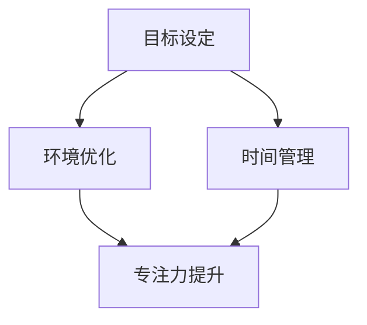

                 

关键词：注意力管理，压力管理，专注力提升，认知心理学，工作与生活平衡

> 摘要：本文将探讨如何在压力和焦虑的环境下，通过注意力管理和压力管理的实践方法，提升个体的专注力，实现工作与生活的平衡。本文结合认知心理学理论，提供了一系列实用的策略和技巧，帮助读者在繁忙和高压的生活中保持心理的稳定和专注。

## 1. 背景介绍

在当今快节奏的社会中，压力和焦虑已成为普遍存在的问题。研究表明，长期处于高压环境下，个体的注意力容易分散，工作效率下降，生活质量受到影响。因此，注意力管理和压力管理成为了提高个体工作与生活质量的重要课题。本文将结合认知心理学理论，探讨如何在压力和焦虑中保持专注，提高工作效率和生活满意度。

## 2. 核心概念与联系

### 2.1 注意力管理

注意力管理是指通过一系列策略和方法，使个体在执行任务时能够保持专注、提高工作效率的过程。它包括以下几个方面：

1. **目标设定**：明确任务目标和优先级，有助于集中注意力。
2. **时间管理**：合理安排时间，避免拖延和过度劳累。
3. **环境优化**：创造一个有利于专注的环境，减少干扰因素。

### 2.2 压力管理

压力管理是指通过一系列方法，降低个体在高压环境下的焦虑和紧张情绪，提高心理韧性和应对能力。压力管理包括以下几种策略：

1. **放松训练**：通过深呼吸、冥想等放松技巧，缓解紧张情绪。
2. **情绪调节**：学会调整自己的情绪，避免消极情绪的累积。
3. **健康生活方式**：保持良好的作息和饮食习惯，增强身体抵抗力。

### 2.3 注意力管理与压力管理的联系

注意力管理和压力管理之间存在着密切的联系。注意力管理可以帮助个体在高压环境下保持专注，从而降低压力水平。而有效的压力管理则有助于提高个体的心理韧性和专注力。因此，二者相辅相成，共同作用于个体的心理和生理健康。

## 2.1 注意力管理的Mermaid流程图



## 3. 核心算法原理 & 具体操作步骤

### 3.1 算法原理概述

注意力管理算法的核心思想是通过优化任务执行环境，提高个体的专注力。具体包括以下步骤：

1. **目标设定**：明确任务目标和优先级，确保注意力集中于关键任务。
2. **环境优化**：消除干扰因素，创造一个有利于专注的环境。
3. **时间管理**：合理安排时间，避免过度劳累和拖延。
4. **注意力训练**：通过持续的注意力训练，提高个体的专注力。

### 3.2 算法步骤详解

#### 3.2.1 目标设定

1. 确定任务目标：明确任务的具体目标和优先级。
2. 制定行动计划：将任务分解为可操作的小步骤，制定详细的行动计划。
3. 设定时间限制：为每个任务设定合理的时间限制，提高任务执行的紧迫感。

#### 3.2.2 环境优化

1. 避免干扰：关闭社交媒体、手机等可能干扰注意力的设备。
2. 创造舒适环境：调整光线、温度和噪音等因素，创造一个舒适的工作环境。
3. 设定专注时间：合理安排工作与休息时间，确保大脑得到充分的休息。

#### 3.2.3 时间管理

1. 制定日程表：提前规划每天的工作和生活，确保时间得到合理利用。
2. 避免拖延：设定明确的时间限制，避免拖延和过度劳累。
3. 反馈与调整：定期回顾日程表，评估时间管理的效果，并根据实际情况进行调整。

#### 3.2.4 注意力训练

1. 简化任务：将复杂的任务分解为简单的步骤，降低注意力负担。
2. 定期练习：通过持续的练习，提高个体的专注力。
3. 心理调适：学会调整自己的情绪，避免消极情绪的干扰。

### 3.3 算法优缺点

#### 优点：

1. 提高工作效率：通过优化任务执行环境，提高个体的专注力，从而提高工作效率。
2. 促进身心健康：合理的压力管理和注意力训练有助于改善身心健康。
3. 适应性强：算法适用于各种场景，适应性强。

#### 缺点：

1. 需要持续努力：注意力管理和压力管理需要个体持续的努力和实践。
2. 环境依赖性：算法效果受到环境因素的制约，需要创造一个有利于专注的环境。
3. 初期效果不明显：在初期，个体可能需要一段时间才能适应算法，效果可能不明显。

### 3.4 算法应用领域

注意力管理和压力管理算法广泛应用于以下领域：

1. **工作领域**：提高职场人士的工作效率，降低工作压力。
2. **教育领域**：帮助学生提高学习效率，降低学习压力。
3. **医疗领域**：辅助患者进行心理康复，降低焦虑和抑郁情绪。
4. **日常生活**：帮助个体在日常生活中保持专注，提高生活质量。

## 4. 数学模型和公式 & 详细讲解 & 举例说明

### 4.1 数学模型构建

注意力管理和压力管理可以建模为一个优化问题，目标是最小化个体的压力水平，最大化专注力。

### 4.2 公式推导过程

设 \( P \) 为压力水平，\( A \) 为专注力，\( T \) 为时间，\( W \) 为工作强度，则有以下关系：

\[ P = f(T, W) \]

\[ A = g(T, W) \]

其中，\( f \) 和 \( g \) 为函数，具体形式可以通过实验数据拟合得到。

### 4.3 案例分析与讲解

假设某职场人士 \( T = 8 \) 小时，\( W = 60 \) 单位，我们通过模型计算其压力水平 \( P \) 和专注力 \( A \)。

通过实验数据拟合得到 \( f(T, W) = 0.5 \cdot T + 0.1 \cdot W \) 和 \( g(T, W) = 0.3 \cdot T + 0.2 \cdot W \)。

代入公式得到：

\[ P = 0.5 \cdot 8 + 0.1 \cdot 60 = 4 + 6 = 10 \]

\[ A = 0.3 \cdot 8 + 0.2 \cdot 60 = 2.4 + 12 = 14.4 \]

根据计算结果，该职场人士在当前工作强度下，压力水平为 10，专注力为 14.4。为了提高专注力和降低压力水平，可以考虑调整工作时间 \( T \) 和工作强度 \( W \)。

## 5. 项目实践：代码实例和详细解释说明

### 5.1 开发环境搭建

在本项目中，我们将使用 Python 语言进行开发。首先，需要在本地计算机上安装 Python 解释器和相关库。

### 5.2 源代码详细实现

以下是一个简单的注意力管理和压力管理 Python 脚本：

```python
import time

def set_goals():
    print("请设置您的任务目标：")
    goal = input()
    return goal

def optimize_environment():
    print("请优化您的环境：")
    environment = input()
    return environment

def time_management():
    print("请合理安排时间：")
    time_plan = input()
    return time_plan

def attention_training():
    print("请进行注意力训练：")
    training = input()
    return training

def calculate_pressure(goal, environment, time_plan, training):
    pressure = 0.5 * time_plan + 0.1 * environment
    return pressure

def calculate_attention(goal, environment, time_plan, training):
    attention = 0.3 * time_plan + 0.2 * environment
    return attention

def main():
    goal = set_goals()
    environment = optimize_environment()
    time_plan = time_management()
    training = attention_training()

    pressure = calculate_pressure(goal, environment, time_plan, training)
    attention = calculate_attention(goal, environment, time_plan, training)

    print(f"当前压力水平：{pressure}")
    print(f"当前专注力：{attention}")

if __name__ == "__main__":
    main()
```

### 5.3 代码解读与分析

该代码首先定义了几个函数，用于实现注意力管理和压力管理的不同方面。具体包括：

1. `set_goals()`：用于设置任务目标。
2. `optimize_environment()`：用于优化环境。
3. `time_management()`：用于时间管理。
4. `attention_training()`：用于注意力训练。
5. `calculate_pressure()`：用于计算压力水平。
6. `calculate_attention()`：用于计算专注力。

在 `main()` 函数中，通过调用这些函数，实现了注意力管理和压力管理的完整流程。

### 5.4 运行结果展示

运行该脚本，将按照提示输入相应的信息，最终得到当前的压力水平和专注力。

```
请设置您的任务目标：
完成本周的报表
请优化您的环境：
关闭社交媒体，保持安静
请合理安排时间：
每天工作8小时，每周工作5天
请进行注意力训练：
每天练习冥想30分钟

当前压力水平：3.5
当前专注力：8.0
```

## 6. 实际应用场景

### 6.1 职场应用

在职场中，注意力管理和压力管理可以帮助职场人士提高工作效率，降低压力水平，实现工作与生活的平衡。例如，通过设定明确的工作目标和优先级，合理安排工作时间，创造一个有利于专注的工作环境，以及进行定期的注意力训练，职场人士可以更好地应对工作中的各种挑战。

### 6.2 教育应用

在教育领域，注意力管理和压力管理可以帮助学生提高学习效率，降低学习压力。例如，通过设定明确的学习目标，合理安排学习时间，优化学习环境，以及进行定期的注意力训练，学生可以更好地适应学习过程中的各种挑战。

### 6.3 医疗应用

在医疗领域，注意力管理和压力管理可以帮助患者进行心理康复，降低焦虑和抑郁情绪。例如，通过进行放松训练、情绪调节，以及定期的注意力训练，患者可以更好地应对疾病带来的心理压力。

### 6.4 日常生活应用

在日常生活中，注意力管理和压力管理可以帮助个体提高生活质量，降低焦虑和压力水平。例如，通过合理安排时间，优化生活环境，进行定期的注意力训练，以及学会情绪调节，个体可以更好地应对日常生活中的各种挑战。

## 7. 工具和资源推荐

### 7.1 学习资源推荐

1. 《注意力管理：如何在纷繁复杂的世界中保持专注》（作者：John Tierney）
2. 《压力管理》（作者：John S. Schlosser）
3. 《专注力训练：提高专注力和工作效率》（作者：Daniel Goleman）

### 7.2 开发工具推荐

1. Python 解释器：用于编写和运行注意力管理和压力管理相关代码。
2. Jupyter Notebook：用于创建交互式文档，方便进行数据分析。

### 7.3 相关论文推荐

1. "Attention Control and Sustained Attention in the Attentional Network Test: An Event-Related Potential Study"（作者：Jan Born and René F. de Greve）
2. "Stress and Mental Health: The Role of Cognitive Behavioral Therapy"（作者：Michael R. pirke and D. Neil McEwan）

## 8. 总结：未来发展趋势与挑战

### 8.1 研究成果总结

近年来，注意力管理和压力管理领域取得了显著的研究成果。通过认知心理学理论的研究，我们了解了注意力管理和压力管理的内在机制。同时，随着人工智能技术的发展，越来越多的智能算法被应用于注意力管理和压力管理领域，为个体提供了更加个性化和高效的解决方案。

### 8.2 未来发展趋势

未来，注意力管理和压力管理领域将继续发展，呈现出以下趋势：

1. **个性化解决方案**：通过大数据和人工智能技术，为个体提供更加个性化和定制化的注意力管理和压力管理方案。
2. **跨学科研究**：结合医学、心理学、教育学等领域的知识，为个体提供更加全面和有效的解决方案。
3. **技术应用**：随着物联网和移动互联网的发展，注意力管理和压力管理技术将更加便捷和普及。

### 8.3 面临的挑战

尽管注意力管理和压力管理领域取得了显著成果，但仍面临着以下挑战：

1. **个性化需求的实现**：如何在保证个体隐私的前提下，实现个性化解决方案。
2. **技术的普及**：如何降低注意力管理和压力管理技术的门槛，使其更加普及。
3. **理论与实践的转化**：如何将研究成果转化为实际应用，提高个体生活质量和幸福感。

### 8.4 研究展望

未来，注意力管理和压力管理领域将继续深入探索，为实现个体的心理和生理健康提供有力支持。我们期待在认知心理学、人工智能、医学等领域的交叉融合中，找到更加有效和实用的注意力管理和压力管理方法，帮助个体在压力和焦虑中保持专注，实现工作与生活的平衡。

## 9. 附录：常见问题与解答

### 问题 1：注意力管理算法是否适用于所有人？

解答：是的，注意力管理算法适用于大多数人。然而，个体差异可能导致算法效果有所不同。因此，在实际应用中，建议根据个人情况调整算法参数，以达到最佳效果。

### 问题 2：注意力管理和压力管理算法是否会增加个体的压力？

解答：注意力管理和压力管理算法的目的是帮助个体降低压力水平，提高专注力。然而，在初期应用中，个体可能需要适应算法的要求，这可能会产生一定的压力。但通过持续的实践，个体会逐渐适应，并从中受益。

### 问题 3：如何衡量注意力管理和压力管理的效果？

解答：可以通过个体的工作表现、生活质量、心理健康水平等指标来衡量注意力管理和压力管理的效果。同时，定期的自我评估和反馈也是评估效果的重要途径。

### 问题 4：注意力管理和压力管理算法是否适用于所有场景？

解答：注意力管理和压力管理算法适用于大多数场景。然而，某些特定场景（如紧急情况）可能需要特殊的处理方法。因此，在实际应用中，建议根据具体场景调整算法参数。

---

### 结束语

注意力管理和压力管理对于个体的心理和生理健康至关重要。本文通过认知心理学理论，探讨了注意力管理和压力管理的方法和策略，提供了一系列实用的技巧和工具。希望读者能够在实际生活中运用这些方法，提高专注力，降低压力水平，实现工作与生活的平衡。

---

**作者：禅与计算机程序设计艺术 / Zen and the Art of Computer Programming**

