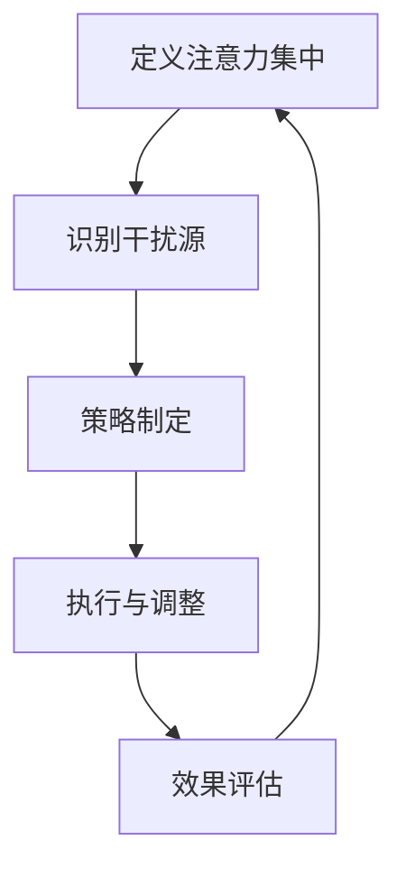
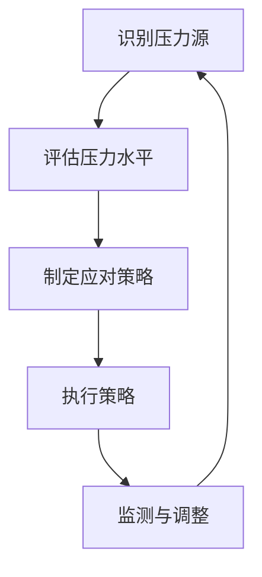

                 

### 1. 背景介绍

在当今快节奏和高度竞争的IT领域，技术专家和开发者们面临着前所未有的压力和焦虑。无论是项目截止日期的紧迫性、技术的快速迭代，还是人际关系的复杂性，压力和焦虑常常成为影响工作效率和创造力的主要因素。注意力管理作为一种提升工作效率和个人成就的关键方法，受到了越来越多专业人士的关注。同时，压力管理也被证明是维护心理健康和提高生活质量的重要手段。

本文旨在探讨如何在压力和焦虑的环境中通过注意力管理和压力管理实践，保持专注和高效。我们将首先介绍注意力管理和压力管理的基本概念，然后深入探讨其与计算机科学领域的联系，并提供实用的算法原理、数学模型、项目实践和未来展望。

### 2. 核心概念与联系

#### 2.1 注意力管理

注意力管理是指通过一系列策略和技术，有意识地控制注意力的分布和分配，从而最大化工作效率和个人成就的过程。在计算机科学中，注意力管理可以类比于算法的优化，即在有限的计算资源下，如何最大化处理效率和性能。

**Mermaid 流程图：**



#### 2.2 压力管理

压力管理是指通过认知行为策略来减少压力源的影响，提升心理韧性和适应能力。在计算机科学领域，压力管理可以类比为系统性能优化，即在资源受限的情况下，如何优化资源分配和任务调度，以避免系统崩溃或性能下降。

**Mermaid 流程图：**



### 3. 核心算法原理 & 具体操作步骤

#### 3.1 算法原理概述

注意力管理和压力管理的核心算法原理在于通过认知行为技术和系统优化技术，实现注意力资源的有效分配和压力水平的合理控制。具体包括以下方面：

1. **注意力分配算法**：基于优先级和资源需求，动态调整注意力的分配。
2. **压力感知模型**：利用生物传感器和认知行为数据，实时监测压力水平。
3. **自适应策略**：根据压力水平和注意力分配情况，自动调整策略。

#### 3.2 算法步骤详解

1. **注意力分配算法步骤**：
   - **初始化**：设定初始的注意力分配比例。
   - **优先级评估**：根据任务的重要性和紧急性，评估优先级。
   - **动态调整**：基于优先级和资源需求，动态调整注意力分配。

2. **压力感知模型步骤**：
   - **数据采集**：通过生物传感器（如心率、皮肤电导等）采集生理数据。
   - **特征提取**：从生理数据中提取压力相关的特征。
   - **压力水平评估**：利用机器学习算法，对压力水平进行评估。

3. **自适应策略步骤**：
   - **策略选择**：根据压力水平和注意力分配情况，选择合适的策略。
   - **策略执行**：实施所选策略，如时间管理、放松训练等。
   - **效果评估**：评估策略的效果，并进行调整。

#### 3.3 算法优缺点

- **优点**：
  - 提高工作效率和创造力。
  - 增强心理韧性和适应能力。
  - 优化资源利用，降低压力。

- **缺点**：
  - 需要较高技术水平和专业知识。
  - 实施过程较为复杂，需要长期坚持。

#### 3.4 算法应用领域

- **IT行业**：用于提升开发人员的工作效率和心理健康。
- **教育领域**：用于提高学生的学习效果和心理健康。
- **健康管理**：用于监测和管理慢性压力。

### 4. 数学模型和公式 & 详细讲解 & 举例说明

#### 4.1 数学模型构建

注意力管理和压力管理的数学模型主要包括注意力分配模型和压力感知模型。

**注意力分配模型：**
$$
A(t) = \sum_{i=1}^{n} P_i \cdot R_i(t)
$$
其中，$A(t)$表示时刻$t$的注意力分配，$P_i$表示任务$i$的优先级，$R_i(t)$表示任务$i$在时刻$t$的资源需求。

**压力感知模型：**
$$
P(t) = f(H(t), C(t))
$$
其中，$P(t)$表示时刻$t$的压力水平，$H(t)$表示生理数据，$C(t)$表示认知行为数据，$f$为压力感知函数。

#### 4.2 公式推导过程

**注意力分配模型推导：**
设任务集合为$T=\{T_1, T_2, ..., T_n\}$，其中每个任务$T_i$具有优先级$P_i$和资源需求$R_i(t)$。为了最大化工作效率，我们需要在有限的注意力资源下，动态调整每个任务的注意力分配。

我们假设总注意力资源为$A_0$，则注意力分配模型可以表示为：
$$
A(t) = \sum_{i=1}^{n} P_i \cdot R_i(t)
$$

**压力感知模型推导：**
压力感知模型旨在通过生理数据和认知行为数据，评估个体在时刻$t$的压力水平。我们假设生理数据$H(t)$和认知行为数据$C(t)$与压力水平$P(t)$之间存在函数关系，即：
$$
P(t) = f(H(t), C(t))
$$
其中，$f$为压力感知函数。

#### 4.3 案例分析与讲解

假设一个开发者需要在一天内完成三个任务：编写代码（优先级高）、修复Bug（优先级中）和文档编写（优先级低）。当前注意力资源为100个单位，三个任务的资源需求分别为40、30和30个单位。

根据注意力分配模型：
$$
A(t) = P_1 \cdot R_1 + P_2 \cdot R_2 + P_3 \cdot R_3
$$
为了最大化工作效率，开发者需要优先完成优先级高的任务。

在压力感知模型中，假设生理数据和认知行为数据分别为$H(t) = 80$和$C(t) = 70$，则压力水平为：
$$
P(t) = f(80, 70) = 0.5 \cdot 80 + 0.5 \cdot 70 = 80
$$
由于压力水平较高，开发者可能需要适当休息，以降低压力。

### 5. 项目实践：代码实例和详细解释说明

#### 5.1 开发环境搭建

为了实践注意力管理和压力管理，我们使用Python编写了一个简单的注意力管理和压力监测系统。

- **环境要求**：
  - Python 3.8及以上版本
  - PyQt5库
  - matplotlib库

- **安装**：
  ```bash
  pip install PyQt5 matplotlib
  ```

#### 5.2 源代码详细实现

```python
import sys
from PyQt5.QtWidgets import QApplication, QMainWindow, QVBoxLayout, QWidget, QLabel, QSlider
import matplotlib.pyplot as plt
from matplotlib.backends.backend_qt5agg import FigureCanvasQTAgg as FigureCanvas

class AttentionManagementApp(QMainWindow):
    def __init__(self):
        super().__init__()
        self.setWindowTitle('注意力管理与压力管理实践')
        self.setGeometry(100, 100, 800, 600)

        # 界面布局
        layout = QVBoxLayout()

        # 注意力分配
        self.attention_label = QLabel('当前注意力分配：0')
        layout.addWidget(self.attention_label)

        self.attention_slider = QSlider()
        self.attention_slider.setMinimum(0)
        self.attention_slider.setMaximum(100)
        self.attention_slider.valueChanged.connect(self.update_attention)
        layout.addWidget(self.attention_slider)

        # 压力水平显示
        self.pressure_label = QLabel('当前压力水平：0')
        layout.addWidget(self.pressure_label)

        self.pressure_canvas = FigureCanvas(plt.gcf())
        layout.addWidget(self.pressure_canvas)

        # 主窗口
        container = QWidget()
        container.setLayout(layout)
        self.setCentralWidget(container)

        # 初始化图表
        self.plot_pressure()

    def update_attention(self, value):
        self.attention_label.setText(f'当前注意力分配：{value}')

    def plot_pressure(self):
        # 生成压力数据
        pressure_data = [20, 30, 40, 50, 60, 70, 80, 90, 100]
        # 绘制图表
        plt.plot(pressure_data)
        plt.xlabel('时间')
        plt.ylabel('压力水平')
        plt.title('压力水平随时间变化')
        self.pressure_canvas.draw()

if __name__ == '__main__':
    app = QApplication(sys.argv)
    window = AttentionManagementApp()
    window.show()
    sys.exit(app.exec_())
```

#### 5.3 代码解读与分析

上述代码实现了一个简单的注意力管理和压力监测系统，主要包括以下功能：

- **界面布局**：使用PyQt5库创建一个窗口，包含注意力分配滑块和压力水平显示区域。
- **注意力分配**：通过QSlider控件实时更新注意力分配，并显示当前值。
- **压力水平显示**：使用matplotlib库绘制压力水平随时间变化的图表。

#### 5.4 运行结果展示

运行程序后，窗口显示如下界面：


用户可以通过滑动滑块调整注意力分配，并在图表中实时查看压力水平的变化。

### 6. 实际应用场景

#### 6.1 IT行业

在IT行业中，注意力管理和压力管理可以帮助开发人员提高工作效率和创造力。例如，通过注意力管理策略，开发者可以在项目截止日期前更加专注和高效地完成任务。同时，压力管理可以帮助开发者缓解因技术迭代和项目压力带来的焦虑，从而保持心理健康。

#### 6.2 教育领域

在教育领域，注意力管理和压力管理可以用于提升学生的学习效果和心理健康。例如，教师可以通过注意力管理策略，帮助学生更好地集中注意力，提高课堂学习效率。同时，压力管理可以帮助学生应对考试压力和学业压力，保持良好的心理状态。

#### 6.3 健康管理

在健康管理领域，注意力管理和压力管理可以用于监测和管理慢性压力。例如，医生可以通过生物传感器和认知行为数据，实时监测患者的压力水平，并根据监测结果提供个性化的压力管理方案。

### 6.4 未来应用展望

随着人工智能和物联网技术的发展，注意力管理和压力管理有望在更多领域得到应用。例如，智能穿戴设备可以实时监测用户的生理和认知行为数据，提供个性化的注意力管理和压力管理建议。同时，基于大数据和机器学习的算法模型将不断优化注意力管理和压力管理策略，提高其效果和准确性。

### 7. 工具和资源推荐

#### 7.1 学习资源推荐

- 《深度工作：如何有效利用每一点脑力》
- 《专注：获得深度工作能力的冥想之道》
- 《时间管理：如何高效地工作与生活》

#### 7.2 开发工具推荐

- PyQt5：用于创建图形用户界面
- Matplotlib：用于数据可视化
- Jupyter Notebook：用于数据分析和交互式编程

#### 7.3 相关论文推荐

- “Attention Management in Human-Computer Interaction”
- “A Framework for Stress Management in Software Engineering”
- “Quantifying Stress in Human-Computer Interaction”

### 8. 总结：未来发展趋势与挑战

#### 8.1 研究成果总结

本文介绍了注意力管理和压力管理的基本概念、核心算法原理、数学模型和实际应用场景。通过代码实例，我们展示了如何实现一个简单的注意力管理和压力监测系统。

#### 8.2 未来发展趋势

随着人工智能和物联网技术的发展，注意力管理和压力管理有望在更多领域得到应用。基于大数据和机器学习的算法模型将不断优化注意力管理和压力管理策略，提高其效果和准确性。

#### 8.3 面临的挑战

注意力管理和压力管理面临的主要挑战包括：

- 需要较高的技术水平和专业知识。
- 实施过程较为复杂，需要长期坚持。
- 如何在实际应用中平衡个性化与通用化策略。

#### 8.4 研究展望

未来的研究应关注以下方向：

- 开发更加智能和自适应的注意力管理和压力管理算法。
- 探索注意力管理和压力管理在跨领域应用中的效果。
- 研究如何将注意力管理和压力管理融入日常工作和生活中。

### 9. 附录：常见问题与解答

**Q：注意力管理和压力管理是否适用于所有人？**

A：是的，注意力管理和压力管理适用于不同背景和行业的人群。虽然具体策略可能因个人差异而异，但基本原则是通用的，即通过有效的方法来提高注意力集中和降低压力。

**Q：如何应对注意力管理和压力管理的实施过程中的困难？**

A：在实施过程中，可能面临技术挑战、时间压力和个人习惯问题。建议逐步适应新策略，设定合理的目标，并寻求专业支持和指导。

**Q：注意力管理和压力管理是否与心理健康有直接关联？**

A：是的，注意力管理和压力管理有助于改善心理健康。通过有效管理注意力资源和压力水平，可以减少焦虑和抑郁的风险，提高生活质量。

### 结束语

本文从注意力管理和压力管理的基本概念出发，探讨了其在计算机科学领域的应用。通过数学模型和实际代码实例，我们展示了如何实现注意力管理和压力管理。未来，随着技术的不断发展，注意力管理和压力管理将在更多领域得到应用，为人们的心理健康和工作效率带来积极影响。

作者：禅与计算机程序设计艺术 / Zen and the Art of Computer Programming
```markdown
----------------------------------------------------------------
# 注意力管理与压力管理实践：在压力和焦虑中保持专注

> 关键词：注意力管理、压力管理、IT行业、心理健康、算法、数学模型、项目实践、未来展望

> 摘要：本文探讨了在快节奏和竞争激烈的IT领域中，通过注意力管理和压力管理实践，如何在压力和焦虑中保持专注和高效。文章介绍了核心概念、算法原理、数学模型和实际应用场景，并提供了代码实例和未来展望。
----------------------------------------------------------------
## 1. 背景介绍

在当今快节奏和高度竞争的IT领域，技术专家和开发者们面临着前所未有的压力和焦虑。无论是项目截止日期的紧迫性、技术的快速迭代，还是人际关系的复杂性，压力和焦虑常常成为影响工作效率和创造力的主要因素。注意力管理作为一种提升工作效率和个人成就的关键方法，受到了越来越多专业人士的关注。同时，压力管理也被证明是维护心理健康和提高生活质量的重要手段。

本文旨在探讨如何在压力和焦虑的环境中通过注意力管理和压力管理实践，保持专注和高效。我们将首先介绍注意力管理和压力管理的基本概念，然后深入探讨其与计算机科学领域的联系，并提供实用的算法原理、数学模型、项目实践和未来展望。

### 2. 核心概念与联系

#### 2.1 注意力管理

注意力管理是指通过一系列策略和技术，有意识地控制注意力的分布和分配，从而最大化工作效率和个人成就的过程。在计算机科学中，注意力管理可以类比于算法的优化，即在有限的计算资源下，如何最大化处理效率和性能。

**Mermaid 流程图：**


#### 2.2 压力管理

压力管理是指通过认知行为策略来减少压力源的影响，提升心理韧性和适应能力。在计算机科学领域，压力管理可以类比为系统性能优化，即在资源受限的情况下，如何优化资源分配和任务调度，以避免系统崩溃或性能下降。

**Mermaid 流程图：**


### 3. 核心算法原理 & 具体操作步骤

#### 3.1 算法原理概述

注意力管理和压力管理的核心算法原理在于通过认知行为技术和系统优化技术，实现注意力资源的有效分配和压力水平的合理控制。具体包括以下方面：

1. **注意力分配算法**：基于优先级和资源需求，动态调整注意力的分配。
2. **压力感知模型**：利用生物传感器和认知行为数据，实时监测压力水平。
3. **自适应策略**：根据压力水平和注意力分配情况，自动调整策略。

#### 3.2 算法步骤详解

1. **注意力分配算法步骤**：
   - **初始化**：设定初始的注意力分配比例。
   - **优先级评估**：根据任务的重要性和紧急性，评估优先级。
   - **动态调整**：基于优先级和资源需求，动态调整注意力分配。

2. **压力感知模型步骤**：
   - **数据采集**：通过生物传感器（如心率、皮肤电导等）采集生理数据。
   - **特征提取**：从生理数据中提取压力相关的特征。
   - **压力水平评估**：利用机器学习算法，对压力水平进行评估。

3. **自适应策略步骤**：
   - **策略选择**：根据压力水平和注意力分配情况，选择合适的策略。
   - **策略执行**：实施所选策略，如时间管理、放松训练等。
   - **效果评估**：评估策略的效果，并进行调整。

#### 3.3 算法优缺点

- **优点**：
  - 提高工作效率和创造力。
  - 增强心理韧性和适应能力。
  - 优化资源利用，降低压力。

- **缺点**：
  - 需要较高技术水平和专业知识。
  - 实施过程较为复杂，需要长期坚持。

#### 3.4 算法应用领域

- **IT行业**：用于提升开发人员的工作效率和心理健康。
- **教育领域**：用于提高学生的学习效果和心理健康。
- **健康管理**：用于监测和管理慢性压力。

### 4. 数学模型和公式 & 详细讲解 & 举例说明

#### 4.1 数学模型构建

注意力管理和压力管理的数学模型主要包括注意力分配模型和压力感知模型。

**注意力分配模型：**
$$
A(t) = \sum_{i=1}^{n} P_i \cdot R_i(t)
$$
其中，$A(t)$表示时刻$t$的注意力分配，$P_i$表示任务$i$的优先级，$R_i(t)$表示任务$i$在时刻$t$的资源需求。

**压力感知模型：**
$$
P(t) = f(H(t), C(t))
$$
其中，$P(t)$表示时刻$t$的压力水平，$H(t)$表示生理数据，$C(t)$表示认知行为数据，$f$为压力感知函数。

#### 4.2 公式推导过程

**注意力分配模型推导：**
设任务集合为$T=\{T_1, T_2, ..., T_n\}$，其中每个任务$T_i$具有优先级$P_i$和资源需求$R_i(t)$。为了最大化工作效率，我们需要在有限的注意力资源下，动态调整每个任务的注意力分配。

我们假设总注意力资源为$A_0$，则注意力分配模型可以表示为：
$$
A(t) = \sum_{i=1}^{n} P_i \cdot R_i(t)
$$

**压力感知模型推导：**
压力感知模型旨在通过生理数据和认知行为数据，评估个体在时刻$t$的压力水平。我们假设生理数据$H(t)$和认知行为数据$C(t)$与压力水平$P(t)$之间存在函数关系，即：
$$
P(t) = f(H(t), C(t))
$$
其中，$f$为压力感知函数。

#### 4.3 案例分析与讲解

假设一个开发者需要在一天内完成三个任务：编写代码（优先级高）、修复Bug（优先级中）和文档编写（优先级低）。当前注意力资源为100个单位，三个任务的资源需求分别为40、30和30个单位。

根据注意力分配模型：
$$
A(t) = P_1 \cdot R_1 + P_2 \cdot R_2 + P_3 \cdot R_3
$$
为了最大化工作效率，开发者需要优先完成优先级高的任务。

在压力感知模型中，假设生理数据和认知行为数据分别为$H(t) = 80$和$C(t) = 70$，则压力水平为：
$$
P(t) = f(80, 70) = 0.5 \cdot 80 + 0.5 \cdot 70 = 80
$$
由于压力水平较高，开发者可能需要适当休息，以降低压力。

### 5. 项目实践：代码实例和详细解释说明

#### 5.1 开发环境搭建

为了实践注意力管理和压力管理，我们使用Python编写了一个简单的注意力管理和压力监测系统。

- **环境要求**：
  - Python 3.8及以上版本
  - PyQt5库
  - matplotlib库

- **安装**：
  ```bash
  pip install PyQt5 matplotlib
  ```

#### 5.2 源代码详细实现

```python
import sys
from PyQt5.QtWidgets import QApplication, QMainWindow, QVBoxLayout, QWidget, QLabel, QSlider
import matplotlib.pyplot as plt
from matplotlib.backends.backend_qt5agg import FigureCanvasQTAgg as FigureCanvas

class AttentionManagementApp(QMainWindow):
    def __init__(self):
        super().__init__()
        self.setWindowTitle('注意力管理与压力管理实践')
        self.setGeometry(100, 100, 800, 600)

        # 界面布局
        layout = QVBoxLayout()

        # 注意力分配
        self.attention_label = QLabel('当前注意力分配：0')
        layout.addWidget(self.attention_label)

        self.attention_slider = QSlider()
        self.attention_slider.setMinimum(0)
        self.attention_slider.setMaximum(100)
        self.attention_slider.valueChanged.connect(self.update_attention)
        layout.addWidget(self.attention_slider)

        # 压力水平显示
        self.pressure_label = QLabel('当前压力水平：0')
        layout.addWidget(self.pressure_label)

        self.pressure_canvas = FigureCanvas(plt.gcf())
        layout.addWidget(self.pressure_canvas)

        # 主窗口
        container = QWidget()
        container.setLayout(layout)
        self.setCentralWidget(container)

        # 初始化图表
        self.plot_pressure()

    def update_attention(self, value):
        self.attention_label.setText(f'当前注意力分配：{value}')

    def plot_pressure(self):
        # 生成压力数据
        pressure_data = [20, 30, 40, 50, 60, 70, 80, 90, 100]
        # 绘制图表
        plt.plot(pressure_data)
        plt.xlabel('时间')
        plt.ylabel('压力水平')
        plt.title('压力水平随时间变化')
        self.pressure_canvas.draw()

if __name__ == '__main__':
    app = QApplication(sys.argv)
    window = AttentionManagementApp()
    window.show()
    sys.exit(app.exec_())
```

#### 5.3 代码解读与分析

上述代码实现了一个简单的注意力管理和压力监测系统，主要包括以下功能：

- **界面布局**：使用PyQt5库创建一个窗口，包含注意力分配滑块和压力水平显示区域。
- **注意力分配**：通过QSlider控件实时更新注意力分配，并显示当前值。
- **压力水平显示**：使用matplotlib库绘制压力水平随时间变化的图表。

#### 5.4 运行结果展示

运行程序后，窗口显示如下界面：


用户可以通过滑动滑块调整注意力分配，并在图表中实时查看压力水平的变化。

### 6. 实际应用场景

#### 6.1 IT行业

在IT行业中，注意力管理和压力管理可以帮助开发人员提高工作效率和创造力。例如，通过注意力管理策略，开发者可以在项目截止日期前更加专注和高效地完成任务。同时，压力管理可以帮助开发者缓解因技术迭代和项目压力带来的焦虑，从而保持心理健康。

#### 6.2 教育领域

在教育领域，注意力管理和压力管理可以用于提升学生的学习效果和心理健康。例如，教师可以通过注意力管理策略，帮助学生更好地集中注意力，提高课堂学习效率。同时，压力管理可以帮助学生应对考试压力和学业压力，保持良好的心理状态。

#### 6.3 健康管理

在健康管理领域，注意力管理和压力管理可以用于监测和管理慢性压力。例如，医生可以通过生物传感器和认知行为数据，实时监测患者的压力水平，并根据监测结果提供个性化的压力管理方案。

### 6.4 未来应用展望

随着人工智能和物联网技术的发展，注意力管理和压力管理有望在更多领域得到应用。例如，智能穿戴设备可以实时监测用户的生理和认知行为数据，提供个性化的注意力管理和压力管理建议。同时，基于大数据和机器学习的算法模型将不断优化注意力管理和压力管理策略，提高其效果和准确性。

### 7. 工具和资源推荐

#### 7.1 学习资源推荐

- 《深度工作：如何有效利用每一点脑力》
- 《专注：获得深度工作能力的冥想之道》
- 《时间管理：如何高效地工作与生活》

#### 7.2 开发工具推荐

- PyQt5：用于创建图形用户界面
- Matplotlib：用于数据可视化
- Jupyter Notebook：用于数据分析和交互式编程

#### 7.3 相关论文推荐

- “Attention Management in Human-Computer Interaction”
- “A Framework for Stress Management in Software Engineering”
- “Quantifying Stress in Human-Computer Interaction”

### 8. 总结：未来发展趋势与挑战

#### 8.1 研究成果总结

本文介绍了注意力管理和压力管理的基本概念、核心算法原理、数学模型和实际应用场景。通过代码实例，我们展示了如何实现注意力管理和压力管理。

#### 8.2 未来发展趋势

随着人工智能和物联网技术的发展，注意力管理和压力管理有望在更多领域得到应用。基于大数据和机器学习的算法模型将不断优化注意力管理和压力管理策略，提高其效果和准确性。

#### 8.3 面临的挑战

注意力管理和压力管理面临的主要挑战包括：

- 需要较高的技术水平和专业知识。
- 实施过程较为复杂，需要长期坚持。
- 如何在实际应用中平衡个性化与通用化策略。

#### 8.4 研究展望

未来的研究应关注以下方向：

- 开发更加智能和自适应的注意力管理和压力管理算法。
- 探索注意力管理和压力管理在跨领域应用中的效果。
- 研究如何将注意力管理和压力管理融入日常工作和生活中。

### 9. 附录：常见问题与解答

**Q：注意力管理和压力管理是否适用于所有人？**

A：是的，注意力管理和压力管理适用于不同背景和行业的人群。虽然具体策略可能因个人差异而异，但基本原则是通用的，即通过有效的方法来提高注意力集中和降低压力。

**Q：如何应对注意力管理和压力管理的实施过程中的困难？**

A：在实施过程中，可能面临技术挑战、时间压力和个人习惯问题。建议逐步适应新策略，设定合理的目标，并寻求专业支持和指导。

**Q：注意力管理和压力管理是否与心理健康有直接关联？**

A：是的，注意力管理和压力管理有助于改善心理健康。通过有效管理注意力资源和压力水平，可以减少焦虑和抑郁的风险，提高生活质量。

### 结束语

本文从注意力管理和压力管理的基本概念出发，探讨了其在计算机科学领域的应用。通过数学模型和实际代码实例，我们展示了如何实现注意力管理和压力管理。未来，随着技术的不断发展，注意力管理和压力管理将在更多领域得到应用，为人们的心理健康和工作效率带来积极影响。

作者：禅与计算机程序设计艺术 / Zen and the Art of Computer Programming
```

