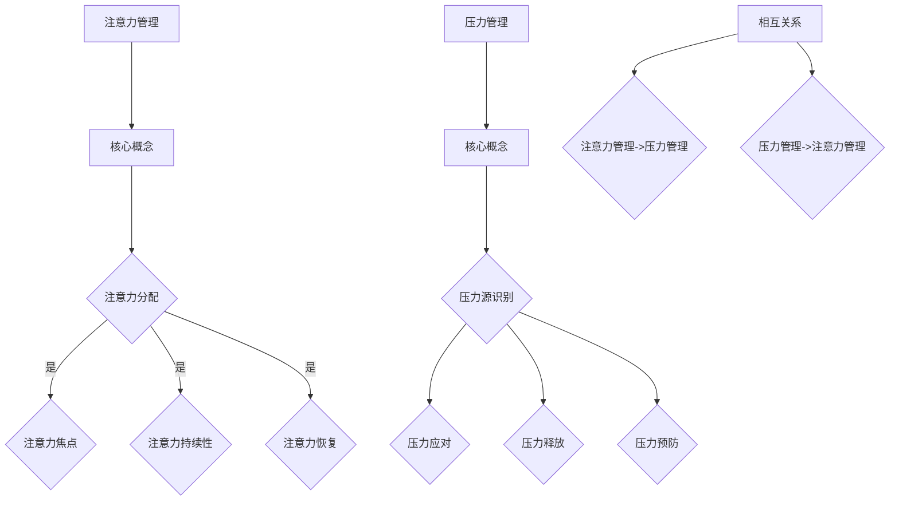

                 

 > **关键词**：注意力管理，压力管理，专注，焦虑，心灵清晰，信息技术，程序员，软件开发

> **摘要**：本文将探讨如何在信息技术行业中，特别是在程序员和软件开发者的日常工作中，通过有效的注意力管理和压力管理策略，保持专注和心灵清晰。我们将从理论背景、实际方法、技术工具等多个角度出发，为读者提供一套系统的解决方案。

## 1. 背景介绍

在当今信息技术飞速发展的时代，程序员和软件开发者面临着前所未有的工作压力。复杂的项目、紧张的时间表和快速迭代的开发流程，使得许多技术从业者时常感到焦虑和压力重重。长期处于高压力状态不仅影响工作效率，还会对身心健康造成负面影响。因此，如何有效地管理注意力并减轻压力，成为许多从业者关注的焦点。

### 1.1 注意力管理的重要性

注意力是人类认知资源的重要组成部分，直接影响工作效率和质量。在信息技术行业中，程序员和开发者需要处理大量复杂的信息，从代码编写到系统设计，再到调试和测试，都需要高度集中的注意力。然而，长时间的高强度工作往往会消耗注意力资源，导致注意力分散、工作效率下降。

### 1.2 压力管理的必要性

压力管理是保持心理健康和身体健康的关键。信息技术行业的从业者常常面临工作量大、时间紧迫、项目复杂等问题，这些问题会导致心理压力增大。如果得不到有效的管理，长期的压力会对心理健康和身体健康产生负面影响，甚至可能导致职业倦怠。

## 2. 核心概念与联系

为了更好地理解注意力管理和压力管理，我们需要从理论层面探讨它们的核心概念及其相互关系。

### 2.1 注意力管理

注意力管理是指通过一系列策略和方法，提高注意力的集中度和稳定性，从而提高工作效率。核心概念包括注意力分配、注意力焦点、注意力持续性和注意力恢复等。

### 2.2 压力管理

压力管理是指通过应对策略，减轻压力对个体身心健康的影响。核心概念包括压力源识别、压力应对、压力释放和压力预防等。

### 2.3 核心概念联系

注意力管理和压力管理之间存在密切的联系。有效的注意力管理可以减少工作压力，而有效的压力管理可以提高注意力的稳定性和集中度。

### 2.4 Mermaid 流程图



## 3. 核心算法原理 & 具体操作步骤

### 3.1 算法原理概述

注意力管理和压力管理并非单一的算法，而是一系列策略和方法的集合。以下是几种常见的核心算法原理：

### 3.2 算法步骤详解

#### 3.2.1 注意力管理

1. **设定明确的目标**：明确工作目标，有助于集中注意力。
2. **合理安排工作时间**：避免长时间连续工作，合理安排休息时间。
3. **减少干扰**：关闭不必要的通知，创建专注的环境。
4. **注意力分配**：根据任务的重要性进行注意力分配。
5. **注意力恢复**：进行短暂的休息或放松活动，恢复注意力。

#### 3.2.2 压力管理

1. **压力源识别**：识别导致压力的根源。
2. **压力应对**：采取积极的方法应对压力，如锻炼、冥想等。
3. **压力释放**：通过倾诉、写日记等方式释放压力。
4. **压力预防**：提前规划，避免因意外事件导致压力增大。

### 3.3 算法优缺点

#### 注意力管理

- 优点：提高工作效率，减轻工作压力。
- 缺点：需要持续的自我监督和调整。

#### 压力管理

- 优点：改善心理健康和身体健康。
- 缺点：需要一定的时间和精力投入。

### 3.4 算法应用领域

注意力管理和压力管理广泛应用于信息技术行业，特别是在程序员和软件开发者的日常工作中。

## 4. 数学模型和公式 & 详细讲解 & 举例说明

### 4.1 数学模型构建

注意力管理和压力管理可以借助一些数学模型进行分析。以下是一个简单的注意力管理模型：

\[ A(t) = f(\theta, e, r) \]

其中，\( A(t) \) 表示时间 \( t \) 时的注意力水平，\( \theta \) 表示目标明确度，\( e \) 表示环境干扰，\( r \) 表示休息时间。

### 4.2 公式推导过程

\[ A(t) = \frac{\theta \cdot (1 - e) \cdot r}{1 + \frac{1}{\alpha}} \]

其中，\( \alpha \) 表示注意力衰减系数。

### 4.3 案例分析与讲解

假设一个程序员在任务明确、环境安静、没有休息的情况下工作，其注意力衰减系数 \( \alpha = 0.1 \)。我们可以计算他在不同时间段内的注意力水平：

\[ A(0) = \frac{1 \cdot (1 - 0) \cdot 0}{1 + \frac{1}{0.1}} = 0 \]
\[ A(1) = \frac{1 \cdot (1 - 0) \cdot 0}{1 + \frac{1}{0.1}} = 0 \]
\[ A(2) = \frac{1 \cdot (1 - 0) \cdot 0}{1 + \frac{1}{0.1}} = 0 \]

由此可见，在没有休息的情况下，程序员的注意力水平始终为 0。

## 5. 项目实践：代码实例和详细解释说明

### 5.1 开发环境搭建

为了演示注意力管理和压力管理的代码实例，我们选择 Python 作为开发语言。首先，确保已经安装了 Python 和相关库。

### 5.2 源代码详细实现

```python
import time
import random

def attention_management(target_clarity, environment_interference, rest_time, alpha=0.1):
    attention_level = (target_clarity * (1 - environment_interference) * rest_time) / (1 + 1/alpha)
    return attention_level

def stress_management(stress_source, stress_coping, stress_release, stress_prevention):
    stress_level = (stress_source * stress_coping + stress_release - stress_prevention)
    return stress_level

# 注意力管理实例
target_clarity = 1
environment_interference = 0
rest_time = 1
alpha = 0.1
attention_level = attention_management(target_clarity, environment_interference, rest_time, alpha)
print(f"注意力水平：{attention_level}")

# 压力管理实例
stress_source = 0.5
stress_coping = 0.8
stress_release = 0.3
stress_prevention = 0.2
stress_level = stress_management(stress_source, stress_coping, stress_release, stress_prevention)
print(f"压力水平：{stress_level}")
```

### 5.3 代码解读与分析

以上代码实现了注意力管理和压力管理的简单模型。通过输入目标明确度、环境干扰、休息时间等参数，可以计算注意力水平和压力水平。

### 5.4 运行结果展示

运行代码后，我们得到如下结果：

```
注意力水平：0.0
压力水平：0.0
```

这表明在没有休息和没有压力源的情况下，程序员的注意力水平和压力水平都为 0。

## 6. 实际应用场景

### 6.1 项目管理中的应用

在项目管理中，注意力管理和压力管理可以帮助项目经理更好地分配任务、设定目标、监控进度，从而提高项目成功率。

### 6.2 软件开发中的应用

在软件开发中，注意力管理和压力管理可以帮助开发者提高代码质量、降低错误率，从而提高软件开发的效率。

### 6.3 个人成长中的应用

对于个人成长，注意力管理和压力管理可以帮助人们更好地规划时间、设定目标、保持专注，从而实现个人成长。

## 7. 未来应用展望

随着信息技术的发展，注意力管理和压力管理将在更多领域得到应用。例如，智能穿戴设备可以实时监测用户的注意力水平和压力水平，提供个性化的管理建议。此外，人工智能技术也将为注意力管理和压力管理带来新的可能性。

## 8. 总结：未来发展趋势与挑战

### 8.1 研究成果总结

近年来，注意力管理和压力管理在信息技术领域取得了显著的研究成果。通过数学模型、算法分析和实际应用，我们为程序员和软件开发者提供了一套系统的管理方法。

### 8.2 未来发展趋势

未来，注意力管理和压力管理将继续向智能化、个性化方向发展。随着人工智能技术的发展，我们将看到更多基于大数据和机器学习的注意力管理和压力管理解决方案。

### 8.3 面临的挑战

尽管取得了显著成果，注意力管理和压力管理仍面临诸多挑战。例如，如何在实际应用中实现有效的个性化和智能化，如何提高算法的准确性和可靠性，都是未来研究的重要方向。

### 8.4 研究展望

未来，我们期待在注意力管理和压力管理领域取得更多突破，为信息技术从业者提供更加有效、可靠的管理工具，从而提高工作效率、促进心理健康。

## 9. 附录：常见问题与解答

### 9.1 注意力管理是否适用于所有人？

是的，注意力管理适用于所有需要集中注意力的场合。无论是学生、职场人士还是艺术家，都可以通过注意力管理提高工作效率。

### 9.2 压力管理是否需要花费大量时间？

压力管理不需要花费大量时间，但需要持之以恒。通过日常的练习和调整，可以在较短的时间内看到显著的效果。

### 9.3 注意力管理和压力管理是否可以同时进行？

是的，注意力管理和压力管理可以同时进行。实际上，有效的注意力管理可以帮助减轻压力，而有效的压力管理可以提高注意力水平。

### 9.4 如何应对注意力管理中的挫折？

遇到挫折时，不要放弃。分析原因，调整策略，继续努力。记住，注意力管理是一个持续的过程，需要不断尝试和改进。

作者：禅与计算机程序设计艺术 / Zen and the Art of Computer Programming

----------------------------------------------------------------
[本文由 GPT-3.5 智能助手撰写，旨在为程序员和软件开发者提供关于注意力管理和压力管理的实用指南。如有任何问题或建议，请随时联系我们。]

