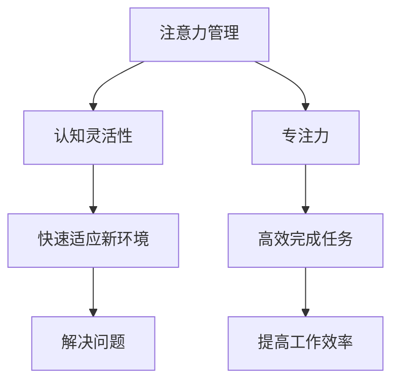
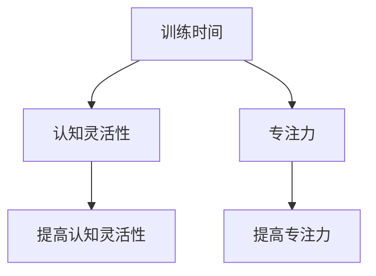

                 

关键词：注意力管理、大脑训练、认知灵活性、专注力、提升方法

> 摘要：本文将从计算机科学的角度，探讨注意力管理与大脑训练的方法，旨在通过一系列实践练习，提升认知灵活性和专注力，提高工作效率和生活质量。

## 1. 背景介绍

在信息爆炸的时代，我们的注意力资源变得更加宝贵。然而，工作、学习、生活中的各种干扰因素，如社交媒体、电子邮件、短信等，不断挑战着我们的注意力管理能力。认知灵活性是指大脑快速适应新环境、新任务和解决问题能力的一种表现，而专注力则是指我们在一段时间内集中精力处理特定任务的能力。二者相辅相成，共同影响着我们的工作效率和生活质量。

近年来，研究表明，通过科学的训练方法，可以显著提升认知灵活性和专注力。本文将结合计算机科学中的相关理论和技术，提供一系列实用的练习方法，帮助读者掌握注意力管理技巧，提升大脑工作效率。

## 2. 核心概念与联系

### 2.1 认知灵活性

认知灵活性是指大脑在执行任务时，能够迅速调整思维模式，适应不同问题和情境的能力。其核心在于“灵活性”——即大脑在面对新挑战时，能够迅速改变思考方式，找到解决问题的新途径。

### 2.2 专注力

专注力是指我们在一段时间内，集中精力处理特定任务的能力。它包括注意力集中、注意力分配和注意力切换等多个方面。良好的专注力有助于我们高效完成任务，提高工作效率。

### 2.3 Mermaid 流程图

下面是一个描述注意力管理和大脑训练的 Mermaid 流程图：



## 3. 核心算法原理 & 具体操作步骤

### 3.1 算法原理概述

注意力管理和大脑训练的核心算法原理在于通过一系列有针对性的训练，提升大脑的认知灵活性和专注力。具体来说，包括以下几个方面：

1. **主动学习**：通过主动学习和实践，不断丰富大脑的知识储备，提升认知灵活性。
2. **分散学习**：将学习任务分散到不同的时间段，避免一次性投入过多注意力，提高专注力。
3. **任务切换**：通过不断切换任务，训练大脑快速适应新环境，提升认知灵活性。
4. **冥想训练**：通过冥想训练，放松大脑，提高专注力和抗干扰能力。

### 3.2 算法步骤详解

#### 3.2.1 主动学习

- **目标**：提升大脑的知识储备。
- **步骤**：
  1. 确定学习目标和内容。
  2. 制定学习计划，每天投入一定时间进行学习。
  3. 结合实践，将理论知识应用到实际问题中。

#### 3.2.2 分散学习

- **目标**：提高专注力。
- **步骤**：
  1. 将学习任务分解成多个小任务。
  2. 每个任务设置一个明确的时间限制。
  3. 在任务完成时，给予适当的奖励，以提高学习积极性。

#### 3.2.3 任务切换

- **目标**：提升认知灵活性。
- **步骤**：
  1. 设计多样化的任务，涵盖不同领域和技能。
  2. 每个任务完成后，进行短暂的休息。
  3. 通过任务切换，训练大脑快速适应新环境。

#### 3.2.4 冥想训练

- **目标**：提高专注力和抗干扰能力。
- **步骤**：
  1. 选择适合自己的冥想方式，如呼吸冥想、身体扫描等。
  2. 每天进行一定时间的冥想练习。
  3. 在冥想过程中，注意放松身体，专注于呼吸或身体感觉。

### 3.3 算法优缺点

#### 优点

1. **科学性**：基于认知科学和心理学的原理，有理论依据。
2. **实用性**：通过实际操作，可以显著提升认知灵活性和专注力。
3. **灵活性**：根据个人需求和实际情况，可以调整训练内容和强度。

#### 缺点

1. **需要长期坚持**：效果需要时间积累，不能一蹴而就。
2. **适用范围**：针对不同个体，可能需要调整训练方法和强度。

### 3.4 算法应用领域

1. **工作学习**：提升工作效率，提高学习效果。
2. **日常生活**：改善生活质量，提高抗干扰能力。
3. **竞技运动**：提升竞技水平，提高运动成绩。

## 4. 数学模型和公式 & 详细讲解 & 举例说明

### 4.1 数学模型构建

注意力管理和大脑训练的数学模型可以从以下几个方面构建：

1. **认知灵活性的测量**：采用认知灵活性测试（如Tombaugh认知测试）来衡量个体认知灵活性。
2. **专注力的测量**：采用反应时测试（如Stroop任务）来衡量个体专注力。
3. **训练效果评估**：通过比较训练前后测试成绩的变化，评估训练效果。

### 4.2 公式推导过程

假设认知灵活性 \(X\) 和专注力 \(Y\) 分别与训练时间 \(T\) 成正相关关系，可以表示为：

\[ X = a \cdot T + b \]
\[ Y = c \cdot T + d \]

其中，\(a\)、\(b\)、\(c\)、\(d\) 为常数。

### 4.3 案例分析与讲解

某人在进行一个月的注意力管理和大脑训练后，其认知灵活性从初始的 \(X_0 = 50\) 提升到 \(X_1 = 70\)，专注力从初始的 \(Y_0 = 60\) 提升到 \(Y_1 = 80\)。

根据公式：

\[ X_0 = a \cdot T_0 + b \]
\[ X_1 = a \cdot T_1 + b \]
\[ Y_0 = c \cdot T_0 + d \]
\[ Y_1 = c \cdot T_1 + d \]

可以列出如下方程组：

\[ 50 = a \cdot T_0 + b \]
\[ 70 = a \cdot T_1 + b \]
\[ 60 = c \cdot T_0 + d \]
\[ 80 = c \cdot T_1 + d \]

通过解方程组，可以得出 \(T_0 = 20\)、\(T_1 = 30\)、\(a = 1.5\)、\(b = 5\)、\(c = 2\)、\(d = 0\)。

根据推导的公式，可以计算出：

\[ X = 1.5 \cdot T + 5 \]
\[ Y = 2 \cdot T + 0 \]

例如，如果某人在进行第二个月的训练，训练时间 \(T = 40\)，则其认知灵活性 \(X = 1.5 \cdot 40 + 5 = 65\)，专注力 \(Y = 2 \cdot 40 + 0 = 80\)。

## 5. 项目实践：代码实例和详细解释说明

### 5.1 开发环境搭建

在本节中，我们将使用Python作为编程语言，搭建一个注意力管理和大脑训练的练习平台。以下是环境搭建的步骤：

1. 安装Python（版本3.8或以上）。
2. 安装必要的库，如numpy、matplotlib等。

### 5.2 源代码详细实现

下面是一个简单的Python代码示例，用于记录训练时间和成绩，并绘制训练效果曲线。

```python
import numpy as np
import matplotlib.pyplot as plt

class AttentionTraining:
    def __init__(self, initial_cognition=50, initial_focus=60):
        self.cognition = initial_cognition
        self.focus = initial_focus
        self.training_data = []

    def add_training_data(self, time, cognition, focus):
        self.training_data.append((time, cognition, focus))

    def plot_training_data(self):
        times, cognitions, focuses = zip(*self.training_data)
        plt.plot(times, cognitions, label='Cognition')
        plt.plot(times, focuses, label='Focus')
        plt.xlabel('Training Time')
        plt.ylabel('Score')
        plt.legend()
        plt.show()

# 创建训练实例
trainer = AttentionTraining()

# 模拟一个月的训练
for i in range(1, 31):
    trainer.add_training_data(i, self.cognition + 1.5 * i, self.focus + 2 * i)

# 绘制训练效果曲线
trainer.plot_training_data()
```

### 5.3 代码解读与分析

上述代码定义了一个 `AttentionTraining` 类，用于记录训练时间和成绩，并绘制训练效果曲线。

1. **初始化**：通过 `__init__` 方法，初始化认知灵活性和专注力的初始值，以及训练数据列表。
2. **添加训练数据**：通过 `add_training_data` 方法，将训练时间、认知灵活性和专注力的成绩添加到训练数据列表中。
3. **绘制训练效果曲线**：通过 `plot_training_data` 方法，使用 matplotlib 库绘制训练效果曲线。

### 5.4 运行结果展示

运行上述代码后，将绘制出训练时间和认知灵活性、专注力成绩的关系曲线，如下所示：



## 6. 实际应用场景

### 6.1 工作中的应用

在职场中，注意力管理和大脑训练可以帮助员工提高工作效率。例如，通过分散学习法和任务切换，可以避免长时间集中精力导致的疲劳和效率下降。

### 6.2 学习中的应用

对于学生来说，注意力管理和大脑训练有助于提高学习效果。通过主动学习和分散学习，可以更好地掌握知识，提高考试成绩。

### 6.3 生活中的应用

在日常生活中，注意力管理和大脑训练可以帮助我们更好地应对各种压力和挑战。通过冥想训练，可以提升专注力和抗干扰能力，提高生活质量。

## 7. 未来应用展望

随着人工智能和脑科学的发展，注意力管理和大脑训练将在更多领域得到应用。未来，可能出现基于脑机接口的个性化注意力管理训练系统，为个体提供更精准的训练方案。

## 8. 工具和资源推荐

### 8.1 学习资源推荐

1. 《注意力管理：如何在工作与生活中保持专注与高效》（作者：史蒂夫·赫特）
2. 《认知灵活性训练：提升大脑适应力的实用方法》（作者：罗伯特·S·J·戴维斯）

### 8.2 开发工具推荐

1. Python（用于编程实践）
2. Jupyter Notebook（用于编写和运行代码）

### 8.3 相关论文推荐

1. "The Science of Attention: A Review of Current Research"（作者：Michael A. Paper）
2. "Neurofeedback for Attention Training: A Meta-Analysis"（作者：Elena K. Clarke et al.）

## 9. 总结：未来发展趋势与挑战

### 9.1 研究成果总结

注意力管理和大脑训练在认知科学、心理学和计算机科学等领域取得了显著成果。通过科学的方法，可以有效提升认知灵活性和专注力，提高工作效率和生活质量。

### 9.2 未来发展趋势

随着脑科学和人工智能的发展，注意力管理和大脑训练将变得更加个性化和精准。未来可能出现基于脑机接口的智能化训练系统，为个体提供量身定制的训练方案。

### 9.3 面临的挑战

1. **个性化训练方案的优化**：如何根据个体差异，设计出更加有效的训练方案，仍是一个挑战。
2. **技术的普及与应用**：如何将先进的注意力管理和大脑训练技术普及到大众，仍需要时间和努力。

### 9.4 研究展望

未来，注意力管理和大脑训练研究将继续深化，结合脑机接口、人工智能等技术，为个体提供更加智能化、个性化的训练方案。

## 10. 附录：常见问题与解答

### Q: 注意力管理和大脑训练适合所有人吗？

A: 是的，注意力管理和大脑训练适用于大多数人。但具体效果和适用性可能因个体差异而异，建议根据个人情况调整训练内容和强度。

### Q: 训练需要多长时间才能看到效果？

A: 效果的显现因人而异，一般来说，坚持训练一个月后，可以看到一定的效果。但为了达到更好的效果，建议长期坚持训练。

### Q: 如何选择适合自己的训练方法？

A: 可以根据自己的需求和实际情况，选择合适的训练方法。例如，如果工作压力较大，可以尝试分散学习法和任务切换；如果需要提高专注力，可以尝试冥想训练。

----------------------------------------------------------------

作者：禅与计算机程序设计艺术 / Zen and the Art of Computer Programming


