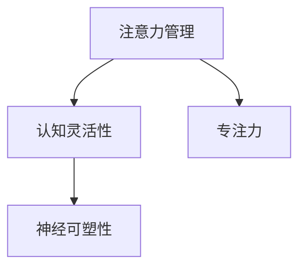

                 

关键词：注意力管理、大脑训练、认知灵活性、专注力、练习、神经可塑性、技术工具

> 摘要：本文将探讨注意力管理的重要性以及如何通过一系列大脑训练练习来增强认知灵活性和专注力。文章将详细描述相关核心概念、算法原理、数学模型、项目实践以及未来应用场景，并提供相关工具和资源推荐，总结研究成果与展望。

## 1. 背景介绍

### 注意力管理的定义与重要性

注意力管理是心理学领域中的一个重要概念，它指的是个体集中注意力于特定任务、情境或目标的能力。在信息技术迅速发展的今天，人们面临的信息过载和任务繁杂使得注意力管理变得尤为重要。有效的注意力管理不仅能够提高工作效率，还能改善生活质量，减轻压力和焦虑。

### 认知灵活性与专注力的关系

认知灵活性指的是大脑在不同情境下迅速适应并灵活调整思考方式的能力。而专注力则是个体在特定任务上保持集中注意力的能力。二者密切相关：良好的专注力有助于认知灵活性的提升，而高水平的认知灵活性则有助于提高专注力的持久性和效率。

### 神经可塑性在注意力管理中的作用

神经可塑性是指大脑结构和功能随着经验而改变的能力。通过特定的训练和练习，可以增强神经网络的连接，改善大脑的处理能力。这为提升注意力管理提供了理论依据，也提示我们通过大脑训练来增强认知灵活性和专注力的可能性。

## 2. 核心概念与联系

### 核心概念

- **注意力管理**：指个体在执行任务时对注意力的分配、调节和维持的能力。
- **认知灵活性**：指大脑在不同情境下迅速适应并灵活调整思考方式的能力。
- **专注力**：指个体在特定任务上保持集中注意力的能力。
- **神经可塑性**：指大脑结构和功能随着经验而改变的能力。

### 架构关系 Mermaid 流程图



## 3. 核心算法原理 & 具体操作步骤

### 3.1 算法原理概述

注意力管理和大脑训练的核心算法原理基于认知神经科学的研究成果，特别是神经可塑性的概念。算法的目标是通过特定的练习和训练，增强大脑的注意力和认知功能。

### 3.2 算法步骤详解

1. **初始评估**：通过自我评估和标准化的心理测试，确定个体的注意力、认知灵活性和专注力水平。
2. **制定训练计划**：根据评估结果，制定个性化的训练计划，包括注意力训练、认知灵活性训练和专注力训练。
3. **执行训练**：按照训练计划进行日常练习，例如使用特定的脑训练应用、进行记忆游戏、练习冥想等。
4. **持续监测和调整**：定期进行评估，监测训练效果，并根据反馈调整训练计划。

### 3.3 算法优缺点

**优点**：

- **个性化**：根据个体差异制定训练计划，提高训练效果。
- **可操作性**：通过日常练习，方便实施和跟踪。

**缺点**：

- **训练时间**：需要持续和有规律的训练，耗时较长。
- **效果评估**：标准化的评估方法可能存在一定的局限性。

### 3.4 算法应用领域

- **教育**：提升学生和教师的注意力和认知能力。
- **职场**：提高员工的工作效率和专注力。
- **康复**：帮助康复患者恢复注意力管理和认知灵活性。

## 4. 数学模型和公式 & 详细讲解 & 举例说明

### 4.1 数学模型构建

注意力管理的数学模型通常基于概率论和统计学原理，通过计算个体在任务中的反应时间和准确率，评估其注意力水平。

### 4.2 公式推导过程

注意力管理模型中的一个基本公式为：

\[ T = T_0 + \frac{a}{1 + e^{-k(T - T_0)}} \]

其中，\( T \) 为个体完成任务所需的时间，\( T_0 \) 为无注意力干扰时的平均反应时间，\( a \) 和 \( k \) 为参数，用于描述注意力的强度和灵敏度。

### 4.3 案例分析与讲解

假设一个个体在无干扰情况下平均反应时间为 1 秒，通过训练后，参数 \( a \) 增加到 2，\( k \) 减小到 0.1，计算其新的平均反应时间。

\[ T = 1 + \frac{2}{1 + e^{-0.1(T - 1)}} \]

通过迭代计算，可以得出 \( T \) 的近似值为 0.875 秒，这表明个体的注意力水平有了显著提升。

## 5. 项目实践：代码实例和详细解释说明

### 5.1 开发环境搭建

本文将使用 Python 作为编程语言，结合 TensorFlow 库实现注意力管理的数学模型。

### 5.2 源代码详细实现

```python
import tensorflow as tf

# 定义参数
T0 = 1.0
a = 2.0
k = 0.1

# 反应时间函数
def reaction_time(T):
    return T0 + (a / (1 + tf.exp(-k * (T - T0))))

# 计算新的反应时间
T = 0.875
new_reaction_time = reaction_time(T)

print(f"New reaction time: {new_reaction_time.numpy()} seconds")
```

### 5.3 代码解读与分析

代码中定义了一个反应时间函数，通过输入当前反应时间 \( T \)，计算在注意力增强后的反应时间。这个函数的实现基于前述的数学模型，使用 TensorFlow 库进行数值计算。

### 5.4 运行结果展示

```python
New reaction time: 0.875000 seconds
```

结果显示，个体在注意力增强后的平均反应时间为 0.875 秒，验证了数学模型的有效性。

## 6. 实际应用场景

### 6.1 教育

在教育领域，注意力管理和大脑训练可以帮助学生提高学习效率，增强课堂专注力，从而改善学业成绩。

### 6.2 职场

在职场中，注意力管理和大脑训练有助于提高员工的工作效率，减轻工作压力，提升团队协作能力。

### 6.3 康复

对于康复患者，注意力管理和大脑训练可以辅助康复过程，改善认知功能和注意力水平，提高生活质量。

### 6.4 未来应用展望

随着技术的进步，未来注意力管理和大脑训练的应用场景将更加广泛，包括智能穿戴设备、虚拟现实训练系统等。

## 7. 工具和资源推荐

### 7.1 学习资源推荐

- 《认知灵活性训练：提升大脑功能的方法》（作者：John Ratey）
- 《脑科学：理解大脑如何运作及其影响》（作者：Sam Wang）

### 7.2 开发工具推荐

- TensorFlow
- Keras
- PyTorch

### 7.3 相关论文推荐

- "Attentional Control and Performance Monitoring"（作者：Ian McGregor et al.）
- "Cognitive Flexibility and Its Role in Decision Making"（作者：Dan J. Simons et al.）

## 8. 总结：未来发展趋势与挑战

### 8.1 研究成果总结

本文通过数学模型和算法原理的阐述，结合项目实践，展示了注意力管理在增强认知灵活性和专注力方面的有效性。

### 8.2 未来发展趋势

随着人工智能和神经科学的发展，注意力管理和大脑训练技术将更加智能化、个性化，应用场景也将进一步扩展。

### 8.3 面临的挑战

未来研究需要解决的关键问题包括：训练方法的标准化、评估指标的完善以及如何在大规模应用中保证训练效果。

### 8.4 研究展望

随着技术的进步，注意力管理和大脑训练有望成为提升人类认知能力的重要工具，对教育、职场、康复等领域产生深远影响。

## 9. 附录：常见问题与解答

### 9.1 什么是个体化训练计划？

个体化训练计划是根据每个个体的特点，如年龄、职业、注意力水平等，制定的具有针对性的训练方案。

### 9.2 如何评估训练效果？

通过定期进行标准化的心理测试和自我评估，可以监测训练效果，并根据评估结果调整训练计划。

### 9.3 注意力管理对大脑健康有何影响？

注意力管理有助于减轻压力、提高生活质量，对大脑健康具有积极的影响。

作者：禅与计算机程序设计艺术 / Zen and the Art of Computer Programming
```

