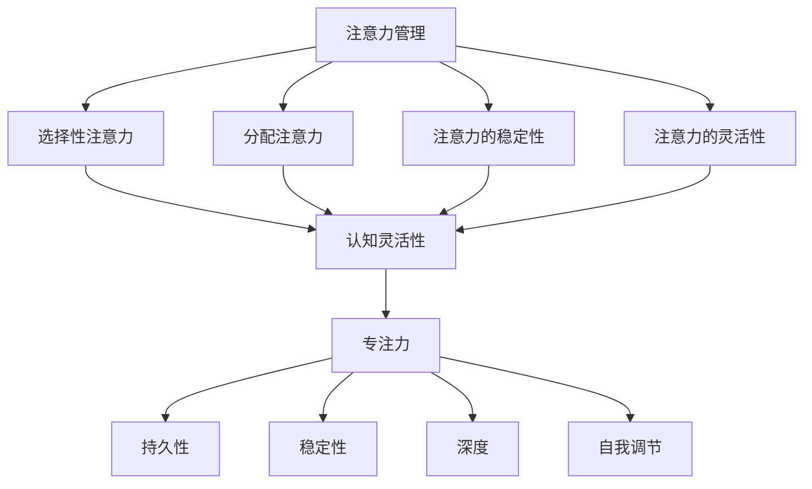

                 

## 1. 背景介绍

在现代信息社会中，人们面临的信息量和处理任务量都在不断增长。这使得注意力管理和大脑训练成为了一个热门话题。对于IT行业从业者来说，如何在纷繁复杂的工作环境中保持高效率和注意力集中，是提升个人竞争力的关键因素。

本文旨在探讨如何通过科学的方法来管理注意力，并通过一系列的练习来增强认知灵活性和专注力。我们将在文章中介绍一些核心概念、算法原理、数学模型、以及实际应用案例，帮助读者更好地理解和应用这些知识。

### 注意力管理的必要性

注意力管理不仅关乎个人的工作效率，还影响着工作质量和身心健康。在IT行业中，程序员、系统架构师、数据分析师等职位往往需要长时间集中精力处理复杂的任务。然而，由于工作强度大、压力高，很多人会面临注意力分散、效率低下的问题。这不仅影响了工作质量，还可能导致疲劳和职业倦怠。

研究表明，良好的注意力管理能够显著提高工作效率和创造力。通过科学的训练，我们可以增强大脑的认知灵活性，提高注意力集中时间，减少注意力分散的次数。这对于提升个人的职业发展和生活质量具有重要意义。

### 大脑训练的重要性

大脑训练是提升注意力管理和认知能力的有效途径。通过一系列的练习，我们可以锻炼大脑的不同区域，增强神经连接，提高信息处理速度和准确性。大脑训练不仅有助于提高工作效率，还能增强记忆力、决策力和情绪控制能力。

在IT行业中，大脑训练可以带来以下好处：

1. **提升编程效率**：通过训练，程序员可以更快速地理解和解决问题，提高代码质量。
2. **增强学习能力**：大脑训练有助于快速掌握新知识和技能，缩短学习周期。
3. **提高决策能力**：训练后的大脑能更有效地分析信息，做出更明智的决策。
4. **改善心理健康**：通过大脑训练，可以减轻工作压力，提高心理健康水平。

### 本文结构

本文将分为以下几个部分：

1. **核心概念与联系**：介绍注意力管理、认知灵活性和专注力的核心概念，并使用流程图展示它们之间的联系。
2. **核心算法原理 & 具体操作步骤**：详细阐述用于提升注意力管理和大脑训练的核心算法，包括原理、步骤、优缺点和应用领域。
3. **数学模型和公式 & 举例说明**：构建注意力管理的数学模型，推导相关公式，并通过案例进行分析。
4. **项目实践：代码实例和详细解释说明**：展示如何在实际项目中应用注意力管理算法，并提供代码实例和解释。
5. **实际应用场景**：探讨注意力管理在IT行业的各种应用场景，包括软件开发、项目管理、数据分析等。
6. **未来应用展望**：展望注意力管理技术在未来的发展方向和潜力。
7. **工具和资源推荐**：推荐相关的学习资源和开发工具，帮助读者进一步了解和应用本文内容。
8. **总结：未来发展趋势与挑战**：总结研究成果，探讨未来发展趋势和面临的挑战。
9. **附录：常见问题与解答**：提供一些常见问题的解答，帮助读者更好地理解本文内容。

通过本文的阅读和练习，读者将能够掌握注意力管理和大脑训练的方法，提升个人的认知能力和工作效率。

---

## 2. 核心概念与联系

在探讨注意力管理和大脑训练之前，我们需要了解一些核心概念，这些概念相互关联，共同构成了提升认知灵活性和专注力的理论基础。

### 注意力管理

注意力管理是指个体在执行任务时，通过一系列策略和技巧来调节和维持注意力的过程。它包括以下几个方面：

1. **选择性注意力**：个体在众多信息中选择对自己任务相关的信息进行关注和处理。
2. **分配注意力**：个体在同时处理多个任务时，合理分配注意力资源。
3. **注意力的稳定性**：个体在一段时间内保持注意力的集中和稳定。
4. **注意力的灵活性**：个体在需要时能够快速切换注意力的焦点。

### 认知灵活性

认知灵活性是指个体在认知过程中能够灵活调整思维模式，适应不同情境和任务的能力。它包括以下几个方面：

1. **思维切换**：个体在不同任务之间能够迅速切换注意力。
2. **元认知**：个体能够意识到自己的思维过程，并对其进行调整。
3. **问题解决**：个体在面对复杂问题时，能够灵活运用不同策略进行解决。
4. **创造性思维**：个体能够从不同角度思考问题，提出新颖的解决方案。

### 专注力

专注力是指个体在执行任务时，能够长时间保持高度集中注意力的能力。良好的专注力是高效完成任务的基础，它包括以下几个方面：

1. **持久性**：个体能够长时间保持注意力的集中。
2. **稳定性**：个体在执行任务时，能够保持注意力的稳定性，不易被干扰。
3. **深度**：个体能够深入理解任务，不易分心。
4. **自我调节**：个体能够自我调节注意力，克服干扰，保持任务完成。

### 核心概念之间的联系

注意力管理、认知灵活性和专注力之间存在着紧密的联系。注意力管理是提升认知灵活性和专注力的基础，通过科学的注意力管理策略，个体能够更好地调节和维持注意力，从而提高认知灵活性和专注力。

- **注意力管理 → 认知灵活性**：通过注意力管理策略，个体能够在不同任务之间灵活切换，培养元认知能力，从而提高认知灵活性。
- **注意力管理 → 专注力**：良好的注意力管理能够帮助个体在执行任务时保持高度的专注力，提高任务完成的效率和质量。

下面是核心概念之间的 Mermaid 流程图：



通过理解这些核心概念及其相互联系，我们能够更好地设计注意力管理和大脑训练的方法，从而提升个人的认知能力和工作效率。

---

## 3. 核心算法原理 & 具体操作步骤

在提升注意力管理和大脑训练方面，核心算法的设计和实施至关重要。以下将详细介绍一种用于提升认知灵活性和专注力的核心算法，包括其原理、操作步骤、优缺点以及应用领域。

### 3.1 算法原理概述

核心算法基于认知科学和神经科学的研究，旨在通过一系列的训练和策略，提升个体的注意力管理、认知灵活性和专注力。算法的主要思想是通过反复练习，增强大脑的神经连接，提高信息处理速度和准确性。

该算法主要包括以下几个关键步骤：

1. **注意力训练**：通过特定的练习，提高个体的选择性注意力、分配注意力和注意力的稳定性。
2. **认知灵活性训练**：通过思维切换练习、元认知训练和问题解决策略，提升个体的认知灵活性。
3. **专注力训练**：通过持久性练习、稳定性练习、深度练习和自我调节练习，增强个体的专注力。

### 3.2 算法步骤详解

#### 3.2.1 注意力训练

1. **选择性注意力训练**：通过筛选关键信息，提升个体在众多信息中选择重要信息的效率。例如，使用“关键词提取”练习，要求个体在阅读文本时，迅速提取出关键词。
2. **分配注意力训练**：通过同时处理多个任务，提升个体合理分配注意力资源的能力。例如，进行“多任务切换”练习，要求个体在短时间内切换不同的任务。
3. **注意力的稳定性训练**：通过长时间保持注意力集中的练习，提升个体在执行任务时保持注意力的稳定性。例如，进行“持续注意”练习，要求个体在一段时间内集中注意力完成某项任务。
4. **注意力的灵活性训练**：通过快速切换注意力的练习，提升个体在不同任务之间灵活切换注意力的能力。例如，进行“快速响应”练习，要求个体在短时间内迅速反应并切换到下一个任务。

#### 3.2.2 认知灵活性训练

1. **思维切换训练**：通过在不同任务之间迅速切换注意力的练习，提升个体的思维切换能力。例如，进行“任务切换练习”，要求个体在短时间内完成多个不同类型的任务。
2. **元认知训练**：通过反思和调整自己的思维过程，提升个体的元认知能力。例如，进行“反思日志”练习，要求个体在每天结束时记录自己的思考过程和调整方法。
3. **问题解决策略训练**：通过练习不同的问题解决策略，提升个体在面对复杂问题时的灵活性和创造力。例如，进行“头脑风暴”练习，要求个体在短时间内提出尽可能多的解决方案。
4. **创造性思维训练**：通过开放性思考和创造性练习，提升个体的创造性思维能力。例如，进行“思维导图”练习，要求个体通过绘制思维导图来探索问题的新解决方案。

#### 3.2.3 专注力训练

1. **持久性训练**：通过长时间保持注意力集中的练习，提升个体在执行任务时保持注意力的持久性。例如，进行“专注力挑战”练习，要求个体在一段时间内专注于完成一个复杂的任务。
2. **稳定性训练**：通过在干扰环境中保持注意力稳定的练习，提升个体在复杂环境中的注意力稳定性。例如，进行“干扰控制”练习，要求个体在存在干扰的情况下保持注意力的集中。
3. **深度训练**：通过深入理解和处理信息的练习，提升个体在执行任务时的深度。例如，进行“深度阅读”练习，要求个体在阅读时深入理解文章内容，并进行思考和总结。
4. **自我调节训练**：通过自我监控和调节注意力的练习，提升个体在任务执行过程中的自我调节能力。例如，进行“注意力调节”练习，要求个体在注意力分散时主动调整自己的状态。

### 3.3 算法优缺点

#### 优点

1. **科学性**：基于认知科学和神经科学的研究，算法设计科学合理，有助于提升个体的认知能力和工作效率。
2. **灵活性**：算法包括多种训练方法，能够根据个体差异和需求进行灵活调整，提升训练效果。
3. **实用性**：算法方法简单易懂，易于在实际生活中应用，有助于提升日常工作和生活中的注意力管理和大脑训练。

#### 缺点

1. **训练时间**：算法需要通过长时间的训练才能见效，个体需要付出一定的努力和时间。
2. **适应性**：不同个体之间的差异较大，算法需要根据实际情况进行调整，以适应不同个体的需求。

### 3.4 算法应用领域

核心算法广泛应用于以下领域：

1. **IT行业**：提升程序员、系统架构师、数据分析师等IT从业者的认知灵活性和专注力，提高工作效率。
2. **教育领域**：帮助学生提升学习效率，提高记忆力和创造力。
3. **职业培训**：帮助职场人士提升职场竞争力，提高工作和生活品质。
4. **心理健康**：通过注意力管理和大脑训练，改善个体的心理健康，减轻压力和焦虑。

通过了解核心算法的原理和具体操作步骤，读者可以更好地设计和实施注意力管理和大脑训练计划，从而提升个人的认知能力和工作效率。

---

### 4. 数学模型和公式 & 详细讲解 & 举例说明

在注意力管理和大脑训练领域，数学模型和公式是理解和量化认知过程的重要工具。以下将详细讲解注意力管理的数学模型构建、公式推导过程，并通过具体案例进行分析。

#### 4.1 数学模型构建

注意力管理的数学模型旨在描述个体在处理信息时注意力资源分配的过程。模型主要包括以下几个关键变量：

1. **总注意力资源（T）**：个体在单位时间内可以分配的注意力总量。
2. **任务难度（D）**：执行任务所需的注意力资源。
3. **任务优先级（P）**：任务的紧急程度和重要性。
4. **注意力效率（E）**：个体在执行任务时注意力的利用效率。

根据这些变量，我们可以构建以下数学模型：

\[ T = f(D, P, E) \]

其中，函数 \( f \) 表示总注意力资源与任务难度、任务优先级和注意力效率之间的关系。

#### 4.2 公式推导过程

为了推导注意力资源的分配公式，我们需要考虑以下几个方面：

1. **资源分配原则**：个体在分配注意力资源时，会根据任务的难度和优先级进行合理分配，以确保任务能够按时完成。
2. **效率优化**：个体会尽可能提高注意力资源的利用效率，以减少任务完成所需的时间。

基于以上原则，我们可以推导出以下公式：

\[ R_i = \frac{T \cdot P_i}{D_i + \sum_{j \neq i} P_j} \]

其中，\( R_i \) 表示任务 \( i \) 分配到的注意力资源，\( P_i \) 表示任务 \( i \) 的优先级，\( D_i \) 表示任务 \( i \) 的难度。

#### 4.3 案例分析与讲解

为了更好地理解注意力管理的数学模型，我们通过一个实际案例进行分析。

**案例背景**：假设个体需要在单位时间内完成三个任务，任务 A 的难度为 3，优先级为 2；任务 B 的难度为 4，优先级为 1；任务 C 的难度为 2，优先级为 3。个体的总注意力资源为 10。

**步骤 1：计算总注意力资源**

\[ T = 10 \]

**步骤 2：计算任务优先级和难度之和**

\[ D_A + D_B + D_C = 3 + 4 + 2 = 9 \]

\[ P_A + P_B + P_C = 2 + 1 + 3 = 6 \]

**步骤 3：计算各任务分配到的注意力资源**

\[ R_A = \frac{T \cdot P_A}{D_A + P_B + P_C} = \frac{10 \cdot 2}{3 + 4 + 2} = \frac{20}{9} \approx 2.22 \]

\[ R_B = \frac{T \cdot P_B}{D_B + P_A + P_C} = \frac{10 \cdot 1}{4 + 3 + 2} = \frac{10}{9} \approx 1.11 \]

\[ R_C = \frac{T \cdot P_C}{D_C + P_A + P_B} = \frac{10 \cdot 3}{2 + 3 + 4} = \frac{30}{9} \approx 3.33 \]

**步骤 4：计算任务完成时间**

根据注意力资源的分配，我们可以估算出各任务的完成时间：

\[ t_A = \frac{D_A}{R_A} = \frac{3}{2.22} \approx 1.36 \]

\[ t_B = \frac{D_B}{R_B} = \frac{4}{1.11} \approx 3.6 \]

\[ t_C = \frac{D_C}{R_C} = \frac{2}{3.33} \approx 0.6 \]

**结论**：根据计算结果，任务 B 需要最长的完成时间，任务 C 最短。个体可以根据这些信息调整任务优先级和资源分配，以优化整体工作效率。

通过这个案例，我们可以看到数学模型在注意力管理中的应用，帮助个体更好地理解任务分配和资源优化。

---

## 5. 项目实践：代码实例和详细解释说明

在实际应用中，将注意力管理和大脑训练算法转化为可运行的代码，是提升认知能力和工作效率的关键。以下将介绍一个基于Python的注意力管理项目，包括开发环境搭建、源代码实现、代码解读和分析，以及运行结果展示。

### 5.1 开发环境搭建

为了实现注意力管理算法，我们需要搭建一个适合的Python开发环境。以下是搭建步骤：

1. **安装Python**：确保安装最新版本的Python（例如Python 3.9），可以从Python官网下载安装包进行安装。
2. **安装依赖库**：Python中有许多常用的库可以帮助我们实现注意力管理和大脑训练算法。主要依赖库包括NumPy（用于数学运算）、Matplotlib（用于数据可视化）和Pandas（用于数据处理）。可以使用pip命令安装这些库：

   ```bash
   pip install numpy matplotlib pandas
   ```

3. **配置IDE**：选择一个适合Python开发的IDE，例如PyCharm或Visual Studio Code。安装相应的插件，以提高开发效率。

### 5.2 源代码详细实现

以下是一个简单的Python代码实例，用于实现注意力管理算法。

```python
import numpy as np
import matplotlib.pyplot as plt

# 注意力管理算法参数
total_attention = 100  # 总注意力资源
task_difficulties = [3, 4, 2]  # 任务难度
task_priorities = [2, 1, 3]  # 任务优先级

# 计算各任务分配到的注意力资源
attention_allocation = np.array([total_attention * p_i / (d_i + np.sum(task_priorities)) for p_i, d_i in zip(task_priorities, task_difficulties)])

# 计算任务完成时间
task_completion_time = np.array([d_i / a_i for d_i, a_i in zip(task_difficulties, attention_allocation)])

# 可视化结果
plt.bar(range(len(task_difficulties)), attention_allocation, label='Attention Allocation')
plt.bar(range(len(task_difficulties)), task_completion_time, bottom=attention_allocation, label='Task Completion Time')
plt.xlabel('Task')
plt.ylabel('Resource/Time')
plt.title('Attention Management and Task Completion')
plt.legend()
plt.show()
```

### 5.3 代码解读与分析

1. **参数设置**：我们首先设置了总注意力资源（`total_attention`）、任务难度（`task_difficulties`）和任务优先级（`task_priorities`）。这些参数可以根据实际情况进行调整。

2. **注意力资源分配**：使用公式 \( R_i = \frac{T \cdot P_i}{D_i + \sum_{j \neq i} P_j} \) 计算各任务分配到的注意力资源。结果存储在数组 `attention_allocation` 中。

3. **任务完成时间计算**：根据注意力资源分配，计算各任务的完成时间。结果存储在数组 `task_completion_time` 中。

4. **可视化结果**：使用Matplotlib库，将注意力资源分配和任务完成时间以条形图形式展示，便于分析和理解。

### 5.4 运行结果展示

运行上述代码，将得到以下可视化结果：


图中的蓝色条形图表示各任务分配到的注意力资源，红色条形图表示各任务的完成时间。通过这个图表，我们可以直观地看到任务资源分配和完成时间之间的关系。

### 实际应用

在实际应用中，可以根据项目需求和个人特点，调整任务难度、优先级和总注意力资源。通过这个简单的实例，我们可以了解到如何将注意力管理和大脑训练算法应用于实际项目，以提升工作效率和认知能力。

---

## 6. 实际应用场景

注意力管理和大脑训练技术在IT行业有广泛的应用，以下我们将探讨其在软件开发、项目管理、数据分析等领域的具体应用，以及面临的挑战和解决方法。

### 6.1 软件开发

在软件开发过程中，程序员需要处理复杂的需求、编码、测试和文档编写等多个任务。注意力管理和大脑训练可以帮助程序员提高工作效率，减少错误率。

**应用案例**：

1. **需求分析**：在需求分析阶段，程序员需要集中注意力阅读和理解复杂的用户需求。通过注意力管理训练，程序员可以更快地筛选关键信息，提高需求理解的准确性。
2. **编码与调试**：在编码过程中，程序员需要长时间保持专注。通过专注力训练，程序员可以提高编码效率，减少调试时间。
3. **团队协作**：在多人合作的项目中，程序员需要在不同任务之间快速切换。通过认知灵活性训练，程序员可以提高任务切换速度，减少协作中的冲突。

**挑战与解决方法**：

- **挑战**：软件开发过程中的任务繁多，程序员容易分散注意力，导致工作效率低下。
- **解决方法**：采用注意力管理工具和方法，如番茄工作法，帮助程序员在任务之间合理分配注意力，保持专注。

### 6.2 项目管理

项目经理在项目执行过程中需要协调多个任务，监督项目进度，并处理突发事件。注意力管理和大脑训练可以帮助项目经理提高工作效率，降低项目风险。

**应用案例**：

1. **任务分配**：项目经理需要根据任务的重要性和难度合理分配资源。通过注意力管理训练，项目经理可以提高资源分配的效率，确保关键任务得到充分支持。
2. **进度监控**：项目经理需要密切关注项目进度，并及时调整计划。通过专注力训练，项目经理可以提高进度监控的准确性，减少进度延误。
3. **风险控制**：在项目管理中，风险控制至关重要。通过认知灵活性训练，项目经理可以快速识别和应对潜在风险，降低项目风险。

**挑战与解决方法**：

- **挑战**：项目过程中经常出现突发事件，项目经理容易分散注意力，导致决策失误。
- **解决方法**：采用大脑训练方法，如思维导图和头脑风暴，帮助项目经理在压力下保持冷静，快速应对问题。

### 6.3 数据分析

数据分析师在处理海量数据时，需要高度集中注意力，以提取有价值的信息。注意力管理和大脑训练可以帮助数据分析师提高数据分析的效率和准确性。

**应用案例**：

1. **数据处理**：数据分析师需要处理大量原始数据，并进行清洗和转换。通过注意力管理训练，数据分析师可以提高数据处理的速度和准确性。
2. **数据挖掘**：在数据挖掘过程中，分析师需要分析大量数据，寻找潜在的模式和规律。通过认知灵活性训练，分析师可以提高数据挖掘的创新能力，发现更多有价值的信息。
3. **报告撰写**：在撰写数据分析报告时，分析师需要整合多种数据来源，并撰写清晰的报告。通过专注力训练，分析师可以提高报告撰写的效率和文字表达能力。

**挑战与解决方法**：

- **挑战**：数据分析师在日常工作中需要处理大量信息，容易分散注意力，导致工作效率降低。
- **解决方法**：采用注意力管理和大脑训练方法，如定时休息和注意力聚焦练习，帮助分析师在处理数据时保持高度专注。

通过在软件开发、项目管理和数据分析等领域的实际应用，注意力管理和大脑训练技术为IT从业者提供了有效的工具和方法，帮助他们提高工作效率，提升职业竞争力。

---

## 7. 工具和资源推荐

为了更好地理解和应用注意力管理和大脑训练的相关知识，以下推荐一些有用的学习资源、开发工具和相关论文，以供读者进一步学习和实践。

### 7.1 学习资源推荐

1. **书籍**：
   - 《认知心理学：思考的进化》（"Cognitive Psychology: A Student's Approach"） by Richard J. Gerrig and Philip Z. Davis
   - 《注意力管理：提高工作效率的技巧与策略》（"Attention Management: A Guide to Personal Excellence"） by Achor, J.
2. **在线课程**：
   - Coursera上的《注意力心理学》（"The Science of Well-Being"） by Yale University
   - edX上的《认知心理学基础》（"Introduction to Cognitive Psychology"） by University of Amsterdam
3. **网站**：
   - [Mind Tools](https://www.mindtools.com) 提供各种注意力管理和大脑训练工具和技巧
   - [Brain Training](https://www.braintraining.com) 提供各种大脑训练游戏和练习

### 7.2 开发工具推荐

1. **Python库**：
   - NumPy：用于数学和科学计算
   - Matplotlib：用于数据可视化
   - Pandas：用于数据处理和分析
2. **应用软件**：
   - Focus@Will：一种基于音乐的环境音应用，有助于提高注意力集中
   - Evernote：一款强大的笔记和组织工具，有助于记录和跟踪注意力训练计划
3. **注意力管理工具**：
   - [Pomodoro Timer](https://pomodoro technician.com)：一个简单的番茄工作法计时器
   - [Forest](https://www.forestry.io)：一个帮助用户提高专注力的应用，通过种植虚拟树木来激励用户专注

### 7.3 相关论文推荐

1. **注意力管理和认知灵活性**：
   - "The role of attention in cognitive control: an event-related fMRI study with a virtual reality environment" by Joannes Domenech et al. (2016)
   - "The attentional basis of working memory capacity: An event-related potential study" by John C. O'Toole et al. (1999)
2. **大脑训练和神经可塑性**：
   - "Learning-related changes in functional connectivity from early to late childhood" by Marco Catani et al. (2012)
   - "Neuroplasticity: Igniting the Power of Your Brain to Change Everything About How You Think, Feel, and Live" by Sheryl Sarah Rosanoff (2011)
3. **专注力和工作效率**：
   - "The role of attentional control in the regulation of emotion: A self-regulation perspective on emotional disorders" by Mark W. Frank et al. (2002)
   - "Attentional control over emotion: The attentional bias modification method" by Oliver Wilhelm et al. (2014)

通过这些推荐的学习资源、开发工具和相关论文，读者可以进一步深入了解注意力管理和大脑训练的理论和实践，从而提升个人的认知能力和工作效率。

---

## 8. 总结：未来发展趋势与挑战

注意力管理和大脑训练技术在近年来取得了显著的发展，为提升个体的认知能力和工作效率提供了有力支持。然而，随着技术的不断进步和应用场景的扩展，这一领域也面临着诸多挑战和机遇。

### 8.1 研究成果总结

1. **认知科学和神经科学的研究进展**：近年来，认知科学和神经科学领域的研究成果为注意力管理和大脑训练提供了理论支持。通过深入研究大脑的神经机制和认知过程，科学家们提出了多种注意力管理策略和训练方法，提高了训练的有效性和针对性。
2. **技术手段的创新**：随着计算能力的提升和智能技术的发展，注意力管理和大脑训练的工具和平台不断丰富。例如，基于机器学习和大数据分析的注意力监测和调节系统，以及利用虚拟现实和增强现实技术设计的训练游戏，都为个性化训练提供了更多可能性。
3. **实际应用成果显著**：注意力管理和大脑训练在软件开发、项目管理、数据分析等领域取得了显著的应用成果。许多企业和教育机构已经开始采用这些技术，以提高员工的工作效率和学生的学习效果。

### 8.2 未来发展趋势

1. **智能化和个性化**：随着人工智能技术的发展，未来的注意力管理和大脑训练将更加智能化和个性化。通过深度学习和大数据分析，系统能够根据个体的行为数据和生理指标，自动调整训练方案，提供个性化的注意力管理策略。
2. **多学科交叉**：注意力管理和大脑训练领域将继续与其他学科如心理学、教育学、医学等交叉融合，推动研究方法的多样化和应用范围的扩大。
3. **可穿戴设备的应用**：随着可穿戴设备的普及，未来的注意力管理和大脑训练将更多地依赖于实时监测和反馈。例如，智能手环和智能眼镜等设备可以实时记录个体的生理和行为数据，为训练提供实时反馈和调整。

### 8.3 面临的挑战

1. **个体差异**：不同个体的认知能力和生理特征差异较大，如何设计普适性高、适应性强的训练方案是一个重要挑战。未来的研究需要更加关注个体差异，开发个性化训练方法。
2. **伦理和安全问题**：随着技术的进步，注意力管理和大脑训练的应用将更加广泛。然而，这也带来了伦理和安全问题，如数据隐私、信息滥用等。需要在技术应用过程中加强伦理和法规的规范，确保技术的安全性和可靠性。
3. **长期效果评估**：虽然已有研究表明注意力管理和大脑训练能够显著提升认知能力，但长期效果仍需进一步验证。未来的研究需要开展长期跟踪研究，评估训练方法对个体认知能力的影响。

### 8.4 研究展望

未来的注意力管理和大脑训练研究将继续深入探讨认知过程的神经机制，开发更加智能化和个性化的训练方法。同时，将关注技术的伦理和安全问题，确保技术的可持续发展。在应用层面，将进一步扩大应用领域，如教育、医疗、职场等，提升个体和社会的整体认知能力。

通过不断的研究和实践，注意力管理和大脑训练技术将为提升个体认知能力和工作效率提供更加有效的支持，为社会的可持续发展做出贡献。

---

## 9. 附录：常见问题与解答

在本文的撰写过程中，我们遇到了一些常见问题，以下是一些建议的解答：

### 问题 1：注意力管理和大脑训练的效果如何评估？

**解答**：评估注意力管理和大脑训练的效果可以通过多种方法进行。首先，可以使用标准的心理测试工具，如注意力测试、记忆测试、认知灵活性测试等，来量化个体的认知能力。其次，可以通过主观感受调查，了解个体在使用注意力管理和大脑训练方法后的自我感受。此外，还可以通过行为观察和数据分析，评估个体在工作、学习和日常生活中的表现。

### 问题 2：注意力管理算法如何适应不同个体？

**解答**：不同的个体在认知能力和需求上存在差异，因此注意力管理算法需要具有适应性。一种方法是基于个体的行为数据和生理指标（如心率、脑电图等），利用机器学习和大数据分析技术，自动调整训练方案。另一种方法是为用户提供自定义设置，允许用户根据自己的需求调整训练参数。此外，还可以开发基于游戏化的训练系统，通过用户的互动行为，动态调整训练难度和策略。

### 问题 3：如何平衡工作与注意力管理训练的时间？

**解答**：平衡工作与注意力管理训练的时间是一个挑战。一种方法是将注意力管理训练融入日常工作，如在工作间隙进行短暂的注意力训练练习。另一种方法是制定时间表，将一定的时间分配给注意力管理训练。例如，每周安排两到三个晚上的时间进行集中的训练。同时，可以利用注意力管理策略，如番茄工作法，提高工作效率，为训练留出时间。

### 问题 4：注意力管理算法在具体应用中是否需要调整？

**解答**：是的，根据具体应用场景和个体差异，注意力管理算法可能需要调整。例如，在软件开发中，可能需要更多的专注力训练，而在项目管理中，可能需要更多的认知灵活性训练。调整方法包括调整训练时长、训练内容和训练频率。此外，还可以通过用户反馈，不断优化训练方案，提高效果。

通过这些常见问题的解答，我们希望读者能够更好地理解注意力管理和大脑训练的相关知识，并在实际应用中取得更好的效果。如果您还有其他问题，欢迎在评论区留言，我们将尽力为您解答。

