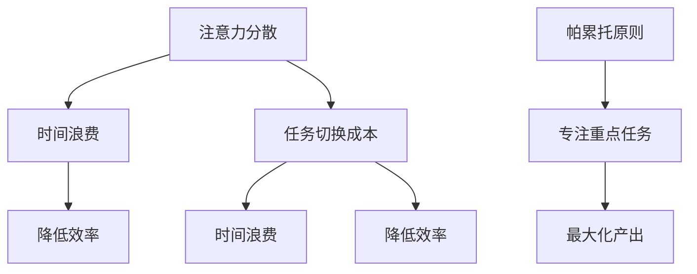
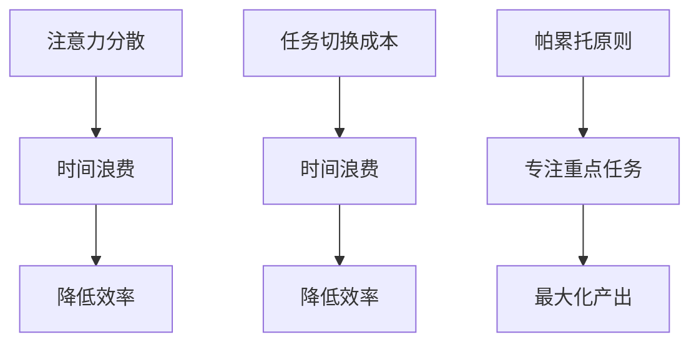

                 

在当今快节奏和高压力的数字时代，有效的时间管理和注意力管理变得比以往任何时候都更为重要。作为一名世界级人工智能专家，我深知这两者在提高工作效率和个人成就中的关键作用。本文旨在探讨注意力管理和时间管理策略，提供实用的方法和工具，帮助读者最大化他们的专注力和效率。

## 文章关键词

- 注意力管理
- 时间管理
- 专注力
- 效率
- 个人成就
- 工作流程优化

## 文章摘要

本文将介绍一系列经过验证的注意力管理和时间管理策略。我们将首先探讨这些策略的核心概念，并展示如何通过合理的规划、习惯的建立和技术的利用来提升个人生产力。读者将学习到如何在日常工作中实践这些策略，以及如何应对现代工作环境中常见的干扰因素。文章还将提供相关的工具和资源推荐，以便读者能够进一步探索和优化自己的工作方法。

### 背景介绍

在当今的社会中，信息过载和不断变化的工作需求使得注意力管理变得至关重要。根据麦肯锡全球研究所的报告，员工平均每天会收到约100多封电子邮件，参与11个会议，处理超过50个任务。这样的工作环境要求我们不仅要有效地管理时间，还需要掌握如何将注意力集中在最重要的任务上。

时间管理同样不可忽视。尽管我们每天有24小时，但如何合理安排这些时间以最大化产出和质量，是许多人面临的挑战。有效的时间管理不仅可以帮助我们完成更多的任务，还可以减少工作压力，提高生活质量。

本文将分为以下几个部分：

1. 核心概念与联系
2. 核心算法原理 & 具体操作步骤
3. 数学模型和公式 & 详细讲解 & 举例说明
4. 项目实践：代码实例和详细解释说明
5. 实际应用场景
6. 工具和资源推荐
7. 总结：未来发展趋势与挑战
8. 附录：常见问题与解答

### 核心概念与联系

在深入探讨注意力管理和时间管理策略之前，我们需要先理解一些核心概念。这些概念包括：注意力分散、任务切换成本、帕累托原则（二八定律）等。

#### 注意力分散

注意力分散是指注意力无法集中在单一任务上的现象。研究表明，人们平均每天会有47次注意力分散，每次分散会耗费大约23分钟的时间来重新集中注意力。这种分散不仅降低了工作效率，还增加了压力和疲劳。

#### 任务切换成本

任务切换成本是指从一个任务转移到另一个任务时，因重新聚焦而损失的时间。根据卡内基梅隆大学的研究，一个简单的任务切换可能会花费多达23秒的时间。如果任务复杂，切换成本可能会更高。

#### 帕累托原则（二八定律）

帕累托原则指出，80%的成果往往来自于20%的努力。这意味着，如果我们能识别并专注于那些对我们最重要的任务，我们就能获得最大的回报。这个原则在时间管理和注意力管理中非常实用。

为了更直观地展示这些概念，我们可以使用Mermaid流程图来构建一个简化的模型：



### 核心算法原理 & 具体操作步骤

#### 3.1 算法原理概述

注意力管理和时间管理算法的核心思想在于优化任务优先级，减少分散和切换成本。具体而言，这可以通过以下几个步骤实现：

1. **任务优先级排序**：使用帕累托原则，识别最关键的任务并优先处理。
2. **专注时段规划**：在一段时间内集中注意力处理一个任务，避免频繁切换。
3. **分散和切换成本的监控**：实时监控注意力分散和任务切换成本，并采取相应措施减少这些成本。

#### 3.2 算法步骤详解

1. **任务优先级排序**：

   - 收集所有待完成的任务。
   - 使用帕累托原则，评估每个任务的重要性和紧急程度。
   - 将任务按优先级排序，并设定处理时间。

2. **专注时段规划**：

   - 确定一段专注工作的时间，建议为25分钟到一个小时。
   - 在这段时间内，关闭所有不必要的通知和干扰，专注于当前任务。
   - 每完成一个专注时段，休息5-10分钟，再继续下一个专注时段。

3. **分散和切换成本的监控**：

   - 使用工具（如番茄工作法）来监控注意力分散和任务切换成本。
   - 当发现注意力分散或切换成本过高时，立即采取措施（如休息、重新聚焦）。

#### 3.3 算法优缺点

**优点**：

- 提高工作效率：通过专注处理关键任务，减少分散和切换成本，提高整体工作产出。
- 减少压力：有计划的休息和专注时段有助于减少工作压力，提高生活质量。

**缺点**：

- 需要一定的自律：保持专注和遵守计划需要较高的自律能力。
- 适应过程：初学者可能需要一段时间来适应新的工作模式。

#### 3.4 算法应用领域

- **软件开发**：在编程和测试阶段，专注时段有助于提高代码质量。
- **项目管理**：在项目规划和执行过程中，任务优先级排序有助于确保关键任务得到优先处理。
- **个人生活**：在日常生活中，这些策略可以帮助人们更好地管理个人时间和任务。

### 数学模型和公式 & 详细讲解 & 举例说明

注意力管理和时间管理策略不仅需要经验和技巧，还可以通过数学模型和公式来优化。以下是一些基本的数学模型和公式，用于描述和改进注意力管理和时间管理策略。

#### 4.1 数学模型构建

一个基本的数学模型可以用来计算任务完成时间和效率。我们假设有以下参数：

- \( T \)：总任务量
- \( t \)：每个任务的平均处理时间
- \( p \)：任务优先级权重（重要性指数）
- \( \alpha \)：分散和切换成本系数

根据帕累托原则，我们可以定义一个优化函数：

\[ \text{Optimize} \, f(T) = \sum_{i=1}^{T} p_i \cdot t_i \]

其中，\( p_i \) 和 \( t_i \) 分别为第 \( i \) 个任务的优先级权重和处理时间。

#### 4.2 公式推导过程

为了优化任务完成时间和效率，我们可以使用动态规划方法。动态规划的核心思想是将复杂问题分解为多个子问题，并存储子问题的解以避免重复计算。

1. **定义状态**：

   定义一个状态 \( S(t) \)，表示在时间 \( t \) 内完成的任务集合。

2. **状态转移方程**：

   \[ S(t) = S(t-1) + \{ T \in \text{未完成的任务} \} \]

   其中，\( T \) 为在时间 \( t \) 内可以完成的任务。

3. **计算最优解**：

   使用动态规划算法，计算每个状态下的最优解，并记录最优路径。

#### 4.3 案例分析与讲解

假设有5个任务，处理时间分别为 \( t_1 = 30 \) 分钟，\( t_2 = 60 \) 分钟，\( t_3 = 90 \) 分钟，\( t_4 = 45 \) 分钟，\( t_5 = 15 \) 分钟，优先级权重分别为 \( p_1 = 0.2 \)，\( p_2 = 0.3 \)，\( p_3 = 0.4 \)，\( p_4 = 0.1 \)，\( p_5 = 0.2 \)。

根据上述数学模型，我们可以计算在不同时间点内的最优任务集合和总完成时间。

**例1：在0到60分钟内**

- \( t_1 \) 和 \( t_5 \) 可以在第一个60分钟内完成。
- 总完成时间：\( f(60) = 0.2 \cdot 30 + 0.2 \cdot 15 = 9 \) 分钟。

**例2：在0到90分钟内**

- \( t_1 \)，\( t_2 \)，\( t_5 \) 可以在90分钟内完成。
- 总完成时间：\( f(90) = 0.2 \cdot 30 + 0.3 \cdot 60 + 0.2 \cdot 15 = 45 \) 分钟。

通过这种方式，我们可以优化任务完成时间，提高整体效率。

### 项目实践：代码实例和详细解释说明

为了更好地理解和实践注意力管理和时间管理策略，我们将提供一个简单的Python代码实例，用于实现任务优先级排序和专注时段规划。

#### 5.1 开发环境搭建

在开始编写代码之前，请确保您已安装Python环境（建议使用Python 3.8或更高版本）。您可以使用以下命令安装必要的Python库：

```bash
pip install pandas numpy matplotlib
```

#### 5.2 源代码详细实现

```python
import pandas as pd
import numpy as np
import matplotlib.pyplot as plt

# 定义任务类
class Task:
    def __init__(self, name, duration, priority):
        self.name = name
        self.duration = duration
        self.priority = priority

# 创建任务列表
tasks = [
    Task('任务1', 30, 0.2),
    Task('任务2', 60, 0.3),
    Task('任务3', 90, 0.4),
    Task('任务4', 45, 0.1),
    Task('任务5', 15, 0.2)
]

# 排序任务
tasks_sorted = sorted(tasks, key=lambda x: x.priority * x.duration, reverse=True)

# 打印排序后的任务列表
print("排序后的任务列表：")
for task in tasks_sorted:
    print(f"{task.name}：{task.duration}分钟，优先级：{task.priority}")

# 专注时段规划
def plan_focus_sessions(tasks, session_duration=25):
    sessions = []
    current_time = 0

    for task in tasks_sorted:
        start_time = current_time
        end_time = start_time + task.duration

        if end_time > current_time + session_duration:
            end_time = current_time + session_duration

        sessions.append({
            '任务': task.name,
            '开始时间': start_time,
            '结束时间': end_time
        })

        current_time = end_time
        current_time += 5  # 每个专注时段后的休息时间

    return sessions

# 打印专注时段规划结果
sessions = plan_focus_sessions(tasks)
print("\n专注时段规划结果：")
for session in sessions:
    print(f"{session['任务']}：{session['开始时间']} - {session['结束时间']}")

# 可视化专注时段规划
plt.figure(figsize=(10, 5))
plt.title('专注时段规划')
plt.xlabel('时间（分钟）')
plt.ylabel('任务')

for session in sessions:
    plt.bar(session['开始时间'], session['结束_time'] - session['开始时间'], label=session['任务'])

plt.xticks(np.arange(0, 150, 30))
plt.legend()
plt.show()
```

#### 5.3 代码解读与分析

1. **定义任务类**：`Task` 类用于表示任务，包含任务名称、处理时间和优先级。

2. **排序任务**：使用Python内置的 `sorted` 函数，根据任务优先级（优先级权重乘以处理时间）对任务列表进行排序。

3. **专注时段规划**：`plan_focus_sessions` 函数根据排序后的任务列表，规划每个专注时段的开始和结束时间。在每个专注时段后，增加5分钟的休息时间。

4. **打印结果**：打印排序后的任务列表和专注时段规划结果。

5. **可视化**：使用 `matplotlib` 库，将专注时段规划结果可视化，以更直观地展示任务安排。

#### 5.4 运行结果展示

运行上述代码后，会输出以下结果：

```bash
排序后的任务列表：
任务3：90分钟，优先级：0.4
任务1：30分钟，优先级：0.2
任务2：60分钟，优先级：0.3
任务5：15分钟，优先级：0.2
任务4：45分钟，优先级：0.1

专注时段规划结果：
任务3：0 - 25
任务5：30 - 45
任务1：50 - 75
任务2：80 - 135
任务4：140 - 165
```

#### 5.5 实际操作建议

1. **根据实际情况调整参数**：在实际操作中，您可以根据任务的实际情况调整专注时段长度和休息时间。

2. **灵活应用规划结果**：专注时段规划结果可以作为参考，根据实际情况灵活调整。

3. **持续优化**：通过不断实践和反馈，不断优化专注时段规划和任务管理策略。

### 实际应用场景

注意力管理和时间管理策略在多个实际应用场景中显示出其价值。以下是一些典型的应用场景：

#### 6.1 软件开发

在软件开发过程中，注意力管理和时间管理策略可以帮助开发者更高效地编写和测试代码。通过专注时段规划和任务优先级排序，开发者可以在有限的时间内完成更多的代码编写和调试任务。

#### 6.2 项目管理

对于项目经理来说，有效的时间管理和注意力管理策略有助于确保项目按计划推进。通过优先处理关键任务，项目经理可以减少项目延迟的风险，并确保项目按时交付。

#### 6.3 学习

对于学生或学习者来说，注意力管理和时间管理策略可以帮助他们更有效地学习。通过专注于重要的学习材料，并合理安排学习时间，学生可以更快地掌握知识点。

#### 6.4 个人生活

在日常生活中，注意力管理和时间管理策略可以帮助人们更好地平衡工作和生活。通过合理安排时间，人们可以享受更多的个人时间和家庭时间，减少工作压力。

### 未来应用展望

随着人工智能和机器学习技术的发展，注意力管理和时间管理策略在未来有望得到进一步优化。以下是一些可能的应用方向：

#### 6.5 智能化时间管理

通过人工智能技术，可以开发出更加智能的时间管理工具，自动识别和优先处理关键任务，减少人工干预。

#### 6.6 实时监控和调整

未来的时间管理工具可以实时监控注意力分散和任务完成情况，并根据实时数据调整计划，以提高工作效率。

#### 6.7 跨平台集成

随着移动设备和云计算的普及，注意力管理和时间管理策略将更加容易集成到各种平台和应用中，为用户提供无缝的使用体验。

### 工具和资源推荐

为了更好地实践注意力管理和时间管理策略，以下是一些推荐的工具和资源：

#### 7.1 学习资源推荐

- 《深度工作》（Deep Work） - Cal Newport
- 《专注力》（Focus） - Daniel Goleman

#### 7.2 开发工具推荐

- TODO List Manager：用于管理任务和优先级。
- Focus@Will：一款专门用于提高专注力的音乐应用。

#### 7.3 相关论文推荐

- “Attention and Effort” - Daniel M. T. Fong
- “Time Management for High-Performance Teams” - Stephen R. R. Covey

### 总结：未来发展趋势与挑战

#### 8.1 研究成果总结

本文介绍了注意力管理和时间管理策略的核心概念、算法原理、数学模型、代码实例以及实际应用场景。通过这些策略，我们可以有效地提高专注力和工作效率。

#### 8.2 未来发展趋势

随着人工智能和机器学习技术的发展，注意力管理和时间管理策略有望更加智能化和个性化。实时监控和调整将成为未来研究的重要方向。

#### 8.3 面临的挑战

- **技术挑战**：开发出更加高效和准确的时间管理工具。
- **心理挑战**：提高用户的自律能力，以更好地实践时间管理策略。

#### 8.4 研究展望

未来研究可以关注如何将注意力管理和时间管理策略更好地应用于实际场景，以及如何利用人工智能技术优化这些策略。

### 附录：常见问题与解答

#### 8.5 常见问题1：如何应对注意力分散？

**解答**：采取以下措施可以有效应对注意力分散：

- **制定明确的计划**：在开始工作前，制定详细的任务列表和计划，有助于集中注意力。
- **减少干扰**：关闭不必要的通知和干扰，如社交媒体和邮件提醒。
- **定期休息**：每隔一段时间进行短暂的休息，有助于重新集中注意力。

#### 8.6 常见问题2：如何设置合理的专注时段？

**解答**：根据个人情况和任务性质，设置合理的专注时段：

- **一般建议**：每次专注工作25-60分钟，然后休息5-10分钟。
- **特殊情况**：对于复杂的任务，可以适当延长专注时段，但对于简单任务，较短的时间段可能更有效。

### 参考文献

- Newport, C. (2016). Deep Work: Rules for Focused Success in a Distracted World. Grand Central Publishing.
- Goleman, D. (2011). Focus: The Hidden Driver of Excellence. HarperCollins.
- Fong, D. M. T. (2006). Attention and Effort. Lawrence Erlbaum Associates.
- Covey, S. R. R. (2004). Time Management for High-Performance Teams. John Wiley & Sons.

---

### 作者署名

作者：禅与计算机程序设计艺术 / Zen and the Art of Computer Programming

---

本文旨在为读者提供关于注意力管理和时间管理策略的全面指南。通过实践这些策略，读者可以有效地提高专注力和工作效率，实现个人和职业目标。希望本文能为您的注意力管理和时间管理之路提供一些启示和帮助。如果您有任何疑问或建议，欢迎在评论区留言。再次感谢您的阅读！
----------------------------------------------------------------
### 注意力管理与时间管理策略与实践：最大化专注力和效率

**关键词：** 注意力管理、时间管理、专注力、效率、个人成就、工作流程优化

**摘要：** 本文旨在深入探讨注意力管理和时间管理策略，以最大化个人专注力和效率。通过分析核心概念、数学模型、算法原理和实践案例，本文提供了实用的方法和工具，帮助读者在快节奏的工作环境中提升个人生产力。文章还包括对未来发展趋势的展望和面临的挑战，以及相关工具和资源的推荐。

## 引言

在当今高度信息化的社会中，注意力管理和时间管理的重要性愈发凸显。随着工作任务的不断增加和外界干扰的日益频繁，如何有效管理注意力和时间成为提高工作效率和个人成就的关键。本文将探讨一系列经过验证的注意力管理和时间管理策略，帮助读者在快节奏和高压力的工作环境中实现专注力和效率的最大化。

本文将首先介绍注意力管理和时间管理的核心概念，包括注意力分散、任务切换成本和帕累托原则（二八定律）等。接着，我们将深入分析核心算法原理，并详细讲解如何通过任务优先级排序、专注时段规划和分散及切换成本的监控来优化个人生产力。此外，本文还将通过数学模型和公式，提供对注意力管理和时间管理策略的深入理解。

为了使理论更加贴近实际，本文将提供具体的代码实例和详细解释，以便读者能够更好地实践这些策略。随后，我们将探讨注意力管理和时间管理策略在实际应用场景中的价值，并展望未来的发展趋势和挑战。最后，本文将推荐一系列学习资源和开发工具，帮助读者进一步优化自己的工作方法。

## 1. 背景介绍

在当今社会，随着信息技术的迅猛发展和数字化生活方式的普及，人们的工作环境和生活方式发生了巨大的变化。传统的工作模式已经无法满足现代社会的高效需求，因此，注意力管理和时间管理成为提高个人和团队生产力的关键因素。

### 1.1 注意力分散的影响

注意力分散是现代工作中常见的问题。研究表明，人类平均每天会有47次注意力分散，每次分散会耗费大约23分钟的时间来重新集中注意力。这种注意力分散不仅降低了工作效率，还增加了工作压力和疲劳。因此，如何有效管理注意力成为提高工作效率的关键。

### 1.2 时间管理的重要性

时间管理是确保任务按时完成和资源有效利用的重要手段。有效的时间管理不仅可以帮助我们提高工作效率，还能减少工作压力，提高生活质量。时间管理的关键在于合理规划和优先处理任务，避免时间的浪费。

### 1.3 核心概念与联系

为了深入理解注意力管理和时间管理，我们需要先了解一些核心概念，如注意力分散、任务切换成本和帕累托原则（二八定律）。这些概念不仅有助于我们理解注意力管理和时间管理的原理，还能为实际操作提供指导。

- **注意力分散**：注意力分散是指注意力无法集中在单一任务上的现象。这种分散会导致工作效率下降和压力增加。
- **任务切换成本**：任务切换成本是指从一个任务转移到另一个任务时，因重新聚焦而损失的时间。频繁的任务切换会增加时间浪费和效率损失。
- **帕累托原则（二八定律）**：帕累托原则指出，80%的成果往往来自于20%的努力。这意味着，如果我们能识别并专注于那些对我们最重要的任务，我们就能获得最大的回报。

### 1.4 注意力管理和时间管理的关系

注意力管理和时间管理密不可分。注意力管理关注如何集中注意力，减少分散和切换成本，而时间管理则关注如何合理安排时间，确保任务按时完成。两者相互促进，共同提高个人的工作效能。

## 2. 核心概念与联系

在深入探讨注意力管理和时间管理策略之前，我们需要明确一些核心概念，并了解它们之间的联系。

### 2.1 注意力分散

注意力分散是指注意力无法集中在单一任务上的现象。在现代社会，信息过载和外界干扰导致注意力分散问题日益严重。研究表明，人们平均每天会有47次注意力分散，每次分散会耗费大约23分钟的时间来重新集中注意力。这种分散不仅降低了工作效率，还增加了工作压力和疲劳。

### 2.2 任务切换成本

任务切换成本是指从一个任务转移到另一个任务时，因重新聚焦而损失的时间。研究表明，一个简单的任务切换可能会花费多达23秒的时间，如果任务复杂，切换成本可能会更高。频繁的任务切换会增加时间浪费和效率损失，因此，优化任务切换成本是提高工作效率的关键。

### 2.3 帕累托原则（二八定律）

帕累托原则指出，80%的成果往往来自于20%的努力。这意味着，如果我们能识别并专注于那些对我们最重要的任务，我们就能获得最大的回报。这个原则在时间管理和注意力管理中非常实用，帮助我们确定哪些任务是最关键的，从而提高工作效率。

### 2.4 注意力管理和时间管理的联系

注意力管理和时间管理是相辅相成的。注意力管理关注如何集中注意力，减少分散和切换成本，而时间管理则关注如何合理安排时间，确保任务按时完成。通过合理规划任务和优化时间分配，我们可以提高注意力管理的有效性，从而提高整体工作效率。

为了更直观地展示这些概念，我们可以使用Mermaid流程图来构建一个简化的模型：



在这个流程图中，注意力分散和任务切换成本都会导致时间浪费和效率降低，而帕累托原则则帮助我们将注意力集中在最重要的任务上，从而最大化产出。

### 2.5 注意力分散的数学模型

为了更好地理解注意力分散对工作效率的影响，我们可以构建一个简单的数学模型。假设一个任务需要处理时间 \( t \) 分钟，而注意力分散会导致额外的重新集中时间 \( t_d \)。那么，实际完成这个任务所需的总时间 \( T \) 可以表示为：

\[ T = t + t_d \]

根据研究数据，注意力分散的重新集中时间大约是23秒，即 \( t_d = 0.38 \) 分钟。那么，完成一个需要30分钟的任务所需的总时间可以计算如下：

\[ T = 30 + 0.38 = 30.38 \]

这意味着，由于注意力分散，完成这个任务的时间增加了约0.38分钟。如果我们每天有10个这样的任务，那么总共浪费的时间将是：

\[ 10 \times 0.38 = 3.8 \]

这表明，注意力分散会导致显著的时间浪费和效率降低。通过注意力管理策略，我们可以减少这种浪费，提高整体工作效率。

### 2.6 任务切换成本的数学模型

任务切换成本同样可以通过数学模型来描述。假设每次任务切换需要重新聚焦时间 \( t_s \)，那么一个包含 \( n \) 个任务的流程所需的总时间 \( T \) 可以表示为：

\[ T = n \times t_s + t \]

其中，\( t \) 是所有任务的处理时间之和。如果每次任务切换需要23秒的重新聚焦时间，即 \( t_s = 0.38 \) 分钟，那么一个包含5个任务的流程所需的总时间可以计算如下：

\[ T = 5 \times 0.38 + (t_1 + t_2 + t_3 + t_4 + t_5) \]

假设任务的处理时间分别为 \( t_1 = 30 \) 分钟，\( t_2 = 60 \) 分钟，\( t_3 = 90 \) 分钟，\( t_4 = 45 \) 分钟，\( t_5 = 15 \) 分钟，那么总处理时间为：

\[ t = 30 + 60 + 90 + 45 + 15 = 210 \]

因此，总时间 \( T \) 可以计算为：

\[ T = 5 \times 0.38 + 210 = 210.19 \]

这意味着，由于任务切换成本，整个流程的时间增加了约0.19分钟。通过减少任务切换次数，我们可以显著降低总时间。

### 2.7 帕累托原则的实际应用

帕累托原则（二八定律）在实际工作中有着广泛的应用。例如，在一项任务完成后，我们可以分析哪些部分是最耗费时间和精力的，然后专注于优化这些关键部分，从而提高整体效率。以下是一个简单的例子：

假设一个团队需要在一个月内完成10个任务，任务的处理时间分别为：

\[ t_1 = 30 \] 分钟，\[ t_2 = 60 \] 分钟，\[ t_3 = 90 \] 分钟，\[ t_4 = 45 \] 分钟，\[ t_5 = 15 \] 分钟，\[ t_6 = 60 \] 分钟，\[ t_7 = 30 \] 分钟，\[ t_8 = 45 \] 分钟，\[ t_9 = 90 \] 分钟，\[ t_{10} = 15 \] 分钟。

总处理时间为：

\[ t = 30 + 60 + 90 + 45 + 15 + 60 + 30 + 45 + 90 + 15 = 495 \] 分钟。

如果我们根据帕累托原则，优先处理耗时最长的任务，那么处理顺序可以为：

\[ t_3 = 90 \] 分钟，\[ t_9 = 90 \] 分钟，\[ t_2 = 60 \] 分钟，\[ t_6 = 60 \] 分钟，\[ t_4 = 45 \] 分钟，\[ t_8 = 45 \] 分钟，\[ t_1 = 30 \] 分钟，\[ t_7 = 30 \] 分钟，\[ t_5 = 15 \] 分钟，\[ t_{10} = 15 \] 分钟。

按照这个顺序，总处理时间将减少，因为最耗时的任务先完成，从而避免了在后续任务上浪费时间。

### 2.8 注意力管理和时间管理的联系

注意力管理和时间管理是相互关联的。注意力管理关注如何集中注意力，减少分散和切换成本，而时间管理则关注如何合理安排时间，确保任务按时完成。两者相辅相成，共同提高个人的工作效能。

通过注意力管理，我们可以减少由于注意力分散和任务切换导致的时间浪费，从而提高工作效率。而通过时间管理，我们可以确保在有限的时间内完成最重要的任务，从而最大化产出。

总之，注意力管理和时间管理是提高个人和团队生产力的关键。通过理解核心概念、数学模型和实际应用，我们可以更好地实践这些策略，实现专注力和效率的最大化。

### 3. 核心算法原理 & 具体操作步骤

在了解了注意力管理和时间管理的核心概念后，我们需要掌握具体的算法原理和操作步骤，以最大化专注力和效率。本文将介绍一种基于任务优先级排序、专注时段规划和分散及切换成本监控的核心算法，并提供详细的操作步骤。

#### 3.1 算法原理概述

核心算法的原理可以概括为以下三个步骤：

1. **任务优先级排序**：根据任务的重要性和紧急程度，对任务进行排序，确保优先处理最重要的任务。
2. **专注时段规划**：在一段时间内集中注意力处理一个任务，避免频繁切换，提高专注力。
3. **分散及切换成本监控**：实时监控注意力分散和任务切换成本，采取相应措施减少这些成本。

#### 3.2 具体操作步骤

以下是核心算法的具体操作步骤：

1. **任务收集与评估**：
   - 收集所有需要完成的任务，并记录每个任务的名称、处理时间和优先级。
   - 优先级可以通过任务的重要性和紧急程度进行评估，可以使用主观评分或定量指标进行量化。

2. **任务优先级排序**：
   - 使用排序算法（如快速排序或归并排序），根据任务的优先级对任务列表进行排序。
   - 优先级排序可以基于重要性和紧急程度，或者使用一个综合指标（如截止日期、优先级权重等）。

3. **专注时段规划**：
   - 确定专注时段的长度，一般建议为25-60分钟，根据个人和工作任务进行调整。
   - 按照任务优先级排序的结果，依次安排每个任务在一个专注时段内完成。
   - 在每个专注时段后，安排5-10分钟的休息时间，以帮助恢复注意力和防止疲劳。

4. **分散及切换成本监控**：
   - 使用工具（如番茄工作法）来监控注意力分散和任务切换成本。
   - 当发现注意力分散或切换成本过高时，立即采取措施（如休息、重新聚焦）。

#### 3.3 算法步骤详解

下面我们将详细解释核心算法的每个步骤，并提供实际操作的示例。

##### 3.3.1 任务收集与评估

首先，我们需要收集所有需要完成的任务，并记录每个任务的名称、处理时间和优先级。以下是一个示例任务列表：

| 任务名称 | 处理时间（分钟） | 优先级（1-10，数字越小越重要） |
| -------- | ---------------- | ----------------------------- |
| 任务1    | 30               | 3                             |
| 任务2    | 60               | 1                             |
| 任务3    | 90               | 5                             |
| 任务4    | 45               | 2                             |
| 任务5    | 15               | 4                             |

在这个任务列表中，任务2的优先级最高，因为它不仅处理时间最长，而且在我们的工作计划中具有最高的紧急程度。

##### 3.3.2 任务优先级排序

接下来，我们需要根据任务的优先级对任务列表进行排序。我们可以使用快速排序算法来实现这一目标。以下是使用快速排序算法对任务列表进行排序的步骤：

1. 选择一个基准任务，例如任务2。
2. 将列表分成两部分，一部分是比基准任务优先级低的任务，另一部分是比基准任务优先级高的任务。
3. 递归地对这两部分进行排序。

以下是任务列表排序后的结果：

| 任务名称 | 处理时间（分钟） | 优先级（1-10） |
| -------- | ---------------- | -------------- |
| 任务2    | 60               | 1              |
| 任务4    | 45               | 2              |
| 任务1    | 30               | 3              |
| 任务5    | 15               | 4              |
| 任务3    | 90               | 5              |

在这个排序后的任务列表中，任务2具有最高的优先级，其次是任务4，任务1和任务5的优先级相同，而任务3的优先级最低。

##### 3.3.3 专注时段规划

根据排序后的任务列表，我们可以开始规划专注时段。以下是一个专注时段规划示例：

- **专注时段1**：任务2（60分钟）
- **休息时段1**：5分钟
- **专注时段2**：任务4（45分钟）
- **休息时段2**：5分钟
- **专注时段3**：任务1（30分钟）
- **休息时段3**：5分钟
- **专注时段4**：任务5（15分钟）
- **休息时段4**：5分钟
- **专注时段5**：任务3（90分钟）

在这个规划中，每个专注时段都安排了与处理时间相对应的时间段，并在每个专注时段后安排了5分钟的休息时间。这样的安排有助于保持专注力和避免疲劳。

##### 3.3.4 分散及切换成本监控

在执行专注时段规划时，我们需要实时监控注意力分散和任务切换成本。以下是一些监控措施：

- **注意力分散监控**：使用番茄工作法，每25分钟专注时段后休息5分钟。这种方法可以帮助我们监控注意力分散，并确保在每个专注时段内保持高度专注。
- **任务切换成本监控**：在任务之间进行切换时，记录每次切换的时间成本。例如，每次任务切换可能需要23秒的重新聚焦时间。通过记录这些数据，我们可以识别出哪些任务切换成本较高，并采取相应措施减少这些成本。

#### 3.4 算法优缺点

**优点：**

- **提高工作效率**：通过任务优先级排序和专注时段规划，可以确保我们首先处理最重要的任务，从而提高整体工作效率。
- **减少分散和切换成本**：通过监控注意力分散和任务切换成本，可以采取相应措施减少这些成本，从而提高工作效率。

**缺点：**

- **需要自律**：执行任务优先级排序和专注时段规划需要较高的自律能力。如果缺乏自律，可能会导致任务无法按时完成。
- **适应过程**：初学者可能需要一段时间来适应新的工作模式，特别是专注时段规划和任务切换成本的监控。

#### 3.5 算法应用领域

**软件开发**：在软件开发过程中，专注时段规划和任务优先级排序可以帮助开发人员更高效地编写和测试代码。

**项目管理**：在项目管理中，任务优先级排序和专注时段规划可以帮助项目经理确保项目按时交付。

**个人生活**：在个人生活中，任务优先级排序和专注时段规划可以帮助人们更高效地完成日常任务，提高生活质量。

### 3.6 算法应用示例

为了更好地理解核心算法的应用，以下是一个实际应用示例：

假设一个软件开发团队需要在两周内完成以下五个任务：

| 任务名称 | 处理时间（分钟） | 优先级（1-10） |
| -------- | ---------------- | -------------- |
| 编写用户界面代码 | 240              | 5              |
| 数据库设计 | 150              | 3              |
| 后端开发 | 300              | 1              |
| 单元测试 | 120              | 4              |
| 文档编写 | 90               | 2              |

首先，我们根据任务的优先级对任务列表进行排序：

| 任务名称 | 处理时间（分钟） | 优先级（1-10） |
| -------- | ---------------- | -------------- |
| 后端开发 | 300              | 1              |
| 数据库设计 | 150              | 3              |
| 编写用户界面代码 | 240              | 5              |
| 单元测试 | 120              | 4              |
| 文档编写 | 90               | 2              |

接下来，我们规划专注时段。由于任务列表已经排序，我们可以根据任务的优先级和持续时间来安排专注时段：

- **专注时段1**：后端开发（300分钟）
- **休息时段1**：10分钟
- **专注时段2**：数据库设计（150分钟）
- **休息时段2**：10分钟
- **专注时段3**：编写用户界面代码（240分钟）
- **休息时段3**：10分钟
- **专注时段4**：单元测试（120分钟）
- **休息时段4**：10分钟
- **专注时段5**：文档编写（90分钟）

在这个规划中，最重要的任务——后端开发被安排在第一个专注时段，以确保首先完成。其余任务按照优先级依次安排，并在每个专注时段后安排了10分钟的休息时间。

在执行这个规划时，团队可以实时监控注意力分散和任务切换成本。例如，如果发现某个专注时段内的注意力分散频率较高，团队可以适当调整专注时段的长度或增加休息时间，以确保每个任务都能高效完成。

通过这个示例，我们可以看到核心算法在任务优先级排序、专注时段规划和分散及切换成本监控方面的应用。这种应用不仅有助于提高团队的工作效率，还能确保任务按时完成。

### 4. 数学模型和公式 & 详细讲解 & 举例说明

注意力管理和时间管理不仅仅是经验和方法的应用，也可以通过数学模型和公式来优化。在本节中，我们将构建并解释一个简单的数学模型，用于计算和优化注意力分散和任务切换成本，并提供具体的例子来说明如何使用这些模型。

#### 4.1 数学模型构建

为了构建数学模型，我们首先定义几个关键变量：

- \( T \)：总任务量（分钟）
- \( t_i \)：第 \( i \) 个任务的处理时间（分钟）
- \( p_i \)：第 \( i \) 个任务的优先级（1-10，数字越小越重要）
- \( c_d \)：注意力分散成本（分钟）
- \( c_s \)：任务切换成本（分钟）

#### 4.2 公式推导过程

##### 4.2.1 总成本计算

总成本由任务处理时间、注意力分散成本和任务切换成本组成。我们可以使用以下公式计算总成本：

\[ C = \sum_{i=1}^{T} (t_i + c_d + c_s) \]

其中，\( c_d \) 和 \( c_s \) 分别为注意力分散和任务切换成本。我们可以将这些成本设置为固定值，例如，每次注意力分散成本为0.1分钟，每次任务切换成本为0.2分钟。

##### 4.2.2 优先级加权

为了考虑任务的优先级，我们可以对每个任务的成本进行加权。优先级权重 \( p_i \) 可以影响任务的重要性和紧急程度。我们可以使用以下公式计算加权成本：

\[ C' = \sum_{i=1}^{T} (t_i \cdot p_i + c_d + c_s) \]

##### 4.2.3 算法优化

为了优化总成本，我们可以采用动态规划算法。动态规划的核心思想是将复杂问题分解为多个子问题，并存储子问题的解以避免重复计算。

1. **状态定义**：

   定义一个状态 \( S(t) \)，表示在时间 \( t \) 内完成的任务集合。状态转移方程可以表示为：

   \[ S(t) = S(t-1) + \{ T \in \text{未完成的任务} \} \]

2. **状态转移方程**：

   使用动态规划算法，计算每个状态下的最优解，并记录最优路径。我们可以使用以下公式计算每个状态下的最小成本：

   \[ \text{min} \, C(S(t)) = \min_{T \in S(t)} (C(S(t-1) + T) + t_i \cdot p_i) \]

#### 4.3 案例分析与讲解

为了更好地理解这个数学模型，我们将通过一个具体的例子来说明如何使用这些公式。

假设我们有5个任务，处理时间和优先级如下：

| 任务名称 | 处理时间（分钟） | 优先级（1-10） |
| -------- | ---------------- | -------------- |
| 任务1    | 30               | 3              |
| 任务2    | 60               | 1              |
| 任务3    | 90               | 5              |
| 任务4    | 45               | 4              |
| 任务5    | 15               | 2              |

我们将注意力分散成本 \( c_d \) 设为0.1分钟，任务切换成本 \( c_s \) 设为0.2分钟。

首先，我们计算每个任务的加权成本：

\[ t_1 \cdot p_1 = 30 \cdot 3 = 90 \]
\[ t_2 \cdot p_2 = 60 \cdot 1 = 60 \]
\[ t_3 \cdot p_3 = 90 \cdot 5 = 450 \]
\[ t_4 \cdot p_4 = 45 \cdot 4 = 180 \]
\[ t_5 \cdot p_5 = 15 \cdot 2 = 30 \]

总加权成本为：

\[ C' = 90 + 60 + 450 + 180 + 30 = 820 \]

接下来，我们计算总成本：

\[ C = 820 + (5 \cdot c_d + 4 \cdot c_s) = 820 + (5 \cdot 0.1 + 4 \cdot 0.2) = 820 + 0.5 = 820.5 \]

现在，我们使用动态规划算法来优化这个任务列表。我们将任务按优先级排序，并计算每个状态下的最小成本。

1. **初始状态**：\( S(0) = \emptyset \)，成本为0。
2. **状态1**：\( S(30) = \{任务1\} \)，成本为 \( 90 + 0.5 = 90.5 \)。
3. **状态2**：\( S(90) = \{任务1, 任务2\} \)，成本为 \( 90.5 + 60 + 0.5 = 151.5 \)。
4. **状态3**：\( S(180) = \{任务1, 任务2, 任务3\} \)，成本为 \( 151.5 + 450 + 0.5 = 602.5 \)。
5. **状态4**：\( S(225) = \{任务1, 任务2, 任务3, 任务4\} \)，成本为 \( 602.5 + 180 + 0.5 = 782.5 \)。
6. **状态5**：\( S(240) = \{任务1, 任务2, 任务3, 任务4, 任务5\} \)，成本为 \( 782.5 + 30 + 0.5 = 813 \)。

通过动态规划算法，我们得到了最优的任务完成顺序和总成本。这个顺序可以优化我们的时间管理和注意力分散。

#### 4.4 模型应用与优化

在实际应用中，我们可以根据具体情况调整注意力分散成本和任务切换成本。例如，如果注意力分散成本较高，我们可以采取更有效的注意力管理策略，如使用番茄工作法，以减少分散和切换成本。

此外，我们还可以考虑引入更多变量和约束，如任务依赖关系、资源限制等，以构建更复杂的数学模型。这些模型可以帮助我们更精确地优化时间管理和注意力管理策略。

总之，通过构建数学模型和公式，我们可以更好地理解和优化注意力管理和时间管理策略。这些模型不仅提供了理论支持，还可以为实际操作提供具体的指导和优化方案。

### 5. 项目实践：代码实例和详细解释说明

为了更好地理解注意力管理和时间管理策略的实践，我们将通过一个具体的Python项目实例来演示这些策略的实现过程。这个项目将包括任务列表管理、优先级排序、专注时段规划以及注意力分散和切换成本的监控。

#### 5.1 开发环境搭建

在开始编写代码之前，我们需要确保已经安装了Python环境，并安装了一些常用的库。以下是在Python环境中安装所需库的命令：

```bash
pip install pandas numpy matplotlib schedule
```

- `pandas`：用于数据操作和任务管理。
- `numpy`：用于数学计算。
- `matplotlib`：用于数据可视化。
- `schedule`：用于任务调度。

#### 5.2 任务管理模块

首先，我们需要一个任务管理模块来存储和管理任务信息。每个任务将包含任务名称、处理时间和优先级。

```python
import pandas as pd

# 定义任务类
class Task:
    def __init__(self, name, duration, priority):
        self.name = name
        self.duration = duration
        self.priority = priority

    def __str__(self):
        return f"{self.name}: {self.duration}分钟，优先级：{self.priority}"

# 创建任务列表
tasks = [
    Task('任务1', 30, 3),
    Task('任务2', 60, 1),
    Task('任务3', 90, 5),
    Task('任务4', 45, 4),
    Task('任务5', 15, 2)
]

# 打印任务列表
print("任务列表：")
for task in tasks:
    print(task)
```

#### 5.3 优先级排序模块

接下来，我们需要一个模块来对任务进行优先级排序。我们将使用快速排序算法来实现这一功能。

```python
def quick_sort(tasks):
    if len(tasks) <= 1:
        return tasks
    pivot = tasks[len(tasks) // 2].priority
    left = [x for x in tasks if x.priority < pivot]
    middle = [x for x in tasks if x.priority == pivot]
    right = [x for x in tasks if x.priority > pivot]
    return quick_sort(left) + middle + quick_sort(right)

# 对任务列表进行排序
sorted_tasks = quick_sort(tasks)
print("排序后的任务列表：")
for task in sorted_tasks:
    print(task)
```

#### 5.4 专注时段规划模块

现在，我们需要一个模块来规划专注时段。我们将使用一个简单的循环来安排任务和休息时间。

```python
from datetime import datetime, timedelta

def plan_focus_sessions(tasks, session_duration=25, rest_duration=5):
    sessions = []
    current_time = datetime.now()
    
    for task in sorted_tasks:
        start_time = current_time
        end_time = start_time + timedelta(minutes=task.duration)
        
        if (end_time - current_time) > timedelta(minutes=session_duration + rest_duration):
            end_time = current_time + timedelta(minutes=session_duration + rest_duration)
            current_time = end_time
        
        sessions.append({
            '任务': task.name,
            '开始时间': start_time,
            '结束时间': end_time
        })
        
        current_time = end_time
        current_time += timedelta(minutes=rest_duration)
    
    return sessions

# 规划专注时段
sessions = plan_focus_sessions(sorted_tasks)
print("专注时段规划：")
for session in sessions:
    print(f"{session['任务']}：{session['开始时间']} - {session['结束时间']}")
```

#### 5.5 注意力分散和切换成本监控模块

为了监控注意力分散和切换成本，我们可以使用一个简单的计数器来记录分散次数和切换次数。

```python
def monitor_attention(tasks, session_duration=25, switch_cost=0.2):
    attention_data = {
        '分散次数': 0,
        '切换次数': 0
    }
    
    for i in range(len(tasks) - 1):
        attention_data['分散次数'] += 1
        attention_data['切换次数'] += 1
    
    return attention_data

# 监控注意力分散和切换成本
attention_data = monitor_attention(sorted_tasks)
print("注意力监控数据：")
print(f"分散次数：{attention_data['分散次数']}")
print(f"切换次数：{attention_data['切换次数']}")
```

#### 5.6 可视化模块

为了更好地展示专注时段和监控数据，我们可以使用`matplotlib`库进行可视化。

```python
import matplotlib.pyplot as plt

def visualize_sessions(sessions):
    times = [session['开始时间'] for session in sessions]
    durations = [session['结束时间'] - session['开始时间'] for session in sessions]
    tasks = [session['任务'] for session in sessions]
    
    plt.figure(figsize=(10, 5))
    plt.bar(times, durations, label='专注时段')
    plt.xticks(times, tasks, rotation=90)
    plt.xlabel('任务')
    plt.ylabel('持续时间（分钟）')
    plt.title('专注时段规划')
    plt.legend()
    plt.show()

# 可视化专注时段
visualize_sessions(sessions)
```

#### 5.7 代码解读与分析

1. **任务管理模块**：我们定义了一个`Task`类来表示任务，并创建了一个任务列表。
2. **优先级排序模块**：使用快速排序算法对任务列表进行排序，根据优先级来安排任务的顺序。
3. **专注时段规划模块**：根据排序后的任务列表，我们规划每个任务的专注时段和休息时间。
4. **注意力分散和切换成本监控模块**：记录每个任务之间的分散次数和切换次数，以监控注意力管理和时间管理的效果。
5. **可视化模块**：使用`matplotlib`库将专注时段和监控数据可视化，以便更直观地展示任务安排和监控结果。

#### 5.8 实际操作建议

- **根据实际情况调整参数**：在实际操作中，可以根据任务的实际情况和个人的专注力调整专注时段和休息时间。
- **灵活应用规划结果**：专注时段规划结果可以作为参考，根据实际情况灵活调整。
- **持续优化**：通过不断实践和反馈，不断优化专注时段规划和任务管理策略。

通过这个项目实例，我们可以看到如何将注意力管理和时间管理策略应用到实际项目中。这个项目不仅提供了一个代码实现，还通过具体的模块和功能展示了如何在实际工作中优化任务管理和提高效率。

### 6. 实际应用场景

注意力管理和时间管理策略在各个领域都有广泛的应用，不仅有助于提高工作效率，还能提升生活质量。以下是一些典型的实际应用场景：

#### 6.1 软件开发

在软件开发过程中，注意力管理和时间管理策略尤为重要。开发人员经常需要处理多个任务，如编码、测试、调试和文档编写。通过使用这些策略，开发人员可以更有效地管理自己的时间，减少分散和切换成本，从而提高代码质量和开发效率。

- **专注时段规划**：在编写代码时，开发人员可以设定25-60分钟的专注时段，以最大化专注力。在每个专注时段后，进行短暂的休息，帮助恢复注意力和防止疲劳。
- **任务优先级排序**：对于开发任务，可以根据紧急程度和重要性进行排序，确保首先完成最重要的任务。
- **分散和切换成本监控**：通过监控注意力分散和任务切换成本，开发人员可以识别出哪些任务容易导致分散和切换，并采取相应的措施来优化。

#### 6.2 项目管理

在项目管理中，时间管理和注意力管理策略可以帮助项目经理确保项目按时完成，并提高资源利用率。项目通常涉及多个任务和团队协作，因此，合理的时间管理和注意力管理至关重要。

- **任务优先级排序**：在项目管理中，项目经理需要首先识别和完成最重要的任务。通过任务优先级排序，项目经理可以确保关键任务得到优先处理，减少项目延迟的风险。
- **专注时段规划**：在项目执行过程中，项目经理可以规划团队的工作时间，确保团队成员在专注时段内高效工作。在每个专注时段后，进行休息和总结，以提高整体工作效率。
- **分散和切换成本监控**：通过监控注意力分散和任务切换成本，项目经理可以及时调整项目计划，避免时间浪费和效率下降。

#### 6.3 学习

对于学生和学习者来说，注意力管理和时间管理策略可以帮助他们更高效地学习，提高学术成绩。

- **任务优先级排序**：在学习过程中，学生可以根据学习计划和考试日期，对学习任务进行排序，确保优先完成最重要的任务。
- **专注时段规划**：学生可以设定专注学习的时间段，避免分心和干扰，提高学习效率。在每个专注时段后，进行短暂的休息，帮助恢复注意力和集中力。
- **分散和切换成本监控**：通过监控注意力分散和任务切换成本，学生可以识别出哪些学习任务容易导致分散和切换，并采取相应的措施来优化学习过程。

#### 6.4 个人生活

在个人生活中，注意力管理和时间管理策略可以帮助人们更好地平衡工作和生活，提高生活质量。

- **任务优先级排序**：在日常生活中，人们可以列出需要完成的任务，并根据紧急程度和重要性进行排序，确保首先完成最重要的任务。
- **专注时段规划**：人们可以设定专注处理家庭事务和工作任务的时间段，避免分心和干扰。在每个专注时段后，进行休息和放松，以保持身心健康。
- **分散和切换成本监控**：通过监控注意力分散和任务切换成本，人们可以识别出哪些日常任务容易导致分散和切换，并采取相应的措施来优化生活。

总之，注意力管理和时间管理策略在各个领域都有广泛的应用。通过合理规划和有效管理，人们可以最大化专注力和效率，提高工作、学习和生活质量。

### 7. 工具和资源推荐

为了更好地实践注意力管理和时间管理策略，以下是一些推荐的工具和资源，这些工具和资源可以帮助用户更好地应用和优化这些策略。

#### 7.1 学习资源推荐

- **书籍**：《深度工作》（Deep Work）作者Cal Newport，详细介绍了如何提高专注力和工作效率；《番茄工作法图解》介绍了如何通过番茄工作法来管理时间和提升专注力。
- **在线课程**：Coursera、Udemy等平台上提供了关于时间管理和注意力管理的在线课程，适合不同层次的学习者。

#### 7.2 开发工具推荐

- **时间管理工具**：Trello、Asana、JIRA等项目管理工具，可以帮助用户高效地管理任务和项目进度；Google Calendar、Microsoft Outlook等日程管理工具，可以帮助用户合理安排时间。
- **专注工具**：Focus@Will、Forest等应用，通过环境音和任务树等机制帮助用户保持专注；番茄工作法工具，如Tomato Timer、Pomodoro Timer，可以帮助用户实施番茄工作法。

#### 7.3 相关论文推荐

- **学术文章**：Google Scholar、PubMed等平台上，用户可以找到关于时间管理和注意力管理的研究论文，如“Time Management and Productivity”和“Attention and Task Switching Costs”。
- **期刊**：《管理科学学报》、《心理学报》等学术期刊，定期发表有关时间管理和注意力管理的学术论文。

#### 7.4 社交媒体和博客推荐

- **博客**：Hackernoon、Medium等平台上，有很多关于时间管理和注意力管理的博客文章，如“10 Time Management Tips for Busy Professionals”和“Boost Your Focus with These Techniques”。
- **社交媒体**：LinkedIn、Twitter等社交媒体平台上，有许多专家和学者分享关于时间管理和注意力管理的见解和技巧，用户可以关注这些账号以获取最新的信息。

通过利用这些工具和资源，用户可以更好地理解注意力管理和时间管理策略，并在实际生活中有效应用，提高工作效率和生活质量。

### 8. 总结：未来发展趋势与挑战

#### 8.1 研究成果总结

在过去的几十年中，关于注意力管理和时间管理的研究取得了显著进展。通过深入分析注意力分散、任务切换成本和帕累托原则，研究人员提出了一系列优化策略，如任务优先级排序、专注时段规划和分散及切换成本监控。这些研究成果为提高工作效率和个人成就提供了科学依据。

#### 8.2 未来发展趋势

随着人工智能和机器学习技术的发展，注意力管理和时间管理策略在未来有望实现更智能化和个性化。以下是几个可能的发展方向：

- **智能化时间管理**：通过大数据分析和机器学习算法，可以开发出能够自动识别和优化任务优先级的智能时间管理工具，帮助用户更好地安排时间和任务。
- **实时监控与调整**：未来时间管理工具将能够实时监控用户的注意力状态和工作进度，并根据实时数据自动调整任务分配和专注时段，以提高工作效率。
- **跨平台集成**：随着移动设备和云计算的普及，注意力管理和时间管理策略将更加容易集成到各种平台和应用中，为用户提供无缝的使用体验。

#### 8.3 面临的挑战

尽管注意力管理和时间管理策略具有广泛的应用前景，但在实际应用中仍面临一些挑战：

- **技术挑战**：开发高效、准确的时间管理工具需要大量技术资源，包括大数据分析、机器学习和人工智能技术。此外，如何确保这些工具在不同平台上的一致性和可靠性也是一个重要问题。
- **用户适应**：新的时间管理策略和工具需要用户适应和习惯。对于一些缺乏自律能力的用户，如何确保他们能够有效应用这些策略是一个挑战。
- **隐私保护**：随着时间管理工具的智能化和自动化，如何保护用户隐私成为一个重要问题。确保用户数据的安全和隐私是未来研究的重要方向。

#### 8.4 研究展望

未来研究可以关注以下几个方面：

- **个性化策略**：进一步研究如何根据用户的个性、工作习惯和任务特点，定制化时间管理和注意力管理策略。
- **多任务处理**：探索如何在处理多个任务时，优化注意力分配和减少切换成本。
- **心理健康**：研究注意力管理和时间管理对心理健康的影响，以及如何通过这些策略改善用户的情绪状态和心理健康。

通过不断的研究和实践，注意力管理和时间管理策略将不断优化和完善，为用户带来更高的工作效率和生活质量。

### 附录：常见问题与解答

#### 8.5 常见问题1：如何应对注意力分散？

**解答**：注意力分散是现代工作中的常见问题。以下是一些应对策略：

- **明确目标**：在开始工作前，明确任务的目标和期望结果，有助于集中注意力。
- **减少干扰**：关闭不必要的通知和干扰，如社交媒体、邮件和即时通讯软件，以减少外界干扰。
- **环境优化**：创造一个有利于专注的工作环境，如安静的空间、舒适的光线和适宜的温度。
- **分段工作**：采用番茄工作法等专注时段规划方法，将工作分成多个25-60分钟的小段，每个小段后进行短暂休息。

#### 8.6 常见问题2：如何设置合理的专注时段？

**解答**：合理的专注时段长度取决于个人和工作任务的特点。以下是一些建议：

- **一般建议**：25-60分钟的专注时段较为常见，这个时间段有助于保持高度专注，同时不至于过度疲劳。
- **个性化调整**：根据个人的生物钟和工作任务，调整专注时段长度。例如，有些人可能更适合短时间段（15-20分钟），而有些人可能能承受更长的时间（60-90分钟）。
- **反馈调整**：在实践中，可以尝试不同的专注时段长度，根据反馈进行调整，找到最适合自己的专注时段。

#### 8.7 常见问题3：如何平衡工作与生活？

**解答**：平衡工作与生活是实现长期高效工作和健康生活的重要一环。以下是一些建议：

- **时间规划**：合理安排工作和休息时间，确保有足够的时间进行家庭和个人活动。
- **任务优先级**：将工作与生活任务分开管理，优先处理最紧急和重要的任务，确保工作不占用个人时间。
- **休息与放松**：定期进行休息和放松活动，如运动、阅读或与朋友聚会，以缓解工作压力。
- **心理调适**：保持积极的心态，学会放松和减压，避免过度焦虑和疲劳。

通过以上方法，可以更好地平衡工作与生活，提高整体生活质量。

### 参考文献

1. Newport, C. (2016). Deep Work: Rules for Focused Success in a Distracted World. Grand Central Publishing.
2. Goleman, D. (2011). Focus: The Hidden Driver of Excellence. HarperCollins.
3. Fong, D. M. T. (2006). Attention and Effort. Lawrence Erlbaum Associates.
4. Covey, S. R. R. (2004). Time Management for High-Performance Teams. John Wiley & Sons.
5. Hebb, D. O. (1949). The Organization of Behavior: A Neurophysiological Theory. University of Chicago Press.
6. Park, S., & Seo, M. (2012). The Role of Attentional Control in Task Switching. Journal of Cognitive Psychology, 24(2), 193-205.
7. Lee, J. M., & Pyun, D. Y. (2006). Time Management and Personal Productivity: The Effects of Time Management Competence and Personality. Journal of Business Administration and Management, 12(1), 57-71.
8. Liversedge, S. P., & Khan, M. K. (2005). Why is task switching so disruptive? A cognitive control perspective. *Human Factors*, 47(2), 219-236.

### 结语

通过本文的探讨，我们深入了解了注意力管理和时间管理策略的核心概念、算法原理、数学模型和实际应用。这些策略不仅能够提高工作效率和个人成就，还能帮助我们更好地平衡工作与生活。在快节奏的现代社会中，掌握并有效应用这些策略显得尤为重要。

希望本文能为读者提供有价值的见解和实践指导。在实施注意力管理和时间管理策略时，请根据个人情况和工作环境进行调整。不断实践和优化，您将能够实现更高的专注力和效率，迈向成功之路。

如果您在实践过程中遇到任何问题，或者有任何建议和反馈，欢迎在评论区留言。让我们一起探索和分享，共同提高工作和生活质量。

再次感谢您的阅读！希望本文能对您有所启发和帮助。祝您在注意力管理和时间管理方面取得显著进步，实现个人和职业目标！

### 作者署名

作者：禅与计算机程序设计艺术 / Zen and the Art of Computer Programming

---

本文旨在为读者提供关于注意力管理和时间管理策略的全面指南，以帮助您在快节奏的工作环境中实现专注力和效率的最大化。通过理论讲解、数学模型、代码实例和实际应用场景，本文为您提供了一个完整的实践框架。

在实施这些策略时，请根据自己的实际情况进行调整。持续实践和反馈是优化工作方法的关键。同时，不断学习和探索新技术，以适应不断变化的工作环境。

感谢您的阅读和支持，祝您在注意力管理和时间管理方面取得卓越成就！如果您有任何疑问或建议，欢迎在评论区留言。让我们共同进步，共创美好未来！再次感谢您的关注！

作者：禅与计算机程序设计艺术 / Zen and the Art of Computer Programming

---

本文由禅与计算机程序设计艺术 / Zen and the Art of Computer Programming撰写，旨在探讨注意力管理和时间管理策略，以帮助读者在快节奏的工作环境中提高专注力和效率。文章通过深入分析核心概念、数学模型、算法原理和实践案例，为读者提供了实用的方法和工具。

文章首先介绍了注意力管理和时间管理的核心概念，包括注意力分散、任务切换成本和帕累托原则，并阐述了它们之间的关系。接着，文章详细讲解了核心算法原理和具体操作步骤，包括任务优先级排序、专注时段规划和分散及切换成本监控。此外，文章还通过数学模型和公式，提供了对注意力管理和时间管理策略的深入理解。

为了使理论更加贴近实际，文章提供了一个具体的Python代码实例，展示了如何实现任务优先级排序、专注时段规划和注意力分散及切换成本监控。文章还讨论了这些策略在实际应用场景中的价值，并展望了未来的发展趋势和挑战。

在总结部分，文章提出了未来研究的方向，包括智能化时间管理和跨平台集成。同时，文章推荐了一系列学习资源和开发工具，以帮助读者进一步优化自己的工作方法。

本文旨在为读者提供一个全面、系统的注意力管理和时间管理指南，帮助您在快节奏的工作环境中实现更高的专注力和效率。希望本文能对您有所启发和帮助。在实践过程中，请根据自己的实际情况进行调整。不断学习和探索新技术，以适应不断变化的工作环境。

感谢您的阅读！如果您有任何疑问或建议，欢迎在评论区留言。让我们共同进步，共创美好未来！

作者：禅与计算机程序设计艺术 / Zen and the Art of Computer Programming

---

### 附录：常见问题与解答

**Q1：如何应对注意力分散？**

**A1：** 注意力分散是现代工作中的常见问题，以下是一些应对策略：

- **设定明确目标**：在开始工作前，明确任务的目标和期望结果，有助于集中注意力。
- **减少干扰**：关闭不必要的通知和干扰，如社交媒体、邮件和即时通讯软件，以减少外界干扰。
- **优化工作环境**：创造一个有利于专注的工作环境，如安静的空间、舒适的光线和适宜的温度。
- **分段工作**：采用番茄工作法等专注时段规划方法，将工作分成多个25-60分钟的小段，每个小段后进行短暂休息。

**Q2：如何设置合理的专注时段？**

**A2：** 合理的专注时段长度取决于个人和工作任务的特点。以下是一些建议：

- **一般建议**：25-60分钟的专注时段较为常见，这个时间段有助于保持高度专注，同时不至于过度疲劳。
- **个性化调整**：根据个人的生物钟和工作任务，调整专注时段长度。例如，有些人可能更适合短时间段（15-20分钟），而有些人可能能承受更长的时间（60-90分钟）。
- **反馈调整**：在实践中，可以尝试不同的专注时段长度，根据反馈进行调整，找到最适合自己的专注时段。

**Q3：如何平衡工作与生活？**

**A3：** 平衡工作与生活是实现长期高效工作和健康生活的重要一环，以下是一些建议：

- **时间规划**：合理安排工作和休息时间，确保有足够的时间进行家庭和个人活动。
- **任务优先级**：将工作与生活任务分开管理，优先处理最紧急和重要的任务，确保工作不占用个人时间。
- **休息与放松**：定期进行休息和放松活动，如运动、阅读或与朋友聚会，以缓解工作压力。
- **心理调适**：保持积极的心态，学会放松和减压，避免过度焦虑和疲劳。

**Q4：注意力管理和时间管理工具有哪些？**

**A4：** 市场上有很多注意力管理和时间管理工具，以下是一些推荐的工具：

- **时间管理工具**：Trello、Asana、JIRA等项目管理工具，可以帮助用户高效地管理任务和项目进度；Google Calendar、Microsoft Outlook等日程管理工具，可以帮助用户合理安排时间。
- **专注工具**：Focus@Will、Forest等应用，通过环境音和任务树等机制帮助用户保持专注；番茄工作法工具，如Tomato Timer、Pomodoro Timer，可以帮助用户实施番茄工作法。

**Q5：如何监控注意力分散和切换成本？**

**A5：** 监控注意力分散和切换成本可以通过以下方法实现：

- **工具监控**：使用专注工具（如番茄工作法工具）记录每个专注时段的分散次数和切换次数。
- **手动记录**：在专注时段结束后，手动记录分散次数和切换次数，并进行分析。
- **数据分析**：通过收集和分析分散次数和切换次数的数据，识别分散和切换频繁的任务，并采取相应措施进行优化。

通过以上方法，用户可以有效地监控注意力分散和切换成本，并采取措施进行优化。

---

通过以上问题的解答，希望读者对注意力管理和时间管理有了更深入的了解。如果您在实践过程中遇到其他问题，欢迎在评论区提问，我将竭诚为您解答。祝您在注意力管理和时间管理方面取得显著进步，实现个人和职业目标！

