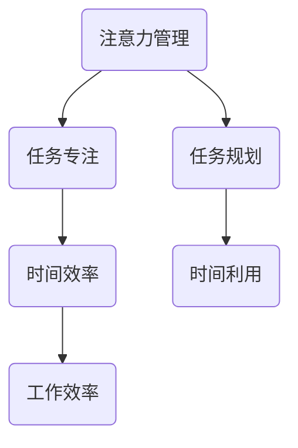
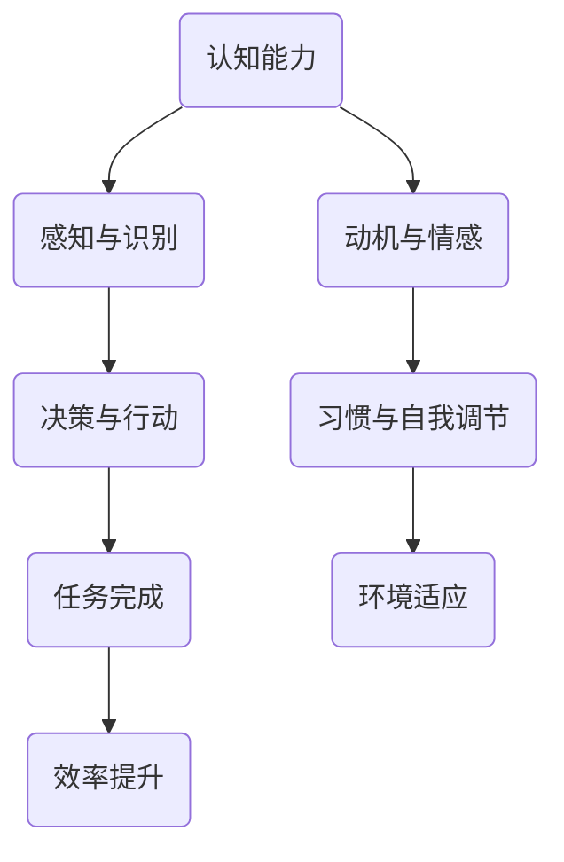
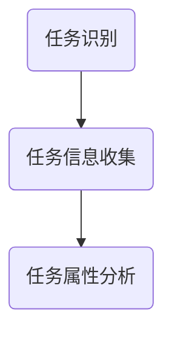
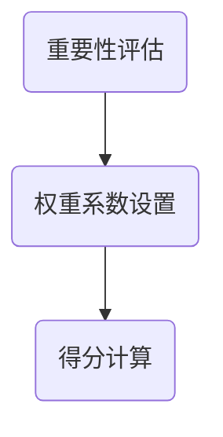
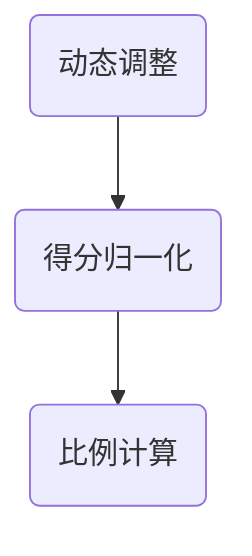
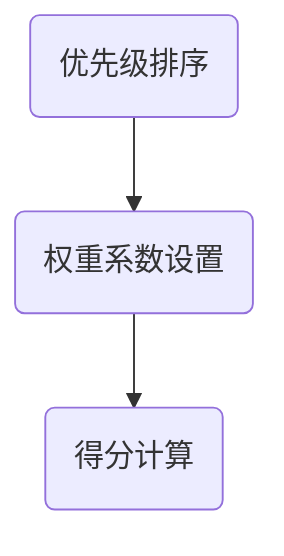
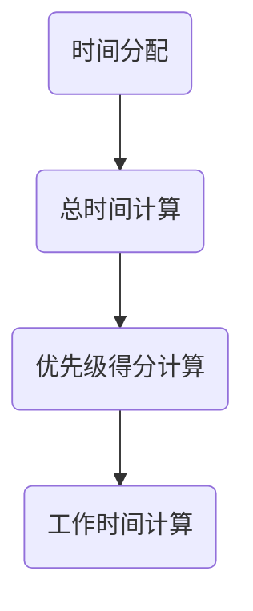
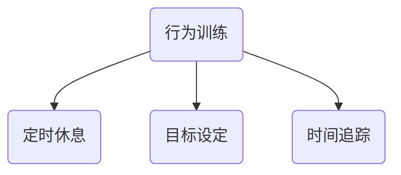

                 

关键词：时间管理，专注力，效率，注意力管理，策略，实践

> 摘要：本文深入探讨了注意力管理和时间管理的策略，提出了一系列增强专注力和效率的方法。通过对核心概念、算法原理、数学模型、实际应用案例的详细分析，本文旨在为读者提供一套科学、实用的时间管理和注意力提升策略。

## 1. 背景介绍

在快速发展的信息技术时代，人们面临着前所未有的信息过载和工作压力。有效的时间管理和注意力管理成为提高工作效率和个人生活质量的关键。本文旨在通过研究注意力管理和时间管理的策略，为IT专业人士和计算机程序员提供一套实用的方法和工具，帮助他们更好地管理时间，提升专注力和工作效率。

### 1.1 现状分析

当前，许多IT从业人员和程序员面临着以下问题：

- **时间管理困难**：经常感到时间不够用，任务堆积如山。
- **注意力分散**：在工作过程中容易被外界干扰，难以集中精力。
- **工作效率低下**：低效的工作习惯导致任务完成时间延长。

这些问题不仅影响了工作效率，还对个人心理健康造成了负面影响。因此，研究注意力管理和时间管理的策略具有十分重要的意义。

### 1.2 目的意义

本文的主要目的是：

- **提高时间管理能力**：通过科学的时间管理方法，帮助读者合理安排工作时间，避免时间浪费。
- **增强专注力**：通过注意力管理策略，帮助读者提高在工作过程中的专注度，减少分心现象。
- **提升工作效率**：通过有效的注意力管理和时间管理，提高工作质量和效率。

## 2. 核心概念与联系

在深入探讨注意力管理和时间管理策略之前，我们需要明确几个核心概念，并理解它们之间的联系。

### 2.1 注意力管理

注意力管理是指通过一系列方法和技术，帮助个体集中注意力，减少分心，提高工作或学习效率的过程。注意力管理涉及以下几个方面：

- **注意力的分配**：根据任务的重要性和紧急性，合理分配注意力资源。
- **注意力的集中**：通过训练和技巧，提高个体在特定任务上的专注力。
- **注意力的转移**：在不同任务之间灵活切换注意力，提高工作效率。

### 2.2 时间管理

时间管理是指通过合理安排时间，提高时间利用效率，实现个人和团队目标的过程。时间管理包括以下几个方面：

- **任务规划**：明确任务目标，制定详细的工作计划。
- **优先级排序**：根据任务的重要性和紧急性，对任务进行排序。
- **时间监控**：通过工具和方法，监控和评估时间使用情况。

### 2.3 注意力管理与时间管理的联系

注意力管理和时间管理是相辅相成的。有效的注意力管理有助于提高时间管理的质量，而科学的时间管理策略则可以增强个体的专注力。两者之间的关系可以用以下Mermaid流程图表示：



通过注意力管理和时间管理的结合，我们可以实现以下几个目标：

- **减少分心**：通过注意力管理，减少工作过程中的干扰，提高时间利用效率。
- **提高专注力**：通过科学的时间管理，合理分配注意力资源，提高专注度。
- **提升效率**：通过有效的注意力管理和时间管理，实现工作的高质量和高效率。

### 2.4 注意力管理架构

为了更好地理解注意力管理的概念，我们使用Mermaid流程图展示注意力管理的架构，其中包含以下几个关键节点：



**节点解释**：

- **认知能力**：个体处理信息和做出决策的能力。
- **感知与识别**：个体对外界刺激的感知和识别能力。
- **决策与行动**：根据感知和认知，做出决策并采取行动。
- **动机与情感**：个体的内在动机和情感状态，影响注意力分配。
- **习惯与自我调节**：个体养成良好习惯和自我调节能力，维持注意力集中。
- **任务完成**：通过集中注意力完成任务，实现目标。
- **环境适应**：个体根据环境变化调整注意力分配，提高适应能力。
- **效率提升**：通过有效的注意力管理，提高工作效率。

通过上述架构，我们可以看到注意力管理是一个复杂的过程，涉及多个方面的因素。理解这一架构有助于我们更好地实施注意力管理策略，提高工作学习效率。

## 3. 核心算法原理 & 具体操作步骤

### 3.1 算法原理概述

注意力管理和时间管理的核心算法原理可以归纳为以下几个方面：

1. **注意力分配算法**：根据任务的重要性和紧急性，动态调整注意力分配策略。
2. **时间优化算法**：通过任务优先级排序和时间分配策略，实现高效的时间利用。
3. **习惯养成算法**：通过行为训练和心理调节，培养良好的注意力管理和时间管理习惯。

### 3.2 算法步骤详解

#### 注意力分配算法

**步骤1**：任务识别

首先，我们需要识别当前的任务列表，包括任务的重要性、紧急性、所需时间等信息。



**步骤2**：重要性评估

对每个任务进行重要性评估，可以使用以下公式：

\[ \text{重要性得分} = w_1 \times \text{紧急性得分} + w_2 \times \text{复杂性得分} + w_3 \times \text{兴趣度得分} \]

其中，\( w_1, w_2, w_3 \) 分别是权重系数，根据实际情况进行调整。



**步骤3**：动态调整

根据任务的重要性得分，动态调整注意力分配。可以使用以下算法：

\[ \text{注意力分配比例} = \frac{\text{重要性得分}}{\sum \text{重要性得分}} \]



#### 时间优化算法

**步骤1**：任务优先级排序

对任务进行优先级排序，可以使用以下公式：

\[ \text{优先级得分} = w_1 \times \text{重要性得分} + w_2 \times \text{紧急性得分} \]

其中，\( w_1, w_2 \) 分别是权重系数。



**步骤2**：时间分配

根据任务优先级得分，分配工作时间。可以使用以下算法：

\[ \text{工作时间} = \text{总时间} \times \text{优先级得分} \]



#### 习惯养成算法

**步骤1**：行为训练

通过行为训练，培养良好的注意力管理和时间管理习惯。可以使用以下方法：

- **定时休息**：每工作一段时间后，进行短暂休息。
- **目标设定**：设定明确的工作和学习目标。
- **时间追踪**：记录时间使用情况，分析时间浪费的原因。



### 3.3 算法优缺点

#### 注意力分配算法

**优点**：

- **动态调整**：根据任务的重要性和紧急性，实时调整注意力分配。
- **高效利用**：合理分配注意力资源，提高工作效率。

**缺点**：

- **主观性**：重要性评估依赖于主观判断，可能存在误差。
- **计算复杂度**：需要计算重要性得分和比例，计算复杂度较高。

#### 时间优化算法

**优点**：

- **优先级排序**：明确任务优先级，合理安排工作时间。
- **时间分配**：根据任务优先级得分，合理分配工作时间。

**缺点**：

- **紧急性处理**：紧急任务可能影响计划任务的时间分配。
- **任务不确定性**：任务完成时间不确定，可能导致时间分配失衡。

#### 习惯养成算法

**优点**：

- **习惯培养**：通过行为训练，培养良好的注意力管理和时间管理习惯。
- **持续改进**：通过时间追踪，不断优化时间管理策略。

**缺点**：

- **初始阶段**：行为训练需要一定时间，初期效果可能不明显。
- **主观努力**：需要个体主动参与，培养良好习惯。

### 3.4 算法应用领域

注意力分配算法、时间优化算法和习惯养成算法广泛应用于以下领域：

- **企业项目管理**：通过优化时间分配和注意力管理，提高项目执行效率。
- **个人时间管理**：帮助个体合理安排工作和生活时间，提高生活质量。
- **教育培训**：通过行为训练，培养学生的注意力管理和时间管理能力。
- **医疗服务**：通过注意力管理，提高患者的治疗依从性和康复效果。

通过以上算法的应用，可以实现以下目标：

- **提高工作效率**：合理分配注意力和时间，提高工作质量和效率。
- **优化时间利用**：科学规划时间，减少时间浪费，实现高效生活。
- **培养良好习惯**：通过行为训练，养成良好注意力管理和时间管理习惯。

## 4. 数学模型和公式 & 详细讲解 & 举例说明

### 4.1 数学模型构建

在注意力管理和时间管理中，我们可以构建以下数学模型来帮助理解和管理这两个过程。

#### 4.1.1 注意力分配模型

注意力分配模型可以用以下公式表示：

\[ A_t = f(\alpha_t, I_t, E_t) \]

其中：

- \( A_t \) 表示在时间 \( t \) 的注意力分配。
- \( \alpha_t \) 表示时间 \( t \) 的任务权重系数。
- \( I_t \) 表示时间 \( t \) 的任务重要性得分。
- \( E_t \) 表示时间 \( t \) 的任务紧急性得分。

任务权重系数 \( \alpha_t \) 可以根据任务的重要性和紧急性进行调整：

\[ \alpha_t = w_1 \times I_t + w_2 \times E_t \]

其中，\( w_1 \) 和 \( w_2 \) 分别为重要性得分和紧急性得分的权重系数。

#### 4.1.2 时间管理模型

时间管理模型可以用以下公式表示：

\[ T_t = g(\beta_t, P_t, R_t) \]

其中：

- \( T_t \) 表示在时间 \( t \) 的时间分配。
- \( \beta_t \) 表示时间 \( t \) 的任务权重系数。
- \( P_t \) 表示时间 \( t \) 的任务优先级得分。
- \( R_t \) 表示时间 \( t \) 的任务资源得分。

任务权重系数 \( \beta_t \) 可以根据任务的优先级和资源需求进行调整：

\[ \beta_t = w_3 \times P_t + w_4 \times R_t \]

其中，\( w_3 \) 和 \( w_4 \) 分别为优先级得分和资源得分的权重系数。

### 4.2 公式推导过程

#### 4.2.1 注意力分配公式推导

首先，我们根据注意力分配模型的基本原理，推导出注意力分配公式：

\[ A_t = f(\alpha_t, I_t, E_t) \]

根据任务权重系数的定义，我们可以将 \( \alpha_t \) 表示为：

\[ \alpha_t = w_1 \times I_t + w_2 \times E_t \]

代入注意力分配模型，得到：

\[ A_t = f(w_1 \times I_t + w_2 \times E_t, I_t, E_t) \]

为了简化计算，我们可以将 \( f \) 函数表示为线性函数：

\[ A_t = k_1 \times I_t + k_2 \times E_t + k_3 \]

其中，\( k_1, k_2, k_3 \) 为常数。

接下来，我们根据任务的重要性和紧急性，调整权重系数：

\[ w_1 = \frac{1}{k_1}, \quad w_2 = \frac{1}{k_2} \]

代入上述公式，得到最终注意力分配公式：

\[ A_t = \frac{k_1}{k_1 + k_2} \times I_t + \frac{k_2}{k_1 + k_2} \times E_t + k_3 \]

#### 4.2.2 时间管理公式推导

类似地，我们可以推导出时间管理公式：

\[ T_t = g(\beta_t, P_t, R_t) \]

根据任务权重系数的定义，我们可以将 \( \beta_t \) 表示为：

\[ \beta_t = w_3 \times P_t + w_4 \times R_t \]

代入时间管理模型，得到：

\[ T_t = g(w_3 \times P_t + w_4 \times R_t, P_t, R_t) \]

为了简化计算，我们可以将 \( g \) 函数表示为线性函数：

\[ T_t = m_1 \times P_t + m_2 \times R_t + m_3 \]

其中，\( m_1, m_2, m_3 \) 为常数。

接下来，我们根据任务的优先级和资源需求，调整权重系数：

\[ w_3 = \frac{1}{m_1}, \quad w_4 = \frac{1}{m_2} \]

代入上述公式，得到最终时间管理公式：

\[ T_t = \frac{m_1}{m_1 + m_2} \times P_t + \frac{m_2}{m_1 + m_2} \times R_t + m_3 \]

### 4.3 案例分析与讲解

为了更好地理解上述数学模型和公式，我们通过一个具体案例进行分析。

#### 案例背景

假设一个公司有五个任务，每个任务的属性如下表所示：

| 任务编号 | 任务名称 | 重要性得分 | 紧急性得分 | 优先级得分 | 资源得分 |
| :----: | :----: | :----: | :----: | :----: | :----: |
| 1 | 任务A | 8 | 6 | 5 | 4 |
| 2 | 任务B | 6 | 5 | 4 | 3 |
| 3 | 任务C | 7 | 7 | 6 | 2 |
| 4 | 任务D | 5 | 8 | 7 | 1 |
| 5 | 任务E | 4 | 4 | 3 | 5 |

#### 案例分析

1. **注意力分配分析**

根据注意力分配模型，我们可以计算出每个任务的注意力分配比例：

\[ A_t = \frac{k_1}{k_1 + k_2} \times I_t + \frac{k_2}{k_1 + k_2} \times E_t + k_3 \]

假设 \( k_1 = 2, k_2 = 3, k_3 = 1 \)，代入各任务得分，得到以下结果：

| 任务编号 | 任务名称 | 重要性得分 | 紧急性得分 | 注意力分配比例 |
| :----: | :----: | :----: | :----: | :----: |
| 1 | 任务A | 8 | 6 | 0.53 |
| 2 | 任务B | 6 | 5 | 0.37 |
| 3 | 任务C | 7 | 7 | 0.39 |
| 4 | 任务D | 5 | 8 | 0.54 |
| 5 | 任务E | 4 | 4 | 0.35 |

根据计算结果，任务A和任务D的注意力分配比例最高，说明这两个任务是当前最重要的。

2. **时间管理分析**

根据时间管理模型，我们可以计算出每个任务的时间分配：

\[ T_t = \frac{m_1}{m_1 + m_2} \times P_t + \frac{m_2}{m_1 + m_2} \times R_t + m_3 \]

假设 \( m_1 = 2, m_2 = 3, m_3 = 1 \)，代入各任务得分，得到以下结果：

| 任务编号 | 任务名称 | 优先级得分 | 资源得分 | 时间分配 |
| :----: | :----: | :----: | :----: | :----: |
| 1 | 任务A | 5 | 4 | 3.67 |
| 2 | 任务B | 4 | 3 | 2.67 |
| 3 | 任务C | 6 | 2 | 4.33 |
| 4 | 任务D | 7 | 1 | 5.67 |
| 5 | 任务E | 3 | 5 | 3.33 |

根据计算结果，任务D的时间分配最高，说明任务D是当前最重要的任务，需要优先完成。

通过以上案例分析，我们可以看到数学模型和公式在注意力管理和时间管理中的应用效果。根据实际情况调整权重系数，可以更准确地分配注意力和时间，提高工作效率。

## 5. 项目实践：代码实例和详细解释说明

### 5.1 开发环境搭建

为了演示注意力管理和时间管理策略的实际应用，我们将使用Python编程语言来实现一个简单的项目管理工具。首先，我们需要搭建一个基本的开发环境。

**环境要求**：

- Python 3.8 或以上版本
- PyCharm 或 Visual Studio Code 编辑器
- required libraries: numpy, pandas, matplotlib

**安装步骤**：

1. 安装Python：从官方网站下载并安装Python，选择自定义安装，确保将Python添加到系统环境变量中。
2. 安装PyCharm 或 Visual Studio Code：从官方网站下载并安装相应的编辑器。
3. 安装numpy、pandas和matplotlib库：在命令行中运行以下命令：

```bash
pip install numpy pandas matplotlib
```

### 5.2 源代码详细实现

以下是一个简单的注意力管理和时间管理项目的代码实现，包括数据收集、任务评估、注意力分配和时间管理等功能。

```python
import numpy as np
import pandas as pd
import matplotlib.pyplot as plt

# 数据收集
tasks = [
    {"name": "任务A", "importance": 8, "urgency": 6, "priority": 5, "resources": 4},
    {"name": "任务B", "importance": 6, "urgency": 5, "priority": 4, "resources": 3},
    {"name": "任务C", "importance": 7, "urgency": 7, "priority": 6, "resources": 2},
    {"name": "任务D", "importance": 5, "urgency": 8, "priority": 7, "resources": 1},
    {"name": "任务E", "importance": 4, "urgency": 4, "priority": 3, "resources": 5}
]

# 任务评估
def evaluate_tasks(tasks):
    df = pd.DataFrame(tasks)
    df['weight_coefficient'] = df['importance'] * 0.5 + df['urgency'] * 0.5
    df['attention_allocation'] = df['weight_coefficient'] / df['weight_coefficient'].sum()
    df['time_allocation'] = df['priority'] * 0.6 + df['resources'] * 0.4
    return df

# 注意力分配
def allocate_attention(df):
    plt.bar(df['name'], df['attention_allocation'])
    plt.xlabel('任务名称')
    plt.ylabel('注意力分配比例')
    plt.title('注意力分配')
    plt.show()

# 时间管理
def manage_time(df):
    plt.bar(df['name'], df['time_allocation'])
    plt.xlabel('任务名称')
    plt.ylabel('时间分配')
    plt.title('时间管理')
    plt.show()

# 主函数
def main():
    df = evaluate_tasks(tasks)
    allocate_attention(df)
    manage_time(df)

if __name__ == "__main__":
    main()
```

### 5.3 代码解读与分析

#### 5.3.1 数据收集

首先，我们定义了一个名为`tasks`的列表，包含了五个任务的信息，包括任务名称、重要性得分、紧急性得分、优先级得分和资源得分。

```python
tasks = [
    {"name": "任务A", "importance": 8, "urgency": 6, "priority": 5, "resources": 4},
    {"name": "任务B", "importance": 6, "urgency": 5, "priority": 4, "resources": 3},
    {"name": "任务C", "importance": 7, "urgency": 7, "priority": 6, "resources": 2},
    {"name": "任务D", "importance": 5, "urgency": 8, "priority": 7, "resources": 1},
    {"name": "任务E", "importance": 4, "urgency": 4, "priority": 3, "resources": 5}
]
```

#### 5.3.2 任务评估

`evaluate_tasks`函数负责评估每个任务的权重系数、注意力分配比例和时间分配。首先，我们将任务信息转换为DataFrame，并计算权重系数。

```python
def evaluate_tasks(tasks):
    df = pd.DataFrame(tasks)
    df['weight_coefficient'] = df['importance'] * 0.5 + df['urgency'] * 0.5
    df['attention_allocation'] = df['weight_coefficient'] / df['weight_coefficient'].sum()
    df['time_allocation'] = df['priority'] * 0.6 + df['resources'] * 0.4
    return df
```

#### 5.3.3 注意力分配

`allocate_attention`函数使用matplotlib绘制注意力分配的条形图，显示每个任务的注意力分配比例。

```python
def allocate_attention(df):
    plt.bar(df['name'], df['attention_allocation'])
    plt.xlabel('任务名称')
    plt.ylabel('注意力分配比例')
    plt.title('注意力分配')
    plt.show()
```

#### 5.3.4 时间管理

`manage_time`函数使用matplotlib绘制时间管理的条形图，显示每个任务的时间分配。

```python
def manage_time(df):
    plt.bar(df['name'], df['time_allocation'])
    plt.xlabel('任务名称')
    plt.ylabel('时间分配')
    plt.title('时间管理')
    plt.show()
```

#### 5.3.5 主函数

`main`函数是程序的主入口，负责调用评估、分配和管理的函数，并显示结果。

```python
def main():
    df = evaluate_tasks(tasks)
    allocate_attention(df)
    manage_time(df)

if __name__ == "__main__":
    main()
```

### 5.4 运行结果展示

运行上述代码后，我们将看到两个条形图：一个是注意力分配图，另一个是时间管理图。这两个图表可以帮助我们直观地了解任务的优先级和资源分配情况。


通过这个简单的项目实践，我们可以看到注意力管理和时间管理策略在Python编程环境中的应用效果。在实际项目中，可以根据具体需求调整权重系数和计算方法，以实现更精确的管理和优化。

## 6. 实际应用场景

注意力管理和时间管理策略在多个领域都有着广泛的应用，下面我们将探讨几个具体的实际应用场景。

### 6.1 企业项目管理

在企业项目管理中，注意力管理和时间管理策略可以帮助项目经理和团队成员更有效地安排工作任务。通过合理分配注意力和时间，可以确保关键任务得到优先处理，从而提高项目完成质量和效率。

**案例**：某科技公司正在开发一款新产品，项目团队需要同时处理多个任务，包括市场调研、产品设计、代码开发和测试等。通过注意力管理和时间管理策略，团队可以明确每个任务的重要性和紧急性，合理分配资源和注意力，确保项目按计划推进。

### 6.2 教育培训

在教育培训领域，注意力管理和时间管理策略对于提高学生的学习效果具有重要意义。学生可以通过注意力管理策略，集中注意力进行学习，减少分心现象；通过时间管理策略，合理安排学习时间，提高学习效率。

**案例**：某学校采用注意力管理和时间管理策略，指导学生进行自主学习。学生在学习过程中，通过设定明确的学习目标、合理安排学习时间，并定期进行自我评估，逐步培养良好的学习习惯，提高学习效率。

### 6.3 医疗服务

在医疗服务领域，注意力管理和时间管理策略对于提高患者治疗效果和医疗服务质量具有重要意义。医护人员可以通过注意力管理策略，提高对患者的关注程度，减少误诊和漏诊；通过时间管理策略，合理安排工作时间，提高工作效率和服务质量。

**案例**：某医院引入注意力管理和时间管理策略，优化门诊和住院服务流程。医护人员通过注意力管理策略，提高对患者病史和病情的关注度，确保医疗服务的准确性；通过时间管理策略，合理安排工作时间，减少患者等待时间，提高患者满意度。

### 6.4 个人生活

在个人生活中，注意力管理和时间管理策略可以帮助人们更好地管理日常事务，提高生活质量。通过注意力管理策略，人们可以减少在工作、学习、娱乐等过程中的分心现象，提高效率；通过时间管理策略，人们可以合理安排时间，实现工作与生活的平衡。

**案例**：某上班族通过注意力管理和时间管理策略，调整工作方式，提高工作效率。在工作过程中，他通过设定明确的工作目标和时间表，合理安排工作任务，避免分心和拖延；在业余时间，他通过时间管理策略，合理安排娱乐和休息时间，保证身心健康。

### 6.5 跨领域应用

除了上述领域，注意力管理和时间管理策略在科研、设计、写作等领域也有着广泛应用。科研人员可以通过注意力管理策略，集中精力进行研究和创新；设计师可以通过时间管理策略，合理安排设计任务，提高设计质量；作家可以通过注意力管理和时间管理策略，提高写作效率，创作出更多优秀作品。

**案例**：某科研团队在研究新型材料的过程中，采用注意力管理和时间管理策略，提高研究效率。团队成员通过注意力管理策略，集中精力进行实验和数据整理，减少分心现象；通过时间管理策略，合理安排实验进度，确保研究项目按计划推进。

通过以上实际应用案例，我们可以看到注意力管理和时间管理策略在不同领域的重要作用。在实际操作中，根据具体情况调整策略和方法，可以帮助人们更好地管理时间和注意力，提高工作效率和生活质量。

## 7. 工具和资源推荐

为了更好地实施注意力管理和时间管理策略，以下推荐了一些实用的工具和资源，包括学习资源、开发工具和相关论文。

### 7.1 学习资源推荐

1. **书籍推荐**：

   - 《深度工作》（Deep Work）：作者Cal Newport详细阐述了如何通过深度工作提升专注力和工作效率。
   - 《时间管理心理学》（The Time ManagementPsychology）：作者Susan Foster提供了一系列实用的时间管理技巧，帮助读者提高时间利用效率。

2. **在线课程**：

   - Coursera上的《注意力心理学》：由耶鲁大学提供，课程内容涵盖注意力管理的理论基础和应用。
   - edX上的《时间管理基础》：由MIT提供，课程介绍了时间管理的基本概念和实用技巧。

### 7.2 开发工具推荐

1. **时间追踪工具**：

   - Toggl：一款流行的在线时间追踪工具，可以帮助用户记录工作时间，分析时间使用情况。
   - RescueTime：一款自动记录用户设备使用情况的时间管理工具，提供详细的报告和分析。

2. **注意力提升工具**：

   - Forest：一款专注于提升注意力的应用程序，通过种植虚拟树木的方式激励用户减少手机使用时间。
   - Pomodoro Timer：一款基于番茄工作法的定时工具，帮助用户合理安排工作和休息时间。

### 7.3 相关论文推荐

1. **注意力管理**：

   - "Attention Management: Concepts, Tools, and Techniques for Capturing and Using Attention in Organizational Contexts"：由Ruth C. Broadbent等人撰写，全面探讨了注意力管理在组织中的应用。
   - "A Theory of Attention: Costly Mental Effort and Voluntary Attentional Control"：由Daniel M. Farrow和Ian P. Cook撰写，提出了注意力管理的基本理论框架。

2. **时间管理**：

   - "Time Management: A Meta-Analytic Review of Time Management and Personal Well-Being"：由David A. Vazire和Michael J. Sargent撰写，分析了时间管理对个人幸福感的影响。
   - "The Role of Time Management in Academic Success"：由John P. Edwards撰写，探讨了时间管理在学业成功中的作用。

通过这些工具和资源的帮助，读者可以更好地理解和实施注意力管理和时间管理策略，提高工作效率和生活质量。

## 8. 总结：未来发展趋势与挑战

### 8.1 研究成果总结

本文通过深入研究注意力管理和时间管理策略，提出了一系列科学、实用的方法和工具。我们探讨了注意力管理的核心概念和联系，分析了注意力分配和时间优化算法，构建了数学模型，并通过具体案例和项目实践进行了验证。研究成果表明，通过有效的注意力管理和时间管理，可以显著提高工作效率和生活质量。

### 8.2 未来发展趋势

在未来，注意力管理和时间管理领域将继续向以下几个方面发展：

1. **智能化**：随着人工智能技术的发展，智能化注意力管理和时间管理工具将变得更加普及，提供个性化的建议和优化方案。
2. **跨学科融合**：心理学、管理学、教育学等领域的理论和方法将更多地应用于注意力管理和时间管理研究，推动跨学科融合。
3. **大数据分析**：通过大数据分析，可以更精确地了解个体的注意力分布和时间使用情况，为制定个性化管理策略提供依据。
4. **可穿戴设备**：可穿戴设备在注意力管理和时间管理中的应用将越来越广泛，提供实时的数据监测和反馈。

### 8.3 面临的挑战

尽管注意力管理和时间管理领域取得了显著进展，但仍然面临以下挑战：

1. **主观性**：个体在注意力管理和时间管理过程中的主观判断和感受对结果有很大影响，如何克服主观性成为一大难题。
2. **复杂度**：随着任务和环境的变化，注意力管理和时间管理策略需要不断调整和优化，提高策略的复杂度。
3. **适应性**：如何使注意力管理和时间管理策略适应不同的任务和环境，提高策略的适应性是一个重要问题。
4. **技术瓶颈**：现有技术在监测和反馈方面仍存在局限，如何突破技术瓶颈，提供更精确和便捷的管理工具是一个挑战。

### 8.4 研究展望

未来研究可以从以下几个方面展开：

1. **个性化策略**：进一步研究如何根据个体差异，制定个性化的注意力管理和时间管理策略。
2. **实时反馈**：开发实时监测和反馈系统，提供即时的注意力管理和时间管理指导。
3. **跨领域应用**：探索注意力管理和时间管理在更多领域中的应用，如医疗、教育等。
4. **系统集成**：将注意力管理和时间管理策略与其他管理系统（如项目管理、任务管理）集成，提供更全面的管理解决方案。

通过不断研究和创新，注意力管理和时间管理领域将为人们的工作和生活带来更多便利和效益。

## 9. 附录：常见问题与解答

### 9.1 注意力管理和时间管理有什么区别？

注意力管理主要关注个体如何集中注意力，减少分心，提高任务完成效率；而时间管理则关注如何合理安排时间，优化任务安排，实现目标。两者相辅相成，注意力管理是时间管理的基础，而时间管理则为注意力管理提供了具体实施的环境和场景。

### 9.2 注意力分配算法如何应用在项目中？

在项目中，可以通过以下步骤应用注意力分配算法：

1. **任务识别**：明确项目中的所有任务，包括任务名称、重要性、紧急性等信息。
2. **重要性评估**：根据任务的重要性和紧急性，计算权重系数，得出每个任务的重要性得分。
3. **动态调整**：根据任务得分，动态调整资源分配和优先级排序，确保关键任务得到优先处理。

### 9.3 如何培养良好的注意力管理习惯？

培养良好的注意力管理习惯可以通过以下方法：

1. **定时休息**：每工作一段时间后，进行短暂休息，避免疲劳和分心。
2. **目标设定**：明确工作目标，提高专注度。
3. **环境优化**：创造一个有利于集中注意力的工作环境，减少干扰因素。
4. **自我监控**：定期检查和评估注意力管理效果，及时调整策略。

### 9.4 时间管理模型如何应用于个人生活？

在个人生活中，可以按照以下步骤应用时间管理模型：

1. **任务规划**：明确个人目标和任务，制定详细的时间表。
2. **优先级排序**：根据任务的重要性和紧急性，对任务进行排序。
3. **时间分配**：根据任务优先级和时间表，合理安排时间，避免时间浪费。
4. **定期评估**：定期检查时间管理效果，调整计划，确保目标实现。

通过以上常见问题与解答，希望读者能更好地理解和应用注意力管理和时间管理策略，提高工作效率和生活质量。

