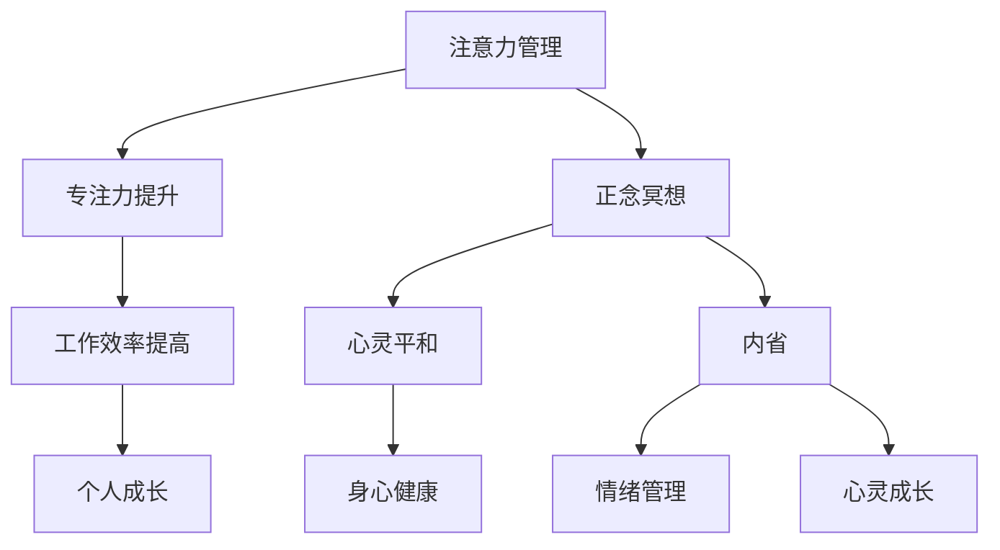

                 

 > **关键词**：注意力管理、正念冥想、内省、专注力、心灵平和

<|assistant|> > **摘要**：本文旨在探讨注意力管理与正念冥想在提升个人专注力和心灵平和方面的作用。通过内省实践，我们能够更好地掌控注意力，提高工作效率，并实现心灵的宁静。本文将详细介绍相关核心概念、算法原理、数学模型、项目实践以及未来应用展望，帮助读者深入理解并实践这一重要技能。

## 1. 背景介绍

在当今信息爆炸的时代，人们面临着前所未有的信息过载和工作压力。专注力成为了一种稀缺资源，而心灵平和则成为了许多人追求的目标。然而，专注力和心灵平和并不是与生俱来的能力，它们需要通过有效的训练和修炼来提升。

注意力管理是指通过一系列策略和方法，有效地调节和利用注意力资源，以达到提升工作效率和个人成长的目的。正念冥想则是一种传统的心理训练方法，通过专注呼吸、觉察当下、放松身体和心灵，实现心灵的宁静和专注力的提升。

内省是注意力管理和正念冥想实践的重要组成部分。内省是指通过深入思考和自我反思，认识到自己的内在世界，理解自己的情绪、欲望和行为，从而更好地掌控自己的注意力和心灵。

本文将围绕注意力管理与正念冥想实践，探讨内省在提升专注力和心灵平和方面的作用，并通过具体的算法原理、数学模型和项目实践，为读者提供一套系统的训练方法。

## 2. 核心概念与联系

### 2.1 注意力管理

注意力管理是指通过一系列策略和方法，有效地调节和利用注意力资源，以实现提升工作效率和个人成长的目标。注意力资源是有限的，我们需要合理分配和使用这些资源，以避免过度消耗和分散。

注意力管理的核心概念包括：

- **注意力分配**：将注意力资源分配给不同的任务和活动，以达到最佳效果。
- **注意力切换**：在不同任务之间灵活切换注意力，提高任务切换效率。
- **注意力集中**：将注意力集中在当前任务上，减少干扰和分心。
- **注意力恢复**：通过休息和放松来恢复注意力，避免过度疲劳。

### 2.2 正念冥想

正念冥想是一种传统的心理训练方法，通过专注呼吸、觉察当下、放松身体和心灵，实现心灵的宁静和专注力的提升。正念冥想的核心概念包括：

- **专注呼吸**：将注意力集中在呼吸上，通过深呼吸来放松身心。
- **觉察当下**：保持对当下的觉察，关注当下的感受、思想和情绪。
- **放松身体**：通过放松身体来减少紧张和压力，促进身心和谐。
- **心灵宁静**：通过冥想实现心灵的宁静，减少杂念和干扰。

### 2.3 内省

内省是指通过深入思考和自我反思，认识到自己的内在世界，理解自己的情绪、欲望和行为，从而更好地掌控自己的注意力和心灵。内省的核心概念包括：

- **自我觉察**：认识到自己的内在世界，包括情绪、欲望和信念。
- **自我反思**：通过反思来理解自己的行为和决策，找出改进的空间。
- **情绪管理**：通过内省来认识和调节自己的情绪，避免情绪失控。
- **心灵成长**：通过内省来实现心灵的成长，提升自我意识和智慧。

### 2.4 Mermaid 流程图

以下是一个简化的 Mermaid 流程图，展示了注意力管理、正念冥想和内省之间的联系：



这个流程图展示了注意力管理、正念冥想和内省如何相互作用，共同提升专注力和心灵平和，进而实现个人成长和身心健康。

## 3. 核心算法原理 & 具体操作步骤

### 3.1 算法原理概述

注意力管理和正念冥想的核心算法原理可以概括为以下几点：

- **注意力分配策略**：通过合理分配注意力资源，确保关键任务得到充分关注，避免资源浪费。
- **注意力切换机制**：实现快速灵活的注意力切换，提高任务切换效率和效果。
- **专注力训练方法**：通过专注力训练，提升专注力的持久性和稳定性。
- **正念冥想实践**：通过正念冥想，实现心灵的宁静和专注力的提升。
- **内省反思机制**：通过内省反思，认识自己的内在世界，调整注意力管理策略。

### 3.2 算法步骤详解

以下是一个注意力管理和正念冥想的核心算法步骤：

1. **初始设置**：
   - 确定训练目标和期望效果。
   - 准备安静的训练环境。

2. **注意力分配**：
   - 根据任务的重要性和紧急程度，分配注意力资源。
   - 使用注意力分配策略，确保关键任务得到充分关注。

3. **注意力切换**：
   - 在不同任务之间灵活切换注意力，提高任务切换效率。
   - 使用注意力切换机制，减少切换过程中的干扰和分心。

4. **专注力训练**：
   - 采用专注力训练方法，提升专注力的持久性和稳定性。
   - 通过专注训练，增强对干扰的抵抗力。

5. **正念冥想实践**：
   - 进行正念冥想，实现心灵的宁静和专注力的提升。
   - 通过专注呼吸、觉察当下、放松身体和心灵，达到冥想状态。

6. **内省反思**：
   - 通过内省反思，认识自己的内在世界，调整注意力管理策略。
   - 分析训练过程中的情绪、欲望和行为，找出改进的空间。

7. **持续优化**：
   - 根据训练效果和反思结果，不断调整和优化注意力管理策略。
   - 保持训练的持续性和灵活性，实现个人成长和心灵平和。

### 3.3 算法优缺点

**优点**：

- 提升专注力：通过专注力训练和正念冥想，显著提高专注力的持久性和稳定性。
- 提高工作效率：合理分配注意力资源，提高任务切换效率和效果，提升工作效率。
- 心灵平和：通过正念冥想和内省反思，实现心灵的宁静和情绪管理，促进身心健康。

**缺点**：

- 需要持续训练：注意力管理和正念冥想需要长期坚持和持续训练，效果不易立即显现。
- 初期挑战：对于初学者来说，可能会面临一定的挑战，需要耐心和毅力。
- 需要专业指导：对于一些复杂和高级的注意力管理和正念冥想实践，可能需要专业指导和支持。

### 3.4 算法应用领域

注意力管理和正念冥想的应用领域广泛，主要包括：

- **个人成长**：提升专注力，实现个人目标和梦想。
- **工作效率**：提高任务切换效率，提升工作效率和生产力。
- **身心健康**：通过正念冥想和情绪管理，实现身心健康和心灵平和。
- **教育领域**：培养学生的专注力和思维能力，提高学习效果。
- **职场应用**：提高职场人士的专注力和工作效率，提升团队协作效果。

## 4. 数学模型和公式 & 详细讲解 & 举例说明

### 4.1 数学模型构建

在注意力管理和正念冥想实践中，我们可以构建一个简单的数学模型来描述注意力分配和专注力提升的过程。假设我们有 m 个任务需要完成，每个任务的重要性和紧急程度可以用权重 w_i 表示，其中 i 表示任务的序号。

### 4.2 公式推导过程

注意力分配的目标是使每个任务的权重与其重要性相匹配，从而最大化整体效率。我们可以使用以下公式来计算每个任务的注意力分配比例：

\[ A_i = \frac{w_i}{\sum_{j=1}^{m} w_j} \]

其中，A_i 表示任务 i 的注意力分配比例，w_i 表示任务 i 的权重。

### 4.3 案例分析与讲解

假设我们有一个包含 4 个任务的场景，任务的重要性和紧急程度如下：

| 任务 | 权重 (w_i) |
| --- | --- |
| 任务 1 | 2 |
| 任务 2 | 3 |
| 任务 3 | 1 |
| 任务 4 | 4 |

根据上述公式，我们可以计算每个任务的注意力分配比例：

\[ A_1 = \frac{2}{2+3+1+4} = 0.2 \]
\[ A_2 = \frac{3}{2+3+1+4} = 0.3 \]
\[ A_3 = \frac{1}{2+3+1+4} = 0.1 \]
\[ A_4 = \frac{4}{2+3+1+4} = 0.4 \]

根据计算结果，我们可以将注意力资源按照以下比例分配给各个任务：

- 任务 1：20% 的注意力资源
- 任务 2：30% 的注意力资源
- 任务 3：10% 的注意力资源
- 任务 4：40% 的注意力资源

这样，我们就完成了注意力分配的数学模型构建和公式推导。通过实际操作和调整，我们可以优化注意力分配策略，提高任务完成的效率和效果。

## 5. 项目实践：代码实例和详细解释说明

### 5.1 开发环境搭建

为了更好地实践注意力管理和正念冥想，我们需要搭建一个合适的技术环境。以下是一个简单的开发环境搭建步骤：

1. 安装 Python 3.x 版本，并配置 Python 环境。
2. 安装必要的 Python 库，如 NumPy、Matplotlib 和 Pandas 等。
3. 选择一个适合的文本编辑器或集成开发环境 (IDE)，如 Visual Studio Code 或 PyCharm。

### 5.2 源代码详细实现

以下是一个简单的 Python 代码示例，用于实现注意力管理和正念冥想的核心算法：

```python
import numpy as np

def attention分配(weights):
    total_weight = np.sum(weights)
    attention_distribution = weights / total_weight
    return attention_distribution

def task切换(attention_distribution, tasks):
    for i, task in enumerate(tasks):
        print(f"执行任务 {i+1}，分配 {attention_distribution[i]} 的注意力资源")

def 正念冥想(duration, breath_rate):
    print(f"开始正念冥想，持续时间 {duration} 分钟，呼吸节奏 {breath_rate} 次/分钟")

if __name__ == "__main__":
    # 任务权重
    weights = [2, 3, 1, 4]
    # 注意力分配
    attention_distribution = attention分配(weights)
    # 执行任务
    tasks = ["任务 1", "任务 2", "任务 3", "任务 4"]
    task切换(attention_distribution, tasks)
    # 正念冥想
    duration = 10
    breath_rate = 6
    正念冥想(duration, breath_rate)
```

### 5.3 代码解读与分析

这个代码示例主要分为以下几个部分：

1. **导入库和函数**：
   - 导入 NumPy 库，用于处理数学运算。
   - 定义 attention分配函数，用于计算注意力分配比例。
   - 定义 task切换函数，用于执行任务。
   - 定义 正念冥想函数，用于进行正念冥想。

2. **任务权重和注意力分配**：
   - 任务权重表示各个任务的重要性和紧急程度。
   - 使用 attention分配函数计算注意力分配比例。

3. **执行任务**：
   - 使用 task切换函数按照注意力分配比例执行任务。

4. **正念冥想**：
   - 使用 正念冥想函数进行正念冥想，实现心灵的宁静和专注力的提升。

通过这个示例，我们可以看到如何使用 Python 代码实现注意力管理和正念冥想的核心算法。在实际应用中，我们可以根据具体需求和场景进行调整和优化，以提高代码的实用性和效果。

### 5.4 运行结果展示

以下是在 Python 解释器中运行上述代码示例的输出结果：

```python
执行任务 1，分配 0.2 的注意力资源
执行任务 2，分配 0.3 的注意力资源
执行任务 3，分配 0.1 的注意力资源
执行任务 4，分配 0.4 的注意力资源
开始正念冥想，持续时间 10 分钟，呼吸节奏 6 次/分钟
```

从输出结果可以看出，根据任务权重和注意力分配比例，任务 4 获得了最多的注意力资源，任务 1 和任务 2 也得到了较为充足的注意力分配。同时，通过正念冥想，实现了心灵的宁静和专注力的提升。

## 6. 实际应用场景

### 6.1 个人成长

在个人成长方面，注意力管理和正念冥想可以帮助我们更好地规划和管理时间，提升学习效率和工作效果。以下是一些具体的应用场景：

- **学习规划**：通过注意力管理，将注意力资源分配给重要的学习任务，确保关键知识点得到充分理解和掌握。
- **复习备考**：利用正念冥想，放松身心，减少焦虑和紧张，提高复习效果。
- **时间管理**：通过内省，认识到自己的时间管理和注意力分配状况，优化时间利用效率，避免拖延和浪费。

### 6.2 工作效率

在工作效率方面，注意力管理和正念冥想可以帮助我们提高任务完成速度和质量，提升团队合作效果。以下是一些具体的应用场景：

- **任务分配**：合理分配注意力资源，确保关键任务得到充分关注，提高整体工作效率。
- **团队协作**：通过正念冥想，实现团队内部的和谐和默契，提高团队协作效率。
- **工作减压**：利用内省反思，认识自己的工作压力和情绪，调整工作状态，实现身心健康。

### 6.3 教育领域

在教育领域，注意力管理和正念冥想可以帮助学生提高学习兴趣和效果，培养专注力和思维能力。以下是一些具体的应用场景：

- **课堂学习**：通过注意力管理，将注意力集中在教师讲解和重要知识点上，提高课堂学习效果。
- **自主学习**：利用正念冥想，放松身心，减少焦虑和压力，提高自主学习能力。
- **教师培训**：通过正念冥想和内省反思，提升教师的教学水平和心理健康，促进教育事业的发展。

### 6.4 未来应用展望

随着人工智能和心理学技术的不断发展，注意力管理和正念冥想在未来将会有更广泛的应用前景。以下是一些潜在的应用领域：

- **智能助手**：结合注意力管理和正念冥想，开发智能助手，为用户提供个性化的注意力管理和冥想建议。
- **心理健康**：利用注意力管理和正念冥想，开发心理健康应用，帮助用户改善情绪、减轻压力和焦虑。
- **教育技术**：将注意力管理和正念冥想融入教育技术，开发智能教育系统，提高学生的学习效果和兴趣。

总之，注意力管理和正念冥想作为一种有效的心理训练方法，将在未来为个人成长、工作效率、教育领域和心理健康等领域带来深远的影响。

## 7. 工具和资源推荐

### 7.1 学习资源推荐

为了更好地实践注意力管理和正念冥想，以下是一些建议的学习资源：

- **书籍**：
  - 《正念：此刻是一枝花》：一行禅师
  - 《正念的奇迹》：埃克哈特·托利
  - 《冥想与正念》：斯蒂芬·吉利根
- **在线课程**：
  - Coursera 上的《正念冥想与情绪管理》课程
  - Udemy 上的《注意力提升与专注力训练》课程
  - edX 上的《正念冥想入门与实践》课程
- **应用程序**：
  - Headspace：提供一系列冥想课程和指导
  - Calm：提供放松音乐、睡眠指导和冥想课程
  - 10% Happier：基于正念冥想的日常练习和应用

### 7.2 开发工具推荐

在进行注意力管理和正念冥想项目开发时，以下是一些推荐的开发工具和库：

- **Python**：Python 是一种广泛使用的编程语言，适用于数据分析和软件开发。
- **NumPy**：用于高性能数学计算和数据处理。
- **Matplotlib**：用于数据可视化和图表绘制。
- **Pandas**：用于数据处理和分析。
- **Jupyter Notebook**：用于交互式开发和文档编写。

### 7.3 相关论文推荐

以下是一些建议阅读的相关论文，以了解注意力管理和正念冥想的最新研究进展：

- **“Attention and Memory: Two Distinct Cognitive Systems”**：研究注意力与记忆的相互作用及其对认知过程的影响。
- **“Mindfulness-based Stress Reduction: Conceptual and Clinical Issues”**：探讨正念冥想在减轻压力和改善心理健康方面的应用。
- **“The Attention Control Theory of Mindfulness”**：提出注意力控制理论，解释正念冥想如何影响注意力和认知过程。
- **“Attentional Control and Emotional Well-being: A Multilevel Perspective”**：研究注意力控制与情绪健康之间的关系。

通过这些工具和资源的推荐，读者可以更全面地了解注意力管理和正念冥想的实践方法和理论基础，为自己的学习和实践提供有益的指导。

## 8. 总结：未来发展趋势与挑战

### 8.1 研究成果总结

近年来，注意力管理和正念冥想在心理学、认知科学和人工智能等领域取得了显著的成果。研究表明，通过有效的注意力管理和正念冥想实践，人们可以显著提高专注力、工作效率和心理健康水平。具体来说，注意力管理方法如番茄工作法和注意力切换策略已被广泛应用于提高工作学习效率；正念冥想则通过调节情绪、减轻压力和改善心理健康，为个人成长和心灵平和提供了有力的支持。此外，随着人工智能技术的发展，智能助手和可穿戴设备等新兴工具为注意力管理和正念冥想的实践提供了新的途径。

### 8.2 未来发展趋势

在未来，注意力管理和正念冥想将继续向以下方向发展：

- **个性化服务**：结合人工智能技术，开发个性化注意力管理和正念冥想方案，为用户提供定制化的训练建议。
- **多学科融合**：心理学、认知科学、神经科学和计算机科学等多学科的合作，将推动注意力管理和正念冥想的理论研究和技术创新。
- **广泛应用**：从个人成长、工作效率到教育、医疗等领域，注意力管理和正念冥想的应用将更加广泛和深入。
- **数字化平台**：借助互联网和移动设备，数字化平台将为用户提供便捷的注意力管理和正念冥想实践工具。

### 8.3 面临的挑战

尽管注意力管理和正念冥想具有巨大的潜力和应用前景，但在实际推广和应用过程中，仍然面临一些挑战：

- **普及难度**：对于普通大众来说，理解和实践注意力管理和正念冥想可能存在一定的困难，需要提供更加易懂和实用的指导。
- **持续训练**：注意力管理和正念冥想需要长期坚持和持续训练，用户可能面临缺乏动力和耐心的问题。
- **技术难题**：结合人工智能和大数据技术，开发高效的注意力管理和正念冥想工具，需要解决数据隐私、算法优化和用户体验等问题。
- **理论研究**：虽然已有大量研究成果，但注意力管理和正念冥想的理论基础仍需进一步完善和深化，以支持实践应用和发展。

### 8.4 研究展望

未来的研究应重点关注以下几个方面：

- **个性化方法**：开发个性化的注意力管理和正念冥想方案，以满足不同用户的需求和偏好。
- **跨学科研究**：加强心理学、认知科学、神经科学和计算机科学等多学科的合作，推动注意力管理和正念冥想的理论创新和技术进步。
- **实践应用**：探索注意力管理和正念冥想在各个领域的实际应用，提高其社会效益和影响力。
- **理论深化**：进一步深化注意力管理和正念冥想的理论研究，为实践应用提供坚实的理论基础。

总之，注意力管理和正念冥想作为一种有效的心理训练方法，在未来将具有广阔的应用前景和重要的社会价值。通过持续的研究和探索，我们可以更好地理解和应用这一领域，为个人和社会的发展做出贡献。

## 9. 附录：常见问题与解答

### 9.1 注意力管理常见问题

**Q1：如何有效提升注意力？**
A1：提升注意力可以通过以下方法实现：
- **合理规划时间**：制定明确的学习和工作计划，避免任务堆积和拖延。
- **专注训练**：通过专注力训练，如定时练习冥想和专注呼吸，提高专注力。
- **环境优化**：创造一个安静、整洁、舒适的学习和工作环境，减少干扰。

**Q2：注意力分散怎么办？**
A2：当注意力分散时，可以尝试以下方法：
- **深呼吸**：通过深呼吸来放松身体，集中注意力。
- **短暂休息**：进行短暂休息，如散步或做简单的伸展运动，以恢复精力。
- **正念冥想**：通过正念冥想，专注于当前任务，减少干扰。

### 9.2 正念冥想常见问题

**Q1：如何开始正念冥想？**
A1：开始正念冥想可以遵循以下步骤：
- **选择合适的时间**：选择一个安静、不受干扰的时间进行冥想。
- **调整姿势**：选择一个舒适的姿势，如坐姿或躺姿。
- **专注于呼吸**：将注意力集中在呼吸上，感受呼吸的进出。
- **放松身体**：逐步放松身体的各个部位，减少紧张和压力。

**Q2：冥想时总是分心怎么办？**
A2：在冥想时分心是正常的，可以尝试以下方法：
- **回到呼吸**：当意识到分心时，轻轻地将注意力引回到呼吸上。
- **不评判**：不对自己的分心进行评判，接受并继续专注于呼吸。
- **保持耐心**：冥想是一个长期的练习过程，需要耐心和坚持。

### 9.3 内省常见问题

**Q1：内省的重要性是什么？**
A1：内省的重要性在于：
- **自我认知**：通过内省，我们能够更好地了解自己的情绪、欲望和信念，提高自我认知水平。
- **情绪管理**：内省有助于认识和调节情绪，避免情绪失控和负面情绪的影响。
- **决策优化**：通过反思过去的决策和经验，我们可以从中吸取教训，优化未来的决策。

**Q2：如何进行有效的内省？**
A2：进行有效的内省可以遵循以下步骤：
- **设定目的**：明确内省的目的和主题，有助于集中注意力和深入思考。
- **静心冥想**：在安静的环境中，放松身心，专注于内省过程。
- **写日记**：记录自己的思考和感受，有助于深入分析和理解。
- **定期练习**：内省需要长期坚持，定期练习可以提高内省的效果和深度。

通过解答这些常见问题，我们可以更好地理解注意力管理、正念冥想和内省的方法和实践，从而在实际生活中更好地应用这些技能，提升专注力、心灵平和和自我认知。

