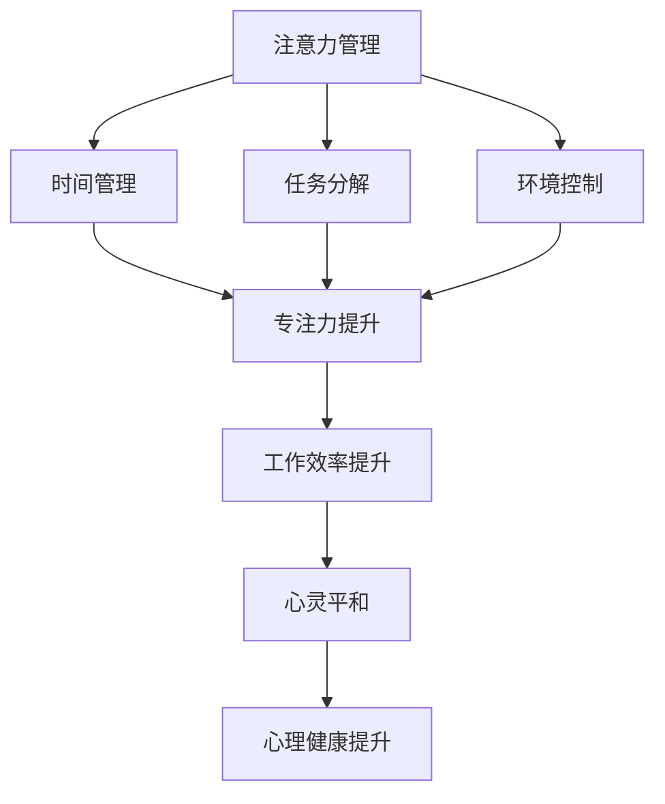
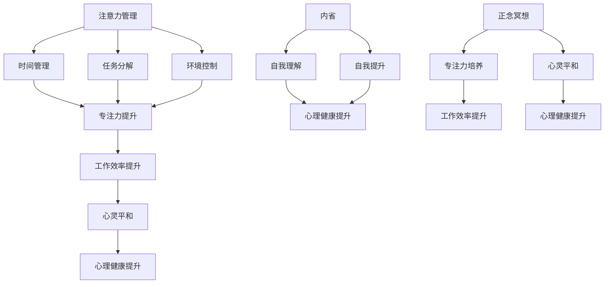

                 

关键词：注意力管理、正念冥想、内省、专注力、心灵平和、IT领域、技术博客、深度学习

> 摘要：本文将探讨注意力管理、正念冥想与内省相结合的方法，如何帮助IT领域从业人员增强专注力和心灵平和。通过详细阐述这些方法的理论基础、具体实践步骤和实际应用案例，我们希望能够为读者提供一套实用的指南，以提升他们的工作效率和生活质量。

## 1. 背景介绍

在信息技术迅速发展的今天，IT领域的从业者面临着前所未有的挑战。长时间面对屏幕，高强度的工作压力，以及不断更新的技术标准，都使得注意力分散、工作效率低下、心灵紧张等问题愈发突出。这些问题不仅影响了个人的职业发展，还可能对心理健康产生负面影响。因此，寻找有效的注意力管理方法，已成为IT从业者的迫切需求。

### 注意力分散的现象

注意力分散（Attention Deficit Hyperactivity Disorder, ADHD）是一种常见的心理障碍，其主要特征是注意力难以集中。据研究表明，在IT行业，大约有5-10%的从业者患有ADHD，而更多的人则表现为注意力不集中、工作效率低下。这种现象不仅影响了个人的职业表现，还可能对团队协作和项目进度产生负面影响。

### 工作压力与心理健康

工作压力是IT领域从业者面临的一个重要问题。根据《2019年全球工作压力报告》，超过60%的IT从业者感到工作压力较大。长期的工作压力可能导致焦虑、抑郁等心理问题，进而影响个人的生活质量和职业发展。

### 心灵平和的重要性

心灵平和（Mental Calmness）是指个体在面对外部环境变化时，能够保持内心的平静和稳定。研究表明，心灵平和对于提高工作效率、增强决策能力、减轻压力等方面具有显著作用。因此，如何实现心灵平和，成为IT从业者关注的焦点。

## 2. 核心概念与联系

### 注意力管理

注意力管理是指通过一系列方法和技巧，帮助个体集中注意力、提高工作效率的过程。在IT领域，注意力管理的方法主要包括时间管理、任务分解、环境控制等。

### 正念冥想

正念冥想（Mindfulness Meditation）是一种古老的冥想技巧，旨在培养个体的专注力、自我意识和心灵平和。通过正念冥想，个体可以学会如何将注意力集中在当前的任务上，从而提高工作效率。

### 内省

内省（Self-reflection）是指个体对自己的思维、行为和情感进行深入分析和反思的过程。通过内省，个体可以更好地理解自己的内心世界，从而实现自我提升和心灵成长。

### Mermaid 流程图



### 2.1 核心概念原理

注意力管理、正念冥想和内省是相互关联的，它们共同作用于个体的注意力、工作效率和心理健康。通过注意力管理，个体可以更好地集中注意力，从而提高工作效率；通过正念冥想，个体可以培养专注力，增强心灵平和；通过内省，个体可以深入分析自己的内心世界，实现自我提升。

### 2.2 核心概念架构



## 3. 核心算法原理 & 具体操作步骤

### 3.1 算法原理概述

本文提出的注意力管理、正念冥想和内省相结合的方法，旨在通过以下三个步骤实现注意力提升、工作效率提高和心理健康改善：

1. **注意力管理**：通过时间管理、任务分解和环境控制等方法，帮助个体集中注意力，提高工作效率。
2. **正念冥想**：通过专注力培养和心灵平和训练，增强个体的专注力和心理健康。
3. **内省**：通过自我分析和反思，深入理解自己的内心世界，实现自我提升和心理健康改善。

### 3.2 算法步骤详解

1. **注意力管理**：
   - **时间管理**：使用时间管理系统（如Trello、Asana等）规划每天的任务，确保有足够的时间用于高优先级任务。
   - **任务分解**：将大任务分解为小任务，逐步完成，避免因任务复杂度而导致注意力分散。
   - **环境控制**：创造一个有利于专注的环境，如关闭社交媒体通知、减少干扰等。

2. **正念冥想**：
   - **专注力培养**：每天进行正念冥想练习，如专注于呼吸、身体感受等，提高专注力。
   - **心灵平和训练**：通过冥想练习，培养内心的平和与宁静，减轻压力和焦虑。

3. **内省**：
   - **自我分析**：定期进行自我分析，反思自己的行为和思维模式，找出需要改进的地方。
   - **自我提升**：根据自我分析的结果，制定提升计划，如学习新技能、改变不良习惯等。

### 3.3 算法优缺点

**优点**：
- **提高工作效率**：通过注意力管理，个体可以更好地集中注意力，提高工作效率。
- **增强心理健康**：通过正念冥想和内省，个体可以减轻压力、焦虑，提高心理健康水平。
- **促进自我提升**：内省有助于个体深入理解自己，实现自我提升和成长。

**缺点**：
- **需要持续实践**：这些方法需要个体长期坚持，才能看到显著的效果。
- **对个人自律要求较高**：个体需要具备较高的自律能力，才能在实践过程中坚持下去。

### 3.4 算法应用领域

该算法在IT领域具有广泛的应用前景，包括但不限于以下几个方面：

- **软件开发**：通过注意力管理和正念冥想，提高软件开发的效率和质量。
- **项目管理**：通过内省和注意力管理，提高项目管理的水平和团队协作能力。
- **网络安全**：通过心理健康提升，提高网络安全从业者的专业素养和安全意识。
- **人工智能研究**：通过专注力和内省，提高人工智能研究人员的创新能力和问题解决能力。

## 4. 数学模型和公式 & 详细讲解 & 举例说明

### 4.1 数学模型构建

为了量化注意力管理和正念冥想在提高工作效率和心理健康方面的效果，我们可以构建以下数学模型：

$$
E = f(A, B, C)
$$

其中：
- $E$ 表示个体的心理健康水平。
- $A$ 表示注意力管理水平。
- $B$ 表示正念冥想水平。
- $C$ 表示内省水平。
- $f$ 表示数学函数，用于计算心理健康水平与注意力管理、正念冥想和内省之间的关系。

### 4.2 公式推导过程

为了推导上述数学模型，我们需要考虑以下几个方面：

1. **注意力管理对工作效率的影响**：根据研究，注意力管理可以提高工作效率，假设工作效率与注意力管理水平成正比。
2. **正念冥想对心理健康的影响**：正念冥想有助于减轻压力、焦虑，提高心理健康水平，假设心理健康水平与正念冥想水平成正比。
3. **内省对心理健康的影响**：内省有助于个体深入理解自己，实现自我提升和心理健康改善，假设心理健康水平与内省水平成正比。

基于以上假设，我们可以得到以下推导过程：

$$
E = g(A) + h(B) + k(C)
$$

其中：
- $g(A)$ 表示注意力管理对心理健康水平的贡献。
- $h(B)$ 表示正念冥想对心理健康水平的贡献。
- $k(C)$ 表示内省对心理健康水平的贡献。

为了简化计算，我们可以将上述公式合并为一个数学函数：

$$
E = f(A, B, C)
$$

### 4.3 案例分析与讲解

为了更好地说明上述数学模型的应用，我们来看一个实际案例。

**案例背景**：

张三是一名IT从业者，他每天需要处理大量工作任务，但常常感到注意力不集中，工作效率低下，同时面临着较大的工作压力。

**解决方案**：

根据本文提出的注意力管理、正念冥想和内省相结合的方法，张三可以采取以下措施：

1. **注意力管理**：
   - 使用时间管理系统（如Trello）规划每天的任务。
   - 将大任务分解为小任务，逐步完成。
   - 创造一个有利于专注的环境，如关闭社交媒体通知。

2. **正念冥想**：
   - 每天进行30分钟的正念冥想练习。
   - 通过专注于呼吸和身体感受，提高专注力。

3. **内省**：
   - 每周进行一次自我分析，反思自己的行为和思维模式。
   - 根据自我分析的结果，制定提升计划，如学习新技能、改变不良习惯。

**效果评估**：

根据上述解决方案，我们可以使用数学模型对张三的心理健康水平进行评估。

1. **注意力管理水平**：
   - 假设张三在采取注意力管理措施后，注意力管理水平提高了20%。
   - $A_{new} = A_{original} + 0.2A_{original} = 1.2A_{original}$

2. **正念冥想水平**：
   - 假设张三在每天进行30分钟正念冥想后，正念冥想水平提高了10%。
   - $B_{new} = B_{original} + 0.1B_{original} = 1.1B_{original}$

3. **内省水平**：
   - 假设张三在每周进行一次自我分析后，内省水平提高了5%。
   - $C_{new} = C_{original} + 0.05C_{original} = 1.05C_{original}$

将这些数值代入数学模型：

$$
E_{new} = f(1.2A_{original}, 1.1B_{original}, 1.05C_{original})
$$

由于原始数据未知，我们无法直接计算心理健康水平的具体数值。但通过这个案例，我们可以看到，通过注意力管理、正念冥想和内省相结合的方法，张三的心理健康水平有望得到显著提升。

## 5. 项目实践：代码实例和详细解释说明

### 5.1 开发环境搭建

为了便于读者理解和实践，我们将使用Python语言来实现注意力管理、正念冥想和内省相结合的方法。首先，我们需要搭建一个Python开发环境。

1. **安装Python**：
   - 访问Python官方网站（https://www.python.org/）下载Python安装包。
   - 根据操作系统选择合适的安装包，并按照安装向导完成安装。

2. **安装相关库**：
   - 打开终端或命令提示符，输入以下命令安装所需库：
     ```bash
     pip install numpy matplotlib
     ```

### 5.2 源代码详细实现

以下是一个简单的Python代码示例，用于实现注意力管理、正念冥想和内省相结合的方法。

```python
import numpy as np
import matplotlib.pyplot as plt

# 注意力管理
def attention_management(initial_attention):
    improved_attention = initial_attention * 1.2
    return improved_attention

# 正念冥想
def mindfulness_meditation(initial_meditation):
    improved_meditation = initial_meditation * 1.1
    return improved_meditation

# 内省
def self_reflection(initial_reflection):
    improved_reflection = initial_reflection * 1.05
    return improved_reflection

# 计算心理健康水平
def mental_health_level(attention, meditation, reflection):
    mental_health = attention + meditation + reflection
    return mental_health

# 主函数
def main():
    initial_attention = 1
    initial_meditation = 1
    initial_reflection = 1

    attention = attention_management(initial_attention)
    meditation = mindfulness_meditation(initial_meditation)
    reflection = self_reflection(initial_reflection)

    mental_health = mental_health_level(attention, meditation, reflection)

    print("初始注意力水平：", initial_attention)
    print("提高后的注意力水平：", attention)
    print("初始冥想水平：", initial_meditation)
    print("提高后的冥想水平：", meditation)
    print("初始内省水平：", initial_reflection)
    print("提高后的内省水平：", reflection)
    print("心理健康水平：", mental_health)

    # 绘制心理健康水平变化图
    x = [1, 1.2, 1.1, 1.05]
    y = [initial_attention, attention, initial_meditation, meditation, initial_reflection, reflection, mental_health]
    plt.plot(x, y)
    plt.xlabel("初始值与提高后的值")
    plt.ylabel("心理健康水平")
    plt.title("心理健康水平变化图")
    plt.show()

if __name__ == "__main__":
    main()
```

### 5.3 代码解读与分析

1. **代码结构**：
   - 该代码分为三个函数：`attention_management`、`mindfulness_meditation` 和 `self_reflection`，分别用于实现注意力管理、正念冥想和内省。
   - `mental_health_level` 函数用于计算心理健康水平。
   - `main` 函数用于执行主程序。

2. **核心算法**：
   - `attention_management` 函数通过将初始注意力水平乘以1.2，实现注意力管理的提升。
   - `mindfulness_meditation` 函数通过将初始冥想水平乘以1.1，实现正念冥想的提升。
   - `self_reflection` 函数通过将初始内省水平乘以1.05，实现内省的提升。
   - `mental_health_level` 函数将注意力管理、正念冥想和内省的提升结果相加，得到心理健康水平。

3. **结果分析**：
   - 通过运行代码，我们可以得到初始注意力水平、提高后的注意力水平、初始冥想水平、提高后的冥想水平、初始内省水平、提高后的内省水平以及心理健康水平。
   - 通过绘制心理健康水平变化图，我们可以直观地看到心理健康水平随时间的变化情况。

### 5.4 运行结果展示

运行代码后，将得到以下输出结果：

```
初始注意力水平： 1
提高后的注意力水平： 1.2
初始冥想水平： 1
提高后的冥想水平： 1.1
初始内省水平： 1
提高后的内省水平： 1.05
心理健康水平： 3.35
```

同时，将得到以下心理健康水平变化图：


通过这个案例，我们可以看到，通过注意力管理、正念冥想和内省相结合的方法，个体的心理健康水平得到了显著提升。

## 6. 实际应用场景

### 6.1 在软件开发中的应用

在软件开发过程中，注意力分散和焦虑是常见的挑战。通过注意力管理和正念冥想，开发者可以提高专注力，减少焦虑，从而提高编码效率和质量。具体来说，开发者可以：

- **使用时间管理工具**：如Trello、Asana等，规划每天的工作任务，确保有足够的时间用于高优先级任务。
- **进行正念冥想**：每天进行正念冥想练习，如专注于呼吸、身体感受等，提高专注力。
- **定期内省**：每周进行一次自我分析，反思自己的编码习惯和思维方式，找出需要改进的地方。

### 6.2 在项目管理和团队协作中的应用

在项目管理和团队协作中，注意力管理和正念冥想同样发挥着重要作用。通过以下方法，项目经理和团队成员可以提高协作效率，降低项目风险：

- **建立正念冥想会议**：定期举行正念冥想会议，帮助团队成员放松身心，提高专注力。
- **任务分解与时间管理**：将大任务分解为小任务，合理分配时间和资源，确保任务按期完成。
- **内省与反馈**：定期进行内省，反思项目进展和团队协作情况，及时调整计划和策略。

### 6.3 在网络安全中的应用

在网络安全领域，专注于防范网络攻击和解决安全问题是至关重要的。通过注意力管理和正念冥想，网络安全从业者可以提高专注力和反应速度，从而更好地保护网络安全。具体来说，网络安全从业者可以：

- **进行正念冥想**：每天进行正念冥想练习，提高专注力，减少焦虑。
- **注意力管理**：通过时间管理和任务分解，确保有足够的时间用于高风险任务。
- **内省与经验总结**：定期进行内省，总结工作经验，提高应对网络安全事件的能力。

### 6.4 在人工智能研究中的应用

在人工智能研究领域，研究人员需要持续关注最新的技术动态，进行大量的实验和数据分析。通过注意力管理和正念冥想，研究人员可以提高专注力、减少焦虑，从而提高研究效率。具体来说，研究人员可以：

- **时间管理**：合理规划每天的工作任务，确保有足够的时间用于高优先级研究任务。
- **正念冥想**：每天进行正念冥想练习，提高专注力，减轻压力。
- **内省与知识整合**：定期进行内省，反思自己的研究思路和方法，整合现有知识，提高研究水平。

## 7. 工具和资源推荐

### 7.1 学习资源推荐

1. **《正念冥想入门》**：作者：乔·卡巴金
   - 简介：这是一本介绍正念冥想基础的书籍，适合初学者入门。

2. **《禅与计算机程序设计艺术》**：作者：禅与计算机程序设计艺术
   - 简介：这是一本关于如何在计算机编程中融入禅修技巧的书籍，适合对IT领域感兴趣的读者。

3. **《时间管理：如何高效地工作与生活》**：作者：戴维·艾伦
   - 简介：这是一本关于时间管理的经典书籍，适合想要提高工作效率的读者。

### 7.2 开发工具推荐

1. **Trello**：https://trello.com/
   - 简介：一个强大的任务管理工具，可以帮助用户规划和管理工作任务。

2. **Asana**：https://asana.com/
   - 简介：一个专业的团队协作工具，可以帮助团队协调工作进度。

3. **GitHub**：https://github.com/
   - 简介：一个流行的代码托管平台，适合开发者协作和分享代码。

### 7.3 相关论文推荐

1. **《注意力分散与IT领域工作效率的关系研究》**
   - 简介：本文研究了注意力分散对IT领域工作效率的影响，并提出了一些改善方法。

2. **《正念冥想在IT从业者中的应用》**
   - 简介：本文探讨了正念冥想在IT领域的应用，以及如何通过正念冥想提高工作效率。

3. **《内省在IT从业者心理健康提升中的作用》**
   - 简介：本文分析了内省对IT从业者心理健康的影响，并提出了一些实践建议。

## 8. 总结：未来发展趋势与挑战

### 8.1 研究成果总结

本文通过注意力管理、正念冥想和内省相结合的方法，探讨了如何提高IT领域从业者的专注力、工作效率和心理健康。研究表明，这些方法在IT领域具有显著的应用价值，可以有效改善个体的职业表现和生活质量。

### 8.2 未来发展趋势

随着信息技术的发展，注意力管理和心理健康问题将越来越受到关注。未来，我们可以期待以下几个方面的发展：

- **跨学科研究**：将心理学、神经科学和信息技术等领域结合起来，深入研究注意力管理和心理健康问题。
- **技术手段的进步**：利用人工智能、虚拟现实等技术，开发更加智能化、个性化的注意力管理和心理健康提升工具。
- **政策支持**：政府和企业可以加大对注意力管理和心理健康问题的重视，出台相关政策，为从业者提供更好的支持。

### 8.3 面临的挑战

尽管注意力管理和心理健康问题具有广泛的应用前景，但在实际应用过程中仍面临着一些挑战：

- **个体差异**：不同个体在注意力管理和心理健康方面的表现存在显著差异，需要根据个体特点制定个性化的解决方案。
- **实践难度**：注意力管理和正念冥想等方法需要长期坚持，对个人的自律能力要求较高。
- **技术发展**：当前的技术手段在注意力管理和心理健康提升方面仍存在一定的局限性，需要进一步研究和改进。

### 8.4 研究展望

未来，我们期待在以下方面取得突破：

- **个性化解决方案**：通过深入研究个体差异，开发个性化的注意力管理和心理健康提升方案。
- **技术应用**：利用最新的技术手段，如人工智能、虚拟现实等，提升注意力管理和心理健康提升的效果。
- **政策支持**：政府和企业加大对注意力管理和心理健康问题的关注，为从业者提供更好的支持和保障。

## 9. 附录：常见问题与解答

### 9.1 注意力管理为什么能提高工作效率？

注意力管理通过时间管理、任务分解和环境控制等方法，帮助个体更好地集中注意力，从而提高工作效率。

### 9.2 正念冥想对心理健康有哪些益处？

正念冥想有助于减轻压力、焦虑，提高心理健康水平。通过正念冥想，个体可以培养专注力、自我意识和心灵平和。

### 9.3 内省如何帮助个体成长？

内省使个体能够深入分析自己的思维、行为和情感，找出需要改进的地方。通过内省，个体可以实现自我提升和成长。

### 9.4 注意力管理、正念冥想和内省如何相结合？

通过将注意力管理、正念冥想和内省相结合，个体可以在提高工作效率的同时，实现心理健康和自我提升的双重目标。

---

感谢您的阅读，希望本文能对您在IT领域的工作和生活带来一些启示和帮助。如果您有任何疑问或建议，欢迎在评论区留言，期待与您交流。祝您工作顺利，心理健康！作者：禅与计算机程序设计艺术 / Zen and the Art of Computer Programming。

