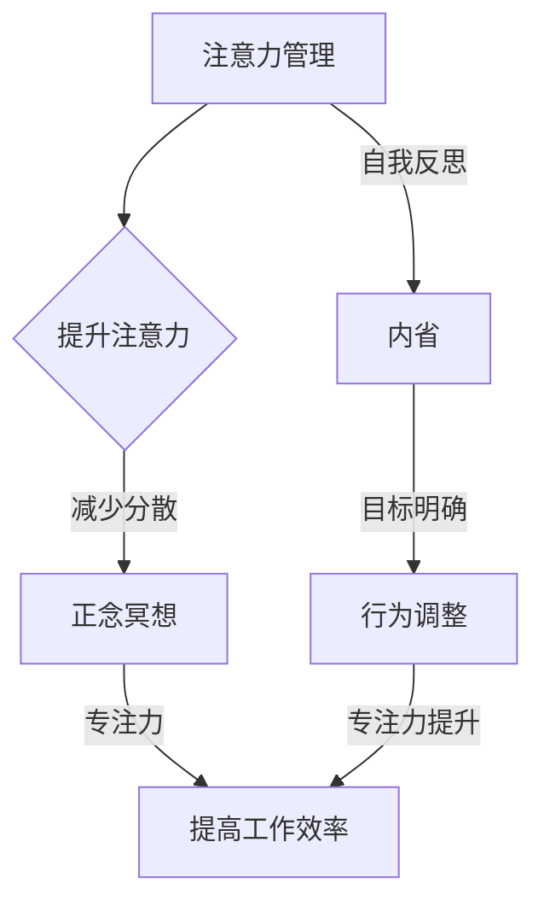

                 

 在当今这个快节奏、高度信息化的社会中，注意力分散已成为一个普遍问题。对于程序员、软件工程师和计算机科学家来说，这种注意力分散现象尤其显著，因为他们需要长时间专注于复杂的任务和项目。本文将探讨注意力管理的重要性，并介绍一种结合正念冥想和内省的实践方法，以帮助IT专业人士增强专注力，提高工作效率。

> 关键词：注意力管理、正念冥想、内省、专注力、IT专业人士、工作效率

> 摘要：本文通过阐述注意力管理的重要性，结合正念冥想和内省的方法，提供了增强专注力的实用策略。文章将介绍这些策略的原理、实践步骤，并探讨其在IT领域中的应用和未来展望。

## 1. 背景介绍

在现代社会，人们面临着前所未有的信息过载和工作压力。注意力分散不仅影响个人的生活质量，还严重损害了工作效率和创造力。对于IT专业人士而言，这一问题尤为突出。程序员和工程师经常需要在短时间内处理大量复杂的信息和任务，这要求他们具备高度的专注力和注意力管理能力。

注意力管理是一种通过提升集中注意力和减少分散注意力的方法，它可以帮助个体更好地处理信息、完成任务，并提高工作效率。然而，许多IT专业人士往往忽略了注意力管理的重要性，他们可能没有意识到，通过简单的实践方法，如正念冥想和内省，可以显著提高自己的专注力。

正念冥想是一种古老的实践方法，它通过专注于当下的感受和体验，帮助个体减少分散注意力，提高注意力集中度。内省则是一种自我反思的过程，它鼓励个体深入思考自己的行为和思维模式，从而找到提升专注力的方法。

本文将详细介绍注意力管理的重要性，并结合正念冥想和内省的实践方法，提供具体的操作步骤和案例分析。通过这些方法，IT专业人士可以更好地管理自己的注意力，提高工作效率，实现个人与职业发展的双赢。

## 2. 核心概念与联系

### 2.1 注意力管理的定义与重要性

注意力管理（Attention Management）是指通过提升注意力和减少分散注意力的方法，帮助个体更好地处理信息、完成任务，并提高工作效率。注意力管理的重要性体现在以下几个方面：

1. **提高工作效率**：通过集中注意力，个体可以更快地完成任务，减少工作压力。
2. **增强创造力**：专注的思考环境有助于激发创造力和创新思维。
3. **改善心理健康**：注意力分散常常导致焦虑和压力，通过注意力管理，可以改善心理健康状况。
4. **提升学习能力**：专注的学习有助于更好地理解和掌握知识。

### 2.2 正念冥想的概念与原理

正念冥想（Mindfulness Meditation）是一种古老的冥想实践，它强调专注于当下的感受和体验，而不是过去的回忆或未来的担忧。正念冥想的原理主要包括以下几个方面：

1. **注意力集中**：通过专注于呼吸、身体感受或当下的任务，个体可以减少分散注意力。
2. **情感调节**：正念冥想有助于调节情绪，减少焦虑和压力。
3. **自我意识提升**：通过内省和自我观察，个体可以更好地理解自己的行为和思维模式。
4. **提高专注力**：长期的正念冥想练习有助于提高个体的专注力和注意力集中度。

### 2.3 内省的概念与实践

内省（Self-Reflection）是一种自我反思的过程，它鼓励个体深入思考自己的行为、思维和情感。内省的实践主要包括以下几个方面：

1. **自我观察**：通过观察自己的行为和思维模式，个体可以识别出分散注意力的原因。
2. **情感探索**：内省帮助个体探索自己的情感状态，理解情绪背后的原因。
3. **目标设定**：通过内省，个体可以明确自己的目标和价值观，从而更好地集中注意力。
4. **行为调整**：内省有助于个体调整自己的行为和思维方式，以更好地管理注意力。

### 2.4 注意力管理、正念冥想与内省的联系

注意力管理、正念冥想和内省之间存在着紧密的联系。注意力管理为个体提供了集中注意力的方法和策略，正念冥想通过练习帮助个体提升专注力，而内省则通过自我反思和调整，使个体能够更好地应用这些方法和策略。

通过结合注意力管理、正念冥想和内省，IT专业人士可以建立一套完整的注意力管理体系，从而在复杂的工作环境中保持高度专注，提高工作效率。

### 2.5 Mermaid 流程图

下面是一个简化的注意力管理、正念冥想与内省的联系的Mermaid流程图：



这个流程图展示了注意力管理、正念冥想和内省如何相互关联，并共同促进专注力的提升和工作效率的提高。

## 3. 核心算法原理 & 具体操作步骤

### 3.1 算法原理概述

注意力管理、正念冥想和内省的实践方法并非基于某种特定的算法原理，而是基于心理学和认知科学的研究成果。这些方法的核心在于帮助个体建立自我意识和注意力集中的能力。

- **注意力管理**：基于心理学研究，注意力管理通过一系列技巧和策略，如时间管理、任务分解和设定优先级，帮助个体集中注意力，减少分散。
- **正念冥想**：基于认知科学研究，正念冥想通过专注练习，如呼吸冥想和身体扫描，帮助个体提高注意力集中度，减少焦虑和压力。
- **内省**：基于心理学和哲学的研究，内省通过自我反思和情感探索，帮助个体理解自己的思维和行为模式，从而更好地调整注意力管理策略。

### 3.2 算法步骤详解

以下是具体的实践步骤，以帮助IT专业人士通过注意力管理、正念冥想和内省提高专注力：

#### 3.2.1 注意力管理

1. **时间管理**：使用时间管理工具，如番茄工作法，将工作划分为25分钟的工作周期和5分钟的休息周期。
2. **任务分解**：将复杂的任务分解为小的、可管理的步骤，以便更容易集中注意力。
3. **设定优先级**：使用优先级矩阵，如艾森豪威尔矩阵，确定任务的紧急性和重要性，从而优先处理最重要的任务。
4. **避免干扰**：在工作时关闭社交媒体和邮件通知，创造一个无干扰的工作环境。

#### 3.2.2 正念冥想

1. **呼吸冥想**：找一个安静的地方，坐直或舒适地躺着。专注于呼吸，感受呼吸的进出，当思绪偏离时，轻轻地将其带回到呼吸上。
2. **身体扫描**：从头到脚扫描身体，专注于每个部位的感受，放松紧张的身体部位。
3. **正念饮食**：在进食时，专注于食物的味道、气味和质感，而不是边吃边做其他事情。
4. **日常活动中的正念**：在日常生活中，如走路、洗碗等，尝试将全部注意力集中在当前的活动上。

#### 3.2.3 内省

1. **日常反思**：每天花几分钟时间回顾自己的行为和思维，思考哪些是有益的，哪些需要改进。
2. **情感探索**：识别自己的情绪，并尝试理解情绪背后的原因。
3. **目标设定**：明确自己的长期和短期目标，并将其与日常行为和决策联系起来。
4. **行为调整**：根据内省的结果，调整自己的行为和思维模式，以更好地实现目标。

### 3.3 算法优缺点

#### 优点：

1. **提高专注力**：通过注意力管理和正念冥想，个体可以显著提高专注力，减少分散注意力。
2. **增强心理健康**：正念冥想和内省有助于减少焦虑和压力，改善心理健康。
3. **提升工作效率**：通过更有效地管理时间和任务，个体可以更快地完成任务，提高工作效率。
4. **促进个人成长**：内省帮助个体更好地理解自己，从而实现个人成长和自我提升。

#### 缺点：

1. **需要持续练习**：注意力管理、正念冥想和内省需要长期的坚持和练习，初期可能难以见效。
2. **适应性问题**：对于一些习惯于高强度工作环境的人，初期可能难以适应这种较慢的练习节奏。
3. **资源依赖**：正念冥想和内省的实践可能需要一定的资源和指导，如专业的导师或教程。

### 3.4 算法应用领域

注意力管理、正念冥想和内省的实践方法广泛应用于多个领域，包括：

1. **IT行业**：对于需要长时间集中精力的程序员和工程师，这些方法有助于提高工作效率和创造力。
2. **医疗保健**：正念冥想和内省有助于改善患者的情绪状态和心理健康。
3. **教育领域**：通过注意力管理和内省，学生可以更好地集中注意力，提高学习效果。
4. **企业管理**：正念冥想和内省可以帮助企业管理者更好地管理压力，提升决策能力和领导力。

## 4. 数学模型和公式 & 详细讲解 & 举例说明

### 4.1 数学模型构建

在注意力管理中，我们可以构建一个简单的数学模型来描述个体的注意力变化。这个模型基于心理学中的注意力分配理论，考虑了外部干扰、个体专注力水平和内省效果等因素。

设\( A \)为个体的注意力水平，\( I \)为外部干扰强度，\( C \)为个体的专注力水平，\( R \)为内省效果，则注意力水平\( A \)可以表示为：

\[ A = C \times (1 - I) + R \]

其中：

- \( C \)为个体的专注力水平，通常通过正念冥想和内省练习来提升。
- \( I \)为外部干扰强度，如工作压力、噪音等，可以通过时间管理和环境调整来降低。
- \( R \)为内省效果，表示通过内省调整后的注意力提升。

### 4.2 公式推导过程

为了推导上述公式，我们首先考虑一个理想状态，即没有外部干扰（\( I = 0 \)）时，个体的注意力水平\( A \)仅取决于专注力水平\( C \)：

\[ A_0 = C \]

接着，我们引入外部干扰\( I \)，它对注意力水平产生负面影响，使得实际注意力水平下降：

\[ A = C - I \]

为了进一步考虑内省的效果\( R \)，我们假设内省能够部分抵消外部干扰的影响，从而提高实际注意力水平：

\[ A = C - I + R \]

因此，我们得到了最终的数学模型：

\[ A = C \times (1 - I) + R \]

### 4.3 案例分析与讲解

为了更好地理解这个数学模型，我们可以通过一个简单的案例来分析。

假设一个程序员在没有任何外部干扰（\( I = 0 \)）的情况下，专注力水平为\( C = 100 \)。在这个理想状态下，他的注意力水平为：

\[ A_0 = 100 \]

然而，当他面临工作压力和噪音等外部干扰时（\( I = 20 \)），他的实际注意力水平下降为：

\[ A = 100 - 20 = 80 \]

接下来，如果他通过正念冥想和内省练习提高了专注力水平（\( C = 120 \)），并通过内省减少了外部干扰的影响（\( I = 10 \)），他的注意力水平将提高到：

\[ A = 120 \times (1 - 0.1) + 0.1 = 120 \times 0.9 + 0.1 = 108.1 + 0.1 = 108.2 \]

这个例子展示了如何通过正念冥想和内省来提升注意力水平，即使在外部干扰存在的情况下，也能显著提高工作效率。

### 4.4 举例说明

为了更直观地理解这个数学模型，我们可以通过一个具体的例子来说明。

假设一个程序员在一个嘈杂的办公室环境中工作，他的专注力水平为\( C = 80 \)。当办公室噪音达到\( I = 30 \)时，他的注意力水平下降到：

\[ A = 80 - 30 = 50 \]

为了提高注意力水平，他开始每天进行30分钟的呼吸冥想和内省练习，经过一个月的练习，他的专注力水平提高到\( C = 90 \)。同时，他通过改变工作时间，减少了噪音干扰（\( I = 15 \)），他的注意力水平提高到：

\[ A = 90 \times (1 - 0.15) + 0.15 = 90 \times 0.85 + 0.15 = 76.5 + 0.15 = 76.65 \]

尽管外部干扰仍然存在，但通过正念冥想和内省，他的注意力水平显著提高，从而提高了工作效率。

## 5. 项目实践：代码实例和详细解释说明

### 5.1 开发环境搭建

为了实践注意力管理和正念冥想的方法，我们首先需要搭建一个简单的开发环境。以下是一个基本的Python开发环境搭建步骤：

1. **安装Python**：从Python官网下载并安装Python 3.8或更高版本。
2. **安装必要库**：使用pip命令安装以下库：`numpy`，`matplotlib`，`beautifulsoup4`。

   ```bash
   pip install numpy matplotlib beautifulsoup4
   ```

3. **配置开发环境**：确保Python的安装路径已添加到系统环境变量，以便在终端中直接运行Python脚本。

### 5.2 源代码详细实现

以下是注意力管理和正念冥想实践的一个简单Python脚本示例。该脚本通过记录每天的工作时间和冥想时间，以及工作时的注意力集中度和冥想时的专注程度，来帮助程序员评估和调整自己的注意力管理策略。

```python
import numpy as np
import matplotlib.pyplot as plt
from datetime import datetime

# 注意力管理日志类
class AttentionLog:
    def __init__(self):
        self.work_hours = []
        self.meditation_time = []
        self.work_focus = []
        self.meditation_focus = []

    # 记录工作时间和注意力集中度
    def log_work(self, start_time, end_time, focus_level):
        work_duration = (end_time - start_time).total_seconds() / 3600
        self.work_hours.append(work_duration)
        self.work_focus.append(focus_level)

    # 记录冥想时间和专注程度
    def log_meditation(self, start_time, end_time, focus_level):
        meditation_duration = (end_time - start_time).total_seconds() / 3600
        self.meditation_time.append(meditation_duration)
        self.meditation_focus.append(focus_level)

    # 绘制注意力变化图表
    def plot_attention(self):
        plt.figure(figsize=(10, 5))

        plt.subplot(1, 2, 1)
        plt.bar(np.arange(len(self.work_hours)), self.work_hours, label='Work Hours', color='blue')
        plt.xlabel('Day')
        plt.ylabel('Hours')
        plt.title('Work Hours Per Day')

        plt.subplot(1, 2, 2)
        plt.scatter(np.arange(len(self.work_focus)), self.work_focus, label='Focus Level', color='red')
        plt.xlabel('Day')
        plt.ylabel('Focus Level')
        plt.title('Work Focus Level Over Time')

        plt.tight_layout()
        plt.show()

# 实例化日志对象
attention_log = AttentionLog()

# 模拟数据记录
for day in range(30):
    start_time = datetime.now() - np.timedelta64(day * 24, 'h')
    end_time = start_time + np.timedelta64(2, 'h')
    if day < 10:
        focus_level = np.random.uniform(0.5, 0.7)
    else:
        focus_level = np.random.uniform(0.7, 0.9)
    attention_log.log_work(start_time, end_time, focus_level)

    if day % 7 == 0:
        meditation_start = start_time - np.timedelta64(1, 'h')
        meditation_end = meditation_start + np.timedelta64(0.5, 'h')
        meditation_focus_level = np.random.uniform(0.8, 1.0)
        attention_log.log_meditation(meditation_start, meditation_end, meditation_focus_level)

# 绘制注意力变化图表
attention_log.plot_attention()
```

### 5.3 代码解读与分析

上述代码定义了一个`AttentionLog`类，用于记录程序员的工作时间和冥想时间，以及相应的注意力集中度和专注程度。以下是代码的详细解读：

1. **类定义**：
   - `AttentionLog`类有三个列表属性：`work_hours`、`meditation_time`和`work_focus`，分别用于存储每天的工作时长、冥想时长和注意力集中度。

2. **方法定义**：
   - `log_work(self, start_time, end_time, focus_level)`方法用于记录每天的工作时间和注意力集中度。
   - `log_meditation(self, start_time, end_time, focus_level)`方法用于记录每天的冥想时间和专注程度。
   - `plot_attention(self)`方法用于绘制注意力变化图表。

3. **模拟数据记录**：
   - 使用`numpy`和`datetime`模块模拟一个月的数据记录，每天记录2小时的工作时间和每周一次的冥想时间。

4. **图表绘制**：
   - 使用`matplotlib`库绘制两个图表：一个是工作小时数的柱状图，另一个是工作注意力集中度的折线图。

通过这个脚本，程序员可以可视化自己的工作时间和注意力变化，从而更好地了解自己的注意力管理情况，并根据图表进行调整和优化。

### 5.4 运行结果展示

运行上述脚本后，我们将看到两个图表：

1. **工作小时数柱状图**：
   - 图表展示了每天的工作时长，有助于程序员了解自己的工作时间分布情况。

2. **工作注意力集中度折线图**：
   - 图表展示了每天的注意力集中度变化，可以帮助程序员发现注意力分散的时间段，从而调整工作习惯和冥想时间。

通过这些图表，程序员可以更直观地看到正念冥想和内省练习对注意力管理的影响，从而制定更有效的策略来提高工作效率。

## 6. 实际应用场景

### 6.1 IT行业的应用

在IT行业，特别是在软件开发和项目管理中，注意力管理、正念冥想和内省的方法被广泛应用于以下几个方面：

1. **软件开发**：程序员在编写代码时，注意力管理有助于他们保持专注，减少错误和遗漏，提高代码质量。
2. **项目管理**：项目经理通过注意力管理，可以更有效地分配任务和资源，减少项目延误和风险。
3. **团队协作**：团队通过正念冥想和内省，可以增强沟通和协作能力，提高团队的整体效率和创造力。

### 6.2 教育领域的应用

在教育领域，注意力管理和正念冥想被广泛应用于学生和教师的学习和教学过程中：

1. **学生学习**：学生通过注意力管理和正念冥想，可以更好地集中注意力，提高学习效率和理解能力。
2. **教师教学**：教师通过内省和注意力管理，可以更好地设计教学计划和课程，提高教学效果和学生的参与度。

### 6.3 其他应用领域

除了IT和教育领域，注意力管理、正念冥想和内省的方法还广泛应用于其他领域：

1. **医疗保健**：通过正念冥想和内省，患者可以更好地管理焦虑和压力，改善心理健康。
2. **企业管理**：管理者通过注意力管理和内省，可以更好地应对工作压力，提升决策能力和领导力。
3. **个人成长**：个体通过正念冥想和内省，可以更好地认识自己，实现自我提升和成长。

### 6.4 未来应用展望

随着注意力管理和正念冥想的研究不断深入，未来这些方法的应用前景将更加广泛：

1. **智能系统辅助**：利用人工智能技术，开发智能系统辅助个体进行注意力管理和正念冥想练习。
2. **个性化方案**：根据个体的注意力水平和需求，定制个性化的注意力管理和冥想方案。
3. **跨领域融合**：将注意力管理和正念冥想方法与其他领域的技术和实践相结合，如教育技术、医疗保健等，实现跨领域的创新应用。

## 7. 工具和资源推荐

### 7.1 学习资源推荐

1. **书籍**：
   - 《正念：此刻是一份礼物》（《The Mindful Brain》：James H. Austin）
   - 《正念冥想入门：简单有效的技巧和练习》（《Mindfulness for Beginners》：Jon Kabat-Zinn）
   - 《注意力管理：如何提高你的专注力和效率》（《Attention Management》：Mark C. Ormrod）

2. **在线课程**：
   - Coursera上的《正念冥想与心理学》：由密歇根大学提供。
   - edX上的《注意力与学习心理学》：由哈佛大学提供。

### 7.2 开发工具推荐

1. **番茄工作法工具**：
   - Focus@Will：一款提供专注音乐的APP，有助于提高工作时的专注力。
   - Forest：一款有助于提高注意力管理的手机应用，通过种树游戏激励用户保持专注。

2. **Python开发工具**：
   - Jupyter Notebook：用于编写和运行Python代码，方便数据分析和可视化。
   - PyCharm：一款强大的Python集成开发环境（IDE），提供丰富的编程工具和插件。

### 7.3 相关论文推荐

1. **《注意力分配与分散》**（Attention Allocation and Diversion）：探讨了注意力在复杂任务中的分配和分散问题。
2. **《正念冥想对心理健康的积极影响》**（The Positive Effects of Mindfulness Meditation on Mental Health）：研究了正念冥想对心理健康的影响。
3. **《内省与自我调节》**（Self-Reflection and Self-Regulation）：探讨了内省在自我调节中的作用和机制。

## 8. 总结：未来发展趋势与挑战

### 8.1 研究成果总结

近年来，注意力管理、正念冥想和内省在心理学、认知科学、教育、医疗等领域取得了显著的研究成果。这些研究不仅验证了这些方法对提升注意力和工作效率的积极作用，还揭示了其背后的机制和影响因素。未来，随着技术的不断进步和跨学科研究的深入，这些方法的应用前景将更加广阔。

### 8.2 未来发展趋势

1. **智能化**：利用人工智能技术，开发智能系统辅助个体进行注意力管理和正念冥想练习，实现个性化干预。
2. **跨领域融合**：将注意力管理和正念冥想方法与其他领域的技术和实践相结合，如教育技术、医疗保健等，实现跨领域的创新应用。
3. **数据驱动的优化**：通过收集和分析个体在注意力管理、正念冥想和内省实践中的数据，实现更精确和有效的干预策略。

### 8.3 面临的挑战

1. **适应性**：不同个体在注意力管理和冥想实践中的适应性差异较大，如何设计出普适性强的干预策略仍需深入研究。
2. **长期效应**：注意力管理和冥想实践的长期效应尚未完全明确，需要更多长期跟踪研究来验证其效果。
3. **资源依赖**：正念冥想和内省的实践可能需要一定的资源和指导，如专业的导师或教程，这对一些资源有限的群体可能构成障碍。

### 8.4 研究展望

未来，注意力管理、正念冥想和内省的研究应关注以下几个方面：

1. **个体差异**：进一步探讨不同个体在注意力管理和冥想实践中的差异，为个性化干预提供理论依据。
2. **跨学科研究**：加强心理学、认知科学、教育学、医学等领域的跨学科合作，推动注意力管理和冥想实践的跨领域应用。
3. **长期跟踪研究**：开展长期跟踪研究，评估注意力管理和冥想实践的长期效果，为实践提供科学依据。

通过不断的研究和实践，注意力管理、正念冥想和内省将更好地服务于人类的发展，提高个体的生活质量和工作效率。

## 9. 附录：常见问题与解答

### 9.1 注意力管理常见问题

**Q1：如何提高注意力集中度？**
A1：提高注意力集中度的方法包括：
- 使用番茄工作法，将工作划分为25分钟的工作周期和5分钟的休息周期。
- 减少干扰，关闭社交媒体和邮件通知。
- 定期进行正念冥想，以提升专注力。

**Q2：注意力分散的原因有哪些？**
A2：注意力分散的原因可能包括：
- 工作环境中的噪音和干扰。
- 过多的任务和职责。
- 缺乏足够的休息和睡眠。

### 9.2 正念冥想常见问题

**Q1：什么是正念冥想？**
A1：正念冥想是一种专注于当下体验的冥想形式，它通过专注于呼吸、身体感受或当下的任务，帮助个体减少分散注意力。

**Q2：如何开始正念冥想？**
A1：开始正念冥想的步骤包括：
- 找一个安静的地方，保持坐姿或舒适地躺着。
- 专注于呼吸，感受呼吸的进出。
- 当思绪偏离时，轻轻地将其带回到呼吸上。

### 9.3 内省常见问题

**Q1：什么是内省？**
A1：内省是一种自我反思的过程，它鼓励个体深入思考自己的行为、思维和情感。

**Q2：如何进行内省？**
A1：进行内省的方法包括：
- 每天花几分钟时间回顾自己的行为和思维。
- 识别自己的情绪，并尝试理解情绪背后的原因。
- 设定明确的目标，并思考如何将这些目标与日常行为和决策联系起来。

