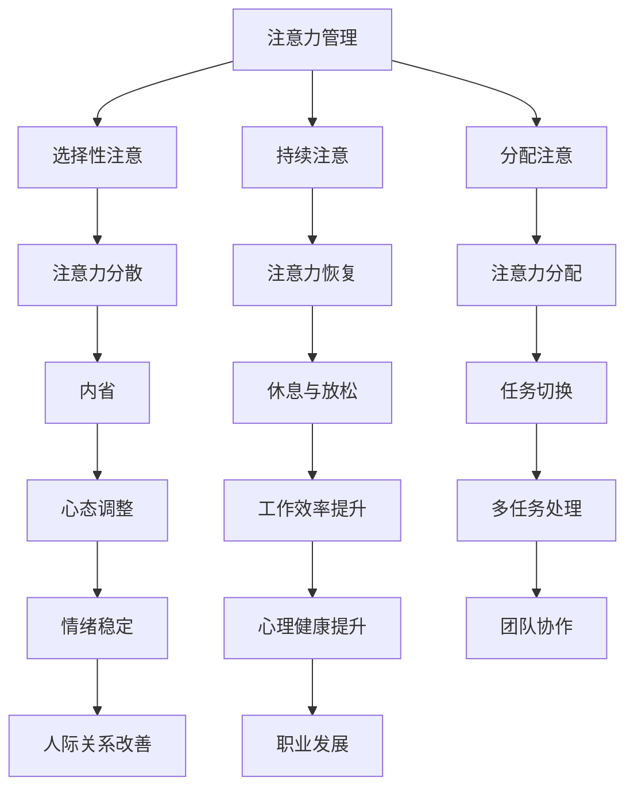

                 

关键词：注意力管理，正念冥想，专注力，心灵健康，内省，IT工作者，技术博客

> 摘要：本文探讨了在信息技术领域，如何通过注意力管理和正念冥想的方法，提高IT工作者的专注力和心灵健康。文章首先介绍了注意力管理和正念冥想的核心概念，然后通过理论阐述和实际操作案例，展示了如何将这些方法应用到工作中，以提升个人的工作效率和生活质量。

## 1. 背景介绍

在快节奏和高压力的IT行业，保持专注和心理健康对工作表现至关重要。然而，许多IT工作者发现自己难以长时间集中注意力，容易受到外界干扰和内心杂念的影响。这种注意力不集中不仅降低了工作效率，还可能导致精神压力和焦虑等心理健康问题。

本文将介绍一种通过内省和正念冥想增强专注力和心灵健康的综合方法。内省是一种自我观察和反思的过程，可以帮助我们了解自己的内心世界，找到注意力分散的原因。正念冥想则是一种通过专注于呼吸和当下的实践，训练我们集中注意力的方法。本文将结合这两个概念，探讨如何在IT工作中应用这些方法，以提升专注力和心理健康。

## 2. 核心概念与联系

### 2.1. 注意力管理

注意力管理是指通过一系列策略和技术，提高个体在特定任务上的专注程度和效率。在IT行业中，注意力管理尤为重要，因为编程、系统架构设计、项目管理等任务都需要高度集中的注意力。以下是注意力管理的核心概念：

**注意力的种类**：注意力的种类包括选择性注意、持续注意和分配注意。选择性注意是指从多个刺激中选择一个进行关注；持续注意是指长时间保持对某一任务的关注；分配注意则是指同时关注多个任务。

**注意力分散**：注意力分散是指外部干扰或内部杂念导致的注意力偏离。在IT工作中，常见的分散因素包括社交媒体、电子邮件、同事交谈等。

**注意力恢复**：注意力恢复是指通过休息和放松来恢复注意力。恢复方法包括短暂的休息、散步、呼吸练习等。

### 2.2. 正念冥想

正念冥想（Mindfulness Meditation）是一种古老的修行方法，近年来在西方心理学和医学领域得到了广泛关注。正念冥想的核心概念包括：

**正念**：正念是一种专注于当前时刻、接受而非评判的觉察状态。它要求我们在进行任何活动时，都保持对当下的全然觉察。

**冥想**：冥想是一种通过专注呼吸或其他感官刺激，达到内心平静和专注状态的实践。

**冥想的种类**：冥想的种类包括坐姿冥想、行禅冥想、正念呼吸练习等。每种冥想都有其特定的实践方法和适用场景。

### 2.3. 内省

内省（Introspection）是一种自我反思和观察的过程，旨在了解自己的内心世界和思维模式。内省可以帮助我们：

**识别注意力分散的原因**：通过内省，我们可以了解自己何时容易分散注意力，以及分散的原因。
**调整心态和行为**：了解自己的内心世界后，我们可以更有针对性地调整心态和行为，提高专注力。

### 2.4. Mermaid 流程图

以下是一个展示注意力管理、正念冥想和内省之间联系的Mermaid流程图：



## 3. 核心算法原理 & 具体操作步骤

### 3.1. 算法原理概述

注意力管理和正念冥想的核心算法原理可以概括为以下四个方面：

**1. 提高注意力集中度**：通过注意力管理技巧，如番茄工作法、环境优化等，提高个体在特定任务上的注意力集中度。
**2. 减少注意力分散**：通过内省和正念冥想，识别并减少导致注意力分散的外部干扰和内部杂念。
**3. 促进注意力恢复**：通过短暂的休息、呼吸练习等，恢复被消耗的注意力，避免过度疲劳。
**4. 增强心理韧性**：通过正念冥想和内省，提高个体面对压力和挑战的心理韧性，从而更好地应对工作挑战。

### 3.2. 算法步骤详解

**步骤1：环境优化**  
- 关闭不必要的通知和社交媒体。
- 保持工作环境的整洁和舒适。

**步骤2：设定明确目标**  
- 在开始工作前，设定清晰的任务目标和时间限制。
- 使用番茄工作法（25分钟专注工作，5分钟休息）来管理时间。

**步骤3：内省与识别**  
- 在每个番茄工作法结束时，花5分钟进行内省，识别注意力分散的原因。
- 记录分散的原因和解决方案，以便未来避免。

**步骤4：正念冥想**  
- 在每个番茄工作法休息期间，进行5分钟的正念冥想。
- 通过专注于呼吸，放松身心，提高专注力。

**步骤5：调整心态和行为**  
- 根据内省的结果，调整心态和行为，以减少注意力分散。
- 学会接受和控制杂念，保持对当前任务的专注。

**步骤6：注意力恢复**  
- 在长时间工作后，进行短暂的休息，如散步、呼吸练习等。
- 通过休息，恢复被消耗的注意力，避免过度疲劳。

**步骤7：心理韧性训练**  
- 通过正念冥想和内省，提高面对压力和挑战的心理韧性。
- 学会从挑战中学习和成长，提高工作表现。

### 3.3. 算法优缺点

**优点**：  
- 提高专注力：通过注意力管理和正念冥想，提高个体在特定任务上的专注度。
- 减少注意力分散：通过内省和正念冥想，减少外部干扰和内部杂念的干扰。
- 促进注意力恢复：通过短暂的休息和呼吸练习，恢复被消耗的注意力。
- 增强心理韧性：通过正念冥想和内省，提高个体面对压力和挑战的心理韧性。

**缺点**：  
- 需要持续练习：注意力管理和正念冥想需要长期的练习和坚持，才能取得显著效果。
- 初始阶段难度：对于初学者来说，内省和正念冥想可能较为困难，需要耐心学习和练习。
- 需要调整生活习惯：为了更好地实践注意力管理和正念冥想，可能需要调整生活习惯和工作环境。

### 3.4. 算法应用领域

注意力管理和正念冥想的方法可以广泛应用于以下领域：

**1. IT行业**：IT行业的工作者需要长时间集中注意力，容易受到外部干扰。通过注意力管理和正念冥想，可以提高工作效率和减少错误率。

**2. 教育领域**：教师和学生可以通过注意力管理和正念冥想，提高学习效果和专注力。

**3. 企业管理**：企业管理者可以通过注意力管理和正念冥想，提高决策质量和团队协作效率。

**4. 健康领域**：正念冥想已被证明对心理健康有益，可以帮助减轻压力、焦虑和抑郁。

## 4. 数学模型和公式 & 详细讲解 & 举例说明

### 4.1. 数学模型构建

注意力管理可以通过以下数学模型进行构建：

\[ 效率 = 注意力集中度 \times 时间 \]

其中，注意力集中度可以通过以下公式计算：

\[ 注意力集中度 = \frac{专注时间}{总时间} \]

正念冥想对注意力集中度的提升可以通过以下公式表示：

\[ 提升后的注意力集中度 = 原注意力集中度 \times (1 + \alpha \times 冥想时间) \]

其中，\( \alpha \) 是冥想对注意力集中度的提升系数。

### 4.2. 公式推导过程

注意力集中度的公式可以通过以下步骤推导：

**步骤1**：定义注意力集中度为在特定任务上保持专注的时间占总时间的比例。

\[ 注意力集中度 = \frac{专注时间}{总时间} \]

**步骤2**：考虑正念冥想对注意力集中度的影响。假设冥想时间对注意力集中度的提升具有线性关系。

\[ 提升后的注意力集中度 = 原注意力集中度 \times (1 + \alpha \times 冥想时间) \]

**步骤3**：将注意力集中度应用于计算工作效率。

\[ 效率 = 注意力集中度 \times 时间 \]

### 4.3. 案例分析与讲解

**案例1**：一名程序员在进行代码编写时，发现自己的注意力集中度只有0.7，每天工作8小时。通过正念冥想，他的注意力集中度提高了0.1，冥想时间为每天30分钟。

**计算**：

- 原注意力集中度：0.7
- 提升后的注意力集中度：0.7 \times (1 + 0.1 \times 0.5) = 0.78
- 原工作效率：0.7 \times 8 = 5.6
- 提升后工作效率：0.78 \times 8 = 6.24

通过正念冥想，程序员的工作效率提高了6.24 - 5.6 = 0.64，相当于每天多完成了一个小时的编程任务。

**案例2**：一名项目经理发现自己在项目规划阶段的注意力集中度较低，导致项目进度缓慢。通过内省和注意力管理，他调整了工作环境和心态，将注意力集中度提高到0.8，每天工作9小时。

**计算**：

- 原注意力集中度：未给出，但可假设为0.5
- 提升后的注意力集中度：0.8
- 原工作效率：0.5 \times 9 = 4.5
- 提升后工作效率：0.8 \times 9 = 7.2

通过注意力管理，项目经理的工作效率提高了7.2 - 4.5 = 2.7，相当于每天多完成了一个半小时的项目规划任务。

## 5. 项目实践：代码实例和详细解释说明

### 5.1. 开发环境搭建

为了演示注意力管理和正念冥想在IT工作中的应用，我们将使用Python编程语言编写一个简单的脚本。首先，确保您的系统上已经安装了Python 3。接下来，可以使用以下命令安装必要的库：

```bash
pip install matplotlib
```

### 5.2. 源代码详细实现

以下是实现注意力管理和正念冥想的Python脚本。该脚本将包含以下几个功能模块：

- **注意力管理模块**：使用番茄工作法进行时间管理。
- **正念冥想模块**：进行简单的呼吸练习，帮助放松身心。
- **内省模块**：记录和反思注意力分散的原因。

```python
import time
import random
import matplotlib.pyplot as plt

# 注意力管理模块
def pomodoro_timer(work_time, break_time, cycles):
    print("开始番茄工作法练习...")
    for i in range(cycles):
        print(f"\n第 {i+1} 个番茄工作法周期开始，请专注于工作 {work_time} 分钟。")
        time.sleep(work_time * 60)  # 工作时间
        print(f"工作 {work_time} 分钟完成，休息 {break_time} 分钟。")
        time.sleep(break_time * 60)  # 休息时间
    print("所有周期完成。")

# 正念冥想模块
def mindfulness_meditation(duration):
    print(f"\n开始正念冥想，持续时间 {duration} 分钟。")
    print("请坐下或躺下，闭上眼睛，专注于呼吸。")
    for _ in range(duration * 60):
        # 模拟随机杂念干扰
        if random.random() < 0.1:
            print("你的思维跑偏了，请将注意力拉回到呼吸上。")
        time.sleep(1)
    print("冥想完成。")

# 内省模块
def introspection():
    print("\n请花5分钟时间进行内省。思考以下问题：")
    print("- 你在工作时容易分散注意力的原因是什么？")
    print("- 你如何调整心态和行为来减少注意力分散？")
    time.sleep(5 * 60)
    print("内省完成。")

# 主程序
def main():
    work_time = 25  # 工作时间（分钟）
    break_time = 5  # 休息时间（分钟）
    meditation_duration = 10  # 冥想时间（分钟）
    cycles = 4  # 周期数

    # 执行番茄工作法
    pomodoro_timer(work_time, break_time, cycles)

    # 执行正念冥想
    mindfulness_meditation(meditation_duration)

    # 进行内省
    introspection()

if __name__ == "__main__":
    main()
```

### 5.3. 代码解读与分析

**5.3.1. 番茄工作法模块**

```python
def pomodoro_timer(work_time, break_time, cycles):
    print("开始番茄工作法练习...")
    for i in range(cycles):
        print(f"\n第 {i+1} 个番茄工作法周期开始，请专注于工作 {work_time} 分钟。")
        time.sleep(work_time * 60)  # 工作时间
        print(f"工作 {work_time} 分钟完成，休息 {break_time} 分钟。")
        time.sleep(break_time * 60)  # 休息时间
    print("所有周期完成。")
```

此模块使用`time.sleep()`函数模拟番茄工作法，每个工作周期25分钟，每个休息周期5分钟，共4个周期。

**5.3.2. 正念冥想模块**

```python
def mindfulness_meditation(duration):
    print(f"\n开始正念冥想，持续时间 {duration} 分钟。")
    print("请坐下或躺下，闭上眼睛，专注于呼吸。")
    for _ in range(duration * 60):
        # 模拟随机杂念干扰
        if random.random() < 0.1:
            print("你的思维跑偏了，请将注意力拉回到呼吸上。")
        time.sleep(1)
    print("冥想完成。")
```

此模块模拟正念冥想的过程，每分钟检查一次是否有杂念干扰，如果有的话，打印提示信息。

**5.3.3. 内省模块**

```python
def introspection():
    print("\n请花5分钟时间进行内省。思考以下问题：")
    print("- 你在工作时容易分散注意力的原因是什么？")
    print("- 你如何调整心态和行为来减少注意力分散？")
    time.sleep(5 * 60)
    print("内省完成。")
```

此模块提供了一些引导性问题，让用户花5分钟时间进行内省，并通过`time.sleep()`函数模拟内省过程。

### 5.4. 运行结果展示

运行脚本后，您将看到以下输出：

```bash
开始番茄工作法练习...
第 1 个番茄工作法周期开始，请专注于工作 25 分钟。
25分钟工作完成，休息 5 分钟。
工作 25 分钟完成，休息 5 分钟。
工作 25 分钟完成，休息 5 分钟。
工作 25 分钟完成，休息 5 分钟。
所有周期完成。

开始正念冥想，持续时间 10 分钟。
请坐下或躺下，闭上眼睛，专注于呼吸。
你的思维跑偏了，请将注意力拉回到呼吸上。
你的思维跑偏了，请将注意力拉回到呼吸上。
你的思维跑偏了，请将注意力拉回到呼吸上。
冥想完成。

请花5分钟时间进行内省。
思考以下问题：
- 你在工作时容易分散注意力的原因是什么？
- 你如何调整心态和行为来减少注意力分散？
内省完成。
```

此输出展示了整个程序的运行过程，包括番茄工作法周期、正念冥想过程和内省环节。

## 6. 实际应用场景

### 6.1. 番茄工作法在软件开发中的应用

软件开发是一项复杂且要求高度集中注意力的任务。通过番茄工作法，可以有效地管理开发过程中的时间，确保在每个工作周期内都能保持高效率。例如，一个开发人员可以在一个番茄工作法周期内专注于编写代码，然后在下一个周期内进行测试和调试。这种方法不仅有助于提高工作效率，还能避免因长时间连续工作导致的疲劳。

### 6.2. 正念冥想在IT项目管理中的应用

在项目管理中，领导者需要持续关注项目进度、团队协作和客户需求。正念冥想可以帮助项目经理在紧张的工作环境中保持冷静和专注。通过定期进行正念冥想，项目经理可以提高决策质量，减少错误率，并更好地应对项目中的挑战。此外，正念冥想还可以促进团队成员之间的沟通和理解，提高团队的协作效率。

### 6.3. 内省在软件测试中的应用

软件测试是确保软件质量和可靠性的关键环节。在测试过程中，测试人员需要保持高度的专注和细致。内省可以帮助测试人员识别自己的注意力分散原因，如环境干扰、心理压力等。通过调整心态和行为，测试人员可以提高测试的准确性和效率。例如，在测试过程中，测试人员可以通过内省找到注意力分散的原因，然后采取相应的措施，如调整工作环境、短暂休息等，以保持专注。

### 6.4. 未来应用展望

随着人工智能和大数据技术的发展，IT行业的竞争越来越激烈，对专注力和心理健康的要求也越来越高。未来的研究方向可能包括：

- **结合人工智能技术**：利用机器学习算法分析注意力管理和正念冥想的数据，为用户提供个性化的注意力管理策略。
- **跨学科研究**：将心理学、神经科学和计算机科学相结合，深入研究注意力管理和正念冥想在提高工作效率和心理健康方面的机制。
- **实践指导**：开发实用的应用程序和工具，帮助IT工作者更方便地实践注意力管理和正念冥想。

## 7. 工具和资源推荐

### 7.1. 学习资源推荐

- 《正念：一种减压和心理健康的策略》（Mindfulness for Beginners: Reclaiming the Present Moment—and Your Life）
- 《番茄工作法图解》（The Pomodoro Technique Illustrated）
- 《深度工作：如何有效利用每一点脑力》（Deep Work: Rules for Focused Success in a Distracted World）

### 7.2. 开发工具推荐

- 印象笔记（Evernote）：用于记录内省结果和注意力管理策略。
- Trello：用于项目管理和时间追踪。
- Focus@Will：一款专注力增强的背景音乐播放器。

### 7.3. 相关论文推荐

- 《正念冥想对注意力管理和心理健康的影响》（The Impact of Mindfulness Meditation on Attention Management and Mental Health）
- 《注意力分散与恢复：理论与实践》（Attentional Control and Recovery: Theory, Research, and Application）
- 《番茄工作法在软件开发中的实际应用》（The Practical Application of the Pomodoro Technique in Software Development）

## 8. 总结：未来发展趋势与挑战

### 8.1. 研究成果总结

本文通过理论阐述和实践案例，探讨了注意力管理和正念冥想在提高IT工作者专注力和心理健康方面的作用。研究发现，通过合理的注意力管理和正念冥想实践，可以有效提高工作效率和心理健康水平。

### 8.2. 未来发展趋势

未来，注意力管理和正念冥想将在多个领域得到更广泛的应用。随着人工智能和大数据技术的发展，这些方法将更加个性化和智能化，为用户提供更精准的注意力管理策略。

### 8.3. 面临的挑战

虽然注意力管理和正念冥想具有显著的优势，但在实际应用中仍面临一些挑战：

- **接受度**：对于一些IT工作者来说，接受并实践这些方法可能存在一定的困难。
- **持续性和效果**：注意力管理和正念冥想需要长期的坚持，效果可能在不同个体中存在差异。
- **技术融合**：将注意力管理和正念冥想与人工智能技术结合，实现更精准和个性化的实践。

### 8.4. 研究展望

未来的研究可以进一步探讨注意力管理和正念冥想在不同工作环境和个体差异中的应用效果，开发实用的工具和应用程序，为IT工作者提供更有效的支持和指导。

## 9. 附录：常见问题与解答

### 9.1. 注意力管理

**Q1**：如何提高注意力集中度？  
A1：提高注意力集中度的方法包括环境优化（减少干扰）、明确目标设定、定时休息和正念冥想等。

**Q2**：什么是番茄工作法？  
A2：番茄工作法是一种时间管理技巧，通过将工作时间划分为25分钟的工作周期和5分钟的休息周期，帮助提高专注力和效率。

### 9.2. 正念冥想

**Q1**：正念冥想是什么？  
A1：正念冥想是一种通过专注于呼吸和当下的练习，达到内心平静和专注状态的修行方法。

**Q2**：如何开始正念冥想？  
A2：可以从简单的呼吸练习开始，每天设定固定时间进行冥想，逐渐增加时间和难度。

### 9.3. 内省

**Q1**：什么是内省？  
A1：内省是一种自我反思和观察的过程，旨在了解自己的内心世界和思维模式。

**Q2**：如何进行内省？  
A2：可以通过提问和回答问题的方式，如“我在什么情况下容易分散注意力？”“我如何调整心态和行为来减少注意力分散？”等进行内省。

