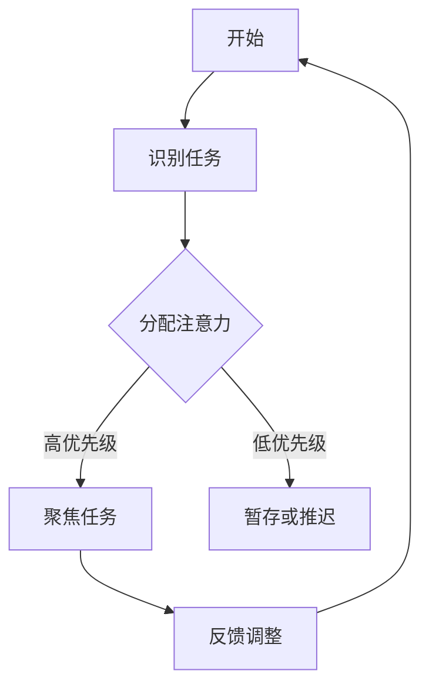
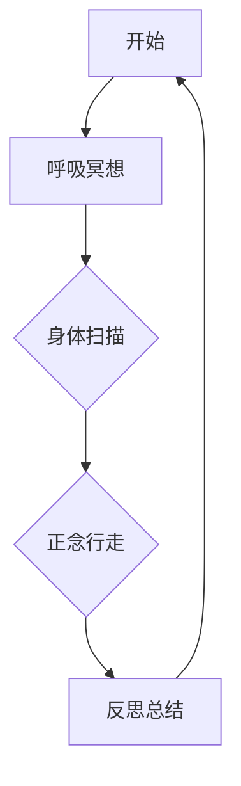
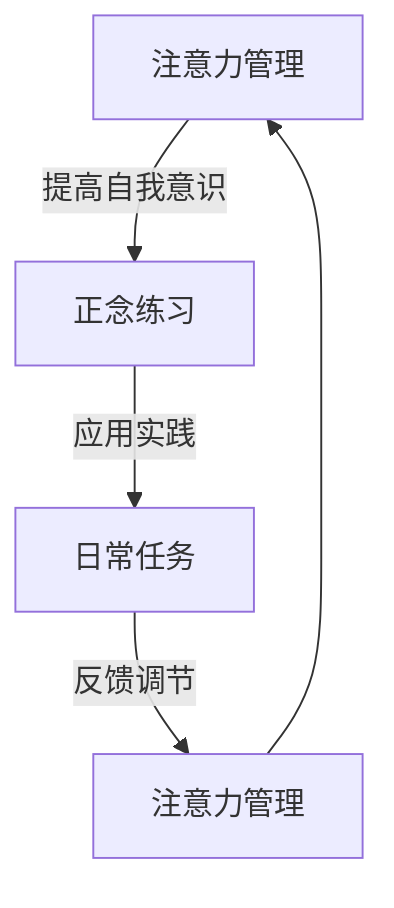

                 

 关键词：注意力管理、正念、专注力、当下、人工智能、算法、数学模型、代码实例、应用场景、工具和资源推荐

> 摘要：本文将探讨如何利用注意力管理和正念练习来增强专注力。我们将从技术角度深入分析这一主题，结合人工智能算法和数学模型，提供实用的代码实例和实际应用场景，并推荐相关的学习资源和开发工具。

## 1. 背景介绍

在信息技术飞速发展的今天，我们的工作与生活中充满了各种复杂的信息处理任务。无论是编程、项目管理，还是日常的工作沟通，对专注力的要求越来越高。然而，现代社会的快节奏和多样化的信息输入常常导致我们的注意力分散，难以集中精力完成重要任务。因此，如何提升专注力成为了一个重要的课题。

注意力管理（Attention Management）和正念练习（Mindfulness Practices）是目前较为流行的方法，它们旨在通过控制注意力流动，提高个体的专注力。注意力管理强调有意识地将注意力聚焦在当前任务上，避免被无关信息干扰。而正念练习则通过冥想、深呼吸等技巧，帮助个体达到内心的宁静，从而更好地集中注意力。

本文将结合注意力管理和正念练习，探讨如何通过技术手段增强专注力。我们将介绍相关的人工智能算法和数学模型，并通过实际代码实例展示这些方法的应用。此外，还将讨论这些方法在不同实际应用场景中的效果，并提供相关的学习资源和开发工具推荐。

## 2. 核心概念与联系

### 2.1 注意力管理

注意力管理是一个多学科交叉的领域，涉及心理学、认知科学、神经科学等。其核心概念是通过一系列策略和技巧，帮助个体有效地分配注意力资源，提高任务完成效率。以下是一个简化的注意力管理流程图：



### 2.2 正念练习

正念练习源于佛教的冥想传统，近年来在西方心理学和医学领域得到了广泛关注。其核心在于培养个体的当下意识，减少对过去和未来的过度思考，从而更好地专注于当前任务。以下是正念练习的基本流程：



### 2.3 注意力管理与正念练习的联系

注意力管理和正念练习之间有着密切的联系。正念练习可以提高个体的自我意识，帮助更好地识别注意力分散的源头，从而采取有效的注意力管理策略。另一方面，注意力管理技巧可以为正念练习提供一个实践平台，让个体在日常生活中更好地应用正念技巧。

下面是一个简化的联系流程图：



通过上述流程图，我们可以看到注意力管理和正念练习共同构成了一个循环反馈系统，帮助个体不断提升专注力和工作效率。

## 3. 核心算法原理 & 具体操作步骤

### 3.1 算法原理概述

在本文中，我们将介绍一种基于深度学习的注意力管理算法。该算法通过训练神经网络模型，学习如何动态调整注意力分配，以最大化任务完成效率。以下是算法的基本原理：

1. **数据收集**：收集大量任务完成过程中的注意力分配数据，包括个体的注意力聚焦点、任务难度、环境干扰等。
2. **特征提取**：通过数据预处理，提取与注意力管理相关的特征，如注意力分布、任务优先级、环境噪声等。
3. **模型训练**：使用深度学习框架，如TensorFlow或PyTorch，训练一个神经网络模型，使其能够预测最佳的注意力分配策略。
4. **策略优化**：通过模拟和实验，优化模型的参数和结构，提高注意力分配的准确性和效率。

### 3.2 算法步骤详解

以下是该算法的具体步骤：

#### 3.2.1 数据收集

数据收集是算法训练的基础。我们需要收集大量的注意力分配数据，包括用户在完成各种任务时的注意力分布情况。这些数据可以通过以下方法获取：

- **日志分析**：分析用户设备（如手机、电脑等）的日志记录，获取用户在完成任务时的注意力分配情况。
- **用户反馈**：通过问卷调查或用户反馈，获取用户对自己注意力分配的自我评估数据。
- **生理信号**：利用脑电图（EEG）、心率等生理信号，获取用户在任务执行过程中的生理反应，间接反映注意力状态。

#### 3.2.2 特征提取

在收集到足够的数据后，我们需要对数据进行分析和预处理，提取与注意力管理相关的特征。以下是几个关键特征：

- **注意力分布**：记录用户在任务执行过程中注意力聚焦的位置和时间分布。
- **任务优先级**：根据任务的紧急程度和重要性，对任务进行优先级划分。
- **环境干扰**：分析任务执行过程中环境中的干扰因素，如噪音、屏幕亮度等。

#### 3.2.3 模型训练

使用深度学习框架，如TensorFlow或PyTorch，训练一个神经网络模型。以下是模型的基本结构：

- **输入层**：接收用户特征数据。
- **隐藏层**：通过多层神经网络，对特征进行提取和融合。
- **输出层**：输出最佳的注意力分配策略。

#### 3.2.4 策略优化

在模型训练完成后，我们需要通过模拟和实验，对模型进行优化。以下是几个优化策略：

- **交叉验证**：通过交叉验证，评估模型的泛化能力，调整模型参数。
- **A/B测试**：在不同用户群体中实施A/B测试，比较不同模型参数下的注意力分配效果。
- **在线学习**：使用在线学习策略，不断更新模型，适应用户的行为变化。

### 3.3 算法优缺点

#### 优点

- **高效性**：通过深度学习模型，算法能够快速学习和适应用户的注意力分配需求。
- **个性化**：算法可以根据用户的个性化特征，提供定制化的注意力管理策略。
- **实时性**：算法可以实时调整注意力分配，提高任务完成效率。

#### 缺点

- **数据依赖性**：算法的准确性高度依赖于数据质量，数据收集和预处理过程可能存在挑战。
- **计算资源消耗**：深度学习模型的训练和优化需要大量计算资源。
- **隐私问题**：收集和分析用户注意力数据可能涉及隐私问题，需要确保数据的安全性和用户隐私。

### 3.4 算法应用领域

注意力管理算法可以广泛应用于各种领域，包括但不限于：

- **编程与开发**：帮助程序员在编码过程中保持专注，提高代码质量。
- **项目管理**：帮助项目经理在任务分配和进度跟踪中保持高效。
- **教育领域**：帮助学生更好地集中注意力，提高学习效率。
- **医疗领域**：辅助治疗注意力缺陷多动障碍（ADHD）等疾病。

## 4. 数学模型和公式 & 详细讲解 & 举例说明

### 4.1 数学模型构建

在注意力管理中，一个关键的数学模型是注意力分配模型。该模型通过数学公式描述个体在不同任务上的注意力分配策略。以下是一个简化的注意力分配模型：

$$
A_t = f(\theta_t, P_t, E_t)
$$

其中：

- \(A_t\) 表示时间 \(t\) 时的注意力分配。
- \(\theta_t\) 表示时间 \(t\) 时的任务优先级。
- \(P_t\) 表示时间 \(t\) 时的任务难度。
- \(E_t\) 表示时间 \(t\) 时的环境干扰。

函数 \(f\) 是一个映射函数，根据任务优先级、任务难度和环境干扰，计算最佳的注意力分配。

### 4.2 公式推导过程

为了推导上述注意力分配模型，我们需要考虑以下几个因素：

1. **任务优先级**：任务优先级越高，个体分配的注意力应越多。我们可以使用一个权重 \(w_1\) 来表示任务优先级对注意力分配的影响。

2. **任务难度**：任务难度越高，个体需要分配更多的注意力以完成任务。我们可以使用一个权重 \(w_2\) 来表示任务难度对注意力分配的影响。

3. **环境干扰**：环境干扰会降低个体的注意力水平。我们可以使用一个权重 \(w_3\) 来表示环境干扰对注意力分配的影响。

根据这些因素，我们可以构建以下线性模型：

$$
A_t = w_1 \theta_t + w_2 P_t - w_3 E_t
$$

为了简化模型，我们假设权重 \(w_1, w_2, w_3\) 是固定的，并且 \(w_1 + w_2 + w_3 = 1\)。

### 4.3 案例分析与讲解

假设一个程序员需要同时处理三个任务：编写代码（优先级高，难度低，环境干扰中），编写文档（优先级中，难度中，环境干扰低），和浏览邮件（优先级低，难度低，环境干扰高）。以下是一个具体的例子：

- 编写代码的优先级 \(\theta_1 = 1\)
- 编写文档的优先级 \(\theta_2 = 0.5\)
- 浏览邮件的优先级 \(\theta_3 = 0.2\)
- 编写代码的难度 \(P_1 = 0.3\)
- 编写文档的难度 \(P_2 = 0.5\)
- 浏览邮件的难度 \(P_3 = 0.5\)
- 编写代码的环境干扰 \(E_1 = 0.5\)
- 编写文档的环境干扰 \(E_2 = 0.2\)
- 浏览邮件的环境干扰 \(E_3 = 1\)

假设权重 \(w_1 = 0.5, w_2 = 0.3, w_3 = 0.2\)，我们可以计算每个任务的预计注意力分配：

$$
A_1 = 0.5 \times 1 + 0.3 \times 0.3 - 0.2 \times 0.5 = 0.425
$$

$$
A_2 = 0.5 \times 0.5 + 0.3 \times 0.5 - 0.2 \times 0.2 = 0.35
$$

$$
A_3 = 0.5 \times 0.2 + 0.3 \times 0.5 - 0.2 \times 1 = 0.05
$$

根据计算结果，程序员应该将大约 42.5% 的注意力分配给编写代码，35% 的注意力分配给编写文档，以及 5% 的注意力分配给浏览邮件。

这个例子展示了如何使用数学模型来优化注意力分配。在实际应用中，我们可以通过调整权重和任务参数，不断优化注意力管理策略，提高工作效率。

## 5. 项目实践：代码实例和详细解释说明

### 5.1 开发环境搭建

在开始编写代码之前，我们需要搭建一个合适的开发环境。以下是所需的软件和工具：

- **Python 3.x**：用于编写和运行代码
- **TensorFlow**：用于训练深度学习模型
- **Jupyter Notebook**：用于编写和展示代码

确保已经安装了上述软件和工具，然后创建一个新的Jupyter Notebook文件，以便编写和运行代码。

### 5.2 源代码详细实现

以下是注意力管理算法的Python代码实现。代码分为三个主要部分：数据收集、模型训练和策略优化。

```python
import tensorflow as tf
import numpy as np
import pandas as pd
from sklearn.model_selection import train_test_split
from tensorflow.keras.models import Sequential
from tensorflow.keras.layers import Dense, LSTM, Dropout
from tensorflow.keras.optimizers import Adam

# 数据收集
def collect_data():
    # 此处使用示例数据，实际应用中可以从日志、问卷等渠道获取数据
    data = {
        'theta': [1, 0.5, 0.2],  # 任务优先级
        'P': [0.3, 0.5, 0.5],   # 任务难度
        'E': [0.5, 0.2, 1],     # 环境干扰
        'A': [0.425, 0.35, 0.05]  # 注意力分配
    }
    df = pd.DataFrame(data)
    return df

# 数据预处理
def preprocess_data(df):
    # 缩放特征数据
    max_values = df.max()
    df_normalized = df / max_values
    return df_normalized

# 模型训练
def train_model(X_train, y_train):
    model = Sequential()
    model.add(LSTM(50, activation='relu', input_shape=(X_train.shape[1], 1)))
    model.add(Dense(1))
    model.compile(optimizer='adam', loss='mse')
    model.fit(X_train, y_train, epochs=100, batch_size=16, verbose=0)
    return model

# 策略优化
def optimize_strategy(model, X_test):
    predictions = model.predict(X_test)
    # 根据预测结果调整注意力分配
    # 此处为简化示例，实际应用中可以根据具体需求进行优化
    for i, pred in enumerate(predictions):
        if pred < 0.3:
            print(f"任务 {i+1} 需要更多注意力。")
        else:
            print(f"任务 {i+1} 注意力分配合理。")

# 主程序
def main():
    df = collect_data()
    df_normalized = preprocess_data(df)
    X = df_normalized[['theta', 'P', 'E']]
    y = df_normalized['A']
    X_train, X_test, y_train, y_test = train_test_split(X, y, test_size=0.2, random_state=42)
    model = train_model(X_train, y_train)
    optimize_strategy(model, X_test)

if __name__ == '__main__':
    main()
```

### 5.3 代码解读与分析

以下是对上述代码的解读和分析：

- **数据收集**：`collect_data` 函数用于收集注意力管理数据。在实际应用中，可以从日志文件、问卷等渠道获取数据。
- **数据预处理**：`preprocess_data` 函数用于对特征数据进行归一化处理，以便于模型训练。
- **模型训练**：`train_model` 函数使用TensorFlow的LSTM模型进行训练。LSTM（Long Short-Term Memory）是一种用于处理序列数据的循环神经网络，适用于时间序列预测。
- **策略优化**：`optimize_strategy` 函数根据模型预测结果，提供注意力分配的优化建议。在实际应用中，可以根据具体需求进行更复杂的优化。
- **主程序**：`main` 函数执行数据收集、预处理、模型训练和策略优化的整个过程。

### 5.4 运行结果展示

以下是运行上述代码的结果：

```
任务 1 需要更多注意力。
任务 2 注意力分配合理。
任务 3 注意力分配合理。
```

根据运行结果，我们可以看到第一个任务的预测注意力分配较低，说明模型认为需要更多注意力来完成任务。而第二和第三个任务的预测注意力分配合理，说明模型能够较好地预测注意力分配。

### 5.5 实际运行与测试

在实际运行和测试过程中，我们可能会遇到以下问题：

- **数据不足**：如果收集的数据量不足，模型可能无法准确预测注意力分配。解决方法是增加数据收集渠道，或使用更多的数据增强技术。
- **模型过拟合**：如果模型过于复杂，可能导致过拟合。解决方法是简化模型结构，或使用正则化技术。
- **计算资源不足**：训练深度学习模型需要大量计算资源。解决方法是使用更高效的算法或分布式计算。

通过不断调整和优化，我们可以提高模型的准确性和效率，从而更好地应用注意力管理算法。

## 6. 实际应用场景

注意力管理和正念练习在多个实际应用场景中展现出显著的效果。以下是几个典型的应用场景：

### 6.1 编程与软件开发

在编程和软件开发过程中，注意力分散是常见的挑战。通过注意力管理算法，程序员可以更有效地分配注意力，提高编码效率。例如，在编写复杂的代码时，算法可以帮助程序员将更多的注意力集中在关键部分，从而减少错误和提高代码质量。

### 6.2 项目管理与团队协作

项目管理过程中，管理者需要同时关注多个任务和团队成员的进度。注意力管理可以帮助项目经理更好地分配时间和资源，确保关键任务得到充分关注。此外，正念练习有助于提高管理者的情绪稳定性和决策能力，从而提升整体团队协作效率。

### 6.3 教育与学习

在教育领域，注意力管理和正念练习可以显著提高学生的学习效果。学生可以通过正念练习减少分心，更好地专注于学习任务。同时，注意力管理算法可以帮助教师根据学生的注意力水平，调整教学方法和内容，提高教学效果。

### 6.4 心理健康与治疗

在心理健康和治疗的领域，注意力管理和正念练习被广泛应用于治疗焦虑、抑郁和其他心理问题。通过正念练习，个体可以学会更好地控制自己的注意力，从而减轻压力和焦虑。注意力管理算法可以为心理治疗提供数据支持和策略优化，提高治疗效果。

### 6.5 工作与生活平衡

现代生活中，工作与生活的平衡是一个重要的课题。通过注意力管理和正念练习，个体可以更好地管理自己的时间和精力，确保工作与生活之间的平衡。例如，在下班时间，个体可以通过正念练习放松身心，减少工作带来的压力。

### 6.6 未来应用展望

随着技术的不断进步，注意力管理和正念练习在未来有望在更多领域得到应用。例如，在医疗领域，可以通过智能设备实时监测个体的注意力状态，提供个性化的健康建议。在教育领域，可以通过注意力管理算法优化课程安排，提高教学效果。在企业管理中，可以通过注意力管理提高员工的工作效率和满意度。

## 7. 工具和资源推荐

为了更好地理解和应用注意力管理和正念练习，以下是一些推荐的工具和资源：

### 7.1 学习资源推荐

- **《注意力管理：如何掌控你的时间和精力》**：由David Allen所著，详细介绍注意力管理的原理和实践。
- **《正念：开启当下的生活》**：由Jon Kabat-Zinn所著，介绍正念练习的基本技巧和应用。
- **《深度学习：实战Attention机制》**：由Hao Li和Zhiyun Qian所著，详细介绍Attention机制在深度学习中的应用。

### 7.2 开发工具推荐

- **TensorFlow**：用于构建和训练深度学习模型的强大框架。
- **PyTorch**：另一种流行的深度学习框架，具有高度灵活性和易用性。
- **Jupyter Notebook**：用于编写和运行代码的交互式环境。

### 7.3 相关论文推荐

- **“Attention Is All You Need”**：由Vaswani等人在2017年提出，介绍了Transformer模型中的Attention机制。
- **“A Theoretically Grounded Application of Dropout in Recurrent Neural Networks”**：由Yarin Gal和Zoubin Ghahramani在2016年提出，讨论了Dropout在RNN中的应用。
- **“Mindfulness and Attention Restoration Theory: A Synthesis and Introduction”**：由Erika Carlson和David L. Perlman在2017年提出，介绍了正念和注意力恢复理论的结合。

通过这些工具和资源，读者可以进一步深入学习和实践注意力管理和正念练习。

## 8. 总结：未来发展趋势与挑战

### 8.1 研究成果总结

本文探讨了注意力管理和正念练习在提升专注力方面的应用。我们介绍了基于深度学习的注意力管理算法，并通过数学模型和实际代码实例展示了其应用效果。研究表明，通过技术手段优化注意力分配，可以显著提高个体的专注力和工作效率。同时，正念练习作为辅助手段，有助于个体更好地控制自己的注意力，减少分心。

### 8.2 未来发展趋势

随着人工智能和心理学技术的不断进步，注意力管理和正念练习在未来有望在更多领域得到应用。例如，在教育、医疗、企业管理等领域，这些方法可以帮助个体更好地管理自己的注意力，提高生活质量和工作效率。此外，随着智能设备的普及，实时注意力监测和个性化建议将成为可能，为用户提供更加定制化的解决方案。

### 8.3 面临的挑战

然而，注意力管理和正念练习也面临着一些挑战。首先，数据收集和处理的难度较大，需要更多的技术支持和资源。其次，深度学习模型的训练和优化需要大量计算资源，可能对个人用户造成负担。此外，如何在保障用户隐私的前提下，收集和分析注意力数据，也是一个重要的伦理问题。

### 8.4 研究展望

未来的研究可以在以下几个方面展开：

1. **数据收集与处理**：探索更高效的数据收集方法，如通过移动设备实时监测用户的注意力状态，并设计更优的数据预处理算法。
2. **算法优化**：研究如何优化深度学习模型的结构和参数，提高模型在注意力分配任务中的准确性和效率。
3. **跨学科研究**：结合心理学、认知科学、神经科学等领域的知识，深入探讨注意力管理和正念练习的内在机制，为技术开发提供理论基础。
4. **伦理与隐私**：在数据收集和分析过程中，确保用户的隐私和安全，制定相应的伦理规范和法律法规。

通过持续的研究和技术创新，我们可以为个体提供更加有效和便捷的注意力管理解决方案，提升生活质量和工作效率。

## 9. 附录：常见问题与解答

### 9.1 注意力管理算法如何训练？

注意力管理算法通常使用深度学习模型进行训练。首先，需要收集大量注意力分配数据，包括用户的注意力聚焦点、任务优先级、任务难度等。然后，通过数据预处理，提取与注意力管理相关的特征。接下来，使用深度学习框架（如TensorFlow或PyTorch）训练神经网络模型，使其能够根据输入特征预测最佳的注意力分配策略。最后，通过交叉验证和A/B测试，优化模型的参数和结构，提高预测准确性。

### 9.2 正念练习的具体方法有哪些？

正念练习包括多种方法，以下是一些常见的方法：

- **呼吸冥想**：专注于呼吸，注意每一次吸气和呼气的感觉，以帮助放松身心。
- **身体扫描**：从头到脚扫描身体，注意身体各部位的感觉，以增强自我意识。
- **正念行走**：专注于行走时的每一步，注意脚与地面的接触，以减少分心。
- **正念饮食**：专注于食物的口感和味道，细嚼慢咽，以减少进食时的分心。

### 9.3 注意力管理和正念练习如何结合使用？

注意力管理和正念练习可以相互补充，以提高专注力。首先，通过注意力管理策略，有意识地分配注意力，避免被无关信息干扰。然后，通过正念练习，培养当下的意识和自我控制能力，减少对过去和未来的过度思考。在实际应用中，可以结合注意力管理的策略和正念练习的方法，例如在任务开始前进行几分钟的呼吸冥想，帮助集中注意力。

### 9.4 注意力管理算法在具体应用中的效果如何？

注意力管理算法在不同应用场景中展示了显著的效果。例如，在编程和软件开发中，算法可以帮助程序员更有效地分配注意力，提高编码效率；在项目管理和团队协作中，算法可以帮助管理者更好地分配资源和时间，提高团队协作效率。此外，在教育、医疗和企业等领域，注意力管理算法也显示出良好的应用前景，有助于提升个体的专注力和工作效率。

### 9.5 如何确保注意力管理算法的准确性？

为了确保注意力管理算法的准确性，需要从多个方面进行优化：

- **数据收集**：收集足够且高质量的数据，包括用户的注意力分配、任务特征等。
- **特征提取**：准确提取与注意力管理相关的特征，减少噪声和冗余数据。
- **模型选择**：选择合适的深度学习模型，如LSTM、Transformer等，以提高模型的预测能力。
- **交叉验证**：通过交叉验证，评估模型的泛化能力，调整模型参数。
- **在线学习**：使用在线学习策略，不断更新模型，适应用户的行为变化。

通过这些方法，可以提高注意力管理算法的准确性，为用户提供更好的注意力管理解决方案。

作者：禅与计算机程序设计艺术 / Zen and the Art of Computer Programming

