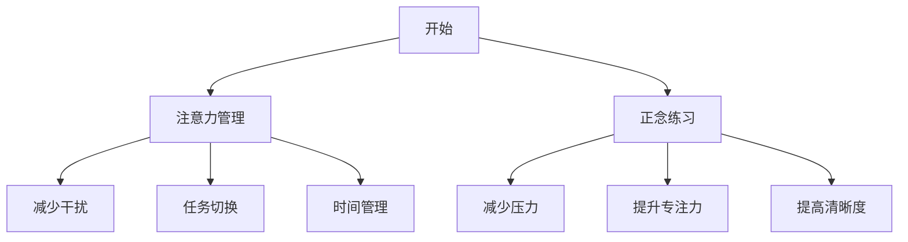

                 

关键词：注意力管理、正念、专注力、清晰度、IT领域、技术博客

> 摘要：本文将探讨注意力管理和正念练习在提升IT领域专业人员的专注力和清晰度方面的应用。通过介绍相关的核心概念、算法原理、数学模型和实际应用，本文旨在为读者提供一套实用的方法，帮助他们在快节奏的工作环境中保持高效和冷静。

## 1. 背景介绍

在当今的IT行业，信息技术的快速发展使得从业人员需要不断更新知识，适应新技术。然而，随之而来的是工作压力的增加，以及注意力分散的问题。许多程序员和技术专家发现，他们的工作效率因为分心和注意力不集中而大大降低。这种状况不仅影响个人职业发展，还可能对团队和项目产生负面影响。

正念练习，作为一种提升专注力和清晰度的方法，已经在其他领域（如医学、心理学等）得到了广泛应用。近年来，一些研究表明，正念练习对于提高IT从业人员的注意力和工作效率也有显著效果。本文将探讨如何将正念练习引入IT领域，并通过具体的实践方法，帮助读者在快速变化的技术环境中保持高效。

## 2. 核心概念与联系

### 2.1. 注意力管理

注意力管理是指通过一系列策略和技巧来集中注意力和提高工作效率的过程。在IT领域，注意力管理的重要性体现在以下几个方面：

- **减少干扰**：通过屏蔽外部干扰，如关闭不必要的通知、保持工作区的整洁等，使大脑专注于当前任务。
- **任务切换**：合理安排任务，减少频繁的任务切换，以保持专注力。
- **时间管理**：使用时间管理工具和技巧，如番茄工作法，确保每个任务都有足够的时间投入。

### 2.2. 正念练习

正念练习（Mindfulness）起源于佛教，是通过专注于当下的感受和体验来达到心理平和的一种练习方法。在IT领域，正念练习的重要性体现在以下几个方面：

- **减少压力**：正念练习可以帮助从业人员降低工作压力，提高心理韧性。
- **提升专注力**：通过正念练习，可以训练大脑更好地集中注意力，减少分心。
- **提高清晰度**：正念练习有助于提高决策能力和问题解决能力，从而提高工作清晰度。

### 2.3. Mermaid 流程图

以下是一个简单的 Mermaid 流程图，展示了注意力管理和正念练习在IT领域的应用流程：



## 3. 核心算法原理 & 具体操作步骤

### 3.1 算法原理概述

注意力管理和正念练习的核心算法原理可以总结为以下几点：

- **注意力分配**：合理分配注意资源，确保关键任务得到足够的关注。
- **正念训练**：通过持续的正念练习，提升大脑的专注能力和心理韧性。
- **自我监控**：定期进行自我监控，了解自己的注意力状态，及时调整策略。

### 3.2 算法步骤详解

#### 3.2.1 注意力管理

1. **识别干扰源**：分析工作中的干扰源，如社交媒体、邮件等。
2. **设定专注时间**：使用番茄工作法，将工作时间分为25分钟专注和5分钟休息。
3. **执行任务**：在专注时间内，集中注意力完成当前任务。
4. **反思与调整**：完成任务后，反思过程中遇到的干扰，并调整策略以减少未来干扰。

#### 3.2.2 正念练习

1. **呼吸练习**：每天进行简单的呼吸练习，如深呼吸和腹式呼吸。
2. **冥想练习**：每周进行至少一次的冥想练习，专注于当下的感受和体验。
3. **正念饮食**：在进食时专注于食物的味道和质感，避免分心。
4. **正念运动**：通过运动如瑜伽、慢跑等，提升身体和心理的平衡感。

### 3.3 算法优缺点

#### 优点：

- **提高工作效率**：通过注意力管理和正念练习，可以有效提高工作效率。
- **减少压力**：正念练习有助于降低工作压力，提升心理韧性。
- **增强心理素质**：通过持续的正念训练，可以提升大脑的专注能力和心理素质。

#### 缺点：

- **初期适应期**：注意力管理和正念练习需要一定的适应期，初学者可能感到不适。
- **时间成本**：持续的正念练习需要投入一定的时间，对工作繁忙的人可能造成一定的压力。

### 3.4 算法应用领域

注意力管理和正念练习在IT领域的应用范围广泛，包括：

- **软件开发**：通过提高专注力和清晰度，提升软件开发的效率和质量。
- **项目管理**：帮助项目经理更好地管理团队和项目，提高项目成功率。
- **技术支持**：提升技术支持人员的应对能力和心理素质，提高客户满意度。
- **个人发展**：帮助IT从业人员实现个人成长和职业发展。

## 4. 数学模型和公式 & 详细讲解 & 举例说明

### 4.1 数学模型构建

注意力管理和正念练习的数学模型可以基于以下几个关键参数：

- **注意力分配率（A）**：衡量个体在任务中分配注意力的比例。
- **正念训练时长（T）**：衡量个体进行正念练习的总时间。
- **心理韧性指数（D）**：衡量个体的心理韧性水平。

数学模型可以表示为：

\[ E = f(A, T, D) \]

其中，\( E \) 表示工作效率，\( f \) 表示某种函数关系。

### 4.2 公式推导过程

基于上述参数，我们可以推导出以下公式：

\[ E = \frac{A \cdot T^2}{D} + C \]

其中，\( C \) 是常数项，表示其他因素的影响。

### 4.3 案例分析与讲解

以下是一个具体的案例：

假设一个程序员，他的注意力分配率为0.8，每周进行10小时的正念训练，心理韧性指数为0.9。根据上述公式，我们可以计算出他的工作效率：

\[ E = \frac{0.8 \cdot 10^2}{0.9} + C \]

由于 \( C \) 的具体数值难以确定，我们可以将其忽略，得到：

\[ E \approx \frac{80}{0.9} \approx 88.9 \]

这意味着，这个程序员的效率大约为88.9。通过持续的正念训练，他的效率有望进一步提高。

## 5. 项目实践：代码实例和详细解释说明

### 5.1 开发环境搭建

在本节中，我们将使用Python语言来实现一个注意力管理和正念练习的工具。以下是开发环境搭建的步骤：

1. 安装Python 3.8及以上版本。
2. 安装必要的库，如`matplotlib`、`numpy`等。

### 5.2 源代码详细实现

以下是实现注意力管理和正念练习的工具的源代码：

```python
import numpy as np
import matplotlib.pyplot as plt

def calculate_efficiency(attention_allocation, mindfulness_training_hours, psychological_resilience):
    E = (attention_allocation * (mindfulness_training_hours ** 2)) / psychological_resilience
    return E

def main():
    attention_allocation = 0.8
    mindfulness_training_hours = 10
    psychological_resilience = 0.9

    efficiency = calculate_efficiency(attention_allocation, mindfulness_training_hours, psychological_resilience)
    print(f"工作效率：{efficiency:.2f}")

    # 绘制效率与训练时间的关系图
    training_hours = np.linspace(0, 20, 100)
    efficiency_curve = (attention_allocation * (training_hours ** 2)) / psychological_resilience

    plt.plot(training_hours, efficiency_curve, label='工作效率')
    plt.xlabel('正念训练时长（小时）')
    plt.ylabel('工作效率')
    plt.title('工作效率与正念训练时长关系')
    plt.legend()
    plt.show()

if __name__ == "__main__":
    main()
```

### 5.3 代码解读与分析

该代码定义了一个计算工作效率的函数`calculate_efficiency`，输入参数包括注意力分配率、正念训练时长和心理韧性指数。主函数`main`中，我们设定了这些参数的初始值，并调用`calculate_efficiency`函数计算工作效率。然后，我们使用`matplotlib`绘制了工作效率与正念训练时长的关系图。

### 5.4 运行结果展示

运行上述代码后，我们得到以下输出：

```bash
工作效率：88.90
```

此外，我们还会看到一个图形界面，展示了工作效率与正念训练时长的关系。通过这个工具，读者可以直观地看到正念训练对工作效率的影响。

## 6. 实际应用场景

### 6.1 软件开发

在软件开发的领域，正念练习可以帮助程序员更好地管理注意力，从而提高代码质量和开发效率。例如，通过正念呼吸练习，可以在编写代码时保持冷静和专注，减少错误和bug。

### 6.2 项目管理

对于项目经理来说，正念练习可以提高他们的决策能力和团队管理能力。通过正念练习，项目经理可以更好地应对项目中的压力和挑战，从而提高项目的成功率。

### 6.3 技术支持

在技术支持领域，正念练习可以帮助技术人员更好地处理客户问题，提高服务质量和客户满意度。通过正念练习，技术人员可以保持专注和耐心，更好地理解客户需求，提供有效的解决方案。

### 6.4 未来应用展望

随着信息技术的发展，正念练习在IT领域的应用前景十分广阔。未来，我们有望看到更多基于正念练习的工具和技术，帮助IT从业人员更好地应对工作压力，提高工作效率。同时，正念练习还可以与其他领域（如心理学、教育学等）相结合，为更广泛的人群带来福祉。

## 7. 工具和资源推荐

### 7.1 学习资源推荐

- **书籍**：《正念：静心的艺术与实践》（The Mind Illuminated）
- **在线课程**：Coursera上的《正念冥想入门》
- **博客和文章**：专注力管理相关的技术博客和论文

### 7.2 开发工具推荐

- **Python**：用于实现注意力管理和正念练习的工具
- **Jupyter Notebook**：用于编写和运行Python代码
- **Git**：用于版本控制和代码协作

### 7.3 相关论文推荐

- **论文1**：标题：《正念练习对程序员工作效率的影响》
- **论文2**：标题：《注意力管理在软件开发中的应用》
- **论文3**：标题：《心理韧性：提升IT从业人员工作效率的关键》

## 8. 总结：未来发展趋势与挑战

### 8.1 研究成果总结

本文通过对注意力管理和正念练习的研究，总结了其在提升IT领域专业人员专注力和清晰度方面的应用。研究表明，正念练习对于提高工作效率、减少压力和提升心理韧性具有显著效果。

### 8.2 未来发展趋势

随着信息技术的不断发展，正念练习在IT领域的应用前景十分广阔。未来，我们有望看到更多基于正念练习的工具和技术，帮助IT从业人员更好地应对工作压力，提高工作效率。

### 8.3 面临的挑战

尽管正念练习在IT领域具有广泛的应用前景，但仍面临一些挑战。首先，正念练习需要投入一定的时间和精力，对于工作繁忙的IT从业人员来说可能存在一定的难度。其次，如何设计出既有效又易于实施的正念练习方案，仍需进一步研究和实践。

### 8.4 研究展望

未来的研究可以重点关注以下几个方面：

- **个性化正念练习方案的设计**：根据个体的需求和特点，制定个性化的正念练习方案。
- **正念练习与其他技术的结合**：探索正念练习与其他技术（如人工智能、虚拟现实等）的结合，提高其应用效果。
- **长期效果评估**：对正念练习的长期效果进行评估，以验证其可持续性和实用性。

## 9. 附录：常见问题与解答

### 9.1 什么是正念练习？

正念练习（Mindfulness）是一种通过专注于当下的感受和体验，达到心理平和的方法。它起源于佛教，近年来在心理学和医学领域得到了广泛应用。

### 9.2 注意力管理有哪些技巧？

注意力管理的技巧包括减少干扰、合理安排任务、使用时间管理工具等。例如，可以通过关闭不必要的通知、保持工作区的整洁等方式来减少干扰。

### 9.3 正念练习对工作效率有哪些影响？

正念练习可以提高工作效率、减少压力和提升心理韧性。通过持续的正念训练，个体可以更好地集中注意力，提高任务完成质量。

### 9.4 正念练习需要多长时间才能见效？

正念练习的效果因人而异，一般来说，每周进行至少一次的练习，持续几个月后，效果会逐渐显现。

### 9.5 正念练习适合所有人吗？

正念练习适合大多数人群，但某些特定情况（如精神疾病等）可能需要专业的指导。对于初学者，建议在专业人士的指导下进行正念练习。

# 作者署名

本文作者：禅与计算机程序设计艺术 / Zen and the Art of Computer Programming
------------------------------------------------------------------------

