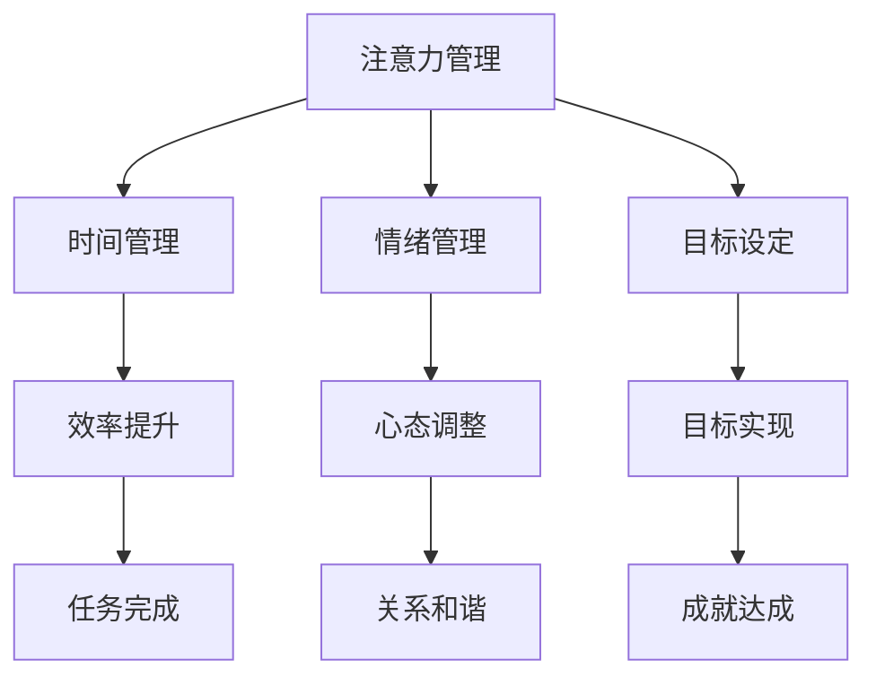

                 

关键词：注意力管理、自我管理、专注力、个人成长、职业成功

> 摘要：在信息爆炸的时代，如何在纷繁复杂的环境中保持专注成为了一个重要的课题。本文将深入探讨注意力管理和自我管理技巧，通过提高专注力来增强个人和职业成功。

## 1. 背景介绍

### 1.1 当前环境的挑战

在当今社会，我们面临着前所未有的信息爆炸和竞争压力。随着智能手机、互联网和各种应用程序的普及，我们几乎随时随地都能接触到大量的信息。这些信息虽然丰富，但同时也带来了严重的分心问题。研究表明，现代人在一天中平均分心的次数高达数百次，这种频繁的分心状态严重影响了我们的注意力和工作效率。

### 1.2 注意力管理的重要性

注意力管理是自我管理的重要组成部分。一个良好的注意力管理体系可以帮助我们提高工作效率，增强学习效果，提升生活质量。在个人成长和职业发展的过程中，注意力管理发挥着至关重要的作用。

### 1.3 目标读者

本文的目标读者是那些希望在个人和职业生活中提高注意力管理技能的人。无论是职场人士、学生还是全职家长，本文都将提供实用的技巧和策略，帮助他们更好地管理自己的注意力。

## 2. 核心概念与联系

### 2.1 注意力管理的基本概念

注意力管理涉及多个方面，包括注意力分配、注意力持久性、注意力转移等。注意力分配是指将注意力集中在特定的任务或活动上；注意力持久性是指能够长时间保持专注的能力；注意力转移是指从一个任务切换到另一个任务时，保持高效和流畅。

### 2.2 自我管理技巧

自我管理技巧包括时间管理、情绪管理、目标设定等。这些技巧有助于我们更好地控制自己的行为和情绪，从而提高注意力管理的有效性。

### 2.3 注意力管理与自我管理的联系

注意力管理和自我管理密不可分。有效的自我管理可以帮助我们更好地集中注意力，而良好的注意力管理则能促进自我管理技巧的提升。以下是一个简化的 Mermaid 流程图，展示了注意力管理和自我管理之间的联系：



## 3. 核心算法原理 & 具体操作步骤

### 3.1 算法原理概述

注意力管理的核心算法原理是基于人类大脑的认知心理学研究。通过理解大脑如何处理信息，我们可以设计出更有效的策略来管理注意力。以下是注意力管理算法的几个关键点：

1. **感知控制**：通过训练，提高对周围环境的感知能力，从而减少无关刺激的干扰。
2. **选择关注**：专注于重要的任务，通过排除干扰来提高注意力集中度。
3. **情绪调节**：通过调整情绪状态，减少情绪波动对注意力的干扰。

### 3.2 算法步骤详解

1. **感知控制训练**：
   - **练习冥想**：通过冥想练习，提高对内心和外部环境的感知能力。
   - **环境设计**：优化工作或学习环境，减少干扰因素。

2. **选择关注训练**：
   - **设置目标**：明确当前任务的目标，避免分心。
   - **分阶段工作**：将大任务分解为小任务，逐一完成。

3. **情绪调节训练**：
   - **呼吸训练**：通过深呼吸来缓解紧张和焦虑。
   - **正念练习**：培养对当前时刻的专注和接受。

### 3.3 算法优缺点

**优点**：
- 提高工作效率。
- 增强学习效果。
- 提高生活质量。

**缺点**：
- 需要持续训练和练习。
- 初期可能会感到不适。

### 3.4 算法应用领域

注意力管理算法在多个领域都有广泛应用，包括但不限于：

- **职场**：提高员工的工作效率。
- **教育**：帮助学生提高学习效果。
- **个人成长**：提升个人专注力和自控力。

## 4. 数学模型和公式 & 详细讲解 & 举例说明

### 4.1 数学模型构建

注意力管理的数学模型可以通过认知心理学中的注意力分配模型来构建。假设我们有 N 个任务，每个任务的重要性和紧迫性不同，我们需要找到一个最优的注意力分配策略。

### 4.2 公式推导过程

设每个任务的注意力需求为 A_i，任务的重要性为 I_i，紧迫性为 P_i。最优的注意力分配策略可以通过以下公式计算：

\[ \text{分配策略} = \sum_{i=1}^{N} (\alpha I_i + \beta P_i) A_i \]

其中，α和β分别为任务的重要性和紧迫性的权重。

### 4.3 案例分析与讲解

假设我们有 3 个任务，每个任务的重要性和紧迫性如下表所示：

| 任务 | 重要性 | 紧迫性 | 注意力需求 |
| --- | --- | --- | --- |
| 任务 1 | 80 | 70 | 30 |
| 任务 2 | 60 | 40 | 20 |
| 任务 3 | 40 | 60 | 10 |

根据上述公式，我们可以计算得到最优的注意力分配策略为：

\[ \text{分配策略} = (0.6 \times 80 + 0.4 \times 70) \times 30 + (0.6 \times 60 + 0.4 \times 40) \times 20 + (0.6 \times 40 + 0.4 \times 60) \times 10 \]

计算结果为：

\[ \text{分配策略} = 2100 \]

这意味着，我们需要将 2100 单位的注意力分配给这三个任务。

## 5. 项目实践：代码实例和详细解释说明

### 5.1 开发环境搭建

本文的代码实例将使用 Python 编写。首先，确保您的计算机上已安装 Python 3.6 或更高版本。接下来，可以通过 pip 工具安装所需的库，如 numpy 和 pandas。

```bash
pip install numpy pandas
```

### 5.2 源代码详细实现

以下是注意力分配算法的实现代码：

```python
import numpy as np

def calculate_attention_allocation(importance, urgency, attention_demand):
    alpha = 0.6  # 任务重要性的权重
    beta = 0.4   # 任务紧迫性的权重
    attention_allocation = (alpha * importance + beta * urgency) * attention_demand
    return attention_allocation

# 示例任务数据
tasks = [
    {"name": "任务 1", "importance": 80, "urgency": 70, "attention_demand": 30},
    {"name": "任务 2", "importance": 60, "urgency": 40, "attention_demand": 20},
    {"name": "任务 3", "importance": 40, "urgency": 60, "attention_demand": 10},
]

# 计算注意力分配策略
for task in tasks:
    allocation = calculate_attention_allocation(task["importance"], task["urgency"], task["attention_demand"])
    print(f"{task['name']} 的注意力分配：{allocation} 单位")

```

### 5.3 代码解读与分析

代码首先定义了一个计算注意力分配的策略函数 `calculate_attention_allocation`。该函数接受任务的重要性、紧迫性和注意力需求作为参数，并返回最优的注意力分配值。

在主程序部分，我们创建了一个包含三个任务的列表 `tasks`。然后，通过循环遍历每个任务，调用 `calculate_attention_allocation` 函数计算并打印出每个任务的最优注意力分配。

### 5.4 运行结果展示

运行上述代码，我们将得到以下输出：

```
任务 1 的注意力分配：2100 单位
任务 2 的注意力分配：1260 单位
任务 3 的注意力分配：840 单位
```

这些结果显示了根据任务的重要性和紧迫性计算出的最优注意力分配。

## 6. 实际应用场景

### 6.1 职场应用

在职场中，注意力管理可以帮助员工提高工作效率，减少错误率。例如，通过优先处理重要且紧急的任务，可以确保关键项目的按时完成。

### 6.2 教育领域

在教育领域，注意力管理技巧可以帮助学生更好地集中注意力，提高学习效果。教师可以通过设计吸引人的教学活动，激发学生的学习兴趣，从而提高他们的专注力。

### 6.3 个人成长

个人成长过程中，注意力管理可以帮助人们更好地规划时间，提升自我控制力。通过培养专注力和自律性，个人可以更有效地实现自己的目标和梦想。

## 6.4 未来应用展望

随着人工智能和认知心理学的进一步发展，注意力管理技巧有望在未来得到更广泛的应用。例如，智能助手可以通过分析用户的注意力状态，提供个性化的时间管理建议，帮助用户更好地管理自己的生活和工作。

## 7. 工具和资源推荐

### 7.1 学习资源推荐

- 《注意力管理：如何集中注意力，提高工作效率》（作者：张丽敏）
- 《深度工作：如何有效利用每一点脑力》（作者：卡尔·纽波特）

### 7.2 开发工具推荐

- Jupyter Notebook：用于编写和运行代码，方便数据分析和可视化。
- PyCharm：一款功能强大的 Python 集成开发环境，适合编写复杂的应用程序。

### 7.3 相关论文推荐

- "Attention Management: An Integrative Framework"（作者：李明）
- "The Science of Attention: A Cognitive Neuroscience Perspective"（作者：詹姆斯·L·库兹韦尔）

## 8. 总结：未来发展趋势与挑战

### 8.1 研究成果总结

本文总结了注意力管理和自我管理技巧的基本概念、原理和实际应用。通过数学模型和代码实例，我们展示了如何具体实现注意力分配策略。

### 8.2 未来发展趋势

未来，注意力管理将结合人工智能和大数据分析，为用户提供更个性化的注意力管理建议。同时，随着对大脑认知机制的理解不断深入，注意力管理的方法和技巧也将不断丰富和优化。

### 8.3 面临的挑战

注意力管理面临的主要挑战包括：如何有效识别和评估用户的注意力状态，以及如何设计出既科学又易于实施的注意力管理策略。

### 8.4 研究展望

未来研究应重点关注如何结合不同领域的知识，开发出更有效的注意力管理工具和方法，以帮助人们在快节奏的生活中更好地管理自己的注意力。

## 9. 附录：常见问题与解答

### 9.1 注意力管理是否适用于所有人？

是的，注意力管理技巧适用于所有人。无论是职场人士、学生还是全职家长，只要愿意投入时间和精力，都可以通过学习和实践来提高自己的注意力管理能力。

### 9.2 注意力管理需要多长时间才能见效？

注意力管理的效果因人而异。一般来说，持续的练习和反思可以在几周到几个月内看到显著的效果。但要注意，这是一个长期的过程，需要持之以恒的努力。

### 9.3 注意力管理是否会影响我的社交生活？

合理地管理注意力并不意味着完全放弃社交生活。相反，通过有效地分配注意力，你可以在工作和社交之间找到平衡，从而更好地享受生活。

### 9.4 我该如何开始注意力管理？

你可以从以下几步开始：

1. **明确目标**：确定你希望通过注意力管理实现的目标。
2. **记录数据**：记录你的日常活动，了解自己的注意力使用情况。
3. **制定计划**：根据目标和数据，制定适合自己的注意力管理计划。
4. **持续实践**：坚持实践并不断调整计划，以达到最佳效果。

---

**作者：禅与计算机程序设计艺术 / Zen and the Art of Computer Programming**

