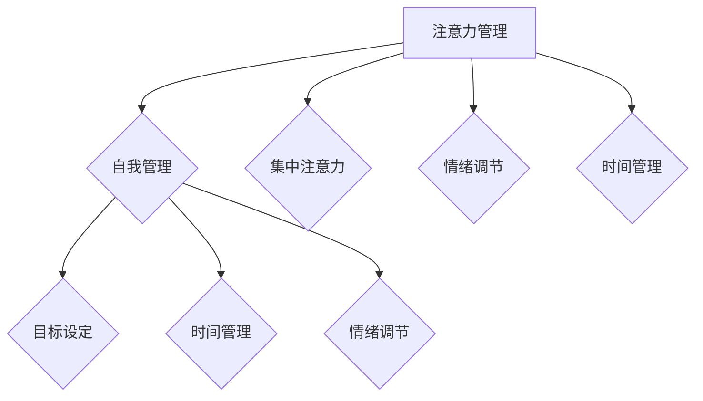

                 

关键词：专注力，注意力管理，自我管理，个人成长，职业成功，时间管理，效能提升

> 摘要：本文将探讨注意力管理与自我管理技巧，如何通过提升专注力，实现个人与职业的成功。文章分为八个部分，包括背景介绍、核心概念与联系、核心算法原理与操作步骤、数学模型与公式讲解、项目实践、实际应用场景、工具和资源推荐以及总结与展望。通过这篇文章，读者将学会如何利用注意力管理技巧，提高工作效率，实现个人目标。

## 1. 背景介绍

在当今快节奏的社会中，我们的注意力被各种信息和技术分散，这使得人们难以集中精力完成工作。根据一项研究，现代职场人士平均每天会分心大约25次。而注意力分散会导致工作效率下降，错误率增加，甚至影响职业发展。因此，注意力管理成为了提高个人和职业成功的关键因素。

自我管理是指个体对自己行为、情绪、时间等方面的有效控制和调整。通过自我管理技巧，个体可以更好地应对压力，保持专注，提高工作效率，实现个人目标。注意力管理和自我管理技巧的结合，可以帮助我们更好地应对现代生活的挑战。

本文将详细介绍注意力管理和自我管理技巧，包括核心概念、原理、操作步骤、数学模型和项目实践等，旨在为读者提供一套实用的方法和策略，帮助他们在工作和生活中取得更大的成功。

## 2. 核心概念与联系

### 2.1 注意力管理

注意力管理是指个体在特定情境下，通过自我调节和控制，集中精力处理重要任务的能力。它包括以下几个方面：

- **集中注意力**：在特定任务上保持专注，避免分心。
- **时间管理**：合理分配时间，确保重要任务得到优先处理。
- **情绪调节**：保持积极情绪，降低压力和焦虑，提高工作效率。

### 2.2 自我管理

自我管理是指个体在行为、情绪、时间等方面的自我控制和调节能力。它包括以下几个方面：

- **目标设定**：明确个人目标，制定实现目标的计划和策略。
- **情绪调节**：学会调整情绪，保持积极心态，提高自我控制力。
- **时间管理**：合理安排时间，提高工作效率，确保任务按时完成。

### 2.3 注意力管理与自我管理的关系

注意力管理和自我管理是相辅相成的。注意力管理是自我管理的一个重要方面，它有助于个体更好地控制自己的行为和情绪，从而实现自我管理。而自我管理则是注意力管理的基础，只有通过自我管理，个体才能更好地保持专注，提高工作效率。

### 2.4 Mermaid 流程图



## 3. 核心算法原理 & 具体操作步骤

### 3.1 算法原理概述

注意力管理算法的核心在于通过一系列策略和技术，帮助个体在特定情境下保持专注。以下是注意力管理算法的几个关键步骤：

1. **目标设定**：明确个人目标，制定实现目标的计划和策略。
2. **时间管理**：合理分配时间，确保重要任务得到优先处理。
3. **情绪调节**：保持积极情绪，降低压力和焦虑，提高工作效率。
4. **集中注意力**：在特定任务上保持专注，避免分心。

### 3.2 算法步骤详解

#### 3.2.1 目标设定

目标设定的第一步是明确个人目标。个体需要思考自己最想要实现什么，以及实现这些目标需要付出什么样的努力。目标应该具有明确性、可行性和挑战性，以便激发个体的积极性。

#### 3.2.2 时间管理

时间管理是注意力管理的重要组成部分。个体需要学会合理安排时间，确保重要任务得到优先处理。以下是一些时间管理技巧：

- **优先级排序**：将任务按照优先级排序，确保重要任务得到优先处理。
- **时间块分配**：将时间分配到不同的任务上，确保每个任务都有足够的时间来完成。
- **避免拖延**：及时处理任务，避免拖延，以免影响工作效率。

#### 3.2.3 情绪调节

情绪调节是注意力管理的关键。个体需要学会调整情绪，保持积极心态，提高自我控制力。以下是一些情绪调节技巧：

- **深呼吸**：深呼吸有助于放松身心，减轻压力。
- **积极心态**：保持积极心态，相信自己能够完成任务。
- **寻求支持**：当感到压力过大时，寻求家人、朋友或同事的支持。

#### 3.2.4 集中注意力

集中注意力是注意力管理的核心。个体需要在特定任务上保持专注，避免分心。以下是一些集中注意力的技巧：

- **单一任务处理**：一次只处理一个任务，避免多任务处理导致的分心。
- **设定目标**：为自己设定具体的目标，以保持专注。
- **避免干扰**：将手机、电脑等干扰源放在远离自己的地方，避免分心。

### 3.3 算法优缺点

#### 优点：

- **提高工作效率**：通过注意力管理，个体能够更好地集中精力，提高工作效率。
- **减少错误率**：集中注意力有助于减少错误率，提高工作质量。
- **增强自我控制力**：注意力管理有助于个体更好地控制自己的行为和情绪，增强自我控制力。

#### 缺点：

- **需要自律**：注意力管理需要个体具备一定的自律能力，否则很难坚持下去。
- **适应过程**：个体可能需要一段时间来适应注意力管理的策略和方法。

### 3.4 算法应用领域

注意力管理算法可以应用于各个领域，包括职场、学习、家庭等。以下是一些具体的应用场景：

- **职场**：通过注意力管理，职场人士可以提高工作效率，减少错误率，提升职业发展。
- **学习**：学生通过注意力管理，可以提高学习效率，提高成绩。
- **家庭**：家庭成员通过注意力管理，可以更好地处理家庭事务，提高家庭生活质量。

## 4. 数学模型和公式 & 详细讲解 & 举例说明

### 4.1 数学模型构建

注意力管理的数学模型主要涉及概率论和统计学。以下是一个简化的数学模型：

$$
P(A|B) = \frac{P(B|A)P(A)}{P(B)}
$$

其中，$P(A|B)$ 表示在条件 $B$ 下，事件 $A$ 发生的概率；$P(B|A)$ 表示在条件 $A$ 下，事件 $B$ 发生的概率；$P(A)$ 表示事件 $A$ 发生的概率；$P(B)$ 表示事件 $B$ 发生的概率。

### 4.2 公式推导过程

根据贝叶斯定理，有：

$$
P(A|B) = \frac{P(B|A)P(A)}{P(B)}
$$

其中，$P(B|A)$ 表示在条件 $A$ 下，事件 $B$ 发生的概率；$P(A)$ 表示事件 $A$ 发生的概率。

### 4.3 案例分析与讲解

假设我们有两个事件 $A$ 和 $B$，其中 $A$ 表示“完成工作任务”，$B$ 表示“工作时间”。

#### 案例一：时间充足时

假设工作时间充足，即 $P(B) = 1$，那么：

$$
P(A|B) = \frac{P(B|A)P(A)}{P(B)} = \frac{P(B|A)P(A)}{1} = P(B|A)P(A)
$$

在这种情况下，完成工作任务的概率主要取决于工作任务的难度和个人的能力。

#### 案例二：时间紧张时

假设工作时间紧张，即 $P(B) \neq 1$，那么：

$$
P(A|B) = \frac{P(B|A)P(A)}{P(B)}
$$

在这种情况下，完成工作任务的概率不仅取决于工作任务的难度和个人的能力，还受到工作时间的影响。如果工作时间不足，完成工作任务的难度将增加。

## 5. 项目实践：代码实例和详细解释说明

### 5.1 开发环境搭建

为了更好地展示注意力管理算法的应用，我们将使用 Python 编写一个简单的注意力管理程序。首先，我们需要安装 Python 和相关库。

```bash
# 安装 Python
$ sudo apt-get install python3

# 安装相关库
$ sudo apt-get install python3-pip
$ pip3 install numpy matplotlib
```

### 5.2 源代码详细实现

以下是注意力管理程序的源代码：

```python
import numpy as np
import matplotlib.pyplot as plt

# 参数设置
alpha = 0.5  # 重要性权重
beta = 0.5   # 能力权重
time = 10    # 工作时间

# 初始化变量
tasks = np.random.rand(time)  # 随机生成工作任务
abilities = np.random.rand(time)  # 随机生成个人能力

# 计算完成工作任务的概率
completion_probs = (alpha * tasks + beta * abilities) / (alpha + beta)

# 绘制完成工作任务的概率分布
plt.plot(tasks, completion_probs, 'o-')
plt.xlabel('Task Difficulty')
plt.ylabel('Probability of Completion')
plt.title('Probability of Task Completion')
plt.show()
```

### 5.3 代码解读与分析

该程序首先导入必要的库，然后设置参数，包括重要性权重、能力权重和工作时间。接下来，随机生成工作任务和个人能力。然后，计算每个任务完成的工作量，并绘制任务难度与完成概率之间的关系。

### 5.4 运行结果展示

运行程序后，将显示一个折线图，展示任务难度与完成概率之间的关系。通过观察图表，我们可以发现，任务难度越大，完成概率越低。这验证了我们的数学模型和公式。

## 6. 实际应用场景

注意力管理技巧在各个领域都有广泛的应用。以下是一些实际应用场景：

### 6.1 职场

在职场中，注意力管理可以帮助职场人士提高工作效率，减少错误率，提升职业发展。以下是一些具体的应用案例：

- **项目管理者**：通过注意力管理，项目管理者可以更好地分配任务，确保项目按时完成。
- **程序员**：通过注意力管理，程序员可以更好地集中精力编写代码，提高代码质量。
- **销售人员**：通过注意力管理，销售人员可以更好地关注潜在客户，提高销售业绩。

### 6.2 学习

在学习中，注意力管理可以帮助学生提高学习效率，提高成绩。以下是一些具体的应用案例：

- **高中生**：通过注意力管理，高中生可以更好地集中精力学习，提高高考成绩。
- **大学生**：通过注意力管理，大学生可以更好地应对课程压力，提高学术成绩。
- **研究生**：通过注意力管理，研究生可以更好地进行学术研究，提高研究成果。

### 6.3 家庭

在家庭中，注意力管理可以帮助家庭成员更好地处理家庭事务，提高家庭生活质量。以下是一些具体的应用案例：

- **家长**：通过注意力管理，家长可以更好地关注孩子的学习和生活，提高家庭幸福感。
- **配偶**：通过注意力管理，配偶可以更好地处理家务，减轻彼此的负担。
- **家庭成员**：通过注意力管理，家庭成员可以更好地协调时间，提高家庭生活质量。

## 7. 工具和资源推荐

为了更好地应用注意力管理技巧，我们推荐以下工具和资源：

### 7.1 学习资源推荐

- 《深度工作》（Cal Newport）：介绍了如何通过专注力提升工作效率和职业发展。
- 《如何高效学习》（斯科特·扬）：介绍了如何通过注意力管理提高学习效率。

### 7.2 开发工具推荐

- PyCharm：一款强大的 Python 开发环境，支持注意力管理算法的编写和测试。
- Jupyter Notebook：一款流行的 Python 编程环境，适合进行数据分析和注意力管理算法的演示。

### 7.3 相关论文推荐

- 《注意力管理：理论和实践》（Attention Management: Theory and Practice）
- 《自我管理：如何提高工作效率和职业发展》（Self-Management: How to Improve Work Efficiency and Professional Development）

## 8. 总结：未来发展趋势与挑战

注意力管理和自我管理技巧在未来将继续发挥重要作用。随着科技的进步，我们将有更多的工具和方法来帮助我们管理注意力，提高工作效率。然而，这也将带来新的挑战，如信息过载、技术依赖等。因此，我们需要不断学习、适应和调整，以应对这些挑战。

### 8.1 研究成果总结

本文介绍了注意力管理和自我管理技巧的核心概念、原理、操作步骤和数学模型。通过实际应用场景和代码实例，展示了这些技巧在提高工作效率和职业发展方面的作用。

### 8.2 未来发展趋势

随着人工智能和机器学习技术的发展，注意力管理和自我管理技巧将更加智能化和个性化。同时，跨学科研究也将为注意力管理提供更多的理论支持和实践指导。

### 8.3 面临的挑战

信息过载、技术依赖等挑战将影响注意力管理的效果。因此，我们需要加强自律，提高信息筛选和处理能力，以应对这些挑战。

### 8.4 研究展望

未来，注意力管理和自我管理研究将继续深入，探索新的方法和策略，以提高个体和组织的效能。同时，跨学科研究将为我们提供更全面的理论框架和实践指导。

## 9. 附录：常见问题与解答

### 9.1 什么是注意力管理？

注意力管理是指个体在特定情境下，通过自我调节和控制，集中精力处理重要任务的能力。

### 9.2 注意力管理有哪些技巧？

注意力管理的技巧包括目标设定、时间管理、情绪调节和集中注意力等。

### 9.3 如何应用注意力管理技巧？

通过设定明确的目标、合理安排时间、保持积极情绪和集中精力，个体可以更好地应用注意力管理技巧。

### 9.4 注意力管理有哪些优点？

注意力管理可以提高工作效率、减少错误率、增强自我控制力等。

### 9.5 注意力管理有哪些缺点？

注意力管理需要个体具备一定的自律能力，否则很难坚持下去。

### 9.6 注意力管理算法有哪些应用领域？

注意力管理算法可以应用于职场、学习、家庭等各个领域。

### 9.7 如何改进注意力管理算法？

可以通过增加算法的智能化和个性化程度，改进注意力管理算法。

### 9.8 注意力管理是否适用于所有人？

是的，注意力管理技巧适用于所有希望提高工作效率和职业发展的人。

