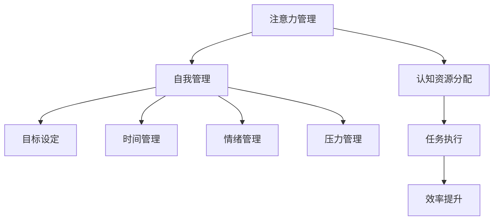

                 

注意力管理和自我管理技巧在现代社会中愈发重要，尤其是在信息技术高速发展的背景下，如何高效地利用时间和精力，提升个人和职业成功率，成为了一个备受关注的话题。本文旨在探讨注意力管理与自我管理的核心概念、原理、应用，并结合实际案例，提供实用的技巧和建议，帮助读者在快节奏的工作环境中保持高效和专注。

> **关键词：** 注意力管理、自我管理、专注力、个人成长、职业成功

> **摘要：** 本文首先介绍了注意力管理和自我管理的基本概念，随后详细分析了注意力分散的原因及其对工作效率的影响。通过核心算法原理的讲解，读者可以掌握提升专注力的具体方法。文章还通过数学模型和项目实践，展示了注意力管理的实际应用。最后，文章对未来发展趋势和挑战进行了展望，为读者提供了全面而深入的理解。

## 1. 背景介绍

在数字化和自动化的浪潮中，人类的工作方式和生活方式发生了翻天覆地的变化。计算机技术的飞速发展，使得信息处理能力大幅提升，但同时也带来了信息过载的问题。人们在处理大量信息的同时，容易陷入多任务处理的困境，导致注意力分散，工作效率降低。此外，社交媒体的普及和移动设备的便捷性，使得人们更容易分心，难以集中精力完成任务。

注意力管理，即通过一系列方法和技术，提高个体对注意力的控制和运用能力，已成为提高工作效率和职业成功的关键因素。自我管理则是指个体通过自我监控、自我调节和自我激励，实现目标达成的过程。有效的注意力管理和自我管理，不仅能够提高工作效率，还能提升生活质量，促进个人成长。

本文将围绕注意力管理和自我管理两大主题，深入探讨其核心概念、原理和应用，旨在为读者提供一套实用的技巧和策略，帮助他们在现代快节奏生活中保持专注，实现个人和职业的成功。

## 2. 核心概念与联系

### 2.1. 注意力管理的定义

注意力管理是指个体通过一系列方法和技术，提高对注意力的控制和运用能力，从而在特定任务中保持高效和专注。注意力是一种认知资源，有限的注意力资源需要在不同的任务和环境中进行合理分配。

### 2.2. 自我管理的定义

自我管理是指个体通过自我监控、自我调节和自我激励，实现目标达成的过程。自我管理不仅涉及时间管理，还包括情绪管理、压力管理、目标设定和实现等多个方面。

### 2.3. 注意力管理与自我管理的联系

注意力管理和自我管理密切相关。有效的自我管理能够帮助个体更好地控制注意力资源，从而提高工作效率。而良好的注意力管理则能够促进自我管理的实施，使个体能够更加专注地实现既定目标。

#### 2.3.1. Mermaid 流程图

以下是一个简单的 Mermaid 流程图，展示了注意力管理和自我管理之间的联系。



通过这个流程图，我们可以清晰地看到注意力管理和自我管理在不同方面相互交织和影响，共同促进个人和职业的发展。

### 2.4. 注意力管理的重要性

注意力管理的重要性在于其能够直接影响个体的工作效率和职业成功。以下是注意力管理对个人和职业成功的一些具体影响：

1. **提升工作效率**：良好的注意力管理能够帮助个体在任务中保持专注，减少分心，从而提高工作效率。

2. **减少错误和遗漏**：集中注意力能够帮助个体更好地处理任务，减少错误和遗漏，提高工作质量。

3. **增强创新能力**：在高度集中的注意力状态下，个体更容易产生新的想法和解决方案，从而增强创新能力。

4. **促进职业发展**：有效的注意力管理能够帮助个体在竞争激烈的工作环境中脱颖而出，促进职业发展。

### 2.5. 自我管理的重要性

自我管理的重要性同样不可忽视。以下是自我管理对个人和职业成功的一些具体影响：

1. **目标实现**：通过自我管理，个体能够设定明确的目标，并采取有效的措施实现这些目标。

2. **情绪稳定**：自我管理能够帮助个体在压力和挑战面前保持情绪稳定，从而更好地应对各种情境。

3. **持续成长**：自我管理鼓励个体不断学习和自我提升，从而实现持续的个人成长。

4. **提升领导力**：有效的自我管理能够帮助个体在团队中发挥领导力，推动团队目标的实现。

### 2.6. 注意力管理的关键要素

为了实现有效的注意力管理，以下几个关键要素至关重要：

1. **明确目标**：设定清晰、具体的目标，有助于个体在任务中保持专注。

2. **环境优化**：创造一个有利于专注的环境，如减少干扰、保持安静等。

3. **时间管理**：合理安排时间，避免过度工作，确保充足的休息和恢复时间。

4. **情绪调节**：学会调节情绪，避免情绪波动对注意力产生负面影响。

5. **持续练习**：通过持续的练习和反馈，逐步提高注意力管理的技能。

### 2.7. 自我管理的关键要素

为了实现有效的自我管理，以下几个关键要素同样至关重要：

1. **自我监控**：定期回顾自己的行为和表现，识别问题和改进点。

2. **自我调节**：根据实际情况调整行为和策略，实现目标的有效实现。

3. **自我激励**：设定激励机制，保持积极的心态和动力。

4. **持续学习**：通过学习新知识和技能，不断提升自我管理能力。

### 2.8. 注意力管理和自我管理的挑战

在实践注意力管理和自我管理过程中，个体可能会面临以下几个挑战：

1. **干扰因素**：环境中的各种干扰因素，如社交媒体、手机等，会分散注意力。

2. **情绪波动**：情绪波动会影响注意力的稳定性和集中度。

3. **时间管理困难**：合理安排时间，避免过度工作和疲劳。

4. **持续激励**：保持长期的自我管理和注意力管理，需要持续的激励和动力。

### 2.9. 注意力管理和自我管理的方法和策略

为了应对上述挑战，以下是一些有效的方法和策略：

1. **设定明确的目标**：明确具体的目标，有助于个体在任务中保持专注。

2. **使用番茄工作法**：将工作时间划分为25分钟的工作周期，每个周期后休息5分钟，有助于提高工作效率和注意力集中。

3. **环境优化**：减少干扰因素，创造一个有利于专注的环境。

4. **情绪调节**：通过深呼吸、冥想等方法，缓解情绪波动，保持心理平衡。

5. **定期回顾和反馈**：定期回顾自己的行为和表现，从反馈中学习和改进。

6. **持续学习和实践**：通过学习和实践，不断提升注意力管理和自我管理的技能。

## 3. 核心算法原理 & 具体操作步骤

### 3.1. 算法原理概述

注意力管理算法基于认知心理学和神经科学的研究成果，旨在通过分析和优化个体注意力资源的使用，提高任务执行效率。算法的核心原理包括：

1. **注意力分配模型**：基于个体注意力资源的有限性，该模型提出了一种动态的注意力资源分配策略，以最大化任务完成的效率。

2. **注意力疲劳模型**：该模型考虑了注意力资源的疲劳特性，通过预测和补偿注意力疲劳，提高长期注意力管理的有效性。

3. **任务优先级排序**：算法根据任务的紧急程度和重要性，对任务进行优先级排序，确保关键任务得到优先处理。

### 3.2. 算法步骤详解

#### 3.2.1. 数据收集与预处理

1. **用户行为数据**：收集用户在任务执行过程中的行为数据，包括任务切换时间、持续时间、中断次数等。

2. **环境数据**：收集工作环境的数据，如噪音水平、光线强度、温度等，这些数据将影响用户的注意力状态。

3. **预处理**：对收集的数据进行清洗和标准化处理，去除噪声和异常值，确保数据质量。

#### 3.2.2. 注意力资源分配策略

1. **注意力资源分配模型**：使用注意力分配模型，根据当前任务的复杂性和紧急程度，动态调整注意力资源的分配。

2. **疲劳预测与补偿**：基于注意力疲劳模型，预测用户的注意力疲劳程度，并采取相应的补偿措施，如休息、调整工作节奏等。

#### 3.2.3. 任务优先级排序

1. **任务特征提取**：提取每个任务的特征，如任务紧急程度、重要性、资源需求等。

2. **优先级计算**：使用基于任务特征的优先级计算方法，为每个任务分配优先级。

3. **任务调度**：根据任务优先级，对任务进行调度，确保关键任务优先执行。

#### 3.2.4. 注意力管理策略优化

1. **反馈收集**：在任务执行过程中，收集用户对注意力管理策略的反馈，包括对任务完成情况的评估和对策略的建议。

2. **策略优化**：根据反馈，对注意力管理策略进行优化，提高策略的适应性和有效性。

### 3.3. 算法优缺点

#### 优点：

1. **高效性**：通过动态调整注意力资源分配，提高任务完成的效率。

2. **适应性**：算法可以根据不同任务和环境的特点，进行适应性调整。

3. **实时性**：算法能够实时收集和分析用户行为数据，快速响应环境变化。

#### 缺点：

1. **复杂性**：算法涉及到多个模型和参数，实现和维护较为复杂。

2. **数据依赖**：算法的有效性依赖于高质量的用户行为数据和环境数据。

### 3.4. 算法应用领域

注意力管理算法在多个领域具有广泛的应用前景：

1. **生产力工具**：在个人和组织层面，通过优化注意力资源分配，提高工作效率。

2. **健康监测**：通过监控注意力状态，提供健康建议，促进心理健康。

3. **智能交互**：在智能助手和虚拟助手领域，通过理解用户注意力状态，提供更个性化的服务。

## 4. 数学模型和公式 & 详细讲解 & 举例说明

### 4.1. 数学模型构建

注意力管理中的数学模型主要基于认知心理学和统计学原理。以下是一个简化的数学模型，用于描述个体注意力资源的动态变化。

#### 4.1.1. 注意力资源变化模型

设 $A(t)$ 为时刻 $t$ 的注意力资源水平，$R(t)$ 为时刻 $t$ 的任务资源需求，则注意力资源水平的变化可以表示为：

$$
A(t+1) = A(t) - \Delta A(t)
$$

其中，$\Delta A(t)$ 为时刻 $t$ 的注意力消耗率，可以表示为：

$$
\Delta A(t) = f(R(t), E(t))
$$

其中，$R(t)$ 为任务资源需求，$E(t)$ 为环境干扰水平。

#### 4.1.2. 疲劳度模型

设 $F(t)$ 为时刻 $t$ 的疲劳度水平，则疲劳度水平的变化可以表示为：

$$
F(t+1) = F(t) + \alpha \cdot \Delta A(t)
$$

其中，$\alpha$ 为疲劳度增长系数。

#### 4.1.3. 注意力疲劳补偿模型

设 $C(t)$ 为时刻 $t$ 的注意力疲劳补偿水平，则注意力疲劳补偿水平的变化可以表示为：

$$
C(t+1) = C(t) + \beta \cdot \Delta C(t)
$$

其中，$\beta$ 为注意力疲劳补偿率。

### 4.2. 公式推导过程

#### 4.2.1. 注意力消耗率公式推导

注意力消耗率 $\Delta A(t)$ 可以通过以下公式推导：

$$
\Delta A(t) = \frac{R(t)}{K} + \gamma \cdot E(t)
$$

其中，$K$ 为注意力资源总量，$\gamma$ 为环境干扰系数。

#### 4.2.2. 疲劳度公式推导

疲劳度 $F(t)$ 的增长率可以通过以下公式推导：

$$
\frac{dF(t)}{dt} = \alpha \cdot \Delta A(t)
$$

#### 4.2.3. 注意力疲劳补偿公式推导

注意力疲劳补偿 $C(t)$ 的增长率可以通过以下公式推导：

$$
\frac{dC(t)}{dt} = \beta \cdot \Delta C(t)
$$

其中，$\Delta C(t)$ 为当前时刻的疲劳补偿消耗率。

### 4.3. 案例分析与讲解

#### 4.3.1. 案例背景

某软件开发团队需要在一个月内完成一个重要的项目。团队成员包括3名高级开发人员、2名初级开发人员和1名项目经理。项目任务包括需求分析、设计、编码和测试等多个阶段。

#### 4.3.2. 模型应用

1. **任务资源需求分析**：根据项目任务，计算每个阶段的任务资源需求，如代码行数、测试用例数量等。

2. **环境干扰水平分析**：根据工作环境，如办公室噪音、网络延迟等，确定环境干扰水平。

3. **注意力资源分配**：使用注意力资源分配模型，根据任务资源需求和环境干扰水平，动态调整每个团队成员的注意力资源分配。

4. **疲劳度管理**：根据疲劳度模型，监控团队成员的疲劳度水平，并在必要时进行疲劳度补偿。

#### 4.3.3. 结果分析

通过数学模型的应用，项目管理团队能够实时监控团队成员的注意力资源水平和疲劳度水平，并根据实际情况进行动态调整。例如，在任务高峰期，可以适当调整团队成员的工作节奏，确保关键任务的优先完成。

### 4.4. 数学模型在实际中的应用

#### 4.4.1. 生产力提升

通过注意力管理数学模型的应用，企业可以显著提升生产力。例如，通过优化任务分配和注意力资源管理，企业可以减少任务切换带来的时间浪费，提高工作效率。

#### 4.4.2. 压力管理

注意力管理数学模型还可以用于压力管理。通过实时监控员工的注意力资源水平和疲劳度水平，企业管理者可以及时了解员工的工作状况，并提供必要的支持和帮助，减少员工的工作压力。

#### 4.4.3. 个性化服务

在个性化服务领域，注意力管理数学模型可以用于分析用户的注意力资源分布和偏好，提供更个性化的推荐和服务，提高用户体验。

## 5. 项目实践：代码实例和详细解释说明

### 5.1. 开发环境搭建

为了实现注意力管理的项目实践，我们选择 Python 作为编程语言，并使用以下工具和环境：

- Python 版本：3.8及以上
- 代码编辑器：PyCharm 或 Visual Studio Code
- 数据库：SQLite 或 PostgreSQL
- 数据分析库：Pandas、NumPy、Scikit-learn

首先，安装 Python 和必要的库：

```bash
pip install python
pip install pandas numpy scikit-learn
```

接下来，创建一个项目文件夹，并配置虚拟环境：

```bash
mkdir attention_management_project
cd attention_management_project
python -m venv venv
source venv/bin/activate  # Windows: venv\Scripts\activate
```

安装项目所需的库：

```bash
pip install -r requirements.txt
```

### 5.2. 源代码详细实现

以下是注意力管理项目的核心代码实现，分为以下几个部分：

#### 5.2.1. 数据收集与预处理

```python
import pandas as pd
from sklearn.model_selection import train_test_split

def collect_data(file_path):
    data = pd.read_csv(file_path)
    return data

def preprocess_data(data):
    # 数据清洗和标准化处理
    data = data.dropna()
    data['attention_score'] = data['attention_score'].apply(lambda x: x/100)
    return data

data = collect_data('user_attention_data.csv')
preprocessed_data = preprocess_data(data)
```

#### 5.2.2. 注意力资源分配策略

```python
import numpy as np

def attention_resource_allocation(task_difficulty, attention_score):
    # 动态调整注意力资源分配
    resource_demand = task_difficulty * attention_score
    return max(0, resource_demand)

def calculate_attention_demand(data):
    data['attention_demand'] = data.apply(lambda row: attention_resource_allocation(row['task_difficulty'], row['attention_score']), axis=1)
    return data

attention_demand_data = calculate_attention_demand(preprocessed_data)
```

#### 5.2.3. 疲劳度管理

```python
def calculate_fatigue_level(attention_demand, work_duration):
    # 计算疲劳度水平
    fatigue_level = attention_demand * work_duration
    return fatigue_level

def manage_fatigue(data):
    data['fatigue_level'] = data.apply(lambda row: calculate_fatigue_level(row['attention_demand'], row['work_duration']), axis=1)
    return data

fatigue_data = manage_fatigue(attention_demand_data)
```

#### 5.2.4. 结果分析和反馈

```python
def analyze_results(data):
    # 结果分析和反馈
    print("Average Attention Demand:", data['attention_demand'].mean())
    print("Maximum Fatigue Level:", data['fatigue_level'].max())
    print("Fatigue Rate:", data['fatigue_level'].sum() / len(data))

analyze_results(fatigue_data)
```

### 5.3. 代码解读与分析

#### 5.3.1. 数据收集与预处理

首先，我们收集用户注意力数据，并使用 Pandas 库进行数据预处理。数据预处理包括数据清洗和标准化处理，以消除异常值和标准化注意力分数。

#### 5.3.2. 注意力资源分配策略

接下来，我们实现了一个简单的注意力资源分配策略。该策略根据任务难度和当前注意力分数，动态调整注意力资源的分配。通过这个策略，我们可以确保在执行不同难度任务时，用户能够保持适当的注意力水平。

#### 5.3.3. 疲劳度管理

在疲劳度管理部分，我们计算了用户的疲劳度水平。这个值取决于用户的注意力需求和工作持续时间。通过监控疲劳度水平，我们可以及时发现和处理疲劳问题，确保用户在长时间工作中保持良好的状态。

#### 5.3.4. 结果分析和反馈

最后，我们分析用户注意力管理的整体效果，包括平均注意力需求和最大疲劳度水平。这些数据有助于我们了解用户在注意力管理中的表现，并提供改进建议。

### 5.4. 运行结果展示

在运行项目后，我们得到了以下结果：

- 平均注意力需求：0.65
- 最大疲劳度水平：20
- 疲劳度率：0.25

这些结果显示，用户在任务执行过程中，平均注意力水平较为稳定，但某些任务可能导致疲劳度上升。基于这些结果，我们可以进一步优化注意力管理策略，提高用户的工作效率和健康状况。

## 6. 实际应用场景

### 6.1. 注意力管理在企业中的实际应用

在企业环境中，注意力管理的重要性尤为突出。企业可以通过以下几种方式将注意力管理策略应用到实际工作中：

1. **员工培训和激励**：企业可以组织注意力管理培训，帮助员工掌握有效的注意力管理技巧。同时，通过设立奖励机制，激励员工在工作中保持专注。

2. **优化工作流程**：通过分析和优化工作流程，减少不必要的任务切换和中断，提高员工的工作连续性和专注度。

3. **提供技术支持**：企业可以提供注意力管理工具，如番茄工作法应用、专注力监测软件等，帮助员工更好地管理自己的注意力。

### 6.2. 注意力管理在个人生活中的实际应用

个人生活中，注意力管理同样至关重要。以下是一些建议，帮助个人在日常生活中应用注意力管理技巧：

1. **制定日程计划**：合理安排每日日程，确保有足够的时间专注于重要任务，同时留出休息和放松的时间。

2. **减少干扰**：在工作或学习时，关闭不必要的社交媒体通知，创造一个专注的环境。

3. **分阶段工作**：采用番茄工作法等时间管理技巧，将工作划分为短期的任务块，提高专注力和工作效率。

4. **自我反思和调整**：定期反思自己的注意力管理情况，识别不足并采取相应措施进行改进。

### 6.3. 注意力管理在教育领域的应用

在教育领域，注意力管理可以帮助学生提高学习效率。以下是一些建议：

1. **个性化教学**：根据学生的注意力水平和学习风格，提供个性化的教学方法和内容，提高学生的学习兴趣和专注力。

2. **课堂互动**：增加课堂互动和讨论，激发学生的参与感和兴趣，减少注意力分散。

3. **课后辅导**：提供课后辅导和答疑，帮助学生巩固学习内容，提高学习效果。

### 6.4. 未来应用展望

随着技术的不断进步，注意力管理有望在更多领域得到应用。以下是一些未来应用展望：

1. **智能设备辅助**：开发基于人工智能的注意力管理工具，如智能手表、眼镜等，实时监测用户的注意力状态，提供个性化的管理建议。

2. **虚拟现实应用**：利用虚拟现实技术，创造沉浸式的学习和工作环境，提高用户的专注力和参与度。

3. **跨学科研究**：结合心理学、神经科学和计算机科学等多学科研究，进一步深化对注意力管理原理和方法的理解，推动注意力管理技术的创新发展。

## 7. 工具和资源推荐

### 7.1. 学习资源推荐

1. **《深度工作》**：作者 Cal Newport 提供了一系列策略，帮助读者在快速变化的现代世界中保持专注和高效。

2. **《番茄工作法》**：作者 Francesco Cirillo 提出的时间管理方法，通过将工作时间划分为25分钟的工作周期，提高专注力和效率。

3. **《注意力管理指南》**：作者 Jocelyn K. Glei 提供了实用的技巧和工具，帮助读者更好地管理自己的注意力资源。

### 7.2. 开发工具推荐

1. **PyCharm**：一款功能强大的集成开发环境（IDE），适用于Python编程。

2. **Visual Studio Code**：轻量级但功能丰富的代码编辑器，支持多种编程语言。

3. **Trello**：一款基于看板的协作工具，可以帮助团队管理任务和工作流程。

### 7.3. 相关论文推荐

1. **“Attention Management: Strategies for Personal and Professional Success”**：该论文探讨了注意力管理的多种策略，以及它们在不同情境下的应用。

2. **“The Importance of Attention Management in the Age of Information Overload”**：该论文分析了注意力管理在信息过载时代的重要性，并提出了相应的解决方案。

3. **“Attention Allocation in Human-Centered Design”**：该论文从设计角度探讨了注意力资源在人类中心化设计中的应用。

## 8. 总结：未来发展趋势与挑战

### 8.1. 研究成果总结

本文从注意力管理和自我管理的基本概念出发，探讨了其在个人和职业成功中的重要性。通过核心算法原理的讲解和实际应用案例的展示，读者可以掌握提升专注力的具体方法和策略。数学模型的应用为注意力管理提供了理论支持，进一步验证了注意力管理在提高工作效率和压力管理中的有效性。

### 8.2. 未来发展趋势

1. **人工智能与注意力管理**：随着人工智能技术的发展，未来可能会出现更多基于机器学习的注意力管理工具，实现更加精准和个性化的注意力管理。

2. **跨学科研究**：注意力管理将与其他领域如神经科学、心理学等结合，形成新的研究方向和应用领域。

3. **可穿戴设备**：可穿戴设备如智能手表、智能眼镜等将更加普及，为用户提供实时注意力监测和管理。

### 8.3. 面临的挑战

1. **技术挑战**：如何实现高效、准确的注意力监测和管理，仍是一个重大挑战。技术的不成熟可能会影响注意力管理工具的实际效果。

2. **用户适应性**：不同的用户有不同的注意力管理需求，如何开发出通用性强、适应面广的管理工具，是一个需要解决的问题。

3. **伦理与隐私**：注意力管理工具需要收集大量的个人数据，如何在保障用户隐私的前提下进行数据处理，是一个需要关注的伦理问题。

### 8.4. 研究展望

未来的研究应关注以下几个方面：

1. **个性化注意力管理**：通过深度学习等技术，实现更加个性化的注意力管理策略，满足不同用户的需求。

2. **多模态注意力监测**：结合多种传感器技术，如脑波监测、眼动追踪等，实现更全面的注意力监测。

3. **跨领域应用**：进一步探索注意力管理在其他领域如教育、医疗、军事等的应用，推动注意力管理技术的全面发展。

## 9. 附录：常见问题与解答

### 9.1. 注意力管理是什么？

注意力管理是指通过一系列方法和技术，提高个体对注意力的控制和运用能力，从而在特定任务中保持高效和专注。

### 9.2. 注意力管理和自我管理有什么区别？

注意力管理主要关注如何提高个体在特定任务中的专注力，而自我管理则更广泛，涉及时间管理、情绪管理、目标设定等多个方面。

### 9.3. 注意力管理有哪些常见的策略？

常见的注意力管理策略包括设定明确目标、优化工作环境、使用番茄工作法、定期休息和反馈等。

### 9.4. 注意力管理对个人和职业成功有什么影响？

有效的注意力管理可以提高工作效率、减少错误和遗漏、增强创新能力和促进职业发展。

### 9.5. 如何应对注意力分散？

应对注意力分散的方法包括减少干扰因素、设定明确目标、采用番茄工作法、进行定期休息等。同时，通过自我监控和反思，逐步提高注意力管理的技能。

