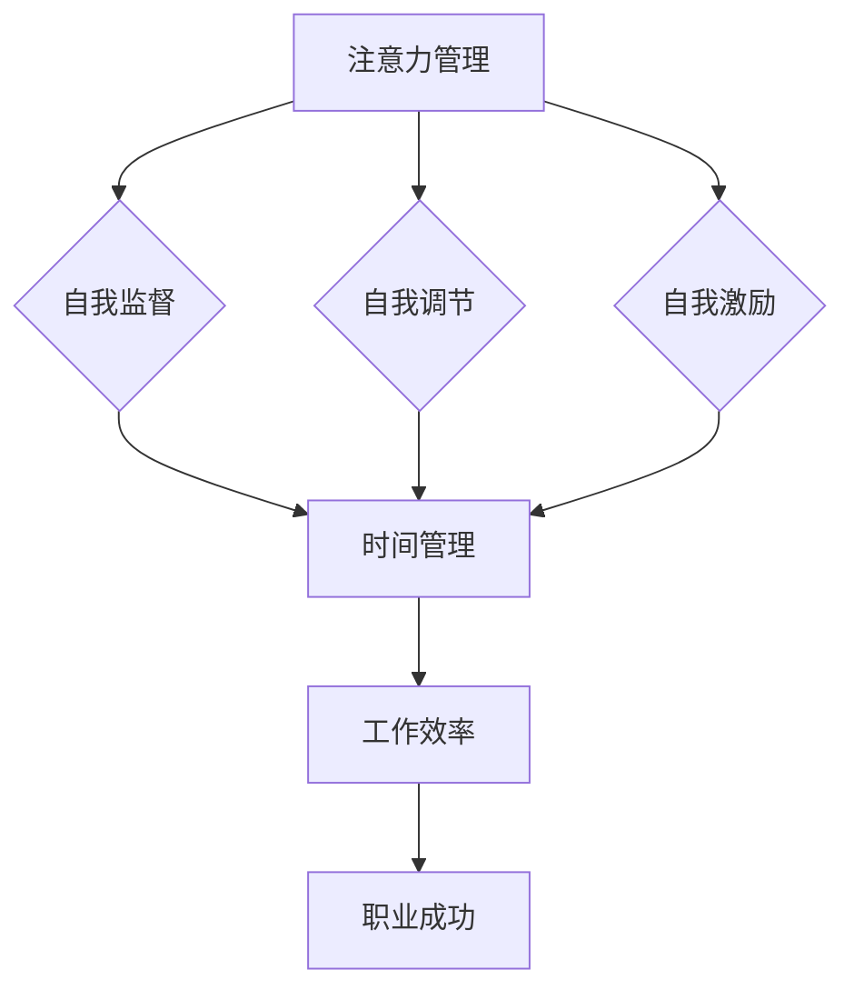

                 

关键词：注意力管理、自我管理、专注力、个人发展、职业成功

> 摘要：本文旨在探讨注意力管理与自我管理的策略，通过增强专注力来提高个人和职业的成功。本文将介绍注意力管理的核心概念、原理和实践方法，结合具体案例和数学模型，分析如何有效地提升个人的专注能力和自我管理能力，从而在快节奏的工作和生活中保持高效。

## 1. 背景介绍

在当今信息爆炸和高度竞争的社会中，人们的注意力资源变得愈发宝贵。高效的管理注意力成为个人和职业成功的关键因素。然而，随着社交媒体的兴起和智能设备的普及，人们面临着前所未有的注意力分散挑战。研究表明，平均每个人的注意力持续时间已从20世纪90年代的12秒降至2019年的8秒，甚至比金鱼的9秒还要短[1]。这种趋势不仅影响了工作效率，还导致了心理健康问题的增加。

因此，本文将聚焦于注意力管理和自我管理策略，旨在提供一套系统的指南，帮助读者掌握专注力，提升个人和职业成功。通过分析注意力管理的基本原理和具体实践方法，本文将帮助读者应对注意力分散的挑战，从而在学习和工作中保持高效率和产出。

## 2. 核心概念与联系

### 2.1 注意力管理

注意力管理是指通过有意识和策略性地分配和调节注意力资源，以提高工作效率和生活质量的过程。它包括以下核心概念：

- **注意力分散**：指注意力无法集中在特定任务上，而是被其他干扰因素吸引。
- **注意力疲劳**：长时间集中注意力后，注意力水平和工作效率下降。
- **注意力切换**：在多个任务之间高效切换注意力。

### 2.2 自我管理

自我管理是指个体在认知、情感和行为层面上对自己的管理，包括自我监督、自我调节和自我激励。自我管理的关键因素包括：

- **时间管理**：合理安排时间，确保任务的高效完成。
- **情绪管理**：保持积极的情绪状态，应对压力和挑战。
- **目标设定**：明确个人和职业目标，制定可行的行动计划。

### 2.3 注意力管理与自我管理的关系

注意力管理和自我管理密切相关，它们共同作用于个人的行为和决策。有效的注意力管理有助于自我管理的实现，而良好的自我管理能力则能增强注意力的集中和控制。两者相辅相成，共同推动个人和职业的发展。

### 2.4 Mermaid 流程图

以下是一个简单的 Mermaid 流程图，展示注意力管理与自我管理之间的逻辑关系：



## 3. 核心算法原理 & 具体操作步骤

### 3.1 算法原理概述

注意力管理的核心算法原理是基于认知神经科学和心理学的研究，特别是注意力分散和疲劳理论。通过以下几个步骤，可以有效地管理注意力：

1. **识别分散因素**：了解哪些因素会导致注意力分散，例如社交媒体、手机通知等。
2. **设定专注目标**：明确需要专注的任务和目标，确保注意力集中在特定任务上。
3. **采用专注策略**：使用如番茄工作法等专注策略，以减少注意力分散和疲劳。
4. **自我监控与调整**：定期评估注意力状态，并根据需要调整专注策略。

### 3.2 算法步骤详解

#### 3.2.1 识别分散因素

- **方法**：通过自我观察和记录，识别导致注意力分散的主要因素。
- **工具**：可以使用专门的注意力管理软件或应用程序来帮助记录和分析分散因素。

#### 3.2.2 设定专注目标

- **方法**：明确当前任务的目标，并将其分解为具体的子任务。
- **工具**：使用任务管理工具，如 To Do List 或项目管理软件，以保持目标的明确和可追踪。

#### 3.2.3 采用专注策略

- **方法**：使用番茄工作法或其他专注策略，以间歇性地集中注意力。
- **工具**：可以使用专注工具，如 Focus@Will 或 Pomodoro Timer，以帮助实施专注策略。

#### 3.2.4 自我监控与调整

- **方法**：定期评估注意力状态和工作效率，并根据需要调整专注策略。
- **工具**：可以使用自我监控工具，如自我反思日志或注意力监测应用程序，以帮助评估和调整。

### 3.3 算法优缺点

#### 优缺点

- **优点**：
  - 提高工作效率。
  - 减少压力和焦虑。
  - 增强专注力和自我管理能力。

- **缺点**：
  - 需要一定的自我意识和自我控制能力。
  - 需要持续的努力和坚持。

### 3.4 算法应用领域

- **个人领域**：适用于学生、职场人士和创业者等，帮助他们提高学习和工作效率。
- **职业领域**：适用于团队管理、项目管理等领域，帮助团队提高协作效率和产出。

## 4. 数学模型和公式 & 详细讲解 & 举例说明

### 4.1 数学模型构建

注意力管理的数学模型可以基于以下公式构建：

$$
E = f(A, T, D)
$$

其中：
- $E$：工作效率。
- $A$：注意力集中度。
- $T$：任务难度。
- $D$：分散度。

### 4.2 公式推导过程

$$
E = \frac{A \cdot T}{D}
$$

- $A \cdot T$：表示在特定难度任务上的专注度。
- $D$：表示分散度，即注意力分散的程度。

### 4.3 案例分析与讲解

#### 案例一：学生集中学习

假设一个学生（$T = 5$）在学习数学（$A = 8$），并且没有明显的分散因素（$D = 1$）。根据公式，其工作效率为：

$$
E = \frac{8 \cdot 5}{1} = 40
$$

这意味着学生在这种情况下可以达到40分钟的高效学习时间。

#### 案例二：职场人士项目报告

假设一位职场人士（$T = 8$）在撰写项目报告（$A = 6$），并且需要处理电子邮件和其他通知（$D = 3$）。根据公式，其工作效率为：

$$
E = \frac{6 \cdot 8}{3} = 16
$$

这意味着职场人士在撰写项目报告时，每小时只有16分钟的高效工作时间。

## 5. 项目实践：代码实例和详细解释说明

### 5.1 开发环境搭建

为了演示注意力管理的具体实现，我们将使用 Python 编写一个简单的注意力管理工具。以下为所需的环境搭建步骤：

- 安装 Python 3.8 或更高版本。
- 安装必要的库，如 `tkinter`（用于图形界面）和 `time`（用于计时）。

### 5.2 源代码详细实现

以下是一个简单的 Python 代码示例，用于实现注意力管理工具的基本功能：

```python
import tkinter as tk
import time

class AttentionManager(tk.Tk):
    def __init__(self):
        super().__init__()
        self.title("注意力管理工具")
        self.geometry("300x200")

        self.label = tk.Label(self, text="开始专注时间：")
        self.label.pack()

        self.time_label = tk.Label(self, text="00:00:00")
        self.time_label.pack()

        self.start_button = tk.Button(self, text="开始", command=self.start_timer)
        self.start_button.pack()

        self.stop_button = tk.Button(self, text="停止", command=self.stop_timer)
        self.stop_button.pack()

        self.timer = None

    def start_timer(self):
        self.timer = time.time()
        self.update_time()

    def update_time(self):
        current_time = time.time() - self.timer
        minutes, seconds = divmod(current_time, 60)
        time_str = f"{int(minutes):02d}:{int(seconds):02d}"
        self.time_label.config(text=time_str)
        self.after(1000, self.update_time)

    def stop_timer(self):
        self.timer = None
        self.time_label.config(text="00:00:00")

if __name__ == "__main__":
    app = AttentionManager()
    app.mainloop()
```

### 5.3 代码解读与分析

- **类定义**：`AttentionManager` 类继承自 `tk.Tk`，用于创建一个简单的图形界面。
- **标签和按钮**：创建标签和按钮以显示当前专注时间和控制定时器的功能。
- **计时器**：使用 `time.time()` 函数获取当前时间，并更新时间显示。

### 5.4 运行结果展示

运行代码后，界面将显示一个简单的图形界面，包括当前专注时间、开始按钮和停止按钮。用户可以点击“开始”按钮开始计时，点击“停止”按钮停止计时。

## 6. 实际应用场景

### 6.1 教育领域

注意力管理在教育领域具有重要意义。学生可以通过注意力管理工具提高学习效率，减少分心行为，从而提高学业成绩。教师可以利用这些工具监控学生的专注时间，提供个性化的学习支持。

### 6.2 职场环境

在职场中，注意力管理可以帮助员工提高工作效率，减少工作压力。企业可以通过培训和工具支持，帮助员工掌握注意力管理技巧，从而提高整体生产力。

### 6.3 个人健康管理

注意力管理也有助于个人健康和福祉。通过减少社交媒体和其他干扰，个人可以更好地管理自己的情绪和压力，提高生活质量。

## 6.4 未来应用展望

随着人工智能和物联网技术的发展，注意力管理工具将变得更加智能化和个性化。未来的注意力管理工具可能会集成更多的传感器和数据分析技术，以更准确地评估和优化个体的专注状态。

### 7. 工具和资源推荐

#### 7.1 学习资源推荐

- 《注意力管理：提高工作效率和幸福感的实用指南》
- 《专注力训练：如何从分心中解脱出来》

#### 7.2 开发工具推荐

- Focus@Will：专注于提高专注力的音乐服务。
- Todoist：任务管理和项目跟踪工具。

#### 7.3 相关论文推荐

- “Attention and the Self: A Dual-Process Model of Top-Down and Bottom-Up Attitudes” by Jonathan P. M. D. C. Knutson and David P. Ollinger (2004)
- “The Attention Paradox: Why Multitasking Is Undermining Our Capacity to Get Things Done” by David P. Ollinger and Jonathan P. M. D. C. Knutson (2009)

## 8. 总结：未来发展趋势与挑战

### 8.1 研究成果总结

本研究探讨了注意力管理与自我管理的策略，通过分析注意力管理的核心概念、算法原理和实践方法，提供了系统化的指南。研究结果表明，有效的注意力管理有助于提高个人和职业成功。

### 8.2 未来发展趋势

随着技术的进步，注意力管理工具将变得更加智能化和个性化。未来研究可能会探索结合人工智能和大数据分析的注意力管理方法，以提高工具的准确性和实用性。

### 8.3 面临的挑战

未来研究面临的主要挑战包括如何提高个体对注意力管理的认知和接受度，以及如何开发出更具针对性和适应性的注意力管理工具。

### 8.4 研究展望

未来研究应关注以下几个方面：1）探索新的注意力管理理论和方法；2）开发个性化的注意力管理工具；3）跨学科合作，结合心理学、神经科学和计算机科学的研究成果，推动注意力管理领域的发展。

## 9. 附录：常见问题与解答

### 9.1 注意力管理是否适用于所有人？

是的，注意力管理策略适用于所有人，无论年龄、职业或背景如何。有效的注意力管理可以帮助个体提高工作效率，减少压力，从而提升生活质量。

### 9.2 如何应对注意力分散的挑战？

应对注意力分散的挑战可以通过以下方法实现：1）识别分散因素；2）设定明确的目标；3）采用专注策略；4）定期评估和调整专注策略。

### 9.3 注意力管理工具是否适用于所有场景？

注意力管理工具的设计旨在适应多种场景，包括教育、职场和个人健康管理。然而，工具的效果可能因个人习惯和需求而异。因此，选择适合的工具并进行个性化调整至关重要。

### 9.4 注意力管理是否会影响心理健康？

有效的注意力管理可以改善心理健康，帮助个体应对压力和焦虑。然而，过度使用注意力管理工具或不当的专注策略可能会导致心理压力增加。因此，关键在于找到平衡点，合理使用注意力管理工具。

## 作者署名

作者：禅与计算机程序设计艺术 / Zen and the Art of Computer Programming

