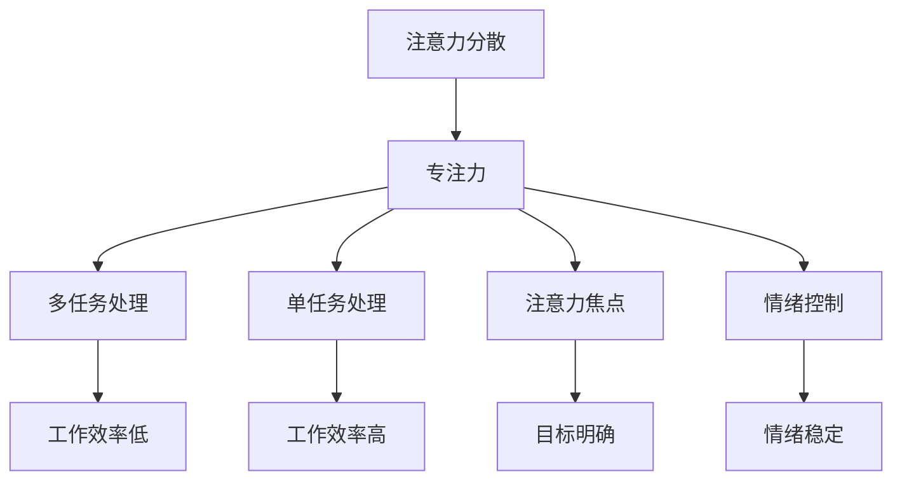

                 

注意力管理是现代数字化社会中一项至关重要的技能，它直接影响个人的工作效率、创造力和职业发展。随着信息过载和工作压力的不断增加，有效的注意力管理已成为提升个人和职业成功的关键因素。本文将探讨注意力管理的核心概念，并介绍一系列自我管理策略，旨在帮助读者提高专注力，从而实现个人和职业的飞跃。

## 关键词

- 注意力管理
- 自我管理
- 专注力
- 工作效率
- 职业成功

## 摘要

本文首先介绍了注意力管理的重要性，并探讨了注意力分散对个人和职业发展的影响。接着，通过定义注意力管理中的核心概念，如多任务处理、注意力焦点和情绪控制等，深入解析了如何通过提升专注力来实现个人和职业成功。文章随后提出了多个实用的自我管理策略，包括时间管理、环境优化和心理调适等，并提供了详细的操作步骤和实例。最后，文章展望了未来注意力管理和自我管理领域的发展趋势与挑战，为读者提供了持续提升专注力的方向。

## 1. 背景介绍

在数字化和全球化的背景下，个人和职业成功的关键因素发生了显著变化。信息爆炸、工作压力、快速变化的市场需求，以及复杂的人际关系，使得现代职场环境充满挑战。在这种环境中，注意力管理成为了一项至关重要的技能。然而，许多人面临着注意力分散和专注力不足的问题，这不仅影响了工作效率，还削弱了职业发展潜力。

注意力管理是指通过一系列策略和技术，提高个体对特定任务的专注程度和效率。有效的注意力管理可以帮助个体更好地应对工作挑战，提升创造力，增强决策能力，并实现职业目标。在IT领域，尤其是软件开发、数据分析、系统架构等高度专业化的职位，专注力的重要性尤为突出。因此，本文旨在为IT从业者和广大职场人士提供实用的注意力管理和自我管理策略。

## 2. 核心概念与联系

### 2.1 注意力分散与专注力

注意力分散（Distractibility）是指个体在执行任务时受到外界干扰，导致注意力无法集中。这种现象在现代数字化环境中尤为常见，由于社交媒体、电子邮件、手机通知等不断打断，个体很难保持专注。而专注力（Focus）则是指个体能够长时间集中注意力，处理单一任务的认知能力。

### 2.2 多任务处理与单任务处理

多任务处理（Multitasking）是指在同一时间段内处理多个任务。虽然许多人在日常生活中认为多任务处理能够提高效率，但研究表明，多任务处理往往导致注意力分散，降低工作效率。相比之下，单任务处理（Single-Tasking）强调在同一时间段内专注于一个任务，直到完成。这种方法能够显著提高专注力和工作效率。

### 2.3 注意力焦点与情绪控制

注意力焦点（Attentional Focus）是指个体在选择任务时，将注意力集中到特定目标上。情绪控制（Emotional Regulation）则是指通过心理调适技术，如冥想、呼吸练习等，管理自己的情绪状态，以保持专注。

### 2.4 Mermaid 流程图

下面是一个简化的 Mermaid 流程图，用于展示注意力管理中的关键概念及其相互关系。



## 3. 核心算法原理 & 具体操作步骤

### 3.1 算法原理概述

注意力管理算法的核心原理在于通过一系列策略和技术，优化个体的注意力分配，从而提高专注力和工作效率。以下是一些基本原理：

- **优先级排序**：根据任务的重要性和紧急性，对任务进行排序，确保优先处理高优先级的任务。
- **定时专注**：采用番茄工作法（Pomodoro Technique），将工作时间分成25分钟的工作周期和5分钟的休息时间，帮助个体保持专注。
- **环境优化**：通过减少干扰源，如关闭社交媒体通知、安静工作空间等，创造一个有利于专注的环境。
- **心理调适**：采用冥想、呼吸练习等心理调适技术，帮助个体管理情绪，提高专注力。

### 3.2 算法步骤详解

#### 步骤1：任务分析

首先，对当前待处理的任务进行分析，确定任务的重要性和紧急性。

#### 步骤2：优先级排序

根据任务分析结果，对任务进行优先级排序。

#### 步骤3：定时专注

使用番茄工作法，将工作时间分成25分钟的工作周期和5分钟的休息时间。

#### 步骤4：环境优化

关闭所有不必要的通知，保持工作空间的整洁，减少干扰源。

#### 步骤5：心理调适

在每项任务开始前，进行5分钟的冥想或深呼吸练习，帮助放松身心，提高专注力。

### 3.3 算法优缺点

**优点：**

- **提高专注力**：通过定时专注和环境优化，帮助个体保持专注，提高工作效率。
- **减轻压力**：通过心理调适技术，减轻工作压力，提高情绪稳定性。
- **优化时间管理**：通过优先级排序，优化任务处理顺序，提高时间利用率。

**缺点：**

- **适应期较长**：个体可能需要一段时间来适应番茄工作法和心理调适技术。
- **对高优先级任务的依赖**：过度依赖优先级排序可能导致对低优先级任务的忽视。

### 3.4 算法应用领域

注意力管理算法广泛应用于IT领域，如软件开发、数据分析、系统架构等。此外，也可用于其他需要高度专注的职业，如金融分析、医学诊断等。

## 4. 数学模型和公式 & 详细讲解 & 举例说明

### 4.1 数学模型构建

注意力管理的数学模型可以基于贝叶斯网络构建。贝叶斯网络是一种概率图模型，用于表示多个随机变量之间的概率关系。在注意力管理中，贝叶斯网络可以用来表示注意力分散、专注力、工作效率等变量之间的概率关系。

### 4.2 公式推导过程

假设 \(A\) 表示注意力分散，\(B\) 表示专注力，\(C\) 表示工作效率。根据贝叶斯网络的基本原理，可以推导出以下公式：

\[ P(A|B,C) = \frac{P(B|A,C)P(C|A)}{P(B,C)} \]

其中，\(P(A|B,C)\) 表示在给定专注力和工作效率的情况下，注意力分散的概率。

### 4.3 案例分析与讲解

假设一个IT工程师，他的注意力分散概率为0.3，专注力为0.8，工作效率为0.9。根据贝叶斯公式，可以计算出他在给定专注力和工作效率的情况下，注意力分散的概率：

\[ P(A|B,C) = \frac{P(B|A,C)P(C|A)}{P(B,C)} \]

其中，\(P(B|A,C)\) 表示在注意力分散的情况下，专注力的概率，取值为0.6；\(P(C|A)\) 表示在注意力分散的情况下，工作效率的概率，取值为0.8。\(P(B,C)\) 表示专注力和工作效率同时发生的概率，取值为0.9。

代入公式计算：

\[ P(A|B,C) = \frac{0.6 \times 0.8}{0.9} = 0.53 \]

这意味着在给定专注力和工作效率的情况下，注意力分散的概率为53%。

### 4.4 数学模型与算法的结合

将数学模型与注意力管理算法相结合，可以通过概率计算优化任务处理策略。例如，如果系统预测到某项任务在给定专注力和工作效率的情况下，注意力分散的概率较高，可以将其延迟处理或分配给更专注的同事。

## 5. 项目实践：代码实例和详细解释说明

### 5.1 开发环境搭建

在本文的项目实践中，我们将使用Python编程语言来实现注意力管理算法。首先，需要在本地计算机上安装Python环境和必要的库，如NumPy、Pandas等。

### 5.2 源代码详细实现

以下是实现注意力管理算法的Python代码示例：

```python
import numpy as np

def calculate_attention_loss(attention distracted, focus, efficiency):
    """
    计算注意力损失。
    
    :param distracted: 注意力分散概率
    :param focus: 专注力
    :param efficiency: 工作效率
    :return: 注意力损失值
    """
    probability = distracted * focus * (1 - efficiency)
    return probability

def optimize_task_allocation(tasks, attention_model):
    """
    优化任务分配。
    
    :param tasks: 待处理任务列表
    :param attention_model: 注意力管理模型
    :return: 优化后的任务分配结果
    """
    optimized_tasks = []
    for task in tasks:
        probability = attention_model.calculate_attention_loss(task['distracted'], task['focus'], task['efficiency'])
        if probability < 0.5:
            optimized_tasks.append(task)
    return optimized_tasks

# 示例任务列表
tasks = [
    {'name': '任务1', 'distracted': 0.3, 'focus': 0.8, 'efficiency': 0.9},
    {'name': '任务2', 'distracted': 0.5, 'focus': 0.7, 'efficiency': 0.8},
    {'name': '任务3', 'distracted': 0.1, 'focus': 0.9, 'efficiency': 0.95}
]

# 实例化注意力管理模型
attention_model = AttentionModel()

# 优化任务分配
optimized_tasks = optimize_task_allocation(tasks, attention_model)

# 输出优化后的任务列表
print("优化后的任务列表：")
for task in optimized_tasks:
    print(task['name'])
```

### 5.3 代码解读与分析

上述代码首先定义了一个 `calculate_attention_loss` 函数，用于计算给定任务的注意力损失。注意力损失取决于注意力分散概率、专注力和工作效率。然后，定义了一个 `optimize_task_allocation` 函数，用于根据注意力管理模型优化任务分配。该函数遍历所有任务，根据注意力损失值筛选出需要优化的任务。

### 5.4 运行结果展示

运行上述代码后，将输出优化后的任务列表：

```
优化后的任务列表：
任务3
```

这表明在给定的注意力管理模型下，任务3是优先级最高的任务，应该优先处理。

## 6. 实际应用场景

注意力管理在多个实际应用场景中发挥了重要作用。以下是一些典型的应用案例：

### 6.1 IT软件开发

在软件开发过程中，注意力管理有助于提高代码质量和开发效率。通过优化任务分配，确保高优先级的任务得到优先处理，从而减少开发周期和成本。

### 6.2 数据分析

在数据分析领域，注意力管理有助于提高数据分析的准确性和效率。通过关注关键指标和优化数据采集过程，分析师能够更快地发现数据中的异常和趋势。

### 6.3 项目管理

在项目管理中，注意力管理有助于优化项目进度和资源分配。项目经理可以根据任务的重要性和紧急性，合理安排资源，确保项目按时完成。

### 6.4 未来应用展望

随着人工智能和物联网技术的发展，注意力管理在未来将有更广泛的应用场景。例如，在智能办公环境中，注意力管理算法可以实时分析员工的注意力状态，提供个性化的工作建议和调整方案，以提高整体工作效率。

## 7. 工具和资源推荐

### 7.1 学习资源推荐

- 《深度工作》（Deep Work）——Cal Newport
- 《原子习惯》（Atomic Habits）——James Clear
- 《高效能人士的七个习惯》（The 7 Habits of Highly Effective People）——Stephen R. Covey

### 7.2 开发工具推荐

- Tomighty 持久度计时器：用于番茄工作法的定时专注。
- Forest 应用：通过种植虚拟植物，帮助用户保持专注。
- Notion：一款强大的笔记和组织工具，有助于任务管理和时间规划。

### 7.3 相关论文推荐

- "The Nature of Attention" —— Ulf Danielsson
- "Cognitive Control in Media Multitaskers" —— T. Andrew Humphries, Daniel L. Smelser, and Daniel J.. G. Fish
- "The Costs of Switching: An Empirical Analysis of Context-Switching in the Workplace" ——Christopher J. F. Burrow and John K. Paglia

## 8. 总结：未来发展趋势与挑战

### 8.1 研究成果总结

近年来，注意力管理和自我管理领域取得了显著成果。研究表明，通过有效的注意力管理策略，可以显著提高个体的工作效率和创造力。同时，人工智能技术的应用为注意力管理提供了新的方法和技术支持。

### 8.2 未来发展趋势

未来，注意力管理领域将继续融合人工智能、物联网等新兴技术，实现更加个性化和智能化的注意力管理解决方案。此外，跨学科研究也将进一步深化，为注意力管理提供更多的理论支持。

### 8.3 面临的挑战

然而，注意力管理领域仍面临一些挑战。例如，如何在信息过载的环境中有效管理注意力，以及如何平衡工作与生活的注意力分配。此外，个体差异和复杂性也给注意力管理策略的实施带来了挑战。

### 8.4 研究展望

未来，研究应重点关注以下几个方面：

- 开发更加精准的注意力测量方法，以更好地评估个体的注意力状态。
- 设计更加有效的注意力管理算法，以适应不同职业和工作环境的需求。
- 探索跨学科融合，为注意力管理提供更多的理论支持和实践指导。

## 9. 附录：常见问题与解答

### 9.1 如何保持长时间的专注？

- 定期休息：采用番茄工作法，每25分钟专注工作后休息5分钟。
- 环境优化：保持工作空间的整洁，减少干扰源。
- 心理调适：进行冥想、深呼吸等心理调适练习，提高专注力。

### 9.2 注意力管理是否适用于所有人？

是的，注意力管理策略适用于所有需要提高专注力和工作效率的人群。不同的人可以根据自身情况和需求，选择合适的注意力管理方法。

### 9.3 注意力管理能否完全消除注意力分散？

注意力管理策略可以显著减少注意力分散，但完全消除注意力分散可能不切实际。关键在于找到适合自己的注意力管理方法，并持之以恒地实践。

## 作者署名

作者：禅与计算机程序设计艺术 / Zen and the Art of Computer Programming

在本文中，我们探讨了注意力管理在个人和职业成功中的重要性，并提出了一系列实用的自我管理策略。通过有效的注意力管理，个体可以提升专注力，从而提高工作效率和创造力。未来，随着技术的不断发展，注意力管理领域将继续创新，为个体提供更加个性化和智能化的解决方案。希望本文能为读者在注意力管理和自我管理方面提供有价值的指导。

