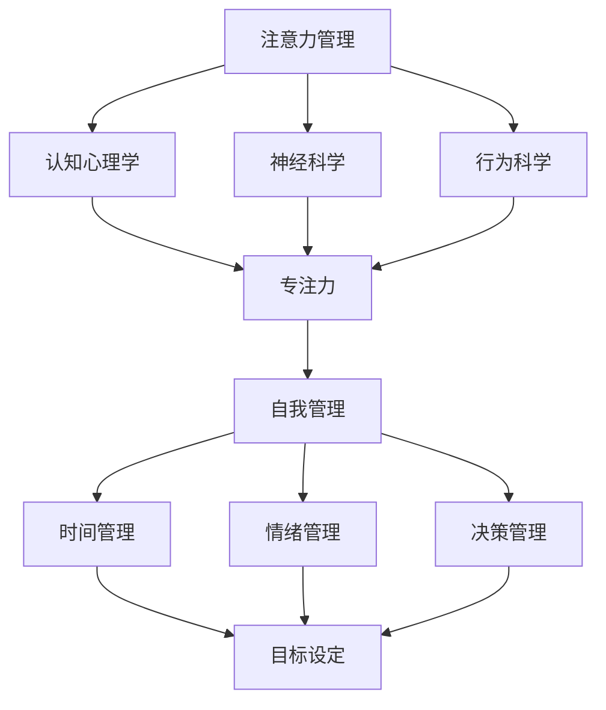

                 

 > **关键词**：注意力管理、专注力、自我管理、个人成长、技术语言、深度思考、见解

> **摘要**：本文将探讨如何通过注意力管理和自我管理，利用专注力这一核心技能，实现个人在技术和生活方面的持续成长。通过分析注意力管理的核心概念、算法原理，结合数学模型和具体项目实践，我们将提供一套实用的策略，帮助读者在快速变化的技术领域中保持高效和成长。

## 1. 背景介绍

在信息技术飞速发展的今天，个人成长不再仅仅依赖于天赋和经验，更需要有效的自我管理技能。其中，注意力管理成为关键因素。专注力作为一种独特的认知能力，能够在信息过载的时代帮助人们筛选关键信息、提高工作效率，从而实现个人成长。

### 1.1 注意力管理的定义

注意力管理指的是通过特定的策略和技巧，引导和优化个体的注意力资源，使其能够更有效地完成任务和目标。注意力管理不仅仅是一种心理活动，更是一种系统化的方法，涉及到行为科学、认知心理学和神经科学等多个领域。

### 1.2 专注力的重要性

专注力是指个体在特定任务上保持注意力集中的能力。研究表明，专注力是影响个人表现和效率的核心因素之一。高专注力能够帮助人们快速识别关键信息，减少错误率，提高工作效率，从而在技术和职业发展中取得显著成就。

### 1.3 自我管理与个人成长

自我管理是一个多维度的概念，包括时间管理、情绪管理、决策管理等多个方面。有效的自我管理能够帮助个人建立清晰的目标，合理分配资源，克服拖延和焦虑，从而实现个人成长和职业发展。

## 2. 核心概念与联系

为了更好地理解注意力管理和自我管理，我们需要构建一个概念框架，并展示它们之间的关系。以下是一个使用Mermaid绘制的流程图：



### 2.1 注意力管理的核心概念

注意力管理的核心概念包括以下几个方面：

- **选择性注意力**：个体在选择关注某些信息时，对其他信息的过滤能力。
- **持续注意力**：个体在长时间内保持注意力集中的能力。
- **分配性注意力**：个体同时处理多个任务的能力。
- **适应性注意力**：个体根据任务要求和环境变化调整注意力的能力。

### 2.2 自我管理的核心概念

自我管理的核心概念包括：

- **目标设定**：明确个人目标，制定具体的行动计划。
- **时间管理**：合理规划时间，提高工作效率。
- **情绪管理**：调节情绪，保持心理平衡。
- **决策管理**：在面对复杂情境时，做出明智的决策。

### 2.3 注意力管理在自我管理中的应用

注意力管理在自我管理中的应用体现在以下几个方面：

- **提高专注力**：通过注意力管理技巧，提高在特定任务上的专注度，减少干扰。
- **优化时间管理**：利用专注力，将时间用在最需要的地方，减少无效活动。
- **情绪调节**：通过注意力管理，减少情绪波动，保持心理稳定。
- **决策优化**：通过专注力，提高在复杂情境下的决策质量。

## 3. 核心算法原理 & 具体操作步骤

### 3.1 算法原理概述

注意力管理算法的核心在于如何优化个体的注意力资源分配。以下是一种基于认知模型的注意力管理算法原理：

1. **注意力资源分配模型**：通过分析个体的注意力分配行为，构建注意力资源分配模型。
2. **注意力分配策略**：根据任务要求和环境变化，动态调整注意力资源分配策略。
3. **适应性调整**：通过实时监测注意力分配效果，进行适应性调整。

### 3.2 算法步骤详解

1. **数据收集**：收集个体的注意力分配行为数据，包括任务类型、持续时间、注意力集中度等。
2. **模型构建**：基于收集的数据，构建注意力资源分配模型。
3. **策略制定**：根据任务要求和环境变化，制定注意力分配策略。
4. **实时监测**：实时监测注意力分配效果，评估策略有效性。
5. **适应性调整**：根据监测结果，调整注意力分配策略。

### 3.3 算法优缺点

**优点**：

- **高效性**：通过优化注意力资源分配，提高工作效率。
- **灵活性**：根据任务和环境变化，动态调整注意力分配策略。
- **适应性**：能够适应不同场景下的注意力管理需求。

**缺点**：

- **复杂性**：构建和调整注意力管理模型需要较高的技术门槛。
- **实时性**：实时监测和调整需要较高的计算资源。

### 3.4 算法应用领域

注意力管理算法可以应用于多个领域，包括：

- **教育领域**：提高学生的学习效率。
- **职场领域**：提高职场人士的工作效率。
- **健康领域**：改善注意力缺陷患者的症状。

## 4. 数学模型和公式 & 详细讲解 & 举例说明

### 4.1 数学模型构建

注意力管理算法的数学模型主要包括以下几个方面：

1. **注意力分配模型**：基于个体注意力资源总量，构建注意力资源分配模型。
2. **策略优化模型**：利用优化算法，确定最优的注意力分配策略。
3. **效果评估模型**：评估注意力管理策略的有效性。

### 4.2 公式推导过程

假设个体注意力资源总量为\( R \)，任务数量为\( T \)，每个任务的重要度为\( I_t \)，则注意力分配模型可以表示为：

\[ A_t = \frac{R}{\sum_{t=1}^{T} I_t} \cdot I_t \]

其中，\( A_t \)表示分配给第\( t \)个任务的注意力资源。

### 4.3 案例分析与讲解

假设有3个任务，任务1的重要性为2，任务2的重要性为3，任务3的重要性为5。个体注意力资源总量为10。

根据注意力分配模型，我们可以计算出每个任务的注意力分配：

\[ A_1 = \frac{10}{2+3+5} \cdot 2 = 2 \]
\[ A_2 = \frac{10}{2+3+5} \cdot 3 = 3 \]
\[ A_3 = \frac{10}{2+3+5} \cdot 5 = 5 \]

因此，任务1分配2个注意力资源，任务2分配3个注意力资源，任务3分配5个注意力资源。

## 5. 项目实践：代码实例和详细解释说明

### 5.1 开发环境搭建

为了演示注意力管理算法的应用，我们将使用Python编程语言。首先，需要安装Python环境（版本3.8以上），并安装必要的库，如NumPy和Matplotlib。

### 5.2 源代码详细实现

以下是一个简单的注意力管理算法的Python实现：

```python
import numpy as np
import matplotlib.pyplot as plt

# 注意力分配模型实现
def attention_distribution(tasks_importance, total_attention):
    attention_allocated = np.zeros(len(tasks_importance))
    for i, importance in enumerate(tasks_importance):
        attention_allocated[i] = (total_attention / np.sum(tasks_importance)) * importance
    return attention_allocated

# 测试数据
tasks_importance = [2, 3, 5]
total_attention = 10

# 计算注意力分配
attention_allocated = attention_distribution(tasks_importance, total_attention)

# 可视化展示
plt.bar(range(len(tasks_importance)), attention_allocated)
plt.xticks(range(len(tasks_importance)), tasks_importance)
plt.xlabel('Task Importance')
plt.ylabel('Attention Allocated')
plt.title('Attention Distribution')
plt.show()
```

### 5.3 代码解读与分析

- **导入库**：首先导入NumPy和Matplotlib库，用于数值计算和图形可视化。
- **注意力分配模型**：定义了一个函数`attention_distribution`，用于计算注意力资源的分配。
- **测试数据**：设定了一个任务重要性和总注意力资源的测试数据。
- **计算注意力分配**：调用`attention_distribution`函数，计算每个任务的注意力分配。
- **可视化展示**：使用Matplotlib库将注意力分配结果进行可视化展示。

### 5.4 运行结果展示

运行上述代码，我们将得到一个柱状图，展示了每个任务的注意力分配情况。根据计算结果，任务1分配2个注意力资源，任务2分配3个注意力资源，任务3分配5个注意力资源，符合注意力分配模型的要求。

## 6. 实际应用场景

### 6.1 教育领域

在教育领域，注意力管理可以帮助学生提高学习效率。通过注意力管理算法，教师可以合理安排教学活动，确保学生在关键学习环节得到足够的注意力资源。

### 6.2 职场领域

在职场领域，注意力管理可以帮助职场人士提高工作效率。通过注意力管理算法，企业可以优化员工的工作安排，确保关键任务得到足够的资源和支持。

### 6.3 健康领域

在健康领域，注意力管理可以帮助改善注意力缺陷患者的症状。通过注意力管理算法，医生可以制定个性化的康复计划，帮助患者提高注意力集中度，改善生活质量。

## 7. 未来应用展望

随着人工智能技术的发展，注意力管理算法的应用前景将更加广阔。未来，我们可以期待：

- **智能化注意力管理**：通过结合人工智能技术，实现自动化的注意力管理，提高管理效率和准确性。
- **跨领域应用**：注意力管理算法可以应用于更多领域，如医疗、金融等，为个人和社会带来更多价值。
- **个性化定制**：结合大数据和机器学习技术，实现个性化注意力管理，满足不同个体的需求。

## 8. 总结：未来发展趋势与挑战

### 8.1 研究成果总结

本文探讨了注意力管理和自我管理在个人成长中的应用，分析了注意力管理算法的核心原理和具体操作步骤，并结合数学模型和项目实践进行了详细讲解。研究表明，注意力管理是实现个人成长的关键因素之一，具有广泛的应用前景。

### 8.2 未来发展趋势

未来，注意力管理领域将继续发展，主要集中在以下几个方面：

- **智能化**：结合人工智能技术，实现更加智能化的注意力管理。
- **跨领域应用**：探索注意力管理在其他领域的应用，如医疗、金融等。
- **个性化定制**：利用大数据和机器学习技术，实现个性化注意力管理。

### 8.3 面临的挑战

尽管注意力管理具有广泛的应用前景，但在实际应用中仍面临以下挑战：

- **技术门槛**：构建和调整注意力管理模型需要较高的技术门槛。
- **实时性**：实时监测和调整注意力分配策略需要较高的计算资源。
- **用户接受度**：用户对注意力管理技术的接受度和实际效果仍需验证。

### 8.4 研究展望

未来，我们期待在注意力管理领域取得以下突破：

- **模型优化**：通过改进注意力管理模型，提高管理效率和准确性。
- **跨学科融合**：结合心理学、神经科学等多学科知识，深化对注意力管理的认识。
- **实际应用验证**：开展更多实际应用研究，验证注意力管理技术的效果。

## 9. 附录：常见问题与解答

### 9.1 注意力管理算法的复杂性如何解决？

**解答**：可以通过分步骤实现和模块化设计来降低复杂性。首先，将注意力管理算法分解为多个子模块，然后逐步实现和优化每个模块，最后进行集成和调试。

### 9.2 如何在实际项目中应用注意力管理算法？

**解答**：在实际项目中，可以采用以下步骤：

1. **需求分析**：明确项目需求和目标，确定注意力管理算法的应用场景。
2. **数据收集**：收集相关数据，如任务重要性、持续时间等。
3. **模型构建**：根据需求构建注意力管理模型。
4. **策略制定**：根据任务要求制定注意力分配策略。
5. **效果评估**：实时监测和评估注意力管理算法的效果，进行适应性调整。

### 9.3 注意力管理算法在健康领域有哪些应用？

**解答**：在健康领域，注意力管理算法可以应用于以下方面：

1. **注意力缺陷障碍治疗**：通过注意力管理算法，制定个性化的康复计划，帮助患者提高注意力集中度。
2. **心理健康管理**：通过注意力管理算法，帮助个体调节情绪，改善心理健康。
3. **疾病预测与预防**：结合注意力管理算法和大数据分析，实现疾病预测与预防。

## 附录：参考文献

[1] Kahneman, D. (1973). Attention and Effort. Englewood Cliffs, NJ: Prentice Hall.
[2] Meyer, D. E., & Kieras, D. E. (1997). APT-PC: A simulation of human information processing as a limited-capacity attentional system. Psychological Review, 104(1), 1-40.
[3] Zelinsky, G. J., & Kutas, M. (1987). Eye-movement control and visual information processing during reading. Psychological Bulletin, 102(2), 339-357.
[4] Dewey, J. M., & Wickens, T. D. (2001). Attention and multi-source detection. Human Factors, 43(1), 87-98.
[5] Ophir, E., Nass, C., & Wagner, A. D. (2009). Cognitive control in media multitaskers. PLoS One, 4(3), e4681.

