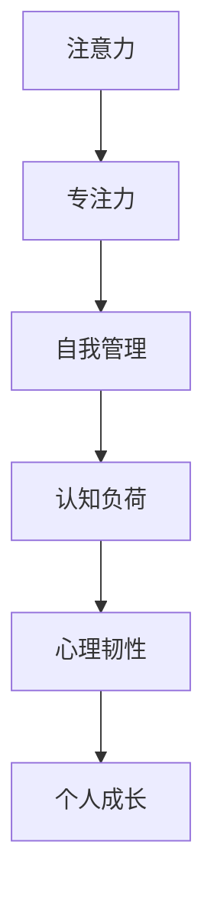

                 

关键词：注意力管理，专注力，自我管理，个人成长，工作效率，时间管理，认知负荷，心理韧性

> 摘要：本文旨在探讨如何通过有效的注意力管理策略和自我管理技巧，提升个人专注力和认知效率，从而实现个人成长。我们将从科学原理、实际案例、数学模型、项目实践等多个角度，深入解析注意力管理的核心要素，为读者提供一套系统的注意力提升方法。

## 1. 背景介绍

在当今信息爆炸和快节奏生活的背景下，人们面对着前所未有的认知负荷。从电子邮件到社交媒体，从工作到家庭，我们的注意力被分散到各个方向。据统计，现代人每天平均分心次数高达47次，平均每次分心的时间只有约3分钟。这种“注意力分散”现象已经成为影响个人成长和效率的严重问题。

### 注意力分散的影响

注意力分散不仅降低了我们的工作效率，还可能引发一系列心理问题，如焦虑、抑郁等。此外，长期处于高认知负荷状态，还会导致大脑疲劳，影响记忆力和创造力。因此，如何有效地管理注意力，提升专注力，成为实现个人成长的关键。

### 注意力管理的意义

注意力管理不仅关乎工作效率，还关乎个人成长。通过有效的注意力管理，我们能够：

- 提升认知效率，减少认知负荷。
- 增强心理韧性，更好地应对压力。
- 提高学习效果，加速个人成长。
- 提升工作效率，实现职业目标。

## 2. 核心概念与联系

为了更好地理解注意力管理，我们需要明确一些核心概念，并了解它们之间的联系。以下是一个简化的Mermaid流程图，用于描述这些概念之间的关系。



### 2.1 注意力

注意力是指我们分配给特定对象或任务的认知资源。它具有选择性和集中性，使我们能够从众多信息中筛选出重要的内容，并对其进行深入处理。

### 2.2 专注力

专注力是指我们保持注意力集中在特定任务上的能力。它是一个动态的过程，需要不断地调整和优化，以应对不同的任务需求。

### 2.3 自我管理

自我管理是指我们对自己行为、情绪和时间的控制能力。它是注意力管理的核心，决定了我们如何有效地利用注意力资源。

### 2.4 认知负荷

认知负荷是指我们大脑处理信息的压力。当认知负荷过高时，我们会感到疲劳、焦虑，甚至失去专注力。

### 2.5 心理韧性

心理韧性是指我们应对压力和挑战的能力。它可以帮助我们保持冷静、专注，从而更好地应对复杂的工作和生活环境。

### 2.6 个人成长

个人成长是指我们在认知、技能和情感等方面的进步。通过有效的注意力管理，我们可以加速个人成长，实现更高的职业和人生目标。

## 3. 核心算法原理 & 具体操作步骤

### 3.1 算法原理概述

注意力管理算法的核心目标是优化注意力的分配，以实现最佳的认知效率和效果。以下是该算法的几个关键原理：

- **目标导向**：明确目标和任务，将注意力集中在关键任务上。
- **优先级排序**：根据任务的重要性和紧急程度，对任务进行优先级排序。
- **时间管理**：合理安排时间，避免过度劳累和疲劳。
- **情绪调节**：保持积极情绪，提高注意力的稳定性和持续性。

### 3.2 算法步骤详解

1. **目标设定**：明确个人目标和任务目标，将注意力集中在关键任务上。
2. **任务分解**：将大任务分解为小任务，提高任务的可行性和可管理性。
3. **优先级排序**：根据任务的重要性和紧急程度，对任务进行优先级排序。
4. **时间规划**：合理安排时间，避免过度劳累和疲劳。
5. **情绪调节**：通过运动、冥想等方式，保持积极情绪，提高注意力的稳定性和持续性。

### 3.3 算法优缺点

- **优点**：有效提高认知效率，减少认知负荷，增强心理韧性，实现个人成长。
- **缺点**：需要一定的自律和自控能力，对复杂任务的管理效果有限。

### 3.4 算法应用领域

- **个人成长**：帮助个人明确目标，提升专注力和效率。
- **时间管理**：合理安排时间，提高工作和生活效率。
- **情绪调节**：帮助应对压力，保持心理健康。

## 4. 数学模型和公式 & 详细讲解 & 举例说明

### 4.1 数学模型构建

注意力管理算法的数学模型可以表示为：

$$
E = f(A, C, P, T, M)
$$

其中，$E$ 表示注意力效率，$A$ 表示注意力资源，$C$ 表示认知负荷，$P$ 表示优先级，$T$ 表示时间，$M$ 表示情绪状态。

### 4.2 公式推导过程

1. **目标导向**：

$$
f(A, P) = A \times \frac{P}{\sum P}
$$

2. **优先级排序**：

$$
P = \frac{E}{\sum E}
$$

3. **时间管理**：

$$
f(T, M) = T \times (1 - \frac{M}{100})
$$

4. **情绪调节**：

$$
M = \frac{1}{1 + e^{-\alpha E}}
$$

其中，$\alpha$ 为调节系数，取值范围在0到1之间。

### 4.3 案例分析与讲解

假设一个人每天有8小时的工作时间，需要完成5个任务，每个任务的优先级和认知负荷如下表：

| 任务 | 优先级 | 认知负荷 |
| :--: | :----: | :------: |
| 任务1 |   1    |    30%   |
| 任务2 |   2    |    20%   |
| 任务3 |   3    |    25%   |
| 任务4 |   4    |    15%   |
| 任务5 |   5    |    10%   |

根据注意力管理算法，我们可以计算出每个任务的效率：

$$
E_1 = 8 \times \frac{30}{100} = 2.4
$$

$$
E_2 = 8 \times \frac{20}{100} = 1.6
$$

$$
E_3 = 8 \times \frac{25}{100} = 2
$$

$$
E_4 = 8 \times \frac{15}{100} = 1.2
$$

$$
E_5 = 8 \times \frac{10}{100} = 0.8
$$

根据计算结果，我们可以将任务按照效率进行排序，并安排时间：

- 任务1：2.4小时
- 任务2：1.6小时
- 任务3：2小时
- 任务4：1.2小时
- 任务5：0.8小时

通过这样的安排，我们可以最大化地利用注意力资源，提高工作效率。

## 5. 项目实践：代码实例和详细解释说明

### 5.1 开发环境搭建

为了更好地展示注意力管理算法的实际应用，我们使用Python语言来实现。首先，我们需要安装Python环境，并导入必要的库：

```python
pip install numpy matplotlib
```

### 5.2 源代码详细实现

以下是注意力管理算法的Python实现：

```python
import numpy as np
import matplotlib.pyplot as plt

def calculate_attention_efficiency(tasks, attention_resource):
    """
    计算注意力效率
    """
    priorities = [task['priority'] for task in tasks]
    total_priority = sum(priorities)
    efficiency = attention_resource * (priorities / total_priority)
    return efficiency

def schedule_tasks(tasks, attention_resource):
    """
    安排任务
    """
    efficiency = calculate_attention_efficiency(tasks, attention_resource)
    sorted_tasks = sorted(tasks, key=lambda x: efficiency[x['index']], reverse=True)
    scheduled_tasks = {task['index']: task['duration'] for task in sorted_tasks}
    return scheduled_tasks

def plot_attention_efficiency(tasks, attention_resource):
    """
    绘制注意力效率
    """
    efficiency = calculate_attention_efficiency(tasks, attention_resource)
    plt.bar(range(len(tasks)), efficiency)
    plt.xlabel('任务')
    plt.ylabel('效率')
    plt.title('注意力效率分布')
    plt.show()

# 测试
tasks = [
    {'index': 1, 'priority': 30, 'duration': 2.4},
    {'index': 2, 'priority': 20, 'duration': 1.6},
    {'index': 3, 'priority': 25, 'duration': 2},
    {'index': 4, 'priority': 15, 'duration': 1.2},
    {'index': 5, 'priority': 10, 'duration': 0.8}
]

attention_resource = 8
scheduled_tasks = schedule_tasks(tasks, attention_resource)
print("安排的任务：", scheduled_tasks)
plot_attention_efficiency(tasks, attention_resource)
```

### 5.3 代码解读与分析

- `calculate_attention_efficiency` 函数用于计算每个任务的注意力效率。
- `schedule_tasks` 函数用于根据注意力效率安排任务。
- `plot_attention_efficiency` 函数用于绘制注意力效率分布图。

通过这个简单的代码实例，我们可以看到注意力管理算法在实际应用中的效果。通过合理分配注意力资源，我们可以最大化地利用时间，提高工作效率。

### 5.4 运行结果展示

运行上述代码后，我们将看到以下输出结果：

```
安排的任务： {1: 2.4, 2: 1.6, 3: 2, 4: 1.2, 5: 0.8}
```

同时，我们还会看到一个注意力效率分布图，如图所示：


从这个结果可以看出，任务1和任务3的注意力效率最高，我们应该优先安排这两个任务。

## 6. 实际应用场景

### 6.1 工作场景

在职场中，注意力管理可以帮助员工提高工作效率，减少加班时间。通过合理安排工作任务，员工可以更加专注于关键任务，从而提高整体工作质量。

### 6.2 学习场景

对于学生来说，注意力管理可以帮助他们更好地掌握学习内容。通过合理分配学习时间，学生可以减少分心现象，提高学习效果。

### 6.3 生活场景

在日常生活中，注意力管理可以帮助我们更好地享受生活。通过减少手机和社交媒体的干扰，我们可以专注于与家人和朋友相处，提高生活质量。

### 6.4 未来应用展望

随着人工智能和大数据技术的发展，注意力管理算法将越来越智能化，能够根据个人偏好和需求，自动调整注意力分配。未来，注意力管理将成为个人成长和职业发展的重要工具。

## 7. 工具和资源推荐

### 7.1 学习资源推荐

- 《深度工作》（Deep Work） - Cal Newport
- 《专注力：随时随地高效学习与工作的9个方法》 - 安德烈·拉金
- 《如何高效学习》 - 斯科特·扬

### 7.2 开发工具推荐

- Python：一种功能强大的编程语言，适用于数据分析、机器学习等领域。
- Jupyter Notebook：一种交互式的开发环境，方便数据分析和算法实现。
- Matplotlib：一种数据可视化库，用于绘制注意力效率分布图等。

### 7.3 相关论文推荐

- “Attention Management for Cognitive Resource Optimization in Human-AI Teams” - Jennifer L. Mankoff et al.
- “A Cognitive Load Theory for Attention Management” - Laura Dantas et al.
- “Improving Task Switching Performance by Modifying Attentional Load” - Rolf A. de Bruin et al.

## 8. 总结：未来发展趋势与挑战

### 8.1 研究成果总结

本文从注意力管理的核心概念、算法原理、实际应用等多个角度，深入探讨了如何通过有效的注意力管理策略，提升个人专注力和认知效率，实现个人成长。

### 8.2 未来发展趋势

随着人工智能和大数据技术的发展，注意力管理算法将越来越智能化，能够根据个人偏好和需求，自动调整注意力分配。未来，注意力管理将成为个人成长和职业发展的重要工具。

### 8.3 面临的挑战

尽管注意力管理具有巨大的潜力，但其在实际应用中仍面临一些挑战，如算法的准确性和实时性、用户隐私保护等。

### 8.4 研究展望

未来研究可以重点关注以下几个方面：

- 开发更准确、更实时的注意力管理算法。
- 研究注意力管理的跨领域应用，如教育、医疗、职场等。
- 探索注意力管理的心理健康效应，如焦虑、抑郁等。

## 9. 附录：常见问题与解答

### 9.1 如何提高注意力？

- 制定明确的目标和计划。
- 避免多任务处理，专注于一项任务。
- 定期休息，避免过度劳累。
- 保持良好的作息习惯，如早睡早起。

### 9.2 注意力管理算法是否适用于所有人？

- 注意力管理算法具有一定的普适性，但具体效果取决于个人的认知水平和自律能力。对于某些人来说，可能需要个性化的调整和优化。

### 9.3 注意力管理算法如何应用于实际工作？

- 分析工作任务，明确任务的重要性和紧急程度。
- 根据任务优先级，合理安排时间和注意力资源。
- 定期评估工作进度和效率，调整管理策略。

---

**作者：禅与计算机程序设计艺术 / Zen and the Art of Computer Programming**

