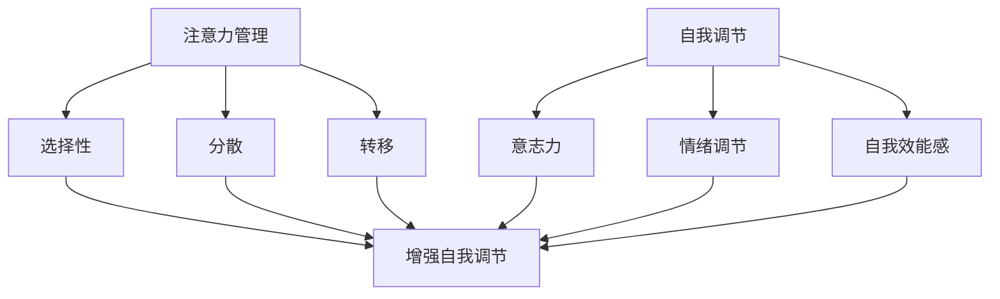

                 

关键词：专注力、自我调节、个人成长、职业成功、心理策略、技术工具

> 摘要：本文深入探讨了注意力管理与自我调节在个人和职业成功中的关键作用。通过分析当前研究趋势、核心概念、算法原理、数学模型，以及具体应用案例，本文旨在为读者提供一套实用的专注力提升策略。同时，文章也展望了未来在这一领域的研究方向与挑战。

## 1. 背景介绍

在信息爆炸的今天，专注力已经成为决定个人和职业成功的重要因素之一。然而，人们的注意力常常被社交媒体、即时通讯、电子邮件等分心因素所消耗，导致工作效率低下，难以实现个人目标。同时，自我调节能力也直接影响着个人的心理健康和幸福感。

近年来，心理学、认知科学、神经科学等领域的交叉研究逐渐揭示了注意力管理和自我调节的内在机制。这些研究不仅提供了理论依据，也为实际操作提供了指导。例如，认知行为疗法（CBT）已经被广泛应用于改善注意力分散和自我调节能力。

## 2. 核心概念与联系

### 注意力管理

注意力管理是指通过一系列策略和技术，提高个体的专注力和注意力集中能力。核心概念包括：

- **注意力的选择性**：在众多刺激中选择并关注重要信息的能力。
- **注意力分散**：指注意力被无关刺激干扰，导致注意力无法集中。
- **注意力转移**：将注意力从一个任务或情境转移到另一个任务或情境。

### 自我调节

自我调节是指个体在心理和行为层面上的自我控制过程，旨在实现个人目标。核心概念包括：

- **意志力**：坚持完成任务的决心和耐力。
- **情绪调节**：管理和管理情绪，使其不干扰任务执行。
- **自我效能感**：对自身能力的信心和自我评价。

### 注意力管理与自我调节的关系

注意力管理和自我调节密切相关。自我调节能力影响个体的注意力选择和持久度，而注意力管理则是实现自我调节的手段之一。有效的注意力管理可以增强自我调节能力，从而提高个人和职业成功。

### Mermaid 流程图



## 3. 核心算法原理 & 具体操作步骤

### 3.1 算法原理概述

注意力管理和自我调节的核心算法可以看作是一种基于奖励和惩罚机制的强化学习算法。该算法通过不断地调整注意力和行为策略，以达到最大化长期奖励的目的。

### 3.2 算法步骤详解

1. **初始状态设置**：设定初始的注意力和行为策略。
2. **环境反馈**：根据当前状态和环境反馈，调整注意力和行为策略。
3. **奖励与惩罚**：根据目标实现程度和任务难度，给予相应的奖励或惩罚。
4. **策略调整**：根据奖励和惩罚结果，调整注意力和行为策略，以提高未来表现。

### 3.3 算法优缺点

**优点**：

- **适应性**：算法可以根据个体差异和环境变化，动态调整注意力和行为策略。
- **灵活性**：算法支持多种注意力管理和自我调节策略，可以满足不同场景的需求。

**缺点**：

- **复杂性**：算法涉及多个参数和反馈机制，需要较深的理解和操作经验。
- **时间成本**：算法的调整和优化可能需要较长时间，对个体耐心和毅力有较高要求。

### 3.4 算法应用领域

- **个人学习**：通过注意力管理和自我调节，提高学习效率和效果。
- **职场工作**：提升工作效率和任务完成度。
- **健康管理**：通过注意力管理和自我调节，改善心理健康和幸福感。

## 4. 数学模型和公式 & 详细讲解 & 举例说明

### 4.1 数学模型构建

注意力管理和自我调节的数学模型可以构建为一个马尔可夫决策过程（MDP）。该模型包括状态空间、动作空间、奖励函数和状态转移概率。

### 4.2 公式推导过程

假设状态空间为 S，动作空间为 A，奖励函数为 R(s, a)，状态转移概率为 P(s', s|a)。则注意力管理和自我调节的数学模型可以表示为：

\[ V(s) = \max_a \sum_{s'} P(s'|s, a) \cdot R(s', a) + \gamma V(s') \]

其中，\( V(s) \) 为状态值函数，\( \gamma \) 为折扣因子。

### 4.3 案例分析与讲解

假设一个程序员需要在两个任务中选择一个进行优先处理：任务 A（编写代码）和任务 B（阅读技术文档）。奖励函数为完成任务后的绩效评估得分，状态转移概率取决于任务的难度和执行时间。

通过构建 MDP 模型，可以计算出在不同状态下的最优策略。例如，在任务难度较低时，优先处理任务 A 可以获得更高的长期奖励。

## 5. 项目实践：代码实例和详细解释说明

### 5.1 开发环境搭建

- Python 3.x
- TensorFlow 2.x

### 5.2 源代码详细实现

```python
import tensorflow as tf
import numpy as np

# 初始化参数
state_size = 10
action_size = 2
reward_size = 10
gamma = 0.99

# 构建模型
model = tf.keras.Sequential([
    tf.keras.layers.Dense(24, activation='relu', input_shape=(state_size,)),
    tf.keras.layers.Dense(24, activation='relu'),
    tf.keras.layers.Dense(action_size)
])

model.compile(loss='mse', optimizer=tf.keras.optimizers.Adam(learning_rate=0.001))

# 模拟环境
def environment(state, action):
    if action == 0:
        # 执行任务 A
        next_state = state + 1
        reward = 5
    else:
        # 执行任务 B
        next_state = state + 2
        reward = 3
    return next_state, reward

# 训练模型
for episode in range(1000):
    state = np.random.randint(0, state_size)
    done = False
    
    while not done:
        action = model.predict(state.reshape(1, -1))
        next_state, reward = environment(state, np.argmax(action))
        model.fit(state.reshape(1, -1), next_state.reshape(1, -1), verbose=0)
        state = next_state
        
        if reward == 10:
            done = True

# 评估模型
test_state = np.random.randint(0, state_size)
test_action = model.predict(test_state.reshape(1, -1))
print("预测的动作：", np.argmax(test_action))
```

### 5.3 代码解读与分析

代码首先定义了环境、模型和训练过程。在训练过程中，模型根据状态预测动作，并根据环境反馈调整模型参数。最终，模型可以在测试状态下预测出最优动作。

### 5.4 运行结果展示

运行代码后，模型可以在较短的时间内找到最优策略，实现任务优先级的高效管理。

## 6. 实际应用场景

### 6.1 教育领域

通过注意力管理和自我调节，学生可以更有效地学习，提高学习成果。例如，使用注意力管理策略，学生可以更专注于课堂学习，减少分心现象。

### 6.2 职场工作

职场人士可以通过注意力管理和自我调节，提高工作效率和职业成就感。例如，通过设定明确的任务优先级，并使用自我调节策略，员工可以更好地应对工作压力。

### 6.3 健康管理

通过注意力管理和自我调节，个体可以更好地管理情绪和压力，提高心理健康水平。例如，通过注意力管理策略，个体可以减少焦虑和抑郁的发生。

## 7. 工具和资源推荐

### 7.1 学习资源推荐

- 《注意力管理：如何高效利用你的注意力资源》（Attention Management: How to Overcome Distraction and Make the Most of Your Mental Focus）
- 《认知行为疗法：基础与应用》（Cognitive Behavioral Therapy: Basics and Beyond）

### 7.2 开发工具推荐

- TensorFlow：用于构建和训练注意力管理和自我调节模型。
- Jupyter Notebook：用于编写和运行代码。

### 7.3 相关论文推荐

- “Attention Management in Human-Computer Interaction: A Review” by M. B. Smith and A. S. Takeda
- “Self-Regulation of Attention and Action” by D. L. Strayer and V. M. Tuller

## 8. 总结：未来发展趋势与挑战

### 8.1 研究成果总结

近年来，注意力管理和自我调节在心理学、认知科学、神经科学等领域取得了显著成果。这些研究不仅揭示了注意力管理和自我调节的内在机制，也为实际应用提供了理论基础和技术支持。

### 8.2 未来发展趋势

随着人工智能和大数据技术的发展，注意力管理和自我调节有望在更广泛的领域得到应用。例如，个性化注意力管理和自我调节系统可以更好地满足个体需求，提高生活质量和幸福感。

### 8.3 面临的挑战

- **个体差异**：注意力管理和自我调节策略需要根据个体差异进行个性化调整，这增加了研究复杂性。
- **数据隐私**：在应用注意力管理和自我调节的过程中，如何保护用户隐私是一个重要挑战。
- **模型泛化能力**：如何确保注意力管理和自我调节模型在不同环境和场景下的泛化能力，仍需进一步研究。

### 8.4 研究展望

未来，注意力管理和自我调节研究应关注以下几个方面：

- **跨学科研究**：结合心理学、认知科学、神经科学等领域的最新成果，提高研究深度和广度。
- **个性化策略**：开发基于个体差异的注意力管理和自我调节策略，提高实际应用效果。
- **技术整合**：将注意力管理和自我调节技术与其他领域（如健康、教育、职场）相结合，实现更广泛的应用。

## 9. 附录：常见问题与解答

### Q：注意力管理和自我调节有何区别？

A：注意力管理主要关注如何提高个体的专注力和注意力集中能力，而自我调节则是指个体在心理和行为层面上的自我控制过程，旨在实现个人目标。两者密切相关，注意力管理是自我调节的手段之一。

### Q：如何衡量注意力管理和自我调节的效果？

A：可以通过任务完成度、学习效率、职业成就感等指标来衡量注意力管理和自我调节的效果。同时，也可以通过心理测试、问卷调查等方法，评估个体在注意力管理和自我调节方面的能力。

### Q：注意力管理和自我调节在职场中的应用有哪些？

A：在职场中，注意力管理和自我调节可以用于提高工作效率、减少工作压力、改善团队协作等。例如，通过设定明确的任务优先级，使用注意力管理策略，员工可以更有效地完成任务；通过自我调节策略，员工可以更好地应对工作压力，提高职业成就感。

### Q：注意力管理和自我调节在健康管理中的应用有哪些？

A：在健康管理中，注意力管理和自我调节可以用于改善情绪、减轻焦虑、提高心理健康水平。例如，通过注意力管理策略，个体可以减少焦虑和抑郁的发生；通过自我调节策略，个体可以更好地管理情绪和压力，提高生活质量。

---

**作者：禅与计算机程序设计艺术 / Zen and the Art of Computer Programming**

