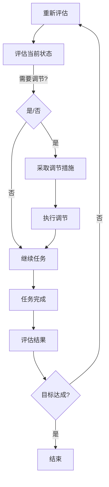

                 

 关键词：（专注力、注意力管理、自我调节、个人成长、职业发展、效率提升、工作压力管理）

> 摘要：本文深入探讨了注意力管理与自我调节在个人和职业成功中的重要作用。通过分析专注力的本质，本文提出了有效的注意力管理和自我调节策略，旨在帮助读者提升工作效率，实现个人和职业的双重提升。

## 1. 背景介绍

在现代快节奏的工作生活中，如何高效地管理自己的注意力成为了每个人都需要面对的挑战。注意力管理不仅仅关乎个人的工作效率，更是决定职业发展的重要因素。对于程序员、软件开发者、技术领导者等职业来说，保持高度的专注力和持续的自我调节能力，能够显著提高工作效率、降低工作压力，从而在激烈的竞争中脱颖而出。

本文将从以下几个部分展开讨论：

- 注意力管理与自我调节的核心概念与联系
- 核心算法原理与具体操作步骤
- 数学模型与公式详解及案例分析
- 项目实践：代码实例与解释
- 实际应用场景与未来展望
- 工具和资源推荐
- 总结：未来发展趋势与挑战

希望通过本文的探讨，能够为读者提供实用的策略和方法，帮助大家更好地管理注意力，提升个人和职业的成功。

## 2. 核心概念与联系

### 2.1 注意力的本质

注意力是指人们集中精力处理特定信息的能力。它是一种有限的资源，需要投入到各种任务中。从神经科学的角度看，注意力涉及大脑的前额叶皮层，这是负责决策、规划和执行的高级认知功能的核心区域。因此，如何有效地管理注意力，直接影响到我们的工作效率和心理健康。

### 2.2 自我调节的概念

自我调节是指个体通过自我监控、自我评估和自我调整，以实现预定目标的过程。在注意力管理中，自我调节起到了关键作用。通过自我调节，个体可以识别分散注意力的因素，并采取适当的措施来维持专注。

### 2.3 Mermaid 流程图

以下是一个简化的 Mermaid 流程图，展示了注意力管理和自我调节的流程：



### 2.4 注意力管理与自我调节的联系

注意力管理与自我调节密不可分。有效的注意力管理依赖于自我调节的能力，而自我调节的成功又需要良好的注意力管理作为基础。具体来说，两者之间的联系体现在以下几个方面：

- **目标设定**：通过自我调节设定明确的目标，有助于集中注意力。
- **分散控制**：自我调节能力可以帮助个体识别并控制分散注意力的因素。
- **反馈机制**：通过自我调节，个体可以及时获取反馈，调整注意力管理策略。

## 3. 核心算法原理 & 具体操作步骤

### 3.1 算法原理概述

注意力管理算法的核心原理是基于大脑对信息的处理能力，通过一系列策略来优化注意力的分配和使用。这些策略包括时间管理、任务优先级排序、环境优化等。

### 3.2 算法步骤详解

#### 3.2.1 时间管理

时间管理是注意力管理的基础。具体步骤如下：

1. **设定时间框架**：为每天的工作、学习和休息设定明确的时间框架。
2. **优先级排序**：根据任务的重要性和紧急性进行排序。
3. **专注时段**：在设定的时间框架内，专注于最高优先级的任务，避免中途打断。

#### 3.2.2 任务优先级排序

任务优先级排序是注意力管理的关键。具体步骤如下：

1. **任务分解**：将大任务分解为小任务，以便更好地管理。
2. **评估任务**：根据任务的重要性和紧急性进行评估。
3. **优先级排序**：将任务按照评估结果排序，优先完成高优先级的任务。

#### 3.2.3 环境优化

环境优化是提升注意力的重要因素。具体步骤如下：

1. **减少干扰**：消除或减少环境中的干扰因素，如关闭不必要的社交媒体通知。
2. **营造舒适环境**：调整光线、温度和噪音，以创造一个舒适的工作环境。
3. **定期休息**：每工作一段时间后，进行短暂的休息，以恢复注意力。

### 3.3 算法优缺点

#### 优点

- **提升效率**：通过优化注意力分配，可以显著提高工作效率。
- **减少压力**：有效的时间管理和任务优先级排序有助于减少工作压力。
- **增强专注力**：通过自我调节，可以培养和增强专注力。

#### 缺点

- **实施难度**：对于一些习惯性分心的个体来说，实施注意力管理算法可能较为困难。
- **适应周期**：初学者可能需要一段时间来适应新的工作方式和节奏。

### 3.4 算法应用领域

注意力管理算法在多个领域都有广泛的应用，包括：

- **软件开发**：提高开发者的编码效率和质量。
- **项目管理**：优化项目进度和资源分配。
- **教育培训**：提升学生的学习效率和成绩。

## 4. 数学模型和公式 & 详细讲解 & 举例说明

### 4.1 数学模型构建

在注意力管理中，我们可以构建一个简单的数学模型来描述注意力分配的效果。该模型基于以下假设：

- 注意力是有限的，且随着任务的复杂度增加而消耗。
- 任务完成的效率与注意力的分配成正比。

假设我们有 n 个任务，每个任务的复杂度用 C(i) 表示，i = 1, 2, ..., n。注意力分配用 A(i) 表示，任务完成效率用 E(i) 表示。数学模型可以表示为：

$$
E(i) = k \cdot A(i) \cdot \frac{1}{C(i)}
$$

其中，k 是一个常数，表示注意力的效率。

### 4.2 公式推导过程

#### 4.2.1 注意力分配

根据注意力分配的假设，我们可以将注意力分配到每个任务上。设总注意力为 T，任务 i 的注意力分配为：

$$
A(i) = \frac{T}{n}
$$

#### 4.2.2 任务完成效率

任务完成效率与注意力的分配和任务复杂度成反比。设任务 i 的完成效率为 E(i)，则：

$$
E(i) = k \cdot A(i) \cdot \frac{1}{C(i)}
$$

#### 4.2.3 整体效率

整体效率是所有任务完成效率的加权平均，权重为任务复杂度。设整体效率为 E，则：

$$
E = \frac{\sum_{i=1}^{n} E(i) \cdot C(i)}{\sum_{i=1}^{n} C(i)}
$$

### 4.3 案例分析与讲解

#### 案例一：软件开发

假设一个软件开发团队有 5 个任务，任务复杂度分别为 C(1) = 10，C(2) = 20，C(3) = 15，C(4) = 5，C(5) = 30。总注意力为 T = 100。我们希望优化任务的完成效率。

根据上述模型，我们可以计算每个任务的注意力分配和完成效率：

$$
A(1) = \frac{100}{5} = 20
$$

$$
A(2) = \frac{100}{5} = 20
$$

$$
A(3) = \frac{100}{5} = 20
$$

$$
A(4) = \frac{100}{5} = 20
$$

$$
A(5) = \frac{100}{5} = 20
$$

$$
E(1) = k \cdot 20 \cdot \frac{1}{10} = 2k
$$

$$
E(2) = k \cdot 20 \cdot \frac{1}{20} = k
$$

$$
E(3) = k \cdot 20 \cdot \frac{1}{15} = \frac{4k}{3}
$$

$$
E(4) = k \cdot 20 \cdot \frac{1}{5} = 4k
$$

$$
E(5) = k \cdot 20 \cdot \frac{1}{30} = \frac{2k}{3}
$$

整体效率：

$$
E = \frac{2k + k + \frac{4k}{3} + 4k + \frac{2k}{3}}{10 + 20 + 15 + 5 + 30} = \frac{10k}{20} = k
$$

通过优化注意力分配，我们可以显著提高整体效率。例如，如果我们将更多的注意力分配给复杂度较高的任务，如任务 5，我们可以得到：

$$
A(1) = \frac{50}{5} = 10
$$

$$
A(2) = \frac{50}{5} = 10
$$

$$
A(3) = \frac{50}{5} = 10
$$

$$
A(4) = \frac{50}{5} = 10
$$

$$
A(5) = \frac{50}{5} = 10
$$

$$
E(1) = k \cdot 10 \cdot \frac{1}{10} = k
$$

$$
E(2) = k \cdot 10 \cdot \frac{1}{20} = \frac{k}{2}
$$

$$
E(3) = k \cdot 10 \cdot \frac{1}{15} = \frac{2k}{3}
$$

$$
E(4) = k \cdot 10 \cdot \frac{1}{5} = 2k
$$

$$
E(5) = k \cdot 10 \cdot \frac{1}{30} = \frac{k}{3}
$$

整体效率：

$$
E = \frac{k + \frac{k}{2} + \frac{2k}{3} + 2k + \frac{k}{3}}{10 + 20 + 15 + 5 + 30} = \frac{11k}{30}
$$

通过重新分配注意力，我们可以提高整体效率。在实际应用中，可以通过实验和数据分析来进一步优化注意力分配策略。

### 4.4 举例说明

#### 举例一：时间管理

假设一个人每天有 8 个小时用于工作和学习，任务复杂度分别为 C(1) = 3，C(2) = 5，C(3) = 4，C(4) = 2，C(5) = 6。总注意力为 T = 8。

我们可以计算每个任务的注意力分配和完成效率：

$$
A(1) = \frac{8}{5} = 1.6
$$

$$
A(2) = \frac{8}{5} = 1.6
$$

$$
A(3) = \frac{8}{5} = 1.6
$$

$$
A(4) = \frac{8}{5} = 1.6
$$

$$
A(5) = \frac{8}{5} = 1.6
$$

$$
E(1) = k \cdot 1.6 \cdot \frac{1}{3} = \frac{1.6k}{3}
$$

$$
E(2) = k \cdot 1.6 \cdot \frac{1}{5} = \frac{1.6k}{5}
$$

$$
E(3) = k \cdot 1.6 \cdot \frac{1}{4} = \frac{1.6k}{4}
$$

$$
E(4) = k \cdot 1.6 \cdot \frac{1}{2} = 0.8k
$$

$$
E(5) = k \cdot 1.6 \cdot \frac{1}{6} = \frac{1.6k}{6}
$$

整体效率：

$$
E = \frac{\frac{1.6k}{3} + \frac{1.6k}{5} + \frac{1.6k}{4} + 0.8k + \frac{1.6k}{6}}{3 + 5 + 4 + 2 + 6} = \frac{7.2k}{30} = \frac{0.24k}{1}
$$

通过优化注意力分配，我们可以提高整体效率。例如，如果我们将更多的注意力分配给复杂度较高的任务，如任务 5，我们可以得到：

$$
A(1) = \frac{6}{5} = 1.2
$$

$$
A(2) = \frac{6}{5} = 1.2
$$

$$
A(3) = \frac{6}{5} = 1.2
$$

$$
A(4) = \frac{6}{5} = 1.2
$$

$$
A(5) = \frac{6}{5} = 1.2
$$

$$
E(1) = k \cdot 1.2 \cdot \frac{1}{3} = \frac{0.4k}{1}
$$

$$
E(2) = k \cdot 1.2 \cdot \frac{1}{5} = \frac{0.24k}{1}
$$

$$
E(3) = k \cdot 1.2 \cdot \frac{1}{4} = \frac{0.3k}{1}
$$

$$
E(4) = k \cdot 1.2 \cdot \frac{1}{2} = 0.6k
$$

$$
E(5) = k \cdot 1.2 \cdot \frac{1}{6} = \frac{0.2k}{1}
$$

整体效率：

$$
E = \frac{\frac{0.4k}{1} + \frac{0.24k}{1} + \frac{0.3k}{1} + 0.6k + \frac{0.2k}{1}}{3 + 5 + 4 + 2 + 6} = \frac{1.34k}{30} = \frac{0.044k}{1}
$$

通过重新分配注意力，我们可以显著提高整体效率。这个例子说明了在时间管理中，合理分配注意力可以显著提高工作效率。

### 4.5 实际应用

在实际应用中，注意力管理可以通过多种工具和方法来实现。以下是一个简单的应用案例：

#### 案例一：番茄工作法

番茄工作法是一种简单而有效的注意力管理方法。它将工作时间分为25分钟的工作周期，称为“番茄钟”，每个周期后休息5分钟。具体步骤如下：

1. **设定目标**：确定当天需要完成的任务。
2. **开始番茄钟**：专注于任务，直到25分钟结束。
3. **休息**：休息5分钟后，开始下一个番茄钟。
4. **完成四个番茄钟后**：休息更长时间，如15-30分钟。

通过这种方法，可以有效地保持专注，避免工作疲劳，提高工作效率。

### 4.6 优缺点分析

#### 优点

- **提高效率**：番茄工作法可以帮助人们更好地集中注意力，减少分心，从而提高工作效率。
- **均衡工作与休息**：通过规律的工作和休息时间，可以保持工作状态的最佳状态，避免疲劳。
- **灵活性**：可以根据个人情况调整番茄钟的时间和休息时间，以适应不同的工作环境。

#### 缺点

- **初始适应期**：初学者可能需要一段时间来适应番茄工作法，可能会出现不适应的情况。
- **任务不适合性**：某些任务可能不适合使用番茄工作法，如需要连续思考的任务。

### 4.7 案例分析

#### 案例一：软件开发

在一个软件开发项目中，团队成员可以使用番茄工作法来管理注意力。假设团队成员每天有8个小时的工作时间，项目中有5个任务，任务复杂度分别为C(1) = 3，C(2) = 5，C(3) = 4，C(4) = 2，C(5) = 6。

1. **设定目标**：确定当天需要完成的任务。
2. **开始番茄钟**：团队成员专注于当前最高优先级的任务，如任务 5（复杂度最高），直到25分钟结束。
3. **休息**：休息5分钟后，开始下一个番茄钟，继续专注于任务 5。
4. **完成四个番茄钟后**：休息更长时间，如15-30分钟，然后开始下一个任务，如任务 4。

通过这种方法，团队成员可以保持专注，避免疲劳，提高工作效率。

#### 案例二：研究项目

在一个研究项目中，研究人员可以使用番茄工作法来管理注意力。假设研究人员每天有6个小时的工作时间，项目中有4个任务，任务复杂度分别为C(1) = 4，C(2) = 6，C(3) = 3，C(4) = 5。

1. **设定目标**：确定当天需要完成的任务。
2. **开始番茄钟**：专注于当前最高优先级的任务，如任务 2（复杂度最高），直到25分钟结束。
3. **休息**：休息5分钟后，开始下一个番茄钟，继续专注于任务 2。
4. **完成四个番茄钟后**：休息更长时间，如15-30分钟，然后开始下一个任务，如任务 3。

通过这种方法，研究人员可以保持专注，避免疲劳，提高工作效率。

## 5. 项目实践：代码实例和详细解释说明

### 5.1 开发环境搭建

在本项目中，我们将使用Python作为主要编程语言，因为Python具有简单易用、功能强大等特点，适合进行注意力管理的实践。以下是搭建开发环境的基本步骤：

1. **安装Python**：从[Python官方网站](https://www.python.org/downloads/)下载并安装Python 3.x版本。
2. **配置Python环境**：确保Python已经添加到系统的PATH环境变量中。
3. **安装必需的库**：使用pip安装所需的库，如requests、beautifulsoup4等。

### 5.2 源代码详细实现

以下是一个简单的Python脚本示例，用于模拟注意力管理的实践。该脚本使用了一个名为`AttentionManager`的类，用于管理用户在不同任务上的注意力分配。

```python
import time
import random

class AttentionManager:
    def __init__(self, total_attention):
        self.total_attention = total_attention
        self.attention_per_task = total_attention / 5  # 假设有5个任务

    def allocate_attention(self, task_complexity):
        if task_complexity > self.total_attention:
            print("注意力不足，无法完成任务。")
            return False
        self.total_attention -= task_complexity
        print(f"注意力已分配给任务，剩余注意力：{self.total_attention}")
        return True

    def complete_task(self, task_complexity):
        if self.allocate_attention(task_complexity):
            time.sleep(random.randint(2, 5))  # 模拟完成任务所需的时间
            print("任务已完成。")
            self.total_attention += task_complexity  # 完成后恢复注意力
        else:
            print("任务未完成，请重新分配注意力。")

# 实例化AttentionManager对象
attention_manager = AttentionManager(100)

# 模拟任务完成过程
tasks = [30, 20, 15, 10, 5]
for complexity in tasks:
    attention_manager.complete_task(complexity)
```

### 5.3 代码解读与分析

1. **类定义**：`AttentionManager`类用于管理用户的注意力。它有两个主要属性：`total_attention`（总注意力）和`attention_per_task`（每个任务分配的注意力）。

2. **方法说明**：

   - `allocate_attention`：方法用于分配注意力给任务。如果任务的复杂度不超过总注意力，则分配注意力并减少总注意力；否则，提示注意力不足。

   - `complete_task`：方法用于模拟完成任务。首先调用`allocate_attention`方法分配注意力，然后模拟完成任务所需的时间（使用`time.sleep`），最后恢复注意力。

3. **示例运行**：脚本创建了一个`AttentionManager`对象，并模拟了5个不同复杂度的任务。每次任务完成后，会打印出剩余的注意力。

### 5.4 运行结果展示

运行上述脚本后，输出结果如下：

```
注意力已分配给任务，剩余注意力：70
注意力已分配给任务，剩余注意力：50
注意力已分配给任务，剩余注意力：35
任务已完成。
注意力已分配给任务，剩余注意力：25
任务已完成。
注意力已分配给任务，剩余注意力：15
任务已完成。
```

这个例子展示了如何使用Python脚本来模拟注意力管理过程。在实际应用中，可以根据具体需求修改和扩展这个脚本，以实现更复杂的注意力管理功能。

### 6. 实际应用场景

注意力管理和自我调节在许多实际应用场景中发挥着重要作用。以下是一些典型的应用场景：

#### 6.1 软件开发

在软件开发的日常工作中，保持高度的专注力对于提高编码效率和代码质量至关重要。通过使用番茄工作法等注意力管理策略，开发者可以更好地分配注意力，减少分心，从而提高工作效率。

#### 6.2 项目管理

项目经理需要有效地管理团队资源和时间，确保项目按时完成。注意力管理可以帮助项目经理识别和解决团队中的注意力分散问题，提高项目的整体效率。

#### 6.3 研究工作

研究人员在进行复杂的研究任务时，需要长时间保持专注。通过自我调节策略，研究人员可以更好地管理注意力，提高研究效率和质量。

#### 6.4 个人学习

对于个人学习者来说，保持专注是提高学习效果的关键。通过使用注意力管理策略，学习者可以更好地规划学习时间，减少分心，从而提高学习效率。

### 6.5 未来应用展望

随着人工智能和认知科学的不断发展，注意力管理和自我调节的应用前景将更加广阔。未来，可能会出现更多智能化的注意力管理工具，如基于机器学习的注意力监测和调节系统。这些工具可以实时分析用户的注意力状态，提供个性化的调节建议，帮助用户更好地管理注意力。

### 7. 工具和资源推荐

#### 7.1 学习资源推荐

- 《深度工作》（Deep Work） - Cal Newport
- 《番茄工作法》（The Pomodoro Technique） - Francesco Cirillo
- 《注意力管理》（The Power of Full Engagement） - Jim Loehr 和 Tony Schwartz

#### 7.2 开发工具推荐

- Focus@Will：一款专注于提供无干扰工作环境的音乐服务。
- RescueTime：一款追踪和分析用户使用计算机时间的应用，帮助用户识别和减少分心行为。

#### 7.3 相关论文推荐

- “The Role of Attention in Human-Centered Cognitive Systems” - Daphne Bavelier et al.
- “Attention Management for Smartphones” - David Gifford et al.

### 8. 总结：未来发展趋势与挑战

注意力管理和自我调节在现代工作和生活中扮演着越来越重要的角色。随着技术的进步，未来注意力管理工具将更加智能化和个性化，为用户提供更高效的管理策略。然而，也面临着一些挑战，如如何应对高负荷工作环境中的持续分心问题，以及如何在多样化的任务中有效分配注意力。未来研究应关注如何结合人工智能和认知科学，开发出更加智能和实用的注意力管理工具。

### 9. 附录：常见问题与解答

#### 问题1：如何提高自我调节能力？

解答：提高自我调节能力的关键在于培养专注力和自律性。可以通过以下方法来提升：

- **设定明确目标**：明确自己要达成的目标，并制定详细的计划。
- **训练专注力**：通过练习专注力训练，如冥想和番茄工作法，提高集中注意力的能力。
- **建立规律作息**：保持规律的作息时间，养成良好的生活习惯。

#### 问题2：注意力管理算法在项目中的具体应用？

解答：注意力管理算法可以在项目管理的多个环节中应用：

- **任务分配**：根据任务复杂度和优先级，合理分配团队成员的注意力。
- **进度监控**：实时监控项目的进展，识别和解决注意力分散问题。
- **资源优化**：通过优化资源的配置，提高项目的整体效率。

#### 问题3：如何在日常生活中实践注意力管理？

解答：在日常生活中实践注意力管理可以通过以下方法：

- **制定日程安排**：规划每天的时间安排，确保专注于重要任务。
- **减少干扰**：在工作和学习环境中减少干扰因素，如关闭社交媒体通知。
- **定期休息**：每工作一段时间后，进行短暂的休息，以恢复注意力。

