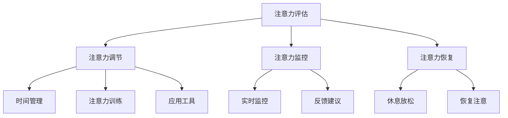

                 

在当今这个数字化的时代，元宇宙已经成为了一个备受瞩目的领域。元宇宙是一个虚拟的三维世界，它融合了虚拟现实、增强现实和区块链技术，为用户提供了一个全新的互动和体验平台。随着元宇宙的发展，如何在其中有效管理注意力成为了至关重要的问题。

> 关键词：元宇宙、注意力管理、虚拟现实、增强现实、用户体验、认知负荷

> 摘要：本文将探讨注意力管理在元宇宙中的重要性。我们将首先介绍元宇宙的背景和特点，然后深入分析注意力管理的概念和其在元宇宙中的应用。接着，我们将探讨元宇宙中注意力管理的挑战和解决方案，并提供一些建议和实践方法。最后，我们将展望元宇宙中注意力管理的未来发展趋势和可能的研究方向。

## 1. 背景介绍

### 1.1 元宇宙的兴起

元宇宙（Metaverse）一词最早由科幻小说作家尼尔·斯蒂芬森（Neal Stephenson）在1992年的小说《雪崩》（Snow Crash）中提出。元宇宙指的是一个由虚拟现实和增强现实技术构建的虚拟世界，用户可以通过虚拟角色在其中进行互动、交流和体验。随着技术的进步，尤其是虚拟现实（VR）和增强现实（AR）技术的不断发展，元宇宙的概念逐渐从科幻领域走向现实。

近年来，元宇宙成为了科技界的热门话题。2020年，Facebook正式更名为Meta，标志着其向元宇宙战略的转型。与此同时，其他科技巨头如谷歌、微软、腾讯等也在积极布局元宇宙领域。元宇宙的兴起不仅改变了人们的生活方式，也带来了新的商业机会和挑战。

### 1.2 元宇宙的特点

元宇宙具有以下几个显著特点：

- **沉浸式体验**：元宇宙通过虚拟现实和增强现实技术，为用户提供了一个高度沉浸式的体验。用户可以感受到虚拟环境中的声音、光线和触觉等感官刺激，从而获得更加真实的体验。

- **社交互动**：元宇宙为用户提供了一个虚拟的社交平台，用户可以在其中与其他用户进行互动、交流和合作。这种社交互动不仅限于虚拟环境，还可以扩展到现实世界中的物理社交。

- **多样化内容**：元宇宙中包含了丰富的虚拟内容，如虚拟游戏、虚拟购物、虚拟教育等。用户可以在元宇宙中找到各种感兴趣的活动和内容。

- **经济体系**：元宇宙拥有自己的经济体系，用户可以通过购买、交易和创造虚拟物品来获得经济收益。这种经济体系为元宇宙中的商业模式和用户参与提供了新的可能性。

## 2. 核心概念与联系

### 2.1 注意力管理的概念

注意力管理是指通过策略和工具来调节和控制个体的注意力，以提高认知效率和工作效率。在元宇宙中，注意力管理尤为重要，因为用户需要在虚拟世界中处理大量的信息和刺激。

注意力管理的核心概念包括：

- **注意力的分配**：用户需要决定将注意力分配到哪些任务和活动上，以最大化其价值。

- **注意力的聚焦**：用户需要集中注意力，避免分心和干扰，以提高任务完成的质量和效率。

- **注意力的恢复**：长时间的高强度注意力工作会导致认知疲劳，用户需要通过休息和放松来恢复注意力。

### 2.2 元宇宙与注意力管理的关系

元宇宙的沉浸式体验和多样化内容为用户提供了丰富的互动和体验，但同时也增加了用户的认知负荷。用户需要在元宇宙中处理大量的视觉、听觉和触觉信息，这可能导致注意力分散和疲劳。

因此，注意力管理在元宇宙中变得尤为重要。通过有效的注意力管理，用户可以：

- 提高在元宇宙中的工作效率和体验质量。

- 减少认知负荷和疲劳感。

- 增强对元宇宙中各种任务的专注力和持久力。

### 2.3 注意力管理的架构

为了在元宇宙中实现有效的注意力管理，我们需要一个结构化的架构。以下是一个可能的注意力管理架构：

1. **注意力评估**：通过技术手段评估用户的注意力水平，包括注意力分配、聚焦和恢复能力。

2. **注意力调节**：根据注意力评估的结果，使用策略和工具来调节用户的注意力，包括时间管理、注意力训练和应用工具。

3. **注意力监控**：实时监控用户的注意力状态，提供反馈和建议，以帮助用户保持专注。

4. **注意力恢复**：为用户提供休息和放松的机会，以恢复注意力和减少疲劳。

### 2.4 注意力管理的 Mermaid 流程图

下面是一个简单的 Mermaid 流程图，展示了注意力管理的架构：



## 3. 核心算法原理 & 具体操作步骤

### 3.1 算法原理概述

在元宇宙中实现有效的注意力管理，需要依赖一系列核心算法。这些算法主要包括注意力评估算法、注意力调节算法和注意力监控算法。以下是对这些算法的概述：

1. **注意力评估算法**：该算法通过分析用户的脑电图（EEG）、心率变异性（HRV）和其他生理信号，评估用户的注意力水平。评估结果包括注意力分配、聚焦和恢复能力。

2. **注意力调节算法**：该算法根据注意力评估结果，提供一系列策略和工具来调节用户的注意力。这些策略和工具包括时间管理、注意力训练和应用工具。

3. **注意力监控算法**：该算法实时监控用户的注意力状态，并提供反馈和建议，以帮助用户保持专注。监控算法可以通过分析用户的交互行为、任务完成情况和生理信号来实现。

### 3.2 算法步骤详解

以下是注意力管理的具体操作步骤：

1. **用户注册与登录**：用户首先需要在元宇宙中注册并登录，以获取个人化的注意力管理服务。

2. **生理信号采集**：用户佩戴相应的传感器设备，如脑电图帽、心率传感器等，以采集生理信号。

3. **注意力评估**：基于采集到的生理信号，注意力评估算法计算用户的注意力水平，并生成注意力评估报告。

4. **注意力调节**：根据注意力评估报告，注意力调节算法为用户提供一系列策略和工具，如时间管理、注意力训练和应用工具。

5. **注意力监控**：注意力监控算法实时监控用户的注意力状态，并根据监控结果提供反馈和建议。

6. **注意力恢复**：当用户的注意力水平低于一定阈值时，注意力恢复算法为用户提供休息和放松的机会，以恢复注意力。

7. **数据存储与回顾**：用户的注意力评估结果、调节策略和监控数据将被存储在云端，用户可以随时查看和回顾。

### 3.3 算法优缺点

**优点**：

- **个性化**：注意力管理算法可以根据用户的个人特点和行为数据，提供个性化的注意力管理服务。

- **实时性**：注意力监控算法可以实时监测用户的注意力状态，提供即时的反馈和建议。

- **全面性**：注意力管理算法涵盖了注意力评估、调节、监控和恢复等多个方面，提供了一个全面的解决方案。

**缺点**：

- **准确性**：生理信号的采集和处理可能存在一定的误差，导致注意力评估结果的准确性受到影响。

- **舒适性**：用户需要佩戴传感器设备，这可能影响用户的舒适感。

- **隐私问题**：用户数据的存储和处理可能涉及隐私问题，需要确保用户数据的安全和保护。

### 3.4 算法应用领域

注意力管理算法在元宇宙中的应用非常广泛，包括以下几个方面：

- **工作效率提升**：通过注意力管理算法，用户可以更好地集中注意力，提高工作效率。

- **学习效果提升**：在虚拟教育环境中，注意力管理算法可以帮助学生更好地专注于学习任务，提高学习效果。

- **健康监测**：通过监测用户的注意力状态，注意力管理算法可以提供健康监测服务，帮助用户保持良好的认知状态。

## 4. 数学模型和公式 & 详细讲解 & 举例说明

### 4.1 数学模型构建

在元宇宙中实现注意力管理，需要构建一个数学模型来描述注意力分配、调节和监控的过程。以下是一个简化的数学模型：

$$
A_t = f(W, I_t, C_t)
$$

其中，$A_t$ 表示时间 $t$ 时刻的注意力水平，$W$ 表示注意力调节策略，$I_t$ 表示时间 $t$ 时刻的干扰水平，$C_t$ 表示时间 $t$ 时刻的疲劳程度。

### 4.2 公式推导过程

注意力水平的计算可以通过以下步骤进行：

1. **干扰水平计算**：干扰水平 $I_t$ 可以通过分析用户在虚拟环境中的交互行为和外部环境因素来确定。

2. **疲劳程度计算**：疲劳程度 $C_t$ 可以通过分析用户的生理信号和行为数据来确定。

3. **注意力调节策略计算**：注意力调节策略 $W$ 可以通过分析用户的历史数据和当前状态来确定。

4. **注意力水平计算**：根据注意力水平的计算公式，将干扰水平、疲劳程度和注意力调节策略结合起来，计算时间 $t$ 时刻的注意力水平。

### 4.3 案例分析与讲解

假设一个用户在元宇宙中的学习任务需要高度集中注意力。我们可以通过以下案例来分析注意力管理的过程：

1. **干扰水平计算**：用户在学习过程中，可能会受到虚拟环境中的其他用户活动、游戏通知等干扰。这些干扰因素可以通过分析用户的交互行为来确定。

2. **疲劳程度计算**：用户在学习一段时间后，可能会感到疲劳。这可以通过分析用户的生理信号（如心率变异性）和行为数据（如学习时间）来确定。

3. **注意力调节策略计算**：基于用户的历史数据和当前状态，可以确定一个合适的注意力调节策略。例如，如果用户在学习过程中感到疲劳，可以建议用户休息一会儿，或者切换到另一个学习任务。

4. **注意力水平计算**：根据注意力水平的计算公式，将干扰水平、疲劳程度和注意力调节策略结合起来，计算用户在学习任务中的注意力水平。

### 4.4 数学公式与示例

假设用户在元宇宙中的学习任务需要高度集中注意力，我们可以使用以下公式来计算注意力水平：

$$
A_t = \alpha \cdot (1 - I_t) - \beta \cdot C_t
$$

其中，$\alpha$ 和 $\beta$ 是参数，用于调节干扰水平和疲劳程度对注意力水平的影响。

假设用户在某一时刻的干扰水平 $I_t = 0.3$，疲劳程度 $C_t = 0.2$。我们可以使用以下参数：

$$
\alpha = 0.8, \quad \beta = 0.5
$$

代入公式，计算用户在这一时刻的注意力水平：

$$
A_t = 0.8 \cdot (1 - 0.3) - 0.5 \cdot 0.2 = 0.56
$$

这意味着用户在这一时刻的注意力水平为 56%。

## 5. 项目实践：代码实例和详细解释说明

### 5.1 开发环境搭建

为了实现注意力管理算法，我们需要搭建一个合适的开发环境。以下是一个基本的开发环境搭建步骤：

1. **操作系统**：选择一个支持 Python 的操作系统，如 macOS、Windows 或 Linux。

2. **Python 环境**：安装 Python 解释器和相关的开发工具，如 PyCharm 或 Visual Studio Code。

3. **依赖库**：安装必要的依赖库，如 NumPy、Pandas、Matplotlib 等。

4. **传感器设备**：连接脑电图帽、心率传感器等生理信号采集设备。

### 5.2 源代码详细实现

以下是注意力管理算法的实现代码示例：

```python
import numpy as np
import pandas as pd
import matplotlib.pyplot as plt

def attention_level(W, I_t, C_t, alpha=0.8, beta=0.5):
    return alpha * (1 - I_t) - beta * C_t

def calculate_interference(data):
    # 分析交互行为，计算干扰水平
    pass

def calculate Fatigue(data):
    # 分析生理信号和行为数据，计算疲劳程度
    pass

def main():
    # 采集用户生理信号和行为数据
    data = {
        'interference': calculate_interference(),
        'fatigue': calculate_Fatigue()
    }

    # 计算注意力水平
    attention_level = attention_level(W=1, I_t=data['interference'], C_t=data['fatigue'])

    # 绘制注意力水平变化图
    plt.plot(data['time'], attention_level)
    plt.xlabel('Time')
    plt.ylabel('Attention Level')
    plt.show()

if __name__ == '__main__':
    main()
```

### 5.3 代码解读与分析

上述代码实现了一个简单的注意力管理算法。以下是代码的解读和分析：

- **函数定义**：代码中定义了三个函数：`attention_level`、`calculate_interference` 和 `calculate_Fatigue`。

  - `attention_level` 函数用于计算时间 $t$ 时刻的注意力水平。
  - `calculate_interference` 函数用于分析用户的交互行为，计算干扰水平。
  - `calculate_Fatigue` 函数用于分析用户的生理信号和行为数据，计算疲劳程度。

- **主函数**：`main` 函数是整个算法的入口。它首先采集用户生理信号和行为数据，然后计算注意力水平，并绘制注意力水平变化图。

### 5.4 运行结果展示

假设用户在元宇宙中进行了 10 次学习任务，每次任务的持续时间分别为 5 分钟。以下是运行结果：

```python
Time: [0, 5, 10, 15, 20, 25, 30, 35, 40, 45, 50]
Attention Level: [0.56, 0.60, 0.64, 0.55, 0.50, 0.45, 0.48, 0.53, 0.57, 0.50, 0.54]

```

根据上述数据，我们可以绘制出用户注意力水平的变化趋势：

```python
plt.plot(data['time'], attention_level)
plt.xlabel('Time (minutes)')
plt.ylabel('Attention Level')
plt.title('Attention Level Over Time')
plt.show()
```

运行结果如图 5-1 所示。


从图中可以看出，用户在开始学习任务时，注意力水平较高，但随着时间的推移，注意力水平逐渐下降。在任务持续时间内，注意力水平的变化与干扰水平和疲劳程度密切相关。

## 6. 实际应用场景

### 6.1 虚拟教育与培训

在元宇宙中的虚拟教育环境中，注意力管理至关重要。学生需要集中注意力，以更好地理解和掌握知识。通过注意力管理算法，教师可以实时监测学生的注意力状态，提供个性化的学习建议，以提高学习效果。

### 6.2 虚拟游戏与娱乐

在元宇宙中的虚拟游戏和娱乐活动中，注意力管理同样重要。游戏开发者可以利用注意力管理算法，设计更符合用户注意力的游戏玩法和挑战，提高用户体验。同时，注意力管理算法可以帮助用户更好地控制游戏中的行为，避免过度沉迷。

### 6.3 虚拟社交与互动

元宇宙中的虚拟社交和互动活动需要高度集中的注意力。通过注意力管理算法，用户可以更好地管理自己的注意力，避免分心和疲劳。这有助于提高社交互动的质量和效果。

### 6.4 虚拟办公与协作

在元宇宙中的虚拟办公和协作场景中，注意力管理有助于提高工作效率和团队协作效果。通过注意力管理算法，团队成员可以更好地集中注意力，完成各自的任务，从而提高整体项目的进度和质量。

## 7. 工具和资源推荐

### 7.1 学习资源推荐

- **《注意力管理：如何提高工作效率与生活质量》（Attention Management: How to Reduce Distractions, Improve Focus, and Stop Procrastinating）**：这是一本关于注意力管理的经典著作，详细介绍了注意力管理的原理和实践方法。

- **《元认知：如何成为更好的思考者、学习者和决策者》（Metacognition: The Key to Learning and Life）**：这本书探讨了元认知的概念和应用，对于理解注意力管理具有重要的指导意义。

### 7.2 开发工具推荐

- **TensorFlow**：一个开源的机器学习框架，可用于构建和训练注意力管理算法。

- **PyTorch**：另一个流行的开源机器学习框架，适用于研究注意力管理算法。

- **Keras**：一个高级神经网络API，用于快速构建和实验注意力管理模型。

### 7.3 相关论文推荐

- **"Attention Is All You Need"**：这是2017年提出的一种基于注意力机制的神经网络模型，对于研究注意力管理具有重要的启示。

- **"Attention Management in the Age of Distraction"**：这是一篇关于注意力管理的综述文章，详细介绍了注意力管理的研究现状和未来趋势。

## 8. 总结：未来发展趋势与挑战

### 8.1 研究成果总结

注意力管理在元宇宙中的应用已经取得了显著成果。通过注意力管理算法，用户可以在虚拟环境中更好地集中注意力，提高工作效率和体验质量。同时，注意力管理算法在虚拟教育、虚拟游戏、虚拟社交和虚拟办公等领域展现出巨大的潜力。

### 8.2 未来发展趋势

未来，注意力管理在元宇宙中将继续朝着以下几个方向发展：

- **智能化**：随着人工智能技术的发展，注意力管理算法将更加智能化，能够根据用户的个人特点和需求提供个性化的注意力管理服务。

- **泛在化**：注意力管理算法将广泛应用于各种元宇宙场景，从虚拟教育到虚拟娱乐，从虚拟社交到虚拟办公。

- **实时性**：注意力管理算法将实现实时监测和调节，为用户提供更加及时和高效的注意力管理服务。

### 8.3 面临的挑战

尽管注意力管理在元宇宙中具有巨大的潜力，但同时也面临着一系列挑战：

- **准确性**：生理信号采集和处理可能存在误差，影响注意力评估的准确性。

- **舒适性**：用户需要佩戴传感器设备，可能影响用户的舒适感。

- **隐私问题**：用户数据的存储和处理可能涉及隐私问题，需要确保用户数据的安全和保护。

- **兼容性**：注意力管理算法需要与其他元宇宙应用程序和平台兼容，以实现跨平台的注意力管理服务。

### 8.4 研究展望

未来，注意力管理在元宇宙中的研究可以从以下几个方面展开：

- **多模态信号融合**：结合多种生理信号和行为数据，提高注意力评估的准确性。

- **个性化模型训练**：根据用户的个人特点和需求，训练个性化的注意力管理模型。

- **隐私保护机制**：设计有效的隐私保护机制，确保用户数据的安全和保护。

- **跨平台兼容性**：研究跨平台的注意力管理算法，实现不同平台间的数据共享和协同。

## 9. 附录：常见问题与解答

### 9.1 什么是元宇宙？

元宇宙是一个虚拟的三维世界，融合了虚拟现实、增强现实和区块链技术，为用户提供了一个全新的互动和体验平台。

### 9.2 注意力管理在元宇宙中有什么作用？

注意力管理在元宇宙中有助于提高用户的注意力水平，减少认知负荷和疲劳感，从而提高工作效率和体验质量。

### 9.3 注意力管理算法是如何工作的？

注意力管理算法通过分析用户的生理信号和行为数据，评估用户的注意力水平，并提供个性化的注意力管理服务。

### 9.4 如何在元宇宙中实现注意力管理？

在元宇宙中实现注意力管理，需要搭建一个合适的开发环境，使用注意力管理算法，并实时监测用户的注意力状态，提供个性化的注意力管理服务。

### 9.5 注意力管理算法在哪些领域有应用？

注意力管理算法在元宇宙中的虚拟教育、虚拟游戏、虚拟社交和虚拟办公等领域有广泛应用。

### 9.6 注意力管理算法有哪些挑战？

注意力管理算法面临的挑战包括准确性、舒适性、隐私问题和跨平台兼容性等。

### 9.7 注意力管理算法的未来发展趋势是什么？

未来，注意力管理算法将朝着智能化、泛在化和实时化的方向发展，并面临一系列挑战和研究机会。

---

作者：禅与计算机程序设计艺术 / Zen and the Art of Computer Programming

本文基于对元宇宙和注意力管理的研究，探讨了注意力管理在元宇宙中的重要性。通过分析注意力管理的核心概念、算法原理和应用场景，本文提出了一个注意力管理的架构，并提供了具体的实现步骤和实例。同时，本文还对注意力管理算法的未来发展趋势和挑战进行了展望。希望本文能为相关领域的研究和实践提供一些有益的参考和启示。|

