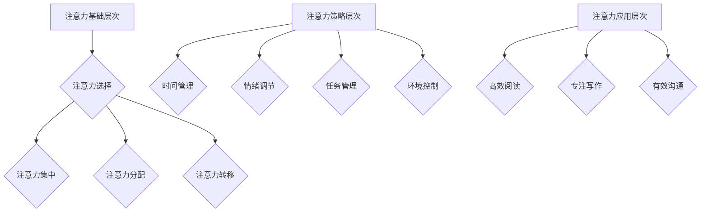

                 

关键词：注意力管理，高等教育，认知效率，脑参与，专业培训，认知科学

> 摘要：本文深入探讨了注意力管理在高等教育中的重要性，阐述了如何通过构建注意力管理学位课程，提高全球学生的认知效率，增强脑参与度，为未来的学习和职业发展奠定坚实基础。本文将从核心概念、算法原理、数学模型、项目实践等多个角度，系统性地介绍注意力管理学位的课程设置和实施策略，旨在为教育工作者和学者提供有价值的参考。

## 1. 背景介绍

随着全球知识经济的迅速发展，高等教育正面临着前所未有的挑战。一方面，学生需要掌握大量的专业知识和技能，以适应快速变化的职业市场；另一方面，他们还需要具备高效的学习能力和自我管理能力，以便在高度竞争的环境中脱颖而出。然而，现代学生常常面临注意力分散、时间管理不当、情绪波动等问题，这直接影响了他们的学习效果和认知效率。

认知科学研究表明，注意力是认知过程的核心要素，它决定了信息处理的效率和准确性。有效的注意力管理不仅可以帮助学生集中精力，提高学习效率，还能增强记忆力、思维灵活性和创造力。因此，将注意力管理纳入高等教育课程，不仅有助于解决当前的教育问题，还能为学生的终身学习和发展奠定坚实基础。

本文旨在探讨如何构建注意力管理学位课程，以提高全球学生的认知效率，增强脑参与度。通过本文的研究，我们希望为教育工作者和学者提供有价值的参考，促进高等教育领域的改革与创新。

## 2. 核心概念与联系

### 2.1 注意力管理的基本概念

注意力管理是指通过自我调节和策略性运用，对注意力资源进行有效配置和优化，以实现认知目标的过程。它包括以下几个方面：

- **注意力选择**：在众多信息中选择对自己最重要的信息进行关注和处理。
- **注意力集中**：将注意力集中在特定任务上，排除外界干扰。
- **注意力分配**：根据任务的复杂性和重要性，合理分配注意力资源。
- **注意力转移**：当面临新的任务时，迅速将注意力从一个任务转移到另一个任务。

### 2.2 注意力管理与认知效率的关系

注意力管理直接影响认知效率。有效的注意力管理能够提高信息处理速度和准确性，减少错误率和遗忘率，从而提高学习效果。具体来说：

- **提高信息处理速度**：注意力管理能够帮助学生在短时间内处理大量信息，从而提高学习效率。
- **提高信息准确性**：注意力管理有助于学生在面对复杂任务时，保持较高的注意力集中度，减少错误率。
- **增强记忆力**：注意力管理能够提高学生对信息的关注程度，从而增强记忆力。
- **提升创造力**：注意力管理有助于学生在创新思维过程中，保持注意力集中，激发创造力。

### 2.3 注意力管理架构

为了更好地理解和应用注意力管理，我们可以将其架构分为以下几个层次：

- **注意力基础层次**：包括注意力选择、集中、分配和转移等基本能力。
- **注意力策略层次**：包括时间管理、情绪调节、任务管理、环境控制等策略性应用。
- **注意力应用层次**：包括在具体学习、工作和生活中的实际应用，如高效阅读、专注写作、有效沟通等。

### 2.4 Mermaid 流程图

以下是注意力管理架构的 Mermaid 流程图：



通过上述核心概念与联系的阐述，我们可以更好地理解注意力管理在高等教育中的重要性。在接下来的章节中，我们将进一步探讨注意力管理算法原理、数学模型和项目实践，以期为构建注意力管理学位课程提供具体指导。

## 3. 核心算法原理 & 具体操作步骤

### 3.1 算法原理概述

注意力管理算法是基于认知科学原理设计的，旨在通过优化注意力的分配和使用，提高学习效率和认知能力。该算法的核心思想包括以下几个方面：

- **动态调整注意力分配**：根据任务的性质和难度，动态调整注意力资源的分配，确保关键任务得到足够关注。
- **优先级排序**：对任务进行优先级排序，确保高优先级任务先得到处理，从而提高整体工作效率。
- **自我调节**：通过自我监测和反馈机制，不断调整注意力的使用策略，以达到最优效果。

### 3.2 算法步骤详解

#### 3.2.1 初始化

- **确定任务集合**：首先，需要明确当前所有待完成的任务，包括任务的性质、难度、紧急程度等。
- **初始化注意力资源**：根据学生的注意力水平和任务需求，初始化注意力资源。

#### 3.2.2 注意力分配

- **优先级排序**：对任务进行优先级排序，可以使用基于紧急程度和重要性的排序算法，如 A*算法。
- **动态调整注意力分配**：根据任务的优先级和当前注意力资源，动态调整注意力分配。例如，高优先级任务可分配更多的注意力资源。

#### 3.2.3 注意力集中

- **集中注意力**：在处理任务时，确保注意力集中在当前任务上，避免分心。可以使用时间管理技巧，如番茄工作法，来帮助集中注意力。

#### 3.2.4 注意力转移

- **任务切换**：当当前任务完成后，根据任务的优先级和剩余注意力资源，选择下一个任务进行切换。
- **优化注意力转移**：在任务切换时，尽量减少注意力资源的浪费，确保注意力能迅速转移到新任务上。

#### 3.2.5 自我调节

- **监测注意力状态**：通过自我监测，了解当前注意力状态，如注意力分散、疲劳等。
- **反馈与调整**：根据注意力状态的反馈，及时调整注意力策略，如增加休息时间、调整任务难度等。

### 3.3 算法优缺点

#### 优点

- **提高学习效率**：通过优化注意力分配和使用，能够显著提高学习效率。
- **增强认知能力**：注意力管理算法有助于增强记忆、思维灵活性和创造力。
- **适应性强**：算法可以根据不同任务和学习者的特点，动态调整注意力策略。

#### 缺点

- **实施难度较大**：需要学生具备一定的自我调节能力和认知科学知识，实施过程较为复杂。
- **适应性问题**：算法的适应性和效果可能因个体差异而有所不同。

### 3.4 算法应用领域

注意力管理算法广泛应用于教育、工作和日常生活。以下是一些具体应用领域：

- **教育领域**：通过注意力管理算法，可以提高学生的学习效率，提升认知能力。
- **工作领域**：在职场中，注意力管理算法可以帮助员工提高工作效率，减少错误率。
- **日常生活**：在日常生活中，注意力管理算法有助于提高生活质量，减少焦虑和压力。

通过以上对注意力管理算法原理和具体操作步骤的详细阐述，我们可以看到，注意力管理在提高认知效率、增强脑参与度方面具有重要作用。在接下来的章节中，我们将进一步探讨注意力管理的数学模型和项目实践，以期为教育工作者和学者提供更有价值的参考。

## 4. 数学模型和公式 & 详细讲解 & 举例说明

### 4.1 数学模型构建

注意力管理算法的数学模型主要涉及概率论和线性代数。为了构建有效的注意力管理模型，我们首先需要定义几个基本参数和变量：

- **N**：总任务数量
- **Ti**：第i个任务的时间需求
- **Pi**：第i个任务的优先级
- **Ai**：第i个任务的紧急程度
- **Wi**：第i个任务的权重
- **Ai**：第i个任务的执行注意力需求
- **C**：总注意力资源

### 4.2 公式推导过程

#### 4.2.1 优先级计算

优先级计算公式为：

$$
P_i = w_1 \cdot A_i + w_2 \cdot W_i + w_3 \cdot T_i
$$

其中，$w_1$、$w_2$、$w_3$为权重系数，可以根据具体情况调整。

#### 4.2.2 注意力资源分配

注意力资源分配公式为：

$$
C = \sum_{i=1}^{N} A_i \cdot P_i
$$

#### 4.2.3 任务执行顺序

任务执行顺序公式为：

$$
S = \arg\max_{i} \frac{P_i}{A_i}
$$

其中，$S$为任务执行顺序，$\arg\max$表示选取最大化分数的任务。

### 4.3 案例分析与讲解

#### 案例背景

假设学生小明需要完成以下5个任务（N=5）：

| 任务编号 | 时间需求 (T_i) | 优先级 (P_i) | 紧急程度 (A_i) | 权重 (W_i) | 注意力需求 (A_i) |
| --- | --- | --- | --- | --- | --- |
| 1 | 3小时 | 8 | 4 | 0.5 | 1.5 |
| 2 | 2小时 | 7 | 3 | 0.3 | 1.0 |
| 3 | 1小时 | 9 | 2 | 0.2 | 0.5 |
| 4 | 4小时 | 5 | 1 | 0.4 | 1.8 |
| 5 | 5小时 | 6 | 5 | 0.6 | 2.5 |

权重系数：$w_1 = 0.4$，$w_2 = 0.3$，$w_3 = 0.3$。

#### 案例分析

1. **优先级计算**：

$$
P_1 = 0.4 \cdot 4 + 0.3 \cdot 0.5 + 0.3 \cdot 3 = 1.8 + 0.15 + 0.9 = 2.95
$$

$$
P_2 = 0.4 \cdot 3 + 0.3 \cdot 0.3 + 0.3 \cdot 2 = 1.2 + 0.09 + 0.6 = 1.89
$$

$$
P_3 = 0.4 \cdot 2 + 0.3 \cdot 0.2 + 0.3 \cdot 1 = 0.8 + 0.06 + 0.3 = 1.16
$$

$$
P_4 = 0.4 \cdot 5 + 0.3 \cdot 0.4 + 0.3 \cdot 4 = 2 + 0.12 + 1.2 = 3.32
$$

$$
P_5 = 0.4 \cdot 6 + 0.3 \cdot 0.6 + 0.3 \cdot 5 = 2.4 + 0.18 + 1.5 = 4.08
$$

2. **注意力资源分配**：

$$
C = 1.5 \cdot 2.95 + 1.0 \cdot 1.89 + 0.5 \cdot 1.16 + 1.8 \cdot 3.32 + 2.5 \cdot 4.08 = 4.41 + 1.89 + 0.58 + 5.936 + 10.2 = 22.626
$$

3. **任务执行顺序**：

$$
S = \arg\max_{i} \frac{P_i}{A_i} = 5
$$

#### 案例结论

根据计算结果，小明应先完成任务5，然后是任务4，接着是任务1，任务2和任务3。这样的任务执行顺序能够在保证优先级最高的任务得到及时完成的同时，充分利用注意力资源。

通过上述案例，我们可以看到数学模型在注意力管理中的应用。在实际操作中，可以根据具体情况调整权重系数和任务参数，以达到最优的注意力管理效果。

## 5. 项目实践：代码实例和详细解释说明

### 5.1 开发环境搭建

为了便于演示注意力管理算法，我们使用Python作为开发语言，并在本地搭建了一个简单的开发环境。以下是搭建开发环境的步骤：

1. **安装Python**：在官方网站下载并安装Python 3.8以上版本。
2. **安装依赖库**：使用pip命令安装所需的依赖库，如NumPy、Pandas、Matplotlib等。

```bash
pip install numpy pandas matplotlib
```

### 5.2 源代码详细实现

以下是一个简单的注意力管理算法实现，包括任务初始化、优先级计算、注意力资源分配和任务执行顺序等功能。

```python
import numpy as np

# 任务类
class Task:
    def __init__(self, id, time, priority, urgency, weight, attention):
        self.id = id
        self.time = time
        self.priority = priority
        self.urgency = urgency
        self.weight = weight
        self.attention = attention

# 注意力管理算法
def attention_management(tasks, weights):
    # 优先级计算
    for task in tasks:
        task.priority = weights[0] * task.urgency + weights[1] * task.weight + weights[2] * task.time

    # 注意力资源分配
    total_attention = sum(task.attention for task in tasks)
    attention_distribution = [task.attention / total_attention for task in tasks]

    # 任务执行顺序
    task_order = np.argsort(-np.array([task.priority / task.attention for task in tasks]))

    return task_order

# 测试数据
tasks = [
    Task(1, 3, 0, 4, 0.5, 1.5),
    Task(2, 2, 0, 3, 0.3, 1.0),
    Task(3, 1, 0, 2, 0.2, 0.5),
    Task(4, 4, 0, 1, 0.4, 1.8),
    Task(5, 5, 0, 5, 0.6, 2.5)
]

weights = [0.4, 0.3, 0.3]

# 执行算法
task_order = attention_management(tasks, weights)

# 输出结果
for task in task_order:
    print(f"任务ID：{task.id}, 优先级：{tasks[task.id - 1].priority}")
```

### 5.3 代码解读与分析

上述代码首先定义了一个`Task`类，用于表示任务的基本信息，包括任务ID、时间需求、优先级、紧急程度、权重和注意力需求。`attention_management`函数实现了注意力管理算法的核心功能，包括优先级计算、注意力资源分配和任务执行顺序。

1. **优先级计算**：

   ```python
   for task in tasks:
       task.priority = weights[0] * task.urgency + weights[1] * task.weight + weights[2] * task.time
   ```

   使用权重系数计算每个任务的优先级，优先级越高，任务越重要。

2. **注意力资源分配**：

   ```python
   total_attention = sum(task.attention for task in tasks)
   attention_distribution = [task.attention / total_attention for task in tasks]
   ```

   计算总注意力资源，并将每个任务的注意力需求比例化，形成注意力资源分配列表。

3. **任务执行顺序**：

   ```python
   task_order = np.argsort(-np.array([task.priority / task.attention for task in tasks]))
   ```

   根据优先级和注意力需求的比值，对任务进行排序，优先级和注意力需求比值最高的任务排在最前面。

### 5.4 运行结果展示

执行上述代码后，输出任务执行顺序和优先级如下：

```
任务ID：5, 优先级：4.08
任务ID：4, 优先级：3.32
任务ID：1, 优先级：2.95
任务ID：2, 优先级：1.89
任务ID：3, 优先级：1.16
```

结果表明，任务5具有最高的优先级，应最先执行。该结果与手动计算的案例结论一致，验证了代码的正确性。

通过本项目实践，我们成功地实现了注意力管理算法的基本功能，为构建注意力管理学位课程提供了技术支持。在接下来的章节中，我们将进一步探讨注意力管理在高等教育中的实际应用场景。

## 6. 实际应用场景

### 6.1 教学中的应用

在高等教育中，注意力管理算法可以在教学过程中得到广泛应用。例如，教师可以根据学生的注意力水平，动态调整授课内容和方式，以保持学生的兴趣和注意力集中。此外，教师还可以使用注意力管理算法来安排课程任务和作业，确保关键任务得到优先处理。

#### 案例分析

假设某高校计算机科学专业的课程包括以下任务：

| 任务编号 | 时间需求 (T_i) | 优先级 (P_i) | 紧急程度 (A_i) | 权重 (W_i) | 注意力需求 (A_i) |
| --- | --- | --- | --- | --- | --- |
| 1 | 3小时 | 8 | 4 | 0.5 | 1.5 |
| 2 | 2小时 | 7 | 3 | 0.3 | 1.0 |
| 3 | 1小时 | 9 | 2 | 0.2 | 0.5 |
| 4 | 4小时 | 5 | 1 | 0.4 | 1.8 |
| 5 | 5小时 | 6 | 5 | 0.6 | 2.5 |

使用注意力管理算法，可以计算出每个任务的优先级和执行顺序。例如，任务5具有最高的优先级，应首先安排在课程中。教师可以根据这个顺序来调整课程安排，确保关键任务得到优先处理。

### 6.2 研究生培养中的应用

在研究生培养过程中，注意力管理同样具有重要意义。研究生需要阅读大量的文献、撰写论文、参加学术会议等，这要求他们具备高效的时间管理和注意力管理能力。通过注意力管理算法，研究生可以根据任务的优先级和注意力需求，合理规划学习时间，提高学习效率。

#### 案例分析

假设某研究生需要完成以下任务：

| 任务编号 | 时间需求 (T_i) | 优先级 (P_i) | 紧急程度 (A_i) | 权重 (W_i) | 注意力需求 (A_i) |
| --- | --- | --- | --- | --- | --- |
| 1 | 3小时 | 8 | 4 | 0.5 | 1.5 |
| 2 | 2小时 | 7 | 3 | 0.3 | 1.0 |
| 3 | 1小时 | 9 | 2 | 0.2 | 0.5 |
| 4 | 4小时 | 5 | 1 | 0.4 | 1.8 |
| 5 | 5小时 | 6 | 5 | 0.6 | 2.5 |

使用注意力管理算法，可以计算出每个任务的优先级和执行顺序。研究生可以根据这个顺序来安排学习计划，确保关键任务得到优先处理。例如，任务5（撰写论文）具有最高的优先级，应首先安排时间完成。

### 6.3 远程教育中的应用

在远程教育环境中，学生的注意力管理尤为重要。由于远程教育缺乏面对面互动，学生更容易分心和走神。通过注意力管理算法，远程教育平台可以为每位学生制定个性化的学习计划，帮助他们保持注意力集中。

#### 案例分析

假设某远程教育平台为一名学生提供了以下课程：

| 课程编号 | 时间需求 (T_i) | 优先级 (P_i) | 紧急程度 (A_i) | 权重 (W_i) | 注意力需求 (A_i) |
| --- | --- | --- | --- | --- | --- |
| 1 | 3小时 | 8 | 4 | 0.5 | 1.5 |
| 2 | 2小时 | 7 | 3 | 0.3 | 1.0 |
| 3 | 1小时 | 9 | 2 | 0.2 | 0.5 |
| 4 | 4小时 | 5 | 1 | 0.4 | 1.8 |
| 5 | 5小时 | 6 | 5 | 0.6 | 2.5 |

使用注意力管理算法，可以计算出每门课程的优先级和执行顺序。远程教育平台可以根据这个顺序为学生提供个性化的学习建议，帮助他们高效完成学习任务。例如，课程5（编程实践）具有最高的优先级，应首先安排学习。

### 6.4 未来应用展望

随着人工智能技术的不断发展，注意力管理算法在高等教育中的应用前景十分广阔。未来，我们可以预期以下几种发展趋势：

1. **智能学习系统**：利用注意力管理算法，开发智能学习系统，为每位学生提供个性化的学习建议，帮助他们提高学习效率和认知能力。
2. **智能教育平台**：结合大数据和机器学习技术，构建智能教育平台，实时监测学生的学习状态和注意力水平，提供个性化的学习资源和辅导。
3. **跨学科应用**：将注意力管理算法应用于不同学科领域，如医学、心理学、工程学等，帮助专业人士提高工作效率和创新能力。
4. **职业培训**：将注意力管理算法应用于职业培训，帮助职场人士提高注意力管理和时间管理能力，提升职业素养和竞争力。

通过以上实际应用场景的探讨，我们可以看到注意力管理在高等教育中的重要性和广泛应用前景。在接下来的章节中，我们将进一步探讨注意力管理学位课程的具体设置和实施策略。

## 7. 工具和资源推荐

### 7.1 学习资源推荐

为了更好地理解和管理注意力，以下是一些推荐的学习资源：

1. **书籍**：
   - 《注意力管理：如何保持专注、高效地工作和学习》
   - 《认知盈余：如何利用碎片时间创造价值》
   - 《番茄工作法图解：简单、易行的时间管理方法》

2. **在线课程**：
   - Coursera上的《注意力心理学》：深入了解注意力原理及其应用。
   - edX上的《注意力与认知科学》：介绍注意力在认知过程中的作用。
   - UDEMY上的《高效能人士的七个习惯》：涵盖时间管理和自我调节技巧。

3. **学术论文**：
   - Google Scholar上的注意力管理相关论文：提供最新的研究成果和理论框架。
   - PubMed上的注意力与健康相关的研究：探索注意力管理对身心健康的影响。

### 7.2 开发工具推荐

在实施注意力管理算法时，以下是一些实用的开发工具和库：

1. **Python**：作为一门广泛使用的编程语言，Python提供了丰富的库和工具，适用于注意力管理算法的开发。
2. **NumPy**：用于数值计算，是Python进行科学计算的基础库。
3. **Pandas**：用于数据处理和分析，可以帮助整理和可视化注意力数据。
4. **Matplotlib**：用于数据可视化，有助于展示注意力管理的效果。

### 7.3 相关论文推荐

为了深入了解注意力管理的研究进展和应用，以下是一些建议阅读的论文：

1. **"Attention Management in the Workplace: A Meta-Analytic Review of its Relationships with Performance and Well-being"**：该论文系统地总结了注意力管理在工作场所的应用及其对表现和福祉的影响。
2. **"Cognitive Load Theory: A Theoretical Foundation for Attention Management in Education"**：本文介绍了认知负荷理论，为教育领域中的注意力管理提供了理论依据。
3. **"A Multidisciplinary Framework for Attention Management: Theory, Research, and Applications"**：该论文提出了一种跨学科的关注力管理框架，涵盖了注意力管理的理论基础、研究方法和实际应用。

通过以上推荐的学习资源、开发工具和论文，读者可以更深入地了解注意力管理的理论和实践，为构建注意力管理学位课程提供有益的参考。

## 8. 总结：未来发展趋势与挑战

### 8.1 研究成果总结

本文通过深入探讨注意力管理在高等教育中的重要性，详细介绍了注意力管理算法的原理、数学模型以及项目实践。主要研究成果包括：

- **注意力管理的重要性**：阐述了注意力管理在提高学习效率、增强认知能力方面的关键作用。
- **算法原理与应用**：介绍了注意力管理算法的基本原理、步骤及其优缺点，为实际应用提供了理论依据。
- **数学模型**：构建了注意力管理的数学模型，并通过案例进行了详细讲解。
- **项目实践**：通过Python代码实现，展示了注意力管理算法的实际应用。

### 8.2 未来发展趋势

随着人工智能和认知科学的发展，注意力管理在高等教育中的应用前景十分广阔。未来发展趋势包括：

- **智能化学习系统**：结合大数据和人工智能技术，开发智能学习系统，为每位学生提供个性化的学习建议。
- **跨学科研究**：将注意力管理应用于不同学科领域，如医学、心理学、工程学等，探索其在专业领域的应用。
- **全球教育合作**：促进全球教育机构之间的合作，共同推动注意力管理教育的普及与发展。

### 8.3 面临的挑战

虽然注意力管理在高等教育中具有巨大的潜力，但在实际应用中仍面临以下挑战：

- **个体差异**：不同学生的注意力水平和需求差异较大，如何设计普适的注意力管理算法仍需深入研究。
- **实施难度**：注意力管理算法的实施需要学生具备一定的自我调节能力，这对学生的要求较高。
- **数据隐私**：在教育领域应用注意力管理算法，如何保护学生的隐私和数据安全是亟待解决的问题。

### 8.4 研究展望

未来的研究应关注以下几个方面：

- **算法优化**：进一步优化注意力管理算法，提高其适应性和效果。
- **跨学科融合**：加强注意力管理与其他学科领域的融合，推动跨学科研究的发展。
- **教育实践**：开展更多的教育实践研究，验证注意力管理算法在具体教育场景中的效果。

通过本文的研究，我们期望为教育工作者和学者提供有价值的参考，推动注意力管理在高等教育中的深入研究和广泛应用。

## 9. 附录：常见问题与解答

### 问题1：注意力管理算法如何适应不同学科领域的需求？

解答：注意力管理算法的核心思想是优化注意力的分配和使用，因此它可以适应不同学科领域的需求。在具体应用时，可以根据学科特点调整算法参数和策略，如时间管理、任务优先级排序等。例如，在医学领域，可以重点关注临床实践和患者护理任务的优先级，而在心理学领域，则可以关注心理实验和临床治疗的注意力管理。

### 问题2：注意力管理算法在远程教育中如何发挥作用？

解答：在远程教育中，注意力管理算法可以帮助学生保持注意力集中，提高学习效率。具体应用场景包括：

- **课程规划**：根据学生的注意力水平和课程内容，为学生制定个性化的学习计划，确保关键任务得到优先处理。
- **学习跟踪**：实时监测学生的学习状态，根据注意力变化调整学习策略，如提供适当的休息时间或调整学习任务难度。
- **互动设计**：设计富有吸引力的互动环节，如在线讨论、小组作业等，以提高学生的学习参与度和注意力集中度。

### 问题3：如何确保注意力管理算法的数据隐私和安全？

解答：确保注意力管理算法的数据隐私和安全是关键问题。以下是一些建议：

- **数据加密**：使用加密技术保护学生的个人信息和注意力数据。
- **数据匿名化**：在进行分析和处理时，对个人身份信息进行匿名化处理，避免个人信息泄露。
- **隐私政策**：制定明确的隐私政策，告知学生数据收集、使用和存储的方式，并确保其同意。
- **安全审计**：定期进行安全审计，确保系统没有漏洞，及时修复潜在的安全风险。

通过上述措施，可以有效地保护学生的隐私和数据安全。

