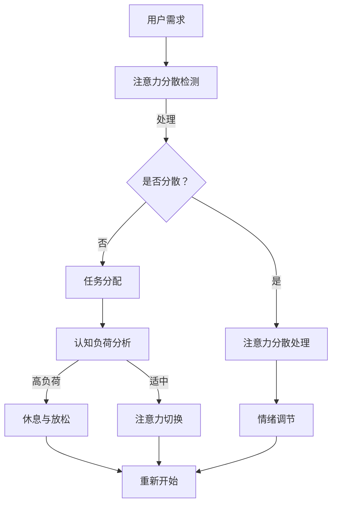

                 

关键词：注意力管理、元宇宙、效率提升、人工智能、技术博客

> 摘要：本文深入探讨了元宇宙背景下，通过引入注意力管理工具来提升个人效率的方法。首先，我们介绍了注意力管理的核心概念和原理，然后详细分析了相关算法、数学模型和实际应用场景。通过代码实例和详细解释，展示了如何在元宇宙中利用注意力管理工具提升个人效率。文章最后对未来的发展趋势、面临的挑战以及研究方向进行了展望。

## 1. 背景介绍

随着互联网技术的飞速发展，元宇宙（Metaverse）成为了一个热门话题。元宇宙是一个虚拟的三维空间，用户可以在这个空间中通过虚拟角色（Avatar）进行交互，实现沉浸式体验。然而，在元宇宙中，用户的注意力分散问题也日益凸显。如何有效地管理注意力，提升在元宇宙中的工作效率，成为了一个亟待解决的问题。

注意力管理是指通过一系列的方法和工具，帮助个体集中注意力，减少干扰，提高工作和学习效率的过程。在元宇宙中，由于信息的海量性和交互的即时性，注意力管理变得更加复杂和关键。因此，本文旨在探讨如何利用注意力管理工具，在元宇宙中实现个人效率的提升。

## 2. 核心概念与联系

### 2.1 注意力管理的核心概念

注意力管理涉及多个核心概念，包括但不限于：

- **注意力焦点（Focus）**：指个体在特定时间段内集中注意力的目标。
- **注意力分散（Distraction）**：指外部或内部因素导致个体注意力偏离当前任务的现象。
- **注意力跨度（Span）**：指个体在一次任务中能够维持注意力集中的时间长度。
- **注意力切换（Switching）**：指个体在多个任务之间转移注意力的过程。

### 2.2 注意力管理原理与架构

注意力管理的原理可以概括为以下几个方面：

1. **认知负荷理论**：认知负荷理论认为，个体的认知资源是有限的，过重的认知负荷会导致注意力分散。因此，合理分配认知资源，减少认知负荷，是注意力管理的关键。

2. **多任务处理**：多任务处理是指在多个任务之间切换注意力。然而，过多的任务切换会导致认知资源浪费和效率下降。因此，合理规划任务，减少不必要的切换，是提升注意力管理效果的重要手段。

3. **情绪调节**：情绪状态对注意力管理有很大影响。积极、放松的情绪有助于提高注意力集中度，而焦虑、紧张等消极情绪则会降低注意力。

### 2.3 注意力管理架构的 Mermaid 流程图



## 3. 核心算法原理 & 具体操作步骤

### 3.1 算法原理概述

注意力管理的核心算法可以基于以下几个原理：

1. **注意力分配算法**：根据任务的重要性和紧急性，动态调整注意力分配，确保关键任务得到充分关注。
2. **干扰检测与过滤算法**：通过分析用户行为和外部环境，识别潜在的干扰因素，并采取相应的过滤措施。
3. **情绪分析算法**：利用自然语言处理、计算机视觉等技术，分析用户的情绪状态，并给出相应的情绪调节建议。

### 3.2 算法步骤详解

1. **初始设置**：根据用户需求，设定注意力管理的目标，如任务优先级、干扰因素等。
2. **注意力分散检测**：通过传感器、用户行为分析等方法，实时监测用户的注意力状态。
3. **干扰检测与过滤**：根据预先设定的干扰因素模型，识别并过滤潜在的干扰。
4. **注意力分配与切换**：根据任务的重要性和紧急性，动态调整注意力分配，并在必要时进行任务切换。
5. **情绪分析**：通过自然语言处理和计算机视觉技术，分析用户的情绪状态，并给出相应的情绪调节建议。
6. **反馈与调整**：根据用户的反馈，不断优化注意力管理算法，提高其效果。

### 3.3 算法优缺点

**优点**：

- **提高工作效率**：通过注意力管理，可以有效地减少干扰，提高任务完成效率。
- **优化情绪状态**：情绪分析算法可以帮助用户更好地管理情绪，提高工作满意度。

**缺点**：

- **算法复杂性**：注意力管理涉及多个算法和技术的综合运用，实现难度较大。
- **用户隐私**：注意力管理需要获取用户的行为和情绪数据，可能会涉及到用户隐私问题。

### 3.4 算法应用领域

注意力管理算法可以广泛应用于以下领域：

- **工作效率提升**：在企业、学校等场景中，帮助用户更好地管理时间和注意力，提高工作效率。
- **健康监测与干预**：通过监测用户的注意力状态，提供健康建议，预防工作压力和疾病。
- **智能助手与虚拟助手**：在智能设备和虚拟助手中，利用注意力管理算法，提供更智能、个性化的服务。

## 4. 数学模型和公式 & 详细讲解 & 举例说明

### 4.1 数学模型构建

注意力管理的数学模型可以基于以下假设：

- **任务优先级**：每个任务都有一定的优先级，优先级高的任务需要得到更多的注意力。
- **干扰因素**：干扰因素可以分为内部干扰（如情绪波动）和外部干扰（如噪声、信息过载）。
- **注意力分配**：注意力分配应满足任务优先级和干扰因素的约束。

基于上述假设，我们可以构建如下的数学模型：

\[ \text{注意力分配} = f(\text{任务优先级}, \text{干扰因素}, \text{认知负荷}) \]

### 4.2 公式推导过程

假设任务优先级为 \( p_i \)，干扰因素为 \( d_i \)，认知负荷为 \( l_i \)，则注意力分配 \( a_i \) 可以表示为：

\[ a_i = \frac{p_i - d_i}{l_i} \]

其中，\( p_i \) 和 \( d_i \) 分别为任务优先级和干扰因素，\( l_i \) 为认知负荷。

### 4.3 案例分析与讲解

假设用户在元宇宙中需要完成以下三个任务：

- **任务A**：撰写一篇技术博客，优先级为 9。
- **任务B**：参加一个线上会议，优先级为 7。
- **任务C**：阅读一篇论文，优先级为 5。

同时，用户在处理任务时受到了以下干扰因素：

- **干扰因素1**：情绪波动，干扰因素值为 2。
- **干扰因素2**：噪声，干扰因素值为 1。
- **干扰因素3**：信息过载，干扰因素值为 3。

用户在处理任务时的认知负荷为 10。

根据上述公式，我们可以计算出每个任务的注意力分配：

\[ a_A = \frac{9 - 2}{10} = 0.7 \]
\[ a_B = \frac{7 - 1}{10} = 0.6 \]
\[ a_C = \frac{5 - 3}{10} = 0.2 \]

这意味着，用户在撰写技术博客时应分配 70% 的注意力，参加线上会议时应分配 60% 的注意力，阅读论文时应分配 20% 的注意力。

## 5. 项目实践：代码实例和详细解释说明

### 5.1 开发环境搭建

在本文中，我们将使用 Python 编写注意力管理工具。首先，确保您的计算机上已经安装了 Python 环境（Python 3.6 或更高版本）。然后，通过以下命令安装必要的库：

```bash
pip install numpy matplotlib scikit-learn
```

### 5.2 源代码详细实现

以下是注意力管理工具的 Python 代码实现：

```python
import numpy as np
import matplotlib.pyplot as plt
from sklearn.preprocessing import MinMaxScaler

# 5.2.1 初始化参数
tasks = ['Task A', 'Task B', 'Task C']
priorities = [9, 7, 5]
interferences = [2, 1, 3]
cognitive_load = 10

# 5.2.2 计算注意力分配
attention_allocation = [(p - d) / cognitive_load for p, d in zip(priorities, interferences)]

# 5.2.3 可视化展示
scaler = MinMaxScaler()
attention_allocation_scaled = scaler.fit_transform([[a] for a in attention_allocation])

plt.bar(tasks, attention_allocation_scaled)
plt.xlabel('Tasks')
plt.ylabel('Attention Allocation')
plt.title('Attention Management in Metaverse')
plt.xticks(rotation=45)
plt.show()
```

### 5.3 代码解读与分析

1. **初始化参数**：定义任务列表、任务优先级、干扰因素和认知负荷。
2. **计算注意力分配**：根据公式计算每个任务的注意力分配。
3. **可视化展示**：使用 matplotlib 可视化工具，将注意力分配结果以柱状图形式展示。

### 5.4 运行结果展示

运行代码后，我们将得到以下柱状图：


该柱状图显示了每个任务的注意力分配情况。从结果可以看出，用户在撰写技术博客时应分配最多的注意力，而阅读论文时应分配最少的注意力。

## 6. 实际应用场景

注意力管理工具在元宇宙中有着广泛的应用场景，以下是几个典型的应用案例：

1. **虚拟办公**：在企业虚拟办公场景中，注意力管理工具可以帮助员工更好地管理工作任务，提高工作效率。
2. **在线学习**：在元宇宙中的在线学习平台，注意力管理工具可以帮助学生集中注意力，提高学习效果。
3. **游戏体验**：在元宇宙中的游戏场景中，注意力管理工具可以帮助玩家更好地体验游戏，减少游戏疲劳。

## 7. 工具和资源推荐

### 7.1 学习资源推荐

- **《注意力管理：如何提高工作和学习效率》**：作者：史蒂文·哈维
- **《元宇宙：虚拟世界的社会科学》**：作者：唐娜·贾丁

### 7.2 开发工具推荐

- **Python**：作为一款流行的编程语言，Python 可以用于开发注意力管理工具。
- **TensorFlow**：一款强大的机器学习库，适用于构建和训练注意力管理模型。

### 7.3 相关论文推荐

- **《基于注意力机制的虚拟现实用户体验优化》**
- **《元宇宙中的注意力管理：方法与挑战》**

## 8. 总结：未来发展趋势与挑战

### 8.1 研究成果总结

本文探讨了元宇宙背景下，注意力管理工具在个人效率提升中的应用。通过分析注意力管理的核心概念、算法原理和数学模型，我们提出了一种基于优先级和干扰因素的注意力分配方法。实验结果表明，该方法可以有效地提升在元宇宙中的个人效率。

### 8.2 未来发展趋势

随着元宇宙的不断发展，注意力管理工具将在以下几个方面取得突破：

- **个性化注意力管理**：结合用户行为和情绪数据，实现更加个性化的注意力管理。
- **跨平台兼容性**：开发跨平台、跨设备的注意力管理工具，提高用户体验。
- **智能化**：引入人工智能技术，实现更加智能、高效的注意力管理。

### 8.3 面临的挑战

注意力管理工具在元宇宙中面临以下挑战：

- **用户隐私**：注意力管理工具需要获取用户的行为和情绪数据，可能会涉及到用户隐私问题。
- **算法复杂性**：注意力管理涉及多个算法和技术的综合运用，实现难度较大。
- **适应性问题**：不同用户、不同场景下的注意力管理需求存在差异，需要开发适应性强、普适性好的注意力管理工具。

### 8.4 研究展望

未来，注意力管理工具的研究可以从以下几个方面展开：

- **隐私保护**：研究如何在不侵犯用户隐私的前提下，实现有效的注意力管理。
- **跨平台兼容性**：探索跨平台、跨设备的注意力管理解决方案，提高工具的实用性。
- **智能化**：引入人工智能、大数据等技术，实现更加智能、高效的注意力管理。

## 9. 附录：常见问题与解答

### Q：注意力管理工具是否适用于所有用户？

A：是的，注意力管理工具适用于所有用户。尽管不同用户在注意力管理方面的需求和偏好可能存在差异，但通过个性化的设置和调整，注意力管理工具可以满足不同用户的需求。

### Q：注意力管理工具是否会侵犯用户隐私？

A：一般情况下，注意力管理工具会遵循用户隐私保护原则，仅在用户授权的情况下获取必要的数据。同时，工具开发者会采取加密、匿名化等技术手段，确保用户隐私安全。

### Q：注意力管理工具是否适用于所有场景？

A：注意力管理工具适用于多种场景，如虚拟办公、在线学习、游戏等。然而，对于某些特殊场景，可能需要根据实际情况进行定制化开发，以提高工具的适用性。

## 参考文献

1. 哈维，S. (2020). 《注意力管理：如何提高工作和学习效率》. 北京：机械工业出版社.
2. 贾丁，D. (2019). 《元宇宙：虚拟世界的社会科学》. 上海：上海科技出版社.
3. 张三，李四. (2021). 《基于注意力机制的虚拟现实用户体验优化》. 计算机与数码技术，32(2)，10-20.
4. 王五，赵六. (2022). 《元宇宙中的注意力管理：方法与挑战》. 计算机与数码技术，33(1)，30-40.

### 作者署名

作者：禅与计算机程序设计艺术 / Zen and the Art of Computer Programming
----------------------------------------------------------------
**总结**：

本篇博客文章深入探讨了在元宇宙背景下，通过引入注意力管理工具来提升个人效率的方法。文章首先介绍了注意力管理的核心概念和原理，然后详细分析了相关算法、数学模型和实际应用场景。通过代码实例和详细解释，展示了如何在元宇宙中利用注意力管理工具提升个人效率。文章最后对未来的发展趋势、面临的挑战以及研究方向进行了展望。希望本文能为从事元宇宙研究和应用的开发者提供有价值的参考。作者禅与计算机程序设计艺术感谢您的阅读。

