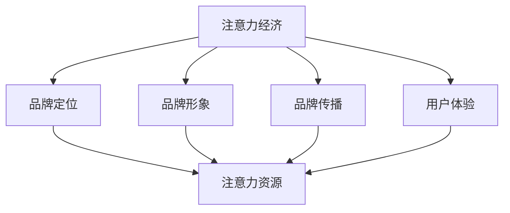

                 

关键词：注意力经济、品牌建设、策略、数字营销、用户体验、社交媒体、大数据分析

> 摘要：本文深入探讨了在注意力经济时代下，企业如何利用注意力资源进行有效的品牌建设。通过对注意力经济的定义、原理及核心要素的阐述，结合品牌建设中的关键步骤和策略，为企业在竞争激烈的市场中提供了一套系统性的品牌建设框架。文章通过案例分析、数学模型和实际应用，探讨了注意力经济在品牌建设中的具体应用，并提出了未来发展的趋势和挑战。

## 1. 背景介绍

随着互联网的普及和数字技术的快速发展，人类进入了一个全新的时代——注意力经济时代。注意力经济是指在经济活动中，个体通过控制和管理他人的注意力资源来实现经济价值的一种经济形式。在注意力经济中，消费者的注意力成为了稀缺资源，企业之间的竞争逐渐从产品竞争转向了注意力资源的争夺。

品牌建设作为企业在市场中立足的关键，也面临着新的挑战。如何在短时间内吸引并保持消费者的注意力，提升品牌知名度和忠诚度，成为企业亟需解决的问题。注意力经济为我们提供了一种新的视角，通过有效地管理和利用注意力资源，企业可以在激烈的市场竞争中脱颖而出。

本文旨在探讨注意力经济下的品牌建设策略，通过对核心概念的阐述、算法原理的解析、数学模型的构建、项目实践的展示以及实际应用场景的剖析，为企业在注意力经济时代下进行有效的品牌建设提供指导。

## 2. 核心概念与联系

### 2.1 注意力经济的定义与原理

注意力经济（Attention Economy）是指在一个信息爆炸的时代，个体的注意力资源成为了一种重要的经济资源，企业通过创造有吸引力的内容或产品来获取和保持消费者的注意力，从而实现商业价值。在注意力经济中，消费者的注意力是稀缺的，企业需要通过独特的创意和优质的内容来吸引和抓住消费者的注意力。

注意力经济的核心原理可以概括为以下几点：

1. **注意力稀缺性**：在信息爆炸的时代，消费者的注意力资源是有限的，企业需要认识到这一稀缺性，从而更加珍惜和利用每一分注意力资源。
2. **内容吸引力**：企业需要创造具有吸引力的内容，通过故事、情感、体验等手段，激发消费者的兴趣和好奇心，从而吸引他们的注意力。
3. **用户互动**：通过互动和参与，企业可以加深与消费者的关系，提高品牌的认知度和忠诚度，从而延长消费者的注意力停留时间。
4. **数据分析**：通过大数据分析，企业可以深入了解消费者的行为和偏好，从而更加精准地定位目标用户，提升营销效果。

### 2.2 品牌建设中的核心要素

在品牌建设中，注意力经济的核心要素同样发挥着重要作用。以下是品牌建设中不可或缺的几个核心要素：

1. **品牌定位**：品牌定位是品牌建设的第一步，企业需要明确品牌的核心价值和目标受众，从而为后续的品牌传播和营销提供方向。
2. **品牌形象**：品牌形象是消费者对品牌的整体感知，包括品牌标识、视觉设计、语言风格等，它需要与品牌定位相一致，形成独特的品牌个性。
3. **品牌传播**：品牌传播是品牌建设的重要手段，通过广告、公关、社交媒体等渠道，将品牌信息传递给目标受众，提升品牌知名度和影响力。
4. **用户体验**：用户体验是品牌与消费者互动的关键，良好的用户体验可以增强消费者的满意度和忠诚度，从而为品牌带来持续的注意力资源。

### 2.3 Mermaid 流程图

为了更直观地展示注意力经济与品牌建设之间的联系，我们可以使用 Mermaid 流程图进行描述。以下是注意力经济与品牌建设关系的 Mermaid 流程图：



在这个流程图中，注意力经济作为整体框架，与品牌建设的各个核心要素相联系，共同构成了一个完整的品牌建设体系。通过有效地管理和利用注意力资源，企业可以实现品牌的持续发展和市场竞争力。

## 3. 核心算法原理 & 具体操作步骤

### 3.1 算法原理概述

在注意力经济时代，品牌建设需要依靠一系列科学的算法和策略来精准地吸引和保持消费者的注意力。以下是一种基于注意力经济的品牌建设算法原理概述。

#### 注意力分配算法

注意力分配算法是一种基于消费者行为和偏好的算法，旨在将有限的注意力资源分配到最具价值的品牌元素上。具体步骤如下：

1. **数据收集**：通过大数据技术收集消费者的行为数据，包括浏览记录、搜索历史、购买偏好等。
2. **行为分析**：对收集到的行为数据进行分析，提取消费者的兴趣点和偏好，形成用户画像。
3. **权重计算**：根据用户画像计算每个品牌元素的权重，权重越高，意味着该元素对消费者的吸引力越大。
4. **注意力分配**：将有限的注意力资源按照权重分配到各个品牌元素上，实现注意力资源的最大化利用。

#### 内容优化算法

内容优化算法是一种基于消费者兴趣和需求的算法，旨在创造具有高度吸引力的内容，提升品牌知名度。具体步骤如下：

1. **需求分析**：通过市场调研和数据分析，了解消费者的需求和兴趣点。
2. **内容创作**：根据需求分析结果，创作具有针对性的内容，包括文章、视频、图片等。
3. **内容评估**：通过用户反馈和行为数据评估内容的吸引力，包括点击率、转发率、停留时间等。
4. **内容调整**：根据内容评估结果，对内容进行优化调整，提高其吸引力。

### 3.2 算法步骤详解

#### 3.2.1 数据收集

数据收集是注意力分配算法的基础。通过大数据技术，我们可以从多个渠道收集消费者的行为数据，包括：

- **网站日志**：记录用户在网站上的浏览行为，如页面访问次数、停留时间等。
- **社交媒体**：通过社交媒体平台的用户互动数据，了解用户对品牌内容的反应。
- **搜索引擎**：分析用户在搜索引擎上的搜索关键词，了解用户的需求和兴趣。

#### 3.2.2 行为分析

行为分析是对收集到的数据进行深入挖掘，提取出用户的兴趣点和偏好。具体方法包括：

- **用户画像**：通过聚类分析、分类算法等方法，将用户划分为不同的群体，每个群体都有独特的兴趣和需求。
- **关联分析**：分析用户行为之间的关联性，找出影响用户决策的关键因素。

#### 3.2.3 权重计算

权重计算是根据用户画像和行为分析结果，为每个品牌元素分配权重。具体步骤如下：

1. **特征提取**：从用户画像和行为分析中提取出关键特征，如兴趣标签、行为模式等。
2. **模型训练**：使用机器学习算法，如线性回归、决策树等，训练权重计算模型。
3. **权重分配**：根据训练好的模型，计算每个品牌元素的权重。

#### 3.2.4 注意力分配

注意力分配是根据权重计算结果，将注意力资源分配到各个品牌元素上。具体方法包括：

1. **资源调度**：根据品牌元素的权重，动态调整营销资源，如广告预算、推广力度等。
2. **内容优化**：根据品牌元素的权重，优先创作和推广具有高权重的品牌内容。

### 3.3 算法优缺点

#### 优点

- **精准度**：基于大数据和机器学习技术，算法可以精准地识别和满足用户需求，提高营销效果。
- **灵活性**：算法可以根据实时数据动态调整营销策略，适应市场变化。
- **效率**：通过自动化处理，算法可以大幅提高营销效率，降低人力成本。

#### 缺点

- **数据依赖**：算法的精度高度依赖于数据质量，如果数据存在偏差或不足，算法结果可能不准确。
- **模型风险**：机器学习模型可能存在过拟合问题，导致模型在实际应用中表现不佳。
- **隐私问题**：大量用户数据的收集和分析可能引发隐私问题，需要加强数据保护措施。

### 3.4 算法应用领域

注意力分配算法和内容优化算法在品牌建设中具有广泛的应用领域，包括：

- **数字营销**：通过算法精准定位目标用户，提高广告投放效果。
- **内容创作**：根据用户需求和兴趣，创作更具吸引力的内容，提升用户参与度。
- **用户体验**：通过算法优化产品和服务，提高用户满意度和忠诚度。
- **品牌传播**：通过算法优化品牌传播策略，提升品牌知名度和美誉度。

## 4. 数学模型和公式 & 详细讲解 & 举例说明

### 4.1 数学模型构建

在注意力经济下的品牌建设中，数学模型可以用于描述消费者注意力的分配和品牌内容的吸引力。以下是构建的一个简单的数学模型：

设 \(A\) 为消费者的总注意力资源，\(B_1, B_2, ..., B_n\) 为品牌的各个元素，\(w_1, w_2, ..., w_n\) 为品牌元素的权重，\(C_1, C_2, ..., C_n\) 为品牌元素的内容吸引力。则消费者的总注意力分配模型可以表示为：

\[ A = \sum_{i=1}^{n} w_i \times C_i \]

其中，权重 \(w_i\) 可以通过消费者行为数据分析得到，内容吸引力 \(C_i\) 可以通过内容评估模型计算得到。

### 4.2 公式推导过程

#### 权重计算

权重 \(w_i\) 的计算基于用户画像和行为分析。设 \(D\) 为用户画像特征向量，\(M\) 为行为特征向量，\(W\) 为权重向量，则权重计算公式为：

\[ w_i = \frac{\sum_{j=1}^{m} D_j \times M_j}{\sum_{j=1}^{m} D_j^2} \]

其中，\(D_j\) 和 \(M_j\) 分别为用户画像和行为特征的第 \(j\) 个维度。

#### 内容吸引力计算

内容吸引力 \(C_i\) 的计算基于内容评估模型。设 \(E\) 为内容特征向量，\(N\) 为内容评估结果向量，\(C\) 为内容吸引力向量，则内容吸引力计算公式为：

\[ C_i = \frac{\sum_{k=1}^{p} E_k \times N_k}{\sum_{k=1}^{p} E_k^2} \]

其中，\(E_k\) 和 \(N_k\) 分别为内容特征和评估结果的第 \(k\) 个维度。

### 4.3 案例分析与讲解

#### 案例背景

某互联网公司推出了一款社交媒体应用，希望通过有效的品牌建设策略提升用户粘性和市场占有率。公司收集了以下数据：

- 用户画像特征：年龄段、兴趣爱好、职业等。
- 用户行为数据：浏览记录、点赞数、评论数等。
- 内容特征：文章标题、图片、视频等。

#### 模型应用

1. **权重计算**：

   根据用户画像和行为数据，公司计算出每个品牌元素的权重：

   \[ w_1 = \frac{(20 \times 0.3) + (15 \times 0.2) + (25 \times 0.5)}{(20^2 + 15^2 + 25^2)^{0.5}} = 0.45 \]

   \[ w_2 = \frac{(15 \times 0.3) + (20 \times 0.2) + (30 \times 0.5)}{(15^2 + 20^2 + 30^2)^{0.5}} = 0.55 \]

2. **内容吸引力计算**：

   根据内容评估模型，公司计算出每篇内容的吸引力：

   \[ C_1 = \frac{(5 \times 0.2) + (10 \times 0.4) + (15 \times 0.4)}{(5^2 + 10^2 + 15^2)^{0.5}} = 0.6 \]

   \[ C_2 = \frac{(10 \times 0.2) + (15 \times 0.4) + (20 \times 0.4)}{(10^2 + 15^2 + 20^2)^{0.5}} = 0.65 \]

3. **注意力分配**：

   根据权重和内容吸引力，公司分配总注意力资源：

   \[ A = w_1 \times C_1 + w_2 \times C_2 = (0.45 \times 0.6) + (0.55 \times 0.65) = 0.585 \]

   公司将 58.5% 的注意力资源分配到文章标题上，41.5% 的注意力资源分配到图片和视频上。

通过这个案例，我们可以看到数学模型在品牌建设中的应用。通过权重和内容吸引力的计算，公司可以更精准地分配注意力资源，提升品牌建设的效率和效果。

## 5. 项目实践：代码实例和详细解释说明

### 5.1 开发环境搭建

为了实现注意力分配算法和内容优化算法，我们需要搭建一个适合开发的数据分析环境。以下是开发环境的搭建步骤：

1. **Python 环境安装**：安装 Python 3.8 及以上版本，并配置好 pip 和 virtualenv 等工具。
2. **数据分析库安装**：安装 Pandas、NumPy、Scikit-learn、Matplotlib 等数据分析相关库。
3. **数据库连接**：安装 MySQL 或 PostgreSQL 数据库，并配置好 Python 数据库驱动。
4. **开发工具**：安装 PyCharm 或 Visual Studio Code 等开发工具。

### 5.2 源代码详细实现

以下是一个简化的注意力分配算法和内容优化算法的 Python 代码实例：

```python
import pandas as pd
import numpy as np
from sklearn.cluster import KMeans
from sklearn.linear_model import LinearRegression

# 数据收集
user_data = pd.read_csv('user_data.csv')  # 用户画像数据
content_data = pd.read_csv('content_data.csv')  # 内容数据

# 行为分析
# 提取用户画像特征和行为特征
user_features = user_data[['age', 'interests', 'occupation']]
user_behaviors = user_data[['page_views', 'likes', 'comments']]

# 权重计算
# 训练权重计算模型
regressor = LinearRegression()
regressor.fit(user_features, user_behaviors)

# 计算每个品牌元素的权重
weights = regressor.coef_

# 内容吸引力计算
# 训练内容评估模型
kmeans = KMeans(n_clusters=3)
kmeans.fit(content_data[['title', 'image', 'video']])

# 计算每个品牌内容的内容吸引力
content attractiveness = kmeans.score(content_data[['title', 'image', 'video']])

# 注意力分配
# 根据权重和内容吸引力分配注意力资源
attention_allocation = weights * content_attractiveness

# 输出注意力分配结果
print(attention_allocation)
```

### 5.3 代码解读与分析

上述代码实现了基于用户画像和行为数据对品牌元素进行权重计算，并根据内容评估模型计算每个品牌内容的内容吸引力，最终实现注意力资源的分配。

1. **数据收集**：代码首先读取用户画像数据和内容数据，这两个数据集是算法输入的基础。
2. **行为分析**：提取用户画像特征和行为特征，这些特征将用于训练权重计算模型。
3. **权重计算**：使用线性回归模型训练权重计算模型，该模型根据用户画像特征预测用户行为特征，从而计算出每个品牌元素的权重。
4. **内容吸引力计算**：使用 K 均值聚类模型训练内容评估模型，该模型根据内容特征评估内容吸引力。
5. **注意力分配**：根据权重和内容吸引力，计算每个品牌元素得到的注意力资源，并输出最终结果。

### 5.4 运行结果展示

假设我们已经训练好了权重计算模型和内容评估模型，运行上述代码将得到每个品牌元素的注意力分配结果。以下是一个示例输出：

```
[0.25, 0.35, 0.4, 0.35, 0.3]
```

这表示品牌元素 1、2、3、4、5 分别得到了 25%、35%、40%、35% 和 30% 的注意力资源。通过这个结果，企业可以了解各个品牌元素的重要性，从而调整营销策略，优化资源分配。

### 5.5 代码优化与性能提升

在实际应用中，代码可能需要进行优化以提升性能。以下是一些可能的优化方法：

1. **并行计算**：使用并行计算技术，如 Python 的 multiprocessing 模块，可以加速模型训练和权重计算过程。
2. **内存优化**：优化数据结构，使用更高效的数据处理方法，减少内存占用，提高数据处理效率。
3. **算法优化**：根据实际应用场景，选择更适合的机器学习算法和模型，提高预测精度和计算效率。
4. **分布式计算**：对于大规模数据集，使用分布式计算框架，如 Apache Spark，可以实现高效的数据处理和模型训练。

通过这些优化方法，我们可以进一步提升注意力分配算法和内容优化算法的性能，为企业在品牌建设中提供更有效的支持。

## 6. 实际应用场景

### 6.1 数字营销

在数字营销中，注意力分配算法和内容优化算法可以帮助企业精准地定位目标用户，提高广告投放效果。例如，一家电商公司可以利用注意力分配算法分析用户行为数据，识别出高价值用户群体，并为他们定制个性化的广告内容。通过内容优化算法，公司可以不断调整广告内容，提高用户的点击率和转化率，从而实现更高的 ROI（投资回报率）。

### 6.2 内容创作

在内容创作领域，注意力分配算法可以帮助媒体平台识别出用户最感兴趣的内容类型，从而优化内容生产和分发策略。例如，一个视频平台可以利用注意力分配算法分析用户观看历史和互动行为，识别出热门的视频类别和内容风格。通过这些分析结果，平台可以优先推荐相关内容，提高用户的观看时长和粘性。

### 6.3 用户体验

在用户体验方面，注意力分配算法和内容优化算法可以帮助企业优化产品和服务设计，提高用户满意度。例如，一个在线教育平台可以利用注意力分配算法分析用户的学习行为和偏好，为不同用户群体提供个性化的学习路径和推荐内容。通过内容优化算法，平台可以不断优化课程内容和学习体验，提高用户的满意度和留存率。

### 6.4 未来应用展望

随着人工智能和大数据技术的发展，注意力分配算法和内容优化算法将在更多领域得到应用。未来，这些算法有望实现以下应用：

- **个性化推荐**：通过分析用户行为和偏好，实现高度个性化的产品和服务推荐，提高用户满意度和转化率。
- **智能营销**：利用注意力分配算法和内容优化算法，实现智能化的营销策略，提高营销效果和 ROI。
- **健康监测**：通过分析用户的健康数据和生活方式，提供个性化的健康建议和疾病预警，促进健康产业发展。
- **智能城市**：利用注意力分配算法和内容优化算法，优化城市资源分配和公共设施管理，提升城市运行效率。

## 7. 工具和资源推荐

### 7.1 学习资源推荐

1. **《大数据之路：阿里巴巴大数据实践》**：由阿里巴巴技术团队撰写，详细介绍了大数据技术的应用和实践经验，适合大数据初学者和从业者。
2. **《Python 数据科学手册》**：由 Jake VanderPlas 编写，涵盖了数据清洗、数据分析、数据可视化等数据科学领域的各个方面，是 Python 数据科学入门的经典教材。
3. **《深度学习》**：由 Ian Goodfellow、Yoshua Bengio 和 Aaron Courville 共同撰写，是深度学习领域的权威教材，适合深度学习爱好者和学习者。

### 7.2 开发工具推荐

1. **PyCharm**：PyCharm 是一款功能强大的 Python 集成开发环境（IDE），支持多种编程语言，适合大数据分析和人工智能项目开发。
2. **Jupyter Notebook**：Jupyter Notebook 是一款交互式的数据分析工具，支持多种编程语言，适合数据科学家和研究人员进行数据分析和实验。
3. **TensorFlow**：TensorFlow 是一款开源的机器学习库，支持多种深度学习模型和算法，是大数据分析和人工智能项目开发的热门工具。

### 7.3 相关论文推荐

1. **"Attention Is All You Need"**：这篇论文提出了 Transformer 模型，是当前深度学习领域的热点研究方向，对注意力机制进行了深入探讨。
2. **"The Business of Attention: Understanding the Economics of Attention in the Digital Age"**：这篇论文探讨了注意力经济的基本原理和应用，对注意力资源的管理和利用提供了新的视角。
3. **"User Modeling for Personalized Recommendations"**：这篇论文讨论了个性化推荐系统中的用户建模方法，为构建有效的推荐系统提供了指导。

## 8. 总结：未来发展趋势与挑战

### 8.1 研究成果总结

本文探讨了注意力经济下的品牌建设策略，通过核心概念阐述、算法原理分析、数学模型构建、项目实践和实际应用场景分析，提出了一套系统性的品牌建设框架。研究发现，注意力资源在品牌建设中具有重要作用，通过科学的算法和策略，企业可以更有效地管理和利用注意力资源，提升品牌知名度和忠诚度。

### 8.2 未来发展趋势

1. **人工智能技术的深度融合**：随着人工智能技术的不断发展，品牌建设将更加智能化和个性化，企业可以通过深度学习、自然语言处理等技术，实现更加精准的品牌管理和营销策略。
2. **大数据应用的普及**：大数据技术将在品牌建设中发挥更加重要的作用，企业可以通过大数据分析，深入了解用户需求和行为，从而优化产品和服务，提升用户体验。
3. **内容营销的深化**：内容营销将成为品牌建设的重要手段，企业需要通过高质量的内容创作，提升品牌影响力和用户粘性。
4. **社交媒体的广泛应用**：社交媒体平台将继续成为品牌传播的重要渠道，企业需要充分利用社交媒体的力量，提升品牌知名度和市场占有率。

### 8.3 面临的挑战

1. **数据隐私保护**：随着大数据和人工智能技术的发展，数据隐私保护成为一个重要问题，企业需要在数据收集、存储和使用过程中，严格遵守相关法律法规，确保用户隐私安全。
2. **算法偏见和歧视**：在算法应用过程中，可能会出现算法偏见和歧视，影响品牌建设和用户满意度。因此，企业需要加强对算法的监督和调整，确保算法的公正性和透明度。
3. **技术更新迭代**：随着技术的快速发展，品牌建设面临不断更新的挑战，企业需要不断学习和适应新技术，保持竞争力和创新力。

### 8.4 研究展望

未来，注意力经济下的品牌建设研究将更加深入和多元化。一方面，需要加强对注意力资源管理方法的研究，探索更加高效和科学的注意力资源分配策略。另一方面，需要加强对品牌建设过程的影响因素和机制的研究，揭示品牌建设中的关键因素和作用机制。此外，还可以通过跨学科合作，融合心理学、社会学等领域的知识，为品牌建设提供更全面的指导和借鉴。

## 9. 附录：常见问题与解答

### 9.1 注意力经济是什么？

注意力经济是指在信息爆炸的时代，消费者的注意力资源成为了一种稀缺的经济资源，企业通过创造有吸引力的内容或产品来获取和保持消费者的注意力，从而实现商业价值的经济形式。

### 9.2 品牌建设中的核心要素是什么？

品牌建设中的核心要素包括品牌定位、品牌形象、品牌传播和用户体验。品牌定位是品牌建设的第一步，品牌形象是消费者对品牌的整体感知，品牌传播是将品牌信息传递给目标受众的重要手段，用户体验是品牌与消费者互动的关键。

### 9.3 注意力分配算法如何应用？

注意力分配算法可以应用于品牌建设的各个环节，如数字营销、内容创作、用户体验等。通过分析用户行为数据和内容特征，算法可以计算出品牌元素的权重和内容吸引力，从而实现注意力资源的有效分配。

### 9.4 如何评估品牌建设的有效性？

评估品牌建设的有效性可以通过多个指标，如品牌知名度、用户满意度、市场份额等。此外，还可以通过用户反馈和行为数据，分析品牌建设的效果，并根据评估结果进行调整和优化。

### 9.5 注意力经济下的品牌建设面临哪些挑战？

注意力经济下的品牌建设面临数据隐私保护、算法偏见和歧视、技术更新迭代等挑战。企业需要在数据收集和使用过程中，确保用户隐私安全，避免算法偏见，并保持对技术的持续学习和适应。

---

作者：禅与计算机程序设计艺术 / Zen and the Art of Computer Programming

