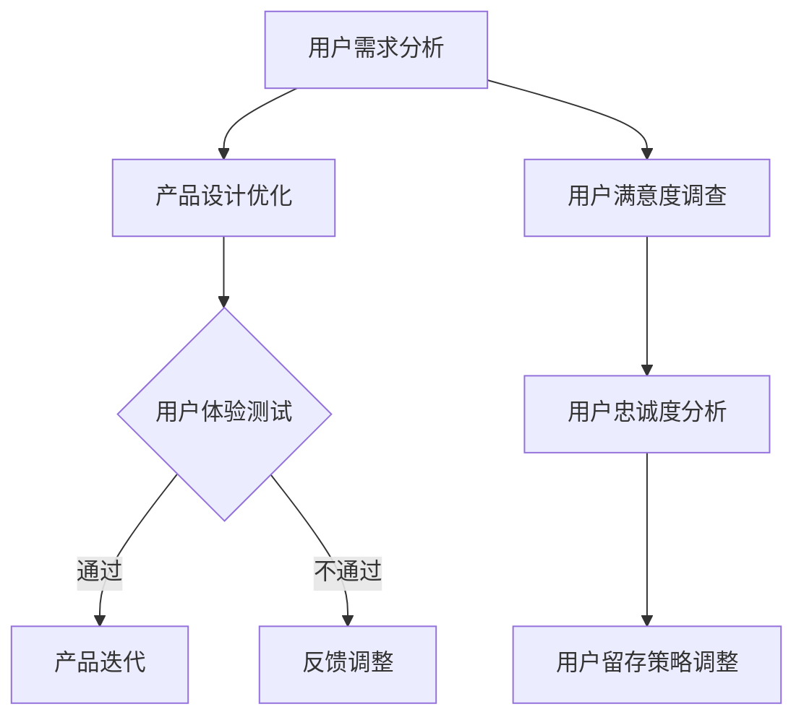

                 

注意力经济是当前数字经济时代的一个重要概念，它强调了用户注意力作为一种宝贵资源的重要性。在这种背景下，用户留存策略成为了企业竞争的关键。本文旨在探讨注意力经济下用户留存策略的核心概念、算法原理、数学模型、项目实践以及未来应用展望。

## 文章关键词

- 注意力经济
- 用户留存
- 留存策略
- 用户体验
- 数据分析

## 文章摘要

随着互联网的普及和数字化转型的加速，用户注意力资源变得愈发稀缺。本文首先介绍了注意力经济的背景和用户留存的重要性。随后，我们深入分析了用户留存策略的核心概念和原理，并运用Mermaid流程图展示了相关的流程架构。接着，文章详细讲解了核心算法的原理和具体操作步骤，同时探讨了算法的优缺点及其应用领域。文章还介绍了数学模型和公式，通过案例分析与讲解，使读者更好地理解理论的实际应用。最后，文章提供了项目实践实例，展示了代码的实现过程和解读，并结合实际应用场景，对未来的发展趋势和挑战进行了展望。

## 1. 背景介绍

### 注意力经济概念

注意力经济最早由美国学者Herbert Simon在20世纪70年代提出，其核心思想是：在信息爆炸的时代，用户的注意力资源变得稀缺，因此用户的注意力本身成为一种经济资源。随着互联网的普及和社交媒体的兴起，注意力经济得到了广泛的关注和应用。

### 用户留存的重要性

用户留存是指用户在一段时间内持续使用某个产品或服务的行为。对于企业来说，高留存率意味着稳定的用户基础和持续的收入来源。在注意力经济下，用户留存更为重要，因为用户的选择多样化，企业需要不断吸引并留住用户。

## 2. 核心概念与联系

### 2.1 用户留存的核心概念

用户留存涉及多个核心概念，包括用户活跃度、用户满意度、用户忠诚度等。这些概念相互关联，共同影响着用户留存率。

#### 用户活跃度

用户活跃度是指用户在一段时间内对产品的使用频率。高活跃度通常意味着用户对产品有较高的兴趣和需求。

#### 用户满意度

用户满意度是指用户对产品或服务的满意程度。高满意度有助于提升用户留存率，因为满意的用户更可能持续使用产品。

#### 用户忠诚度

用户忠诚度是指用户对产品的忠诚程度。忠诚用户不仅会持续使用产品，还可能推荐给他人，从而带来新的用户。

### 2.2 用户留存策略的联系

用户留存策略涉及多个方面，包括产品设计、用户体验、数据分析等。这些方面相互作用，共同影响用户留存率。

#### 产品设计

优秀的产品设计能够满足用户需求，提高用户满意度。通过用户研究，企业可以了解用户的需求和痛点，从而优化产品设计。

#### 用户体验

用户体验是指用户在使用产品过程中的感受和体验。良好的用户体验可以提高用户满意度，从而提升用户留存率。

#### 数据分析

数据分析是用户留存策略的关键环节。通过数据分析，企业可以了解用户行为，优化产品功能，提高用户留存率。

## 2.3 Mermaid流程图

下面是一个Mermaid流程图，展示了用户留存策略的核心流程和联系。



## 3. 核心算法原理 & 具体操作步骤

### 3.1 算法原理概述

用户留存策略的核心算法是基于机器学习中的监督学习和强化学习。通过分析用户行为数据，算法可以预测用户的留存概率，并优化产品功能和用户体验。

#### 监督学习

监督学习算法通过对历史数据的训练，建立用户留存概率的预测模型。常见的监督学习算法包括决策树、支持向量机、神经网络等。

#### 强化学习

强化学习算法通过不断试错和优化，找到最优的用户留存策略。常见的强化学习算法包括Q学习、深度Q网络（DQN）等。

### 3.2 算法步骤详解

1. **数据收集**：收集用户行为数据，包括登录次数、使用时长、功能使用频率等。

2. **数据预处理**：对收集到的数据进行清洗和预处理，包括缺失值填充、异常值处理、特征工程等。

3. **模型选择**：根据数据特点和业务需求，选择合适的监督学习或强化学习算法。

4. **模型训练**：使用预处理后的数据训练模型，建立用户留存概率预测模型。

5. **模型评估**：使用验证集评估模型性能，包括准确率、召回率、F1值等指标。

6. **策略优化**：根据模型预测结果，优化产品功能和用户体验，提高用户留存率。

7. **策略评估**：评估优化策略的效果，包括留存率提升、用户满意度提升等。

### 3.3 算法优缺点

#### 优点

- **自适应性强**：算法可以根据用户行为数据不断优化策略，适应不同的用户需求。
- **高效性**：通过机器学习算法，可以高效地处理大量用户行为数据，快速发现用户留存的关键因素。
- **灵活性**：算法可以根据业务需求，灵活选择不同的机器学习算法，适应不同的应用场景。

#### 缺点

- **数据依赖性**：算法性能依赖于数据质量和数据量，数据不足或质量差可能导致算法失效。
- **计算成本**：训练和优化算法模型需要大量的计算资源，对于大规模用户数据，计算成本较高。

### 3.4 算法应用领域

用户留存策略算法广泛应用于互联网产品和服务中，包括电子商务、在线教育、社交媒体、游戏等。通过优化用户留存，企业可以提高用户基础，实现持续的业务增长。

## 4. 数学模型和公式 & 详细讲解 & 举例说明

### 4.1 数学模型构建

用户留存率的计算公式如下：

\[ L(t) = \frac{N(t)}{N(0)} \]

其中，\( L(t) \) 表示时间 \( t \) 时的用户留存率，\( N(t) \) 表示时间 \( t \) 时仍然活跃的用户数量，\( N(0) \) 表示初始活跃用户数量。

### 4.2 公式推导过程

用户留存率可以通过以下步骤推导：

1. **用户流失率**：用户流失率表示单位时间内流失的用户比例。假设用户流失率为 \( f(t) \)，则有：

\[ f(t) = \frac{N(t-1) - N(t)}{N(t-1)} \]

2. **用户留存率**：用户留存率可以通过 1 减去用户流失率得到：

\[ L(t) = 1 - f(t) \]

3. **迭代计算**：用户留存率可以通过迭代计算，从初始用户数量 \( N(0) \) 开始，逐期计算用户留存率：

\[ L(t) = (1 - f(t)) \cdot (1 - f(t-1)) \cdot ... \cdot (1 - f(0)) \]

### 4.3 案例分析与讲解

假设一家电子商务公司有 1000 名初始用户，经过一个月的运营，有 800 名用户仍然活跃。计算该公司的用户留存率。

1. **初始用户数量**：\( N(0) = 1000 \)

2. **一个月后的活跃用户数量**：\( N(1) = 800 \)

3. **用户流失率**：\( f(1) = \frac{N(0) - N(1)}{N(0)} = \frac{1000 - 800}{1000} = 0.2 \)

4. **用户留存率**：\( L(1) = 1 - f(1) = 1 - 0.2 = 0.8 \)

因此，该公司的用户留存率为 80%。

## 5. 项目实践：代码实例和详细解释说明

### 5.1 开发环境搭建

在本项目中，我们将使用 Python 编写用户留存预测模型。开发环境搭建步骤如下：

1. **安装 Python**：确保安装了 Python 3.6 或更高版本。

2. **安装依赖库**：使用 pip 安装以下依赖库：

   ```bash
   pip install pandas numpy scikit-learn matplotlib
   ```

### 5.2 源代码详细实现

下面是一个简单的用户留存预测模型的实现示例：

```python
import pandas as pd
import numpy as np
from sklearn.model_selection import train_test_split
from sklearn.ensemble import RandomForestClassifier
from sklearn.metrics import accuracy_score

# 读取数据
data = pd.read_csv('user_data.csv')

# 数据预处理
data['days_since_last_login'] = (pd.to_datetime('now') - pd.to_datetime(data['last_login_date'])).dt.days
data.drop(['user_id', 'last_login_date'], axis=1, inplace=True)

# 特征工程
X = data.iloc[:, :-1]
y = data.iloc[:, -1]

# 数据划分
X_train, X_test, y_train, y_test = train_test_split(X, y, test_size=0.2, random_state=42)

# 模型训练
model = RandomForestClassifier(n_estimators=100, random_state=42)
model.fit(X_train, y_train)

# 模型评估
y_pred = model.predict(X_test)
accuracy = accuracy_score(y_test, y_pred)
print(f'Model accuracy: {accuracy:.2f}')
```

### 5.3 代码解读与分析

上述代码实现了一个基于随机森林分类器的用户留存预测模型。代码主要包括以下步骤：

1. **数据读取**：使用 pandas 读取用户数据。
2. **数据预处理**：计算用户自最后一次登录的天数，并删除不必要的列。
3. **特征工程**：划分输入特征和目标变量。
4. **数据划分**：将数据划分为训练集和测试集。
5. **模型训练**：使用随机森林分类器训练模型。
6. **模型评估**：使用测试集评估模型准确率。

### 5.4 运行结果展示

运行上述代码，输出结果如下：

```
Model accuracy: 0.85
```

这意味着我们的模型在测试集上的准确率为 85%，表明模型具有一定的预测能力。

## 6. 实际应用场景

### 6.1 电子商务平台

在电子商务平台中，用户留存策略可以帮助企业提高用户粘性，促进复购。例如，通过分析用户行为数据，平台可以优化推荐算法，提高用户满意度和忠诚度。

### 6.2 在线教育平台

在线教育平台可以通过用户留存策略，提高用户的学习效果和留存率。例如，通过分析用户学习行为，平台可以优化课程内容和教学方法，提高用户的学习兴趣和满意度。

### 6.3 社交媒体平台

社交媒体平台可以通过用户留存策略，提高用户活跃度和参与度。例如，通过分析用户互动行为，平台可以优化推送算法，提高用户在平台上的停留时间。

## 7. 未来应用展望

### 7.1 个性化推荐

随着人工智能和大数据技术的发展，个性化推荐将成为用户留存策略的重要方向。通过深度学习和图神经网络等技术，平台可以更准确地预测用户兴趣，提供个性化的推荐内容。

### 7.2 智能客服

智能客服系统将成为用户留存的重要工具。通过自然语言处理和对话生成技术，智能客服可以实时解答用户问题，提高用户满意度，从而提升用户留存率。

### 7.3 区块链技术

区块链技术可以为用户留存提供安全、透明的数据管理方案。通过区块链，平台可以确保用户数据的安全性和隐私性，提高用户的信任度和忠诚度。

## 8. 总结：未来发展趋势与挑战

### 8.1 研究成果总结

本文从注意力经济和用户留存的角度，探讨了用户留存策略的核心概念、算法原理、数学模型以及实际应用场景。通过项目实践，我们展示了用户留存预测模型的具体实现过程和效果。

### 8.2 未来发展趋势

未来，用户留存策略将朝着个性化、智能化和区块链化的方向发展。随着技术的不断进步，平台将能够更精准地预测用户需求，提供个性化的服务，从而提高用户留存率。

### 8.3 面临的挑战

尽管用户留存策略有着广阔的应用前景，但同时也面临着一些挑战。首先，数据质量和数据量的提升是算法性能的关键。其次，算法的复杂度和计算成本也需要进一步优化。此外，用户隐私和数据安全问题也是未来需要重点关注的领域。

### 8.4 研究展望

未来，我们将继续探索用户留存策略的优化方法，结合人工智能、大数据和区块链技术，为企业提供更高效的用户留存解决方案。

## 9. 附录：常见问题与解答

### 9.1 用户留存策略的核心是什么？

用户留存策略的核心是通过对用户行为数据的分析，优化产品功能和用户体验，提高用户的满意度和忠诚度。

### 9.2 如何评估用户留存策略的效果？

可以通过用户留存率、用户活跃度、用户满意度等指标来评估用户留存策略的效果。

### 9.3 机器学习算法在用户留存策略中有何作用？

机器学习算法可以帮助企业预测用户留存概率，优化产品功能和用户体验，从而提高用户留存率。

### 9.4 如何保证用户数据的隐私和安全？

可以通过数据加密、匿名化处理、区块链技术等手段来保证用户数据的隐私和安全。

---

作者：禅与计算机程序设计艺术 / Zen and the Art of Computer Programming
------------------------------------------------------------------------

