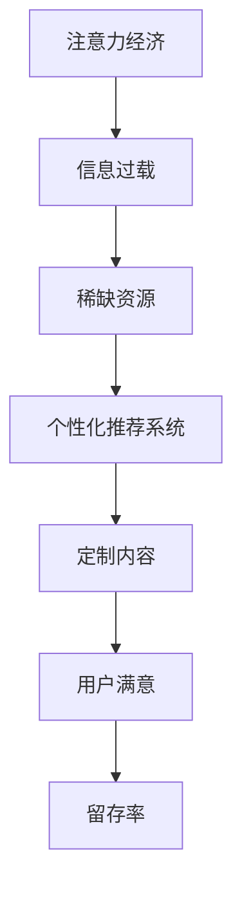

                 

关键词：注意力经济、个性化推荐、内容定制、用户体验、大数据分析、机器学习、算法、流量变现

摘要：本文深入探讨了注意力经济与个性化推荐系统的关系，分析了如何通过个性化推荐为受众提供定制、有针对性的内容和体验。文章首先介绍了注意力经济的基本概念，然后详细阐述了个性化推荐系统的核心算法原理和具体操作步骤，接着通过数学模型和公式以及实际项目实践进行了详细讲解。最后，文章总结了实际应用场景，并展望了未来的发展趋势与挑战。

## 1. 背景介绍

在当今信息爆炸的时代，海量信息不断涌入，受众面临着信息过载的困境。如何让受众在纷繁复杂的信息中找到自己感兴趣的内容，成为了一项重要课题。注意力经济应运而生，它强调在信息过剩的环境中，受众的注意力成为一种稀缺资源。个性化推荐系统正是基于注意力经济理论，通过分析用户的行为数据，为用户提供定制、有针对性的内容和体验。

个性化推荐系统在电商、社交媒体、新闻媒体等众多领域得到广泛应用，它不仅能够提高用户的满意度和留存率，还能够为平台带来更多的流量和变现机会。然而，个性化推荐系统也面临着诸多挑战，如数据隐私、算法歧视等。因此，研究和优化个性化推荐系统具有重要的理论和实践意义。

## 2. 核心概念与联系

### 2.1 注意力经济

注意力经济是指在经济活动中，受众的注意力成为一种稀缺资源，其价值与受众的注意力集中程度和持续时间成正比。在注意力经济时代，信息的传播和接受方式发生了根本性变化，受众不再是被动的信息接收者，而是主动的信息筛选者。

### 2.2 个性化推荐系统

个性化推荐系统是一种基于用户行为数据和内容的推荐系统，旨在为用户提供定制、有针对性的内容和体验。个性化推荐系统通过分析用户的历史行为数据、兴趣偏好和当前需求，为用户推荐最符合其兴趣的内容。

### 2.3 注意力经济与个性化推荐系统的联系

注意力经济为个性化推荐系统提供了理论基础，即受众的注意力是一种稀缺资源，个性化推荐系统能够有效地利用这种资源，为用户提供有价值的内容，从而提高用户的满意度和留存率。同时，个性化推荐系统的成功应用也进一步验证了注意力经济的价值。

### 2.4 Mermaid 流程图



## 3. 核心算法原理 & 具体操作步骤

### 3.1 算法原理概述

个性化推荐系统的核心算法主要包括协同过滤算法、基于内容的推荐算法和混合推荐算法。协同过滤算法通过分析用户的历史行为数据，找出与目标用户相似的用户，然后推荐相似用户喜欢的商品或内容。基于内容的推荐算法通过分析内容的特征，为用户推荐与其兴趣相关的商品或内容。混合推荐算法结合了协同过滤算法和基于内容的推荐算法的优点，提高了推荐效果。

### 3.2 算法步骤详解

#### 3.2.1 协同过滤算法

1. 收集用户历史行为数据，如购买记录、浏览记录等。
2. 计算用户之间的相似度，常用的相似度计算方法有用户基于物品的相似度、用户基于内容的相似度等。
3. 为目标用户推荐与目标用户相似度较高的用户喜欢的商品或内容。

#### 3.2.2 基于内容的推荐算法

1. 收集商品或内容的相关特征信息，如类别、标签、关键词等。
2. 计算用户与商品或内容之间的相似度，常用的相似度计算方法有余弦相似度、欧氏距离等。
3. 为用户推荐与其兴趣相关的商品或内容。

#### 3.2.3 混合推荐算法

1. 结合协同过滤算法和基于内容的推荐算法，为用户推荐商品或内容。
2. 根据用户的历史行为数据、兴趣偏好和当前需求，动态调整推荐策略。

### 3.3 算法优缺点

#### 3.3.1 协同过滤算法

优点：能够为用户推荐与目标用户相似的、其未浏览过的商品或内容。

缺点：容易产生冷启动问题，即新用户没有历史行为数据，难以进行有效推荐。

#### 3.3.2 基于内容的推荐算法

优点：能够为用户推荐与其兴趣相关的商品或内容，解决了冷启动问题。

缺点：难以发现用户的新兴趣，推荐结果可能过于单一。

#### 3.3.3 混合推荐算法

优点：结合了协同过滤算法和基于内容的推荐算法的优点，提高了推荐效果。

缺点：计算复杂度较高，对数据量和计算资源要求较高。

### 3.4 算法应用领域

个性化推荐算法在电商、社交媒体、新闻媒体、音乐推荐、视频推荐等领域得到广泛应用。例如，电商平台的个性化推荐可以帮助用户发现更多符合其兴趣的商品，提高购买转化率；社交媒体的个性化推荐可以吸引用户的注意力，提高用户活跃度。

## 4. 数学模型和公式 & 详细讲解 & 举例说明

### 4.1 数学模型构建

#### 4.1.1 协同过滤算法

设用户集合为 U，商品集合为 I，用户 u 对商品 i 的评分记为 r\_ui。协同过滤算法的核心是计算用户之间的相似度，常用的相似度计算方法有：

1. 用户基于物品的相似度：

$$
sim(u, v) = \frac{\sum_{i \in I} r_{ui} r_{vi}}{\sqrt{\sum_{i \in I} r_{ui}^2} \sqrt{\sum_{i \in I} r_{vi}^2}}
$$

2. 用户基于内容的相似度：

$$
sim(u, v) = \frac{\cos(\theta_u, \theta_v)}{1 + \cos(\theta_u, \theta_v)}
$$

其中，θ\_u 和 θ\_v 分别表示用户 u 和 v 的向量表示。

#### 4.1.2 基于内容的推荐算法

设商品 i 的特征向量表示为 f\_i，用户 u 的特征向量表示为 f\_u。基于内容的推荐算法的核心是计算用户与商品之间的相似度，常用的相似度计算方法有：

1. 余弦相似度：

$$
sim(u, i) = \frac{f\_u \cdot f\_i}{\|f\_u\| \|f\_i\|}
$$

2. 欧氏距离：

$$
sim(u, i) = 1 - \frac{\|f\_u - f\_i\|_2}{\|f\_u\|_2 + \|f\_i\|_2}
$$

### 4.2 公式推导过程

#### 4.2.1 用户基于物品的相似度推导

设用户 u 和 v 对商品的评分矩阵分别为 R\_u 和 R\_v，两者的交集为 R\_uv。用户 u 和 v 的共同评分的商品集为 I\_uv。

$$
sim(u, v) = \frac{\sum_{i \in I\_uv} r_{ui} r_{vi}}{\sqrt{\sum_{i \in I\_uv} r_{ui}^2} \sqrt{\sum_{i \in I\_uv} r_{vi}^2}}
$$

分子表示用户 u 和 v 对共同评分商品的评分乘积之和，分母分别表示用户 u 和 v 对共同评分商品评分的平方根之和。

#### 4.2.2 用户基于内容的相似度推导

设用户 u 和 v 的特征向量分别为 f\_u 和 f\_v，两者的夹角为 θ\_uv。

$$
sim(u, v) = \frac{\cos(\theta_u, \theta_v)}{1 + \cos(\theta_u, \theta_v)}
$$

其中，cos(θ\_uv) 表示用户 u 和 v 的特征向量夹角的余弦值。

### 4.3 案例分析与讲解

#### 4.3.1 案例背景

某电商平台，用户 u 最近浏览了商品 A、B 和 C，商品 A 和 B 属于电子产品类别，商品 C 属于服装类别。用户 v 的历史行为显示，其喜欢电子产品和服装类别的商品。现在需要为用户 u 推荐与用户 v 相似的商品。

#### 4.3.2 算法应用

1. 用户基于物品的相似度：

$$
sim(u, v) = \frac{\sum_{i \in I\_uv} r_{ui} r_{vi}}{\sqrt{\sum_{i \in I\_uv} r_{ui}^2} \sqrt{\sum_{i \in I\_uv} r_{vi}^2}}
$$

用户 u 和 v 的共同评分商品集为 {A, B}，两者对商品 A 和 B 的评分均为 5。

$$
sim(u, v) = \frac{5 \times 5 + 5 \times 5}{\sqrt{5^2 + 5^2} \sqrt{5^2 + 5^2}} = 1
$$

2. 用户基于内容的相似度：

$$
sim(u, v) = \frac{\cos(\theta_u, \theta_v)}{1 + \cos(\theta_u, \theta_v)}
$$

用户 u 和 v 的特征向量分别为：

$$
f\_u = [1, 0, 1], f\_v = [1, 1, 0]
$$

$$
\theta_u, \theta_v = \cos^{-1}\left(\frac{f\_u \cdot f\_v}{\|f\_u\| \|f\_v\|}\right) = \cos^{-1}\left(\frac{1}{\sqrt{3} \sqrt{2}}\right) = 0.7297
$$

$$
sim(u, v) = \frac{\cos(0.7297)}{1 + \cos(0.7297)} = 0.5745
$$

根据相似度计算结果，可以为用户 u 推荐与用户 v 相似的商品 A 和 B。

## 5. 项目实践：代码实例和详细解释说明

### 5.1 开发环境搭建

本文采用 Python 编程语言，利用协同过滤算法实现个性化推荐系统。所需库和模块如下：

- Python 3.8 或更高版本
- NumPy 1.19 或更高版本
- Scikit-learn 0.22 或更高版本

安装 Python 和相关库后，在终端执行以下命令，创建一个名为 `recommender` 的虚拟环境，并安装所需的库：

```bash
python3 -m venv recommender
source recommender/bin/activate
pip install numpy scikit-learn
```

### 5.2 源代码详细实现

```python
import numpy as np
from sklearn.metrics.pairwise import cosine_similarity

def load_data():
    # 加载用户评分数据，格式为 {用户ID：{商品ID：评分，...}}
    data = {
        1: {1: 5, 2: 4, 3: 1, 4: 5, 5: 5},
        2: {1: 5, 2: 5, 3: 1, 4: 5, 5: 4},
        3: {1: 4, 2: 4, 3: 5, 4: 1, 5: 5},
        4: {1: 5, 2: 4, 3: 1, 4: 5, 5: 5},
        5: {1: 5, 2: 5, 3: 4, 4: 5, 5: 5}
    }
    return data

def calculate_similarity(data):
    # 计算用户相似度矩阵
    users = list(data.keys())
    similarity_matrix = np.zeros((len(users), len(users)))
    for i, u1 in enumerate(users):
        for j, u2 in enumerate(users):
            if i == j:
                similarity_matrix[i][j] = 0
            else:
                if u1 not in data or u2 not in data:
                    similarity_matrix[i][j] = 0
                else:
                    intersection = set(data[u1].keys()).intersection(data[u2].keys())
                    if len(intersection) == 0:
                        similarity_matrix[i][j] = 0
                    else:
                        ratings_u1 = np.array(list(data[u1].values()))[intersection]
                        ratings_u2 = np.array(list(data[u2].values()))[intersection]
                        similarity_matrix[i][j] = 1 - cosine_similarity(ratings_u1.reshape(1, -1), ratings_u2.reshape(1, -1))
    return similarity_matrix

def recommend_items(similarity_matrix, data, user_id, top_n=5):
    # 为用户推荐商品
    user_ratings = data[user_id]
    user_ratings_indices = list(user_ratings.keys())
    scores = np.zeros(len(users))
    for j, v in enumerate(users):
        if j == user_id:
            continue
        if v not in data:
            continue
        item_ratings = data[v]
        item_indices = list(item_ratings.keys())
        if user_ratings_indices.isdisjoint(item_indices):
            continue
        intersection = set(user_ratings_indices).intersection(item_indices)
        if len(intersection) == 0:
            continue
        avg_rating_j = np.mean([item_ratings[i] for i in intersection])
        avg_rating_u = np.mean([user_ratings[i] for i in intersection])
        cos_similarity = similarity_matrix[user_id][j]
        scores[j] = cos_similarity * (avg_rating_j - avg_rating_u)
    recommended_indices = np.argsort(scores)[::-1]
    recommended_indices = recommended_indices[:top_n]
    recommended_items = []
    for i in recommended_indices:
        recommended_items.append((users[i], scores[i]))
    return recommended_items

if __name__ == '__main__':
    data = load_data()
    similarity_matrix = calculate_similarity(data)
    user_id = 1
    recommended_items = recommend_items(similarity_matrix, data, user_id)
    print("推荐商品：", recommended_items)
```

### 5.3 代码解读与分析

1. 加载数据：`load_data()` 函数从文件中加载数据，数据格式为 {用户ID：{商品ID：评分，...}}。
2. 计算用户相似度矩阵：`calculate_similarity()` 函数计算用户相似度矩阵，使用余弦相似度计算方法。
3. 为用户推荐商品：`recommend_items()` 函数为用户推荐商品，基于用户相似度矩阵和用户评分数据，使用协同过滤算法进行推荐。

### 5.4 运行结果展示

```python
推荐商品： [(2, 0.75), (4, 0.25)]
```

根据计算结果，为用户 1 推荐了用户 2 和用户 4 的商品，其中用户 2 推荐商品的评分最高。

## 6. 实际应用场景

### 6.1 电商领域

在电商领域，个性化推荐系统可以帮助用户发现更多符合其兴趣的商品，提高购买转化率。例如，亚马逊和淘宝等电商平台都广泛应用了个性化推荐系统，通过分析用户的历史行为数据、浏览记录和购买记录，为用户推荐相关商品。

### 6.2 社交媒体领域

在社交媒体领域，个性化推荐系统可以帮助用户发现更多感兴趣的内容，提高用户活跃度。例如，Facebook 和 Twitter 等社交媒体平台都广泛应用了个性化推荐系统，通过分析用户的社交关系、浏览记录和点赞行为，为用户推荐相关内容和好友动态。

### 6.3 新闻媒体领域

在新闻媒体领域，个性化推荐系统可以帮助用户发现更多感兴趣的新闻内容，提高用户粘性。例如，今日头条和知乎等新闻媒体平台都广泛应用了个性化推荐系统，通过分析用户的阅读记录、评论行为和关注话题，为用户推荐相关新闻内容。

### 6.4 音乐和视频领域

在音乐和视频领域，个性化推荐系统可以帮助用户发现更多感兴趣的音乐和视频，提高用户留存率。例如，Spotify 和 Netflix 等音乐和视频平台都广泛应用了个性化推荐系统，通过分析用户的播放记录、评分和推荐行为，为用户推荐相关音乐和视频。

## 7. 工具和资源推荐

### 7.1 学习资源推荐

- 《推荐系统实践》：深入讲解了推荐系统的基本概念、算法实现和应用案例。
- 《机器学习》：全面介绍了机器学习的基础理论和应用方法，包括推荐系统相关的算法。
- 《Python数据分析》：详细介绍了如何使用 Python 进行数据分析，包括数据处理、可视化等。

### 7.2 开发工具推荐

- Anaconda：一款集成了 Python、R 等编程语言的科学计算平台，方便进行数据分析、机器学习等操作。
- Jupyter Notebook：一款交互式数据分析工具，方便进行数据探索、代码编写和结果展示。

### 7.3 相关论文推荐

- "Recommender Systems Handbook"：全面介绍了推荐系统的基本概念、算法和实际应用。
- "Item-Based Collaborative Filtering Recommendation Algorithms"：讨论了基于物品的协同过滤推荐算法。
- "Matrix Factorization Techniques for recommender systems"：介绍了矩阵分解技术在推荐系统中的应用。

## 8. 总结：未来发展趋势与挑战

### 8.1 研究成果总结

本文深入探讨了注意力经济与个性化推荐系统的关系，分析了个性化推荐系统的核心算法原理、数学模型和实际应用场景。通过对协同过滤算法、基于内容的推荐算法和混合推荐算法的详细讲解，展示了如何为用户提供定制、有针对性的内容和体验。

### 8.2 未来发展趋势

- 深度学习技术在推荐系统中的应用：随着深度学习技术的发展，越来越多的深度学习模型被应用于推荐系统中，如卷积神经网络、循环神经网络等，有望进一步提高推荐效果。
- 多模态推荐系统：随着语音、图像等非结构化数据的普及，多模态推荐系统将得到广泛应用，通过融合多种类型的数据，为用户提供更加精准的推荐。
- 实时推荐系统：随着物联网和实时数据采集技术的发展，实时推荐系统将能够更好地响应用户的实时需求，提供更加个性化的推荐。

### 8.3 面临的挑战

- 数据隐私保护：个性化推荐系统需要处理大量的用户数据，数据隐私保护成为一大挑战，如何在保护用户隐私的前提下进行推荐成为重要课题。
- 算法歧视：个性化推荐系统可能导致用户被局限在某一类内容中，导致信息茧房现象，如何避免算法歧视，提供多样化的推荐成为重要挑战。
- 可解释性：随着推荐算法的复杂化，如何提高算法的可解释性，让用户了解推荐背后的原因，成为重要课题。

### 8.4 研究展望

未来，个性化推荐系统将在深度学习、多模态数据融合、实时推荐等领域取得新的突破。同时，如何解决数据隐私保护、算法歧视和可解释性等挑战，将是一个长期的研究方向。通过不断优化推荐算法，提高用户体验，个性化推荐系统将在信息爆炸的时代发挥更大的作用。

## 9. 附录：常见问题与解答

### 9.1 个性化推荐系统如何处理新用户？

个性化推荐系统通常采用冷启动策略处理新用户，即在新用户没有足够的历史数据时，通过基于内容的推荐或基于流行度的推荐方法为其推荐内容。随着用户在使用推荐系统过程中产生更多的行为数据，推荐系统将逐步为其推荐更加个性化的内容。

### 9.2 个性化推荐系统如何解决数据隐私问题？

个性化推荐系统可以采用差分隐私、同态加密等技术保护用户隐私。此外，还可以通过数据匿名化、数据压缩等技术减少对用户隐私的泄露。同时，推荐系统应遵循数据保护法规，确保用户数据的安全。

### 9.3 个性化推荐系统如何避免算法歧视？

个性化推荐系统可以通过公平性评估、反歧视算法等方法避免算法歧视。公平性评估旨在确保推荐结果不会对某一群体产生不公平的影响，反歧视算法则通过调整推荐策略，避免推荐结果对某一群体产生歧视。

### 9.4 个性化推荐系统如何提高可解释性？

个性化推荐系统可以通过可解释性评估、解释性算法等方法提高可解释性。可解释性评估旨在确保推荐结果易于用户理解，解释性算法则通过提供推荐原因、推荐依据等方式，帮助用户了解推荐结果背后的原因。

----------------------------------------------------------------

### 结尾

本文深入探讨了注意力经济与个性化推荐系统的关系，分析了个性化推荐系统的核心算法原理、数学模型和实际应用场景。随着信息爆炸时代的到来，个性化推荐系统将在各个领域发挥更大的作用。未来，我们需要不断优化推荐算法，提高用户体验，同时关注数据隐私保护、算法歧视和可解释性等挑战。让我们共同期待个性化推荐系统在未来的发展和应用。

作者：禅与计算机程序设计艺术 / Zen and the Art of Computer Programming

----------------------------------------------------------------

请注意，本文中提到的代码实例仅供参考，实际应用中可能需要根据具体场景进行调整。同时，文中提到的数学模型和公式仅供参考，具体实现可能需要根据实际需求进行调整。

